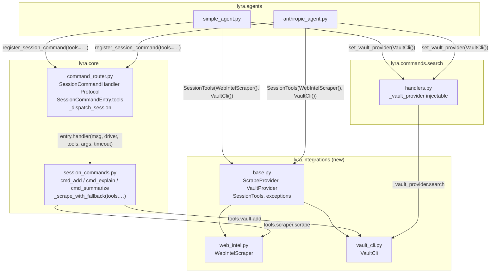
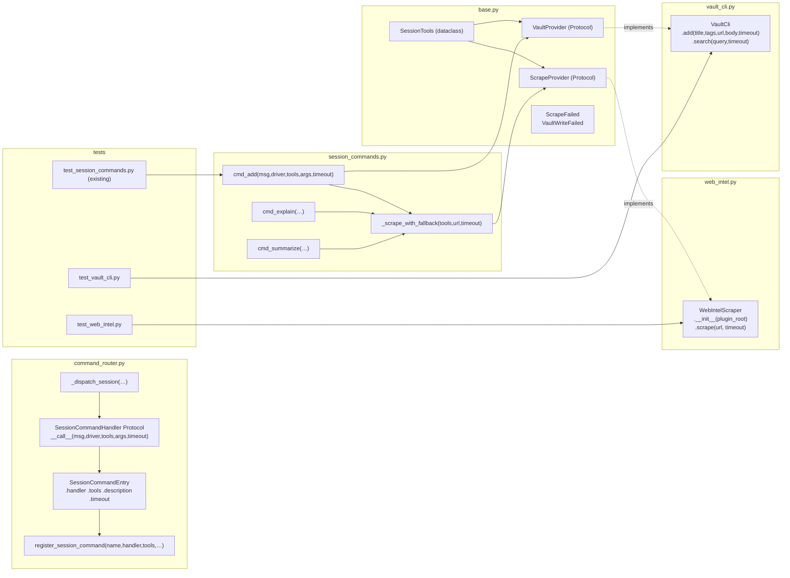

## Summary

Migrate `session_helpers.py` subprocess logic out of `lyra.core` into a new `lyra.integrations`
module by introducing `ScrapeProvider` and `VaultProvider` Protocols. Session commands receive
a `SessionTools` dataclass via injection at registration time, mirroring the `LlmProvider`
driver pattern. `session_helpers.py` is deleted. All behaviour is preserved.

## Architecture





## Agents

| Agent | Tasks | Files |
|-------|-------|-------|
| backend-dev | V1–V6 implementation (14 tasks) | integrations/, core/, agents/, commands/ |
| tester | V7 test migration (5 tasks) | tests/integrations/, delete test_session_helpers.py |

## Consistency Report

| Metric | Count |
|--------|-------|
| Spec criteria covered | 14/14 |
| Uncovered criteria | 0 |
| Untraced tasks | 0 |
| Exemptions | 0 |

---

## Micro-Tasks

### V1 — Protocols + base  `[SC-1]`

---

**T1.1** Create integrations package
File: `src/lyra/integrations/__init__.py`
```python
"""lyra.integrations — external tool provider implementations."""
```
Verify: `python -c "import lyra.integrations"`
Expected: no ImportError
Time: 2 min | Agent: backend-dev | `[P: N]` | Phase: RED | Difficulty: 1

---

**T1.2** Define ScrapeProvider, VaultProvider Protocols, SessionTools, exceptions
File: `src/lyra/integrations/base.py`
```python
from __future__ import annotations
from dataclasses import dataclass
from typing import Protocol, runtime_checkable

class ScrapeFailed(Exception):
    def __init__(self, reason: str) -> None:
        self.reason = reason
        super().__init__(reason)

class VaultWriteFailed(Exception): ...

@runtime_checkable
class ScrapeProvider(Protocol):
    async def scrape(self, url: str, timeout: float = 30.0) -> str: ...

@runtime_checkable
class VaultProvider(Protocol):
    async def add(self, title: str, tags: list[str], url: str, body: str, timeout: float = 30.0) -> None: ...
    async def search(self, query: str, timeout: float = 30.0) -> str: ...

@dataclass
class SessionTools:
    scraper: ScrapeProvider
    vault: VaultProvider
```
Verify: `python -c "from lyra.integrations.base import ScrapeProvider, VaultProvider, SessionTools, ScrapeFailed, VaultWriteFailed"`
Expected: no ImportError
Time: 5 min | Agent: backend-dev | `[P: N]` | Phase: RED | Spec: SC-1 | Difficulty: 2

---

**RED-GATE V1:** `uv run pytest tests/ -x -q 2>&1 | tail -5` — suite must still pass before V2.

---

### V2 — WebIntelScraper  `[SC-2]`

---

**T2.1** Implement WebIntelScraper
File: `src/lyra/integrations/web_intel.py`
```python
import asyncio, json, logging, os
from asyncio.subprocess import PIPE
from pathlib import Path
from lyra.integrations.base import ScrapeProvider, ScrapeFailed

log = logging.getLogger(__name__)

class WebIntelScraper:
    """ScrapeProvider backed by the web-intel roxabi plugin."""
    def __init__(self, plugin_root: Path | None = None) -> None:
        raw = os.environ.get("LYRA_WEB_INTEL_PATH")
        self._root = Path(raw).expanduser() if raw else (
            plugin_root or Path.home() / "projects" / "roxabi-plugins" / "plugins" / "web-intel"
        )

    async def scrape(self, url: str, timeout: float = 30.0) -> str:
        scraper = self._root / "scripts" / "scraper.py"
        try:
            proc = await asyncio.create_subprocess_exec(
                "uv", "run", "python", str(scraper), url,
                stdout=PIPE, stderr=PIPE, cwd=str(self._root),
            )
            try:
                stdout, stderr = await asyncio.wait_for(proc.communicate(), timeout=timeout)
            except asyncio.TimeoutError:
                proc.kill()
                raise ScrapeFailed("timeout")
            if proc.returncode != 0:
                log.warning("WebIntelScraper: exited %d: %s", proc.returncode, stderr.decode()[:200])
                raise ScrapeFailed("subprocess_error")
        except FileNotFoundError:
            raise ScrapeFailed("not_available")
        try:
            result = json.loads(stdout.decode())
        except (json.JSONDecodeError, UnicodeDecodeError):
            raise ScrapeFailed("subprocess_error")
        if not result.get("success"):
            raise ScrapeFailed("subprocess_error")
        text = result.get("data", {}).get("text", "")
        if not text:
            raise ScrapeFailed("subprocess_error")
        return text
```
Verify: `python -c "from lyra.integrations.web_intel import WebIntelScraper; from lyra.integrations.base import ScrapeProvider; assert isinstance(WebIntelScraper(), ScrapeProvider)"`
Expected: no error
Time: 8 min | Agent: backend-dev | `[P: N]` | Phase: RED | Spec: SC-2 | Difficulty: 3

---

**RED-GATE V2:** `uv run pytest tests/integrations/test_web_intel.py -x -q` — all web_intel tests pass.

---

### V3 — VaultCli  `[SC-3]`

---

**T3.1** Implement VaultCli
File: `src/lyra/integrations/vault_cli.py`
```python
import asyncio, json, logging
from asyncio.subprocess import PIPE
from lyra.integrations.base import VaultProvider, VaultWriteFailed

log = logging.getLogger(__name__)

class VaultCli:
    """VaultProvider backed by the vault CLI."""

    async def add(self, title: str, tags: list[str], url: str, body: str, timeout: float = 30.0) -> None:
        metadata: dict = {"url": url}
        if tags:
            metadata["tags"] = tags
        args = ["vault", "put", body, "--title", title,
                "--category", "references", "--type", "bookmark",
                "--metadata", json.dumps(metadata)]
        try:
            proc = await asyncio.create_subprocess_exec(*args, stdout=PIPE, stderr=PIPE)
            try:
                _, stderr = await asyncio.wait_for(proc.communicate(), timeout=timeout)
            except asyncio.TimeoutError:
                proc.kill()
                raise VaultWriteFailed("timeout")
            if proc.returncode != 0:
                log.warning("VaultCli.add: exited %d: %s", proc.returncode, stderr.decode()[:200])
                raise VaultWriteFailed("subprocess_error")
        except FileNotFoundError:
            raise VaultWriteFailed("not_available")

    async def search(self, query: str, timeout: float = 30.0) -> str:
        try:
            proc = await asyncio.create_subprocess_exec(
                "vault", "search", query, stdout=PIPE, stderr=PIPE
            )
            try:
                stdout, _ = await asyncio.wait_for(proc.communicate(), timeout=timeout)
            except asyncio.TimeoutError:
                proc.kill()
                return "vault search timed out."
            if proc.returncode != 0:
                return "Search returned no results."
            return stdout.decode()
        except FileNotFoundError:
            return "vault CLI not available."
```
Verify: `python -c "from lyra.integrations.vault_cli import VaultCli; from lyra.integrations.base import VaultProvider; assert isinstance(VaultCli(), VaultProvider)"`
Expected: no error
Time: 8 min | Agent: backend-dev | `[P: N]` | Phase: RED | Spec: SC-3 | Difficulty: 3

---

**RED-GATE V3:** `uv run pytest tests/integrations/test_vault_cli.py -x -q` — all vault_cli tests pass.

---

### V4+5 — Wire + delete (ATOMIC)  `[SC-4, SC-5, SC-6, SC-7, SC-8, SC-9, SC-10, SC-12]`

> All tasks in this slice land in a single commit. Partial state breaks dispatch.

---

**T4.1** Update `SessionCommandHandler` Protocol + `SessionCommandEntry`
File: `src/lyra/core/command_router.py` (lines 58–76)
```python
# import addition at top:
from lyra.integrations.base import SessionTools

@runtime_checkable
class SessionCommandHandler(Protocol):
    """Async handler: (msg, driver, tools, args, timeout) -> Response."""
    async def __call__(
        self,
        msg: InboundMessage,
        driver: "LlmProvider",
        tools: SessionTools,
        args: list[str],
        timeout: float,
    ) -> Response: ...

@dataclass(frozen=True)
class SessionCommandEntry:
    handler: SessionCommandHandler
    tools: SessionTools          # required — no default
    description: str = ""
    timeout: float = 60.0
```
Verify: `uv run pyright src/lyra/core/command_router.py 2>&1 | grep -c "error"` → 0
Time: 5 min | Agent: backend-dev | `[P: N]` | Phase: GREEN | Spec: SC-4, SC-5 | Difficulty: 3

---

**T4.2** Update `register_session_command` + `_dispatch_session`
File: `src/lyra/core/command_router.py` (lines 213–285)
```python
def register_session_command(
    self,
    name: str,
    handler: SessionCommandHandler,
    tools: SessionTools,          # required, no default
    description: str = "",
    timeout: float = 60.0,
) -> None:
    ...
    self._session_handlers[cmd] = SessionCommandEntry(
        handler=handler,
        tools=tools,
        description=description,
        timeout=timeout,
    )

async def _dispatch_session(self, name, args, msg, pool) -> Response:
    entry = self._session_handlers[name]
    ...
    return await asyncio.wait_for(
        entry.handler(msg, self._session_driver, entry.tools, args, entry.timeout),
        timeout=entry.timeout,
    )
```
Verify: `uv run pyright src/lyra/core/command_router.py 2>&1 | grep -c "error"` → 0
Time: 5 min | Agent: backend-dev | `[P: N]` | Phase: GREEN | Spec: SC-6, SC-7 | Difficulty: 3

---

**T4.3** Update session_commands.py — handler signatures + `_scrape_with_fallback`
File: `src/lyra/core/session_commands.py`
```python
# Remove: from lyra.core.session_helpers import ...
# Add:
from lyra.integrations.base import ScrapeFailed, SessionTools, VaultWriteFailed

async def _scrape_with_fallback(tools: SessionTools, url: str, timeout: float) -> str:
    try:
        return await tools.scraper.scrape(url, timeout=timeout)
    except ScrapeFailed as exc:
        if exc.reason == "not_available":
            return f"[scraping unavailable] {url}"
        if exc.reason == "timeout":
            return f"[scrape timed out] {url}"
        return f"[scrape failed] {url}"

async def cmd_add(msg, driver, tools: SessionTools, args, timeout) -> Response:
    ...
    scraped = await _scrape_with_fallback(tools, url, timeout=timeout / 3)
    ...
    await tools.vault.add(title, tags, url, llm_text, timeout=timeout / 3)

# same signature update for cmd_explain and cmd_summarize
```
Verify: `uv run pyright src/lyra/core/session_commands.py 2>&1 | grep -c "error"` → 0
Time: 8 min | Agent: backend-dev | `[P: N]` | Phase: GREEN | Spec: SC-8, SC-12 | Difficulty: 3

---

**T4.4** Update agents — construct SessionTools and inject
Files: `src/lyra/agents/simple_agent.py`, `src/lyra/agents/anthropic_agent.py`
```python
# In both agents' _register_session_commands():
from lyra.integrations.base import SessionTools
from lyra.integrations.web_intel import WebIntelScraper
from lyra.integrations.vault_cli import VaultCli

tools = SessionTools(scraper=WebIntelScraper(), vault=VaultCli())
self.command_router.register_session_command("vault-add", cmd_add, tools=tools, ...)
self.command_router.register_session_command("explain", cmd_explain, tools=tools, ...)
self.command_router.register_session_command("summarize", cmd_summarize, tools=tools, ...)
```
Verify: `uv run pyright src/lyra/agents/simple_agent.py src/lyra/agents/anthropic_agent.py 2>&1 | grep -c "error"` → 0
Time: 5 min | Agent: backend-dev | `[P: N]` | Phase: GREEN | Spec: SC-9 | Difficulty: 2

---

**T4.5** Delete `src/lyra/core/session_helpers.py`
```bash
git rm src/lyra/core/session_helpers.py
```
Verify: `python -c "import lyra.core.session_helpers"` → ImportError (expected)
Time: 2 min | Agent: backend-dev | `[P: N]` | Phase: REFACTOR | Spec: SC-10 | Difficulty: 1

---

**RED-GATE V4+5:** `uv run pytest tests/ -x -q 2>&1 | tail -5` — full suite green after atomic commit.

---

### V6 — Search plugin migration  `[SC-11]`

---

**T6.1** Add module-level VaultProvider injectable to search handlers
File: `src/lyra/commands/search/handlers.py`
```python
from __future__ import annotations
from lyra.integrations.base import VaultProvider
from lyra.core.message import InboundMessage, Response
from lyra.core.pool import Pool

_vault_provider: VaultProvider | None = None

def set_vault_provider(vp: VaultProvider) -> None:
    global _vault_provider
    _vault_provider = vp

async def cmd_search(msg: InboundMessage, pool: Pool, args: list[str]) -> Response:
    if not args:
        return Response(content="Usage: /search <query>")
    query = " ".join(args)
    if _vault_provider is None:
        return Response(content="vault CLI not available.")
    result = await _vault_provider.search(query, timeout=25.0)
    return Response(content=result)
```
Verify: `uv run pyright src/lyra/commands/search/handlers.py 2>&1 | grep -c "error"` → 0
Time: 5 min | Agent: backend-dev | `[P: N]` | Phase: GREEN | Spec: SC-11 | Difficulty: 2

---

**T6.2** Call `set_vault_provider` from agents at startup
Files: `src/lyra/agents/simple_agent.py`, `src/lyra/agents/anthropic_agent.py`
```python
# In _register_session_commands(), after constructing VaultCli():
from lyra.commands.search import handlers as _search_handlers
_search_handlers.set_vault_provider(tools.vault)
```
Verify: `uv run pytest tests/ -k "search" -x -q` → passes
Time: 3 min | Agent: backend-dev | `[P: N]` | Phase: GREEN | Spec: SC-11 | Difficulty: 2

---

**RED-GATE V6:** `uv run pytest tests/ -x -q 2>&1 | tail -5` — full suite still green.

---

### V7 — Test migration  `[SC-13, SC-14]`

---

**T7.1** Create `tests/integrations/__init__.py`
```python
```
Verify: `python -c "import tests.integrations"` (or pytest discovery)
Time: 1 min | Agent: tester | `[P: Y]` | Phase: RED | Difficulty: 1

---

**T7.2** Write `tests/integrations/test_web_intel.py`
File: `tests/integrations/test_web_intel.py`
Migrate and update all `TestScrapeUrl` tests from `test_session_helpers.py`:
- `test_happy_path_returns_text` — mock subprocess, return `{"success":true,"data":{"text":"…"}}`
- `test_file_not_found_raises_not_available` — `FileNotFoundError` → `ScrapeFailed("not_available")`
- `test_nonzero_exit_raises_subprocess_error`
- `test_timeout_raises_scrape_failed_timeout`
- `test_url_is_last_positional_arg` — verify `calls[0][-1] == url`

Import from `lyra.integrations.web_intel` and `lyra.integrations.base`.
Verify: `uv run pytest tests/integrations/test_web_intel.py -v` → all pass
Time: 8 min | Agent: tester | `[P: Y]` | Phase: RED | Spec: SC-13 | Difficulty: 2

---

**T7.3** Write `tests/integrations/test_vault_cli.py`
File: `tests/integrations/test_vault_cli.py`
Migrate and update all `TestVaultAdd` + `TestVaultSearch` tests from `test_session_helpers.py`:
- `test_happy_path_add` — `vault put <body>` called with correct positional + flags
- `test_tags_in_metadata_json` — tags appear in `--metadata` JSON (not `--tags`)
- `test_file_not_found_raises_vault_write_failed`
- `test_nonzero_exit_raises_vault_write_failed`
- `test_search_happy_path`
- `test_search_file_not_found_returns_graceful`
- `test_search_nonzero_returns_no_results`

Import from `lyra.integrations.vault_cli` and `lyra.integrations.base`.
Verify: `uv run pytest tests/integrations/test_vault_cli.py -v` → all pass
Time: 8 min | Agent: tester | `[P: Y]` | Phase: RED | Spec: SC-13 | Difficulty: 2

---

**T7.4** Delete `tests/core/test_session_helpers.py`
```bash
git rm tests/core/test_session_helpers.py
```
Verify: `ls tests/core/test_session_helpers.py` → No such file
Time: 1 min | Agent: tester | `[P: N]` | Phase: REFACTOR | Spec: SC-13 | Difficulty: 1

---

**T7.5** Final full-suite green check
```bash
uv run pytest tests/ -q 2>&1 | tail -10
```
Expected: 0 failures, no import errors from deleted files
Time: 3 min | Agent: tester | `[P: N]` | Phase: REFACTOR | Spec: SC-14 | Difficulty: 1

---

**RED-GATE V7 (FINAL):** Full suite passes. `session_helpers.py` gone. `test_session_helpers.py` gone. All 14 criteria verified.
