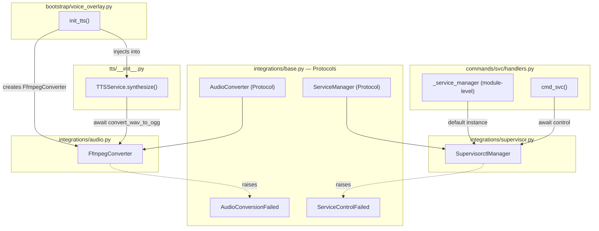
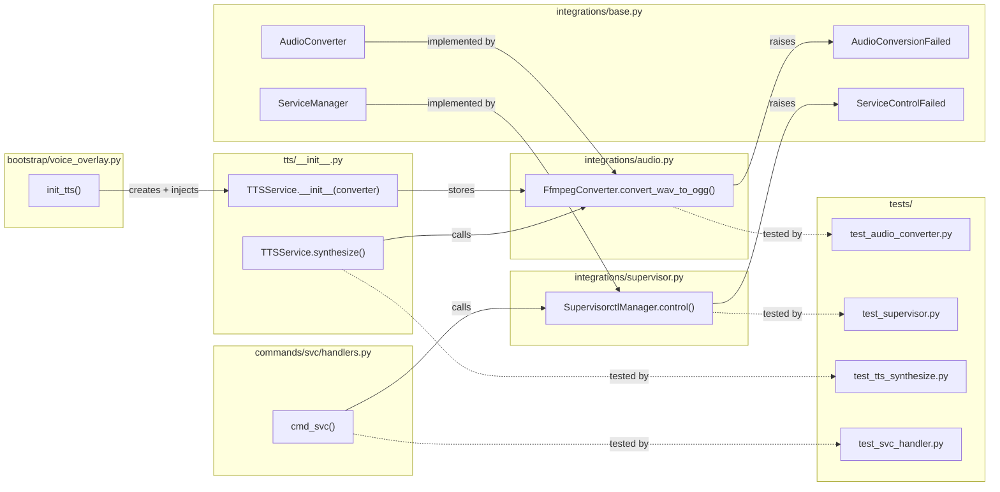

## Summary

Add `AudioConverter` and `ServiceManager` protocols to `lyra.integrations`, with `FfmpegConverter` and `SupervisorctlManager` implementations. Wire into existing consumers (`TTSService` via constructor DI, `cmd_svc` via module-level default). Follows the exact pattern established by `ScrapeProvider`/`VaultProvider` in PR #361.

## Architecture

### Data Flow

### File x Function Map

## Reference Patterns

- `integrations/vault_cli.py` — `VaultCli` implementation: async subprocess, `VaultWriteFailed` exception, `FileNotFoundError` → "not_available"
- `integrations/web_intel.py` — `WebIntelScraper` implementation: async subprocess with timeout, `ScrapeFailed` exception, same error pattern

## Agents

| Agent | Task count | Files |
|-------|-----------|-------|
| backend-dev | 8 | `integrations/base.py`, `integrations/audio.py`, `integrations/supervisor.py`, `tts/__init__.py`, `bootstrap/voice_overlay.py`, `commands/svc/handlers.py` |
| tester | 4 | `tests/integrations/test_audio_converter.py`, `tests/integrations/test_supervisor.py`, `tests/tts/test_tts_synthesize.py`, `tests/commands/test_svc_handler.py` |

## Consistency Report

- Criteria covered: 11/11
- Uncovered criteria: none
- Tasks without spec backing: none
- Gold plating exemptions applied: 0

## Micro-Tasks

### Slice V1: AudioConverter

#### Task 1: Write AudioConverter protocol conformance tests [P] → tester
- **File:** `tests/integrations/test_audio_converter.py`
- **Snippet:** `class FakeConverter: async def convert_wav_to_ogg ...` + `isinstance(FakeConverter(), AudioConverter)`
- **Verify:** `grep -q 'isinstance.*AudioConverter' tests/integrations/test_audio_converter.py` (ready)
- **Expected:** Test file exists with protocol conformance check
- **Time:** 3 min | **Difficulty:** 1
- **Traces:** SC-10 (stub satisfies protocol)
- **Phase:** RED

#### Task 2: Write TTSService converter injection tests [P] → tester
- **File:** `tests/tts/test_tts_synthesize.py`
- **Snippet:** `async def test_synthesize_uses_injected_converter ...` (mock AudioConverter, verify convert_wav_to_ogg called)
- **Verify:** `grep -q 'injected_converter\|mock.*converter' tests/tts/test_tts_synthesize.py` (ready)
- **Expected:** Test stubs AudioConverter, asserts it is called during synthesize
- **Time:** 4 min | **Difficulty:** 2
- **Traces:** SC-4 (TTSService accepts AudioConverter), SC-11 (behavior preserved)
- **Phase:** RED

#### RED-GATE: RED complete V1 → tester
- **Verify:** All test tasks for V1 marked complete
- **Phase:** RED-GATE

#### Task 3: Add AudioConverter protocol + AudioConversionFailed to base.py → backend-dev
- **File:** `src/lyra/integrations/base.py`
- **Snippet:** `class AudioConversionFailed(Exception): ...` + `@runtime_checkable class AudioConverter(Protocol): async def convert_wav_to_ogg(self, wav_path: Path, ogg_path: Path) -> None: ...`
- **Verify:** `python -c "from lyra.integrations.base import AudioConverter, AudioConversionFailed; print('OK')"` (ready)
- **Expected:** `OK`
- **Time:** 3 min | **Difficulty:** 1
- **Traces:** SC-1, SC-2 (N1)
- **Phase:** GREEN

#### Task 4: Create FfmpegConverter implementation → backend-dev
- **File:** `src/lyra/integrations/audio.py`
- **Snippet:** `class FfmpegConverter: async def convert_wav_to_ogg(self, wav_path, ogg_path): ...` using `asyncio.create_subprocess_exec`, raises `AudioConversionFailed`
- **Verify:** `python -c "from lyra.integrations.audio import FfmpegConverter; print('OK')"` (ready)
- **Expected:** `OK`
- **Time:** 5 min | **Difficulty:** 2
- **Traces:** SC-3 (N2)
- **Phase:** GREEN

#### Task 5: Update TTSService to accept and use AudioConverter → backend-dev
- **File:** `src/lyra/tts/__init__.py`
- **Snippet:** `def __init__(self, config, converter=None): self._converter = converter or FfmpegConverter()` + update `synthesize()` to `ogg_path = merged_wav.with_suffix(".ogg"); await self._converter.convert_wav_to_ogg(merged_wav, ogg_path); extra_paths.append(ogg_path)`
- **Verify:** `python -c "from lyra.tts import TTSService; print('OK')"` (ready)
- **Expected:** `OK`
- **Time:** 5 min | **Difficulty:** 3
- **Traces:** SC-4 (S1, U1)
- **Phase:** GREEN

#### Task 6: Wire FfmpegConverter in bootstrap/voice_overlay.py → backend-dev
- **File:** `src/lyra/bootstrap/voice_overlay.py`
- **Snippet:** `from lyra.integrations.audio import FfmpegConverter` + `TTSService(tts_cfg, converter=FfmpegConverter())`
- **Verify:** `grep -q 'FfmpegConverter' src/lyra/bootstrap/voice_overlay.py` (ready)
- **Expected:** FfmpegConverter imported and passed to TTSService
- **Time:** 2 min | **Difficulty:** 1
- **Traces:** SC-5 (B1)
- **Phase:** GREEN

### Slice V2: ServiceManager

#### Task 7: Write ServiceManager protocol conformance tests [P] → tester
- **File:** `tests/integrations/test_supervisor.py`
- **Snippet:** `class FakeManager: async def control ...` + `isinstance(FakeManager(), ServiceManager)`
- **Verify:** `grep -q 'isinstance.*ServiceManager' tests/integrations/test_supervisor.py` (ready)
- **Expected:** Test file exists with protocol conformance check
- **Time:** 3 min | **Difficulty:** 1
- **Traces:** SC-10 (stub satisfies protocol)
- **Phase:** RED

#### Task 8: Write cmd_svc handler tests with mock ServiceManager [P] → tester
- **File:** `tests/commands/test_svc_handler.py`
- **Snippet:** `async def test_svc_delegates_to_service_manager ...` (monkeypatch `_service_manager`, verify `control` called)
- **Verify:** `grep -q 'service_manager\|ServiceManager' tests/commands/test_svc_handler.py` (ready)
- **Expected:** Test mocks module-level ServiceManager, asserts delegation
- **Time:** 4 min | **Difficulty:** 2
- **Traces:** SC-9 (handler uses module-level default), SC-11 (behavior preserved)
- **Phase:** RED

#### RED-GATE: RED complete V2 → tester
- **Verify:** All test tasks for V2 marked complete
- **Phase:** RED-GATE

#### Task 9: Add ServiceManager protocol + ServiceControlFailed to base.py → backend-dev
- **File:** `src/lyra/integrations/base.py`
- **Snippet:** `class ServiceControlFailed(Exception): def __init__(self, reason: Literal["timeout", "subprocess_error", "not_available"]): ...` + `@runtime_checkable class ServiceManager(Protocol): async def control(self, action: str, service: str | None) -> str: ...`
- **Verify:** `python -c "from lyra.integrations.base import ServiceManager, ServiceControlFailed; print('OK')"` (ready)
- **Expected:** `OK`
- **Time:** 3 min | **Difficulty:** 1
- **Traces:** SC-6, SC-7 (N3)
- **Phase:** GREEN

#### Task 10: Create SupervisorctlManager implementation → backend-dev
- **File:** `src/lyra/integrations/supervisor.py`
- **Snippet:** `class SupervisorctlManager: async def control(self, action, service): ...` using `asyncio.create_subprocess_exec`, 10s `wait_for`, raises `ServiceControlFailed`
- **Verify:** `python -c "from lyra.integrations.supervisor import SupervisorctlManager; print('OK')"` (ready)
- **Expected:** `OK`
- **Time:** 5 min | **Difficulty:** 2
- **Traces:** SC-8 (N4)
- **Phase:** GREEN

#### Task 11: Update cmd_svc handler to use module-level ServiceManager → backend-dev
- **File:** `src/lyra/commands/svc/handlers.py`
- **Snippet:** `_service_manager: ServiceManager = SupervisorctlManager()` + replace inline subprocess with `output = await _service_manager.control(action, service)` + catch `ServiceControlFailed`
- **Verify:** `grep -q '_service_manager' src/lyra/commands/svc/handlers.py` (ready)
- **Expected:** Module-level ServiceManager default present
- **Time:** 5 min | **Difficulty:** 3
- **Traces:** SC-9 (S2, U2)
- **Phase:** GREEN

#### Task 12: Remove old _wav_to_ogg function and _SUPERVISORCTL constant → backend-dev
- **File:** `src/lyra/tts/__init__.py`, `src/lyra/commands/svc/handlers.py`
- **Snippet:** Delete `_wav_to_ogg` function, `import subprocess`, `_SUPERVISORCTL` constant
- **Verify:** `! grep -q 'def _wav_to_ogg\|_SUPERVISORCTL' src/lyra/tts/__init__.py src/lyra/commands/svc/handlers.py` (ready)
- **Expected:** Old direct subprocess code removed
- **Time:** 3 min | **Difficulty:** 1
- **Traces:** SC-11 (cleanup, implicit in behavior preservation)
- **Phase:** REFACTOR
