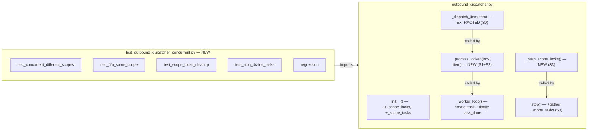

## Summary

Refactor `OutboundDispatcher` pour fan-outer les dispatches par scope via `asyncio.create_task` + per-scope locks, libérant le worker immédiatement. Scopes différents traitent en parallèle ; même scope reste FIFO. 1 extraction, 3 nouvelles méthodes, 5 nouveaux tests.

---

## Architecture

### Data Flow

```mermaid
flowchart TD
    Q["asyncio.Queue[_ITEM]"]
    W["_worker_loop()"]
    QL["_scope_locks: dict[scope_id → Lock]"]
    ST["_scope_tasks: set[Task]"]
    PL["_process_locked(lock, item)"]
    DI["_dispatch_item(item)"]
    SL["_reap_scope_locks()"]
    STOP["stop()"]

    Q -->|dequeue| W
    W -->|setdefault scope_id| QL
    W -->|create_task| PL
    W -->|task_done() immediately| Q
    PL -->|add_done_callback| ST
    PL -->|async with lock| DI
    STOP -->|cancel _worker| W
    STOP -->|gather _scope_tasks| ST
    STOP -->|reap| SL
    SL -->|del if not locked| QL
```

### File × Function Map



---

## Bootstrap Context

**Current state:** `_worker_loop` est une boucle séquentielle inline (150 lignes, lignes 145–298). Tous les tests existants passent.

**Reference patterns:**
- `tests/core/test_outbound_dispatcher_queue.py` — enqueue, circuit breaker, retries
- `tests/core/test_outbound_dispatcher_media.py` — audio/streaming
- `conftest.py:make_dispatcher_msg()` — InboundMessage avec scope_id="chat:123"

**Key invariants:**
- `InboundMessage.scope_id` toujours présent (chat:123 / channel:X / dm:Y)
- `task_done()` doit être appelé exactement une fois par item dépilé (actuellement dans `finally` ligne 297)
- Circuit breaker check avant dispatch; retries backoff (1s, 2s, 4s)

---

## Agents

- **backend-dev** — T1–T7 (outbound_dispatcher.py)
- **tester** — T8–T12 (test_outbound_dispatcher_concurrent.py)

---

## Consistency Report

**Coverage:** 9/9 success criteria tracées. **Untraced:** 0. **Uncovered:** 0.

---

## Micro-Tasks

### Slice S0 — Extract `_dispatch_item`

**T1 — Extract inline dispatch body → `_dispatch_item(item)` [GREEN]**

- **File:** `src/lyra/core/outbound_dispatcher.py`
- **Description:** Déplacer lignes 149–296 (kind branching, routing, circuit, retry, callbacks, error) dans `async def _dispatch_item(self, item: _ITEM) -> None`. `_worker_loop` devient thin.
- **Code shape:**
  ```python
  async def _dispatch_item(self, item: _ITEM) -> None:  # noqa: C901, PLR0915
      """Dispatch a single item (routing check, circuit, retry, send, callback)."""
      kind = item[0]
      if kind == "streaming":
          _, msg, payload, outbound = item
      elif kind in ("send", "audio", "audio_stream", "voice_stream", "attachment"):
          _, msg, payload = item
          outbound = None
      else:
          log.error(...)
          return
      # ... routing, circuit, retry, callback, error — exact copy from _worker_loop ...

  async def _worker_loop(self) -> None:
      """Consume the outbound queue indefinitely."""
      while True:
          item = await self._queue.get()
          try:
              await self._dispatch_item(item)
          finally:
              self._queue.task_done()
  ```
- **Verify:** `cd ~/projects/lyra && uv run pytest tests/core/test_outbound_dispatcher_queue.py tests/core/test_outbound_dispatcher_media.py -x -q`
- **Expected:** All tests pass
- **Time:** 8 min
- **Agent:** backend-dev
- **Spec trace:** S0
- **Phase:** GREEN
- **Difficulty:** 2

---

**T2 — RED-GATE: Verify all existing tests pass after extraction [RED-GATE]**

- **Verify:** `cd ~/projects/lyra && uv run pytest tests/core/test_outbound_dispatcher_queue.py tests/core/test_outbound_dispatcher_media.py -v`
- **Expected:** All 20+ tests pass. Stop if any fail.
- **Time:** 3 min
- **Agent:** backend-dev
- **Spec trace:** S0
- **Phase:** RED-GATE
- **Difficulty:** 1

---

### Slice S1+S2 — Fan-out + Task Tracking

**T3 — Add `_scope_locks` + `_scope_tasks` to `__init__` [GREEN]**

- **File:** `src/lyra/core/outbound_dispatcher.py`
- **Code:**
  ```python
  # In __init__, after self._circuit_notify_ts:
  self._scope_locks: dict[str, asyncio.Lock] = {}
  self._scope_tasks: set[asyncio.Task[None]] = set()
  ```
- **Verify:** `grep -n "_scope_locks\|_scope_tasks" src/lyra/core/outbound_dispatcher.py`
- **Expected:** 2 declarations in __init__
- **Time:** 2 min
- **Agent:** backend-dev
- **Spec trace:** S1+S2
- **Phase:** GREEN
- **Difficulty:** 1

---

**T4 — Refactor `_worker_loop`: create_task + immediate task_done [GREEN]**

- **File:** `src/lyra/core/outbound_dispatcher.py`
- **Code:**
  ```python
  async def _worker_loop(self) -> None:
      """Fan-out: dequeue → lock per scope → create_task → task_done immediately."""
      while True:
          item = await self._queue.get()
          try:
              msg: InboundMessage = item[1]
              scope_id = msg.scope_id or msg.id
              lock = self._scope_locks.setdefault(scope_id, asyncio.Lock())
              task = asyncio.create_task(
                  self._process_locked(lock, item),
                  name=f"outbound-scope-{self._platform_name}-{scope_id}",
              )
              task.add_done_callback(lambda t: self._scope_tasks.discard(t))
              self._scope_tasks.add(task)
          finally:
              self._queue.task_done()
  ```
- **Verify:** `grep -A 15 "async def _worker_loop" src/lyra/core/outbound_dispatcher.py | head -18`
- **Expected:** create_task + add_done_callback + task_done() in finally visible
- **Time:** 5 min
- **Agent:** backend-dev
- **Spec trace:** S1+S2
- **Phase:** GREEN
- **Difficulty:** 2

---

**T5 — Implement `_process_locked(lock, item)` [GREEN]**

- **File:** `src/lyra/core/outbound_dispatcher.py`
- **Code:**
  ```python
  async def _process_locked(self, lock: asyncio.Lock, item: _ITEM) -> None:
      """Serialize same-scope dispatches via lock; different scopes run concurrently."""
      async with lock:
          await self._dispatch_item(item)
  ```
- **Verify:** `grep -A 3 "async def _process_locked" src/lyra/core/outbound_dispatcher.py`
- **Expected:** async with lock → await self._dispatch_item(item)
- **Time:** 2 min
- **Agent:** backend-dev
- **Spec trace:** S1+S2
- **Phase:** GREEN
- **Difficulty:** 1

---

### Slice S3 — stop() Drain + Reaper

**T6 — Implement `_reap_scope_locks()` [GREEN]**

- **File:** `src/lyra/core/outbound_dispatcher.py`
- **Code:**
  ```python
  def _reap_scope_locks(self) -> None:
      """Remove idle scope locks (not held, no waiters)."""
      self._scope_locks = {
          scope_id: lock
          for scope_id, lock in self._scope_locks.items()
          if lock.locked()
      }
  ```
- **Verify:** `grep -A 5 "def _reap_scope_locks" src/lyra/core/outbound_dispatcher.py`
- **Time:** 2 min
- **Agent:** backend-dev
- **Spec trace:** S3
- **Phase:** GREEN
- **Difficulty:** 1

---

**T7 — Modify `stop()`: drain `_scope_tasks` before returning [GREEN]**

- **File:** `src/lyra/core/outbound_dispatcher.py`
- **Code:**
  ```python
  async def stop(self) -> None:
      """Cancel worker, drain in-flight scope tasks, reap locks."""
      if self._worker is not None:
          self._worker.cancel()
          await asyncio.gather(self._worker, return_exceptions=True)
          self._worker = None
      if self._scope_tasks:
          await asyncio.gather(*self._scope_tasks, return_exceptions=True)
      self._reap_scope_locks()
  ```
- **Verify:** `grep -A 10 "async def stop" src/lyra/core/outbound_dispatcher.py`
- **Expected:** gather(_scope_tasks) visible after cancel(_worker)
- **Time:** 3 min
- **Agent:** backend-dev
- **Spec trace:** S3
- **Phase:** GREEN
- **Difficulty:** 2

---

### Slice S4 — Tests (tester)

**T8 — Test concurrent different scopes < 150ms [RED]**

- **File:** `tests/core/test_outbound_dispatcher_concurrent.py` (NEW)
- **Code shape:**
  ```python
  async def test_concurrent_different_scopes() -> None:
      adapter = MagicMock()
      async def slow_send(msg, out): await asyncio.sleep(0.1)
      adapter.send = AsyncMock(side_effect=slow_send)
      dispatcher = OutboundDispatcher(platform_name="discord", adapter=adapter)
      await dispatcher.start()
      try:
          msg_a = make_dispatcher_msg()
          object.__setattr__(msg_a, "scope_id", "channel:A")
          msg_b = make_dispatcher_msg()
          object.__setattr__(msg_b, "scope_id", "channel:B")
          t0 = asyncio.get_event_loop().time()
          dispatcher.enqueue(msg_a, OutboundMessage.from_text("a"))
          dispatcher.enqueue(msg_b, OutboundMessage.from_text("b"))
          await asyncio.sleep(0.15)
          elapsed = asyncio.get_event_loop().time() - t0
          assert adapter.send.await_count == 2
          assert elapsed < 0.15, f"Expected concurrent, got {elapsed:.3f}s"
      finally:
          await dispatcher.stop()
  ```
- **Verify:** `cd ~/projects/lyra && uv run pytest tests/core/test_outbound_dispatcher_concurrent.py::test_concurrent_different_scopes -xvs`
- **Expected:** PASSED, elapsed < 150ms
- **Time:** 5 min
- **Agent:** tester
- **Spec trace:** S1+S2
- **Phase:** RED
- **Difficulty:** 3

---

**T9 — Test FIFO within same scope [RED]**

- **File:** `tests/core/test_outbound_dispatcher_concurrent.py`
- **Code shape:**
  ```python
  async def test_fifo_same_scope() -> None:
      call_order: list[str] = []
      adapter = MagicMock()
      async def track_send(msg, out):
          call_order.append(out.text)
          await asyncio.sleep(0.03)
      adapter.send = AsyncMock(side_effect=track_send)
      dispatcher = OutboundDispatcher(platform_name="discord", adapter=adapter)
      await dispatcher.start()
      try:
          msg = make_dispatcher_msg()
          object.__setattr__(msg, "scope_id", "channel:A")
          for label in ("msg1", "msg2", "msg3"):
              dispatcher.enqueue(msg, OutboundMessage.from_text(label))
          await asyncio.sleep(0.15)
          assert call_order == ["msg1", "msg2", "msg3"]
      finally:
          await dispatcher.stop()
  ```
- **Verify:** `cd ~/projects/lyra && uv run pytest tests/core/test_outbound_dispatcher_concurrent.py::test_fifo_same_scope -xvs`
- **Expected:** PASSED, order == ["msg1", "msg2", "msg3"]
- **Time:** 4 min
- **Agent:** tester
- **Spec trace:** S1+S2
- **Phase:** RED
- **Difficulty:** 3

---

**T10 — Test scope_locks cleaned up in stop() [GREEN]**

- **File:** `tests/core/test_outbound_dispatcher_concurrent.py`
- **Code shape:**
  ```python
  async def test_scope_locks_cleanup() -> None:
      adapter = MagicMock()
      adapter.send = AsyncMock()
      dispatcher = OutboundDispatcher(platform_name="discord", adapter=adapter)
      await dispatcher.start()
      for scope in ("A", "B", "C"):
          msg = make_dispatcher_msg()
          object.__setattr__(msg, "scope_id", f"scope:{scope}")
          dispatcher.enqueue(msg, OutboundMessage.from_text("x"))
      await asyncio.sleep(0.05)
      await dispatcher.stop()
      assert len(dispatcher._scope_locks) == 0
  ```
- **Verify:** `uv run pytest tests/core/test_outbound_dispatcher_concurrent.py::test_scope_locks_cleanup -xvs`
- **Expected:** PASSED, _scope_locks empty
- **Time:** 3 min
- **Agent:** tester
- **Spec trace:** S3
- **Phase:** GREEN
- **Difficulty:** 2

---

**T11 — Test stop() drains in-flight tasks [GREEN]**

- **File:** `tests/core/test_outbound_dispatcher_concurrent.py`
- **Code shape:**
  ```python
  async def test_stop_drains_tasks() -> None:
      completed = []
      adapter = MagicMock()
      async def slow_send(msg, out):
          await asyncio.sleep(0.1)
          completed.append("done")
      adapter.send = AsyncMock(side_effect=slow_send)
      dispatcher = OutboundDispatcher(platform_name="discord", adapter=adapter)
      await dispatcher.start()
      dispatcher.enqueue(make_dispatcher_msg(), OutboundMessage.from_text("x"))
      await asyncio.sleep(0.01)  # let task start
      await dispatcher.stop()    # must wait for the 100ms send
      assert completed == ["done"]
  ```
- **Verify:** `uv run pytest tests/core/test_outbound_dispatcher_concurrent.py::test_stop_drains_tasks -xvs`
- **Expected:** PASSED, completed == ["done"]
- **Time:** 4 min
- **Agent:** tester
- **Spec trace:** S3
- **Phase:** GREEN
- **Difficulty:** 3

---

**T12 — Full regression suite [REFACTOR]**

- **Verify:** `cd ~/projects/lyra && uv run pytest tests/core/test_outbound_dispatcher_queue.py tests/core/test_outbound_dispatcher_media.py tests/core/test_outbound_dispatcher_concurrent.py -v`
- **Expected:** All 25+ tests pass
- **Time:** 5 min
- **Agent:** tester
- **Spec trace:** General
- **Phase:** REFACTOR
- **Difficulty:** 1

---

## Summary

| | |
|-|-|
| Total tasks | 12 |
| Agents | backend-dev (7) + tester (5) |
| Dependencies | S0 → RED-GATE → S1+S2 → S3 → S4 |
| Est. time | 45–55 min |
