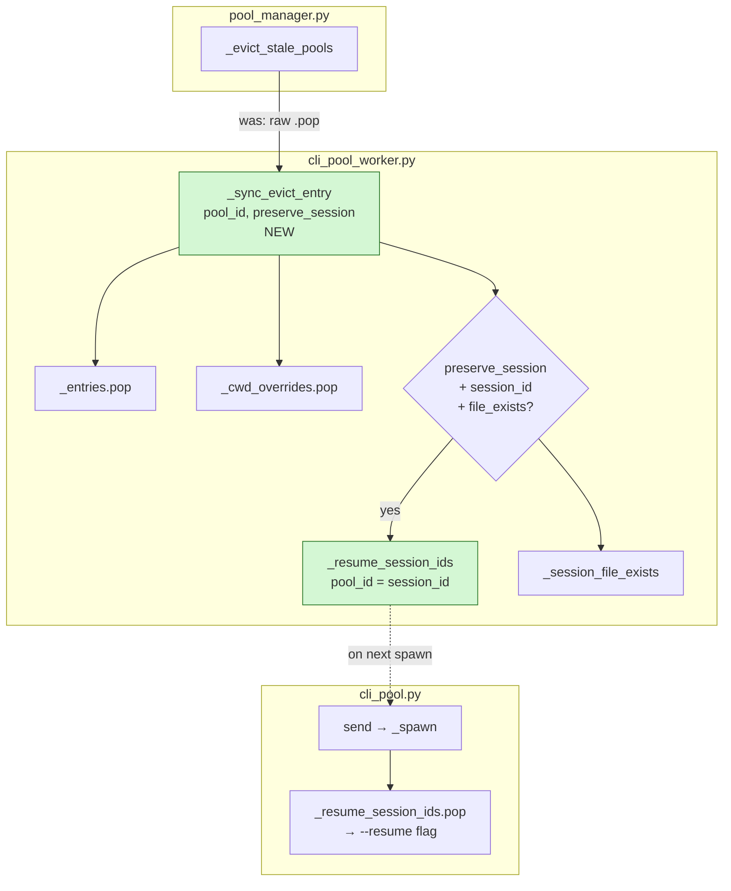
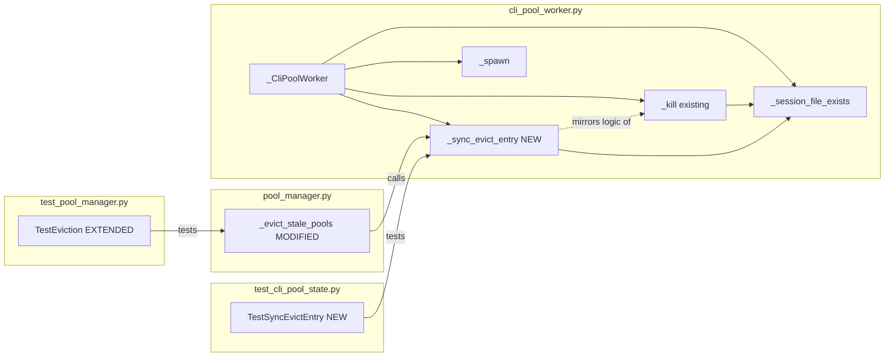

## Summary

Add `_sync_evict_entry(pool_id, *, preserve_session)` to `_CliPoolWorker` — a sync counterpart to `_kill` that handles entry management + session preservation without process termination. Wire it into `_evict_stale_pools` replacing the two raw `.pop()` calls. ~25 lines of production code, ~60 lines of tests.

## Architecture





## Reference Patterns

- `_kill` in `src/lyra/core/cli_pool_worker.py:174` — session preservation logic to mirror in `_sync_evict_entry`
- `TestKillPreservesSession` in `tests/core/test_cli_pool_state.py:272` — test class structure to follow
- `test_eviction_cleans_cli_pool_entries` in `tests/core/test_pool_manager.py:192` — eviction test pattern + `MagicMock` fixtures

## Agents

| Agent | Task count | Files |
|-------|-----------|-------|
| tester | 5 tasks | `tests/core/test_cli_pool_state.py`, `tests/core/test_pool_manager.py` |
| backend-dev | 3 tasks | `src/lyra/core/cli_pool_worker.py`, `src/lyra/core/pool_manager.py` |

## Consistency Report

| Spec criterion | Covered by task(s) | Status |
|---------------|-------------------|--------|
| SC1: `_sync_evict_entry` exists, 3-part guard | T1, T2, T5, T6 | ✓ |
| SC2: pops happen in same sync call, no yield | T2 (verify: no await in impl) | ✓ |
| SC3: `_evict_stale_pools` calls `_sync_evict_entry` | T8, T9 | ✓ |
| SC4: next `_spawn` receives `resume_session_id` | T10 | ✓ |
| SC5: no FRESH notification fires | T11 | ✓ |
| SC6: `flush_pool` unchanged | T12 | ✓ |
| SC7: `preserve_session=False` does not write | T4, T5 | ✓ |
| SC8: existing tests pass | T13 | ✓ |
| SC9: new integration test exists | T10, T11 | ✓ |

**Covered: 9/9 · Uncovered: 0 · Untraced: 0**

---

## Micro-Tasks

### V1 — `_sync_evict_entry` on `_CliPoolWorker`

---

**T1** `[RED]` · tester · `tests/core/test_cli_pool_state.py` · SC1 · 3 min · Difficulty 1

Write `TestSyncEvictEntry` class with one failing test:
`test_sync_evict_entry_preserves_session_when_file_exists`

```python
class TestSyncEvictEntry:
    def test_sync_evict_entry_preserves_session_when_file_exists(self) -> None:
        pool = CliPool()
        proc = make_fake_proc([])
        entry = _ProcessEntry(
            proc=proc, pool_id="pool-1", model_config=DEFAULT_MODEL,
            session_id="sess-abc123-deadbeef",
        )
        pool._entries["pool-1"] = entry
        pool._cwd_overrides["pool-1"] = Path("/tmp")

        with patch.object(pool, "_session_file_exists", return_value=True):
            pool._sync_evict_entry("pool-1", preserve_session=True)

        assert pool._resume_session_ids.get("pool-1") == "sess-abc123-deadbeef"
        assert "pool-1" not in pool._entries
        assert "pool-1" not in pool._cwd_overrides
```

Verify: `uv run pytest tests/core/test_cli_pool_state.py::TestSyncEvictEntry -x 2>&1 | grep "AttributeError\|FAILED\|ERROR"`
Expected: `AttributeError: 'CliPool' object has no attribute '_sync_evict_entry'`

---

**T2** `[GREEN]` · backend-dev · `src/lyra/core/cli_pool_worker.py` · SC1, SC2 · 5 min · Difficulty 2

Implement `_sync_evict_entry` in `_CliPoolWorker`, after `_kill` method. Mirror `_kill`'s session-preservation guard exactly — same 3-part condition, same dict writes, no `await`:

```python
def _sync_evict_entry(self, pool_id: str, *, preserve_session: bool = True) -> None:
    """Sync counterpart to _kill — for use in synchronous eviction paths.

    Pops the entry and cwd_override immediately (no event-loop yield).
    If preserve_session=True and the session file exists, stores session_id
    in _resume_session_ids for one-shot pickup by the next _spawn().
    Does NOT terminate the process — the idle reaper handles cleanup.
    """
    entry = self._entries.pop(pool_id, None)  # type: ignore[attr-defined]
    self._cwd_overrides.pop(pool_id, None)  # type: ignore[attr-defined]
    if entry is None:
        return
    if (
        preserve_session
        and entry.session_id
        and self._session_file_exists(entry.session_id)
    ):
        self._resume_session_ids[pool_id] = entry.session_id  # type: ignore[attr-defined]
        log.debug(
            "[pool:%s] sync_evict_entry: preserving session %s for auto-resume",
            pool_id,
            entry.session_id,
        )
```

Verify: `uv run pytest tests/core/test_cli_pool_state.py::TestSyncEvictEntry::test_sync_evict_entry_preserves_session_when_file_exists -x`
Expected: `1 passed`

---

**T3** `[RED]` `[P]` · tester · `tests/core/test_cli_pool_state.py` · SC1, SC7 · 4 min · Difficulty 1

Add 4 remaining cases to `TestSyncEvictEntry` (parallel-safe, all independent):

```python
def test_sync_evict_entry_no_preserve_when_preserve_false(self) -> None:
    # preserve_session=False → _resume_session_ids not written
    ...
    pool._sync_evict_entry("pool-1", preserve_session=False)
    assert pool._resume_session_ids.get("pool-1") is None
    assert "pool-1" not in pool._entries

def test_sync_evict_entry_no_preserve_when_session_id_none(self) -> None:
    # session_id=None → _resume_session_ids not written
    ...  # entry with session_id=None
    pool._sync_evict_entry("pool-1")
    assert pool._resume_session_ids.get("pool-1") is None

def test_sync_evict_entry_no_preserve_when_file_missing(self) -> None:
    # _session_file_exists returns False → not written
    ...
    with patch.object(pool, "_session_file_exists", return_value=False):
        pool._sync_evict_entry("pool-1")
    assert pool._resume_session_ids.get("pool-1") is None

def test_sync_evict_entry_no_op_when_entry_absent(self) -> None:
    # pool_id not in _entries → silent no-op, no KeyError
    pool = CliPool()
    pool._sync_evict_entry("nonexistent")
    assert pool._resume_session_ids.get("nonexistent") is None
```

Verify: `uv run pytest tests/core/test_cli_pool_state.py::TestSyncEvictEntry -v`
Expected: `5 passed`

---

**🔴 RED-GATE V1** · `uv run pytest tests/core/test_cli_pool_state.py -x`
Expected: all existing + new `TestSyncEvictEntry` tests pass. **Do not advance to V2 if any fail.**

---

### V2 — Wire into `_evict_stale_pools`

---

**T8** `[RED]` · tester · `tests/core/test_pool_manager.py` · SC3 · 3 min · Difficulty 1

Update `test_eviction_cleans_cli_pool_entries` to assert `_sync_evict_entry` is called instead of raw pops:

```python
async def test_eviction_cleans_cli_pool_entries(self):
    hub = _make_hub(pool_ttl=0.1)
    ...
    cli_pool = MagicMock()
    hub.cli_pool = cli_pool

    pool = hub.get_or_create_pool("pool-1", "test-agent")
    pool._last_active = time.monotonic() - 1.0
    hub._pool_manager._last_eviction_check = 0.0

    hub.get_or_create_pool("pool-2", "test-agent")

    cli_pool._sync_evict_entry.assert_called_once_with("pool-1", preserve_session=True)
```

Verify: `uv run pytest tests/core/test_pool_manager.py::TestEviction::test_eviction_cleans_cli_pool_entries -x 2>&1 | grep "FAILED\|AssertionError"`
Expected: fails (raw pop still in place)

---

**T9** `[GREEN]` · backend-dev · `src/lyra/core/pool_manager.py` · SC3 · 3 min · Difficulty 1

In `_evict_stale_pools`, replace raw pops with `_sync_evict_entry`:

```python
# Before:
if self._hub.cli_pool is not None:
    self._hub.cli_pool._entries.pop(pid, None)
    self._hub.cli_pool._cwd_overrides.pop(pid, None)

# After:
if self._hub.cli_pool is not None:
    self._hub.cli_pool._sync_evict_entry(pid, preserve_session=True)
```

Verify: `uv run pytest tests/core/test_pool_manager.py -x`
Expected: all passing including updated `test_eviction_cleans_cli_pool_entries`

---

**🔴 RED-GATE V2** · `uv run pytest tests/core/test_pool_manager.py -x`
Expected: all pool manager tests pass. **Do not advance to V3 if any fail.**

---

### V3 — Integration: TTL eviction → session auto-resumed

---

**T10** `[RED]` · tester · `tests/core/test_pool_manager.py` · SC4, SC9 · 5 min · Difficulty 2

Write `test_eviction_preserves_session_for_auto_resume` — uses a real `CliPool` (not a mock) to verify end-to-end session_id flow:

```python
async def test_eviction_preserves_session_for_auto_resume(self):
    """After TTL eviction, _resume_session_ids[pool_id] is set for next _spawn."""
    hub = _make_hub(pool_ttl=0.1)
    cli_pool = CliPool()
    hub.cli_pool = cli_pool

    # Inject a fake entry with a known session_id
    entry = _ProcessEntry(
        proc=make_fake_proc([]), pool_id="pool-1",
        model_config=DEFAULT_MODEL, session_id="sess-evict-resume",
    )
    cli_pool._entries["pool-1"] = entry

    hub.get_or_create_pool("pool-1", "test-agent")
    pool = hub.pools["pool-1"]
    pool._last_active = time.monotonic() - 1.0
    hub._pool_manager._last_eviction_check = 0.0

    with patch.object(cli_pool, "_session_file_exists", return_value=True):
        hub.get_or_create_pool("pool-2", "test-agent")

    assert cli_pool._resume_session_ids.get("pool-1") == "sess-evict-resume"
    assert "pool-1" not in cli_pool._entries
```

Verify: `uv run pytest tests/core/test_pool_manager.py::TestEviction::test_eviction_preserves_session_for_auto_resume -x 2>&1 | grep "FAILED\|passed"`
Expected: fails first (raw pop still there — wait, V2 already landed. Should pass after V2.)

---

**T11** `[RED]` `[P]` · tester · `tests/core/test_pool_manager.py` · SC5, SC9 · 4 min · Difficulty 2

Write `test_eviction_no_session_preserved_when_file_missing` (session file absent → no resume, fallthrough to Path 3):

```python
async def test_eviction_no_session_preserved_when_file_missing(self):
    """If session file is gone at eviction time, _resume_session_ids not populated."""
    hub = _make_hub(pool_ttl=0.1)
    cli_pool = CliPool()
    hub.cli_pool = cli_pool

    entry = _ProcessEntry(
        proc=make_fake_proc([]), pool_id="pool-1",
        model_config=DEFAULT_MODEL, session_id="sess-gone",
    )
    cli_pool._entries["pool-1"] = entry

    hub.get_or_create_pool("pool-1", "test-agent")
    hub.pools["pool-1"]._last_active = time.monotonic() - 1.0
    hub._pool_manager._last_eviction_check = 0.0

    with patch.object(cli_pool, "_session_file_exists", return_value=False):
        hub.get_or_create_pool("pool-2", "test-agent")

    assert cli_pool._resume_session_ids.get("pool-1") is None
    assert "pool-1" not in cli_pool._entries
```

Verify: `uv run pytest tests/core/test_pool_manager.py -v -k "eviction"`
Expected: all eviction tests pass

---

**T12** `[RED]` `[P]` · tester · `tests/core/test_pool_manager.py` · SC6 · 2 min · Difficulty 1

Assert `flush_pool` does not call `_sync_evict_entry` and does not write `_resume_session_ids`:

```python
async def test_flush_pool_does_not_preserve_session(self):
    """flush_pool (intentional disconnect) must not write _resume_session_ids."""
    hub = _make_hub()
    cli_pool = MagicMock()
    hub.cli_pool = cli_pool
    hub.get_or_create_pool("pool-1", "test-agent")

    await hub._pool_manager.flush_pool("pool-1")

    cli_pool._sync_evict_entry.assert_not_called()
```

Verify: `uv run pytest tests/core/test_pool_manager.py -v -k "flush"` · Expected: passes

---

**T13** `[GREEN]` · tester · — · SC8 · 2 min · Difficulty 1

Full suite smoke-check to confirm no regressions:

Verify: `uv run pytest tests/core/test_cli_pool_state.py tests/core/test_pool_manager.py -v`
Expected: all existing + new tests pass, 0 failures

---

**🔴 RED-GATE V3** · `uv run pytest tests/core/ -x`
Expected: full core test suite green. **Issue #370 implementation complete.**
