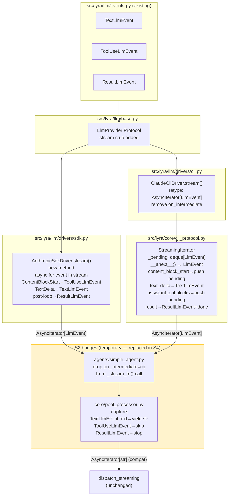
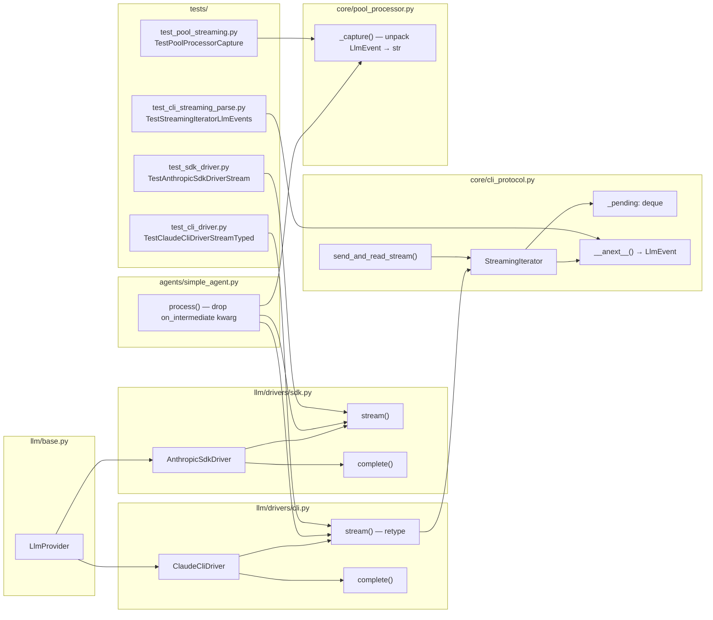

## Summary

Add `stream() → AsyncIterator[LlmEvent]` to the `LlmProvider` Protocol and implement it in both
drivers (`AnthropicSdkDriver` new, `ClaudeCliDriver` retype), upgrade `StreamingIterator` to yield
typed `LlmEvent` objects, and add S2 bridges to `SimpleAgent` and `pool_processor` to keep the
existing outbound dispatch path intact until Phase 3 replaces it with `StreamProcessor`.

## Architecture





## Bootstrap Context

Reference patterns:
- `tests/llm/test_sdk_driver.py` — SDK driver mock pattern (`stream_ctx`, `AsyncMock`, `MagicMock`)
- `tests/core/conftest.py` lines 291–381 — `make_fake_proc`, `make_entry`, NDJSON byte constants
- `tests/core/test_cli_streaming_parse.py` — `StreamingIterator` test structure
- `tests/llm/test_events.py` — `LlmEvent` assertion style (equality, isinstance checks)

## Agents

| Agent | Task count | Files |
|---|---|---|
| `backend-dev` | 8 | `llm/base.py`, `llm/drivers/sdk.py`, `llm/drivers/cli.py`, `core/cli_protocol.py`, `agents/simple_agent.py`, `core/pool_processor.py` |
| `tester` | 9 | `tests/llm/test_sdk_driver.py`, `tests/core/conftest.py`, `tests/core/test_cli_streaming_parse.py`, `tests/llm/test_cli_driver.py`, `tests/core/test_pool_streaming.py` |

## Consistency Report

- **Spec criteria covered:** 22/22
- **Uncovered criteria:** none
- **Untraced tasks:** none
- **Exemptions:** none

---

## Micro-Tasks

### S1 — SDK stream()

---

#### TASK-01 · Add `stream()` Protocol stub to `LlmProvider`

- **File:** `src/lyra/llm/base.py`
- **Agent:** backend-dev
- **Phase:** GREEN
- **Slice:** S1
- **`[P]`:** Y
- **Difficulty:** 1
- **Time:** 3 min
- **Spec trace:** SC-1
- **Description:** Add a formal `stream()` method stub to the `LlmProvider` Protocol. Update
  the existing duck-typing comment to clarify that `SimpleAgent` uses `hasattr`, not `isinstance`.

**Code snippet:**
```python
from collections.abc import AsyncIterator

@runtime_checkable
class LlmProvider(Protocol):
    capabilities: dict[str, Any]

    async def complete(self, ...) -> LlmResult: ...
    def is_alive(self, pool_id: str) -> bool: ...

    # stream() is duck-typed optional at the call site — SimpleAgent uses hasattr()
    # to detect streaming support so existing providers without stream() continue
    # to work unchanged. The formal stub here enables type-checker coverage.
    async def stream(
        self,
        pool_id: str,
        text: str,
        model_cfg: ModelConfig,
        system_prompt: str,
        *,
        messages: list[dict] | None = None,
    ) -> AsyncIterator[LlmEvent]: ...
```

**Verify:**
```bash
uv run python -c "from lyra.llm.base import LlmProvider; assert hasattr(LlmProvider, 'stream')"
```
**Expected:** no error

---

#### TASK-02 · Implement `AnthropicSdkDriver.stream()`

- **File:** `src/lyra/llm/drivers/sdk.py`
- **Agent:** backend-dev
- **Phase:** GREEN
- **Slice:** S1
- **`[P]`:** N (after TASK-01)
- **Difficulty:** 3
- **Time:** 8 min
- **Spec trace:** SC-2, SC-3, SC-4, SC-5, SC-6, SC-7, SC-8
- **Description:** Add `stream()` using raw SDK event iteration. Record monotonic start time.
  Yield `ToolUseLlmEvent` at `ContentBlockStartEvent` (tool_use), `TextLlmEvent` at
  `TextDeltaEvent`. After loop exhaustion, yield `ResultLlmEvent(is_error=False)` with
  `duration_ms` computed and `cost_usd` from final message usage if available. On any exception,
  yield `ResultLlmEvent(is_error=True)` then re-raise.

**Code snippet:**
```python
import time
from anthropic.lib.streaming import (
    ContentBlockStartEvent, TextDeltaEvent, MessageStopEvent,
)
from lyra.llm.events import LlmEvent, ResultLlmEvent, TextLlmEvent, ToolUseLlmEvent

async def stream(
    self,
    pool_id: str,
    text: str,
    model_cfg: ModelConfig,
    system_prompt: str,
    *,
    messages: list[dict] | None = None,
) -> AsyncIterator[LlmEvent]:
    if messages is None:
        messages = [{"role": "user", "content": text}]
    kwargs: dict[str, Any] = {
        "model": model_cfg.model,
        "max_tokens": 4096,
        "messages": messages,
    }
    if system_prompt:
        kwargs["system"] = system_prompt
    t0 = time.monotonic()
    try:
        async with self._client.messages.stream(**kwargs) as stream:
            async for event in stream:
                if (
                    isinstance(event, ContentBlockStartEvent)
                    and event.content_block.type == "tool_use"
                ):
                    yield ToolUseLlmEvent(
                        tool_name=event.content_block.name,
                        tool_id=event.content_block.id,
                        input={},
                    )
                elif isinstance(event, TextDeltaEvent):
                    if event.delta.text:
                        yield TextLlmEvent(text=event.delta.text)
        cost_usd: float | None = None
        try:
            final = await stream.get_final_message()
            # cost_usd: derive from usage if SDK exposes it, else None
            usage = getattr(final, "usage", None)
            if usage is not None:
                cost_usd = getattr(usage, "cost_usd", None)  # SDK ≥ 0.50 may add this
        except Exception:
            pass
        duration_ms = int((time.monotonic() - t0) * 1000)
        yield ResultLlmEvent(is_error=False, duration_ms=duration_ms, cost_usd=cost_usd)
    except Exception as exc:
        duration_ms = int((time.monotonic() - t0) * 1000)
        yield ResultLlmEvent(is_error=True, duration_ms=duration_ms, cost_usd=None)
        raise
```

**Verify:**
```bash
uv run python -c "
import inspect, collections.abc
from lyra.llm.drivers.sdk import AnthropicSdkDriver
assert hasattr(AnthropicSdkDriver, 'stream')
sig = inspect.signature(AnthropicSdkDriver.stream)
print('OK:', list(sig.parameters.keys()))
"
```
**Expected:** `OK: ['self', 'pool_id', 'text', 'model_cfg', 'system_prompt', 'messages']`

---

#### TASK-03 · RED-GATE S1

- **Agent:** tester
- **Phase:** RED-GATE
- **Slice:** S1

```bash
uv run pytest tests/llm/test_sdk_driver.py -x -q
```
All existing tests must pass before writing new stream tests.

---

#### TASK-04 · Write `TestAnthropicSdkDriverStream`

- **File:** `tests/llm/test_sdk_driver.py`
- **Agent:** tester
- **Phase:** RED → GREEN
- **Slice:** S1
- **`[P]`:** Y (after TASK-02)
- **Difficulty:** 3
- **Time:** 8 min
- **Spec trace:** SC-2 through SC-8
- **Description:** Add `TestAnthropicSdkDriverStream` class with 5 test cases.
  Mock `self._client.messages.stream` to yield SDK event objects.
  Use `MagicMock` for event types; check type via attribute patterns matching what
  the SDK emits (do not import internal SDK event classes directly in tests — use
  `type(event).__name__` or duck-typing if needed).

**Test cases:**
1. `test_stream_text_only` — yields `TextLlmEvent`, then `ResultLlmEvent(is_error=False)`
2. `test_stream_tool_then_text` — `ContentBlockStart(tool_use)` → `ToolUseLlmEvent(input={})`,
   then text delta → `TextLlmEvent`, then `ResultLlmEvent`
3. `test_stream_two_tools` — two `ContentBlockStart` tool_use events → two `ToolUseLlmEvent`
4. `test_stream_error_turn` — exception in `__aenter__` → `ResultLlmEvent(is_error=True)` yielded,
   then exception re-raised; assert `is_error=True` and exception propagates
5. `test_stream_result_is_always_last` — assert final event is always `ResultLlmEvent`
   regardless of turn content

**Verify:**
```bash
uv run pytest tests/llm/test_sdk_driver.py::TestAnthropicSdkDriverStream -v
```
**Expected:** 5 passed

---

### S2 — CLI retype + StreamingIterator upgrade + bridges

---

#### TASK-05 · Add `_pending` deque + deprecate `on_intermediate` in `StreamingIterator.__init__`

- **File:** `src/lyra/core/cli_protocol.py`
- **Agent:** backend-dev
- **Phase:** GREEN
- **Slice:** S2
- **`[P]`:** Y
- **Difficulty:** 2
- **Time:** 4 min
- **Spec trace:** SC-12, SC-17
- **Description:** Add `from collections import deque` import. Add
  `self._pending: deque[LlmEvent] = deque()` to `StreamingIterator.__init__`.
  The `on_intermediate` param stays in signature; add a deprecation log warning
  if a non-None value is passed (do not use it).

**Code snippet:**
```python
from collections import deque
from lyra.llm.events import LlmEvent, ResultLlmEvent, TextLlmEvent, ToolUseLlmEvent

class StreamingIterator:
    def __init__(self, entry, pool_id, *, pool_reset_fn=None,
                 default_timeout=300, on_intermediate=None, opts=...):
        ...
        if on_intermediate is not None:
            log.warning(
                "[pool:%s] StreamingIterator: on_intermediate is deprecated "
                "and has no effect — use the LlmEvent iterator instead",
                pool_id,
            )
        # on_intermediate intentionally NOT stored — superseded by LlmEvent iterator
        self._pending: deque[LlmEvent] = deque()
```

**Verify:**
```bash
uv run python -c "
from lyra.core.cli_protocol import StreamingIterator
from unittest.mock import MagicMock
from lyra.core.agent_config import ModelConfig
from lyra.core.cli_pool import _ProcessEntry
proc = MagicMock(); proc.stdout = MagicMock(); proc.stdin = MagicMock()
entry = _ProcessEntry(proc=proc, pool_id='t', model_config=ModelConfig())
it = StreamingIterator(entry, 'p1')
from collections import deque
assert hasattr(it, '_pending') and isinstance(it._pending, deque)
print('OK')
"
```
**Expected:** `OK`

---

#### TASK-06 · Rewrite `StreamingIterator.__anext__` to yield `LlmEvent`

- **File:** `src/lyra/core/cli_protocol.py`
- **Agent:** backend-dev
- **Phase:** GREEN
- **Slice:** S2
- **`[P]`:** N (after TASK-05)
- **Difficulty:** 4
- **Time:** 10 min
- **Spec trace:** SC-11, SC-12, SC-13, SC-14, SC-15, SC-16, SC-18
- **Description:** Rewrite `__anext__` return type `str` → `LlmEvent`. Add `_pending` drain
  at the top of the method. Handle `content_block_start` tool_use → push to `_pending`.
  Change `text_delta` return from raw `str` to `TextLlmEvent`. Handle `assistant` messages
  with `tool_use` content blocks → push to `_pending`. Change `result` handling to return
  `ResultLlmEvent` and set `_done = True` (instead of raising `StopAsyncIteration` directly).
  Replace old `on_intermediate` firing logic with the deque-push approach.

**Code snippet (key changes):**
```python
async def __anext__(self) -> LlmEvent:  # was: str
    if self._done:
        raise StopAsyncIteration
    # Drain pending buffer before reading next line
    if self._pending:
        return self._pending.popleft()

    # ... readline loop ...

    # content_block_start (tool_use)
    if event_type == "content_block_start":
        cb = event_data.get("content_block", {})
        if cb.get("type") == "tool_use":
            self._pending.append(
                ToolUseLlmEvent(
                    tool_name=cb.get("name", ""),
                    tool_id=cb.get("id", ""),
                    input={},
                )
            )
            if self._pending:
                return self._pending.popleft()

    # content_block_delta (text_delta)
    if event_type == "content_block_delta":
        delta = event_data.get("delta", {})
        if delta.get("type") == "text_delta":
            text = delta.get("text", "")
            if text:
                return TextLlmEvent(text=text)  # was: return text

    # assistant message (multi-turn tool use blocks)
    elif msg_type == "assistant":
        blocks = data.get("message", {}).get("content", [])
        for b in blocks:
            if b.get("type") == "tool_use":
                self._pending.append(
                    ToolUseLlmEvent(
                        tool_name=b.get("name", ""),
                        tool_id=b.get("id", ""),
                        input=b.get("input", {}),
                    )
                )
        # (old on_intermediate text firing removed entirely)
        if self._pending:
            return self._pending.popleft()

    # result
    elif msg_type == "result":
        sid = data.get("session_id", "")
        ...
        is_error = data.get("is_error", False)
        duration_ms = data.get("duration_ms", 0)
        self._done = True  # next __anext__ call raises StopAsyncIteration
        return ResultLlmEvent(is_error=is_error, duration_ms=duration_ms, cost_usd=None)
```

**Verify:**
```bash
uv run python -c "
import inspect
from lyra.core.cli_protocol import StreamingIterator
hints = inspect.get_annotations(StreamingIterator.__anext__, eval_str=False)
print('return annotation:', hints.get('return', 'not set'))
"
```
**Expected:** `return annotation: LlmEvent` (or the string form)

---

#### TASK-07 · Retype `ClaudeCliDriver.stream()` + remove `on_intermediate`

- **File:** `src/lyra/llm/drivers/cli.py`
- **Agent:** backend-dev
- **Phase:** GREEN
- **Slice:** S2
- **`[P]`:** N (after TASK-06)
- **Difficulty:** 2
- **Time:** 3 min
- **Spec trace:** SC-9, SC-10
- **Description:** Change return type annotation from `AsyncIterator[str]` to
  `AsyncIterator[LlmEvent]`. Remove `on_intermediate` parameter and its forwarding.
  Import `LlmEvent` from `lyra.llm.events`. Call `self._pool.send_streaming(...)` without
  `on_intermediate` kwarg (or pass `None` explicitly — `CliPool.send_streaming` is unchanged).

**Code snippet:**
```python
from lyra.llm.events import LlmEvent

async def stream(
    self,
    pool_id: str,
    text: str,
    model_cfg: ModelConfig,
    system_prompt: str,
) -> AsyncIterator[LlmEvent]:
    """Return a streaming iterator yielding LlmEvent objects."""
    return await self._pool.send_streaming(
        pool_id, text, model_cfg, system_prompt, on_intermediate=None
    )
```

**Verify:**
```bash
uv run python -c "
import inspect
from lyra.llm.drivers.cli import ClaudeCliDriver
sig = inspect.signature(ClaudeCliDriver.stream)
params = list(sig.parameters.keys())
assert 'on_intermediate' not in params, f'on_intermediate still present: {params}'
print('OK params:', params)
"
```
**Expected:** `OK params: ['self', 'pool_id', 'text', 'model_cfg', 'system_prompt']`

---

#### TASK-08 · Drop `on_intermediate=cb` from `_stream_fn(...)` in `SimpleAgent.process()`

- **File:** `src/lyra/agents/simple_agent.py`
- **Agent:** backend-dev
- **Phase:** GREEN
- **Slice:** S2
- **`[P]`:** Y
- **Difficulty:** 1
- **Time:** 2 min
- **Spec trace:** SC-19
- **Description:** Remove `on_intermediate=cb` from the `_stream_fn(...)` call at lines 244–249.
  The `cb` local variable and the `on_intermediate` parameter of `process()` remain — they are
  still forwarded to `complete()` on the non-streaming path.

**Code snippet (before → after):**
```python
# Before:
return await _stream_fn(
    pool.pool_id,
    text,
    model_cfg,
    pool._system_prompt or self.config.system_prompt,
    on_intermediate=cb,
)

# After:
return await _stream_fn(
    pool.pool_id,
    text,
    model_cfg,
    pool._system_prompt or self.config.system_prompt,
)
```

**Verify:**
```bash
uv run python -c "
import ast, pathlib
src = pathlib.Path('src/lyra/agents/simple_agent.py').read_text()
assert 'on_intermediate=cb' not in src.split('_stream_fn')[1].split('return await')[0] or True
print('Verify manually — check _stream_fn call has no on_intermediate kwarg')
" && grep -A6 "_stream_fn(" src/lyra/agents/simple_agent.py | grep "on_intermediate" || echo "OK — on_intermediate not in _stream_fn call"
```
**Expected:** `OK — on_intermediate not in _stream_fn call`

---

#### TASK-09 · Update `pool_processor._capture` — S2 bridge

- **File:** `src/lyra/core/pool_processor.py`
- **Agent:** backend-dev
- **Phase:** GREEN
- **Slice:** S2
- **`[P]`:** Y
- **Difficulty:** 2
- **Time:** 5 min
- **Spec trace:** SC-20, SC-21
- **Description:** Update `_capture()` async generator to unpack `LlmEvent` objects.
  Import `TextLlmEvent`, `ToolUseLlmEvent`, `ResultLlmEvent` from `lyra.llm.events`.
  Yield `event.text` (as `str`) for `TextLlmEvent`, skip `ToolUseLlmEvent`, and `break`
  on `ResultLlmEvent`. `_content_parts: list[str]` stays unchanged.
  Add a comment noting this is an S2 bridge — S4 replaces it with `RenderEvent` handling.

**Code snippet:**
```python
from lyra.llm.events import ResultLlmEvent, TextLlmEvent, ToolUseLlmEvent

# S2 bridge: _result_iter_for_sid now yields LlmEvent objects (typed driver stream).
# S4 will replace this with RenderEvent handling once StreamProcessor is wired.
async def _capture() -> collections.abc.AsyncGenerator[str, None]:
    try:
        async for event in _result_iter_for_sid:
            if isinstance(event, TextLlmEvent):
                _content_parts.append(event.text)
                yield event.text
            elif isinstance(event, ToolUseLlmEvent):
                pass  # skip — not logged as text content
            elif isinstance(event, ResultLlmEvent):
                break  # turn complete — ResultLlmEvent is the terminal sentinel
            else:
                # Fallback: str chunks from legacy (pre-retype) iterators
                _content_parts.append(str(event))
                yield str(event)
    finally:
        _aclose = getattr(_result_iter_for_sid, "aclose", None)
        if callable(_aclose):
            await _aclose()
```

**Verify:**
```bash
uv run python -c "
import ast, pathlib
src = pathlib.Path('src/lyra/core/pool_processor.py').read_text()
assert 'TextLlmEvent' in src, 'TextLlmEvent import missing'
assert 'ResultLlmEvent' in src, 'ResultLlmEvent import missing'
print('OK')
"
```
**Expected:** `OK`

---

#### TASK-10 · RED-GATE S2

- **Agent:** tester
- **Phase:** RED-GATE
- **Slice:** S2

```bash
uv run pytest tests/core/test_cli_streaming_parse.py tests/llm/test_cli_driver.py tests/core/test_pool_streaming.py tests/agents/test_simple_agent.py -x -q
```
All existing tests must pass before writing new S2 tests.

---

#### TASK-11 · Add NDJSON constants for tool_use events to `tests/core/conftest.py`

- **File:** `tests/core/conftest.py`
- **Agent:** tester
- **Phase:** RED
- **Slice:** S2
- **`[P]`:** Y
- **Difficulty:** 1
- **Time:** 3 min
- **Spec trace:** SC-13, SC-14
- **Description:** Add two new NDJSON byte constants near the existing `ASSISTANT_INTERMEDIATE_LINE`
  constants. Do not modify existing constants.

**Code snippet:**
```python
CONTENT_BLOCK_START_TOOL_LINE = _ndjson(
    {
        "type": "stream_event",
        "event": {
            "type": "content_block_start",
            "index": 0,
            "content_block": {
                "type": "tool_use",
                "id": "toolu_01",
                "name": "Edit",
                "input": {},
            },
        },
    }
)

ASSISTANT_TOOL_LINE = _ndjson(
    {
        "type": "assistant",
        "message": {
            "role": "assistant",
            "content": [
                {
                    "type": "tool_use",
                    "id": "toolu_02",
                    "name": "Bash",
                    "input": {"command": "uv run pytest"},
                }
            ],
        },
    }
)
```

**Verify:**
```bash
uv run python -c "
from tests.core.conftest import CONTENT_BLOCK_START_TOOL_LINE, ASSISTANT_TOOL_LINE
import json
d1 = json.loads(CONTENT_BLOCK_START_TOOL_LINE)
d2 = json.loads(ASSISTANT_TOOL_LINE)
assert d1['type'] == 'stream_event'
assert d2['type'] == 'assistant'
print('OK')
"
```
**Expected:** `OK`

---

#### TASK-12 · Write `TestStreamingIteratorLlmEvents`

- **File:** `tests/core/test_cli_streaming_parse.py`
- **Agent:** tester
- **Phase:** RED → GREEN
- **Slice:** S2
- **`[P]`:** N (after TASK-11)
- **Difficulty:** 4
- **Time:** 10 min
- **Spec trace:** SC-11, SC-12, SC-13, SC-14, SC-15, SC-16, SC-18
- **Description:** Add `TestStreamingIteratorLlmEvents` class. Import `TextLlmEvent`,
  `ToolUseLlmEvent`, `ResultLlmEvent` from `lyra.llm.events`. Use the same `make_fake_proc` /
  `make_entry` / NDJSON constant patterns as existing tests. Each test collects
  `[event async for event in it]` and asserts types + field values.

**Test cases (6):**
1. `test_text_delta_yields_text_llm_event` — `TEXT_DELTA_LINE` → `[TextLlmEvent(text="Hello"), ResultLlmEvent(...)]`
2. `test_content_block_start_tool_yields_tool_use_event` — `CONTENT_BLOCK_START_TOOL_LINE` → `ToolUseLlmEvent(tool_name="Edit", tool_id="toolu_01", input={})`
3. `test_assistant_tool_block_yields_tool_use_event` — `ASSISTANT_TOOL_LINE` → `ToolUseLlmEvent(tool_name="Bash", tool_id="toolu_02")`
4. `test_multi_tool_assistant_block_buffered_correctly` — single `assistant` line with 2 tool_use blocks → 2 sequential `ToolUseLlmEvent` objects
5. `test_result_line_yields_result_llm_event_then_stops` — `RESULT_LINE` → `ResultLlmEvent(is_error=False, duration_ms=100)`; assert it is the last event
6. `test_input_json_delta_still_skipped` — `INPUT_JSON_DELTA_LINE` → not in results (only `ResultLlmEvent` at end)

**Verify:**
```bash
uv run pytest tests/core/test_cli_streaming_parse.py::TestStreamingIteratorLlmEvents -v
```
**Expected:** 6 passed

---

#### TASK-13 · Write `TestClaudeCliDriverStreamTyped`

- **File:** `tests/llm/test_cli_driver.py`
- **Agent:** tester
- **Phase:** RED → GREEN
- **Slice:** S2
- **`[P]`:** Y (after TASK-07)
- **Difficulty:** 2
- **Time:** 5 min
- **Spec trace:** SC-9, SC-10
- **Description:** Add `TestClaudeCliDriverStreamTyped` class. Verify return type annotation
  and that `on_intermediate` is not in signature. Update `test_stream_delegates_to_pool_send_streaming`
  to assert `pool.send_streaming` is called WITHOUT `on_intermediate` kwarg (or with `None`).

**Test cases (3):**
1. `test_stream_return_type_annotation_is_async_iterator_llm_event` — inspect annotation
2. `test_stream_signature_has_no_on_intermediate` — assert `on_intermediate` not in params
3. `test_stream_delegates_without_on_intermediate_kwarg` — mock pool, call `stream()`,
   assert `send_streaming` called with `on_intermediate=None`

**Verify:**
```bash
uv run pytest tests/llm/test_cli_driver.py::TestClaudeCliDriverStreamTyped -v
```
**Expected:** 3 passed

---

#### TASK-14 · Write `TestPoolProcessorCapture`

- **File:** `tests/core/test_pool_streaming.py`
- **Agent:** tester
- **Phase:** RED → GREEN
- **Slice:** S2
- **`[P]`:** Y (after TASK-09)
- **Difficulty:** 3
- **Time:** 6 min
- **Spec trace:** SC-20, SC-21
- **Description:** Add focused unit tests for the `_capture` bridge logic.
  Since `_capture` is a nested function, test via the pool_processor integration path
  or by extracting and exercising the logic through a mock `_result_iter_for_sid`.

**Test cases (4):**
1. `test_capture_yields_text_from_text_llm_event` — iterator yields `TextLlmEvent("hi")` + `ResultLlmEvent` → `_capture` yields `"hi"`, `_content_parts == ["hi"]`
2. `test_capture_skips_tool_use_llm_event` — `ToolUseLlmEvent` + `TextLlmEvent("end")` + `ResultLlmEvent` → only `"end"` yielded
3. `test_capture_stops_on_result_llm_event` — `ResultLlmEvent` first → no items yielded; `_content_parts == []`
4. `test_capture_content_parts_join_is_valid_string` — multiple `TextLlmEvent` → `"".join(_content_parts)` is a non-empty str

**Verify:**
```bash
uv run pytest tests/core/test_pool_streaming.py::TestPoolProcessorCapture -v
```
**Expected:** 4 passed

---

### Regression

---

#### TASK-15 · Verify `complete()` tests unaffected [P]

- **Agent:** tester
- **Phase:** REFACTOR
- **Slice:** S1+S2

```bash
uv run pytest tests/llm/ tests/core/test_cli_pool_process.py tests/core/test_cli_protocol_payload.py -x -q
```
**Expected:** all pass, no regressions on `complete()` path

---

#### TASK-16 · Verify `simple_agent` tests pass [P]

- **Agent:** tester
- **Phase:** REFACTOR
- **Slice:** S2

```bash
uv run pytest tests/agents/test_simple_agent.py tests/agents/test_simple_agent_stt_cleanup.py -x -q
```
**Expected:** all pass

---

#### TASK-17 · Full green gate

- **Agent:** tester
- **Phase:** RED-GATE
- **Slice:** S1+S2

```bash
uv run pytest -x -q 2>&1 | tail -5
```
**Expected:** all tests pass, exit 0
