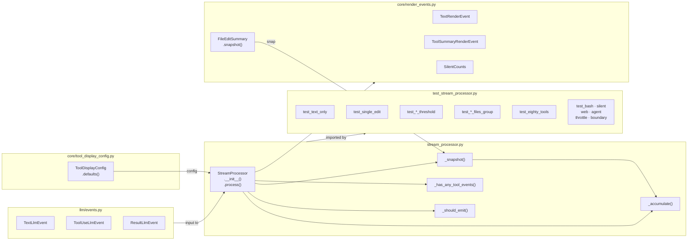

## Summary

Implement `StreamProcessor` — the channel-agnostic domain core that aggregates an
`AsyncIterator[LlmEvent]` into an `AsyncIterator[RenderEvent]` with config-driven
thresholds, per-tool visibility rules, and throttled emission. Two new files only;
all prerequisite types (`LlmEvent`, `RenderEvent`, `ToolDisplayConfig`) exist from P1/P5.

## Architecture

```mermaid
flowchart TD
    subgraph inputs["Inputs (already exist — P1/P5)"]
        LlmE["llm/events.py\nTextLlmEvent\nToolUseLlmEvent\nResultLlmEvent"]
        RE["core/render_events.py\nTextRenderEvent\nToolSummaryRenderEvent\nFileEditSummary · SilentCounts"]
        TDC["core/tool_display_config.py\nToolDisplayConfig\n.defaults() · .from_dict()"]
    end

    subgraph sp["core/stream_processor.py  ← NEW"]
        init["__init__(config)\n_files _bash _web_fetches\n_agent_calls _silent\n_last_tool_emit _pending_text"]
        acc["_accumulate(ToolUseLlmEvent)\ncase-insensitive routing\nthreshold + count mode"]
        emit["_should_emit()\nmonotonic throttle check"]
        snap["_snapshot(is_complete)\ndeep-copy accumulators\nupdate _last_tool_emit"]
        has["_has_any_tool_events()\nany accumulator non-empty\nor silent counter > 0"]
        proc["process(events) async gen\nmatch TextLlmEvent → buffer\nmatch ToolUseLlmEvent → accumulate+throttle\nmatch ResultLlmEvent → final+TextRender"]
    end

    subgraph tests["tests/core/test_stream_processor.py  ← NEW"]
        helpers["collect() · async_events()\nbase config throttle_ms=0"]
        cases["16 test methods\ntext-only · single-edit · thresholds\ntruncation · silent · throttle · boundary"]
    end

    LlmE -->|consumed by| proc
    TDC -->|injected into| init
    proc -->|yields| RE
    sp --> tests

    style sp fill:#1a3a1a,stroke:#4a9a4a
    style tests fill:#1a1a3a,stroke:#4a4a9a
    style inputs fill:#2a2a2a,stroke:#666
```





## Agents

| Agent | Tasks | Files |
|-------|-------|-------|
| backend-dev | T1–T7 (7 tasks) | `src/lyra/core/stream_processor.py` |
| tester | T8–T24 (17 tasks) | `tests/core/test_stream_processor.py` |

## Consistency Report

| Metric | Value |
|--------|-------|
| S3 success criteria covered | 11/11 |
| Uncovered criteria | none |
| Untraced tasks | T7 (refactor, no SC — structural) |
| Exemptions | T7: structural/hygiene task, no spec SC |

---

## Micro-Tasks

### Slice S3 — StreamProcessor implementation

---

**T1** · backend-dev · RED · `[parallel-safe: N]` · Difficulty 2 · ~5 min
**Create `stream_processor.py` skeleton — class, `__init__`, all accumulators**
File: `src/lyra/core/stream_processor.py`

```python
from __future__ import annotations
from collections.abc import AsyncIterator
import time
from lyra.llm.events import LlmEvent, TextLlmEvent, ToolUseLlmEvent, ResultLlmEvent
from lyra.core.render_events import (
    RenderEvent, TextRenderEvent, ToolSummaryRenderEvent,
    FileEditSummary, SilentCounts,
)
from lyra.core.tool_display_config import ToolDisplayConfig

class StreamProcessor:
    def __init__(self, config: ToolDisplayConfig | None = None) -> None:
        self._config = config or ToolDisplayConfig.defaults()
        self._files: dict[str, FileEditSummary] = {}
        self._bash: list[str] = []
        self._web_fetches: list[str] = []
        self._agent_calls: list[str] = []
        self._silent_reads = 0
        self._silent_greps = 0
        self._silent_globs = 0
        self._last_tool_emit: float | None = None
        self._pending_text = ""
```

Verify: `uv run python -c "from lyra.core.stream_processor import StreamProcessor; StreamProcessor()"`
Expected: no error, class instantiates cleanly
Spec trace: N4

---

**T2** · backend-dev · RED · `[parallel-safe: N]` · Difficulty 3 · ~8 min
**Implement `_accumulate(event: ToolUseLlmEvent)` — case-insensitive tool routing**
File: `src/lyra/core/stream_processor.py`

```python
def _accumulate(self, event: ToolUseLlmEvent) -> None:
    key = event.tool_name.lower()
    cfg = self._config
    if key in ("edit", "write"):
        entry = self._files.setdefault(
            event.tool_id,  # use path from input when available; fall back to tool_id
            FileEditSummary(path=event.input.get("path", event.tool_id))
        )
        entry.edits.append(key)
        # Replace with count-mode copy when threshold exceeded
        new_count = entry.count + 1
        new_edits = entry.edits if new_count <= cfg.names_threshold else []
        self._files[...] = FileEditSummary(path=entry.path, edits=new_edits, count=new_count)
    elif key == "bash":
        cmd = (event.input.get("command", "") or "")[:cfg.bash_max_len]
        self._bash.append(cmd)
    elif key in ("read", "grep", "glob"):
        # Always silent regardless of show config
        if key == "read":   self._silent_reads += 1
        elif key == "grep": self._silent_greps += 1
        else:               self._silent_globs += 1
    elif cfg.show.get(key, False):
        if key in ("web_fetch", "web_search"):
            self._web_fetches.append(event.input.get("url", key))
        elif key == "agent":
            self._agent_calls.append(event.input.get("description", "agent"))
```

Verify: unit tests T17 (silent), T16 (bash truncation), T18 (web_fetch)
Spec trace: N4 (accumulation rules)

---

**T3** · backend-dev · RED · `[parallel-safe: N]` · Difficulty 1 · ~2 min
**Implement `_should_emit()` — monotonic throttle gate**
File: `src/lyra/core/stream_processor.py`

```python
def _should_emit(self) -> bool:
    if self._last_tool_emit is None:
        return True
    elapsed = time.monotonic() - self._last_tool_emit
    return elapsed >= self._config.throttle_ms / 1000
```

Verify: unit tests T21 (suppression), T22 (pass-through)
Spec trace: N4 (throttle)

---

**T4** · backend-dev · RED · `[parallel-safe: N]` · Difficulty 2 · ~4 min
**Implement `_snapshot(is_complete)` — deep-copy accumulators, update `_last_tool_emit`**
File: `src/lyra/core/stream_processor.py`

```python
def _snapshot(self, is_complete: bool = False) -> ToolSummaryRenderEvent:
    self._last_tool_emit = time.monotonic()
    return ToolSummaryRenderEvent(
        files={path: entry.snapshot() for path, entry in self._files.items()},
        bash_commands=list(self._bash),
        web_fetches=list(self._web_fetches),
        agent_calls=list(self._agent_calls),
        silent_counts=SilentCounts(
            reads=self._silent_reads,
            greps=self._silent_greps,
            globs=self._silent_globs,
        ),
        is_complete=is_complete,
    )
```

Verify: emitted events have independent copies (mutating accumulator after emit ¬ affects event)
Spec trace: N4 (`_snapshot()`)

---

**T5** · backend-dev · RED · `[parallel-safe: N]` · Difficulty 1 · ~2 min
**Implement `_has_any_tool_events()`**
File: `src/lyra/core/stream_processor.py`

```python
def _has_any_tool_events(self) -> bool:
    return bool(
        self._files
        or self._bash
        or self._web_fetches
        or self._agent_calls
        or self._silent_reads
        or self._silent_greps
        or self._silent_globs
    )
```

Verify: `test_text_only` relies on this returning False for empty accumulators
Spec trace: N4 (`_has_any_tool_events()`)

---

**T6** · backend-dev · RED · `[parallel-safe: N]` · Difficulty 3 · ~8 min
**Implement `process(events)` async generator — main event loop**
File: `src/lyra/core/stream_processor.py`

```python
async def process(
    self, events: AsyncIterator[LlmEvent]
) -> AsyncIterator[RenderEvent]:
    async for event in events:
        if isinstance(event, TextLlmEvent):
            self._pending_text += event.text
        elif isinstance(event, ToolUseLlmEvent):
            self._accumulate(event)
            if self._should_emit():
                yield self._snapshot()
        elif isinstance(event, ResultLlmEvent):
            if self._has_any_tool_events():
                yield self._snapshot(is_complete=True)
            yield TextRenderEvent(text=self._pending_text, is_final=True)
```

Note: `process()` must be declared `async def` with `yield` (makes it an async generator).
Verify: `uv run pytest tests/core/test_stream_processor.py -x`
Spec trace: N4 (`process()`)

---

**T7** · backend-dev · REFACTOR · `[parallel-safe: N]` · Difficulty 1 · ~3 min
**Add `__all__`, module docstring, verify hexagonal boundary**
File: `src/lyra/core/stream_processor.py`

```python
"""Channel-agnostic StreamProcessor: LlmEvent → RenderEvent pipeline."""

__all__ = ["StreamProcessor"]
```

Verify:
```bash
grep -E "import aiogram|import discord|import anthropic" src/lyra/core/stream_processor.py | wc -l
# Expected: 0
```
Spec trace: N4 (hexagonal boundary invariant)

---

### RED-GATE: All T1–T7 micro-tasks must pass before tester tasks are considered done
`uv run pytest tests/core/test_stream_processor.py` → all green

---

**T8** · tester · RED · `[parallel-safe: Y]` · Difficulty 1 · ~3 min
**Test file setup: helpers + base config**
File: `tests/core/test_stream_processor.py`

```python
from __future__ import annotations
import pytest
from lyra.core.stream_processor import StreamProcessor
from lyra.core.tool_display_config import ToolDisplayConfig
from lyra.llm.events import TextLlmEvent, ToolUseLlmEvent, ResultLlmEvent
from lyra.core.render_events import TextRenderEvent, ToolSummaryRenderEvent

async def collect(agen) -> list:
    return [item async for item in agen]

async def async_events(*evts):
    for e in evts: yield e

def cfg(**kw) -> ToolDisplayConfig:
    """Base config with throttle disabled; override via kw."""
    defaults = dict(names_threshold=3, group_threshold=3, bash_max_len=60, throttle_ms=0)
    return ToolDisplayConfig(**{**defaults, **kw})
```

Verify: `uv run pytest tests/core/test_stream_processor.py --collect-only`
Spec trace: S3 setup

---

**T9** · tester · RED · `[parallel-safe: Y]` · Difficulty 1 · ~3 min
**`test_text_only` — no tool calls → only `TextRenderEvent`, no `ToolSummaryRenderEvent`**
File: `tests/core/test_stream_processor.py`

```python
@pytest.mark.asyncio
async def test_text_only() -> None:
    sp = StreamProcessor(config=cfg())
    events = async_events(
        TextLlmEvent(text="Hello "),
        TextLlmEvent(text="world"),
        ResultLlmEvent(is_error=False, duration_ms=100),
    )
    result = await collect(sp.process(events))
    assert len(result) == 1
    assert isinstance(result[0], TextRenderEvent)
    assert result[0].text == "Hello world"
    assert result[0].is_final is True
```

Verify: `uv run pytest tests/core/test_stream_processor.py::test_text_only -v`
Expected: PASSED
Spec trace: SC-3

---

**T10** · tester · RED · `[parallel-safe: Y]` · Difficulty 2 · ~4 min
**`test_single_edit` — 1 Edit → mid-turn ToolSummary + final ToolSummary + TextRender**
File: `tests/core/test_stream_processor.py`

```python
@pytest.mark.asyncio
async def test_single_edit() -> None:
    sp = StreamProcessor(config=cfg())
    events = async_events(
        TextLlmEvent(text="Refactoring..."),
        ToolUseLlmEvent(tool_name="Edit", tool_id="t1", input={"path": "src/foo.py"}),
        ResultLlmEvent(is_error=False, duration_ms=200),
    )
    result = await collect(sp.process(events))
    assert len(result) == 3
    mid, final_tool, text = result
    assert isinstance(mid, ToolSummaryRenderEvent) and mid.is_complete is False
    assert isinstance(final_tool, ToolSummaryRenderEvent) and final_tool.is_complete is True
    assert isinstance(text, TextRenderEvent) and text.is_final is True
    assert text.text == "Refactoring..."
```

Verify: `uv run pytest tests/core/test_stream_processor.py::test_single_edit -v`
Spec trace: SC-1, SC-2

---

**T11** · tester · RED · `[parallel-safe: Y]` · Difficulty 2 · ~4 min
**`test_five_edits_at_threshold` — 5 edits, `names_threshold=5` → names mode (edits shown)**
File: `tests/core/test_stream_processor.py`

```python
@pytest.mark.asyncio
async def test_five_edits_at_threshold() -> None:
    sp = StreamProcessor(config=cfg(names_threshold=5))
    edits = [
        ToolUseLlmEvent(tool_name="Edit", tool_id=f"t{i}", input={"path": "src/foo.py"})
        for i in range(5)
    ]
    events = async_events(*edits, ResultLlmEvent(is_error=False, duration_ms=100))
    result = await collect(sp.process(events))
    final_tool = next(e for e in result if isinstance(e, ToolSummaryRenderEvent) and e.is_complete)
    entry = next(iter(final_tool.files.values()))
    # At threshold: still names mode — edits list populated, count == 5
    assert entry.count == 5
    assert len(entry.edits) == 5
```

Verify: `uv run pytest tests/core/test_stream_processor.py::test_five_edits_at_threshold -v`
Spec trace: SC-4 (boundary: at threshold = names mode)

---

**T12** · tester · RED · `[parallel-safe: Y]` · Difficulty 2 · ~4 min
**`test_six_edits_count_mode` — 6 edits, `names_threshold=5` → count mode (edits cleared)**
File: `tests/core/test_stream_processor.py`

```python
@pytest.mark.asyncio
async def test_six_edits_count_mode() -> None:
    sp = StreamProcessor(config=cfg(names_threshold=5))
    edits = [
        ToolUseLlmEvent(tool_name="Edit", tool_id=f"t{i}", input={"path": "src/foo.py"})
        for i in range(6)
    ]
    events = async_events(*edits, ResultLlmEvent(is_error=False, duration_ms=100))
    result = await collect(sp.process(events))
    final_tool = next(e for e in result if isinstance(e, ToolSummaryRenderEvent) and e.is_complete)
    entry = next(iter(final_tool.files.values()))
    # Over threshold: count mode — edits cleared, count reflects total
    assert entry.count == 6
    assert entry.edits == []
```

Verify: `uv run pytest tests/core/test_stream_processor.py::test_six_edits_count_mode -v`
Spec trace: SC-4 (boundary: threshold+1 = count mode)

---

**T13** · tester · RED · `[parallel-safe: Y]` · Difficulty 2 · ~3 min
**`test_two_files_no_group` — 2 distinct files → both present, below `group_threshold`**
File: `tests/core/test_stream_processor.py`

```python
@pytest.mark.asyncio
async def test_two_files_no_group() -> None:
    sp = StreamProcessor(config=cfg(group_threshold=3))
    events = async_events(
        ToolUseLlmEvent(tool_name="Edit", tool_id="t1", input={"path": "a.py"}),
        ToolUseLlmEvent(tool_name="Edit", tool_id="t2", input={"path": "b.py"}),
        ResultLlmEvent(is_error=False, duration_ms=100),
    )
    result = await collect(sp.process(events))
    final_tool = next(e for e in result if isinstance(e, ToolSummaryRenderEvent) and e.is_complete)
    assert len(final_tool.files) == 2
```

Verify: `uv run pytest tests/core/test_stream_processor.py::test_two_files_no_group -v`
Spec trace: SC-5 (2 files < group_threshold)

---

**T14** · tester · RED · `[parallel-safe: Y]` · Difficulty 2 · ~3 min
**`test_three_files_group` — 3 distinct files → `group_threshold` reached**
File: `tests/core/test_stream_processor.py`

```python
@pytest.mark.asyncio
async def test_three_files_group() -> None:
    sp = StreamProcessor(config=cfg(group_threshold=3))
    events = async_events(
        ToolUseLlmEvent(tool_name="Edit", tool_id="t1", input={"path": "a.py"}),
        ToolUseLlmEvent(tool_name="Edit", tool_id="t2", input={"path": "b.py"}),
        ToolUseLlmEvent(tool_name="Edit", tool_id="t3", input={"path": "c.py"}),
        ResultLlmEvent(is_error=False, duration_ms=100),
    )
    result = await collect(sp.process(events))
    final_tool = next(e for e in result if isinstance(e, ToolSummaryRenderEvent) and e.is_complete)
    assert len(final_tool.files) == 3  # group_threshold reached
```

Verify: `uv run pytest tests/core/test_stream_processor.py::test_three_files_group -v`
Spec trace: SC-5 (3 files = group_threshold)

---

**T15** · tester · RED · `[parallel-safe: Y]` · Difficulty 3 · ~5 min
**`test_eighty_tools_multi_file` — 80 Edit events across 5 files → count mode on all**
File: `tests/core/test_stream_processor.py`

```python
@pytest.mark.asyncio
async def test_eighty_tools_multi_file() -> None:
    sp = StreamProcessor(config=cfg(names_threshold=3))
    files = [f"src/file{i}.py" for i in range(5)]
    edits = [
        ToolUseLlmEvent(tool_name="Edit", tool_id=f"t{i}", input={"path": files[i % 5]})
        for i in range(80)
    ]
    events = async_events(*edits, ResultLlmEvent(is_error=False, duration_ms=500))
    result = await collect(sp.process(events))
    final_tool = next(e for e in result if isinstance(e, ToolSummaryRenderEvent) and e.is_complete)
    assert len(final_tool.files) == 5
    for entry in final_tool.files.values():
        assert entry.count == 16   # 80 / 5
        assert entry.edits == []   # count mode (16 > names_threshold=3)
```

Verify: `uv run pytest tests/core/test_stream_processor.py::test_eighty_tools_multi_file -v`
Spec trace: SC-4, SC-5

---

**T16** · tester · RED · `[parallel-safe: Y]` · Difficulty 1 · ~2 min
**`test_bash_truncation` — 80-char command truncated to `bash_max_len=60`**
File: `tests/core/test_stream_processor.py`

```python
@pytest.mark.asyncio
async def test_bash_truncation() -> None:
    sp = StreamProcessor(config=cfg(bash_max_len=60))
    long_cmd = "uv run pytest tests/ --verbose --tb=short " + "x" * 40  # >60 chars
    events = async_events(
        ToolUseLlmEvent(tool_name="Bash", tool_id="b1", input={"command": long_cmd}),
        ResultLlmEvent(is_error=False, duration_ms=100),
    )
    result = await collect(sp.process(events))
    final_tool = next(e for e in result if isinstance(e, ToolSummaryRenderEvent) and e.is_complete)
    assert len(final_tool.bash_commands) == 1
    assert len(final_tool.bash_commands[0]) == 60
```

Verify: `uv run pytest tests/core/test_stream_processor.py::test_bash_truncation -v`
Spec trace: SC-6

---

**T17** · tester · RED · `[parallel-safe: Y]` · Difficulty 2 · ~3 min
**`test_silent_read_grep_glob` — Read/Grep/Glob always increment `silent_counts`, never in `files`**
File: `tests/core/test_stream_processor.py`

```python
@pytest.mark.asyncio
async def test_silent_read_grep_glob() -> None:
    sp = StreamProcessor(config=cfg())
    events = async_events(
        ToolUseLlmEvent(tool_name="Read", tool_id="r1", input={}),
        ToolUseLlmEvent(tool_name="Grep", tool_id="g1", input={}),
        ToolUseLlmEvent(tool_name="Glob", tool_id="gl1", input={}),
        ResultLlmEvent(is_error=False, duration_ms=100),
    )
    result = await collect(sp.process(events))
    final_tool = next(e for e in result if isinstance(e, ToolSummaryRenderEvent) and e.is_complete)
    assert final_tool.silent_counts.reads == 1
    assert final_tool.silent_counts.greps == 1
    assert final_tool.silent_counts.globs == 1
    assert final_tool.files == {}
    assert final_tool.bash_commands == []
```

Verify: `uv run pytest tests/core/test_stream_processor.py::test_silent_read_grep_glob -v`
Spec trace: SC-7

---

**T18** · tester · RED · `[parallel-safe: Y]` · Difficulty 1 · ~2 min
**`test_web_fetch_visible` — WebFetch (show=True default) accumulates in `web_fetches`**
File: `tests/core/test_stream_processor.py`

```python
@pytest.mark.asyncio
async def test_web_fetch_visible() -> None:
    sp = StreamProcessor(config=cfg())
    events = async_events(
        ToolUseLlmEvent(tool_name="WebFetch", tool_id="w1", input={"url": "https://example.com"}),
        ResultLlmEvent(is_error=False, duration_ms=100),
    )
    result = await collect(sp.process(events))
    final_tool = next(e for e in result if isinstance(e, ToolSummaryRenderEvent) and e.is_complete)
    assert len(final_tool.web_fetches) == 1
    assert "example.com" in final_tool.web_fetches[0]
```

Verify: `uv run pytest tests/core/test_stream_processor.py::test_web_fetch_visible -v`
Spec trace: SC-9

---

**T19** · tester · RED · `[parallel-safe: Y]` · Difficulty 1 · ~2 min
**`test_agent_calls_accumulation` — Agent tool accumulates in `agent_calls`**
File: `tests/core/test_stream_processor.py`

```python
@pytest.mark.asyncio
async def test_agent_calls_accumulation() -> None:
    sp = StreamProcessor(config=cfg())
    events = async_events(
        ToolUseLlmEvent(tool_name="Agent", tool_id="a1", input={"description": "sub-task"}),
        ResultLlmEvent(is_error=False, duration_ms=100),
    )
    result = await collect(sp.process(events))
    final_tool = next(e for e in result if isinstance(e, ToolSummaryRenderEvent) and e.is_complete)
    assert len(final_tool.agent_calls) == 1
    assert final_tool.agent_calls[0] == "sub-task"
```

Verify: `uv run pytest tests/core/test_stream_processor.py::test_agent_calls_accumulation -v`
Spec trace: SC-10

---

**T20** · tester · RED · `[parallel-safe: Y]` · Difficulty 2 · ~4 min
**`test_result_bypasses_throttle` — `throttle_ms=9999`, final snapshot always emitted**
File: `tests/core/test_stream_processor.py`

```python
@pytest.mark.asyncio
async def test_result_bypasses_throttle() -> None:
    # throttle_ms so large it will never expire naturally
    sp = StreamProcessor(config=cfg(throttle_ms=9_999_999))
    events = async_events(
        ToolUseLlmEvent(tool_name="Edit", tool_id="t1", input={"path": "a.py"}),
        ResultLlmEvent(is_error=False, duration_ms=100),
    )
    result = await collect(sp.process(events))
    tool_events = [e for e in result if isinstance(e, ToolSummaryRenderEvent)]
    # First emission happens (last=None), then Result always emits final
    final = next((e for e in tool_events if e.is_complete), None)
    assert final is not None, "ResultLlmEvent must always emit final ToolSummaryRenderEvent"
```

Verify: `uv run pytest tests/core/test_stream_processor.py::test_result_bypasses_throttle -v`
Spec trace: SC-8

---

**T21** · tester · RED · `[parallel-safe: Y]` · Difficulty 3 · ~5 min
**`test_throttle_suppression` — 2nd tool within `throttle_ms` window → suppressed**
File: `tests/core/test_stream_processor.py`

```python
@pytest.mark.asyncio
async def test_throttle_suppression() -> None:
    # Use large throttle_ms; both tools arrive within the same sync execution
    sp = StreamProcessor(config=cfg(throttle_ms=9_999_999))
    events = async_events(
        ToolUseLlmEvent(tool_name="Edit", tool_id="t1", input={"path": "a.py"}),
        ToolUseLlmEvent(tool_name="Edit", tool_id="t2", input={"path": "a.py"}),
        ResultLlmEvent(is_error=False, duration_ms=100),
    )
    result = await collect(sp.process(events))
    mid_events = [e for e in result if isinstance(e, ToolSummaryRenderEvent) and not e.is_complete]
    # First tool: _last=None → emits. Second tool: within throttle → suppressed.
    assert len(mid_events) == 1
```

Verify: `uv run pytest tests/core/test_stream_processor.py::test_throttle_suppression -v`
Spec trace: SC-8

---

**T22** · tester · RED · `[parallel-safe: Y]` · Difficulty 2 · ~4 min
**`test_throttle_pass_through` — throttle disabled (`throttle_ms=0`) → all tools emit**
File: `tests/core/test_stream_processor.py`

```python
@pytest.mark.asyncio
async def test_throttle_pass_through() -> None:
    sp = StreamProcessor(config=cfg(throttle_ms=0))
    events = async_events(
        ToolUseLlmEvent(tool_name="Edit", tool_id="t1", input={"path": "a.py"}),
        ToolUseLlmEvent(tool_name="Edit", tool_id="t2", input={"path": "b.py"}),
        ResultLlmEvent(is_error=False, duration_ms=100),
    )
    result = await collect(sp.process(events))
    mid_events = [e for e in result if isinstance(e, ToolSummaryRenderEvent) and not e.is_complete]
    assert len(mid_events) == 2  # both emitted — throttle_ms=0 always passes
```

Verify: `uv run pytest tests/core/test_stream_processor.py::test_throttle_pass_through -v`
Spec trace: SC-8

---

**T23** · tester · RED · `[parallel-safe: Y]` · Difficulty 1 · ~2 min
**`test_text_accumulation` — 3 `TextLlmEvent` chunks → one concatenated `TextRenderEvent`**
File: `tests/core/test_stream_processor.py`

```python
@pytest.mark.asyncio
async def test_text_accumulation() -> None:
    sp = StreamProcessor(config=cfg())
    events = async_events(
        TextLlmEvent(text="Hello"),
        TextLlmEvent(text=" "),
        TextLlmEvent(text="world"),
        ResultLlmEvent(is_error=False, duration_ms=100),
    )
    result = await collect(sp.process(events))
    text_events = [e for e in result if isinstance(e, TextRenderEvent)]
    assert len(text_events) == 1
    assert text_events[0].text == "Hello world"
    assert text_events[0].is_final is True
```

Verify: `uv run pytest tests/core/test_stream_processor.py::test_text_accumulation -v`
Spec trace: SC-2

---

**T24** · tester · RED → GREEN · `[parallel-safe: Y]` · Difficulty 2 · ~3 min
**`test_hexagonal_boundary` — AST-check `stream_processor.py` for forbidden imports**
File: `tests/core/test_stream_processor.py`

```python
def test_hexagonal_boundary() -> None:
    import ast
    from pathlib import Path
    forbidden = {"aiogram", "discord", "anthropic"}
    root = Path(__file__).resolve().parent.parent.parent
    path = root / "src" / "lyra" / "core" / "stream_processor.py"
    assert path.exists(), f"Source not found: {path}"
    tree = ast.parse(path.read_text())
    for node in ast.walk(tree):
        if isinstance(node, (ast.Import, ast.ImportFrom)):
            names = (
                [node.module or ""] if isinstance(node, ast.ImportFrom)
                else [alias.name for alias in node.names]
            )
            for name in names:
                for f in forbidden:
                    assert not (name or "").startswith(f), (
                        f"stream_processor.py: forbidden import '{name}'"
                    )
```

Verify: `uv run pytest tests/core/test_stream_processor.py::test_hexagonal_boundary -v`
Spec trace: S3 hexagonal boundary invariant
