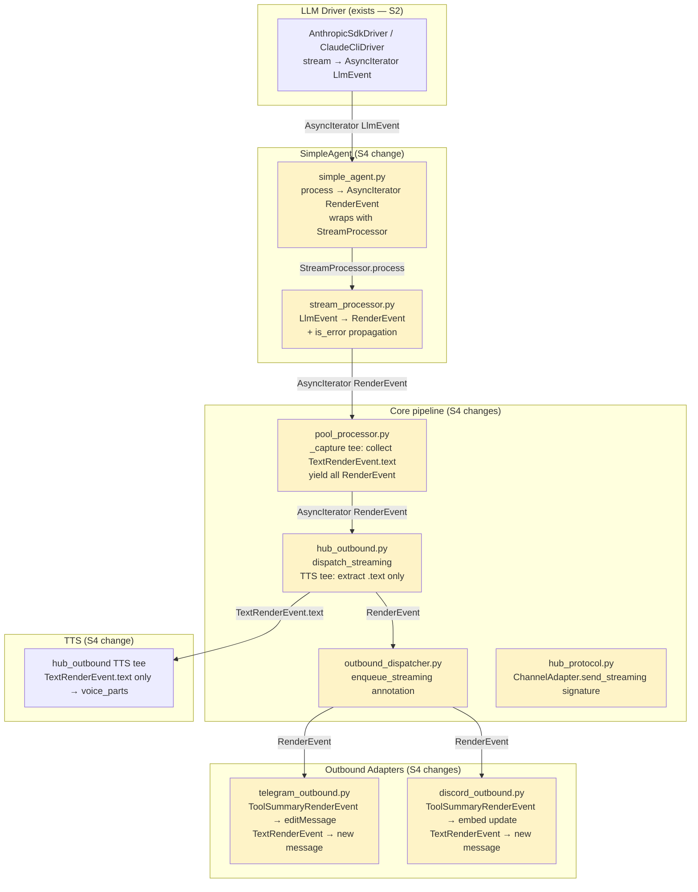
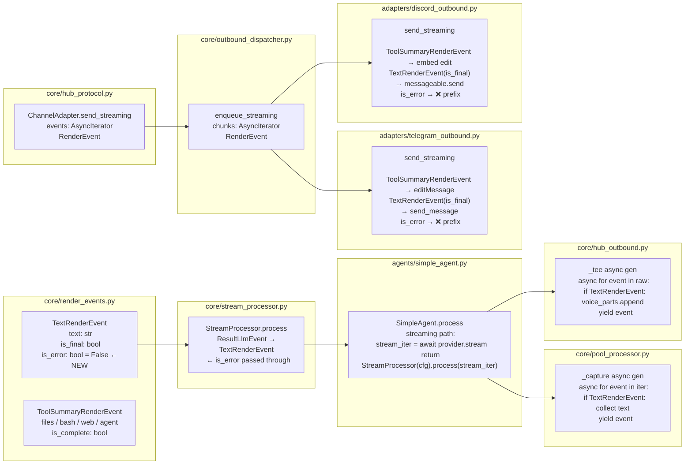

## Summary

Wire the full pipeline end-to-end: update all consuming layers to handle
`AsyncIterator[RenderEvent]` instead of `AsyncIterator[str]`, and fold in
#392 (`is_error: bool` on `TextRenderEvent` + propagation through
`StreamProcessor`). Seven production files change; test_streaming.py is fully
updated and extended.

## Architecture





## Bootstrap Context

- **Spec:** `artifacts/specs/371-arch-stream-processor-render-event-spec.mdx` — S4 slice
- **ADR:** `docs/architecture/adr/032-llmevent-streamprocessor-renderevent-hexagonal-streaming.mdx`
- **S3 complete:** `StreamProcessor` exists and is fully tested — do NOT modify logic, only wire it
- **S5 not merged:** `ToolDisplayConfig` is loaded via `ToolDisplayConfig.defaults()` in `SimpleAgent`
  during this slice; full TOML loading arrives in S5 (#386)
- **`_ITEM = tuple`** in `outbound_errors.py` — generic alias, no update needed beyond the comment
- **`test_pool_streaming.py`** — test doubles currently yield raw `str` via the S2-bridge fallback;
  after S4 they must yield `RenderEvent` objects (or the tests will fail)
- **`test_hub_streaming.py`** — `StreamAdapter` test double does `async for chunk in chunks`;
  must be updated to consume `RenderEvent` objects

## Agents

| Agent | Tasks | Files |
|-------|-------|-------|
| backend-dev | R-1 … R-9 (9 tasks) | render_events.py, stream_processor.py, hub_protocol.py, outbound_dispatcher.py, pool_processor.py, hub_outbound.py, simple_agent.py, telegram_outbound.py, discord_outbound.py |
| tester | G-1 … G-3 (3 tasks) | tests/adapters/test_streaming.py, tests/core/test_pool_streaming.py, tests/core/test_hub_streaming.py |

## Consistency Report

| Metric | Value |
|--------|-------|
| S4 ACs covered | 10 / 10 |
| #392 ACs covered | 5 / 5 |
| Micro-tasks | 12 |
| Uncovered ACs | 0 |
| Untraced tasks | 0 |
| Exemptions | `_format_tool_summary` format: implementation choice (spec only says "formatted text"); Discord embed colour/layout: implementation choice |

## Micro-Tasks

---

### RED — Core type changes (parallel-safe)

---

#### R-1 Add `is_error: bool = False` to `TextRenderEvent` [P]

- **File:** `src/lyra/core/render_events.py`
- **Agent:** backend-dev
- **Spec trace:** #392 AC1
- **Difficulty:** 1 / Estimated time: 2 min

**Code snippet:**
```python
@dataclass(frozen=True)
class TextRenderEvent:
    text: str
    is_final: bool
    is_error: bool = False   # ← add this field (#392)
```

**Verify:**
```bash
python -c "
from lyra.core.render_events import TextRenderEvent
e = TextRenderEvent(text='hi', is_final=True)
assert e.is_error is False
e2 = TextRenderEvent(text='err', is_final=True, is_error=True)
assert e2.is_error is True
print('ok')
"
```
**Expected output:** `ok`

---

#### R-2 Propagate `is_error` in `StreamProcessor.process()` [P]

- **File:** `src/lyra/core/stream_processor.py`
- **Agent:** backend-dev
- **Depends on:** R-1
- **Spec trace:** #392 AC2
- **Difficulty:** 1 / Estimated time: 2 min

**Code snippet** (at `ResultLlmEvent` branch in `process()`):
```python
elif isinstance(event, ResultLlmEvent):
    _result_received = True
    if self._has_any_tool_events():
        yield self._emit_snapshot(is_complete=True)
    yield TextRenderEvent(
        text=self._pending_text,
        is_final=True,
        is_error=event.is_error,   # ← propagate (#392)
    )
```

Note: the truncation fallback path (`if not _result_received`) keeps `is_error=False`
(no `ResultLlmEvent` arrived, so error state is unknown — conservative default).

**Verify:**
```bash
uv run pytest tests/core/test_stream_processor.py -v
```
**Expected output:** All existing tests pass; if a test asserts `is_error=False` it still passes (default).

---

#### R-3 Update `hub_protocol.py` `send_streaming` signature [P]

- **File:** `src/lyra/core/hub_protocol.py`
- **Agent:** backend-dev
- **Spec trace:** N6
- **Difficulty:** 1 / Estimated time: 2 min

**Code snippet:**
```python
# Add to TYPE_CHECKING block:
from .render_events import RenderEvent

class ChannelAdapter(Protocol):
    async def send_streaming(
        self,
        original_msg: InboundMessage,
        events: AsyncIterator[RenderEvent],   # ← was chunks: AsyncIterator[str]
        outbound: OutboundMessage | None = None,
    ) -> None: ...
```

**Verify:**
```bash
uv run pyright src/lyra/core/hub_protocol.py
```
**Expected output:** 0 errors.

---

#### R-4 Update `outbound_dispatcher.py` `enqueue_streaming` annotation [P]

- **File:** `src/lyra/core/outbound_dispatcher.py`
- **Agent:** backend-dev
- **Spec trace:** N9
- **Difficulty:** 1 / Estimated time: 2 min

**Code snippet:**
```python
# Add to existing imports:
from .render_events import RenderEvent   # under TYPE_CHECKING if not runtime-used

def enqueue_streaming(
    self,
    msg: InboundMessage,
    chunks: AsyncIterator[RenderEvent],   # ← was AsyncIterator[str]
    outbound: OutboundMessage | None = None,
) -> None:
    self._queue.put_nowait(("streaming", msg, chunks, outbound))
```

Also update the comment in `outbound_errors.py` (documentation-only, no behaviour change):
```python
#   ("streaming",    InboundMessage, AsyncIterator[RenderEvent], OutboundMessage | None)
```

**Verify:**
```bash
uv run pyright src/lyra/core/outbound_dispatcher.py
```
**Expected output:** 0 errors.

---

### RED — Pipeline wiring (sequential)

---

#### R-5 Rewrite `pool_processor.py` `_capture()` tee for `RenderEvent` [P]

- **File:** `src/lyra/core/pool_processor.py`
- **Agent:** backend-dev
- **Depends on:** R-1, R-3
- **Spec trace:** N8 (SC-S4 AC3)
- **Difficulty:** 2 / Estimated time: 5 min

**Code snippet:**
```python
# Replace import at top of file:
# REMOVE: from lyra.llm.events import ResultLlmEvent, TextLlmEvent, ToolUseLlmEvent
# ADD:
from lyra.core.render_events import RenderEvent, TextRenderEvent

# _capture() — replaces the existing S2-bridge generator (lines ~296-318):
async def _capture() -> collections.abc.AsyncGenerator[RenderEvent, None]:
    # S4: _result_iter_for_sid now yields RenderEvent from StreamProcessor.
    # Collect TextRenderEvent.text for turn logging; forward all events downstream.
    try:
        async for event in _result_iter_for_sid:
            if isinstance(event, TextRenderEvent):
                _content_parts.append(event.text)
            # ToolSummaryRenderEvent: forwarded but not logged as text content
            yield event
    finally:
        _aclose = getattr(_result_iter_for_sid, "aclose", None)
        if callable(_aclose):
            await _aclose()  # type: ignore[misc]

result = _capture()  # type: ignore[assignment]
```

The `"".join(_content_parts)` at the turn-logging callback (line ~346) continues to work
correctly since only `TextRenderEvent.text` (str values) are appended.

**Verify:**
```bash
uv run pytest tests/core/test_pool_streaming.py tests/core/test_hub_streaming.py -v
```
**Expected output:** Adapted tests pass (see G-3 for test updates).

---

#### R-6 Rewrite `hub_outbound.py` TTS tee for `RenderEvent`

- **File:** `src/lyra/core/hub_outbound.py`
- **Agent:** backend-dev
- **Depends on:** R-3
- **Spec trace:** N7 (SC-S4 AC2)
- **Difficulty:** 2 / Estimated time: 5 min

**Code snippet:**
```python
# Add under TYPE_CHECKING:
from .render_events import RenderEvent, TextRenderEvent

# In dispatch_streaming():
async def dispatch_streaming(
    self,
    msg: InboundMessage,
    chunks: AsyncIterator[RenderEvent],   # ← was AsyncIterator[str]
    outbound: OutboundMessage | None = None,
) -> None:
    ...
    if _should_speak:
        _voice_parts = []
        _voice_done = asyncio.Event()
        _raw = chunks

        async def _tee() -> AsyncIterator[RenderEvent]:
            try:
                async for event in _raw:
                    if isinstance(event, TextRenderEvent):
                        _voice_parts.append(event.text)  # type: ignore[union-attr]
                    # ToolSummaryRenderEvent: NOT added to voice_parts
                    yield event
            finally:
                _voice_done.set()  # type: ignore[union-attr]

        chunks = _tee()

    ...
    # Fallback path (no dispatcher, adapter lacks send_streaming):
    text = ""
    async for event in chunks:
        if isinstance(event, TextRenderEvent):
            text += event.text
    await adapter.send(msg, OutboundMessage.from_text(text))
```

**Verify:**
```bash
uv run pyright src/lyra/core/hub_outbound.py
```
**Expected output:** 0 errors.

---

#### R-7 Wire `StreamProcessor` in `SimpleAgent.process()` [P]

- **File:** `src/lyra/agents/simple_agent.py`
- **Agent:** backend-dev
- **Depends on:** R-1, R-2
- **Spec trace:** N10 (SC-S4 AC4 … AC1)
- **Difficulty:** 2 / Estimated time: 8 min

**Code snippet:**
```python
# Add to imports (runtime, not TYPE_CHECKING):
from lyra.core.stream_processor import StreamProcessor
from lyra.core.tool_display_config import ToolDisplayConfig

# In __init__ signature — add optional arg with default:
def __init__(
    self,
    config: Agent,
    provider: LlmProvider,
    ...
    tool_display_config: ToolDisplayConfig | None = None,
) -> None:
    ...
    # S4: use defaults() until S5 (#386) wires TOML loading
    self._tool_display_config = tool_display_config or ToolDisplayConfig.defaults()

# In process() — replace streaming return:
_stream_fn = getattr(self._provider, "stream", None)
if model_cfg.streaming and _stream_fn is not None:
    stream_iter = await _stream_fn(
        pool.pool_id,
        text,
        model_cfg,
        pool._system_prompt or self.config.system_prompt,
    )
    processor = StreamProcessor(config=self._tool_display_config)
    return processor.process(stream_iter)  # AsyncIterator[RenderEvent]

# Return type annotation:
async def process(
    self,
    msg: InboundMessage,
    pool: Pool,
    *,
    on_intermediate: "Callable[[str], Awaitable[None]] | None" = None,
) -> "Response | AsyncIterator[RenderEvent]":   # ← was AsyncIterator[str]
```

Add `RenderEvent` to the `TYPE_CHECKING` import block from `lyra.core.render_events`.

**Verify:**
```bash
uv run pyright src/lyra/agents/simple_agent.py
```
**Expected output:** 0 errors.

---

#### R-8 Rewrite `telegram_outbound.py` `send_streaming()` for `RenderEvent`

- **File:** `src/lyra/adapters/telegram_outbound.py`
- **Agent:** backend-dev
- **Depends on:** R-1, R-3, R-7
- **Spec trace:** SC-S4 (Telegram ACs), #392 AC3
- **Difficulty:** 4 / Estimated time: 10 min

**Design:**
- Signature: `events: AsyncIterator[RenderEvent]` (was `chunks: AsyncIterator[str]`)
- Placeholder send: unchanged
- Fallback (placeholder fails): drain events collecting `TextRenderEvent.text`; send as before
- Main loop:
  - `ToolSummaryRenderEvent` → `_format_tool_summary(event)` → `editMessage(placeholder)` (+ ✅ if `is_complete`)
  - `TextRenderEvent(is_final=True)` → if `had_tool_events`: `send_message` (new message); else: `editMessage(placeholder)`. Prefix `"❌ "` if `is_error=True`
- Preserve: intermediate edit debounce, overflow chunks, `reply_message_id`, typing indicator

**Code snippet — helper + loop skeleton:**
```python
from lyra.core.render_events import RenderEvent, TextRenderEvent, ToolSummaryRenderEvent

def _format_tool_summary(event: ToolSummaryRenderEvent) -> str:
    """Format a ToolSummaryRenderEvent as human-readable Telegram text."""
    lines: list[str] = []
    if event.files:
        grouped = len(event.files) >= 3  # group_threshold
        if grouped:
            total = sum(f.count for f in event.files.values())
            lines.append(f"✏️ {len(event.files)} files · {total} edits")
        else:
            for summary in event.files.values():
                label = ", ".join(summary.edits) if summary.edits else f"×{summary.count}"
                lines.append(f"✏️ `{summary.path}` ({label})")
    for cmd in event.bash_commands:
        lines.append(f"💻 `{cmd}`")
    for url in event.web_fetches:
        lines.append(f"🌐 {url}")
    for agent in event.agent_calls:
        lines.append(f"🤖 {agent}")
    sc = event.silent_counts
    silent = sc.reads + sc.greps + sc.globs
    if silent:
        lines.append(f"🔍 {silent} silent reads")
    header = "🔧 Working…" if not event.is_complete else "🔧 Done"
    body = "\n".join(lines) if lines else ""
    return f"{header}\n{body}".strip()

async def send_streaming(
    adapter: TelegramAdapter,
    original_msg: InboundMessage,
    events: AsyncIterator[RenderEvent],   # ← new
    outbound: OutboundMessage | None = None,
) -> None:
    ...
    # Fallback path (placeholder send fails):
    async for event in events:
        if isinstance(event, TextRenderEvent):
            parts.append(event.text)
    # ... send accumulated text as before

    # Main loop:
    had_tool_events = False
    last_tool_edit: float | None = None
    final_text: str | None = None
    is_error_turn: bool = False

    async for event in events:
        if isinstance(event, ToolSummaryRenderEvent):
            had_tool_events = True
            tool_text = _format_tool_summary(event)
            # Always edit on is_complete; otherwise respect debounce
            now = time.monotonic()
            if event.is_complete or last_tool_edit is None or (now - last_tool_edit) >= STREAMING_EDIT_INTERVAL:
                try:
                    await adapter.bot.edit_message_text(
                        chat_id=chat_id,
                        message_id=placeholder.message_id,
                        text=_render_text(tool_text)[0],
                        parse_mode="MarkdownV2",
                    )
                    last_tool_edit = now
                except Exception as exc:
                    log.debug("Tool summary edit skipped: %s", exc)

        elif isinstance(event, TextRenderEvent) and event.is_final:
            final_text = event.text
            is_error_turn = event.is_error

    # After loop — send final text
    if final_text is not None:
        display_text = ("❌ " + final_text) if is_error_turn else final_text
        if had_tool_events:
            # Tool summary stays in placeholder; text as new message
            final_chunks = _render_text(display_text)
            for chunk in final_chunks:
                try:
                    await adapter.bot.send_message(
                        chat_id=chat_id, text=chunk, parse_mode="MarkdownV2"
                    )
                except Exception:
                    log.exception("Failed to send final text chunk")
        else:
            # Text-only turn: edit placeholder directly (preserves overflow logic)
            final_chunks = _render_text(display_text)
            try:
                await adapter.bot.edit_message_text(
                    chat_id=chat_id,
                    message_id=placeholder.message_id,
                    text=final_chunks[0],
                    parse_mode="MarkdownV2",
                )
            except Exception:
                log.exception("Final edit failed")
            for extra_chunk in final_chunks[1:]:
                try:
                    await adapter.bot.send_message(
                        chat_id=chat_id, text=extra_chunk, parse_mode="MarkdownV2"
                    )
                except Exception:
                    log.exception("Failed to send overflow chunk")
```

**Verify:**
```bash
uv run pytest tests/adapters/test_streaming.py -v
```
**Expected output:** All pre-existing tests pass (after G-1 updates them for RenderEvent).

---

#### R-9 Rewrite `discord_outbound.py` `send_streaming()` for `RenderEvent`

- **File:** `src/lyra/adapters/discord_outbound.py`
- **Agent:** backend-dev
- **Depends on:** R-1, R-3, R-7
- **Spec trace:** SC-S4 (Discord ACs), #392 AC4
- **Difficulty:** 4 / Estimated time: 10 min

**Design:** Same logic as R-8, but Discord-flavoured:
- `ToolSummaryRenderEvent` → `placeholder.edit(embed=discord.Embed(...))`
- `TextRenderEvent(is_final=True)` + `had_tool_events` → `messageable.send(text)`
- `TextRenderEvent(is_final=True)` + no tool events → `placeholder.edit(content=text)`
- `is_error=True` → prefix `"❌ "`
- Fallback (placeholder fails): collect `TextRenderEvent.text` → delegate to `send()`

**Code snippet — embed helper + loop skeleton:**
```python
import discord  # already imported via discord_formatting
from lyra.core.render_events import RenderEvent, TextRenderEvent, ToolSummaryRenderEvent

def _build_tool_embed(event: ToolSummaryRenderEvent) -> discord.Embed:
    """Build a Discord embed from a ToolSummaryRenderEvent."""
    title = "🔧 Working…" if not event.is_complete else "🔧 Done ✅"
    color = discord.Color.green() if event.is_complete else discord.Color.blue()
    lines: list[str] = []
    if event.files:
        grouped = len(event.files) >= 3
        if grouped:
            total = sum(f.count for f in event.files.values())
            lines.append(f"✏️ {len(event.files)} files · {total} edits")
        else:
            for summary in event.files.values():
                label = ", ".join(summary.edits) if summary.edits else f"×{summary.count}"
                lines.append(f"✏️ `{summary.path}` ({label})")
    for cmd in event.bash_commands:
        lines.append(f"💻 `{cmd}`")
    for url in event.web_fetches:
        lines.append(f"🌐 {url}")
    sc = event.silent_counts
    silent = sc.reads + sc.greps + sc.globs
    if silent:
        lines.append(f"🔍 {silent} silent reads")
    description = "\n".join(lines) or "\u200b"  # zero-width space for empty embed
    return discord.Embed(title=title, description=description, color=color)

async def send_streaming(
    adapter: "DiscordAdapter",
    original_msg: InboundMessage,
    events: AsyncIterator[RenderEvent],   # ← new
    outbound: OutboundMessage | None = None,
) -> None:
    ...
    # Fallback path:
    async for event in events:
        if isinstance(event, TextRenderEvent):
            parts.append(event.text)
    fallback_content = "".join(parts) or _placeholder_text
    fallback_outbound = OutboundMessage.from_text(fallback_content)
    await send(adapter, original_msg, fallback_outbound)
    ...

    # Main loop:
    had_tool_events = False
    last_tool_edit: float | None = None
    final_text: str | None = None
    is_error_turn: bool = False

    async for event in events:
        if isinstance(event, ToolSummaryRenderEvent):
            had_tool_events = True
            now = time.monotonic()
            if event.is_complete or last_tool_edit is None or (now - last_tool_edit) >= STREAMING_EDIT_INTERVAL:
                embed = _build_tool_embed(event)
                await _discord_send_with_retry(
                    lambda: placeholder.edit(embed=embed),
                    label="Tool summary embed",
                )
                last_tool_edit = now
        elif isinstance(event, TextRenderEvent) and event.is_final:
            final_text = event.text
            is_error_turn = event.is_error

    if final_text is not None:
        display_text = ("❌ " + final_text) if is_error_turn else final_text
        final_chunks = render_text(display_text, DISCORD_MAX_LENGTH)
        if had_tool_events:
            for chunk in final_chunks:
                await _discord_send_with_retry(
                    lambda c=chunk: messageable.send(c), label="Final text chunk"
                )
        else:
            await _discord_send_with_retry(
                lambda: placeholder.edit(content=final_chunks[0]), label="Final edit"
            )
            for extra_chunk in final_chunks[1:]:
                await _discord_send_with_retry(
                    lambda c=extra_chunk: messageable.send(c), label="Overflow chunk"
                )
```

**Verify:**
```bash
uv run pytest tests/adapters/test_streaming.py -v
```
**Expected output:** All pre-existing tests pass (after G-1 updates).

---

### RED-GATE

> All RED tasks (R-1 … R-9) must pass before GREEN tasks begin.
> Run: `uv run pytest tests/adapters/test_streaming.py tests/core/ -v`

---

### GREEN — Tests

---

#### G-1 Update `test_streaming.py`: switch helpers to `RenderEvent` [parallel-safe]

- **File:** `tests/adapters/test_streaming.py`
- **Agent:** tester
- **Depends on:** R-8, R-9
- **Spec trace:** SC-S4 AC10
- **Difficulty:** 2 / Estimated time: 8 min

**Changes:**
1. Replace `quick_chunks()` and `error_chunks()` async generators to yield `RenderEvent`:
```python
from lyra.core.render_events import TextRenderEvent, ToolSummaryRenderEvent

async def quick_events():
    """Yield a single final TextRenderEvent (text-only turn, no tools)."""
    yield TextRenderEvent(text="Hello world!", is_final=True)

async def error_events():
    """Yield a partial TextRenderEvent then raise (stream interrupted)."""
    yield TextRenderEvent(text="partial", is_final=False)
    raise RuntimeError("stream died")
```

2. Update all `send_streaming(msg, quick_chunks())` → `send_streaming(msg, quick_events())`

3. Update Telegram assertions — text-only turn now edits placeholder (no `had_tool_events`):
   - `test_sends_placeholder_then_edits`: assert `edit_message_text` called with `"Hello world\\!"`
   - `test_placeholder_failure_falls_back`: assert fallback `send_message` called with full text
   - `test_mid_stream_error_appends_interrupted`: stream error still appends `[response interrupted]`

4. Update Discord assertions analogously.

**Verify:**
```bash
uv run pytest tests/adapters/test_streaming.py -v -x
```
**Expected output:** All pre-existing test names pass (zero regression).

---

#### G-2 Add new tests: `ToolSummaryRenderEvent` rendering

- **File:** `tests/adapters/test_streaming.py`
- **Agent:** tester
- **Depends on:** G-1
- **Spec trace:** SC-S4 (Telegram + Discord tool rendering ACs)
- **Difficulty:** 3 / Estimated time: 8 min

**New test cases:**

```python
# Telegram
async def test_tg_tool_summary_edits_placeholder(self) -> None:
    """ToolSummaryRenderEvent → editMessage on placeholder."""
    adapter, bot = self._make_adapter()
    msg = make_tg_message()

    async def tool_events():
        yield ToolSummaryRenderEvent(bash_commands=["uv run pytest"], is_complete=False)
        yield TextRenderEvent(text="Done.", is_final=True)

    await adapter.send_streaming(msg, tool_events())
    # placeholder edited with tool summary
    assert bot.edit_message_text.call_count >= 1
    first_edit = bot.edit_message_text.call_args_list[0]
    assert "pytest" in first_edit.kwargs.get("text", "")

async def test_tg_tool_complete_edits_placeholder_then_text_is_new_message(self) -> None:
    """ToolSummaryRenderEvent(is_complete=True) + TextRenderEvent → 2 distinct sends."""
    adapter, bot = self._make_adapter()
    msg = make_tg_message()

    async def tool_then_text():
        yield ToolSummaryRenderEvent(bash_commands=["make test"], is_complete=True)
        yield TextRenderEvent(text="All tests pass.", is_final=True)

    await adapter.send_streaming(msg, tool_then_text())
    # Text sent as a separate send_message (not only edit)
    assert bot.send_message.call_count >= 2  # placeholder + text message

# Discord
async def test_dc_tool_summary_uses_embed(self) -> None:
    """ToolSummaryRenderEvent → placeholder.edit(embed=...) called."""
    adapter, channel, placeholder = self._make_adapter()
    msg = make_dc_message()

    async def tool_events():
        yield ToolSummaryRenderEvent(bash_commands=["uv run pytest"], is_complete=False)
        yield TextRenderEvent(text="Done.", is_final=True)

    await adapter.send_streaming(msg, tool_events())
    # embed edit called
    edit_calls = placeholder.edit.call_args_list
    embed_calls = [c for c in edit_calls if "embed" in (c.kwargs or {})]
    assert len(embed_calls) >= 1

async def test_dc_text_after_tool_sends_new_message(self) -> None:
    """ToolSummaryRenderEvent + TextRenderEvent → text sent as new message, not embed edit."""
    adapter, channel, placeholder = self._make_adapter()
    msg = make_dc_message()

    async def tool_then_text():
        yield ToolSummaryRenderEvent(bash_commands=["make test"], is_complete=True)
        yield TextRenderEvent(text="Result text.", is_final=True)

    await adapter.send_streaming(msg, tool_then_text())
    assert channel.send.await_count >= 1  # new message for text
```

**Verify:**
```bash
uv run pytest tests/adapters/test_streaming.py -v -k "tool"
```
**Expected output:** All 4 new tests pass.

---

#### G-3 Add `is_error` tests + update `test_pool_streaming` + `test_hub_streaming`

- **File:** `tests/adapters/test_streaming.py`, `tests/core/test_pool_streaming.py`, `tests/core/test_hub_streaming.py`
- **Agent:** tester
- **Depends on:** G-1, R-5
- **Spec trace:** #392 AC3, AC4, AC5
- **Difficulty:** 2 / Estimated time: 8 min

**New is_error tests:**
```python
# In TestTelegramStreaming:
async def test_tg_is_error_prefixes_error_marker(self) -> None:
    """TextRenderEvent(is_error=True) → message prefixed with ❌."""
    adapter, bot = self._make_adapter()
    msg = make_tg_message()

    async def error_turn():
        yield TextRenderEvent(text="Something went wrong.", is_final=True, is_error=True)

    await adapter.send_streaming(msg, error_turn())
    last_edit = bot.edit_message_text.call_args
    assert "❌" in last_edit.kwargs["text"]

# In TestDiscordStreaming:
async def test_dc_is_error_prefixes_error_marker(self) -> None:
    """TextRenderEvent(is_error=True) → Discord message prefixed with ❌."""
    adapter, channel, placeholder = self._make_adapter()
    msg = make_dc_message()

    async def error_turn():
        yield TextRenderEvent(text="Something went wrong.", is_final=True, is_error=True)

    await adapter.send_streaming(msg, error_turn())
    last_edit = placeholder.edit.call_args
    assert "❌" in last_edit.kwargs.get("content", "")
```

**Pool streaming test double update** (`test_pool_streaming.py`):
```python
from lyra.core.render_events import TextRenderEvent

class StreamingAgent:
    async def process(self, _msg, _pool, *, on_intermediate=None):
        async def _gen():
            yield TextRenderEvent(text="hello world", is_final=True)
        return _gen()
```
Update all assertions that previously expected `["hello ", "world"]` to expect logged content
`"hello world"` (from `_content_parts`).

**Hub streaming test update** (`test_hub_streaming.py`):
Update `StreamAdapter.send_streaming` to consume `RenderEvent` objects; update `received` list
assertions to use `TextRenderEvent.text` or check event types.

**Verify:**
```bash
uv run pytest tests/ -v -x
```
**Expected output:** All tests pass.

---

### REFACTOR

No refactor tasks identified — the implementation follows existing patterns directly.
