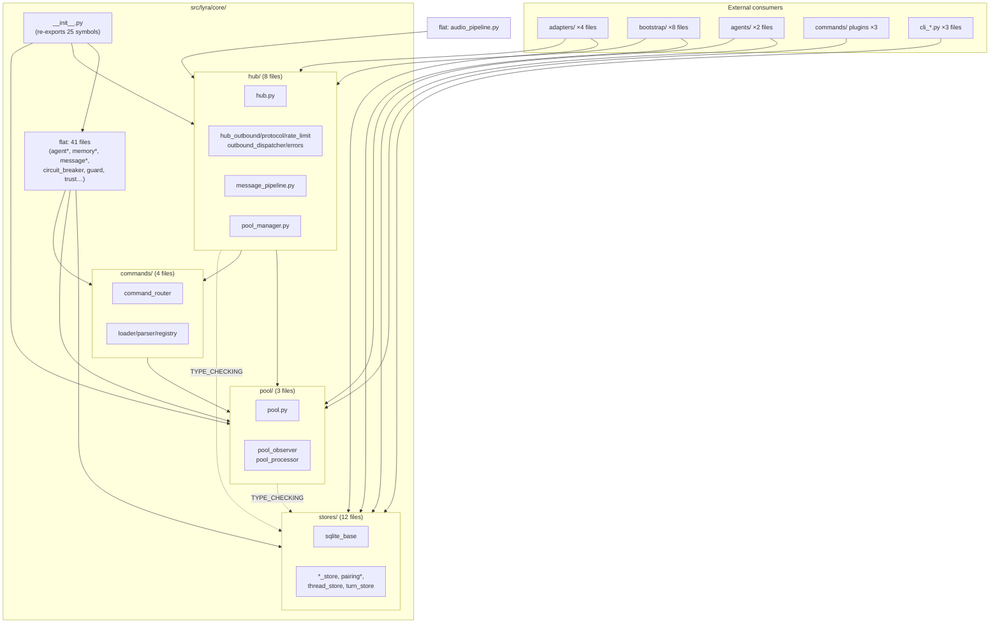
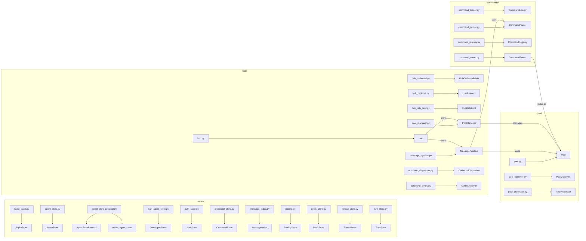

## Summary

Move 27 files from `src/lyra/core/` flat into `stores/`, `hub/`, `pool/`, `commands/`
subdirectories; update ~75 import sites (absolute + relative depth); lower the file-size
pre-commit threshold from 500 → 300 lines; and upgrade Pyright from `basic` → `strict`.
Executed as 5 sequential slices, each ending with Pyright + pytest green.

## Architecture

### Data flow — import graph after split



### File × function map — moved modules



## Bootstrap Context

Existing reference pattern: `src/lyra/adapters/__init__.py` — minimal `__init__.py` that
re-exports key symbols. Use the same pattern for each new subdir `__init__.py`.

Existing hook: `tools/check_file_length.sh` — MAX=500, 6 EXEMPT entries. S4 lowers to 300.

Pyright config: `pyproject.toml` `[tool.pyright]` section, currently `typeCheckingMode = "basic"`.

## Agents

| Agent | Slices | Task count | Primary files |
|-------|--------|-----------|---------------|
| backend-dev | S1, S2, S5 | 18 | 27 moved files + ~75 import sites |
| devops | S4, S5 | 4 | `tools/check_file_length.sh`, `pyproject.toml`, `.pre-commit-config.yaml` |
| doc-writer | S3, S4 | 6 | `core/CLAUDE.md`, 4× subdir `CLAUDE.md`, `CONTRIBUTING.md` |

## Consistency Report

| Criterion | Covered by tasks |
|-----------|-----------------|
| stores/ 12 files + __init__ | T1–T2 |
| hub/ 8 files + __init__ | T9–T10 |
| pool/ 3 files + __init__ | T7–T8 |
| commands/ 4 files + __init__ | T8, T10 |
| 27 files removed from flat | T1, T7–T9 |
| core/__init__.py 25 symbols unchanged | T16 |
| pyright 0 errors basic | RG-S1, RG-S2 |
| pytest 0 regressions | RG-S1, RG-S2 |
| ruff clean | implicit (pre-commit) |
| core/CLAUDE.md updated | T18 |
| 4× subdir CLAUDE.md | T19–T22 |
| hook threshold 500→300 | T23 |
| 16 violators in allowlist | T23 |
| pre-commit all-files pass | RG-S4 |
| CONTRIBUTING.md 300-line section | T24 |
| pyright strict 0 errors | T26–T28, RG-S5 |
| LlmProvider deduplicated | T27 |
| pyright in pre-commit chain | T29 (already present — verify) |

Uncovered: none. Untraced: none.

---

## Micro-Tasks

---

### S1 — Move `stores/` ░░░░░░░░░░░░░░░░░░░░ `pyright basic + pytest green`

---

**T1 — git mv 12 stores files into core/stores/**
- Files: `src/lyra/core/{sqlite_base,agent_store,agent_store_protocol,json_agent_store,auth_store,credential_store,message_index,pairing,pairing_config,prefs_store,thread_store,turn_store}.py`
- Command: `mkdir -p src/lyra/core/stores && git mv src/lyra/core/sqlite_base.py src/lyra/core/stores/ && git mv src/lyra/core/agent_store.py src/lyra/core/stores/` (repeat for all 12)
- Verify: `ls src/lyra/core/stores/*.py | wc -l` → `12`
- Time: 3 min | Agent: backend-dev | Phase: RED | Spec: SC-stores-1

---

**T2 — Write `core/stores/__init__.py`**
- File: `src/lyra/core/stores/__init__.py`
- Snippet:
  ```python
  from .agent_store import AgentStore
  from .agent_store_protocol import AgentStoreProtocol, make_agent_store
  from .auth_store import AuthStore
  from .sqlite_base import SqliteStore

  __all__ = ["AgentStore", "AgentStoreProtocol", "AuthStore", "SqliteStore", "make_agent_store"]
  ```
- Verify: `python3 -c "from lyra.core.stores import AgentStore; print('ok')"`
- Time: 3 min | Agent: backend-dev | Phase: GREEN | Spec: SC-stores-1

---

**T3 — Fix relative depth imports inside moved stores files**
- Files: `stores/agent_store.py`, `stores/agent_store_protocol.py`, `stores/json_agent_store.py`
- Change: `from .agent_models` → `from ..agent_models`, `from .agent_schema` → `from ..agent_schema`, `from .agent_seeder` → `from ..agent_seeder`, `from .persona` → `from ..persona`
- Note: `sqlite_base`, `pairing_config` are siblings inside `stores/` — `from .sqlite_base` and `from .pairing_config` remain unchanged
- Verify: `uv run pyright src/lyra/core/stores/ 2>&1 | grep -c error || echo "0 errors"`
- Time: 5 min | Agent: backend-dev | Phase: GREEN | Spec: U1b

---

**T4 — Update flat core/ files importing stores modules**
- Files: `core/agent.py` (`agent_store`), `core/hub.py` (`message_index`, `pairing`, `prefs_store`, `turn_store`), `core/pool.py` (`turn_store`), `core/pool_observer.py` (`message_index`, `turn_store`), `core/agent_store_protocol.py` → skip (now in stores/), any others
- Change: `from .{store_module}` → `from .stores.{store_module}` (still in flat core/, stores is now a subdir)
- Verify: `grep -r "from \\.agent_store\b\|from \\.sqlite_base\b\|from \\.auth_store\b\|from \\.prefs_store\b\|from \\.turn_store\b\|from \\.thread_store\b\|from \\.message_index\b\|from \\.pairing\b\|from \\.credential_store\b" src/lyra/core/ --include="*.py" | grep -v stores/` → 0 results
- Time: 8 min | Agent: backend-dev | Phase: GREEN | Spec: U1a

---

**T5 — Update 14 external files importing stores modules**
- Files: `adapters/discord.py`, `adapters/discord_threads.py`, `agents/anthropic_agent.py`, `agents/simple_agent.py`, `bootstrap/agent_factory.py`, `bootstrap/bot_agent_map.py`, `bootstrap/config.py`, `bootstrap/multibot.py`, `bootstrap/multibot_stores.py`, `bootstrap/multibot_wiring.py`, `cli_agent.py`, `cli_bot.py`, `cli_setup.py`, `commands/pairing/handlers.py`
- Change: `from lyra.core.{store_module} import` → `from lyra.core.stores.{store_module} import`
- Verify: `grep -r "from lyra\.core\.\(agent_store\|sqlite_base\|auth_store\|credential_store\|message_index\|pairing\|prefs_store\|thread_store\|turn_store\)" src/lyra/ --include="*.py" | grep -v stores/` → 0 results
- Time: 8 min | Agent: backend-dev | Phase: GREEN | Spec: U1a | [P]

---

**🔴 RED-GATE S1**
```bash
uv run pyright          # must: 0 errors
uv run pytest --tb=short -q  # must: 0 failures
```
If red → fix T3/T4/T5 before proceeding to S2.

---

### S2 — Move `pool/` + `commands/` + `hub/` ░░░░░░░░░░ `pyright basic + pytest green`

> All three groups move together — hub files import pool and commands at runtime; splitting
> them across sub-slices creates an unresolvable intermediate state.

---

**T7 — git mv 3 pool files into core/pool/**
- Files: `pool.py`, `pool_observer.py`, `pool_processor.py`
- Command: `mkdir -p src/lyra/core/pool && git mv src/lyra/core/pool.py src/lyra/core/pool/ && ...`
- Verify: `ls src/lyra/core/pool/*.py | wc -l` → `3`
- Time: 2 min | Agent: backend-dev | Phase: RED | Spec: SC-pool-1

---

**T8 — git mv 4 commands files into core/commands/**
- Files: `command_loader.py`, `command_parser.py`, `command_registry.py`, `command_router.py`
- Command: `mkdir -p src/lyra/core/commands && git mv src/lyra/core/command_loader.py src/lyra/core/commands/ && ...`
- Note: `src/lyra/commands/` (top-level plugin commands) is distinct — no collision
- Verify: `ls src/lyra/core/commands/*.py | wc -l` → `4`
- Time: 2 min | Agent: backend-dev | Phase: RED | Spec: SC-commands-1

---

**T9 — git mv 8 hub files into core/hub/**
- Files: `hub.py`, `hub_outbound.py`, `hub_protocol.py`, `hub_rate_limit.py`, `message_pipeline.py`, `pool_manager.py`, `outbound_dispatcher.py`, `outbound_errors.py`
- Command: `mkdir -p src/lyra/core/hub && git mv src/lyra/core/hub.py src/lyra/core/hub/ && ...`
- Verify: `ls src/lyra/core/hub/*.py | wc -l` → `8`
- Time: 2 min | Agent: backend-dev | Phase: RED | Spec: SC-hub-1

---

**T10 — Write `__init__.py` for pool/, commands/, hub/**
- `core/pool/__init__.py`: exports `Pool`, `PoolProcessor`
- `core/commands/__init__.py`: exports `CommandRouter`, `CommandLoader`
- `core/hub/__init__.py`: exports `Hub`, `MessagePipeline`
- Time: 4 min | Agent: backend-dev | Phase: GREEN | Spec: SC-{pool,commands,hub}-1

---

**T11 — Fix relative depth imports inside pool/ files**
- `pool.py`: `from .agent` → `from ..agent`, `from .debouncer` → `from ..debouncer`, `from .memory` → `from ..memory`, `from .message` → `from ..message`, `from .render_events` → `from ..render_events`, `from .turn_store` → `from ..stores.turn_store`
- `pool_observer.py`: `from .message` → `from ..message`, `from .message_index` → `from ..stores.message_index`, `from .turn_store` → `from ..stores.turn_store`
- `pool_processor.py`: `from .agent` → `from ..agent`, `from .message` → `from ..message` (`.pool` stays same-subdir)
- Verify: `uv run pyright src/lyra/core/pool/ 2>&1 | grep error` → 0
- Time: 5 min | Agent: backend-dev | Phase: GREEN | Spec: U2b

---

**T12 — Fix relative depth imports inside commands/ files**
- `command_router.py`: `from .circuit_breaker` → `from ..circuit_breaker`, `from .message` → `from ..message`, `from .messages` → `from ..messages`, `from .pool` → `from ..pool.pool` (siblings `command_loader`, `command_parser` stay `.X`)
- `command_loader.py`, `command_parser.py`, `command_registry.py`: audit for any flat-remaining refs → `from ..X`
- Verify: `uv run pyright src/lyra/core/commands/ 2>&1 | grep error` → 0
- Time: 5 min | Agent: backend-dev | Phase: GREEN | Spec: U2b

---

**T13 — Fix relative depth imports inside hub/ files**
- `hub.py` (largest — 25+ relative imports):
  - flat-remaining: `from .agent/audio_pipeline/circuit_breaker/cli_pool/inbound_bus/memory/message/messages` → `from ..X`
  - cross-group (stores): `from .message_index/pairing/prefs_store/turn_store` → `from ..stores.X`
  - cross-group (pool): `from .pool` → `from ..pool.pool`
  - cross-group (pool_manager, message_pipeline): same-subdir → unchanged
  - outbound helpers (outbound_dispatcher, outbound_errors): same-subdir → unchanged
- `hub_outbound.py`: flat-remaining → `from ..X`; `hub_protocol` stays sibling
- `hub_protocol.py`, `hub_rate_limit.py`: flat-remaining → `from ..X`
- `message_pipeline.py`: flat-remaining → `from ..X`; `from .command_parser` → `from ..commands.command_parser`; `from .pool` → `from ..pool.pool`; `from .hub` stays sibling (`.hub`)
- `pool_manager.py`: `from .pool` → `from ..pool.pool`; `from .hub` stays sibling (`.hub`) (TYPE_CHECKING only)
- `outbound_dispatcher.py`, `outbound_errors.py`: flat-remaining → `from ..X`
- Verify: `uv run pyright src/lyra/core/hub/ 2>&1 | grep error` → 0
- Time: 10 min | Agent: backend-dev | Phase: GREEN | Spec: U2b | Difficulty: 4

---

**T14 — Update 8 flat core/ files importing pool/commands/hub groups**
- `agent.py`: `from .pool` → `from .pool.pool`, `from .command_loader` → `from .commands.command_loader`, `from .command_router` → `from .commands.command_router`
- `agent_builder.py`: `from .command_router` → `from .commands.command_router`
- `agent_commands.py`: `from .command_loader` → `from .commands.command_loader`
- `agent_config.py`: `from .command_router` → `from .commands.command_router`
- `audio_pipeline.py`: `from .hub` → `from .hub.hub`
- `builtin_commands.py`: `from .command_loader` → `from .commands.command_loader`
- `session_lifecycle.py`: `from .pool` → `from .pool.pool`
- `workspace_commands.py`: `from .pool` → `from .pool.pool`
- Verify: `grep -r "from \\.pool\b\|from \\.hub\b\|from \\.command_loader\b\|from \\.command_router\b\|from \\.command_parser\b" src/lyra/core/ --include="*.py" | grep -v "core/hub/\|core/pool/\|core/commands/"` → 0 results
- Time: 8 min | Agent: backend-dev | Phase: GREEN | Spec: U2a

---

**T15 — Update external files importing hub/pool/commands groups**
- hub consumers: `adapters/discord.py`, `adapters/telegram.py`, `bootstrap/health.py`, `bootstrap/multibot.py`, `bootstrap/multibot_wiring.py` → `from lyra.core.hub` → `from lyra.core.hub.hub`
- pool consumers: `agents/anthropic_agent.py`, `agents/simple_agent.py`, `commands/echo/handlers.py`, `commands/pairing/handlers.py`, `commands/svc/handlers.py` → `from lyra.core.pool` → `from lyra.core.pool.pool`
- commands consumers: `adapters/discord_voice_commands.py`, `cli_setup.py` → `from lyra.core.command_X` → `from lyra.core.commands.command_X`
- Verify: `grep -r "from lyra\.core\.\(hub\|pool\|pool_manager\|message_pipeline\|command_loader\|command_router\|command_parser\)\b" src/lyra/ --include="*.py" | grep -v "core/hub/\|core/pool/\|core/commands/"` → 0 results
- Time: 8 min | Agent: backend-dev | Phase: GREEN | Spec: U2a | [P] (with T14)

---

**T16 — Update `core/__init__.py` (U3)**
- File: `src/lyra/core/__init__.py`
- Current: `from .hub import (Hub, …)` / `from .pool import Pool`
- After: `from .hub import (Hub, …)` → `from .hub.hub import (Hub, …)` (or via `hub/__init__.py`); `from .pool import Pool` → `from .pool.pool import Pool`; `from .render_events import …` / `from .message import …` / `from .agent import …` stay flat
- Verify: `python3 -c "from lyra.core import Hub, Pool, Agent, ChannelAdapter, MessagePipeline; print('25 symbols OK')"` followed by symbol count assertion
- Time: 5 min | Agent: backend-dev | Phase: GREEN | Spec: U3 | Difficulty: 3

---

**🔴 RED-GATE S2**
```bash
uv run pyright          # must: 0 errors (basic mode)
uv run pytest --tb=short -q  # must: 0 failures
uv run ruff check .     # must: clean
```
If red → fix T11–T16 before S3.

---

### S3 — Docs ░░░░░░░░░░░░░░░░░░░░ `core/CLAUDE.md + 4 subdir CLAUDE.md`

---

**T18 — Update `core/CLAUDE.md`** [doc-writer, S3]
- File: `src/lyra/core/CLAUDE.md`
- Add section: `## Layout` — describe 4 subdirs with file maps; update gotchas to reflect new import paths
- Time: 5 min | Spec: SC-docs-1

**T19 — Write `stores/CLAUDE.md`** [doc-writer, S3, [P]]
- File: `src/lyra/core/stores/CLAUDE.md`
- Content: purpose (SQLite persistence layer), file map, import pattern, gotchas (sqlite_base as base class)
- Time: 4 min | Spec: SC-docs-2

**T20 — Write `hub/CLAUDE.md`** [doc-writer, S3, [P]]
- File: `src/lyra/core/hub/CLAUDE.md`
- Content: purpose (message routing + outbound), pool_manager/message_pipeline placement rationale, outbound chain diagram
- Time: 4 min | Spec: SC-docs-2

**T21 — Write `pool/CLAUDE.md`** [doc-writer, S3, [P]]
- File: `src/lyra/core/pool/CLAUDE.md`
- Content: purpose (agent pool lifecycle), processor pattern, observer pattern
- Time: 3 min | Spec: SC-docs-2

**T22 — Write `commands/CLAUDE.md`** [doc-writer, S3, [P]]
- File: `src/lyra/core/commands/CLAUDE.md`
- Content: purpose (routing infrastructure, NOT plugin commands), distinction from `src/lyra/commands/`, dispatch priority
- Time: 3 min | Spec: SC-docs-2

---

### S4 — File-size hook (#396) ░░░░░░░░░░░░ `pre-commit run --all-files exit 0`

---

**T23 — Lower file-size threshold 500 → 300 + update allowlist**
- File: `tools/check_file_length.sh`
- Change: `MAX=500` → `MAX=300`
- Update EXEMPT array — add all 16 current violators (removing any already in list):
  ```
  core/cli_protocol.py        # 494 lines — #396 tracking issue
  core/message_pipeline.py    # 450 lines — #396
  core/agent_store.py         # 449 lines — #396
  cli_agent_crud.py           # 441 lines — #396
  core/pool_processor.py      # 406 lines — #396
  core/outbound_dispatcher.py # 377 lines — #396
  core/command_router.py      # 374 lines — #396
  core/agent_refiner.py       # 367 lines — #396
  core/hub_outbound.py        # 356 lines — #396
  adapters/telegram_outbound.py # 356 lines — #396
  core/hub.py                 # 353 lines — #396
  adapters/discord_outbound.py # 353 lines — #396
  tts/__init__.py             # 336 lines — #396
  adapters/discord.py         # 314 lines — #196 (existing)
  core/audio_pipeline.py      # 313 lines — #396
  agents/simple_agent.py      # 306 lines — #396
  ```
  (Keep existing #196 exemptions for telegram.py, discord.py, hub.py, agent.py, cli_agent.py;
  merge with new list — de-duplicate)
- Time: 8 min | Agent: devops | Phase: GREEN | Spec: SC-396-1,2

---

**T24 — Add 300-line rule to `CONTRIBUTING.md`** [doc-writer, S4]
- File: `CONTRIBUTING.md`
- Add section: `## File Size Policy` — 300-line limit, when/how to add to allowlist, link to tracking issue pattern
- Time: 3 min | Spec: SC-396-4

---

**🔴 RED-GATE S4**
```bash
pre-commit run --all-files   # must: exit 0
```

---

### S5 — Pyright strict (#397) ░░░░░░░░░░░░ `strict 0 errors + pre-commit pass`

---

**T26 — Upgrade pyright basic → standard, fix all errors**
- File: `pyproject.toml` `[tool.pyright]` → `typeCheckingMode = "standard"`
- Run: `uv run pyright 2>&1 | grep -E "^src" | wc -l` → iterate until 0
- Key expected errors: missing type annotations on public functions, `Optional` usage, incomplete Protocol implementations
- Time: 15 min | Agent: backend-dev | Phase: RED | Spec: SC-397-1 | Difficulty: 4

---

**T27 — Deduplicate `LlmProvider` Protocol**
- File: `src/lyra/core/agent_refiner.py`
- Remove inline `class LlmProvider(Protocol)` (line ~118) and `class SdkLlmProvider`
- Add: `from lyra.llm.base import LlmProvider`
- Verify: `grep -n "class LlmProvider" src/lyra/core/agent_refiner.py` → 0 results
- Time: 5 min | Agent: backend-dev | Phase: GREEN | Spec: SC-397-3 | [P] (with T26 if no deps)

---

**T28 — Upgrade pyright standard → strict, fix all errors**
- File: `pyproject.toml` → `typeCheckingMode = "strict"`
- Run: `uv run pyright 2>&1 | grep -E "^src" | wc -l` → iterate until 0
- Expected additional errors: `reportUnknownVariableType`, `reportMissingTypeArgument`, `reportUnknownMemberType`, implicit `Any` in callbacks
- Time: 20 min | Agent: backend-dev | Phase: RED | Spec: SC-397-2 | Difficulty: 5

---

**T29 — Verify pyright already in pre-commit chain**
- File: `.pre-commit-config.yaml`
- Check: `typecheck` hook runs `uv run pyright` — already present. Confirm it passes in strict mode.
- Verify: `pre-commit run typecheck` → exit 0
- Time: 2 min | Agent: devops | Phase: GREEN | Spec: SC-397-4

---

**🔴 RED-GATE S5**
```bash
uv run pyright              # must: 0 errors (strict mode)
uv run pytest --tb=short -q # must: 0 failures
pre-commit run --all-files  # must: exit 0 (all hooks including strict pyright)
```

---

## Summary of parallelism

| Tasks | Parallel-safe | Note |
|-------|-------------|------|
| T4, T5 | ✅ [P] | Different file sets (internal vs external) |
| T14, T15 | ✅ [P] | Different file sets |
| T19, T20, T21, T22 | ✅ [P] | Independent CLAUDE.md files |
| T26, T27 | ✅ [P] | T27 doesn't depend on pyright mode |
| T1→T6, T7→RG-S2 | ❌ sequential | S1 must be green before S2 starts |
| S1→S2→S3→S4→S5 | ❌ sequential | Each slice depends on prior green gate |
