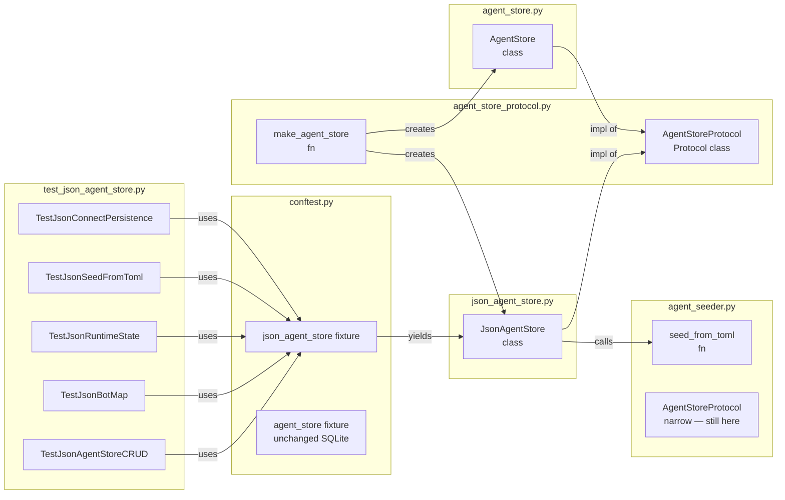

## Summary

Implement `JsonAgentStore` (in-memory + JSON file persistence) satisfying the same
interface as `AgentStore`, expose a fuller `AgentStoreProtocol` + `make_agent_store`
factory, and wire up a `json_agent_store` pytest fixture with a matching test suite.
No existing callers are changed.

## Architecture

```mermaid
flowchart TD
    subgraph src/lyra/core/json_agent_store.py
        JAS[JsonAgentStore]
        JAS_connect[connect\nloads JSON or starts empty]
        JAS_upsert[upsert\nwrite-through to _agents + _persist]
        JAS_persist[_persist\nserializes _agents + _bot_map → JSON]
        JAS_delete[delete\nraises ValueError if bot assigned]
        JAS_bots[set_bot_agent / set_bot_settings\nremove_bot_agent]
        JAS_runtime[get_all_runtime_states = {}\\nset_runtime_state = no-op]
        JAS_seed[seed_from_toml\ndelegates to agent_seeder.seed_from_toml]
    end

    subgraph src/lyra/core/agent_store_protocol.py
        ASP[AgentStoreProtocol\nfull structural Protocol]
        FAC[make_agent_store\nenv-var factory]
    end

    subgraph src/lyra/core/agent_seeder.py
        SEED[seed_from_toml\nexisting helper]
        NARROW[AgentStoreProtocol\nnarrow — retained]
    end

    subgraph src/lyra/core/agent_store.py
        AS[AgentStore\nSQLite — unchanged]
    end

    subgraph tests/core/conftest.py
        FIX[json_agent_store fixture\ntmp_path JSON file]
    end

    subgraph tests/core/test_json_agent_store.py
        TS[Test suite\nCRUD + bot-map + runtime + seed]
    end

    JAS -->|satisfies| ASP
    AS -->|satisfies| ASP
    FAC -->|LYRA_DB=json| JAS
    FAC -->|default| AS
    JAS_seed -->|calls| SEED
    FIX -->|creates| JAS
    TS -->|uses| FIX
    JAS_connect --> JAS_upsert --> JAS_persist
    JAS_delete --> JAS_persist
    JAS_bots --> JAS_persist
```



## Agents

| Agent | Tasks | Files |
|-------|-------|-------|
| backend-dev | 10 | `src/lyra/core/json_agent_store.py` (new), `src/lyra/core/agent_store_protocol.py` (new) |
| tester | 8 | `tests/core/conftest.py` (add fixture), `tests/core/test_json_agent_store.py` (new) |

## Consistency Report

- Spec success criteria: 18 items
- Micro-tasks covering SC: 18/18 ✓
- Uncovered: none
- Untraced tasks: none
- Exemptions: SC-15 (fixture teardown) is structural — verified by fixture pattern

## Micro-Tasks

---

### Slice 1 — JsonAgentStore core

---

**T01** [backend-dev] [RED] [V1] [Difficulty: 2]
Create `src/lyra/core/json_agent_store.py` with class skeleton and `__init__`.

File: `src/lyra/core/json_agent_store.py`

```python
class JsonAgentStore:
    def __init__(self, path: Path | str) -> None:
        self._path = Path(path)
        self._agents: dict[str, AgentRow] = {}
        self._bot_map: dict[tuple[str, str], str] = {}
        self._bot_settings: dict[tuple[str, str], dict] = {}
        self._connected = False
```

Verify: `python -c "from lyra.core.json_agent_store import JsonAgentStore; print('ok')"`
Expected: `ok`
Time: 3 min | Parallel: N | Spec trace: SC-1
Dependencies: none

---

**T02** [backend-dev] [RED] [V1] [Difficulty: 2]
Implement `connect()` — loads JSON if file exists, creates empty store otherwise. Idempotent.

File: `src/lyra/core/json_agent_store.py`

```python
async def connect(self) -> None:
    if self._connected:
        return
    if self._path.exists():
        data = json.loads(self._path.read_text())
        for row_dict in data.get("agents", []):
            row = AgentRow(**row_dict)
            self._agents[row.name] = row
        for key_str, name in data.get("bot_map", {}).items():
            platform, bot_id = key_str.split(":", 1)
            self._bot_map[(platform, bot_id)] = name
        for key_str, settings in data.get("bot_settings", {}).items():
            platform, bot_id = key_str.split(":", 1)
            self._bot_settings[(platform, bot_id)] = settings
    self._connected = True
```

Verify: test connect with non-existent file, then with written JSON
Time: 4 min | Parallel: N (depends T01) | Spec trace: SC-3, SC-4, SC-5

---

**T03** [backend-dev] [RED] [V1] [Difficulty: 1]
Implement `close()` — clears state, sets `_connected = False`. Idempotent.

File: `src/lyra/core/json_agent_store.py`

```python
async def close(self) -> None:
    self._agents.clear()
    self._bot_map.clear()
    self._bot_settings.clear()
    self._connected = False
```

Time: 2 min | Parallel: Y (after T01) | Spec trace: SC-16

---

**T04** [backend-dev] [RED] [V1] [Difficulty: 1]
Implement `_persist()` — serializes state to JSON file atomically.

File: `src/lyra/core/json_agent_store.py`

```python
def _persist(self) -> None:
    import dataclasses
    data = {
        "agents": [dataclasses.asdict(row) for row in self._agents.values()],
        "bot_map": {f"{p}:{b}": name for (p, b), name in self._bot_map.items()},
        "bot_settings": {f"{p}:{b}": s for (p, b), s in self._bot_settings.items()},
    }
    self._path.write_text(json.dumps(data, indent=2))
```

Time: 3 min | Parallel: Y (after T01) | Spec trace: SC-4

---

**T05** [backend-dev] [RED] [V1] [Difficulty: 2]
Implement sync reads: `get`, `get_all`, `get_bot_agent`, `get_all_bot_mappings`, `get_bot_settings`.

File: `src/lyra/core/json_agent_store.py`

```python
def get(self, name: str) -> AgentRow | None:
    return self._agents.get(name)

def get_all(self) -> list[AgentRow]:
    return list(self._agents.values())

def get_bot_agent(self, platform: str, bot_id: str) -> str | None:
    return self._bot_map.get((platform, bot_id))

def get_all_bot_mappings(self) -> dict[tuple[str, str], str]:
    return dict(self._bot_map)

def get_bot_settings(self, platform: str, bot_id: str) -> dict:
    return self._bot_settings.get((platform, bot_id), {})
```

Time: 3 min | Parallel: Y (after T01) | Spec trace: SC-6, SC-9

---

**T06** [backend-dev] [RED] [V1] [Difficulty: 2]
Implement `upsert(row)` — updates `_agents` + calls `_persist()`.

File: `src/lyra/core/json_agent_store.py`

```python
async def upsert(self, row: AgentRow) -> None:
    self._agents[row.name] = row
    self._persist()
```

Time: 2 min | Parallel: N (depends T04, T05) | Spec trace: SC-6

---

**T07** [backend-dev] [RED] [V1] [Difficulty: 3]
Implement `delete(name)` — raises `ValueError` if bot assigned, else removes + persists.

File: `src/lyra/core/json_agent_store.py`

```python
async def delete(self, name: str) -> None:
    assigned = [
        f"{p}:{b}" for (p, b), n in self._bot_map.items() if n == name
    ]
    if assigned:
        raise ValueError(
            f"Agent {name!r} is still assigned to one or more bots. "
            "Run 'lyra agent unassign' first."
        )
    self._agents.pop(name, None)
    self._persist()
```

Time: 3 min | Parallel: N (depends T04, T05) | Spec trace: SC-7, SC-8

---

**T08** [backend-dev] [RED] [V1] [Difficulty: 3]
Implement `set_bot_agent`, `set_bot_settings`, `remove_bot_agent`.

File: `src/lyra/core/json_agent_store.py`

```python
async def set_bot_agent(self, platform: str, bot_id: str, agent_name: str,
                         *, settings: dict | None = None) -> None:
    self._bot_map[(platform, bot_id)] = agent_name
    if settings is not None:
        self._bot_settings[(platform, bot_id)] = settings
    self._persist()

async def set_bot_settings(self, platform: str, bot_id: str, settings: dict) -> None:
    if (platform, bot_id) not in self._bot_map:
        raise ValueError(
            f"No bot_agent_map row for platform={platform!r}, bot_id={bot_id!r}."
            " Call set_bot_agent() first."
        )
    self._bot_settings[(platform, bot_id)] = settings
    self._persist()

async def remove_bot_agent(self, platform: str, bot_id: str) -> None:
    self._bot_map.pop((platform, bot_id), None)
    self._bot_settings.pop((platform, bot_id), None)
    self._persist()
```

Time: 4 min | Parallel: N (depends T04, T05) | Spec trace: SC-10, SC-11

---

**T09** [backend-dev] [RED] [V1] [Difficulty: 1]
Implement runtime state stubs and `seed_from_toml`.

File: `src/lyra/core/json_agent_store.py`

```python
async def get_all_runtime_states(self) -> dict:
    return {}

async def set_runtime_state(self, agent_name: str, status: str, pool_count: int = 0) -> None:
    _valid = {"idle", "active", "error"}
    if status not in _valid:
        raise ValueError(
            f"invalid status {status!r} — must be one of {sorted(_valid)}"
        )

async def seed_from_toml(self, path: Path, *, force: bool = False) -> int:
    from .agent_seeder import seed_from_toml as _seed
    return await _seed(self, path, force=force)
```

Time: 3 min | Parallel: N (depends T01) | Spec trace: SC-12, SC-13

---

**RED-GATE V1**: run `uv run pytest tests/core/test_json_agent_store.py -x` — all V1 tests green before proceeding to V2.

---

### Slice 2 — Protocol + factory

---

**T10** [backend-dev] [GREEN] [V2] [Difficulty: 2]
Create `src/lyra/core/agent_store_protocol.py` with full `AgentStoreProtocol`.

File: `src/lyra/core/agent_store_protocol.py`

```python
"""Full AgentStoreProtocol + make_agent_store factory."""
from __future__ import annotations
from pathlib import Path
from typing import Protocol, runtime_checkable
from .agent_models import AgentRow, AgentRuntimeStateRow

@runtime_checkable
class AgentStoreProtocol(Protocol):
    def get(self, name: str) -> AgentRow | None: ...
    def get_all(self) -> list[AgentRow]: ...
    def get_bot_agent(self, platform: str, bot_id: str) -> str | None: ...
    def get_all_bot_mappings(self) -> dict[tuple[str, str], str]: ...
    def get_bot_settings(self, platform: str, bot_id: str) -> dict: ...
    async def upsert(self, row: AgentRow) -> None: ...
    async def delete(self, name: str) -> None: ...
    async def set_bot_agent(self, platform: str, bot_id: str, agent_name: str, *, settings: dict | None = None) -> None: ...
    async def set_bot_settings(self, platform: str, bot_id: str, settings: dict) -> None: ...
    async def remove_bot_agent(self, platform: str, bot_id: str) -> None: ...
    async def get_all_runtime_states(self) -> dict[str, AgentRuntimeStateRow]: ...
    async def set_runtime_state(self, agent_name: str, status: str, pool_count: int = 0) -> None: ...
    async def seed_from_toml(self, path: Path, *, force: bool = False) -> int: ...
```

Verify: `python -c "from lyra.core.agent_store_protocol import AgentStoreProtocol; print('ok')"`
Time: 4 min | Parallel: N | Spec trace: SC-2

---

**T11** [backend-dev] [GREEN] [V2] [Difficulty: 2]
Add `make_agent_store` factory to `agent_store_protocol.py`.

File: `src/lyra/core/agent_store_protocol.py`

```python
def make_agent_store(db_path: Path | None = None) -> "AgentStore | JsonAgentStore":
    import os
    if os.environ.get("LYRA_DB") == "json":
        from .json_agent_store import JsonAgentStore
        store_path = os.environ.get("LYRA_AGENT_STORE_PATH")
        path = Path(store_path) if store_path else Path.home() / ".lyra" / "agents_test.json"
        return JsonAgentStore(path=path)
    from .agent_store import AgentStore
    resolved = db_path or (Path.home() / ".lyra" / "auth.db")
    return AgentStore(db_path=resolved)
```

Verify: `LYRA_DB=json python -c "from lyra.core.agent_store_protocol import make_agent_store; s = make_agent_store(); from lyra.core.json_agent_store import JsonAgentStore; assert isinstance(s, JsonAgentStore); print('ok')"`
Time: 3 min | Parallel: N (depends T10) | Spec trace: SC-14, SC-15

---

**RED-GATE V2**: run `uv run pytest tests/core/test_json_agent_store.py -x` — all V2 tests green before proceeding to V3.

---

### Slice 3 — Test fixtures + tests

---

**T12** [tester] [RED] [V3] [Difficulty: 1]
Add `json_agent_store` fixture to `tests/core/conftest.py`.

File: `tests/core/conftest.py`

```python
@pytest.fixture
async def json_agent_store(tmp_path: Path):
    """JsonAgentStore fixture backed by a tmp JSON file — no SQLite needed."""
    from lyra.core.json_agent_store import JsonAgentStore
    store = JsonAgentStore(path=tmp_path / "agents_test.json")
    await store.connect()
    try:
        yield store
    finally:
        await store.close()
```

Verify: `uv run pytest tests/core/ -k "json_agent_store" --collect-only`
Time: 2 min | Parallel: N | Spec trace: SC-16

---

**T13** [tester] [RED] [V3] [Difficulty: 2]
Write `TestJsonAgentStoreConnect` class — connect idempotent, connect with file.

File: `tests/core/test_json_agent_store.py`

```python
class TestJsonAgentStoreConnect:
    async def test_connect_with_missing_file_starts_empty(self, tmp_path): ...
    async def test_connect_idempotent(self, json_agent_store): ...
    async def test_connect_loads_existing_json(self, tmp_path): ...
```

Verify: `uv run pytest tests/core/test_json_agent_store.py::TestJsonAgentStoreConnect -v`
Time: 5 min | Parallel: N (depends T12) | Spec trace: SC-3, SC-4, SC-5

---

**T14** [tester] [RED] [V3] [Difficulty: 3]
Write `TestJsonAgentStoreCRUD` class — upsert, get, get_all, delete (assigned/not assigned).

File: `tests/core/test_json_agent_store.py`

```python
class TestJsonAgentStoreCRUD:
    async def test_upsert_and_get(self, json_agent_store): ...
    async def test_get_missing_returns_none(self, json_agent_store): ...
    async def test_get_all(self, json_agent_store): ...
    async def test_delete_removes_agent(self, json_agent_store): ...
    async def test_delete_raises_if_bot_assigned(self, json_agent_store): ...
    async def test_upsert_is_idempotent(self, json_agent_store): ...
```

Verify: `uv run pytest tests/core/test_json_agent_store.py::TestJsonAgentStoreCRUD -v`
Time: 5 min | Parallel: N (depends T12) | Spec trace: SC-6, SC-7, SC-8

---

**T15** [tester] [RED] [V3] [Difficulty: 3]
Write `TestJsonBotMap` and `TestJsonBotSettings` classes.

File: `tests/core/test_json_agent_store.py`

```python
class TestJsonBotMap:
    async def test_set_and_get_bot_agent(self, json_agent_store): ...
    async def test_get_missing_bot_returns_none(self, json_agent_store): ...
    async def test_remove_bot_agent(self, json_agent_store): ...
    async def test_remove_missing_bot_is_noop(self, json_agent_store): ...

class TestJsonBotSettings:
    async def test_set_and_get_bot_settings(self, json_agent_store): ...
    async def test_get_settings_default_empty(self, json_agent_store): ...
    async def test_set_bot_settings_raises_on_missing_row(self, json_agent_store): ...
```

Verify: `uv run pytest tests/core/test_json_agent_store.py::TestJsonBotMap tests/core/test_json_agent_store.py::TestJsonBotSettings -v`
Time: 5 min | Parallel: Y (after T12) | Spec trace: SC-9, SC-10, SC-11

---

**T16** [tester] [RED] [V3] [Difficulty: 1]
Write `TestJsonRuntimeState` class.

File: `tests/core/test_json_agent_store.py`

```python
class TestJsonRuntimeState:
    async def test_get_all_runtime_states_returns_empty(self, json_agent_store): ...
    async def test_set_runtime_state_invalid_status_raises(self, json_agent_store): ...
    async def test_set_runtime_state_valid_is_noop(self, json_agent_store): ...
```

Verify: `uv run pytest tests/core/test_json_agent_store.py::TestJsonRuntimeState -v`
Time: 3 min | Parallel: Y (after T12) | Spec trace: SC-12, SC-13

---

**T17** [tester] [GREEN] [V3] [Difficulty: 2]
Write `TestMakeAgentStore` class — factory env-var dispatch.

File: `tests/core/test_json_agent_store.py`

```python
class TestMakeAgentStore:
    def test_default_returns_agent_store(self, monkeypatch): ...
    def test_lyra_db_json_returns_json_store(self, monkeypatch): ...
    def test_lyra_agent_store_path_overrides_default(self, monkeypatch, tmp_path): ...
```

Verify: `uv run pytest tests/core/test_json_agent_store.py::TestMakeAgentStore -v`
Time: 4 min | Parallel: Y (after T12) | Spec trace: SC-14, SC-15

---

**T18** [tester] [GREEN] [V3] [Difficulty: 3]
Write `TestJsonSeedFromToml` class — same matrix as `test_agent_store_seed.py::TestSeedFromToml`.

File: `tests/core/test_json_agent_store.py`

```python
class TestJsonSeedFromToml:
    async def test_seed_imports_toml(self, json_agent_store, tmp_path): ...
    async def test_seed_idempotent(self, json_agent_store, tmp_path): ...
    async def test_seed_force_overwrites(self, json_agent_store, tmp_path): ...
    async def test_seed_skips_unparseable(self, json_agent_store, tmp_path): ...
```

Verify: `uv run pytest tests/core/test_json_agent_store.py::TestJsonSeedFromToml -v`
Time: 5 min | Parallel: N (depends T14) | Spec trace: SC-17

---

**RED-GATE V3 (final)**: run `uv run pytest tests/core/test_json_agent_store.py -v` — all 25+ tests green.

Then run full suite: `uv run pytest` — no regressions.
Then lint: `uv run ruff check . && uv run pyright` — no new errors.

---

## Reference Patterns

- `src/lyra/core/agent_store.py` — reference for method signatures, error messages,
  bot-map COALESCE behavior, and runtime state validation pattern. Mirror exactly.
- `tests/core/test_agent_store_crud.py` — reference for test class structure and
  Arrange/Act/Assert layout. Mirror test names and docstrings where applicable.
- `tests/core/conftest.py:agent_store` fixture — reference for `json_agent_store`
  fixture pattern (yield + close in finally).
