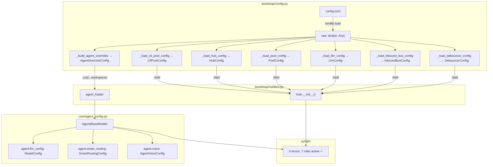
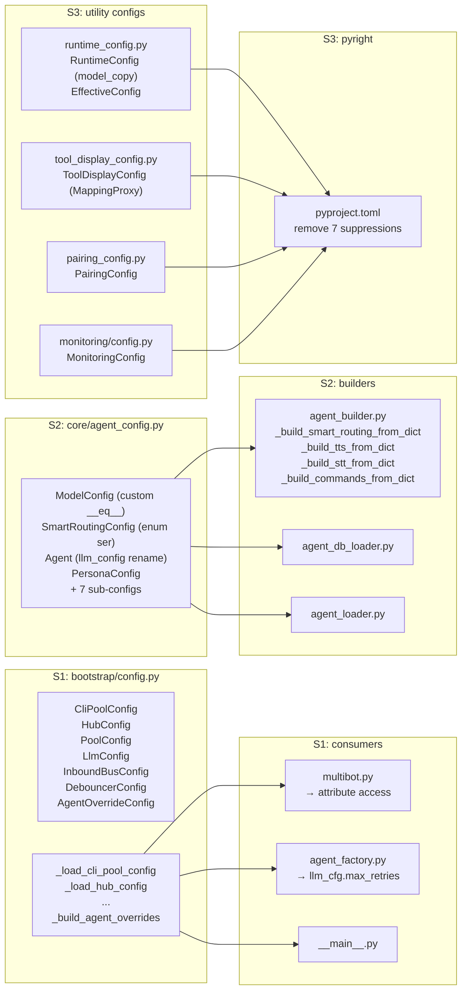

## Summary

Migrate all config loading from bare `dict` returns and stdlib dataclasses to Pydantic v2
`BaseModel`, then re-enable 7 suppressed pyright strict rules. 3 slices, 27 micro-tasks,
2 agents (backend-dev + tester). Sequential execution: S1 → S2 → S3.

## Architecture

### Data flow (target state)



### File x function map



## Bootstrap Context

- Pydantic 2.12.5 is installed (`pydantic>=2.12.5` in pyproject.toml) but unused in src/
- No existing `BaseModel` in the codebase — this introduces the first Pydantic models
- `dataclasses.replace()` used in 4 src files: `runtime_config.py`, `workspace_commands.py`, `command_router.py`, `debouncer.py`
- Agent config imports span 59 files (src + tests) — the `model_config → llm_config` rename has wide impact
- Tests already use keyword construction for `Agent()` — positional breakage is low risk

## Agents

| Agent | Tasks | Files | Slice |
|-------|-------|-------|-------|
| backend-dev | 22 | All src/ model definitions, consumer updates, rename propagation | S1, S2, S3 |
| tester | 5 | All test/ fixture updates, verification runs | S1, S2, S3 |

## Consistency Report

| Metric | Value |
|--------|-------|
| Success criteria | 14 |
| Micro-tasks | 27 |
| Covered criteria | 14/14 |
| Uncovered | 0 |
| Untraced tasks | 0 |

## Micro-Tasks

---

### Slice 1: Bootstrap config models

#### T1.1 — Define 6 section Pydantic models [P]

- **Description:** Create `CliPoolConfig`, `HubConfig`, `PoolConfig`, `LlmConfig`, `InboundBusConfig`, `DebouncerConfig` as `BaseModel` with `ConfigDict(frozen=True)` in `bootstrap/config.py`. Each model mirrors the keys and defaults from the existing `_load_*_config()` functions.
- **File:** `src/lyra/bootstrap/config.py`
- **Code snippet:**
```python
from pydantic import BaseModel, ConfigDict

class CliPoolConfig(BaseModel):
    model_config = ConfigDict(frozen=True)
    idle_ttl: int = 1200
    default_timeout: int = 1200
    turn_timeout: float | None = None
    reaper_interval: int = 60
    kill_timeout: float = 5.0
    read_buffer_bytes: int = 1048576
    stdin_drain_timeout: float = 10.0
    max_idle_retries: int = 3
    intermediate_timeout: float = 5.0
# ... same pattern for Hub, Pool, Llm, InboundBus, Debouncer
```
- **Verify:** `uv run python -c "from lyra.bootstrap.config import CliPoolConfig, HubConfig, PoolConfig, LlmConfig, InboundBusConfig, DebouncerConfig; print('OK')"`
- **Expected output:** `OK`
- **Agent:** backend-dev
- **Spec trace:** SC-1
- **Slice:** S1
- **Phase:** RED
- **Difficulty:** 2

#### T1.2 — Define AgentOverrideConfig model [P]

- **Description:** Create `AgentOverrideConfig` as `BaseModel` with `ConfigDict(frozen=True, extra="allow")` in `bootstrap/config.py`. Fields: `cwd: Path | None = None`, `persona: str | None = None`, `workspaces: dict[str, str] = {}`. Extra="allow" because agent-specific TOML keys vary.
- **File:** `src/lyra/bootstrap/config.py`
- **Verify:** `uv run python -c "from lyra.bootstrap.config import AgentOverrideConfig; print(AgentOverrideConfig(cwd='/tmp'))"`
- **Expected output:** Model instance prints without error
- **Agent:** backend-dev
- **Spec trace:** SC-2
- **Slice:** S1
- **Phase:** RED
- **Difficulty:** 2

#### T1.3 — Update _load_*_config return types

- **Description:** Replace the body of each `_load_*_config()` function to return the corresponding Pydantic model via `model_validate()`. Update `_load_raw_config()` return annotation to `dict[str, Any]`.
- **File:** `src/lyra/bootstrap/config.py`
- **Code snippet:**
```python
def _load_cli_pool_config(raw: dict[str, Any]) -> CliPoolConfig:
    return CliPoolConfig.model_validate(raw.get("cli_pool", {}))
```
- **Verify:** `uv run python -c "from lyra.bootstrap.config import _load_raw_config, _load_cli_pool_config; r = _load_raw_config(); c = _load_cli_pool_config(r); print(type(c).__name__, c.idle_ttl)"`
- **Expected output:** `CliPoolConfig 1200`
- **Agent:** backend-dev
- **Spec trace:** SC-1
- **Slice:** S1
- **Phase:** GREEN
- **Difficulty:** 2
- **Depends on:** T1.1

#### T1.4 — Update _build_agent_overrides to return AgentOverrideConfig

- **Description:** Preserve merge logic (defaults + agent-specific + workspace deep-merge) in the function body. Validate merged result with `AgentOverrideConfig.model_validate(merged)` before returning.
- **File:** `src/lyra/bootstrap/config.py`
- **Verify:** `uv run python -c "from lyra.bootstrap.config import _build_agent_overrides; r = {'defaults': {'cwd': '/tmp'}}; o = _build_agent_overrides(r, 'test'); print(type(o).__name__, o.cwd)"`
- **Expected output:** `AgentOverrideConfig /tmp`
- **Agent:** backend-dev
- **Spec trace:** SC-2
- **Slice:** S1
- **Phase:** GREEN
- **Difficulty:** 3
- **Depends on:** T1.2

#### T1.5 — Update multibot.py consumers

- **Description:** Change all `cfg["key"]` → `cfg.key` attribute access for the 6 section configs + AgentOverrideConfig in `multibot.py`. Update type annotations on function parameters.
- **File:** `src/lyra/bootstrap/multibot.py`
- **Verify:** `uv run pyright src/lyra/bootstrap/multibot.py`
- **Expected output:** 0 errors
- **Agent:** backend-dev
- **Spec trace:** SC-1, SC-14
- **Slice:** S1
- **Phase:** GREEN
- **Difficulty:** 2
- **Depends on:** T1.3, T1.4

#### T1.6 — Update agent_factory.py and __main__.py consumers

- **Description:** Update `llm_cfg: dict` → `llm_cfg: LlmConfig` in agent_factory.py. Update `__main__.py` to use typed config objects.
- **Files:** `src/lyra/bootstrap/agent_factory.py`, `src/lyra/__main__.py`
- **Verify:** `uv run pyright src/lyra/bootstrap/agent_factory.py src/lyra/__main__.py`
- **Expected output:** 0 errors
- **Agent:** backend-dev
- **Spec trace:** SC-1, SC-14
- **Slice:** S1
- **Phase:** GREEN
- **Difficulty:** 2
- **Depends on:** T1.3

#### T1.7 — Update S1 tests

- **Description:** Update test files that construct config dicts or mock `_load_*_config()` returns to use Pydantic model instances instead.
- **Files:** `tests/` (bootstrap-related test files)
- **Verify:** `uv run pytest tests/ -x -q`
- **Expected output:** All tests pass
- **Agent:** tester
- **Spec trace:** SC-13
- **Slice:** S1
- **Phase:** GREEN
- **Difficulty:** 3
- **Depends on:** T1.5, T1.6

#### **--- RED-GATE S1 ---**
**Gate:** `uv run pyright && uv run pytest tests/ -x -q` — all pass with new bootstrap models.

---

### Slice 2: Agent + adapter config migration

#### T2.1 — Migrate inner frozen configs to BaseModel [P]

- **Description:** Convert `IdentityConfig`, `PersonalityConfig`, `ExpertiseConfig`, `VoiceConfig` from `@dataclass(frozen=True)` to `BaseModel` with `ConfigDict(frozen=True)` in `core/agent_config.py`. These are leaf models with no methods — direct conversion.
- **File:** `src/lyra/core/agent_config.py`
- **Verify:** `uv run python -c "from lyra.core.agent_config import IdentityConfig; print(IdentityConfig(name='test'))"`
- **Expected output:** Model instance
- **Agent:** backend-dev
- **Spec trace:** SC-3
- **Slice:** S2
- **Phase:** RED
- **Difficulty:** 2

#### T2.2 — Migrate ModelConfig with custom __eq__ [P]

- **Description:** Convert `ModelConfig` to `BaseModel` with `ConfigDict(frozen=True)`. Override `__eq__` and `__hash__` to exclude `cwd` field (preserving `compare=False` semantics for `CliPool.send()`).
- **File:** `src/lyra/core/agent_config.py`
- **Code snippet:**
```python
class ModelConfig(BaseModel):
    model_config = ConfigDict(frozen=True)
    backend: str = "claude-cli"
    model: str = "claude-sonnet-4-5"
    # ... other fields
    cwd: Path | None = None

    def __eq__(self, other: object) -> bool:
        if not isinstance(other, ModelConfig):
            return NotImplemented
        return (self.backend, self.model, self.max_turns, self.tools,
                self.skip_permissions, self.streaming) == (
                other.backend, other.model, other.max_turns, other.tools,
                other.skip_permissions, other.streaming)

    def __hash__(self) -> int:
        return hash((self.backend, self.model, self.max_turns, self.tools,
                     self.skip_permissions, self.streaming))
```
- **Verify:** `uv run python -c "from lyra.core.agent_config import ModelConfig; a = ModelConfig(cwd='/a'); b = ModelConfig(cwd='/b'); print(a == b)"`
- **Expected output:** `True` (cwd excluded from comparison)
- **Agent:** backend-dev
- **Spec trace:** SC-5
- **Slice:** S2
- **Phase:** RED
- **Difficulty:** 4

#### T2.3 — Migrate SmartRoutingConfig with enum serializer

- **Description:** Convert to `BaseModel`. Add `@field_serializer("routing_table")` for Enum key → `.value` mapping and `@field_validator("routing_table", mode="before")` for string → Complexity deserialization.
- **File:** `src/lyra/core/agent_config.py`
- **Verify:** `uv run python -c "from lyra.core.agent_config import SmartRoutingConfig, Complexity; s = SmartRoutingConfig(routing_table={Complexity.SIMPLE: 'fast'}); d = s.model_dump(mode='json'); print(d); s2 = SmartRoutingConfig.model_validate(d); print(s2.routing_table)"`
- **Expected output:** JSON round-trip preserves Complexity enum keys
- **Agent:** backend-dev
- **Spec trace:** SC-10
- **Slice:** S2
- **Phase:** RED
- **Difficulty:** 4

#### T2.4 — Migrate AgentTTSConfig, AgentSTTConfig, AgentVoiceConfig, PersonaConfig [P]

- **Description:** Convert 4 frozen dataclasses to `BaseModel` with `ConfigDict(frozen=True)`. Straightforward — no methods, no special fields.
- **File:** `src/lyra/core/agent_config.py`
- **Verify:** `uv run python -c "from lyra.core.agent_config import PersonaConfig, IdentityConfig; p = PersonaConfig(identity=IdentityConfig(name='test')); print(p)"`
- **Expected output:** Model instance
- **Agent:** backend-dev
- **Spec trace:** SC-3
- **Slice:** S2
- **Phase:** RED
- **Difficulty:** 2
- **Depends on:** T2.1

#### T2.5 — Migrate Agent (rename model_config → llm_config)

- **Description:** Convert `Agent` to `BaseModel` with `ConfigDict(frozen=False)`. Rename `model_config` field to `llm_config` (Pydantic reserves `model_config` for `ConfigDict`). All 17 fields migrate.
- **File:** `src/lyra/core/agent_config.py`
- **Verify:** `uv run python -c "from lyra.core.agent_config import Agent, ModelConfig; a = Agent(name='test', system_prompt='', memory_namespace='ns'); print(a.llm_config)"`
- **Expected output:** `ModelConfig` instance
- **Agent:** backend-dev
- **Spec trace:** SC-3, SC-4
- **Slice:** S2
- **Phase:** RED
- **Difficulty:** 3
- **Depends on:** T2.1, T2.2, T2.3, T2.4

#### T2.6 — Propagate llm_config rename across all call sites

- **Description:** Find-and-replace `agent.model_config` → `agent.llm_config`, `.model_config` → `.llm_config` (when referring to Agent's ModelConfig field) across all src/ files. Estimated 8+ files: `agent.py`, `agent_builder.py`, `runtime_config.py`, `cli_pool_worker.py`, `agent_db_loader.py`, `agent_loader.py`, `agent_commands.py`, `bootstrap/voice_overlay.py`, LLM drivers.
- **Files:** All files referencing `Agent.model_config`
- **Verify:** `grep -rn "\.model_config\b" src/lyra/ --include="*.py" | grep -v "ConfigDict\|model_config =" | wc -l`
- **Expected output:** 0 (no remaining old-style references)
- **Agent:** backend-dev
- **Spec trace:** SC-4
- **Slice:** S2
- **Phase:** GREEN
- **Difficulty:** 3
- **Depends on:** T2.5

#### T2.7 — Migrate config.py multibot classes [P]

- **Description:** Convert `TelegramBotConfig`, `DiscordBotConfig`, `TelegramMultiConfig`, `DiscordMultiConfig` from dataclass to `BaseModel`. Update `_parse_telegram_bots()` and `_parse_discord_bots()` to use `model_validate()`.
- **File:** `src/lyra/config.py`
- **Verify:** `uv run python -c "from lyra.config import TelegramBotConfig; print(TelegramBotConfig(bot_id='test'))"`
- **Expected output:** Model instance
- **Agent:** backend-dev
- **Spec trace:** SC-3
- **Slice:** S2
- **Phase:** RED
- **Difficulty:** 2

#### T2.8 — Migrate adapter configs [P]

- **Description:** Convert `TelegramConfig` in `adapters/telegram.py` and `DiscordConfig` in `adapters/discord_config.py` from dataclass to `BaseModel` with `ConfigDict(frozen=True)`. Preserve `repr=False` on token fields via `Field(repr=False)`.
- **Files:** `src/lyra/adapters/telegram.py`, `src/lyra/adapters/discord_config.py`
- **Verify:** `uv run python -c "from lyra.adapters.discord_config import DiscordConfig; print(DiscordConfig(token='x'))"`
- **Expected output:** `token` not shown in repr
- **Agent:** backend-dev
- **Spec trace:** SC-3
- **Slice:** S2
- **Phase:** RED
- **Difficulty:** 2

#### T2.9 — Migrate TTS/STT configs [P]

- **Description:** Convert `TTSConfig` in `tts/__init__.py` and `STTConfig` in `stt/__init__.py` from dataclass to `BaseModel`. Update `load_tts_config()` and `load_stt_config()`.
- **Files:** `src/lyra/tts/__init__.py`, `src/lyra/stt/__init__.py`
- **Verify:** `uv run python -c "from lyra.tts import TTSConfig; from lyra.stt import STTConfig; print('OK')"`
- **Expected output:** `OK`
- **Agent:** backend-dev
- **Spec trace:** SC-3
- **Slice:** S2
- **Phase:** RED
- **Difficulty:** 1

#### T2.10 — Update agent_builder _build_*_from_dict functions

- **Description:** Update `_build_smart_routing_from_dict`, `_build_tts_from_dict`, `_build_stt_from_dict`, `_build_commands_from_dict` to use typed parameters or `model_validate()`. These currently accept bare `dict` and construct dataclasses manually.
- **File:** `src/lyra/core/agent_builder.py`
- **Verify:** `uv run pyright src/lyra/core/agent_builder.py`
- **Expected output:** 0 errors
- **Agent:** backend-dev
- **Spec trace:** SC-3
- **Slice:** S2
- **Phase:** GREEN
- **Difficulty:** 3
- **Depends on:** T2.3, T2.4

#### T2.11 — Update agent_loader and agent_db_loader

- **Description:** Update `agent_loader.py` to consume `AgentOverrideConfig` (from S1). Update `agent_db_loader.py` to produce Pydantic `Agent` instead of dataclass. Update all `model_config` references to `llm_config`.
- **Files:** `src/lyra/core/agent_loader.py`, `src/lyra/core/agent_db_loader.py`
- **Verify:** `uv run pyright src/lyra/core/agent_loader.py src/lyra/core/agent_db_loader.py`
- **Expected output:** 0 errors
- **Agent:** backend-dev
- **Spec trace:** SC-3, SC-4
- **Slice:** S2
- **Phase:** GREEN
- **Difficulty:** 3
- **Depends on:** T2.5, T2.6

#### T2.12 — Update S2 tests (keyword args, model construction)

- **Description:** Update all test files that import from `agent_config`, `config`, adapters, or TTS/STT. Convert any remaining positional `Agent()` construction to keyword args. Verify SmartRoutingConfig AgentStore round-trip in agent store tests.
- **Files:** `tests/` (agent-related, ~30 files)
- **Verify:** `uv run pytest tests/ -x -q`
- **Expected output:** All tests pass
- **Agent:** tester
- **Spec trace:** SC-10, SC-13
- **Slice:** S2
- **Phase:** GREEN
- **Difficulty:** 4
- **Depends on:** T2.6, T2.7, T2.8, T2.9, T2.10, T2.11

#### T2.13 — Propagate llm_config rename in tests

- **Description:** Find-and-replace `.model_config` → `.llm_config` across all test files when referring to Agent's ModelConfig field.
- **Files:** `tests/` (all files referencing Agent.model_config)
- **Verify:** `grep -rn "\.model_config\b" tests/ --include="*.py" | grep -v "ConfigDict\|model_config =" | wc -l`
- **Expected output:** 0
- **Agent:** tester
- **Spec trace:** SC-4
- **Slice:** S2
- **Phase:** GREEN
- **Difficulty:** 2
- **Depends on:** T2.5

#### **--- RED-GATE S2 ---**
**Gate:** `uv run pyright && uv run pytest tests/ -x -q` — all pass with migrated agent + adapter models.

---

### Slice 3: Utility configs + rule re-enablement

#### T3.1 — Migrate RuntimeConfig + EffectiveConfig

- **Description:** Convert both to `BaseModel`. `RuntimeConfig`: `ConfigDict(frozen=True)`, replace `dataclasses.replace()` with `model_copy(update=...)` in `set_param()` (line 245) and `.reset()` (line 157). Remove `_DEFAULTS` dict — derive from `model_fields[k].default`. `EffectiveConfig`: trivial frozen migration.
- **File:** `src/lyra/core/runtime_config.py`
- **Code snippet:**
```python
class RuntimeConfig(BaseModel):
    model_config = ConfigDict(frozen=True)
    style: str = "concise"
    # ...

def set_param(rc: RuntimeConfig, key: str, value: str) -> RuntimeConfig:
    # ... validation ...
    return rc.model_copy(update={key: parsed})
```
- **Verify:** `uv run python -c "from lyra.core.runtime_config import RuntimeConfig, set_param; rc = RuntimeConfig(); rc2 = set_param(rc, 'style', 'detailed'); print(rc2.style)"`
- **Expected output:** `detailed`
- **Agent:** backend-dev
- **Spec trace:** SC-8
- **Slice:** S3
- **Phase:** RED
- **Difficulty:** 4

#### T3.2 — Migrate ToolDisplayConfig

- **Description:** Convert to `BaseModel` with `ConfigDict(frozen=True, extra="ignore")`. Add `@field_validator("show", mode="before")` that merges `_DEFAULT_SHOW` with incoming dict then wraps in `MappingProxyType`. Replace `__post_init__` numeric checks with `@field_validator` constraints (`ge=1` for thresholds, `ge=0` for throttle_ms). Remove `from_dict()` — replaced by `model_validate()`.
- **File:** `src/lyra/core/tool_display_config.py`
- **Verify:** `uv run python -c "from lyra.core.tool_display_config import ToolDisplayConfig; t = ToolDisplayConfig.model_validate({'show': {'read': True}}); print(type(t.show).__name__, t.show['read'], t.show['bash'])"`
- **Expected output:** `mappingproxy True True` (merged defaults + override)
- **Agent:** backend-dev
- **Spec trace:** SC-6, SC-7
- **Slice:** S3
- **Phase:** RED
- **Difficulty:** 4

#### T3.3 — Migrate PairingConfig [P]

- **Description:** Convert to `BaseModel` with `ConfigDict(frozen=True, extra="ignore")`. Remove `from_dict()` — replaced by `model_validate()`.
- **File:** `src/lyra/core/stores/pairing_config.py`
- **Verify:** `uv run python -c "from lyra.core.stores.pairing_config import PairingConfig; p = PairingConfig.model_validate({'enabled': True}); print(p.enabled)"`
- **Expected output:** `True`
- **Agent:** backend-dev
- **Spec trace:** SC-3
- **Slice:** S3
- **Phase:** RED
- **Difficulty:** 1

#### T3.4 — Migrate MonitoringConfig

- **Description:** Convert to `BaseModel` with `ConfigDict(frozen=True)`. Replace `__post_init__` validation with `@model_validator(mode='after')` or `@field_validator` with regex patterns. Update `load_monitoring_config()` to use `model_validate()`.
- **File:** `src/lyra/monitoring/config.py`
- **Verify:** `uv run python -c "from lyra.monitoring.config import MonitoringConfig; m = MonitoringConfig(telegram_token='x', anthropic_api_key='y', telegram_admin_chat_id='z'); print(m.check_interval_minutes)"`
- **Expected output:** `5`
- **Agent:** backend-dev
- **Spec trace:** SC-9
- **Slice:** S3
- **Phase:** RED
- **Difficulty:** 3

#### T3.5 — Update S3 tests

- **Description:** Update test files for RuntimeConfig, ToolDisplayConfig, PairingConfig, MonitoringConfig. Verify `model_copy()` works in config command tests.
- **Files:** `tests/` (runtime_config, tool_display, pairing, monitoring tests)
- **Verify:** `uv run pytest tests/ -x -q`
- **Expected output:** All tests pass
- **Agent:** tester
- **Spec trace:** SC-13
- **Slice:** S3
- **Phase:** GREEN
- **Difficulty:** 3
- **Depends on:** T3.1, T3.2, T3.3, T3.4

#### T3.6 — Re-enable pyright rules 1-3 (low hit count)

- **Description:** Remove `reportMissingParameterType = "none"`, `reportUnknownLambdaType = "none"`, `reportMissingTypeArgument = "none"` from pyproject.toml. Fix any remaining errors (annotate `_load_raw_config()` return as `dict[str, Any]`, add type args to bare `dict`/`list`/`tuple`).
- **File:** `pyproject.toml`, potentially `src/lyra/bootstrap/config.py` and others
- **Verify:** `uv run pyright`
- **Expected output:** 0 errors
- **Agent:** backend-dev
- **Spec trace:** SC-11, SC-12
- **Slice:** S3
- **Phase:** GREEN
- **Difficulty:** 3
- **Depends on:** T3.5

#### T3.7 — Re-enable pyright rules 4-5 (medium hit count)

- **Description:** Remove `reportUnknownParameterType = "none"`, `reportUnknownArgumentType = "none"`. Fix remaining errors — mostly function signatures and call sites that still use untyped parameters.
- **File:** `pyproject.toml`, various src/ files
- **Verify:** `uv run pyright`
- **Expected output:** 0 errors
- **Agent:** backend-dev
- **Spec trace:** SC-11, SC-12
- **Slice:** S3
- **Phase:** GREEN
- **Difficulty:** 4
- **Depends on:** T3.6

#### T3.8 — Re-enable pyright rules 6-7 (high hit count, mostly auto-resolved)

- **Description:** Remove `reportUnknownVariableType = "none"`, `reportUnknownMemberType = "none"`. Most hits should be auto-resolved by the Pydantic migration (dict attribute access → typed model access). Fix any remaining errors.
- **File:** `pyproject.toml`, various src/ files
- **Verify:** `uv run pyright`
- **Expected output:** 0 errors
- **Agent:** backend-dev
- **Spec trace:** SC-11, SC-12
- **Slice:** S3
- **Phase:** GREEN
- **Difficulty:** 5
- **Depends on:** T3.7

#### T3.9 — Final verification

- **Description:** Run full test suite + pyright with all rules active. Verify the suppression block comment is fully removed from pyproject.toml.
- **Files:** All
- **Verify:** `uv run pyright && uv run pytest tests/ -x -q && ! grep -q "reportUnknown.*none\|reportMissing.*none" pyproject.toml`
- **Expected output:** All pass, no suppression lines remain
- **Agent:** tester
- **Spec trace:** SC-11, SC-12, SC-13
- **Slice:** S3
- **Phase:** GREEN
- **Difficulty:** 1
- **Depends on:** T3.8

#### **--- RED-GATE S3 ---**
**Gate:** `uv run pyright && uv run pytest tests/ -x -q` — 0 errors with ALL 7 rules re-enabled. Suppression block removed.
