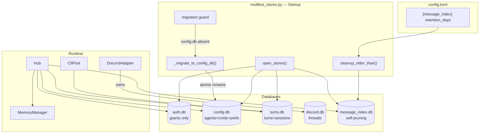
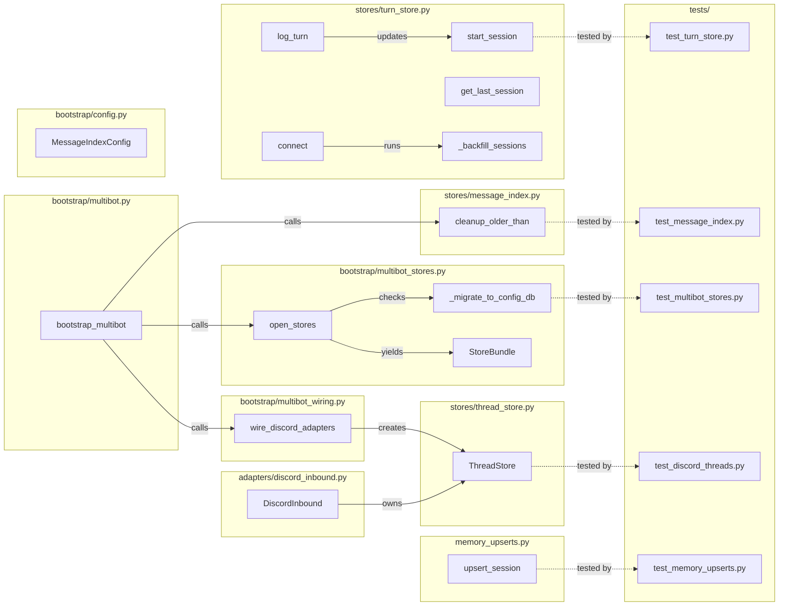

## Summary

Split `auth.db` into domain-specific databases, add explicit sessions to `turns.db`, move `ThreadStore` to adapter-owned `discord.db`, wire message_index pruning on startup, and add `session_id` metadata to memory upserts. 5 slices across 3 waves, 33 micro-tasks, 5 backend-dev agents + 1 tester.

## Architecture

### Data Flow

### File x Function Map

## Bootstrap Context

Analysis selected **Shape 1: Parallel PRs with sub-issues**. Only hard dependency: B → G. F, I, H are fully independent. Wave 1 runs I + F + B in parallel worktrees; Wave 2 runs G after B merges; Wave 3 runs H any time. B is the highest-risk PR requiring full stop → migrate → start cycle.

## Agents

| Agent | Task count | Files |
|-------|-----------|-------|
| backend-dev (S1) | 3 | `message_index.py`, `multibot.py`, `config.py` |
| backend-dev (S2) | 6 | `turn_store.py`, `cli_pool.py` |
| backend-dev (S3) | 7 | `multibot_stores.py`, `agent_store.py`, `credential_store.py`, `prefs_store.py` |
| backend-dev (S4) | 6 | `thread_store.py`, `discord_inbound.py`, `multibot_wiring.py`, `multibot_stores.py` |
| backend-dev (S5) | 1 | `memory_upserts.py` |
| tester | 10 | `tests/core/test_*.py`, `tests/adapters/test_*.py` |

## Consistency Report

- Criteria covered: 31/31
- Uncovered criteria: none
- Tasks without spec backing: none
- Gold plating exemptions applied: 0

## Micro-Tasks

### Slice V1: S1 — message_index pruning (I)

#### Task 1.1: Add MessageIndexConfig to config.py [P] → backend-dev (S1)
- **File:** `src/lyra/bootstrap/config.py`
- **Snippet:** `class MessageIndexConfig(BaseModel): retention_days: int = 90`
- **Verify:** `grep -q "retention_days" src/lyra/bootstrap/config.py` (ready)
- **Expected:** Match found
- **Time:** 3 min | **Difficulty:** 1
- **Traces:** SC S1-2 (I2) | **Phase:** GREEN

#### Task 1.2: Load [message_index] config in multibot.py [P] → backend-dev (S1)
- **File:** `src/lyra/bootstrap/multibot.py`
- **Snippet:** `mi_cfg = MessageIndexConfig(**raw_cfg.get("message_index", {}))`
- **Verify:** `grep -q "MessageIndexConfig" src/lyra/bootstrap/multibot.py` (ready)
- **Expected:** Match found
- **Time:** 3 min | **Difficulty:** 1
- **Traces:** SC S1-2 (I2) | **Phase:** GREEN

#### Task 1.3: Wire startup prune call after open_stores() → backend-dev (S1)
- **File:** `src/lyra/bootstrap/multibot.py`
- **Snippet:** `pruned = await stores.message_index.cleanup_older_than(mi_cfg.retention_days); log.info("message_index: pruned %d entries", pruned)`
- **Verify:** `grep -q "cleanup_older_than" src/lyra/bootstrap/multibot.py` (ready)
- **Expected:** Match found
- **Time:** 5 min | **Difficulty:** 2
- **Traces:** SC S1-1, S1-3 (I1) | **Phase:** GREEN

#### Task 1.4: Write test for startup pruning → tester
- **File:** `tests/core/test_message_index.py`
- **Snippet:** `async def test_cleanup_called_on_startup(): ...` — insert old entries, call cleanup, assert count
- **Verify:** `cd /home/mickael/projects/lyra && python -m pytest tests/core/test_message_index.py -x -q` (ready)
- **Expected:** All tests pass
- **Time:** 5 min | **Difficulty:** 2
- **Traces:** SC S1-4 | **Phase:** RED

#### RED-GATE: RED complete V1 → tester
- **Verify:** All test tasks for V1 marked complete
- **Phase:** RED-GATE

---

### Slice V2: S2 — explicit sessions (F)

#### Task 2.1: Add pool_sessions DDL + index to TurnStore [P] → backend-dev (S2)
- **File:** `src/lyra/core/stores/turn_store.py`
- **Snippet:** `_CREATE_POOL_SESSIONS = """CREATE TABLE IF NOT EXISTS pool_sessions (session_id TEXT PRIMARY KEY, pool_id TEXT NOT NULL, started_at TEXT NOT NULL, last_active_at TEXT NOT NULL, ended_at TEXT, resume_count INTEGER DEFAULT 0, metadata TEXT DEFAULT '{}')"""`
- **Verify:** `grep -q "pool_sessions" src/lyra/core/stores/turn_store.py` (ready)
- **Expected:** Match found
- **Time:** 3 min | **Difficulty:** 1
- **Traces:** SC S2-1 (F1) | **Phase:** GREEN

#### Task 2.2: Wire DDL into TurnStore.connect() → backend-dev (S2)
- **File:** `src/lyra/core/stores/turn_store.py`
- **Snippet:** Add `_CREATE_POOL_SESSIONS` and `_CREATE_IDX_POOL_SESSIONS` to the DDL list in `connect()`
- **Verify:** `grep -q "_CREATE_POOL_SESSIONS" src/lyra/core/stores/turn_store.py` (ready)
- **Expected:** Match found
- **Time:** 3 min | **Difficulty:** 1
- **Traces:** SC S2-1 (F1) | **Phase:** GREEN

#### Task 2.3: Add start_session() method (INSERT OR IGNORE) → backend-dev (S2)
- **File:** `src/lyra/core/stores/turn_store.py`
- **Snippet:** `async def start_session(self, session_id: str, pool_id: str) -> None: ... INSERT OR IGNORE INTO pool_sessions ...`
- **Verify:** `grep -q "start_session" src/lyra/core/stores/turn_store.py` (ready)
- **Expected:** Match found
- **Time:** 5 min | **Difficulty:** 2
- **Traces:** SC S2-2 (F2) | **Phase:** GREEN

#### Task 2.4: Modify log_turn() to update last_active_at → backend-dev (S2)
- **File:** `src/lyra/core/stores/turn_store.py`
- **Snippet:** After existing INSERT, add `UPDATE pool_sessions SET last_active_at = ? WHERE session_id = ?` (tolerant: 0-row update OK)
- **Verify:** `grep -q "last_active_at" src/lyra/core/stores/turn_store.py` (ready)
- **Expected:** Match found
- **Time:** 5 min | **Difficulty:** 2
- **Traces:** SC S2-3 (F3) | **Phase:** GREEN

#### Task 2.5: Rewrite get_last_session() to query pool_sessions → backend-dev (S2)
- **File:** `src/lyra/core/stores/turn_store.py`
- **Snippet:** Replace index scan with `SELECT session_id FROM pool_sessions WHERE pool_id = ? ORDER BY last_active_at DESC LIMIT 1`
- **Verify:** `grep -q "pool_sessions" src/lyra/core/stores/turn_store.py` (ready)
- **Expected:** Match found (multiple)
- **Time:** 5 min | **Difficulty:** 3
- **Traces:** SC S2-4 (F4) | **Phase:** GREEN

#### Task 2.6: Add _backfill_sessions() migration to connect() → backend-dev (S2)
- **File:** `src/lyra/core/stores/turn_store.py`
- **Snippet:** `async def _backfill_sessions(self, db): ... INSERT OR IGNORE INTO pool_sessions SELECT session_id, pool_id, MIN(timestamp), MAX(timestamp), NULL, 0, '{}' FROM conversation_turns WHERE session_id != '' GROUP BY pool_id, session_id`
- **Verify:** `grep -q "_backfill_sessions" src/lyra/core/stores/turn_store.py` (ready)
- **Expected:** Match found
- **Time:** 8 min | **Difficulty:** 3
- **Traces:** SC S2-5, S2-6 (F5) | **Phase:** GREEN

#### Task 2.7: Call start_session() from CliPool → backend-dev (S2)
- **File:** `src/lyra/core/cli_pool.py`
- **Snippet:** In pool creation / session start path, call `await turn_store.start_session(session_id, pool_id)`
- **Verify:** `grep -q "start_session" src/lyra/core/cli_pool.py` (ready)
- **Expected:** Match found
- **Time:** 5 min | **Difficulty:** 3
- **Traces:** SC S2-2 (F2) | **Phase:** GREEN

#### Task 2.8: Write tests for start_session + get_last_session + backfill → tester
- **File:** `tests/core/test_turn_store.py`
- **Snippet:** `test_start_session_idempotent`, `test_get_last_session_from_pool_sessions`, `test_backfill_no_duplicates`, `test_log_turn_absent_session`
- **Verify:** `cd /home/mickael/projects/lyra && python -m pytest tests/core/test_turn_store.py -x -q` (ready)
- **Expected:** All tests pass
- **Time:** 10 min | **Difficulty:** 3
- **Traces:** SC S2-1 through S2-7 | **Phase:** RED

#### RED-GATE: RED complete V2 → tester
- **Verify:** All test tasks for V2 marked complete
- **Phase:** RED-GATE

---

### Slice V3: S3 — auth.db split (B)

#### Task 3.1: Add _migration_complete sentinel DDL [P] → backend-dev (S3)
- **File:** `src/lyra/bootstrap/multibot_stores.py`
- **Snippet:** `_SENTINEL_DDL = "CREATE TABLE IF NOT EXISTS _migration_complete (migrated_at TEXT NOT NULL)"`
- **Verify:** `grep -q "_migration_complete" src/lyra/bootstrap/multibot_stores.py` (ready)
- **Expected:** Match found
- **Time:** 3 min | **Difficulty:** 1
- **Traces:** SC S3-4 (B1) | **Phase:** GREEN

#### Task 3.2: Write _migrate_to_config_db() with atomic rename → backend-dev (S3)
- **File:** `src/lyra/bootstrap/multibot_stores.py`
- **Snippet:** `async def _migrate_to_config_db(vault_dir: Path) -> None:` — open auth.db read-only, create temp file, copy 5 tables (agents, bot_agent_map, agent_runtime_state, bot_secrets, user_prefs) via INSERT INTO ... SELECT, write sentinel, commit, atomic rename to config.db
- **Verify:** `grep -q "_migrate_to_config_db" src/lyra/bootstrap/multibot_stores.py` (ready)
- **Expected:** Match found
- **Time:** 10 min | **Difficulty:** 4
- **Traces:** SC S3-1, S3-4, S3-6 (B2) | **Phase:** GREEN

#### Task 3.3: Add partial migration recovery → backend-dev (S3)
- **File:** `src/lyra/bootstrap/multibot_stores.py`
- **Snippet:** In `open_stores()`: if `config.db` exists but sentinel table is empty/absent → `config.db.unlink()` + re-migrate
- **Verify:** `grep -q "partial" src/lyra/bootstrap/multibot_stores.py` (ready)
- **Expected:** Match found
- **Time:** 5 min | **Difficulty:** 3
- **Traces:** SC S3-5 (B3) | **Phase:** GREEN

#### Task 3.4: Update AgentStore connection → config.db → backend-dev (S3)
- **File:** `src/lyra/bootstrap/multibot_stores.py`
- **Snippet:** Change `AgentStore(db_path=vault_dir / "auth.db")` → `AgentStore(db_path=vault_dir / "config.db")`
- **Verify:** `grep -q 'config.db' src/lyra/bootstrap/multibot_stores.py` (ready)
- **Expected:** Match found
- **Time:** 3 min | **Difficulty:** 1
- **Traces:** SC S3-3 (B4) | **Phase:** GREEN

#### Task 3.5: Update CredentialStore connection → config.db → backend-dev (S3)
- **File:** `src/lyra/bootstrap/multibot_stores.py`
- **Snippet:** Change `CredentialStore(db_path=vault_dir / "auth.db", ...)` → `CredentialStore(db_path=vault_dir / "config.db", ...)`
- **Verify:** `grep "CredentialStore" src/lyra/bootstrap/multibot_stores.py | grep -q "config.db"` (ready)
- **Expected:** Match found
- **Time:** 3 min | **Difficulty:** 1
- **Traces:** SC S3-3 (B4) | **Phase:** GREEN

#### Task 3.6: Update PrefsStore connection → config.db → backend-dev (S3)
- **File:** `src/lyra/bootstrap/multibot_stores.py`
- **Snippet:** Change `PrefsStore(db_path=vault_dir / "auth.db")` → `PrefsStore(db_path=vault_dir / "config.db")`
- **Verify:** `grep "PrefsStore" src/lyra/bootstrap/multibot_stores.py | grep -q "config.db"` (ready)
- **Expected:** Match found
- **Time:** 3 min | **Difficulty:** 1
- **Traces:** SC S3-3 (B4) | **Phase:** GREEN

#### Task 3.7: Wire migration guard into open_stores() → backend-dev (S3)
- **File:** `src/lyra/bootstrap/multibot_stores.py`
- **Snippet:** At start of `open_stores()`: check `config_db_path.exists()` → if not: `await _migrate_to_config_db(vault_dir)` → if partial: recover → log warning
- **Verify:** `grep -q "migration" src/lyra/bootstrap/multibot_stores.py` (ready)
- **Expected:** Match found
- **Time:** 8 min | **Difficulty:** 4
- **Traces:** SC S3-4, S3-5 (B1, B3, B6) | **Phase:** GREEN

#### Task 3.8: Write test for fresh migration → tester
- **File:** `tests/bootstrap/test_multibot_stores.py` (new)
- **Snippet:** `test_migration_creates_config_db` — create auth.db with all tables, run open_stores, assert config.db exists with sentinel + all 5 tables
- **Verify:** `cd /home/mickael/projects/lyra && python -m pytest tests/bootstrap/test_multibot_stores.py -x -q` (ready)
- **Expected:** All tests pass
- **Time:** 10 min | **Difficulty:** 4
- **Traces:** SC S3-1, S3-4, S3-9 | **Phase:** RED

#### Task 3.9: Write test for _populate_343/_rebuild_346 idempotency on config.db → tester
- **File:** `tests/bootstrap/test_multibot_stores.py`
- **Snippet:** `test_agent_migrations_idempotent_on_copied_db` — migrate, run connect twice, assert row counts unchanged
- **Verify:** `cd /home/mickael/projects/lyra && python -m pytest tests/bootstrap/test_multibot_stores.py::test_agent_migrations_idempotent_on_copied_db -x -q` (ready)
- **Expected:** Test passes
- **Time:** 8 min | **Difficulty:** 3
- **Traces:** SC S3-7 | **Phase:** RED

#### Task 3.10: Write test for partial migration recovery → tester
- **File:** `tests/bootstrap/test_multibot_stores.py`
- **Snippet:** `test_partial_migration_recovery` — create config.db without sentinel, run open_stores, assert it re-migrates
- **Verify:** `cd /home/mickael/projects/lyra && python -m pytest tests/bootstrap/test_multibot_stores.py::test_partial_migration_recovery -x -q` (ready)
- **Expected:** Test passes
- **Time:** 5 min | **Difficulty:** 3
- **Traces:** SC S3-5 | **Phase:** RED

#### RED-GATE: RED complete V3 → tester
- **Verify:** All test tasks for V3 marked complete
- **Phase:** RED-GATE

---

### Slice V4: S4 — ThreadStore → discord.db (G) [depends on V3]

#### Task 4.1: Write _migrate_threads_to_discord_db() with atomic rename [P] → backend-dev (S4)
- **File:** `src/lyra/bootstrap/multibot_stores.py`
- **Snippet:** `async def _migrate_threads_to_discord_db(vault_dir: Path) -> None:` — copy discord_threads from auth.db to temp, atomic rename to discord.db
- **Verify:** `grep -q "_migrate_threads_to_discord_db" src/lyra/bootstrap/multibot_stores.py` (ready)
- **Expected:** Match found
- **Time:** 8 min | **Difficulty:** 3
- **Traces:** SC S4-4 (G2) | **Phase:** GREEN

#### Task 4.2: Remove thread field from StoreBundle → backend-dev (S4)
- **File:** `src/lyra/bootstrap/multibot_stores.py`
- **Snippet:** Remove `thread: ThreadStore` from `StoreBundle` dataclass; remove thread_store creation + close from `open_stores()`
- **Verify:** `grep -qv "thread" src/lyra/bootstrap/multibot_stores.py || true` (manual)
- **Expected:** No `thread` field in StoreBundle
- **Time:** 5 min | **Difficulty:** 2
- **Traces:** SC S4-3 (G3) | **Phase:** GREEN

#### Task 4.3: Remove thread_store param from wire_discord_adapters() → backend-dev (S4)
- **File:** `src/lyra/bootstrap/multibot_wiring.py`
- **Snippet:** Remove `thread_store: ThreadStore` parameter; adapter creates its own store
- **Verify:** `grep -q "thread_store" src/lyra/bootstrap/multibot_wiring.py` (ready — should NOT match after change)
- **Expected:** No match (exit code 1)
- **Time:** 5 min | **Difficulty:** 3
- **Traces:** SC S4-2 (G1) | **Phase:** GREEN

#### Task 4.4: Create ThreadStore(discord.db) inside adapter construction → backend-dev (S4)
- **File:** `src/lyra/bootstrap/multibot_wiring.py`
- **Snippet:** In adapter construction: `thread_store = ThreadStore(db_path=vault_dir / "discord.db"); await thread_store.connect()`
- **Verify:** `grep -q "discord.db" src/lyra/bootstrap/multibot_wiring.py` (ready)
- **Expected:** Match found
- **Time:** 5 min | **Difficulty:** 3
- **Traces:** SC S4-2, S4-6 (G1, G4) | **Phase:** GREEN

#### Task 4.5: Add thread_store.close() to adapter close() → backend-dev (S4)
- **File:** `src/lyra/adapters/discord_inbound.py`
- **Snippet:** In adapter `close()` or shutdown path: `await self._thread_store.close()`
- **Verify:** `grep -q "thread_store.close" src/lyra/adapters/discord_inbound.py` (ready)
- **Expected:** Match found
- **Time:** 3 min | **Difficulty:** 2
- **Traces:** SC S4-8 (G6) | **Phase:** GREEN

#### Task 4.6: Verify _session_update_fn references adapter-owned store → backend-dev (S4)
- **File:** `src/lyra/adapters/discord_inbound.py`
- **Snippet:** Confirm `_session_update_fn` closure captures the adapter-local `self._thread_store` (should be automatic after Task 4.4)
- **Verify:** `grep -A5 "_session_update_fn" src/lyra/adapters/discord_inbound.py | grep -q "thread_store"` (ready)
- **Expected:** Match found
- **Time:** 3 min | **Difficulty:** 1
- **Traces:** SC S4-7 (G5) | **Phase:** GREEN

#### Task 4.7: Update multibot.py call site to remove stores.thread → backend-dev (S4)
- **File:** `src/lyra/bootstrap/multibot.py`
- **Snippet:** Remove `stores.thread` from `wire_discord_adapters()` call; add discord.db migration call before wiring
- **Verify:** `grep "wire_discord_adapters" src/lyra/bootstrap/multibot.py | grep -qv "thread"` (ready)
- **Expected:** Match found (call without thread param)
- **Time:** 5 min | **Difficulty:** 2
- **Traces:** SC S4-2, S4-3 (G1, G3) | **Phase:** GREEN

#### Task 4.8: Write tests for ThreadStore migration + adapter lifecycle → tester
- **File:** `tests/adapters/test_discord_threads.py`
- **Snippet:** `test_thread_migration_to_discord_db`, `test_adapter_close_closes_thread_store`, `test_hub_no_threadstore_import`
- **Verify:** `cd /home/mickael/projects/lyra && python -m pytest tests/adapters/test_discord_threads.py -x -q` (ready)
- **Expected:** All tests pass
- **Time:** 10 min | **Difficulty:** 3
- **Traces:** SC S4-1 through S4-9 | **Phase:** RED

#### RED-GATE: RED complete V4 → tester
- **Verify:** All test tasks for V4 marked complete
- **Phase:** RED-GATE

---

### Slice V5: S5 — memory session_id (H)

#### Task 5.1: Add session_id to metadata kwargs in upsert_session() [P] → backend-dev (S5)
- **File:** `src/lyra/core/memory_upserts.py`
- **Snippet:** Add `session_id=snap.session_id` to the `self._db.upsert_session()` kwargs (as queryable metadata, separate from the positional identifier)
- **Verify:** `grep -c "session_id" src/lyra/core/memory_upserts.py` (ready)
- **Expected:** Count increases by 1 vs current
- **Time:** 3 min | **Difficulty:** 1
- **Traces:** SC S5-1 (H1) | **Phase:** GREEN

#### Task 5.2: Write test for session_id in vault metadata → tester
- **File:** `tests/core/test_memory_upserts.py` (new or existing)
- **Snippet:** `test_upsert_session_includes_session_id_metadata` — upsert a session, recall, assert session_id in metadata
- **Verify:** `cd /home/mickael/projects/lyra && python -m pytest tests/core/test_memory_upserts.py -x -q` (ready)
- **Expected:** All tests pass
- **Time:** 5 min | **Difficulty:** 2
- **Traces:** SC S5-1, S5-2 (H1, H2) | **Phase:** RED

#### RED-GATE: RED complete V5 → tester
- **Verify:** All test tasks for V5 marked complete
- **Phase:** RED-GATE
