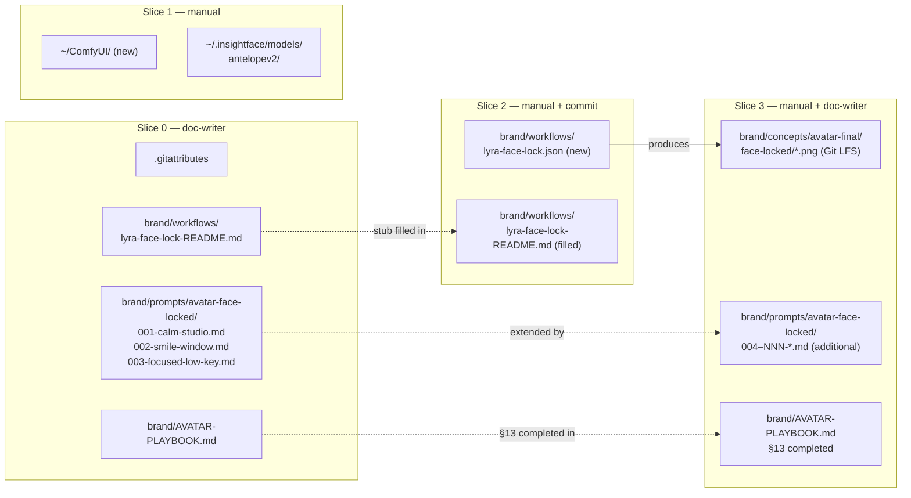

## Summary

Brand workflow issue split across 4 sub-issues by OS dependency. Slice 0 (#420) is
text-only documentation executable now on WSL2. Slices 1–3 (#421–#423) are manual
ops runbooks requiring Pop!_OS migration and GPU access.

No code changes to `imageCLI` or `lyra`.

---

## Architecture

### Data flow: reference → workflow → assets → training dataset

```mermaid
flowchart TD
    subgraph NOW["Now — WSL2 (Slice 0 / #420)"]
        A1[".gitattributes\nGit LFS rule"]
        A2["brand/workflows/\nlyra-face-lock-README.md stub"]
        A3["brand/prompts/avatar-face-locked/\n001–003-*.md starters"]
        A4["brand/AVATAR-PLAYBOOK.md\n§13 updated"]
    end

    subgraph S1["Pop!_OS — Slice 1 / #421"]
        B1["ComfyUI installed\n~/ComfyUI/"]
        B2["PyTorch nightly cu128\nsm_120 compatible"]
        B3["iFayens/ComfyUI-PuLID-Flux2\nnode installed"]
        B4["AntelopeV2 + EVA02-CLIP\nweights downloaded"]
        B5["Smoke-test\n30–45 min JIT warm"]
    end

    subgraph S2["Pop!_OS — Slice 2 / #422"]
        C1["Face-lock workflow\nFlux2-native node chain"]
        C2["Quality gate\n≥4/5 pass"]
        C3["brand/workflows/\nlyra-face-lock.json committed\nREADME verified"]
    end

    subgraph S3["Pop!_OS — Slice 3 / #423"]
        D1["≥20 face-locked variations\nGit LFS"]
        D2["≥5 prompt .md files\nbrand/prompts/avatar-face-locked/"]
        D3["AVATAR-PLAYBOOK §13\ncomplete"]
    end

    subgraph FUTURE["Follow-on — Shape C"]
        E1["25+ images → LoRA dataset"]
        E2["ai-toolkit training\n~2h on RTX 5070 Ti"]
        E3["lyra-face.safetensors\nimageCLI --lora"]
    end

    REF["006-just-solved-1024.png\nface reference — frozen"]

    A2 --> B1
    B1 --> B2 --> B3 --> B4 --> B5
    B5 --> C1
    REF --> C1
    C1 --> C2 --> C3
    C3 --> D1
    A3 --> D2
    D1 --> D3
    D1 -.-> E1 --> E2 --> E3

    style NOW fill:#1a2a1a,stroke:#4a7a4a
    style FUTURE fill:#1a1a2a,stroke:#4a4a7a,stroke-dasharray:4
```



### File × artifact map



---

## Sub-issues

| Sub-issue | Title | OS | Status |
|-----------|-------|----|--------|
| [#420](https://github.com/Roxabi/lyra/issues/420) | docs prep — scaffold, templates, playbook §13 | WSL2 — **now** | 🟢 Unblocked |
| [#421](https://github.com/Roxabi/lyra/issues/421) | ComfyUI + PuLID environment setup | Pop!_OS | 🔴 Blocked by #420 + OS migration |
| [#422](https://github.com/Roxabi/lyra/issues/422) | face-lock workflow build + quality gate | Pop!_OS | 🔴 Blocked by #421 |
| [#423](https://github.com/Roxabi/lyra/issues/423) | variation campaign + complete playbook | Pop!_OS | 🔴 Blocked by #422 |

---

## Agents

| Agent | Slices | Tasks | Files |
|-------|--------|-------|-------|
| doc-writer | V0, V3 (docs) | 4 (V0) + 2 (V3) | `.gitattributes`, `brand/workflows/lyra-face-lock-README.md`, `brand/prompts/avatar-face-locked/00{1-3}-*.md`, `brand/AVATAR-PLAYBOOK.md` |
| manual (Mickael) | V1, V2, V3 (ops) | — | `~/ComfyUI/`, `brand/workflows/lyra-face-lock.json`, `brand/concepts/avatar-final/face-locked/*.png` |

---

## Consistency Report

| Check | Result |
|-------|--------|
| SC-0-1 (README stub) | ✅ → V0-T2 |
| SC-0-2 (prompt .md files) | ✅ → V0-T3 |
| SC-0-3 (.gitattributes LFS) | ✅ → V0-T1 |
| SC-0-4 (AVATAR-PLAYBOOK §13) | ✅ → V0-T4 |
| SC-1 (ComfyUI loads) | ✅ → V1 runbook |
| SC-2 (≥16/20 face identity) | ✅ → V2 quality gate + V3 campaign |
| SC-3 (≥20 variations, LFS) | ✅ → V3 ops |
| SC-4 (workflow JSON + README) | ✅ → V2 ops |

**Covered:** 8/8 · **Uncovered:** 0 · **Exemptions:** 0

---

## Micro-Tasks

### ── V0 (Slice 0) — WSL2, now ── RED-GATE: all 4 tasks complete before #421

---

**V0-T1** `[P]` — Create `.gitattributes` with Git LFS rule
- **File:** `.gitattributes` (new)
- **Agent:** doc-writer
- **Spec trace:** SC-0-3
- **Phase:** GREEN · **Difficulty:** 1 · **Time:** 2 min
- **Content:**
  ```
  brand/concepts/avatar-final/face-locked/*.png filter=lfs diff=lfs merge=lfs -text
  ```
- **Verify:** `test -f .gitattributes && grep -q 'face-locked' .gitattributes && echo ok`
- **Expected:** `ok`

---

**V0-T2** — Write `brand/workflows/lyra-face-lock-README.md` stub
- **File:** `brand/workflows/lyra-face-lock-README.md` (new dir + file)
- **Agent:** doc-writer
- **Spec trace:** SC-0-1
- **Phase:** GREEN · **Difficulty:** 2 · **Time:** 8 min
- **Content must include:**
  - Node chain: `DualCLIPLoader` → `CLIPTextEncodeFlux` → `CheckpointLoaderSimple` → `LoadImage` → `ApplyPulidFlux2` → `FluxGuidance` + `BasicScheduler` + `SamplerCustomAdvanced` → `VAEDecode` → `SaveImage`
  - `> ⚠️ Do NOT use KSampler or single CLIPTextEncode — these are SDXL nodes, not Flux2`
  - Tuning table: strength × method × end_at with observed trade-offs
  - VRAM section: 14–16 GB ceiling, OOM mitigations (`--lowvram`, cap 1024×1024, FP8 unverified)
  - AntelopeV2 manual download command (huggingface_hub snapshot_download)
  - PyTorch nightly: placeholder `[RECORD AFTER INSTALL: pip install --pre torch ...]`
  - GPU mutex: `⚠️ ComfyUI and imageCLI must NEVER run concurrently — both use flux2-klein-4B on the same 16 GB GPU`
- **Verify:** `test -f brand/workflows/lyra-face-lock-README.md && grep -q 'DualCLIPLoader' brand/workflows/lyra-face-lock-README.md && grep -q 'mutex' brand/workflows/lyra-face-lock-README.md && echo ok`
- **Expected:** `ok`

---

**V0-T3** `[P]` — Write 3 starter face-lock prompt `.md` files
- **Files:** `brand/prompts/avatar-face-locked/001-calm-studio.md`, `002-smile-window.md`, `003-focused-low-key.md` (new dir + files)
- **Agent:** doc-writer
- **Spec trace:** SC-0-2
- **Phase:** GREEN · **Difficulty:** 2 · **Time:** 8 min
- **Frontmatter template** (each file):
  ```yaml
  ---
  engine: flux2-klein
  width: 1024
  height: 1024
  steps: 8
  guidance: 1.0
  seed: [unique per file]
  pulid_strength: 0.6
  pulid_method: fidelity
  pulid_start_at: 0.0
  pulid_end_at: 1.0
  ---
  ```
- **Prompt rule:** describe expression + lighting + bg only — NO facial features (eye shape, jaw, bone structure)
- **001:** calm/neutral, soft studio left key, Obsidian bg
- **002:** warm smile, natural window light, blurred outdoor bg
- **003:** focused/serious, low-key single rim light, dark bg
- **Verify:** `ls brand/prompts/avatar-face-locked/*.md | wc -l | grep -qE '^[3-9]|^[0-9]{2,}' && grep -q 'pulid_strength' brand/prompts/avatar-face-locked/001-calm-studio.md && echo ok`
- **Expected:** `ok`

---

**V0-T4** — Update `brand/AVATAR-PLAYBOOK.md` §13 with content
- **File:** `brand/AVATAR-PLAYBOOK.md` (update existing `## 13. Face Locking` section)
- **Agent:** doc-writer
- **Spec trace:** SC-0-4
- **Phase:** GREEN · **Difficulty:** 2 · **Time:** 6 min
- **Replace** the existing `## 13. Face Locking (Optional, Future)` placeholder with:
  ```markdown
  ## 13. Face Locking (PuLID Flux2)

  ### Prerequisites
  - ComfyUI installed on Machine 2 (Pop!_OS) — see `brand/workflows/lyra-face-lock-README.md`
  - `flux2-klein-4B` checkpoint available
  - `iFayens/ComfyUI-PuLID-Flux2` node installed
  - ⚠️ imageCLI must not be running (shared 16 GB VRAM)

  ### Workflow
  <!-- TODO (Slice 2 / #422): fill in step-by-step after first run -->
  See `brand/workflows/lyra-face-lock.json` + README for node chain.

  ### Tuning Reference
  <!-- TODO (Slice 2 / #422): fill in from quality gate results -->

  | Setting | Value | Effect |
  |---------|-------|--------|
  | `pulid_strength` | 0.6 | Recommended starting point |
  | `pulid_method` | `fidelity` | Strong identity lock |
  | `end_at` | 1.0 → 0.6 | Reduce to allow more pose freedom |

  ### VRAM Budget
  - flux2-klein-4B + PuLID: ~14–16 GB (at Machine 2 ceiling)
  - Machine 1 (RTX 3080, 10 GB): cannot run this workload
  - OOM mitigations: cap 1024×1024, `--lowvram`, avoid running imageCLI concurrently

  ### Shape C trigger
  <!-- TODO (Slice 3 / #423): update with actual issue number -->
  When ≥25 diverse face-locked images exist in `brand/concepts/avatar-final/face-locked/`,
  open the Shape C LoRA training issue (see #419 for context).
  ```
- **Verify:** `grep -q 'Prerequisites' brand/AVATAR-PLAYBOOK.md && grep -q 'Shape C trigger' brand/AVATAR-PLAYBOOK.md && echo ok`
- **Expected:** `ok`

---

### ── RED-GATE V0 ── All V0 tasks verified → open #421 after Pop!_OS migration

---

### ── V1 (Slice 1) — Manual ops runbook — #421 ──

> Execute on Machine 2 after Pop!_OS migration. No agent tasks.

**Checklist:**
```bash
# 1. Install PyTorch nightly cu128 (record exact URL after running)
pip install --pre torch torchvision torchaudio \
  --index-url https://download.pytorch.org/whl/nightly/cu128
# → Record: pip show torch | grep Version

# 2. Clone ComfyUI (do NOT install xformers)
git clone https://github.com/comfyanonymous/ComfyUI ~/ComfyUI
cd ~/ComfyUI && pip install -r requirements.txt

# 3. Symlink flux2-klein from imageCLI cache
ln -s ~/.cache/huggingface/hub/models--black-forest-labs--FLUX.2-klein-base-4B \
  ~/ComfyUI/models/checkpoints/flux2-klein-4B

# 4. Install ComfyUI Manager → install iFayens/ComfyUI-PuLID-Flux2
# (via browser at localhost:8188 → Manager → Install Custom Nodes)

# 5. Download AntelopeV2 manually
pip install huggingface_hub
python -c "
from huggingface_hub import snapshot_download
snapshot_download('deepinsight/insightface', repo_type='model',
                  local_dir=os.path.expanduser('~/.insightface/models/antelopev2'))
"
# Verify path: ls ~/.insightface/models/antelopev2/
# Alt path: ~/ComfyUI/models/insightface/antelopev2/

# 6. Smoke-test (expect 30–45 min first-run JIT — this is normal)
# Load any workflow with just CheckpointLoaderSimple + KSampler → run once

# 7. Done when:
test -d ~/ComfyUI && curl -s http://localhost:8188 | grep -q comfyui && echo "ComfyUI ready"
```

---

### ── RED-GATE V1 ── Smoke-test passes → proceed to #422

---

### ── V2 (Slice 2) — Manual ops runbook — #422 ──

> Execute on Machine 2 (Pop!_OS, ComfyUI running).

**Checklist:**
```
1. Open ComfyUI at localhost:8188
2. Build Flux2-native node chain:
   - CheckpointLoaderSimple → flux2-klein-4B
   - DualCLIPLoader → CLIPTextEncodeFlux (T5-XXL + CLIP-L)
   - LoadImage → brand/concepts/avatar-final/006-just-solved-1024.png
   - ApplyPulidFlux2: strength=0.6, method=fidelity, start_at=0.0, end_at=1.0
   - FluxGuidance (guidance=1.0) + BasicScheduler (steps=8) + SamplerCustomAdvanced
   - VAEDecode + SaveImage → output/face-locked/

3. Quality gate: run 5 test outputs, prompt: neutral portrait
   - ≥4/5 must pass: same eye spacing, jaw line, nose bridge as 006-just-solved-1024.png
   - If < 4/5: tune end_at → 0.6, or switch method → neutral, or strength → 0.5

4. Save workflow: File → Save → brand/workflows/lyra-face-lock.json

5. Fill in brand/workflows/lyra-face-lock-README.md:
   - Record actual PyTorch nightly wheel URL used
   - Note tuning values that passed quality gate
   - Verify AntelopeV2 path that worked

6. Commit:
   git add brand/workflows/lyra-face-lock.json brand/workflows/lyra-face-lock-README.md
   git commit -m "feat(brand): add validated ComfyUI face-lock workflow for Lyra #422"
```

**Quality gate verify:**
```bash
test -f brand/workflows/lyra-face-lock.json \
  && grep -q 'PulidFlux' brand/workflows/lyra-face-lock.json \
  && echo "workflow committed"
```

---

### ── RED-GATE V2 ── lyra-face-lock.json committed → proceed to #423

---

### ── V3 (Slice 3) — Manual ops + doc-writer — #423 ──

**V3-T1 (manual) — Generation campaign**
```
Run workflow with each prompt .md file in brand/prompts/avatar-face-locked/
Target: ≥20 diverse images
  - ≥4 expressions: calm, subtle smile, full smile, focused/"just solved"
  - ≥3 lighting: soft studio, window natural, low-key
  - ≥2 angles: full front, ¾ left (optionally ¾ right)

Face-check each: ≥16/20 must pass (eye spacing, jaw, nose bridge match reference)
Move passing images to brand/concepts/avatar-final/face-locked/

git lfs track "brand/concepts/avatar-final/face-locked/*.png"  # already in .gitattributes
git add brand/concepts/avatar-final/face-locked/
git commit -m "feat(brand): add Lyra face-locked variation batch #423"
```

**V3-T2 (doc-writer) — Write additional prompt files**
- **Files:** `brand/prompts/avatar-face-locked/004-NNN-*.md` (≥2 additional)
- Minimum 5 total `.md` files with full PuLID frontmatter
- Each: different expression × lighting combination not covered by starters
- **Verify:** `ls brand/prompts/avatar-face-locked/*.md | wc -l | awk '{exit ($1 < 5)}'  && echo ok`

**V3-T3 (doc-writer) — Complete AVATAR-PLAYBOOK §13**
- **File:** `brand/AVATAR-PLAYBOOK.md`
- Fill in all `<!-- TODO ... -->` placeholders in §13 with actual values from V2 + V3
- Add Shape C trigger with actual issue number once created
- **Verify:** `grep -qv 'TODO' brand/AVATAR-PLAYBOOK.md || grep -c 'TODO' brand/AVATAR-PLAYBOOK.md | awk '{exit ($1 > 0)}'`

---

### ── RED-GATE V3 ── All criteria met → close #423, then close #419
