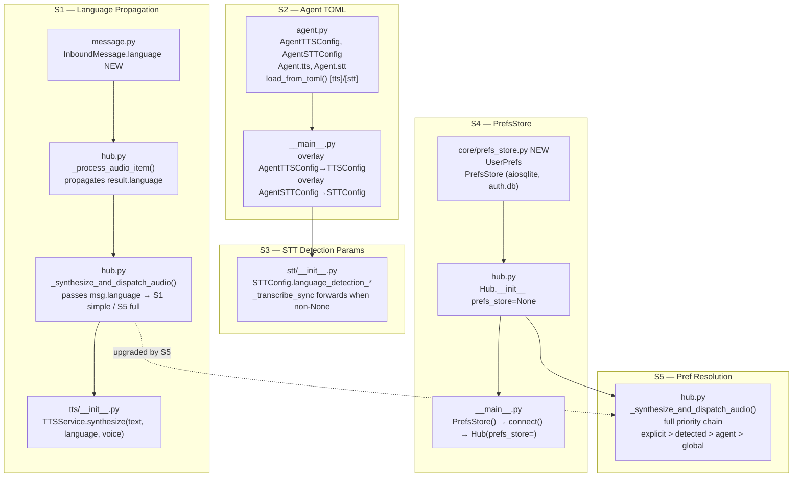
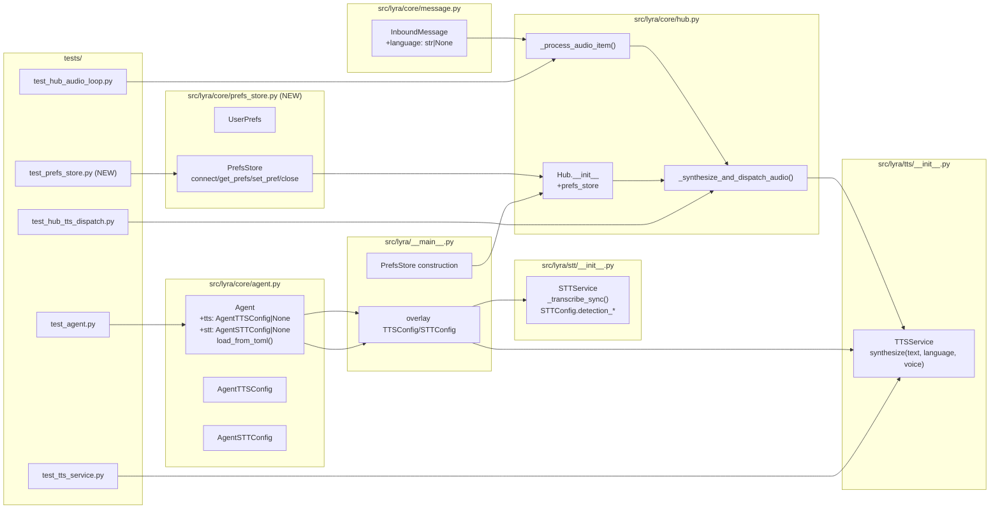

## Summary

Wire a two-level preference system end-to-end: propagate Whisper-detected language through `InboundMessage.language` into `TTSService.synthesize()`, add `[tts]`/`[stt]` TOML sections to per-agent config, add detection param forwarding in STT, and introduce `PrefsStore` with per-user language/voice overrides resolved in `hub._synthesize_and_dispatch_audio()`.

---

## Architecture





---

## Agents

| Agent | Task count | Files |
|-------|-----------|-------|
| backend-dev | 14 (GREEN) | message.py, tts/__init__.py, stt/__init__.py, core/agent.py, core/hub.py, core/prefs_store.py (new), __main__.py |
| tester | 13 (RED) | tests/tts/test_tts_service.py, tests/core/test_hub_audio_loop.py, tests/core/test_agent.py, tests/core/test_prefs_store.py (new), tests/core/test_hub_tts_dispatch.py |

---

## Consistency Report

- Spec criteria covered: 15/15
- Affordances traced: N1 → T06, N2 → T05, N3 → T27, N4 → T11+T12, N5 → T15, N6 → T20, N7 → T20
- Untraced: none
- Exemptions: SC-15 "all existing tests pass" verified by RED-GATEs

---

## Micro-Tasks

---

### Slice S1 — Language Propagation

---

#### T01 — RED: test InboundMessage.language field
- **File:** `tests/core/test_hub_audio_loop.py`
- **Phase:** RED
- **Agent:** tester
- **Spec trace:** SC-1
- **Difficulty:** 1
- **Time:** 2 min
- **[P]:** Y (independent test file)

```python
def test_inbound_message_has_language_field():
    from lyra.core.message import InboundMessage
    msg = InboundMessage(...)
    assert msg.language is None  # default

def test_inbound_message_language_set():
    msg = InboundMessage(..., language="fr")
    assert msg.language == "fr"
```

**Verify:** `uv run pytest tests/core/test_hub_audio_loop.py -k language -x`
**Expected:** FAILED (AttributeError: language)

---

#### T02 — RED: test synthesize() language param
- **File:** `tests/tts/test_tts_service.py`
- **Phase:** RED
- **Agent:** tester
- **Spec trace:** SC-2
- **Difficulty:** 2
- **Time:** 3 min
- **[P]:** Y

```python
@pytest.mark.asyncio
async def test_synthesize_passes_language_to_generate():
    svc = TTSService(TTSConfig())
    captured = {}
    async def fake_gen(text, **kwargs):
        captured.update(kwargs)
        return _make_chunked_result([wav_path])
    with patch("voicecli.generate_async", new=AsyncMock(side_effect=fake_gen)):
        with patch("voicecli.utils.wav_to_mp3", ...):
            await svc.synthesize("Hello", language="fr")
    assert captured["language"] == "fr"

@pytest.mark.asyncio
async def test_synthesize_language_none_uses_init_value():
    # language=None → self._language (from TTSConfig) is forwarded
    svc = TTSService(TTSConfig(language="English"))
    ...
    await svc.synthesize("Hello")  # no override
    assert captured["language"] == "English"
```

**Verify:** `uv run pytest tests/tts/test_tts_service.py -k language -x`
**Expected:** FAILED (TypeError: synthesize() got unexpected keyword argument)

---

#### T03 — RED: test _process_audio_item propagates language
- **File:** `tests/core/test_hub_audio_loop.py`
- **Phase:** RED
- **Agent:** tester
- **Spec trace:** SC-1
- **Difficulty:** 2
- **Time:** 3 min
- **[P]:** Y

```python
@pytest.mark.asyncio
async def test_process_audio_item_propagates_language(hub, stt_service, mock_audio):
    # stt_service returns TranscriptionResult(text="bonjour", language="fr")
    # expect InboundMessage.language == "fr"
    enqueued = []
    hub.inbound_bus.put = lambda _, msg: enqueued.append(msg)
    await hub._process_audio_item(mock_audio)
    assert enqueued[0].language == "fr"
```

**Verify:** `uv run pytest tests/core/test_hub_audio_loop.py -k propagates_language -x`
**Expected:** FAILED

---

#### T04 — GREEN: add language field to InboundMessage
- **File:** `src/lyra/core/message.py`
- **Phase:** GREEN
- **Agent:** backend-dev
- **Spec trace:** SC-1
- **Difficulty:** 1
- **Time:** 2 min
- **[P]:** Y

```python
@dataclass(frozen=True)
class InboundMessage:
    ...
    locale: str | None = None
    language: str | None = None   # NEW: Whisper-detected spoken language (e.g. "fr")
    ...
```

**Verify:** `uv run pytest tests/core/test_hub_audio_loop.py -k language -x`
**Expected:** 2 tests pass

---

#### T05 — GREEN: add language/voice params to TTSService.synthesize()
- **File:** `src/lyra/tts/__init__.py`
- **Phase:** GREEN
- **Agent:** backend-dev
- **Spec trace:** SC-2
- **Difficulty:** 2
- **Time:** 3 min
- **[P]:** N (depends on T04 for message.py to be clean)

```python
async def synthesize(
    self, text: str, *, language: str | None = None, voice: str | None = None
) -> SynthesisResult:
    """language overrides self._language when non-None; voice overrides self._voice."""
    result = await generate_async(
        text,
        output=tmp_path,
        engine=self._engine,
        voice=voice if voice is not None else self._voice,
        language=language if language is not None else self._language,
        chunked=True,
        mp3=False,
    )
```

**Verify:** `uv run pytest tests/tts/test_tts_service.py -x`
**Expected:** all pass

---

#### T06 — GREEN: wire result.language into InboundMessage in _process_audio_item
- **File:** `src/lyra/core/hub.py`
- **Phase:** GREEN
- **Agent:** backend-dev
- **Spec trace:** SC-1
- **Difficulty:** 2
- **Time:** 3 min
- **[P]:** N (depends on T04)

```python
msg = InboundMessage(
    ...
    language=result.language,   # NEW: propagate Whisper-detected language
    modality="voice",
)
```

Location: hub.py line ~757 inside `_process_audio_item()`.

**Verify:** `uv run pytest tests/core/test_hub_audio_loop.py -k language -x`
**Expected:** all pass

---

#### T07 — GREEN: pass msg.language in _synthesize_and_dispatch_audio (S1 simple)
- **File:** `src/lyra/core/hub.py`
- **Phase:** GREEN
- **Agent:** backend-dev
- **Spec trace:** SC-3
- **Difficulty:** 2
- **Time:** 3 min
- **[P]:** N (depends on T05, T06)

```python
async def _synthesize_and_dispatch_audio(self, msg: InboundMessage, text: str) -> None:
    assert self._tts is not None
    try:
        result = await self._tts.synthesize(text, language=msg.language)
        ...
```

Note: S5 upgrades this to the full resolution chain.

**Verify:** `uv run pytest tests/core/test_hub_tts_dispatch.py -x`
**Expected:** existing tests pass; S1 scenario (language from msg) works

---

#### RED-GATE S1
```bash
uv run pytest tests/tts/test_tts_service.py tests/core/test_hub_audio_loop.py tests/core/test_hub_tts_dispatch.py -x
```
**Required:** All S1 tests pass before proceeding to S2.

---

### Slice S2 — Agent TOML [tts]/[stt]

---

#### T08 — RED: test AgentTTSConfig/AgentSTTConfig dataclasses exist
- **File:** `tests/core/test_agent.py`
- **Phase:** RED
- **Agent:** tester
- **Spec trace:** SC-5, SC-6
- **Difficulty:** 1
- **Time:** 2 min
- **[P]:** Y

```python
def test_agent_tts_config_all_optional():
    from lyra.core.agent import AgentTTSConfig
    cfg = AgentTTSConfig()
    assert cfg.engine is None
    assert cfg.voice is None

def test_agent_stt_config_all_optional():
    from lyra.core.agent import AgentSTTConfig
    cfg = AgentSTTConfig()
    assert cfg.language_detection_threshold is None
```

**Verify:** `uv run pytest tests/core/test_agent.py -k AgentTTSConfig -x`
**Expected:** FAILED (ImportError)

---

#### T09 — RED: test load_from_toml parses [tts]/[stt] sections
- **File:** `tests/core/test_agent.py`
- **Phase:** RED
- **Agent:** tester
- **Spec trace:** SC-5, SC-6
- **Difficulty:** 2
- **Time:** 3 min
- **[P]:** Y

```python
def test_load_agent_config_parses_tts_section(tmp_path):
    toml = "[agent]\nname='x'\n[model]\nbackend='claude-cli'\nmodel='m'\n[tts]\nengine='qwen-fast'\nvoice='Ono_Anna'"
    (tmp_path / "x.toml").write_text(toml)
    agent = load_agent_config("x", agents_dir=tmp_path)
    assert agent.tts is not None
    assert agent.tts.engine == "qwen-fast"
    assert agent.tts.voice == "Ono_Anna"

def test_load_agent_config_missing_tts_section(tmp_path):
    # no [tts] → agent.tts is None
    ...
    assert agent.tts is None
    assert agent.stt is None
```

**Verify:** `uv run pytest tests/core/test_agent.py -k tts_section -x`
**Expected:** FAILED

---

#### T10 — GREEN: add AgentTTSConfig, AgentSTTConfig dataclasses to agent.py
- **File:** `src/lyra/core/agent.py`
- **Phase:** GREEN
- **Agent:** backend-dev
- **Spec trace:** SC-5, SC-6
- **Difficulty:** 2
- **Time:** 4 min
- **[P]:** N (depends on RED tests)

```python
@dataclass(frozen=True)
class AgentTTSConfig:
    engine: str | None = None
    voice: str | None = None
    language: str | None = None
    accent: str | None = None
    personality: str | None = None
    speed: str | None = None
    emotion: str | None = None
    segment_gap: int | None = None
    crossfade: int | None = None
    chunked: bool | None = None
    chunk_size: int | None = None

@dataclass(frozen=True)
class AgentSTTConfig:
    language_detection_threshold: float | None = None
    language_detection_segments: int | None = None
    language_fallback: str | None = None
```

**Verify:** `uv run pytest tests/core/test_agent.py -k AgentTTSConfig -x`
**Expected:** dataclass tests pass

---

#### T11 — GREEN: add tts/stt to Agent dataclass and load_from_toml()
- **File:** `src/lyra/core/agent.py`
- **Phase:** GREEN
- **Agent:** backend-dev
- **Spec trace:** SC-5, SC-6
- **Difficulty:** 3
- **Time:** 5 min
- **[P]:** N (depends on T10)

```python
@dataclass(frozen=True)
class Agent:
    ...
    tts: AgentTTSConfig | None = None
    stt: AgentSTTConfig | None = None

def load_from_toml(...):
    ...
    # Parse [tts] section
    tts_section = data.get("tts")
    agent_tts: AgentTTSConfig | None = None
    if tts_section:
        agent_tts = AgentTTSConfig(
            engine=tts_section.get("engine"),
            voice=tts_section.get("voice"),
            language=tts_section.get("language"),
            ...
        )
    stt_section = data.get("stt")
    agent_stt: AgentSTTConfig | None = None
    if stt_section:
        agent_stt = AgentSTTConfig(
            language_detection_threshold=stt_section.get("language_detection_threshold"),
            language_detection_segments=stt_section.get("language_detection_segments"),
            language_fallback=stt_section.get("language_fallback"),
        )
    return Agent(..., tts=agent_tts, stt=agent_stt)
```

**Verify:** `uv run pytest tests/core/test_agent.py -k tts_section -x`
**Expected:** all pass

---

#### T12 — GREEN: overlay AgentTTSConfig/STTConfig in __main__.py
- **File:** `src/lyra/__main__.py`
- **Phase:** GREEN
- **Agent:** backend-dev
- **Spec trace:** SC-7, SC-8
- **Difficulty:** 3
- **Time:** 5 min
- **[P]:** N (depends on T11)

```python
# After loading first_agent_config:
tts_cfg = load_tts_config()
if first_agent_config.tts is not None:
    a = first_agent_config.tts
    # Overlay: agent-TOML fields win over env-var defaults when non-None
    if a.engine is not None: tts_cfg = dataclasses.replace(tts_cfg, engine=a.engine)
    if a.voice is not None:  tts_cfg = dataclasses.replace(tts_cfg, voice=a.voice)
    if a.language is not None: tts_cfg = dataclasses.replace(tts_cfg, language=a.language)
tts_service = TTSService(tts_cfg) if stt_service is not None and ... else None

stt_cfg = load_stt_config()
if first_agent_config.stt is not None:
    a = first_agent_config.stt
    if a.language_detection_threshold is not None:
        stt_cfg = dataclasses.replace(stt_cfg, language_detection_threshold=a.language_detection_threshold)
    ...
```

Note: `AgentTTSConfig` has extra fields (accent, personality, etc.) not in `TTSConfig` — these are passed to `TTSService.synthesize()` via the config; defer those to a follow-up or add them to `TTSConfig` as needed.

**Verify:** `uv run python -c "from lyra.__main__ import _bootstrap_multibot"`
**Expected:** no import errors

---

#### RED-GATE S2
```bash
uv run pytest tests/core/test_agent.py -x
```
**Required:** All S2 tests pass.

---

### Slice S3 — STT Detection Params

---

#### T13 — RED: test STTConfig detection fields and _transcribe_sync forwarding
- **File:** `tests/stt/` (create `test_stt_service.py` if not exists, or add to existing)
- **Phase:** RED
- **Agent:** tester
- **Spec trace:** SC-9
- **Difficulty:** 2
- **Time:** 3 min
- **[P]:** Y

```python
def test_stt_config_has_detection_fields():
    from lyra.stt import STTConfig
    cfg = STTConfig(model_size="large-v3-turbo")
    assert cfg.language_detection_threshold is None
    assert cfg.language_detection_segments is None
    assert cfg.language_fallback is None

def test_transcribe_sync_passes_detection_params():
    cfg = STTConfig(model_size="large-v3-turbo", language_detection_threshold=0.90, language_fallback="en")
    svc = STTService(cfg)
    captured = {}
    def fake_transcribe(path, **kwargs):
        captured.update(kwargs)
        return FakeResult(text="bonjour", language="fr", segments=[])
    with patch("voicecli.transcribe.transcribe", side_effect=fake_transcribe):
        ...
    assert captured["language_detection_threshold"] == 0.90
    assert captured["language_fallback"] == "en"
    assert "language_detection_segments" not in captured  # None → not passed
```

**Verify:** `uv run pytest tests/stt/ -x`
**Expected:** FAILED (AttributeError on STTConfig)

---

#### T14 — GREEN: add detection fields to STTConfig; forward in _transcribe_sync
- **File:** `src/lyra/stt/__init__.py`
- **Phase:** GREEN
- **Agent:** backend-dev
- **Spec trace:** SC-9
- **Difficulty:** 2
- **Time:** 4 min
- **[P]:** N (depends on T13)

```python
@dataclass
class STTConfig:
    model_size: str
    language_detection_threshold: float | None = None
    language_detection_segments: int | None = None
    language_fallback: str | None = None

class STTService:
    def __init__(self, config: STTConfig) -> None:
        self._model = config.model_size
        self._detection_threshold = config.language_detection_threshold
        self._detection_segments = config.language_detection_segments
        self._detection_fallback = config.language_fallback

    def _transcribe_sync(self, path: str) -> TranscriptionResult:
        ...
        kwargs: dict = dict(model=self._model, initial_prompt=initial_prompt)
        if self._detection_threshold is not None:
            kwargs["language_detection_threshold"] = self._detection_threshold
        if self._detection_segments is not None:
            kwargs["language_detection_segments"] = self._detection_segments
        if self._detection_fallback is not None:
            kwargs["language_fallback"] = self._detection_fallback
        vc_result = _transcribe(Path(path), **kwargs)
```

**Verify:** `uv run pytest tests/stt/ -x`
**Expected:** all pass

---

#### RED-GATE S3
```bash
uv run pytest tests/stt/ tests/core/test_agent.py -x
```
**Required:** All S2+S3 tests pass.

---

### Slice S4 — PrefsStore + user_prefs table

---

#### T15 — RED: test PrefsStore.connect() creates table
- **File:** `tests/core/test_prefs_store.py` *(new)*
- **Phase:** RED
- **Agent:** tester
- **Spec trace:** SC-10
- **Difficulty:** 2
- **Time:** 3 min
- **[P]:** Y

```python
@pytest.fixture
async def prefs_store(tmp_path):
    from lyra.core.prefs_store import PrefsStore
    store = PrefsStore(db_path=tmp_path / "prefs.db")
    await store.connect()
    try:
        yield store
    finally:
        await store.close()

@pytest.mark.asyncio
async def test_connect_creates_user_prefs_table(tmp_path):
    from lyra.core.prefs_store import PrefsStore
    store = PrefsStore(db_path=tmp_path / "prefs.db")
    await store.connect()
    async with store._db.execute("SELECT name FROM sqlite_master WHERE type='table' AND name='user_prefs'") as cur:
        row = await cur.fetchone()
    assert row is not None
    await store.close()
```

**Verify:** `uv run pytest tests/core/test_prefs_store.py -k table -x`
**Expected:** FAILED (ImportError)

---

#### T16 — RED: test get_prefs returns defaults for unknown user
- **File:** `tests/core/test_prefs_store.py`
- **Phase:** RED
- **Agent:** tester
- **Spec trace:** SC-11
- **Difficulty:** 1
- **Time:** 2 min
- **[P]:** Y

```python
@pytest.mark.asyncio
async def test_get_prefs_unknown_user_returns_defaults(prefs_store):
    prefs = await prefs_store.get_prefs("tg:user:99999")
    assert prefs.tts_language == "detected"
    assert prefs.tts_voice == "agent_default"
```

**Verify:** `uv run pytest tests/core/test_prefs_store.py -k defaults -x`
**Expected:** FAILED

---

#### T17 — RED: test set_pref round-trips across reconnect
- **File:** `tests/core/test_prefs_store.py`
- **Phase:** RED
- **Agent:** tester
- **Spec trace:** SC-12
- **Difficulty:** 2
- **Time:** 3 min
- **[P]:** Y

```python
@pytest.mark.asyncio
async def test_set_pref_persists_across_reconnect(tmp_path):
    from lyra.core.prefs_store import PrefsStore
    store = PrefsStore(db_path=tmp_path / "prefs.db")
    await store.connect()
    await store.set_pref("tg:user:1", "tts_language", "fr")
    await store.close()
    store2 = PrefsStore(db_path=tmp_path / "prefs.db")
    await store2.connect()
    prefs = await store2.get_prefs("tg:user:1")
    assert prefs.tts_language == "fr"
    await store2.close()
```

**Verify:** `uv run pytest tests/core/test_prefs_store.py -k reconnect -x`
**Expected:** FAILED

---

#### T18 — RED: test Hub(prefs_store=None) no crash
- **File:** `tests/core/test_hub_tts_dispatch.py`
- **Phase:** RED
- **Agent:** tester
- **Spec trace:** SC-13
- **Difficulty:** 1
- **Time:** 2 min
- **[P]:** Y

```python
def test_hub_accepts_prefs_store_none():
    # Hub with no prefs_store — synthesize still called (defaults apply)
    hub = Hub(tts=mock_tts, prefs_store=None)
    assert hub._prefs_store is None
```

**Verify:** `uv run pytest tests/core/test_hub_tts_dispatch.py -k prefs_store_none -x`
**Expected:** FAILED (unexpected keyword argument)

---

#### T19 — GREEN: create PrefsStore (UserPrefs + PrefsStore class)
- **File:** `src/lyra/core/prefs_store.py` *(new)*
- **Phase:** GREEN
- **Agent:** backend-dev
- **Spec trace:** SC-10, SC-11, SC-12
- **Difficulty:** 3
- **Time:** 8 min
- **[P]:** Y (no deps on other GREEN tasks)

```python
"""User preference store — per-user TTS/STT settings in auth.db."""
from __future__ import annotations
import logging
from dataclasses import dataclass
from pathlib import Path
import aiosqlite

log = logging.getLogger(__name__)

_DEFAULTS = {"tts_language": "detected", "tts_voice": "agent_default"}

_CREATE_PREFS = """
CREATE TABLE IF NOT EXISTS user_prefs (
    user_id  TEXT NOT NULL,
    key      TEXT NOT NULL,
    value    TEXT NOT NULL,
    PRIMARY KEY (user_id, key)
)"""

@dataclass
class UserPrefs:
    user_id: str
    tts_language: str = "detected"
    tts_voice: str = "agent_default"

class PrefsStore:
    def __init__(self, db_path: str | Path) -> None:
        self._db_path = str(db_path)
        self._db: aiosqlite.Connection | None = None

    async def connect(self) -> None:
        if self._db is not None:
            return
        self._db = await aiosqlite.connect(self._db_path)
        await self._db.execute("PRAGMA journal_mode=WAL")
        await self._db.execute(_CREATE_PREFS)
        await self._db.commit()

    async def get_prefs(self, user_id: str) -> UserPrefs:
        db = self._db
        prefs = UserPrefs(user_id=user_id)
        async with db.execute("SELECT key, value FROM user_prefs WHERE user_id=?", (user_id,)) as cur:
            async for key, value in cur:
                if key == "tts_language":
                    prefs.tts_language = value
                elif key == "tts_voice":
                    prefs.tts_voice = value
        return prefs

    async def set_pref(self, user_id: str, key: str, value: str) -> None:
        await self._db.execute(
            "INSERT INTO user_prefs(user_id, key, value) VALUES(?,?,?) "
            "ON CONFLICT(user_id,key) DO UPDATE SET value=excluded.value",
            (user_id, key, value),
        )
        await self._db.commit()

    async def close(self) -> None:
        if self._db is not None:
            await self._db.close()
            self._db = None
```

**Verify:** `uv run pytest tests/core/test_prefs_store.py -x`
**Expected:** all pass

---

#### T20 — GREEN: add prefs_store param to Hub.__init__
- **File:** `src/lyra/core/hub.py`
- **Phase:** GREEN
- **Agent:** backend-dev
- **Spec trace:** SC-13
- **Difficulty:** 2
- **Time:** 3 min
- **[P]:** N (depends on T19 for import)

```python
from lyra.core.prefs_store import PrefsStore  # TYPE_CHECKING block

class Hub:
    def __init__(
        self,
        ...
        prefs_store: "PrefsStore | None" = None,
    ) -> None:
        ...
        self._prefs_store = prefs_store
```

**Verify:** `uv run pytest tests/core/test_hub_tts_dispatch.py -k prefs_store_none -x`
**Expected:** pass

---

#### T21 — GREEN: construct PrefsStore in __main__.py and inject into Hub
- **File:** `src/lyra/__main__.py`
- **Phase:** GREEN
- **Agent:** backend-dev
- **Spec trace:** SC-13
- **Difficulty:** 2
- **Time:** 3 min
- **[P]:** N (depends on T19, T20)

```python
from lyra.core.prefs_store import PrefsStore

# After auth_store.connect():
prefs_store = PrefsStore(db_path=vault_dir_mb / "auth.db")
await prefs_store.connect()

# Hub construction:
hub = Hub(
    ...
    prefs_store=prefs_store,
)
```

**Verify:** `uv run python -c "from lyra.__main__ import _bootstrap_multibot"`
**Expected:** no import errors

---

#### RED-GATE S4
```bash
uv run pytest tests/core/test_prefs_store.py tests/core/test_hub_tts_dispatch.py -x
```
**Required:** All S4 tests pass before S5.

---

### Slice S5 — Preference Resolution

---

#### T22 — RED: test explicit pref overrides detected language
- **File:** `tests/core/test_hub_tts_dispatch.py`
- **Phase:** RED
- **Agent:** tester
- **Spec trace:** SC-3, SC-14
- **Difficulty:** 2
- **Time:** 3 min
- **[P]:** Y

```python
@pytest.mark.asyncio
async def test_explicit_pref_overrides_detected_language(hub_with_prefs, mock_tts):
    # user has tts_language="en", msg.language="fr"
    # expect synthesize called with language="en"
    await hub_with_prefs._synthesize_and_dispatch_audio(msg_french, "reply")
    mock_tts.synthesize.assert_called_once_with("reply", language="en", voice=ANY)
```

**Verify:** `uv run pytest tests/core/test_hub_tts_dispatch.py -k explicit_pref -x`
**Expected:** FAILED

---

#### T23 — RED: test detected mode uses msg.language
- **File:** `tests/core/test_hub_tts_dispatch.py`
- **Phase:** RED
- **Agent:** tester
- **Spec trace:** SC-3
- **Difficulty:** 2
- **Time:** 3 min
- **[P]:** Y

```python
@pytest.mark.asyncio
async def test_detected_mode_uses_msg_language(hub_with_prefs, mock_tts):
    # user has tts_language="detected", msg.language="fr"
    await hub_with_prefs._synthesize_and_dispatch_audio(msg_french, "reply")
    mock_tts.synthesize.assert_called_once_with("reply", language="fr", voice=ANY)
```

**Verify:** `uv run pytest tests/core/test_hub_tts_dispatch.py -k detected_mode -x`
**Expected:** FAILED

---

#### T24 — RED: test None language falls through to TTSService default
- **File:** `tests/core/test_hub_tts_dispatch.py`
- **Phase:** RED
- **Agent:** tester
- **Spec trace:** SC-4
- **Difficulty:** 2
- **Time:** 3 min
- **[P]:** Y

```python
@pytest.mark.asyncio
async def test_none_language_falls_through(hub_with_prefs, mock_tts):
    # user has tts_language="detected", msg.language=None
    # expect synthesize called with language=None (falls back to self._language in TTSService)
    await hub_with_prefs._synthesize_and_dispatch_audio(msg_no_language, "reply")
    mock_tts.synthesize.assert_called_once_with("reply", language=None, voice=ANY)
```

**Verify:** `uv run pytest tests/core/test_hub_tts_dispatch.py -k none_language -x`
**Expected:** FAILED

---

#### T25 — RED: test sentinels are never forwarded to synthesize
- **File:** `tests/core/test_hub_tts_dispatch.py`
- **Phase:** RED
- **Agent:** tester
- **Spec trace:** SC-14
- **Difficulty:** 2
- **Time:** 3 min
- **[P]:** Y

```python
@pytest.mark.asyncio
async def test_sentinel_detected_not_forwarded(hub_with_prefs, mock_tts):
    # tts_language="detected" (sentinel) must never reach synthesize() as "detected"
    await hub_with_prefs._synthesize_and_dispatch_audio(msg_french, "reply")
    call_kwargs = mock_tts.synthesize.call_args.kwargs
    assert call_kwargs.get("language") != "detected"
    assert call_kwargs.get("voice") != "agent_default"
```

**Verify:** `uv run pytest tests/core/test_hub_tts_dispatch.py -k sentinel -x`
**Expected:** FAILED

---

#### T26 — GREEN: implement full resolution chain in _synthesize_and_dispatch_audio
- **File:** `src/lyra/core/hub.py`
- **Phase:** GREEN
- **Agent:** backend-dev
- **Spec trace:** SC-3, SC-4, SC-13, SC-14
- **Difficulty:** 4
- **Time:** 8 min
- **[P]:** N (depends on T19, T20 for PrefsStore)

```python
async def _synthesize_and_dispatch_audio(self, msg: InboundMessage, text: str) -> None:
    assert self._tts is not None
    try:
        # Resolve language: explicit user pref > detected > None (TTSService uses self._language)
        lang: str | None = None
        voice: str | None = None
        if self._prefs_store is not None:
            prefs = await self._prefs_store.get_prefs(msg.user_id)
            if prefs.tts_language != "detected":
                lang = prefs.tts_language          # explicit override
            elif msg.language is not None:
                lang = msg.language                # Whisper-detected
            # else lang=None → TTSService.self._language (agent/global fallback)
            if prefs.tts_voice != "agent_default":
                voice = prefs.tts_voice            # explicit voice override
            # else voice=None → TTSService.self._voice
        else:
            lang = msg.language                    # no prefs_store: pass detected directly

        result = await self._tts.synthesize(text, language=lang, voice=voice)
        ...
```

**Verify:** `uv run pytest tests/core/test_hub_tts_dispatch.py -x`
**Expected:** all pass

---

#### RED-GATE S5 (final)
```bash
uv run pytest tests/ -x --ignore=tests/integration
```
**Required:** All tests pass. SC-15 satisfied.

---

## Slice Dependency Summary

```
S1 ─────────────────────────────────────────────────┐
S2 ──────────────────────────────┐                  │
S2 → S3                          │                  │
S4 ────────────────────────────┐ │                  │
                               └─┴──→ S5 (needs S1+S4)
```
