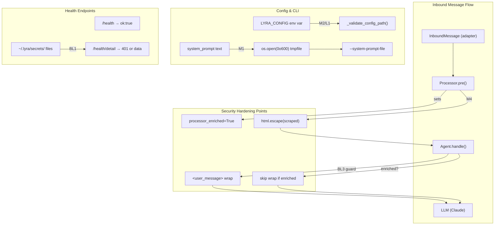
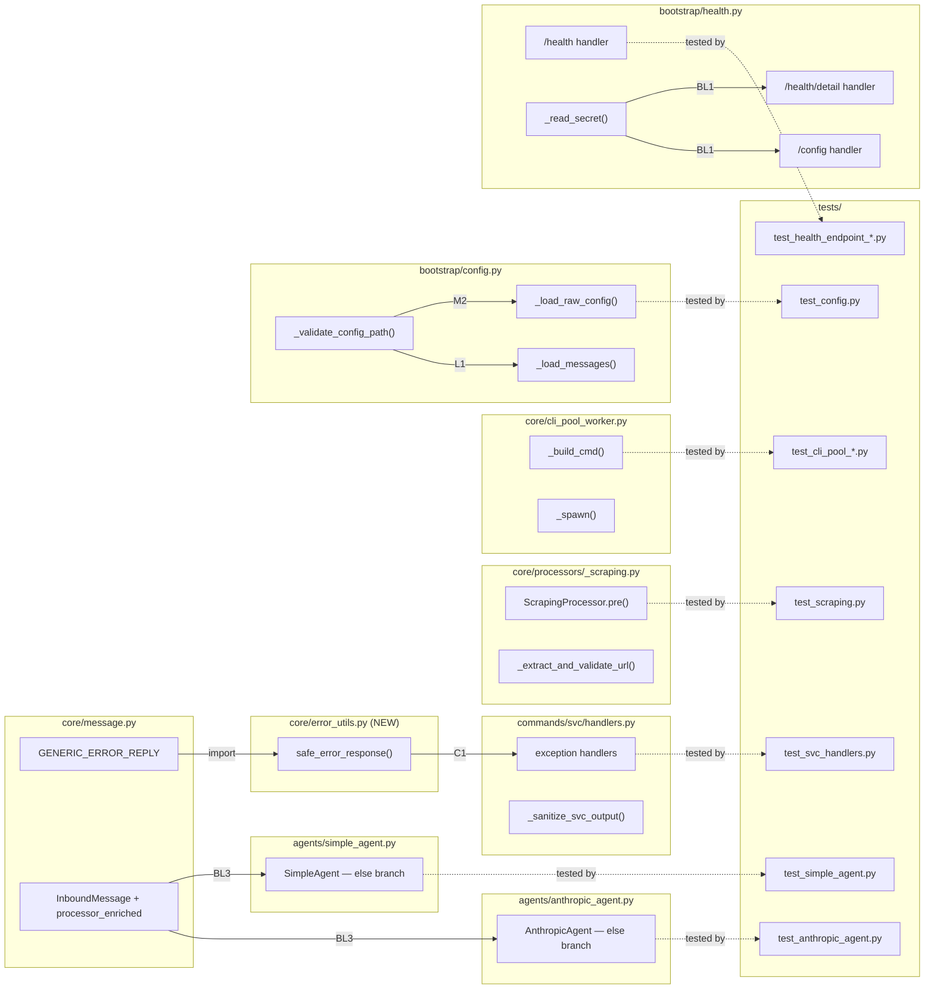

## Summary

Remediate 12 security findings from the 2026-03-26 audit in a single branch with per-finding commits. Four independent slices cover error handling, prompt injection hardening, config/CLI trust, and health endpoint restructuring. All slices reuse existing codebase patterns.

## Architecture

### Data Flow

### File x Function Map

## Bootstrap Context

From analysis: Shape 1 (single-pass surgical) selected. All findings reuse existing patterns (`GENERIC_ERROR_REPLY`, `html.escape()`, `_TRUSTED_BASE`). Only M1 (tmpfile), M3 (endpoint split), and BL1 (file secrets) need new logic. `integrations/supervisor.py` `_TRUSTED_BASE` only exists on feat/362 — use `web_intel.py` as canonical reference.

## Agents

| Agent | Task count | Files |
|-------|-----------|-------|
| backend-dev-1 | 14 | `svc/handlers.py`, `core/error_utils.py`, `_scraping.py`, `simple_agent.py`, `anthropic_agent.py`, `core/message.py`, processors |
| backend-dev-2 | 8 | `cli_pool_worker.py`, `bootstrap/config.py`, `bootstrap/health.py` |
| tester | 6 | `tests/plugins/test_svc_handlers.py`, `tests/core/processors/test_scraping.py`, `tests/test_health_endpoint_*.py`, `tests/test_config.py`, new test files |

## Consistency Report

- Criteria covered: 21/21
- Uncovered criteria: none
- Tasks without spec backing: none
- Gold plating exemptions applied: 0

## Micro-Tasks

### Slice V1: Error Handling (C1, L2, BL2)

#### Task 1.1: Create `safe_error_response()` utility [P] → backend-dev-1
- **File:** `src/lyra/core/error_utils.py` (new)
- **Snippet:** `def safe_error_response(exc, log, context=""): log.exception("%s: %s", context, exc); return Response(content=GENERIC_ERROR_REPLY)`
- **Verify:** `python -c "from lyra.core.error_utils import safe_error_response; print('OK')"` (ready)
- **Expected:** `OK`
- **Time:** 3 min
- **Difficulty:** 1
- **Traces:** SC-BL2
- **Phase:** GREEN

#### Task 1.2: Create `_sanitize_svc_output()` helper [P] → backend-dev-1
- **File:** `src/lyra/commands/svc/handlers.py`
- **Snippet:** `def _sanitize_svc_output(output: str) -> str:` — strip `pid \d+`, `(pid \d+)`, absolute paths `/home/...`, `/var/...`
- **Verify:** `python -c "from lyra.commands.svc.handlers import _sanitize_svc_output; print(_sanitize_svc_output('foo pid 12345 at /home/user/x'))"` (ready)
- **Expected:** Output with PID and path stripped
- **Time:** 5 min
- **Difficulty:** 2
- **Traces:** SC-L2, N2
- **Phase:** GREEN

#### Task 1.3: Replace `/svc` error handlers with `safe_error_response()` → backend-dev-1
- **File:** `src/lyra/commands/svc/handlers.py`
- **Snippet:** Replace `f"Error: {exc}"` (lines 79, 82) with `safe_error_response(exc, log, "svc")`
- **Verify:** `grep -n 'f"Error:' src/lyra/commands/svc/handlers.py` (ready)
- **Expected:** No matches
- **Time:** 3 min
- **Difficulty:** 1
- **Traces:** SC-C1, N1
- **Phase:** GREEN

#### Task 1.4: Apply `_sanitize_svc_output()` to success path → backend-dev-1
- **File:** `src/lyra/commands/svc/handlers.py`
- **Snippet:** Change `output or "(no output)"` to `_sanitize_svc_output(output) or "(no output)"`
- **Verify:** `grep -n '_sanitize_svc_output' src/lyra/commands/svc/handlers.py` (ready)
- **Expected:** Match on success path
- **Time:** 2 min
- **Difficulty:** 1
- **Traces:** SC-L2, N2→S1
- **Phase:** GREEN

#### Task 1.5: Write tests for error handling → tester
- **File:** `tests/plugins/test_svc_handlers.py` (extend existing)
- **Snippet:** Tests: (1) exception returns GENERIC_ERROR_REPLY, (2) `_sanitize_svc_output` strips PIDs, (3) strips absolute paths, (4) preserves clean output
- **Verify:** `python -m pytest tests/plugins/test_svc_handlers.py -v --tb=short` (ready)
- **Expected:** All pass
- **Time:** 8 min
- **Difficulty:** 2
- **Traces:** SC-C1, SC-L2, SC-BL2
- **Phase:** RED

#### RED-GATE: RED complete V1 → tester
- **Verify:** All V1 test tasks pass
- **Phase:** RED-GATE

### Slice V2: Prompt Injection (M4, L4, BL3)

#### Task 2.1: Add `processor_enriched` field to `InboundMessage` [P] → backend-dev-1
- **File:** `src/lyra/core/message.py`
- **Snippet:** Add `processor_enriched: bool = False` after `modality` field on `InboundMessage`
- **Verify:** `python -c "from lyra.core.message import InboundMessage; print(InboundMessage.__dataclass_fields__['processor_enriched'].default)"` (ready)
- **Expected:** `False`
- **Time:** 2 min
- **Difficulty:** 1
- **Traces:** SC-BL3(field)
- **Phase:** GREEN

#### Task 2.2: Set `processor_enriched=True` in all processor `pre()` methods [P] → backend-dev-1
- **File:** `src/lyra/core/processors/_scraping.py`, `add_vault.py`, `search.py`
- **Snippet:** Each `pre()` return: `dataclasses.replace(msg, text=enriched, processor_enriched=True)`
- **Verify:** `grep -rn 'processor_enriched=True' src/lyra/core/processors/` (ready)
- **Expected:** 3 matches (one per processor)
- **Time:** 5 min
- **Difficulty:** 1
- **Traces:** SC-BL3(field)
- **Phase:** GREEN

#### Task 2.3: HTML-escape scraped content in `ScrapingProcessor.pre()` → backend-dev-1
- **File:** `src/lyra/core/processors/_scraping.py`
- **Snippet:** `import html` at top; change line 136: `html.escape(scraped)` inside `<webpage>` tags; add untrusted label after closing tag
- **Verify:** `grep -n 'html.escape' src/lyra/core/processors/_scraping.py` (ready)
- **Expected:** Match on escape call
- **Time:** 5 min
- **Difficulty:** 2
- **Traces:** SC-M4, N3→N4
- **Phase:** GREEN

#### Task 2.4: Add HTTP scheme warning in `_extract_and_validate_url()` → backend-dev-1
- **File:** `src/lyra/core/processors/_scraping.py`
- **Snippet:** After URL validation, `if url.startswith("http://"): log.warning("ScrapingProcessor: HTTP URL requested (not HTTPS): %s", url)`
- **Verify:** `grep -n 'HTTP URL requested' src/lyra/core/processors/_scraping.py` (ready)
- **Expected:** Match
- **Time:** 3 min
- **Difficulty:** 1
- **Traces:** SC-L4, N13
- **Phase:** GREEN

#### Task 2.5: Wrap plain text in `<user_message>` tags in `SimpleAgent` → backend-dev-1
- **File:** `src/lyra/agents/simple_agent.py`
- **Snippet:** Replace `text = msg.text` (line 236) with: `if not msg.processor_enriched: text = f"<user_message>{html.escape(msg.text)}</user_message>"` else `text = msg.text`
- **Verify:** `grep -n 'user_message' src/lyra/agents/simple_agent.py` (ready)
- **Expected:** Match on wrapping
- **Time:** 3 min
- **Difficulty:** 2
- **Traces:** SC-BL3(wrap), N5
- **Phase:** GREEN

#### Task 2.6: Wrap plain text in `<user_message>` tags in `AnthropicAgent` → backend-dev-1
- **File:** `src/lyra/agents/anthropic_agent.py`
- **Snippet:** Replace `llm_text = history_text = msg.text` (line 176) with same guard as Task 2.5
- **Verify:** `grep -n 'user_message' src/lyra/agents/anthropic_agent.py` (ready)
- **Expected:** Match on wrapping
- **Time:** 3 min
- **Difficulty:** 2
- **Traces:** SC-BL3(wrap), N5
- **Phase:** GREEN

#### Task 2.7: Write tests for prompt injection hardening → tester
- **File:** `tests/core/processors/test_scraping.py` (extend), new `tests/agents/test_user_message_tagging.py`
- **Snippet:** Tests: (1) `</webpage>` in scraped content is escaped, (2) HTTP URL logs warning, (3) plain text wrapped in `<user_message>`, (4) processor-enriched text NOT double-wrapped, (5) voice modality NOT wrapped
- **Verify:** `python -m pytest tests/core/processors/test_scraping.py tests/agents/test_user_message_tagging.py -v --tb=short` (ready)
- **Expected:** All pass
- **Time:** 10 min
- **Difficulty:** 3
- **Traces:** SC-M4, SC-L4, SC-BL3
- **Phase:** RED

#### RED-GATE: RED complete V2 → tester
- **Verify:** All V2 test tasks pass
- **Phase:** RED-GATE

### Slice V3: Config & CLI (M1, M2, L1)

#### Task 3.1: Add `_validate_config_path()` to `bootstrap/config.py` [P] → backend-dev-2
- **File:** `src/lyra/bootstrap/config.py`
- **Snippet:** `def _validate_config_path(path_str: str) -> Path:` — resolve, check `is_relative_to(Path.home())`, raise `ValueError` with rejected path + trusted base
- **Verify:** `python -c "from lyra.bootstrap.config import _validate_config_path; _validate_config_path('/tmp/evil.toml')"` (ready)
- **Expected:** `ValueError`
- **Time:** 5 min
- **Difficulty:** 2
- **Traces:** SC-M2, SC-L1, N6a→N6b
- **Phase:** GREEN

#### Task 3.2: Apply `_validate_config_path()` in `_load_raw_config()` → backend-dev-2
- **File:** `src/lyra/bootstrap/config.py`
- **Snippet:** After `os.environ.get("LYRA_CONFIG", ...)`, call `_validate_config_path(path)` before `open(path, "rb")`
- **Verify:** `grep -n '_validate_config_path' src/lyra/bootstrap/config.py` (ready)
- **Expected:** Match in `_load_raw_config`
- **Time:** 3 min
- **Difficulty:** 1
- **Traces:** SC-M2, N6a
- **Phase:** GREEN

#### Task 3.3: Apply `_validate_config_path()` in `_load_messages()` → backend-dev-2
- **File:** `src/lyra/bootstrap/config.py`
- **Snippet:** After `os.environ.get("LYRA_MESSAGES_CONFIG", ...)`, call `_validate_config_path(path_str)` before loading
- **Verify:** `grep -n '_validate_config_path' src/lyra/bootstrap/config.py` (ready)
- **Expected:** 2 matches (one per loader)
- **Time:** 3 min
- **Difficulty:** 1
- **Traces:** SC-L1, N6b
- **Phase:** GREEN

#### Task 3.4: Switch to `--system-prompt-file` in `_build_cmd()` → backend-dev-2
- **File:** `src/lyra/core/cli_pool_worker.py`
- **Snippet:** Replace `cmd.extend(["--system-prompt", system_prompt])` with: write tmpfile via `os.open(tmppath, O_CREAT|O_WRONLY|O_EXCL, 0o600)`, `os.write(fd, prompt.encode())`, `os.close(fd)`, then `cmd.extend(["--system-prompt-file", tmppath])`. Return tmppath alongside cmd.
- **Verify:** `grep -n 'system-prompt-file' src/lyra/core/cli_pool_worker.py` (ready)
- **Expected:** Match on `--system-prompt-file`
- **Time:** 8 min
- **Difficulty:** 3
- **Traces:** SC-M1(flag), N7
- **Phase:** GREEN

#### Task 3.5: Add `finally` cleanup for tmpfile in `_spawn()` → backend-dev-2
- **File:** `src/lyra/core/cli_pool_worker.py`
- **Snippet:** Wrap `create_subprocess_exec` in `try/finally` that calls `Path(tmppath).unlink(missing_ok=True)` — covers both success and exception paths
- **Verify:** `grep -n 'unlink' src/lyra/core/cli_pool_worker.py` (ready)
- **Expected:** Match in finally block
- **Time:** 5 min
- **Difficulty:** 3
- **Traces:** SC-M1(cleanup), N8
- **Phase:** GREEN

#### Task 3.6: Write tests for config & CLI → tester
- **File:** `tests/test_config.py` (extend), `tests/core/test_cli_pool_process.py` (extend)
- **Snippet:** Tests: (1) `_validate_config_path` rejects `/tmp/`, (2) accepts home-relative, (3) symlink outside home rejected, (4) `_build_cmd` uses `--system-prompt-file`, (5) tmpfile created with 0o600, (6) tmpfile cleaned up on spawn failure
- **Verify:** `python -m pytest tests/test_config.py tests/core/test_cli_pool_process.py -v --tb=short -k "config_path or system_prompt_file"` (ready)
- **Expected:** All pass
- **Time:** 10 min
- **Difficulty:** 3
- **Traces:** SC-M1, SC-M2, SC-L1
- **Phase:** RED

#### RED-GATE: RED complete V3 → tester
- **Verify:** All V3 test tasks pass
- **Phase:** RED-GATE

### Slice V4: Health & Secrets (M3, L3, BL1)

#### Task 4.1: Add `_read_secret()` helper [P] → backend-dev-2
- **File:** `src/lyra/bootstrap/health.py`
- **Snippet:** `def _read_secret(name: str) -> str:` — read `~/.lyra/secrets/{name}`, return content stripped, return `""` if file missing
- **Verify:** `python -c "from lyra.bootstrap.health import _read_secret; print(repr(_read_secret('nonexistent')))"` (ready)
- **Expected:** `''`
- **Time:** 5 min
- **Difficulty:** 2
- **Traces:** SC-BL1, N12
- **Phase:** GREEN

#### Task 4.2: Split `/health` into liveness + `/health/detail` → backend-dev-2
- **File:** `src/lyra/bootstrap/health.py`
- **Snippet:** `/health` returns `{"ok": True}` always. New `/health/detail` handler with 401 on bad/missing auth, full data on success. Use `_read_secret("health_secret")` instead of `os.environ.get`.
- **Verify:** `grep -n 'health/detail' src/lyra/bootstrap/health.py` (ready)
- **Expected:** Match on route definition
- **Time:** 8 min
- **Difficulty:** 3
- **Traces:** SC-M3, N9→N10
- **Phase:** GREEN

#### Task 4.3: Remove `effective_*` fields from `/config` → backend-dev-2
- **File:** `src/lyra/bootstrap/health.py`
- **Snippet:** Delete `"effective_model"` and `"effective_max_steps"` from config endpoint return dict. Use `_read_secret("config_secret")` instead of `os.environ.get`.
- **Verify:** `grep -n 'effective_' src/lyra/bootstrap/health.py` (ready)
- **Expected:** No matches
- **Time:** 3 min
- **Difficulty:** 1
- **Traces:** SC-L3, N11
- **Phase:** GREEN

#### Task 4.4: Remove env var references for secrets → backend-dev-2
- **File:** `src/lyra/bootstrap/health.py`
- **Snippet:** Remove `os.environ.get("LYRA_HEALTH_SECRET", "")` and `os.environ.get("LYRA_CONFIG_SECRET", "")` — replace with `_read_secret()` calls
- **Verify:** `grep -n 'LYRA_HEALTH_SECRET\|LYRA_CONFIG_SECRET' src/lyra/bootstrap/health.py` (ready)
- **Expected:** No matches
- **Time:** 3 min
- **Difficulty:** 1
- **Traces:** SC-BL1
- **Phase:** GREEN

#### Task 4.5: Write tests for health & secrets → tester
- **File:** `tests/test_health_endpoint_status.py` (extend), `tests/test_health_endpoint_config.py` (extend)
- **Snippet:** Tests: (1) `/health` returns `{"ok": true}` without auth, (2) `/health/detail` returns 401 without auth, (3) `/health/detail` returns data with valid auth, (4) `/config` lacks `effective_*`, (5) `_read_secret` reads file, (6) `_read_secret` returns empty on missing file
- **Verify:** `python -m pytest tests/test_health_endpoint_status.py tests/test_health_endpoint_config.py -v --tb=short` (ready)
- **Expected:** All pass
- **Time:** 10 min
- **Difficulty:** 3
- **Traces:** SC-M3, SC-L3, SC-BL1
- **Phase:** RED

#### RED-GATE: RED complete V4 → tester
- **Verify:** All V4 test tasks pass
- **Phase:** RED-GATE

### Final: Regression + Cleanup

#### Task F.1: Run full test suite → tester
- **File:** All tests
- **Verify:** `python -m pytest --tb=short -q` (ready)
- **Expected:** All pass, no regressions
- **Time:** 5 min
- **Difficulty:** 1
- **Traces:** SC-regression
- **Phase:** GREEN

#### Task F.2: Remove stale H-10 comment → backend-dev-2
- **File:** `src/lyra/core/cli_pool_worker.py`
- **Snippet:** Remove comment lines 123-125 about `--system-prompt` being blocked on upstream
- **Verify:** `grep -n 'H-10' src/lyra/core/cli_pool_worker.py` (ready)
- **Expected:** No matches
- **Time:** 2 min
- **Difficulty:** 1
- **Traces:** SC-M1
- **Phase:** REFACTOR
