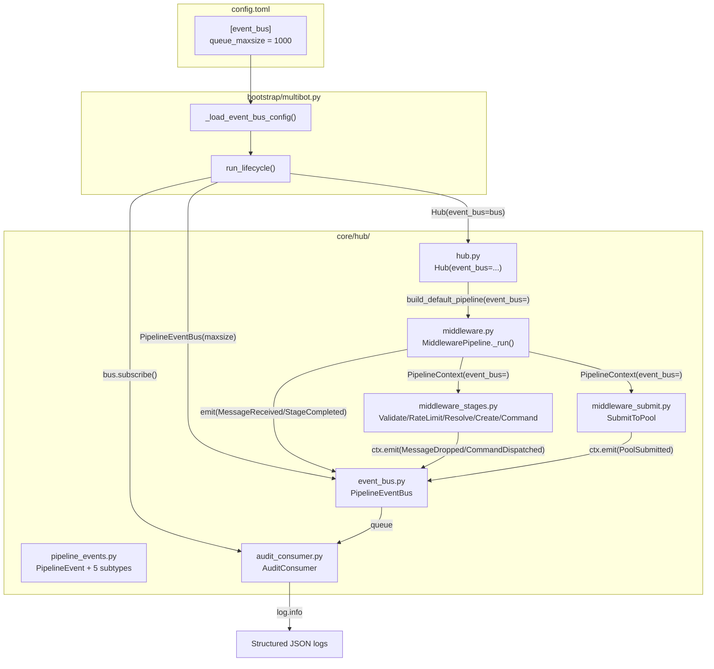
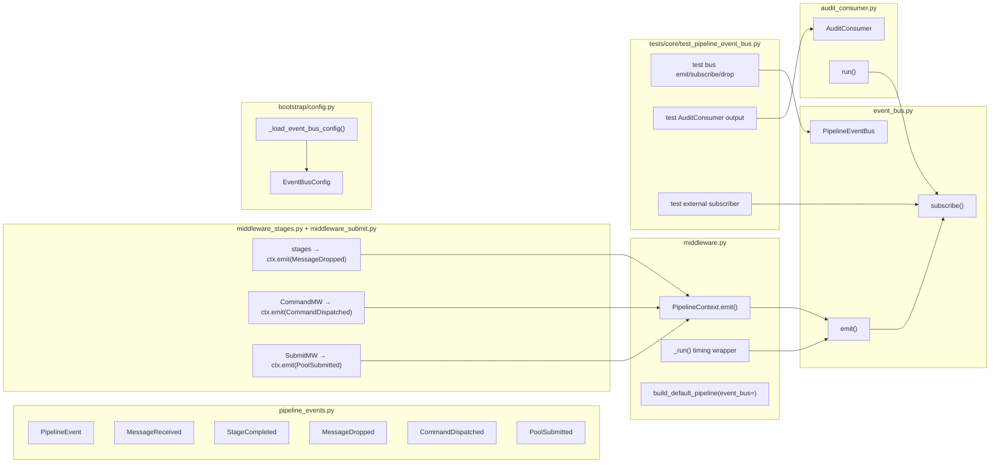

## Summary

Implement a fire-and-forget `PipelineEventBus` with typed frozen dataclass events, emit at middleware seams (runner handles timing, stages handle domain events), wire `AuditConsumer` as first subscriber via bootstrap, with TOML-configurable queue maxsize. 3 slices, 13 micro-tasks.

## Architecture

### Data flow



### File x function map



## Bootstrap Context

From analysis: ADR-025 F-10 removed the prior EventBus singleton. Reintroduction is justified by concrete consumers and uses DI. `events.py` (old monitoring dataclasses) remains untouched — separate hierarchy. TraceHook remains as test/debug path; EventBus is production observability.

## Agents

| Agent | Tasks | Files |
|-------|-------|-------|
| backend-dev | 11 | `pipeline_events.py`, `event_bus.py`, `audit_consumer.py`, `middleware.py`, `middleware_stages.py`, `middleware_submit.py`, `hub.py`, `config.py`, `multibot.py`, `multibot_wiring.py` |
| tester | 2 | `test_pipeline_event_bus.py`, `test_middleware.py` |

## Consistency Report

| Metric | Value |
|--------|-------|
| Success criteria covered | 19/19 |
| Uncovered criteria | 0 |
| Untraced tasks | 0 |

## Ref Patterns

- **Config pattern:** `bootstrap/config.py` — Pydantic `BaseModel` + `_load_*_config(raw)` helper. Follow `InboundBusConfig` / `_load_inbound_bus_config()` as template.
- **Test pattern:** `tests/core/test_middleware.py` — `_make_ctx()`, `_make_next()`, `make_inbound_message()` from `conftest.py`. Individual middleware tested with mock `next()`.
- **Task pattern in lifecycle:** `multibot_wiring.py:run_lifecycle()` — `asyncio.create_task()` with `_log_task_failure` callback for Discord tasks.

---

## Micro-Tasks

### Slice 1: Event types + bus

#### T1.1 — Define PipelineEvent hierarchy [P]

- **Description:** Create `pipeline_events.py` with `PipelineEvent` base + 5 frozen dataclass subtypes
- **File:** `src/lyra/core/hub/pipeline_events.py` (new)
- **Code snippet:**
  ```python
  @dataclass(frozen=True)
  class PipelineEvent:
      msg_id: str
      timestamp: float
      stage: str

  @dataclass(frozen=True)
  class MessageReceived(PipelineEvent):
      platform: str
      user_id: str
      scope_id: str
  # + StageCompleted, MessageDropped, CommandDispatched, PoolSubmitted
  ```
- **Verify:** `python -c "from lyra.core.hub.pipeline_events import PipelineEvent, MessageReceived, StageCompleted, MessageDropped, CommandDispatched, PoolSubmitted; print('OK')"`
- **Expected output:** `OK`
- **Time:** 3 min
- **Agent:** backend-dev
- **Spec trace:** SC-1 (PipelineEvent base + 5 subtypes), U1, U2
- **Slice:** V1
- **Phase:** RED
- **Difficulty:** 1

#### T1.2 — Implement PipelineEventBus [P]

- **Description:** Create `event_bus.py` with `PipelineEventBus` — `subscribe()` returns `asyncio.Queue`, `emit()` fans out via `put_nowait`, configurable `maxsize`
- **File:** `src/lyra/core/hub/event_bus.py` (new)
- **Code snippet:**
  ```python
  class PipelineEventBus:
      def __init__(self, maxsize: int = 1000) -> None:
          self._maxsize = maxsize
          self._subscribers: list[asyncio.Queue[PipelineEvent]] = []

      def subscribe(self) -> asyncio.Queue[PipelineEvent]:
          q: asyncio.Queue[PipelineEvent] = asyncio.Queue(maxsize=self._maxsize)
          self._subscribers.append(q)
          return q

      def emit(self, event: PipelineEvent) -> None:
          for q in self._subscribers:
              try:
                  q.put_nowait(event)
              except asyncio.QueueFull:
                  self._warn_drop(q)
  ```
- **Verify:** `python -c "from lyra.core.hub.event_bus import PipelineEventBus; b = PipelineEventBus(); q = b.subscribe(); print(type(q).__name__)"`
- **Expected output:** `Queue`
- **Time:** 5 min
- **Agent:** backend-dev
- **Spec trace:** SC-2, SC-3, SC-9, U3, U4, N3
- **Slice:** V1
- **Phase:** RED
- **Difficulty:** 2

#### T1.3 — Add rate-limited drop warning to emit()

- **Description:** In `PipelineEventBus.emit()`, add rate-limited `log.warning` on `QueueFull` (max 1/60s per subscriber). Use a `dict[int, float]` keyed by `id(queue)` to track last warn time.
- **File:** `src/lyra/core/hub/event_bus.py`
- **Code snippet:**
  ```python
  _DROP_WARN_INTERVAL = 60.0

  def _warn_drop(self, q: asyncio.Queue) -> None:
      now = time.monotonic()
      qid = id(q)
      if now - self._last_warn.get(qid, 0.0) >= self._DROP_WARN_INTERVAL:
          self._last_warn[qid] = now
          log.warning("PipelineEventBus: subscriber queue full — events dropped")
  ```
- **Verify:** `python -c "from lyra.core.hub.event_bus import PipelineEventBus; print('OK')"`
- **Expected output:** `OK`
- **Time:** 3 min
- **Agent:** backend-dev
- **Spec trace:** SC-4, N5
- **Slice:** V1
- **Phase:** GREEN
- **Difficulty:** 2

#### T1.4 — Unit tests for bus + events

- **Description:** Create `test_pipeline_event_bus.py`. Tests: emit with 0/1/N subscribers, QueueFull drop with maxsize=1 + warning fires, subscribe returns Queue, frozen events
- **File:** `tests/core/test_pipeline_event_bus.py` (new)
- **Code snippet:**
  ```python
  class TestPipelineEventBus:
      async def test_emit_no_subscribers(self):
          bus = PipelineEventBus()
          bus.emit(make_event())  # no error

      async def test_emit_fan_out(self):
          bus = PipelineEventBus()
          q1, q2 = bus.subscribe(), bus.subscribe()
          bus.emit(make_event())
          assert q1.qsize() == 1
          assert q2.qsize() == 1

      async def test_queue_full_drops(self):
          bus = PipelineEventBus(maxsize=1)
          q = bus.subscribe()
          bus.emit(make_event())
          bus.emit(make_event())  # dropped
          assert q.qsize() == 1

      async def test_external_subscriber(self):
          """Plugin-like external code can subscribe."""
          bus = PipelineEventBus()
          q = bus.subscribe()
          bus.emit(make_event())
          event = q.get_nowait()
          assert isinstance(event, PipelineEvent)
  ```
- **Verify:** `python -m pytest tests/core/test_pipeline_event_bus.py -v`
- **Expected output:** All tests pass
- **Time:** 8 min
- **Agent:** tester
- **Spec trace:** SC-15, SC-17, SC-18
- **Slice:** V1
- **Phase:** GREEN
- **Difficulty:** 2

---

### RED-GATE: Slice 1 → Slice 2

Verify all Slice 1 tests pass before proceeding:
```bash
python -m pytest tests/core/test_pipeline_event_bus.py -v
```

---

### Slice 2: Emission wiring

#### T2.1 — Add event_bus to PipelineContext + emit helper

- **Description:** Add `event_bus: PipelineEventBus | None = None` field to `PipelineContext`. Add `ctx.emit(event)` helper that guards on `None`.
- **File:** `src/lyra/core/hub/middleware.py`
- **Code snippet:**
  ```python
  @dataclass
  class PipelineContext:
      hub: Hub
      event_bus: PipelineEventBus | None = None
      # ... existing fields ...

      def emit(self, event: PipelineEvent) -> None:
          if self.event_bus is not None:
              self.event_bus.emit(event)
  ```
- **Verify:** `python -c "from lyra.core.hub.middleware import PipelineContext; print('OK')"`
- **Expected output:** `OK`
- **Time:** 3 min
- **Agent:** backend-dev
- **Spec trace:** SC-8, SC-9
- **Slice:** V2
- **Phase:** RED
- **Difficulty:** 1

#### T2.2 — Wrap _run() with timing + event emission

- **Description:** In `MiddlewarePipeline`, accept `event_bus` in `__init__`, pass to `PipelineContext`. Wrap `_run()` to emit `MessageReceived` before first stage and `StageCompleted` (with subtree-inclusive `duration_ms`) after each stage. Use `type(mw).__name__` for stage vocabulary.
- **File:** `src/lyra/core/hub/middleware.py`
- **Code snippet:**
  ```python
  class MiddlewarePipeline:
      def __init__(self, middlewares, hub, *, trace_hook=None, event_bus=None):
          # ...
          self._event_bus = event_bus

      async def process(self, msg):
          ctx = PipelineContext(hub=self._hub, trace_hook=self._trace_hook, event_bus=self._event_bus)
          ctx.emit(MessageReceived(msg_id=msg.id, timestamp=time.time(), stage="inbound", platform=msg.platform, user_id=msg.user_id, scope_id=msg.scope_id))

          async def _run(index, msg, ctx):
              if index >= len(self._middlewares):
                  return _DROP
              mw = self._middlewares[index]
              t0 = time.monotonic()
              result = await mw(msg, ctx, lambda m, c: _run(index + 1, m, c))
              ctx.emit(StageCompleted(msg_id=msg.id, timestamp=time.time(), stage=type(mw).__name__, duration_ms=(time.monotonic() - t0) * 1000))
              return result

          return await _run(0, msg, ctx)
  ```
- **Verify:** `python -m pytest tests/core/test_middleware.py -v`
- **Expected output:** All existing tests still pass
- **Time:** 8 min
- **Agent:** backend-dev
- **Spec trace:** SC-5, SC-6, SC-16
- **Slice:** V2
- **Phase:** RED
- **Difficulty:** 3

#### T2.3 — Add domain event emissions to middleware stages

- **Description:** Add `ctx.emit(MessageDropped(...))` in `ValidatePlatformMiddleware`, `RateLimitMiddleware`, `ResolveBindingMiddleware` (when returning `_DROP`). Add `ctx.emit(CommandDispatched(...))` in `CommandMiddleware`. Add `ctx.emit(PoolSubmitted(...))` in `SubmitToPoolMiddleware`.
- **Files:** `src/lyra/core/hub/middleware_stages.py`, `src/lyra/core/hub/middleware_submit.py`
- **Code snippet:**
  ```python
  # In ValidatePlatformMiddleware.__call__:
  ctx.emit(MessageDropped(msg_id=msg.id, timestamp=time.time(), stage=type(self).__name__, reason="unknown_platform"))
  return _DROP

  # In CommandMiddleware._dispatch_command:
  ctx.emit(CommandDispatched(msg_id=msg.id, timestamp=time.time(), stage=type(self).__name__, command=_cmd))

  # In SubmitToPoolMiddleware.__call__:
  ctx.emit(PoolSubmitted(msg_id=msg.id, timestamp=time.time(), stage=type(self).__name__, pool_id=pool.pool_id, agent_name=ctx.binding.agent_name, resume_status=status.value))
  ```
- **Verify:** `python -m pytest tests/core/test_middleware.py -v`
- **Expected output:** All existing tests still pass
- **Time:** 8 min
- **Agent:** backend-dev
- **Spec trace:** SC-7
- **Slice:** V2
- **Phase:** RED
- **Difficulty:** 3

#### T2.4 — Thread event_bus through Hub + build_default_pipeline

- **Description:** Add `event_bus: PipelineEventBus | None = None` to `Hub.__init__`. Pass `event_bus=self._event_bus` to `build_default_pipeline()` in `Hub.run()`. Add `event_bus` param to `build_default_pipeline()`.
- **Files:** `src/lyra/core/hub/hub.py`, `src/lyra/core/hub/middleware.py`
- **Code snippet:**
  ```python
  # hub.py Hub.__init__:
  self._event_bus = event_bus

  # hub.py Hub.run():
  pipeline = build_default_pipeline(self, event_bus=self._event_bus)

  # middleware.py build_default_pipeline():
  def build_default_pipeline(hub, *, trace_hook=None, event_bus=None):
      return MiddlewarePipeline([...], hub, trace_hook=trace_hook, event_bus=event_bus)
  ```
- **Verify:** `python -c "from lyra.core.hub import Hub; h = Hub(); print('OK')"`
- **Expected output:** `OK`
- **Time:** 5 min
- **Agent:** backend-dev
- **Spec trace:** SC-10
- **Slice:** V2
- **Phase:** GREEN
- **Difficulty:** 2

#### T2.5 — Add EventBusConfig to bootstrap/config.py

- **Description:** Add `EventBusConfig` Pydantic model with `queue_maxsize: int = 1000`. Add `_load_event_bus_config()` helper following existing pattern.
- **File:** `src/lyra/bootstrap/config.py`
- **Code snippet:**
  ```python
  class EventBusConfig(BaseModel):
      model_config = ConfigDict(frozen=True)
      queue_maxsize: int = 1000

  def _load_event_bus_config(raw: dict[str, Any]) -> EventBusConfig:
      return EventBusConfig.model_validate(raw.get("event_bus", {}))
  ```
- **Verify:** `python -c "from lyra.bootstrap.config import EventBusConfig, _load_event_bus_config; print(_load_event_bus_config({}).queue_maxsize)"`
- **Expected output:** `1000`
- **Time:** 3 min
- **Agent:** backend-dev
- **Spec trace:** SC-11
- **Slice:** V2
- **Phase:** GREEN
- **Difficulty:** 1

---

### RED-GATE: Slice 2 → Slice 3

Verify all existing middleware tests + Slice 1 tests pass:
```bash
python -m pytest tests/core/test_middleware.py tests/core/test_pipeline_event_bus.py -v
```

---

### Slice 3: Audit consumer + bootstrap

#### T3.1 — Implement AuditConsumer

- **Description:** Create `audit_consumer.py` with `AuditConsumer` — drains queue, logs each event as structured JSON via `log.info("pipeline.%s", event.stage, extra={"event": dataclasses.asdict(event)})`.
- **File:** `src/lyra/core/hub/audit_consumer.py` (new)
- **Code snippet:**
  ```python
  class AuditConsumer:
      def __init__(self, queue: asyncio.Queue[PipelineEvent]) -> None:
          self._queue = queue

      async def run(self) -> None:
          while True:
              event = await self._queue.get()
              log.info("pipeline.%s", event.stage, extra={"event": dataclasses.asdict(event)})
              self._queue.task_done()
  ```
- **Verify:** `python -c "from lyra.core.hub.audit_consumer import AuditConsumer; print('OK')"`
- **Expected output:** `OK`
- **Time:** 3 min
- **Agent:** backend-dev
- **Spec trace:** SC-12, U5, N4
- **Slice:** V3
- **Phase:** RED
- **Difficulty:** 1

#### T3.2 — Wire bus + consumer in bootstrap

- **Description:** In `multibot.py`, load `EventBusConfig`, create `PipelineEventBus(maxsize=cfg.queue_maxsize)`, pass to `Hub(event_bus=bus)`. In `run_lifecycle()`, subscribe `AuditConsumer`, create its task with `_log_task_failure` callback.
- **Files:** `src/lyra/bootstrap/multibot.py`, `src/lyra/bootstrap/multibot_wiring.py`
- **Code snippet:**
  ```python
  # multibot.py:
  event_bus_cfg = _load_event_bus_config(raw_config)
  event_bus = PipelineEventBus(maxsize=event_bus_cfg.queue_maxsize)
  hub = Hub(..., event_bus=event_bus)

  # multibot_wiring.py run_lifecycle():
  if hub._event_bus is not None:
      audit_queue = hub._event_bus.subscribe()
      audit_consumer = AuditConsumer(audit_queue)
      audit_task = asyncio.create_task(audit_consumer.run(), name="audit-consumer")
      audit_task.add_done_callback(_log_task_failure)
      tasks.append(audit_task)
  ```
- **Verify:** `python -c "from lyra.bootstrap.multibot_wiring import run_lifecycle; print('OK')"`
- **Expected output:** `OK`
- **Time:** 5 min
- **Agent:** backend-dev
- **Spec trace:** SC-13, SC-14
- **Slice:** V3
- **Phase:** RED
- **Difficulty:** 2

#### T3.3 — AuditConsumer unit test

- **Description:** Add test to `test_pipeline_event_bus.py` — emit event, assert AuditConsumer logs structured JSON with correct format.
- **File:** `tests/core/test_pipeline_event_bus.py`
- **Code snippet:**
  ```python
  class TestAuditConsumer:
      async def test_logs_structured_json(self):
          bus = PipelineEventBus()
          q = bus.subscribe()
          consumer = AuditConsumer(q)
          bus.emit(make_event())
          task = asyncio.create_task(consumer.run())
          await asyncio.sleep(0.01)
          task.cancel()
          # assert log output contains structured JSON
  ```
- **Verify:** `python -m pytest tests/core/test_pipeline_event_bus.py -v -k "audit"`
- **Expected output:** Test passes
- **Time:** 5 min
- **Agent:** tester
- **Spec trace:** SC-18
- **Slice:** V3
- **Phase:** GREEN
- **Difficulty:** 2

#### T3.4 — Verify existing pipeline tests still pass

- **Description:** Run full middleware test suite to confirm zero behaviour change.
- **File:** `tests/core/test_middleware.py`
- **Verify:** `python -m pytest tests/core/test_middleware.py -v`
- **Expected output:** All tests pass, no regressions
- **Time:** 2 min
- **Agent:** tester
- **Spec trace:** SC-16
- **Slice:** V3
- **Phase:** GREEN
- **Difficulty:** 1
