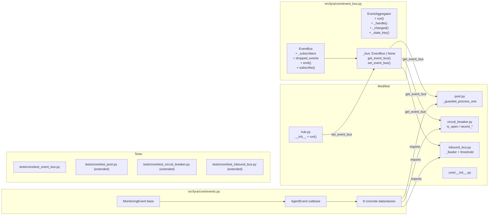

## Summary

Introduce `lyra.core.events` (typed `MonitoringEvent` dataclass hierarchy) and `lyra.core.event_bus`
(`EventBus` fan-out + `EventAggregator` dedup state machine) as the backbone, then wire lightweight
`emit()` calls into `Pool._guarded_process_one()`, `CircuitBreaker`, and `InboundBus._feeder()`.
Hub starts the `EventAggregator` as a background asyncio task; the external cron interval is reduced.

---

## Architecture

```mermaid
flowchart TD
    subgraph events["src/lyra/core/events.py"]
        ME[MonitoringEvent\ntimestamp: float]
        AE[AgentEvent\nagent_id + timestamp]
        AS[AgentStarted\nscope_id]
        AC[AgentCompleted\nduration_ms]
        AF[AgentFailed\nerror]
        AI[AgentIdle\nfinished_at]
        CS[CircuitStateChanged\nplatform, old_state, new_state]
        QE[QueueDepthExceeded\nqueue_name, depth, threshold]
        QN[QueueDepthNormal\nqueue_name, depth]
        ME --> AE & CS & QE & QN
        AE --> AS & AC & AF & AI
    end

    subgraph bus["src/lyra/core/event_bus.py"]
        EB[EventBus\n_subscribers: list of Queue\ndropped_events: int]
        EA[EventAggregator\n_state: dict of str to str\nrun / _handle / _changed / _state_key]
        EB -->|subscribe| EA
    end

    subgraph emitters["Emitters"]
        P[Pool._guarded_process_one]
        CB[CircuitBreaker\nrecord_failure / record_success / is_open]
        IB[InboundBus._feeder]
    end

    P & CB & IB -->|get_event_bus().emit| EB
    EA -->|state changed| MON[lyra.monitoring\nescalation backend]
    EA -->|unchanged — no-op| EA
```



---

## Agents

| Agent | Tasks | Files |
|-------|-------|-------|
| backend-dev | T1–T4, T6–T9, T11–T13, T15–T17 | events.py, event_bus.py, pool.py, circuit_breaker.py, inbound_bus.py, hub.py, __init__.py |
| tester | T5, T10, T14, T16 | tests/core/test_event_bus.py, test_pool.py, test_circuit_breaker.py, test_inbound_bus.py |

---

## Reference Patterns

- `@dataclass(frozen=True)` style from `src/lyra/core/message.py` (InboundMessage, RoutingContext)
- `asyncio.Queue` + `asyncio.Task` pattern from `src/lyra/core/inbound_bus.py` (_feeder + task lifecycle)
- Background task start/cancel pattern from `src/lyra/core/outbound_dispatcher.py`
- `CircuitState` enum + `CircuitStatus` dataclass from `src/lyra/core/circuit_breaker.py`

---

## Consistency Report

| Coverage | Count |
|----------|-------|
| Success criteria covered | 14/14 |
| Breadboard affordances traced | 9/9 (U1–U9) + 6/6 (N1–N6) + 2/2 (B1–B2) |
| Uncovered criteria | None |
| Untraced affordances | None |

---

## Micro-Tasks

---

### V1 — Core Infrastructure

> Goal: `lyra.core.events` + `lyra.core.event_bus` exist, are importable, EventBus fan-out works.
> No behavior change to existing code.

---

#### T1 — Create `src/lyra/core/events.py`

**Phase:** RED (types first, tests written in T5 will import these)
**Agent:** backend-dev
**Slice:** V1
**Spec trace:** SC-1
**Difficulty:** 1
**Time:** 5 min
**Parallel-safe:** Y

**Description:** Define `MonitoringEvent` base, `AgentEvent` subbase, and all 8 event dataclasses
as `frozen=True` dataclasses.

**File:** `src/lyra/core/events.py`

**Code snippet:**
```python
from __future__ import annotations
import time
from dataclasses import dataclass, field


@dataclass(frozen=True)
class MonitoringEvent:
    timestamp: float = field(default_factory=time.monotonic)


@dataclass(frozen=True)
class AgentEvent(MonitoringEvent):
    agent_id: str = ""


@dataclass(frozen=True)
class AgentStarted(AgentEvent):
    scope_id: str | None = None


@dataclass(frozen=True)
class AgentCompleted(AgentEvent):
    duration_ms: float = 0.0


@dataclass(frozen=True)
class AgentFailed(AgentEvent):
    error: str = ""


@dataclass(frozen=True)
class AgentIdle(AgentEvent):
    finished_at: float = field(default_factory=time.monotonic)


@dataclass(frozen=True)
class CircuitStateChanged(MonitoringEvent):
    platform: str = ""
    old_state: str = ""
    new_state: str = ""


@dataclass(frozen=True)
class QueueDepthExceeded(MonitoringEvent):
    queue_name: str = ""
    depth: int = 0
    threshold: int = 0


@dataclass(frozen=True)
class QueueDepthNormal(MonitoringEvent):
    queue_name: str = ""
    depth: int = 0
```

**Verify:**
```bash
uv run python -c "from lyra.core.events import AgentStarted, AgentFailed, CircuitStateChanged, QueueDepthExceeded; print('ok')"
```
**Expected:** `ok`

---

#### T2 — Create `src/lyra/core/event_bus.py` — `EventBus` class

**Phase:** RED
**Agent:** backend-dev
**Slice:** V1
**Spec trace:** SC-2, SC-3, SC-4
**Difficulty:** 2
**Time:** 8 min
**Parallel-safe:** N (depends on T1 for imports)

**Description:** Define `EventBus` with fan-out subscriber list, `emit()` using `put_nowait`,
`dropped_events` counter, and module-level singleton helpers `get_event_bus()` / `set_event_bus()`.
`EventAggregator` stub only (run() raises NotImplementedError — filled in T15).

**File:** `src/lyra/core/event_bus.py`

**Code snippet:**
```python
from __future__ import annotations
import asyncio
import logging
from collections.abc import AsyncIterator
from .events import MonitoringEvent

log = logging.getLogger(__name__)

_bus: "EventBus | None" = None


def get_event_bus() -> "EventBus | None":
    return _bus


def set_event_bus(bus: "EventBus | None") -> None:
    global _bus
    _bus = bus


class EventBus:
    MAX_SIZE = 1000

    def __init__(self) -> None:
        self._subscribers: list[asyncio.Queue[MonitoringEvent]] = []
        self.dropped_events: int = 0

    def emit(self, event: MonitoringEvent) -> None:
        """Non-blocking fan-out. Drops silently per full subscriber queue."""
        for q in self._subscribers:
            try:
                q.put_nowait(event)
            except asyncio.QueueFull:
                self.dropped_events += 1

    async def subscribe(self) -> AsyncIterator[MonitoringEvent]:
        q: asyncio.Queue[MonitoringEvent] = asyncio.Queue(maxsize=self.MAX_SIZE)
        self._subscribers.append(q)
        try:
            while True:
                yield await q.get()
        finally:
            self._subscribers.remove(q)
```

**Verify:**
```bash
uv run python -c "from lyra.core.event_bus import EventBus, get_event_bus, set_event_bus; print('ok')"
```
**Expected:** `ok`

---

#### T3 — Update `src/lyra/core/__init__.py` — export new types

**Phase:** REFACTOR
**Agent:** backend-dev
**Slice:** V1
**Spec trace:** SC-1
**Difficulty:** 1
**Time:** 3 min
**Parallel-safe:** N (depends on T1, T2)

**Description:** Add exports for `EventBus`, `EventAggregator`, `MonitoringEvent`, and the 8
event subtypes to `src/lyra/core/__init__.py`.

**File:** `src/lyra/core/__init__.py`

**Code snippet:**
```python
# Add to existing imports:
from .events import (
    AgentCompleted,
    AgentFailed,
    AgentIdle,
    AgentStarted,
    CircuitStateChanged,
    MonitoringEvent,
    QueueDepthExceeded,
    QueueDepthNormal,
)
from .event_bus import EventBus, EventAggregator, get_event_bus, set_event_bus

# Add to __all__:
"AgentCompleted", "AgentFailed", "AgentIdle", "AgentStarted",
"CircuitStateChanged", "EventBus", "EventAggregator", "get_event_bus",
"MonitoringEvent", "QueueDepthExceeded", "QueueDepthNormal", "set_event_bus",
```

**Verify:**
```bash
uv run python -c "from lyra.core import AgentStarted, EventBus, get_event_bus; print('ok')"
```
**Expected:** `ok`

---

#### T4 — Write `tests/core/test_event_bus.py`

**Phase:** RED
**Agent:** tester
**Slice:** V1
**Spec trace:** SC-2, SC-3, SC-4, SC-14
**Difficulty:** 2
**Time:** 10 min
**Parallel-safe:** Y (can be written while T2 is in progress)

**Description:** Unit tests for `EventBus`: fan-out to 2 subscribers, `dropped_events` counter,
`emit()` never raises, `subscribe()` cleanup on exit. Use `pytest-asyncio`.

**File:** `tests/core/test_event_bus.py`

**Code snippet:**
```python
import asyncio, pytest
from lyra.core.event_bus import EventBus, set_event_bus
from lyra.core.events import AgentStarted

@pytest.fixture(autouse=True)
def reset_bus():
    set_event_bus(None)
    yield
    set_event_bus(None)

@pytest.mark.asyncio
async def test_fanout_two_subscribers():
    bus = EventBus()
    received_a, received_b = [], []
    async def collect(store):
        async for ev in bus.subscribe():
            store.append(ev); break
    t_a = asyncio.create_task(collect(received_a))
    t_b = asyncio.create_task(collect(received_b))
    await asyncio.sleep(0)  # let subscribers register
    bus.emit(AgentStarted(agent_id="x"))
    await asyncio.gather(t_a, t_b)
    assert len(received_a) == 1 and len(received_b) == 1

@pytest.mark.asyncio
async def test_drop_counter_on_full_queue():
    bus = EventBus()
    bus._subscribers.append(asyncio.Queue(maxsize=1))
    bus.emit(AgentStarted(agent_id="a"))  # fills queue
    bus.emit(AgentStarted(agent_id="b"))  # drops
    assert bus.dropped_events == 1

def test_emit_never_raises():
    bus = EventBus()  # no subscribers
    bus.emit(AgentStarted(agent_id="x"))  # must not raise
```

**Verify:**
```bash
uv run pytest tests/core/test_event_bus.py -x -q
```
**Expected:** `3 passed`

---

#### RED-GATE V1

**Phase:** RED-GATE
**Slice:** V1
**Description:** All V1 tests and imports pass before proceeding to V2.

**Verify:**
```bash
uv run pytest tests/core/test_event_bus.py -x -q
uv run python -c "from lyra.core import AgentStarted, EventBus, get_event_bus; print('V1 ok')"
```
**Expected:** all tests pass, `V1 ok`

---

### V2 — Emission Integration

> Wire `emit()` calls into Pool, CircuitBreaker, and InboundBus. No aggregator yet —
> events are emitted to the bus but no subscriber is attached in production.
> Tests use a test subscriber to verify emission.

---

#### T5 — Extend `tests/core/test_pool.py` — emission sequence

**Phase:** RED
**Agent:** tester
**Slice:** V2
**Spec trace:** SC-5, SC-14
**Difficulty:** 3
**Time:** 10 min
**Parallel-safe:** Y

**Description:** Add tests asserting that `_guarded_process_one()` emits `AgentStarted`,
`AgentCompleted`/`AgentFailed`, and `AgentIdle` in the correct order. Use `set_event_bus(bus)`
fixture and a test subscriber coroutine.

**File:** `tests/core/test_pool.py`

**Code snippet:**
```python
@pytest.mark.asyncio
async def test_pool_emits_started_completed_idle(mock_pool, mock_agent):
    bus = EventBus()
    set_event_bus(bus)
    received = []
    async def collect():
        async for ev in bus.subscribe():
            received.append(ev)
            if isinstance(ev, AgentIdle): break
    t = asyncio.create_task(collect())
    await asyncio.sleep(0)
    await mock_pool._guarded_process_one(make_msg(), mock_agent)
    await t
    types = [type(e).__name__ for e in received]
    assert types == ["AgentStarted", "AgentCompleted", "AgentIdle"]

@pytest.mark.asyncio
async def test_pool_emits_failed_on_exception(mock_pool, failing_agent):
    # similar — assert AgentStarted, AgentFailed, AgentIdle
    ...
```

**Verify:**
```bash
uv run pytest tests/core/test_pool.py -x -q -k "emit"  # fails (RED) until T6
```
**Expected:** `FAILED` (correct RED state)

---

#### T6 — Modify `src/lyra/core/pool.py` — emit in `_guarded_process_one`

**Phase:** GREEN
**Agent:** backend-dev
**Slice:** V2
**Spec trace:** SC-5, SC-10
**Difficulty:** 3
**Time:** 10 min
**Parallel-safe:** N

**Description:** Import `get_event_bus` and event types. In `_guarded_process_one`:
- emit `AgentStarted` before the `await asyncio.wait_for(...)` call
- track `_start = time.monotonic()` for duration
- emit `AgentCompleted(duration_ms=...)` in the success path inside `_process_one` after `record_circuit_success()` (or just after `wait_for` returns normally)
- emit `AgentFailed(error=str(exc))` in the `except Exception` block (before the existing `_safe_dispatch`)
- emit `AgentIdle(finished_at=time.monotonic())` in a `finally` block wrapping the entire method body

**File:** `src/lyra/core/pool.py`

**Code snippet:**
```python
async def _guarded_process_one(
    self, msg: InboundMessage, agent: "AgentBase"
) -> None:
    """Wrap _process_one with timeout and error handling."""
    from .event_bus import get_event_bus
    from .events import AgentCompleted, AgentFailed, AgentIdle, AgentStarted

    _start = time.monotonic()
    if bus := get_event_bus():
        bus.emit(AgentStarted(agent_id=self.pool_id, scope_id=msg.scope_id))
    try:
        await asyncio.wait_for(
            self._process_one(msg, agent), timeout=self._turn_timeout
        )
        if bus := get_event_bus():
            bus.emit(AgentCompleted(
                agent_id=self.pool_id,
                duration_ms=(time.monotonic() - _start) * 1000,
            ))
    except asyncio.TimeoutError:
        # ... existing timeout handling ...
        if bus := get_event_bus():
            bus.emit(AgentFailed(agent_id=self.pool_id, error="timeout"))
    except asyncio.CancelledError:
        raise
    except Exception as exc:
        # ... existing exception handling ...
        if bus := get_event_bus():
            bus.emit(AgentFailed(agent_id=self.pool_id, error=str(exc)))
    finally:
        if bus := get_event_bus():
            bus.emit(AgentIdle(agent_id=self.pool_id, finished_at=time.monotonic()))
```

**Verify:**
```bash
uv run pytest tests/core/test_pool.py -x -q -k "emit"
```
**Expected:** `2 passed`

---

#### T7 — Extend `tests/core/test_circuit_breaker.py` — all 4 transitions

**Phase:** RED
**Agent:** tester
**Slice:** V2
**Spec trace:** SC-6, SC-14
**Difficulty:** 2
**Time:** 8 min
**Parallel-safe:** Y (parallel with T6)

**Description:** Add tests for all 4 circuit breaker transitions emitting `CircuitStateChanged`.

**File:** `tests/core/test_circuit_breaker.py`

**Code snippet:**
```python
def test_closed_to_open_emits_event():
    bus = EventBus(); set_event_bus(bus)
    cb = CircuitBreaker(name="test", failure_threshold=1)
    events = []
    # synchronous bus inspection — peek at internal queue
    cb.record_failure()
    # assert bus received CircuitStateChanged(old=closed, new=open)

def test_open_to_half_open_emits_event():
    # set cb to OPEN with _opened_at in the past, call is_open()
    ...

def test_half_open_to_closed_emits_event():
    # set cb to HALF_OPEN, call record_success()
    ...

def test_half_open_to_open_emits_event():
    # set cb to HALF_OPEN, call record_failure()
    ...
```

**Verify:**
```bash
uv run pytest tests/core/test_circuit_breaker.py -x -q -k "emit"  # RED until T8
```
**Expected:** `FAILED`

---

#### T8 — Modify `src/lyra/core/circuit_breaker.py` — emit on 4 transitions [P]

**Phase:** GREEN
**Agent:** backend-dev
**Slice:** V2
**Spec trace:** SC-6, SC-10
**Difficulty:** 2
**Time:** 8 min
**Parallel-safe:** Y (parallel with T6 — different file)

**Description:** Import `get_event_bus` and `CircuitStateChanged` inside each method. Emit only on
actual state change (guard with `old_state != new_state`).

**File:** `src/lyra/core/circuit_breaker.py`

**Code snippet:**
```python
def is_open(self) -> bool:
    if self._state == CircuitState.CLOSED:
        return False
    if self._state == CircuitState.OPEN:
        if self._opened_at is not None:
            elapsed = time.monotonic() - self._opened_at
            if elapsed >= self.recovery_timeout:
                # OPEN → HALF_OPEN
                old = self._state.value
                self._state = CircuitState.HALF_OPEN
                _emit_circuit(self.name, old, self._state.value)
                # fall through
            else:
                return True
    if self._probe_in_flight:
        return True
    self._probe_in_flight = True
    return False

def record_success(self) -> None:
    if self._state != CircuitState.HALF_OPEN:
        return
    old = self._state.value
    self._state = CircuitState.CLOSED
    self._failure_count = 0
    self._opened_at = None
    self._probe_in_flight = False
    _emit_circuit(self.name, old, self._state.value)

# Helper (module-level):
def _emit_circuit(name: str, old: str, new: str) -> None:
    from .event_bus import get_event_bus
    from .events import CircuitStateChanged
    if bus := get_event_bus():
        bus.emit(CircuitStateChanged(platform=name, old_state=old, new_state=new))
```

**Verify:**
```bash
uv run pytest tests/core/test_circuit_breaker.py -x -q -k "emit"
```
**Expected:** `4 passed`

---

#### T9 — Extend `tests/core/test_inbound_bus.py` — edge-triggered depth events

**Phase:** RED
**Agent:** tester
**Slice:** V2
**Spec trace:** SC-7, SC-14
**Difficulty:** 2
**Time:** 8 min
**Parallel-safe:** Y

**Description:** Test that `InboundBus` emits `QueueDepthExceeded` once when staging depth crosses
threshold, and `QueueDepthNormal` once when it drops below.

**File:** `tests/core/test_inbound_bus.py`

**Verify:**
```bash
uv run pytest tests/core/test_inbound_bus.py -x -q -k "emit"  # RED until T10
```
**Expected:** `FAILED`

---

#### T10 — Modify `src/lyra/core/inbound_bus.py` — edge-triggered emit in `_feeder` [P]

**Phase:** GREEN
**Agent:** backend-dev
**Slice:** V2
**Spec trace:** SC-7, SC-10
**Difficulty:** 3
**Time:** 10 min
**Parallel-safe:** Y (parallel with T8)

**Description:** Add `queue_depth_threshold: int = 100` to `InboundBus.__init__`.
Track `_depth_exceeded: bool = False` as instance state.
After each `staging.put()` in `_feeder`, check `staging.qsize()`:
- `qsize > threshold` and not `_depth_exceeded` → emit `QueueDepthExceeded`, set flag
- `qsize <= threshold` and `_depth_exceeded` → emit `QueueDepthNormal`, clear flag

**File:** `src/lyra/core/inbound_bus.py`

**Code snippet:**
```python
async def _feeder(
    self, platform: Platform, queue: asyncio.Queue[InboundMessage]
) -> None:
    while True:
        msg = await queue.get()
        await self._staging.put(msg)
        queue.task_done()
        depth = self._staging.qsize()
        if depth > self._threshold and not self._depth_exceeded:
            self._depth_exceeded = True
            if bus := get_event_bus():
                bus.emit(QueueDepthExceeded(
                    queue_name="staging", depth=depth, threshold=self._threshold
                ))
        elif depth <= self._threshold and self._depth_exceeded:
            self._depth_exceeded = False
            if bus := get_event_bus():
                bus.emit(QueueDepthNormal(queue_name="staging", depth=depth))
```

**Verify:**
```bash
uv run pytest tests/core/test_inbound_bus.py -x -q -k "emit"
```
**Expected:** `2 passed`

---

#### RED-GATE V2

**Phase:** RED-GATE
**Slice:** V2
**Description:** All V1 + V2 tests pass before proceeding to V3.

**Verify:**
```bash
uv run pytest tests/core/test_event_bus.py tests/core/test_pool.py tests/core/test_circuit_breaker.py tests/core/test_inbound_bus.py -x -q
```
**Expected:** all tests pass

---

### V3 — Aggregator + Monitoring Integration

> Wire the full `EventAggregator` dedup state machine, start it in Hub, cancel on shutdown.
> Reduce external cron interval.

---

#### T11 — Write `tests/core/test_event_aggregator.py`

**Phase:** RED
**Agent:** tester
**Slice:** V3
**Spec trace:** SC-8, SC-9, SC-10, SC-14
**Difficulty:** 3
**Time:** 12 min
**Parallel-safe:** Y

**Description:** Unit tests for `EventAggregator`:
1. Same state twice → `_changed()` returns False, no monitoring action
2. Different state → `_changed()` returns True
3. Composite key generation: `_state_key(AgentFailed(...))` → `"pool:x"`, `_state_key(CircuitStateChanged(platform="tg", ...))` → `"circuit:tg"`
4. `run()` loop receives events and calls `_handle()`

**File:** `tests/core/test_event_aggregator.py`

**Code snippet:**
```python
def test_changed_returns_false_on_same_state():
    agg = EventAggregator(bus=EventBus())
    assert agg._changed("pool:x", "failed") is True   # first time = changed
    assert agg._changed("pool:x", "failed") is False  # same = no-op

def test_state_key_composition():
    agg = EventAggregator(bus=EventBus())
    from lyra.core.events import AgentFailed, CircuitStateChanged, QueueDepthExceeded
    assert agg._state_key(AgentFailed(agent_id="abc")) == "pool:abc"
    assert agg._state_key(CircuitStateChanged(platform="tg")) == "circuit:tg"
    assert agg._state_key(QueueDepthExceeded(queue_name="staging")) == "queue:staging"
```

**Verify:**
```bash
uv run pytest tests/core/test_event_aggregator.py -x -q  # RED until T12
```
**Expected:** `FAILED`

---

#### T12 — Implement full `EventAggregator` in `src/lyra/core/event_bus.py`

**Phase:** GREEN
**Agent:** backend-dev
**Slice:** V3
**Spec trace:** SC-8, SC-9, SC-10, SC-14
**Difficulty:** 4
**Time:** 15 min
**Parallel-safe:** N (depends on T11 being RED)

**Description:** Replace the `EventAggregator` stub with the full dedup implementation.
`_handle()` is async (may await monitoring action). `_state_key()` dispatches on event type.
Monitoring action calls `lyra.monitoring.escalation` — imported lazily to keep hot path clean.

**File:** `src/lyra/core/event_bus.py`

**Code snippet:**
```python
class EventAggregator:
    def __init__(self, bus: EventBus) -> None:
        self._bus = bus
        self._state: dict[str, str] = {}

    async def run(self) -> None:
        log.info("EventAggregator started")
        try:
            async for event in self._bus.subscribe():
                try:
                    await self._handle(event)
                except Exception:
                    log.exception("EventAggregator._handle() failed for %r", event)
        except asyncio.CancelledError:
            log.info("EventAggregator stopped")

    def _state_key(self, event: MonitoringEvent) -> str:
        from .events import AgentEvent, CircuitStateChanged, QueueDepthExceeded, QueueDepthNormal
        if isinstance(event, AgentEvent):
            return f"pool:{event.agent_id}"
        if isinstance(event, CircuitStateChanged):
            return f"circuit:{event.platform}"
        if isinstance(event, (QueueDepthExceeded, QueueDepthNormal)):
            return f"queue:{event.queue_name}"
        return f"unknown:{type(event).__name__}"

    def _changed(self, key: str, new_state: str) -> bool:
        if self._state.get(key) == new_state:
            return False
        self._state[key] = new_state
        return True

    async def _handle(self, event: MonitoringEvent) -> None:
        from .events import (AgentFailed, AgentStarted, AgentCompleted, AgentIdle,
                              CircuitStateChanged, QueueDepthExceeded, QueueDepthNormal)
        key = self._state_key(event)
        if isinstance(event, AgentFailed):
            if not self._changed(key, "failed"):
                return
        elif isinstance(event, (AgentCompleted, AgentIdle)):
            if not self._changed(key, "healthy"):
                return
        elif isinstance(event, AgentStarted):
            if not self._changed(key, "running"):
                return
        elif isinstance(event, CircuitStateChanged):
            if not self._changed(key, event.new_state):
                return
        elif isinstance(event, QueueDepthExceeded):
            if not self._changed(key, "exceeded"):
                return
        elif isinstance(event, QueueDepthNormal):
            if not self._changed(key, "normal"):
                return
        else:
            return
        await self._trigger_monitoring_action(event)

    async def _trigger_monitoring_action(self, event: MonitoringEvent) -> None:
        log.warning("EventAggregator: state change detected — %r", event)
        # Future: call lyra.monitoring.escalation backend here
```

**Verify:**
```bash
uv run pytest tests/core/test_event_aggregator.py -x -q
```
**Expected:** all aggregator tests pass

---

#### T13 — Modify `src/lyra/core/hub.py` — start/cancel `EventAggregator`

**Phase:** GREEN
**Agent:** backend-dev
**Slice:** V3
**Spec trace:** SC-12
**Difficulty:** 2
**Time:** 8 min
**Parallel-safe:** N (depends on T12)

**Description:** In `Hub.__init__`, create `EventBus()` instance and call `set_event_bus()`.
In `Hub.run()`, create `EventAggregator(bus)` and start it as `asyncio.Task`. Cancel the task
in a `finally` block around the `while True` loop.

**File:** `src/lyra/core/hub.py`

**Code snippet:**
```python
# In Hub.__init__:
from .event_bus import EventBus, EventAggregator, set_event_bus
self._event_bus = EventBus()
set_event_bus(self._event_bus)

# In Hub.run():
async def run(self) -> None:
    from .event_bus import EventAggregator
    aggregator = EventAggregator(self._event_bus)
    agg_task = asyncio.create_task(aggregator.run(), name="event-aggregator")
    pipeline = MessagePipeline(self)
    try:
        while True:
            # ... existing run() body unchanged ...
    finally:
        agg_task.cancel()
        try:
            await agg_task
        except asyncio.CancelledError:
            pass
```

**Verify:**
```bash
uv run pytest tests/core/test_hub.py -x -q
uv run pytest tests/ -x -q --ignore=tests/adapters -q 2>&1 | tail -5
```
**Expected:** existing hub tests pass, no new failures

---

#### T14 — Extend `tests/core/test_hub.py` — aggregator lifecycle

**Phase:** GREEN
**Agent:** tester
**Slice:** V3
**Spec trace:** SC-12, SC-14
**Difficulty:** 2
**Time:** 8 min
**Parallel-safe:** Y

**Description:** Add test that hub.run() starts an EventAggregator task and cancels it cleanly
on hub shutdown (CancelledError propagates out without asyncio warnings).

**File:** `tests/core/test_hub.py`

**Verify:**
```bash
uv run pytest tests/core/test_hub.py -x -q -k "aggregator"
```
**Expected:** `1 passed`

---

#### T15 — Update cron config — note cron deprecation

**Phase:** REFACTOR
**Agent:** backend-dev
**Slice:** V3
**Spec trace:** SC-13
**Difficulty:** 1
**Time:** 3 min
**Parallel-safe:** Y

**Description:** No local crontab exists for monitoring. Document the cron deprecation in
`src/lyra/monitoring/__main__.py` docstring and in `docs/ARCHITECTURE.md` (or create a note in
the monitoring module's `README` if it exists). On Machine 1 (production), the cron interval
should be changed to `0 */4 * * *` (every 4h) as a safety net once the aggregator is proven stable.

**File:** `src/lyra/monitoring/__main__.py` (docstring update only)

**Code snippet:**
```python
"""CLI entrypoint: python -m lyra.monitoring

Runs Layer 1 health checks. On anomaly, escalates to Layer 2 (LLM + Telegram).
Exit 0 = all green, exit 1 = anomaly detected.

NOTE (issue #44): The EventAggregator (lyra.core.event_bus) now handles real-time
state-change monitoring. This cron process is kept as a safety net.
Production cron interval should be increased to 4h+ once the aggregator
is proven stable in production.
"""
```

**Verify:**
```bash
grep -n "EventAggregator\|issue #44" src/lyra/monitoring/__main__.py
```
**Expected:** comment present

---

#### RED-GATE V3

**Phase:** RED-GATE
**Slice:** V3
**Description:** Full test suite passes.

**Verify:**
```bash
uv run pytest -x -q 2>&1 | tail -10
uv run ruff check .
uv run pyright
```
**Expected:** all tests pass, no lint errors, no type errors

---

## Final Verification

All 14 success criteria checked:

| SC | Task | Verify |
|----|------|--------|
| SC-1: events importable | T1, T3 | `from lyra.core import AgentStarted` |
| SC-2: EventBus fan-out | T2 | `test_fanout_two_subscribers` |
| SC-3: emit non-blocking + drop counter | T2, T4 | `test_drop_counter_on_full_queue` |
| SC-4: subscribe fan-out verified by test | T4 | `test_fanout_two_subscribers` |
| SC-5: Pool emits sequence | T5, T6 | `test_pool_emits_started_completed_idle` |
| SC-6: CircuitBreaker 4 transitions | T7, T8 | 4 circuit emit tests |
| SC-7: InboundBus edge-triggered | T9, T10 | 2 inbound bus emit tests |
| SC-8: aggregator dedup no-op | T11, T12 | `test_changed_returns_false_on_same_state` |
| SC-9: aggregator fires on change | T11, T12 | state change detection test |
| SC-10: no LLM in hot paths | T2, T6 | no SDK import in events.py / event_bus.py |
| SC-11: no Anthropic import in events/bus | T1, T2 | `grep anthropic src/lyra/core/events.py src/lyra/core/event_bus.py` → empty |
| SC-12: aggregator task lifecycle | T13, T14 | `test_hub_aggregator_lifecycle` |
| SC-13: cron note | T15 | grep in monitoring/__main__.py |
| SC-14: test coverage | T4, T5, T7, T9, T11, T14 | full suite passes |
