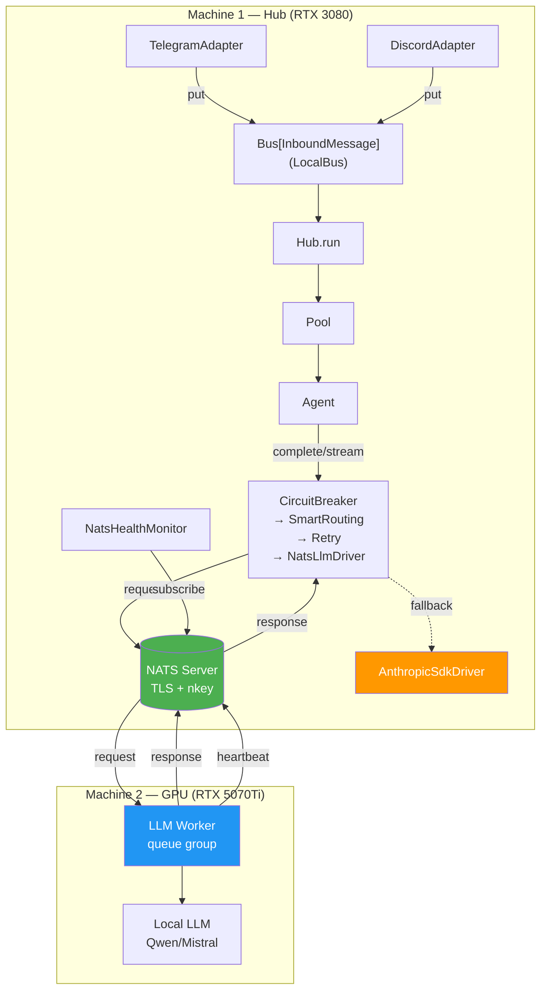
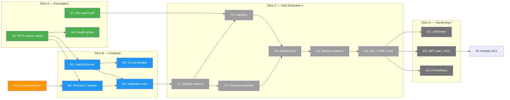
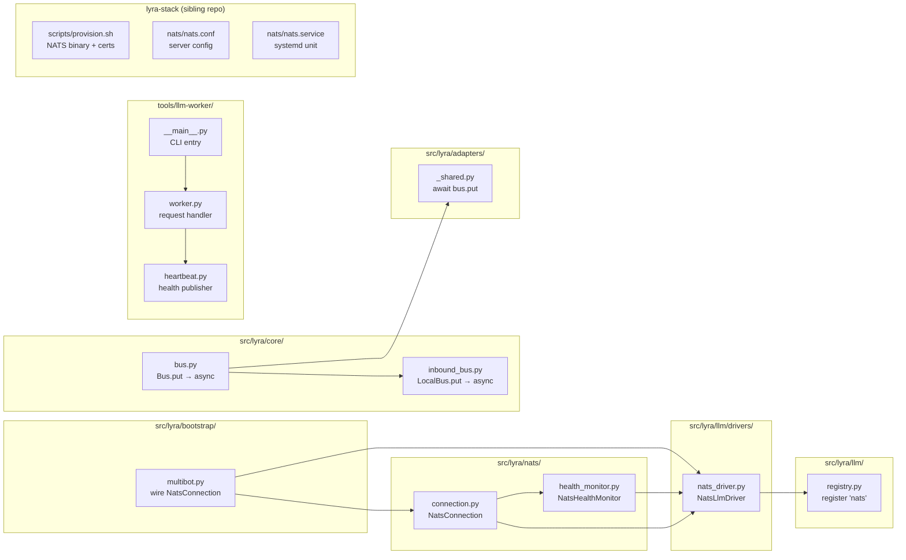

## Summary

Install NATS on Machine 1 with TLS + nkey auth, amend `Bus[T]` for async `put()`, build a NATS-based LLM driver + Machine 2 worker for GPU offloading, with circuit breaker fallback. 4 slices across 2 active waves + 2 deferred waves, 16 sub-issues, 33 micro-tasks.

**Active scope (Slice A + B):** 7 issues, ~20 micro-tasks
**Deferred scope (Slice C + D):** 9 issues — created for visibility, not scheduled

## Architecture

### Data Flow (Slice B — target state)



### Dependency Graph



### File x Function Map



## Waves

### Wave 1 — Slice A: Foundation (parallel tracks)

Three independent tracks that can run in parallel.

| Track | Issue | Agent | Micro-tasks |
|-------|-------|-------|-------------|
| 1 | A1: Bus[T] async put | backend-dev | 5 |
| 2 | A2: NATS server install | devops | 7 |
| 3 | A3: Health probe | backend-dev | 3 (blocked by A2) |

#### A1 micro-tasks (backend-dev)

1. Change `put()` signature in `Bus[T]` Protocol → `async def put(self, platform: Platform, item: T) -> None` (`core/bus.py:38`)
2. Change `LocalBus.put()` to `async def put()` — keep `put_nowait()` body, wrap in async (`core/inbound_bus.py:89`)
3. Add `await` to `inbound_bus.put(platform, msg)` in `push_to_hub_guarded()` (`adapters/_shared.py:97`)
4. Grep all test files calling `.put(` on bus instances → add `await` where missing
5. Run `pyright` + `pytest` — verify zero regression

#### A2 micro-tasks (devops)

1. Add NATS binary download (pinned version) to `lyra-stack/scripts/provision.sh`
2. Create TLS CA + cert generation script (`lyra-stack/scripts/gen-nats-certs.sh`)
3. Create nkey generation script (`lyra-stack/scripts/gen-nats-nkeys.sh`)
4. Write `nats.conf` template → `lyra-stack/nats/nats.conf`
5. Write `nats.service` systemd unit → `lyra-stack/nats/nats.service`
6. Add UFW rule to `provision.sh`: `ufw allow from 192.168.1.0/24 to any port 4222 proto tcp`
7. Test: run `provision.sh` on Machine 1, verify NATS starts with TLS + nkey, `nats-server --signal reload` works

#### A3 micro-tasks (backend-dev, blocked by A2)

1. Add NATS TCP connect + PING/PONG check to `lyra_monitoring` health probe
2. Return `{"nats": "ok"|"degraded"|"unreachable"}` in health response
3. Test: stop NATS → health returns `degraded`, start NATS → `ok`

### Wave 2 — Slice B: Compute (after Wave 1)

Two parallel tracks (B1, B2), then two sequential (B3, B4).

| Track | Issue | Agent | Micro-tasks | Blocked by |
|-------|-------|-------|-------------|------------|
| 1 | B1: NatsLlmDriver | backend-dev | 10 | A2 |
| 2 | B2: Machine 2 worker | backend-dev | 8 | A2, #14 |
| 3 | B3: Circuit breaker | backend-dev | 5 | B1 |
| 4 | B4: Integration test | tester | 5 | B1, B2 |

#### B1 micro-tasks (backend-dev)

1. Create `src/lyra/nats/__init__.py` and `src/lyra/nats/connection.py` — `NatsConnection` class
2. Add `nats-py` to `pyproject.toml` dependencies
3. Create `src/lyra/nats/health_monitor.py` — `NatsHealthMonitor` class (subscribe `lyra.llm.health.*`, track heartbeats)
4. Create `src/lyra/llm/drivers/nats_driver.py` — `NatsLlmDriver` skeleton
5. Implement `NatsLlmDriver.complete()` — NATS request-reply with JSON serialization
6. Implement `NatsLlmDriver.stream()` — ephemeral inbox subscription, yield `LlmEvent`s
7. Implement `NatsLlmDriver.is_alive()` — delegate to `NatsHealthMonitor`
8. Register `"nats"` backend in `registry.py`
9. Wire `NatsConnection` + `NatsHealthMonitor` lifecycle in `bootstrap/multibot.py` (connect/close)
10. Unit tests: `NatsLlmDriver` with mocked NATS connection

#### B2 micro-tasks (backend-dev)

1. Create `tools/llm-worker/` package: `pyproject.toml`, `__init__.py`, `__main__.py`
2. Implement `worker.py` — NATS subscription on `lyra.llm.request` (queue group `workers`)
3. Implement request dispatch — deserialize JSON, route to local LLM backend
4. Implement response publishing — complete (single message) + streaming (chunks with `done`)
5. Implement `heartbeat.py` — publish to `lyra.llm.health.{worker_id}` every 10s
6. CLI entry point with env-based config (`NATS_URL`, `NATS_NKEY_SEED`, etc.)
7. Add supervisor config template for Machine 2 (WSL2)
8. Setup documentation: `tools/llm-worker/README.md`

#### B3 micro-tasks (backend-dev, blocked by B1)

1. Add `fallback_backend` field to agent TOML `[agent.llm]` section
2. Wire fallback routing in bootstrap: resolve primary + fallback drivers
3. Connect `CircuitBreakerDecorator` → on circuit open, route to fallback driver
4. Log fallback activation/deactivation events
5. Unit test: mock NATS timeout → circuit opens → fallback driver receives request

#### B4 micro-tasks (tester, blocked by B1 + B2)

1. Create test fixture: embedded NATS server (ephemeral port, no TLS)
2. Create mock LLM worker (echoes request text as response)
3. Test: Hub → NatsLlmDriver → NATS → mock worker → response → Hub. Assert round-trip.
4. Test: kill mock worker → circuit opens → fallback provider answers → restart worker → circuit closes
5. Test: streaming round-trip — verify all `LlmEvent` types arrive in order

### Wave 3 — Slice C: Hub Extraction (deferred)

> Not scheduled. Issues created for visibility and dependency tracking.

| Issue | Size | Blocked by |
|-------|------|------------|
| C1: Design artifacts | S | B4 |
| C2: NatsBus implementation | F-lite | A1, C1 |
| C3: Trust re-resolution | S | C1 |
| C4: Extract Hub process | F-full | C2, C3 |
| C5: Rewire adapters | F-lite | C4 |
| C6: Ops + ADR + integration test | S | C5 |

### Wave 4 — Slice D: Hardening (deferred)

> Not scheduled. Issues created for visibility.

| Issue | Size | Blocked by |
|-------|------|------------|
| D1: JetStream persistence | S | C6 |
| D2: JWT auth + ACL audit | S | C6 |
| D3: Prometheus exporter | S | C6 |

## Agent Assignments

| Wave | Issue | Agent type | Why |
|------|-------|-----------|-----|
| 1 | A1 | backend-dev | Protocol change + caller migration |
| 1 | A2 | devops | Systemd, TLS certs, UFW, provision script |
| 1 | A3 | backend-dev | Health endpoint extension |
| 2 | B1 | backend-dev | New driver + NATS client wiring |
| 2 | B2 | backend-dev | Standalone worker service |
| 2 | B3 | backend-dev | Decorator stack modification |
| 2 | B4 | tester | Integration test with embedded NATS |

## Config Changes

### `config.toml` additions (Slice B)

```toml
[nats]
url = "nats://192.168.1.16:4222"
nkey_seed = "/etc/nats/nkeys/hub.seed"    # path to nkey seed file
tls_ca = "/etc/nats/certs/ca.pem"         # path to CA cert

[nats.llm]
request_timeout = 120                      # seconds
heartbeat_timeout = 30                     # seconds — worker marked offline after this
```

### Agent TOML additions (Slice B)

```toml
[agent.llm]
backend = "nats"                           # routes to NatsLlmDriver
fallback_backend = "anthropic-sdk"         # used when circuit breaker opens
```

### Environment variables (Machine 2 worker)

```bash
NATS_URL=nats://192.168.1.16:4222
NATS_NKEY_SEED=/path/to/llm-worker.seed
NATS_TLS_CA=/path/to/ca.pem
LLM_MODEL=qwen2.5-14b                     # determined by #14
LLM_BACKEND=ollama                         # or vllm, huggingface
WORKER_ID=machine2-gpu
```

## Critical Path

```
#14 (LLM benchmark) ─────────────────────────────────┐
                                                       ▼
A2 (NATS install) ──→ B1 (NatsLlmDriver) ──→ B3 (fallback) ──→ B4 (integration test)
                  └──→ B2 (worker) ────────────────────────────→ B4
A1 (async put) ── deferred ──→ C2 (NatsBus) ──→ C4 (Hub extraction) ──→ ...
```

Shortest path to value: **A2 → B1 + B2 → B4** (4 issues, ~2 sprints after #14 closes).
