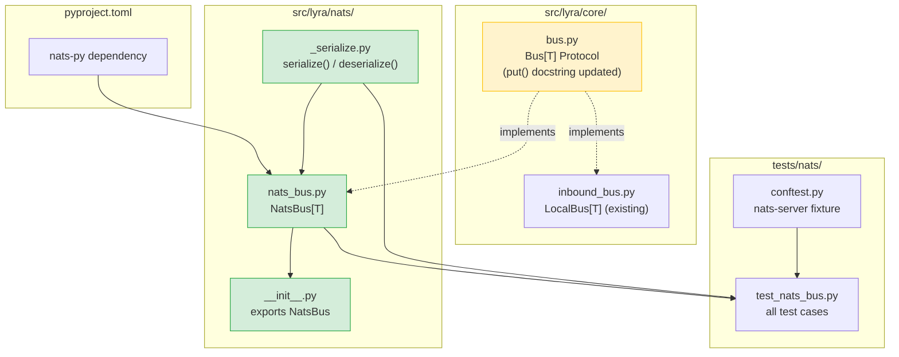
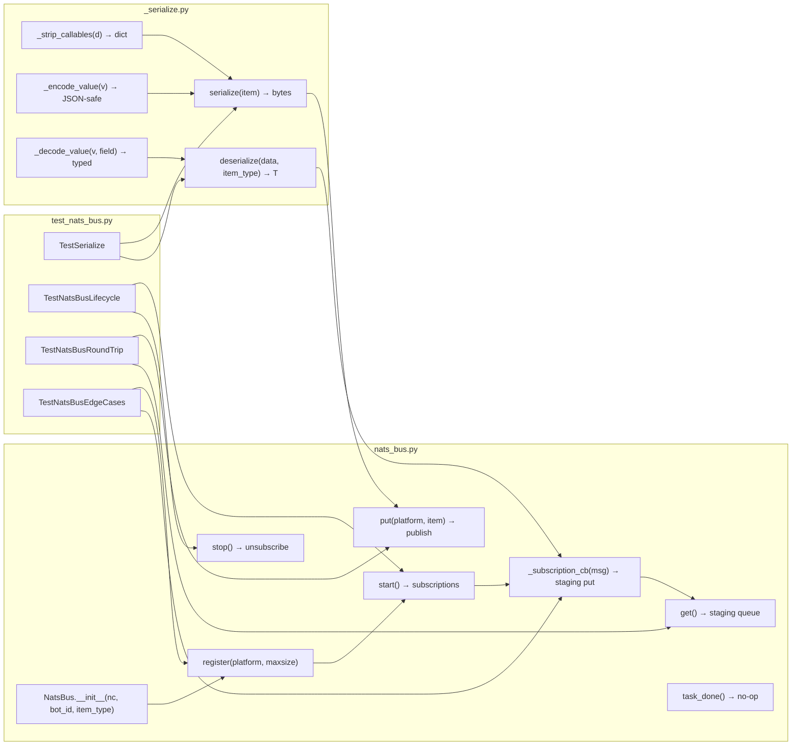

## Summary

Implement `NatsBus[T]` — a NATS-backed `Bus[T]` Protocol class — by creating a new `src/lyra/nats/` package with a type-aware serializer and the NatsBus class itself, plus unit tests using an embedded NATS server. Also updates the `Bus[T].put()` docstring to reflect the relaxed QueueFull contract introduced by this implementation.

## Architecture





## Agents

| Agent | Tasks | Files |
|-------|-------|-------|
| backend-dev | T1, T4, T5, T6, T7, T8 | conftest.py, bus.py, _serialize.py, nats_bus.py, __init__.py |
| tester | T2 | test_nats_bus.py |
| devops | T3 | pyproject.toml, tests/nats/__init__.py |

## Reference Patterns

- `src/lyra/core/inbound_bus.py` — `LocalBus[T]` lifecycle pattern (register → start → feeder → staging queue)
- `tests/core/test_inbound_bus.py` — test structure, `_make_msg()` fixture, `@pytest.mark.asyncio` pattern

## Consistency Report

| Metric | Value |
|--------|-------|
| Success criteria covered | 17/17 |
| Uncovered | none |
| Untraced tasks | none |
| Exemptions | none |

## Micro-Tasks

---

### Slice 1 — Core NatsBus + Serialization

---

#### T1 — [RED] Create embedded NATS server fixture

**File:** `tests/nats/conftest.py`

**Description:** Create a pytest-asyncio fixture that spawns a `nats-server` subprocess on an ephemeral port and tears it down after the test session. Returns the NATS URL for use by tests.

**Code skeleton:**
```python
"""Shared fixtures for NatsBus tests."""
from __future__ import annotations
import asyncio, socket, subprocess
import pytest, nats

def _free_port() -> int:
    with socket.socket() as s:
        s.bind(("127.0.0.1", 0))
        return s.getsockname()[1]

@pytest.fixture(scope="session")
def nats_server_url() -> str:  # type: ignore[return]
    port = _free_port()
    proc = subprocess.Popen(["nats-server", "-p", str(port)], ...)
    yield f"nats://127.0.0.1:{port}"
    proc.terminate(); proc.wait()

@pytest.fixture()
async def nc(nats_server_url: str) -> nats.NATS:  # type: ignore[return]
    conn = await nats.connect(nats_server_url)
    yield conn
    await conn.drain()
```

**Verify:** `which nats-server && uv run pytest tests/nats/conftest.py --collect-only`

**Expected output:** `nats-server` found in PATH; conftest collected with no errors.

**Time estimate:** 5 min | **Agent:** backend-dev | **Spec trace:** M4, SC-17 | **Slice:** 1 | **Phase:** RED | **Difficulty:** 2 | **[P]: N**

---

#### T2 — [RED] Write NatsBus test suite skeleton

**File:** `tests/nats/test_nats_bus.py`

**Description:** Write the full test suite covering all 17 success criteria. Tests reference `NatsBus` from `lyra.nats` (which does not exist yet — all tests initially fail with ImportError).

**Test classes:**
- `TestSerialize` — callable stripping, enum serialization, datetime round-trip, bytes round-trip (SC-8, SC-9, SC-10)
- `TestNatsBusLifecycle` — register before/after start, start/stop/restart, zero-platform start (SC-4, SC-5, SC-6, SC-14)
- `TestNatsBusRoundTrip` — publish/subscribe round-trip with InboundMessage (SC-7, SC-9, SC-10, SC-11)
- `TestNatsBusEdgeCases` — staging-full drop, unregistered platform KeyError, task_done no-op, qsize always 0, staging_qsize tracking (SC-12, SC-13, SC-15)
- `TestProtocolConformance` — type annotation check: `bus: Bus[InboundMessage] = NatsBus(...)` (SC-2)

**Verify:** `uv run pytest tests/nats/test_nats_bus.py --collect-only`

**Expected output:** All tests collected; all fail with `ImportError` or `ModuleNotFoundError` (NatsBus not yet created).

**Time estimate:** 8 min | **Agent:** tester | **Spec trace:** SC-1 through SC-17 | **Slice:** 1 | **Phase:** RED | **Difficulty:** 3 | **[P]: N (depends on T1)**

---

#### T3 — [GREEN] Add nats dependency + create tests/nats/__init__.py

**Files:** `pyproject.toml`, `tests/nats/__init__.py`

**Description:** Add `nats>=2.6` to `pyproject.toml` `[project.dependencies]`; create empty `tests/nats/__init__.py`.

**Verify:** `uv sync && python -c "import nats; print(nats.__version__)"` + `ls tests/nats/__init__.py`

**Expected output:** `nats` imports successfully; version ≥ 2.6; `__init__.py` exists.

**Time estimate:** 2 min | **Agent:** devops | **Spec trace:** SC-16 | **Slice:** 1 | **Phase:** GREEN | **Difficulty:** 1 | **[P]: Y (independent of T2)**

---

#### T4 — [GREEN] Relax Bus[T].put() docstring

**File:** `src/lyra/core/bus.py`

**Description:** Update the `put()` method docstring from "Must raise asyncio.QueueFull" to reflect that network-backed implementations (NatsBus) do not raise — callers must not assume backpressure.

**Change:**
```python
async def put(self, platform: Platform, item: T) -> None:
    """Enqueue an item on the platform's queue.

    May raise ``asyncio.QueueFull`` when the implementation uses local
    queuing (e.g. ``LocalBus``).  Network-backed implementations
    (e.g. ``NatsBus``) do not raise — callers must not assume backpressure
    from this method.
    """
```

**Verify:** `grep -A6 "async def put" src/lyra/core/bus.py`

**Expected output:** Updated docstring visible; no "Must raise" text remains.

**Time estimate:** 2 min | **Agent:** backend-dev | **Spec trace:** SC-3, AD-4 | **Slice:** 1 | **Phase:** GREEN | **Difficulty:** 1 | **[P]: Y**

---

#### T5 — [GREEN] Create src/lyra/nats/_serialize.py

**File:** `src/lyra/nats/_serialize.py`

**Description:** Implement type-aware JSON serializer/deserializer for NatsBus. Handles: enum→value, datetime→ISO 8601, bytes→base64, callable stripping from platform_meta. Deserializer reconstructs enum, datetime, bytes from annotated field types.

**Key functions:**
```python
def serialize(item: Any) -> bytes:
    """Serialize dataclass to JSON bytes. Strips callables from platform_meta."""

def deserialize(data: bytes, item_type: type[T]) -> T:
    """Reconstruct dataclass T from JSON bytes. Restores typed fields."""

def _strip_callables(d: dict[str, Any]) -> dict[str, Any]:
    """Remove callable values from a dict (platform_meta sanitization)."""

def _asdict_encode(obj: Any) -> Any:
    """Recursively encode: enum→.value, datetime→ISO, bytes→base64-str."""
```

**Verify:** `uv run python -c "from lyra.nats._serialize import serialize, deserialize; print('ok')"`

**Expected output:** `ok` — imports without error.

**Time estimate:** 8 min | **Agent:** backend-dev | **Spec trace:** SC-8, SC-9, SC-10, S1, S2 | **Slice:** 1 | **Phase:** GREEN | **Difficulty:** 3 | **[P]: N (depends on T3)**

---

#### T6 — [GREEN] Create src/lyra/nats/nats_bus.py

**File:** `src/lyra/nats/nats_bus.py`

**Description:** Implement `NatsBus[T]` — full `Bus[T]` Protocol implementation over NATS. Dual-mode (publish + subscribe). Staging queue backed by `asyncio.Queue(maxsize=500)`. Subscription callback drops + warns on full staging queue. See spec AD-1 through AD-7.

**Class skeleton:**
```python
class NatsBus(Generic[T]):
    def __init__(self, nc: nats.NATS, bot_id: str, item_type: type[T]) -> None: ...
    def register(self, platform: Platform, maxsize: int = 100) -> None: ...
    async def start(self) -> None: ...  # creates subscriptions
    async def stop(self) -> None: ...  # unsubscribes; preserves _platforms
    async def put(self, platform: Platform, item: T) -> None: ...  # serialize+publish
    async def get(self) -> T: ...  # pop from staging queue
    def task_done(self) -> None: ...  # no-op
    def qsize(self, platform: Platform) -> int: return 0
    def staging_qsize(self) -> int: ...
    def registered_platforms(self) -> frozenset[Platform]: ...
    async def _subscription_cb(self, msg: nats.Msg) -> None: ...  # deserialize+stage
```

**Subject format:** `lyra.inbound.{platform.value}.{bot_id}`

**Verify:** `uv run pyright src/lyra/nats/nats_bus.py 2>&1 | tail -5`

**Expected output:** `0 errors, 0 warnings` (or only minor notes).

**Time estimate:** 10 min | **Agent:** backend-dev | **Spec trace:** SC-4 through SC-15, U1-U10 | **Slice:** 1 | **Phase:** GREEN | **Difficulty:** 4 | **[P]: N (depends on T5)**

---

#### T7 — [GREEN] Create src/lyra/nats/__init__.py

**File:** `src/lyra/nats/__init__.py`

**Description:** Package init that exports `NatsBus`.

```python
"""lyra.nats — NATS transport backends for Lyra."""
from .nats_bus import NatsBus

__all__ = ["NatsBus"]
```

**Verify:** `uv run python -c "from lyra.nats import NatsBus; print(NatsBus)"`

**Expected output:** `<class 'lyra.nats.nats_bus.NatsBus'>` printed.

**Time estimate:** 2 min | **Agent:** backend-dev | **Spec trace:** SC-1, M1 | **Slice:** 1 | **Phase:** GREEN | **Difficulty:** 1 | **[P]: N (depends on T6)**

---

#### RED-GATE — Slice 1 complete

```bash
uv run pytest tests/nats/ -v --tb=short
uv run pyright src/lyra/nats/ src/lyra/core/bus.py
```

**Expected output:**
- All 17 test cases pass (0 failed, 0 errors)
- Pyright: 0 errors on `lyra.nats` package
- `bus: Bus[InboundMessage] = NatsBus(...)` accepted by type checker

**Block:** Do not proceed to T8 if any test fails or Pyright reports errors on NatsBus.

---

#### T8 — [REFACTOR] Protocol conformance + full type check

**Files:** `src/lyra/nats/nats_bus.py`, `src/lyra/nats/_serialize.py`

**Description:** Run Pyright across the full nats package and the core bus Protocol. Verify `NatsBus` structurally satisfies `Bus[T]`. Fix any type errors (missing `__all__`, incorrect return types, missing overloads). Also run the full test suite to confirm no regressions.

**Verify:**
```bash
uv run pyright src/lyra/nats/ src/lyra/core/bus.py
uv run pytest tests/ -x --tb=short -q 2>&1 | tail -10
```

**Expected output:**
- Pyright: 0 errors
- Full test suite: all passing, no regressions in existing tests (core, adapters, etc.)

**Time estimate:** 5 min | **Agent:** backend-dev | **Spec trace:** SC-2, SC-3 | **Slice:** 1 | **Phase:** REFACTOR | **Difficulty:** 2 | **[P]: N**
