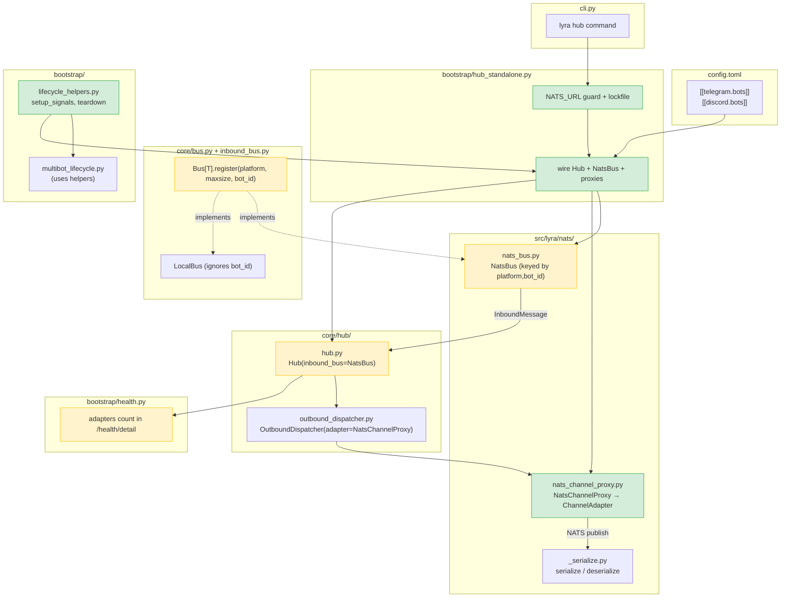
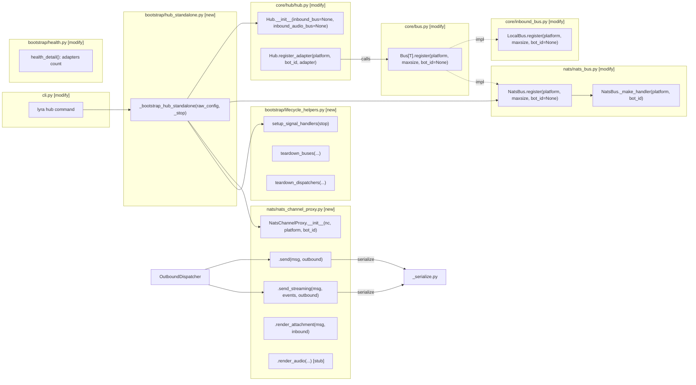

## Summary

Implement standalone Hub process (`lyra hub`) by: (1) making Hub accept injected `Bus[T]` instances, (2) extending the Bus Protocol and NatsBus for multi-bot `bot_id` keying, (3) creating `NatsChannelProxy` as a NATS-backed `ChannelAdapter`, (4) writing a standalone bootstrap parallel to `multibot.py`, and (5) adding the `lyra hub` CLI command. Three sequential slices, each independently testable.

## Architecture

### Data flow



### File x Function map



## Bootstrap Context

**Reference implementation:** `NatsBus` (#455, `src/lyra/nats/nats_bus.py`) — same subscription-based pattern, same serializer, same test fixtures. `NatsChannelProxy` follows the same NATS publish pattern but for outbound.

**Reference bootstrap:** `multibot.py` — standalone bootstrap reuses `_resolve_agents`, `_build_bot_auths`, `_resolve_bot_agent_map`, `open_stores` from existing modules.

## Agents

| Agent | Task count | Files |
|-------|-----------|-------|
| backend-dev | 14 | `bus.py`, `inbound_bus.py`, `hub.py`, `nats_bus.py`, `nats_channel_proxy.py`, `lifecycle_helpers.py`, `multibot_lifecycle.py`, `hub_standalone.py`, `cli.py`, `health.py` |
| tester | 6 | `test_lifecycle_helpers.py`, `test_bus_injection.py`, `test_nats_bus_multibot.py`, `test_serialize_outbound.py`, `test_nats_channel_proxy.py`, `test_hub_standalone.py` |

## Consistency Report

| Metric | Value |
|--------|-------|
| Success criteria | 17 |
| Covered by tasks | 17/17 |
| Uncovered | 0 |
| Untraced tasks | 0 |

## Micro-Tasks

### Slice S1: Hub bus injection + Bus Protocol extension + lifecycle extraction

---

#### S1-T1: Extract lifecycle helpers from multibot_lifecycle.py [P]

- **Agent:** backend-dev
- **File:** `src/lyra/bootstrap/lifecycle_helpers.py` (new)
- **Spec trace:** SC-15 (lifecycle helpers extracted)
- **Phase:** RED
- **Difficulty:** 2

**Description:** Create `lifecycle_helpers.py` with shared helpers extracted from `multibot_lifecycle.py`.

```python
# src/lyra/bootstrap/lifecycle_helpers.py
"""Shared lifecycle helpers for multibot and standalone Hub bootstrap."""
import asyncio, logging, signal
from lyra.core.bus import Bus

log = logging.getLogger(__name__)

def setup_signal_handlers(stop: asyncio.Event) -> None:
    """Register SIGINT/SIGTERM handlers on the running event loop."""
    loop = asyncio.get_running_loop()
    loop.add_signal_handler(signal.SIGINT, stop.set)
    loop.add_signal_handler(signal.SIGTERM, stop.set)

async def teardown_buses(*buses: Bus) -> None:
    """Stop all provided buses."""
    for bus in buses:
        await bus.stop()

async def teardown_dispatchers(dispatchers: list) -> None:
    """Stop all outbound dispatchers."""
    for d in dispatchers:
        await d.stop()
```

**Verify:** `python -c "from lyra.bootstrap.lifecycle_helpers import setup_signal_handlers, teardown_buses, teardown_dispatchers"`
**Expected:** No import error

---

#### S1-T2: Rewire multibot_lifecycle.py to use extracted helpers [P]

- **Agent:** backend-dev
- **File:** `src/lyra/bootstrap/multibot_lifecycle.py`
- **Spec trace:** SC-15
- **Phase:** GREEN
- **Difficulty:** 2

**Description:** Replace inline signal setup (lines 46-49) and bus/dispatcher teardown (lines 96-101) with calls to extracted helpers. `run_lifecycle()` becomes a thin orchestrator.

**Verify:** `cd /home/mickael/projects/lyra && python -m pytest tests/ -x -q --timeout=30 2>&1 | tail -5`
**Expected:** All existing tests pass

---

#### S1-T3: Test lifecycle helpers via embedded path

- **Agent:** tester
- **File:** `tests/bootstrap/test_lifecycle_helpers.py` (new)
- **Spec trace:** SC-15
- **Phase:** GREEN
- **Difficulty:** 2

**Description:** Test that extracted helpers work correctly: `setup_signal_handlers` registers handlers, `teardown_buses` stops buses, `teardown_dispatchers` stops dispatchers. Use mocks.

**Verify:** `cd /home/mickael/projects/lyra && python -m pytest tests/bootstrap/test_lifecycle_helpers.py -v`
**Expected:** All tests pass

---

#### **RED-GATE S1-LIFECYCLE** — All existing tests green, lifecycle_helpers importable, multibot uses them

---

#### S1-T4: Add bot_id param to Bus[T] Protocol register()

- **Agent:** backend-dev
- **File:** `src/lyra/core/bus.py`
- **Spec trace:** SC-12 (Bus Protocol gains bot_id)
- **Phase:** RED
- **Difficulty:** 1

**Description:** Add `bot_id: str | None = None` to `Bus[T].register()` signature at line 34.

```python
def register(self, platform: Platform, maxsize: int = 100, bot_id: str | None = None) -> None:
```

**Verify:** `cd /home/mickael/projects/lyra && python -m pyright src/lyra/core/bus.py 2>&1 | tail -3`
**Expected:** 0 errors

---

#### S1-T5: Accept bot_id in LocalBus.register() (no-op) [P]

- **Agent:** backend-dev
- **File:** `src/lyra/core/inbound_bus.py`
- **Spec trace:** SC-12
- **Phase:** GREEN
- **Difficulty:** 1

**Description:** Add `bot_id: str | None = None` to `LocalBus.register()` at line 75. Ignore the parameter — no behavior change.

```python
def register(self, platform: Platform, maxsize: int = 100, bot_id: str | None = None) -> None:  # noqa: ARG002
```

**Verify:** `cd /home/mickael/projects/lyra && python -m pytest tests/ -x -q --timeout=30 2>&1 | tail -5`
**Expected:** All existing tests pass

---

#### S1-T6: Hub constructor accepts optional bus injection [P]

- **Agent:** backend-dev
- **File:** `src/lyra/core/hub/hub.py`
- **Spec trace:** SC-11 (Hub constructor backward-compat)
- **Phase:** RED
- **Difficulty:** 3

**Description:** Add `inbound_bus: Bus[InboundMessage] | None = None` and `inbound_audio_bus: Bus[InboundAudio] | None = None` to Hub.__init__. When `None`, create `LocalBus` (current behavior). When provided, use the injected bus. Also update `register_adapter()` to pass `bot_id` to `self.inbound_bus.register()`.

```python
def __init__(self, ..., inbound_bus: Bus[InboundMessage] | None = None,
             inbound_audio_bus: Bus[InboundAudio] | None = None, ...) -> None:
    ...
    self.inbound_bus: Bus[InboundMessage] = inbound_bus or LocalBus(...)
    self.inbound_audio_bus: Bus[InboundAudio] = inbound_audio_bus or LocalBus(...)

def register_adapter(self, platform: Platform, bot_id: str, adapter: ChannelAdapter) -> None:
    self.adapter_registry[(platform, bot_id)] = adapter
    if platform not in self.inbound_bus.registered_platforms():
        self.inbound_bus.register(platform, maxsize=self._platform_queue_maxsize, bot_id=bot_id)
    if platform not in self.inbound_audio_bus.registered_platforms():
        self.inbound_audio_bus.register(platform, maxsize=self._platform_queue_maxsize, bot_id=bot_id)
```

**Verify:** `cd /home/mickael/projects/lyra && python -m pytest tests/ -x -q --timeout=30 2>&1 | tail -5`
**Expected:** All existing tests pass (default None = LocalBus = unchanged behavior)

---

#### S1-T7: Test Hub bus injection with mock bus

- **Agent:** tester
- **File:** `tests/core/hub/test_bus_injection.py` (new)
- **Spec trace:** SC-11, SC-12
- **Phase:** GREEN
- **Difficulty:** 2

**Description:** Test that Hub uses injected bus when provided and creates LocalBus when not. Verify `register_adapter` passes `bot_id` to bus.

**Verify:** `cd /home/mickael/projects/lyra && python -m pytest tests/core/hub/test_bus_injection.py -v`
**Expected:** All tests pass

---

#### **RED-GATE S1** — Pyright clean, all tests green, Hub accepts injected bus, Bus Protocol has bot_id

---

### Slice S2: NatsChannelProxy + multi-bot NatsBus

---

#### S2-T1: Extend NatsBus.register() with bot_id keying

- **Agent:** backend-dev
- **File:** `src/lyra/nats/nats_bus.py`
- **Spec trace:** SC-12, SC-3
- **Phase:** RED
- **Difficulty:** 3

**Description:** Add `bot_id: str | None = None` to `register()`. Change `_subscriptions` from `dict[Platform, Subscription]` to `dict[tuple[Platform, str], Subscription]`. Update `_make_handler()` to accept `bot_id`. When `bot_id` is `None`, fall back to constructor's `self._bot_id`. Update `start()`, `stop()`, and `registered_platforms()` to work with new key type.

**Verify:** `cd /home/mickael/projects/lyra && python -m pytest tests/nats/test_nats_bus.py -v 2>&1 | tail -10`
**Expected:** All existing NatsBus tests pass (backward compat — bot_id=None uses constructor bot_id)

---

#### S2-T2: Test NatsBus multi-bot extension

- **Agent:** tester
- **File:** `tests/nats/test_nats_bus_multibot.py` (new)
- **Spec trace:** SC-12, SC-3
- **Phase:** GREEN
- **Difficulty:** 3

**Description:** Test multi-bot NatsBus: register 2 bots on same platform with different bot_ids, start, publish to each subject, verify messages arrive on staging queue with correct platform. Test backward compat (no bot_id = constructor's bot_id).

**Verify:** `cd /home/mickael/projects/lyra && python -m pytest tests/nats/test_nats_bus_multibot.py -v`
**Expected:** All tests pass (requires nats-server in PATH)

---

#### S2-T3: Verify OutboundMessage + RenderEvent serialization round-trip [P]

- **Agent:** tester
- **File:** `tests/nats/test_serialize_outbound.py` (new)
- **Spec trace:** SC-16
- **Phase:** RED
- **Difficulty:** 2

**Description:** Test `_serialize.serialize()` / `deserialize()` for `OutboundMessage`, `TextRenderEvent`, `ToolSummaryRenderEvent`, `OutboundAttachment`. Verify round-trip fidelity. Fix any gaps in `_serialize.py` if found.

**Verify:** `cd /home/mickael/projects/lyra && python -m pytest tests/nats/test_serialize_outbound.py -v`
**Expected:** All round-trip tests pass

---

#### S2-T4: Create NatsChannelProxy [P]

- **Agent:** backend-dev
- **File:** `src/lyra/nats/nats_channel_proxy.py` (new)
- **Spec trace:** SC-5, SC-6, SC-7, SC-8, SC-9
- **Phase:** RED
- **Difficulty:** 4

**Description:** Implement `NatsChannelProxy` satisfying `ChannelAdapter` Protocol. See spec S2 step 3 for full method specs. Key methods: `send()` publishes to `lyra.outbound.{platform}.{bot_id}`, `send_streaming()` publishes chunks, `render_attachment()` publishes attachment, audio methods stub with warning + iterator drain.

**Verify:** `python -c "from lyra.nats.nats_channel_proxy import NatsChannelProxy; print('OK')"`
**Expected:** OK

---

#### S2-T5: Update nats/__init__.py exports [P]

- **Agent:** backend-dev
- **File:** `src/lyra/nats/__init__.py`
- **Spec trace:** —
- **Phase:** GREEN
- **Difficulty:** 1

**Description:** Add `NatsChannelProxy` to `__init__.py` exports.

**Verify:** `python -c "from lyra.nats import NatsChannelProxy; print('OK')"`
**Expected:** OK

---

#### S2-T6: Test NatsChannelProxy with mock NATS

- **Agent:** tester
- **File:** `tests/nats/test_nats_channel_proxy.py` (new)
- **Spec trace:** SC-5, SC-6, SC-7, SC-8, SC-9
- **Phase:** GREEN
- **Difficulty:** 4

**Description:** Test all 8 ChannelAdapter methods: `send()` publishes correct subject + envelope, `send_streaming()` publishes chunks with seq/done, `render_attachment()` publishes attachment envelope, audio stubs log warning and drain iterators, `normalize*()` raise NotImplementedError. Test iterator drain on NATS publish failure.

**Verify:** `cd /home/mickael/projects/lyra && python -m pytest tests/nats/test_nats_channel_proxy.py -v`
**Expected:** All tests pass

---

#### S2-T7: Pyright check on nats package

- **Agent:** backend-dev
- **File:** `src/lyra/nats/`
- **Spec trace:** DoD
- **Phase:** REFACTOR
- **Difficulty:** 1

**Description:** Run Pyright on modified + new nats files. Fix any type errors.

**Verify:** `cd /home/mickael/projects/lyra && python -m pyright src/lyra/nats/ 2>&1 | tail -3`
**Expected:** 0 errors

---

#### **RED-GATE S2** — All tests green, NatsChannelProxy + multi-bot NatsBus working, serialization verified

---

### Slice S3: Standalone bootstrap + CLI + ops

---

#### S3-T1: Create hub_standalone.py bootstrap

- **Agent:** backend-dev
- **File:** `src/lyra/bootstrap/hub_standalone.py` (new)
- **Spec trace:** SC-1, SC-2, SC-3, SC-4, SC-13
- **Phase:** RED
- **Difficulty:** 5

**Description:** Implement `_bootstrap_hub_standalone()` per spec S3 step 1. NATS_URL guard, NATS connection, NatsBus creation, store opening, agent loading, authenticator registration, NatsChannelProxy + OutboundDispatcher per bot, lifecycle via extracted helpers. Lockfile guard per spec S3 step 2.

**Verify:** `python -c "from lyra.bootstrap.hub_standalone import _bootstrap_hub_standalone; print('OK')"`
**Expected:** OK

---

#### S3-T2: Add `lyra hub` CLI command

- **Agent:** backend-dev
- **File:** `src/lyra/cli.py`
- **Spec trace:** SC-1
- **Phase:** GREEN
- **Difficulty:** 2

**Description:** Add `hub_app = typer.Typer(name="hub")` and register with `lyra_app.add_typer(hub_app)`. Default command invokes `_bootstrap_hub_standalone` via `asyncio.run()`.

```python
hub_app = typer.Typer(name="hub", help="Run standalone Hub process (requires NATS).")
lyra_app.add_typer(hub_app, name="hub")

@hub_app.callback(invoke_without_command=True)
def _hub_callback(ctx: typer.Context) -> None:
    if ctx.invoked_subcommand is None:
        _run_hub()

def _run_hub() -> None:
    from lyra.bootstrap.hub_standalone import _bootstrap_hub_standalone
    ...
```

**Verify:** `cd /home/mickael/projects/lyra && python -m lyra hub --help 2>&1`
**Expected:** Shows hub help text (does not start server)

---

#### S3-T3: Add adapters count to health endpoint

- **Agent:** backend-dev
- **File:** `src/lyra/bootstrap/health.py`
- **Spec trace:** SC-14
- **Phase:** GREEN
- **Difficulty:** 1

**Description:** Add `"adapters": len(hub.adapter_registry)` to the `result` dict in `health_detail()` (after line 81).

**Verify:** `cd /home/mickael/projects/lyra && python -m pytest tests/ -x -q -k health --timeout=30 2>&1 | tail -5`
**Expected:** Existing health tests pass

---

#### S3-T4: Standalone bootstrap integration test

- **Agent:** tester
- **File:** `tests/nats/test_hub_standalone.py` (new)
- **Spec trace:** SC-1, SC-2, SC-3, SC-4, SC-5, SC-6, SC-17
- **Phase:** GREEN
- **Difficulty:** 5

**Description:** Integration test using real nats-server (reuses `tests/nats/conftest.py` fixtures). Creates a minimal config with one test bot, starts standalone Hub with `_stop` event, publishes `InboundMessage` to NATS, subscribes to outbound subject, asserts `OutboundMessage` arrives. Tests: NATS_URL guard (absent → SystemExit), trust re-resolution invoked (mock authenticator), streaming chunks, lockfile creation/cleanup.

**Verify:** `cd /home/mickael/projects/lyra && python -m pytest tests/nats/test_hub_standalone.py -v`
**Expected:** All tests pass (requires nats-server in PATH)

---

#### S3-T5: Full regression test suite

- **Agent:** backend-dev
- **File:** —
- **Spec trace:** SC-10 (embedded mode unchanged), DoD
- **Phase:** GREEN
- **Difficulty:** 1

**Description:** Run full test suite to verify zero regression in embedded mode.

**Verify:** `cd /home/mickael/projects/lyra && python -m pytest tests/ -x -q --timeout=60 2>&1 | tail -10`
**Expected:** All tests pass

---

#### S3-T6: Final Pyright check

- **Agent:** backend-dev
- **File:** —
- **Spec trace:** DoD
- **Phase:** REFACTOR
- **Difficulty:** 1

**Description:** Run Pyright across all modified/new files.

**Verify:** `cd /home/mickael/projects/lyra && python -m pyright src/lyra/core/bus.py src/lyra/core/inbound_bus.py src/lyra/core/hub/hub.py src/lyra/nats/ src/lyra/bootstrap/lifecycle_helpers.py src/lyra/bootstrap/hub_standalone.py src/lyra/cli.py src/lyra/bootstrap/health.py 2>&1 | tail -3`
**Expected:** 0 errors

---

#### **RED-GATE S3** — All tests green, Pyright clean, `lyra hub` starts and processes messages via NATS

## Task Dependency Graph

```
S1-T1 ─┐
S1-T2 ─┤ (lifecycle extraction)
S1-T3 ─┘
  │
  ├── RED-GATE S1-LIFECYCLE
  │
S1-T4 ─┐
S1-T5 ─┤ [P] (bus protocol + hub injection)
S1-T6 ─┤
S1-T7 ─┘
  │
  ├── RED-GATE S1
  │
S2-T1 ─┐
S2-T2 ─┤
S2-T3 ─┤ [P] (NatsBus extension + serialization + proxy)
S2-T4 ─┤
S2-T5 ─┤
S2-T6 ─┤
S2-T7 ─┘
  │
  ├── RED-GATE S2
  │
S3-T1 ─┐
S3-T2 ─┤ (bootstrap + CLI + health + tests)
S3-T3 ─┤
S3-T4 ─┤
S3-T5 ─┤
S3-T6 ─┘
  │
  └── RED-GATE S3 (DONE)
```
