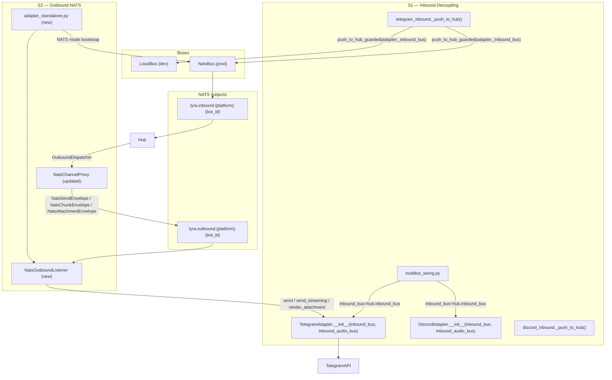
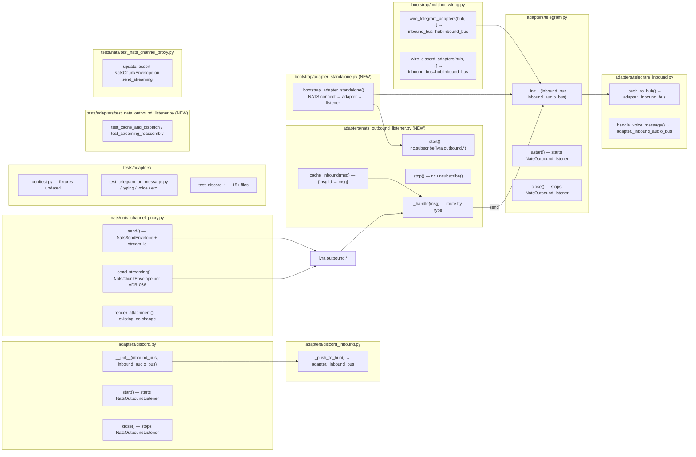

## Summary

Remove the `Hub` reference from `TelegramAdapter` and `DiscordAdapter`, rewiring them as pure I/O translators via NATS. S1 decouples inbound (constructor + call-site changes, ~30 test files updated). S2 adds `NatsOutboundListener`, aligns `NatsChannelProxy` with ADR-036, and adds `bootstrap/adapter_standalone.py`.

## Architecture

### Data Flow



### File × Function Map



## Agents

| Agent | Tasks | Key Files |
|-------|-------|-----------|
| backend-dev | T1–T12 | adapters/telegram.py, discord.py, telegram_inbound.py, discord_inbound.py, nats_channel_proxy.py, nats_outbound_listener.py (new), multibot_wiring.py, adapter_standalone.py (new) |
| tester | T13–T17 | tests/adapters/conftest.py, test_telegram_on_message.py + ~20 test files, test_nats_outbound_listener.py (new), tests/nats/test_nats_channel_proxy.py |

## Consistency Report

| Criterion | Covered by | Tasks |
|-----------|-----------|-------|
| SC-1: TelegramAdapter inbound_bus param | U1 | T1 |
| SC-2: DiscordAdapter inbound_bus param | U2 | T2 |
| SC-3: telegram_inbound uses adapter._inbound_bus | N1 | T3 |
| SC-4: discord_inbound uses adapter._inbound_bus | N1 | T5 |
| SC-5: handle_voice_message uses _inbound_audio_bus | N1 | T4 |
| SC-6: No Hub import | U1/U2 | T1, T2 |
| SC-7: NatsChannelProxy.send_streaming → NatsChunkEnvelope | N5 | T10 |
| SC-8: NatsOutboundListener handles all 3 envelope types | N3/N4/N5 | T8 |
| SC-9: Adapter-side cache, no original_msg in envelope | S3/N3 | T8, T9 |
| SC-10: Listener lifecycle in adapter start/close | S1/S2 | T11 |
| SC-11: Dev mode -- adapter all works with LocalBus | U1/U2 | T6, T13 |
| SC-12: adapter_standalone.py per ADR-037 | — | T12 |

**Covered:** 12/12 · **Uncovered:** 0 · **Exemptions:** none

---

## Micro-Tasks

### Slice V1 — Inbound Decoupling

---

#### T1 — Update TelegramAdapter constructor [backend-dev] [P]

**Description:** Replace `hub: Hub` parameter with `inbound_bus: Bus[InboundMessage]` and `inbound_audio_bus: Bus[InboundAudio]`. Remove `self._hub`. Remove `from lyra.core.hub import Hub` (including TYPE_CHECKING block).

**File:** `src/lyra/adapters/telegram.py`

**Code snippet:**
```python
# Remove:
#   if TYPE_CHECKING:
#       from lyra.core.hub import Hub

def __init__(
    self,
    bot_id: str,
    token: str,
    inbound_bus: "Bus[InboundMessage]",
    inbound_audio_bus: "Bus[InboundAudio]",
    webhook_secret: str = "",
    circuit_registry: CircuitRegistry | None = None,
    msg_manager: MessageManager | None = None,
) -> None:
    ...
    self._inbound_bus = inbound_bus
    self._inbound_audio_bus = inbound_audio_bus
    # Remove: self._hub = hub
    self._outbound_listener: "NatsOutboundListener | None" = None
```

**Verify:** `grep -q "_inbound_bus" src/lyra/adapters/telegram.py && grep -c "from lyra.core.hub import Hub" src/lyra/adapters/telegram.py | grep -q "^0"`

**Expected:** `_inbound_bus` present, Hub import absent

**Time:** 5 min | **Spec trace:** SC-1, SC-6, U1 | **Phase:** GREEN | **Difficulty:** 2

---

#### T2 — Update DiscordAdapter constructor [backend-dev] [P]

**Description:** Same as T1 for `DiscordAdapter`. Replace `hub: Hub` with `inbound_bus + inbound_audio_bus`. Remove Hub import.

**File:** `src/lyra/adapters/discord.py`

**Code snippet:**
```python
def __init__(
    self,
    bot_id: str,
    inbound_bus: "Bus[InboundMessage]",
    inbound_audio_bus: "Bus[InboundAudio]",
    circuit_registry: CircuitRegistry | None = None,
    ...
) -> None:
    ...
    self._inbound_bus = inbound_bus
    self._inbound_audio_bus = inbound_audio_bus
    self._outbound_listener: "NatsOutboundListener | None" = None
```

**Verify:** `grep -q "_inbound_bus" src/lyra/adapters/discord.py && grep -c "from lyra.core.hub import Hub" src/lyra/adapters/discord.py | grep -q "^0"`

**Time:** 5 min | **Spec trace:** SC-2, SC-6, U2 | **Phase:** GREEN | **Difficulty:** 2

---

#### T3 — Update telegram_inbound._push_to_hub [backend-dev]

**Description:** Replace `inbound_bus=adapter._hub.inbound_bus` with `inbound_bus=adapter._inbound_bus` in `_push_to_hub()`. Add `cache_inbound` call before `push_to_hub_guarded` if listener is present.

**File:** `src/lyra/adapters/telegram_inbound.py`

**Code snippet:**
```python
async def _push_to_hub(adapter, hub_msg, on_drop=None):
    ...
    if adapter._outbound_listener is not None:
        adapter._outbound_listener.cache_inbound(hub_msg)
    await push_to_hub_guarded(
        inbound_bus=adapter._inbound_bus,  # was: adapter._hub.inbound_bus
        ...
    )
```

**Verify:** `grep -q "adapter._inbound_bus" src/lyra/adapters/telegram_inbound.py && grep -c "adapter._hub" src/lyra/adapters/telegram_inbound.py | grep -q "^0"`

**Time:** 3 min | **Spec trace:** SC-3, N1, S3 | **Phase:** GREEN | **Difficulty:** 2

---

#### T4 — Update telegram_inbound.handle_voice_message [backend-dev]

**Description:** Replace `inbound_bus=adapter._hub.inbound_audio_bus` with `inbound_bus=adapter._inbound_audio_bus` in `handle_voice_message()`.

**File:** `src/lyra/adapters/telegram_inbound.py`

**Code snippet:**
```python
await push_to_hub_guarded(
    inbound_bus=adapter._inbound_audio_bus,  # was: adapter._hub.inbound_audio_bus
    ...
)
```

**Verify:** `grep -c "inbound_audio_bus" src/lyra/adapters/telegram_inbound.py | grep -q "^[1-9]"`

**Time:** 2 min | **Spec trace:** SC-5, N1 | **Phase:** GREEN | **Difficulty:** 1

---

#### T5 — Update discord_inbound._push_to_hub [backend-dev]

**Description:** Replace `inbound_bus=adapter._hub.inbound_bus` with `inbound_bus=adapter._inbound_bus` in `discord_inbound._push_to_hub()`. Add `cache_inbound` call if listener present.

**File:** `src/lyra/adapters/discord_inbound.py`

**Code snippet:**
```python
if adapter._outbound_listener is not None:
    adapter._outbound_listener.cache_inbound(hub_msg)
await push_to_hub_guarded(
    inbound_bus=adapter._inbound_bus,  # was: adapter._hub.inbound_bus
    ...
)
```

**Verify:** `grep -q "adapter._inbound_bus" src/lyra/adapters/discord_inbound.py && grep -c "adapter._hub" src/lyra/adapters/discord_inbound.py | grep -q "^0"`

**Time:** 3 min | **Spec trace:** SC-4, N1 | **Phase:** GREEN | **Difficulty:** 2

---

#### T6 — Update multibot_wiring.py bootstrap calls [backend-dev]

**Description:** In `wire_telegram_adapters()` and `wire_discord_adapters()`, pass `inbound_bus=hub.inbound_bus` and `inbound_audio_bus=hub.inbound_audio_bus` to adapter constructors instead of `hub=hub`. LocalBus is automatically used in dev mode since `hub.inbound_bus` is a `LocalBus` there.

**File:** `src/lyra/bootstrap/multibot_wiring.py`

**Code snippet:**
```python
adapter = TelegramAdapter(
    bot_id=bot_cfg.bot_id,
    token=tg_token,
    inbound_bus=hub.inbound_bus,           # was: hub=hub
    inbound_audio_bus=hub.inbound_audio_bus,
    webhook_secret=tg_webhook_secret or "",
    circuit_registry=circuit_registry,
    msg_manager=msg_manager,
)
```

**Verify:** `grep -c "hub=hub" src/lyra/bootstrap/multibot_wiring.py | grep -q "^0"`

**Time:** 5 min | **Spec trace:** SC-11, U1/U2 | **Phase:** GREEN | **Difficulty:** 2

---

#### T7 — Update test conftest.py fixtures [tester] [P]

**Description:** Update `tests/adapters/conftest.py` shared fixtures to use `inbound_bus=MagicMock()` instead of `hub=mock_hub`. Create a shared `mock_inbound_bus` fixture for reuse.

**File:** `tests/adapters/conftest.py`

**Code snippet:**
```python
@pytest.fixture
def mock_inbound_bus():
    bus = MagicMock()
    bus.put = AsyncMock()
    return bus

@pytest.fixture
def telegram_adapter(mock_inbound_bus):
    return TelegramAdapter(
        bot_id="main", token="tok",
        inbound_bus=mock_inbound_bus,
        inbound_audio_bus=MagicMock(),
    )

@pytest.fixture
def discord_adapter(mock_inbound_bus):
    return DiscordAdapter(
        bot_id="main",
        inbound_bus=mock_inbound_bus,
        inbound_audio_bus=MagicMock(),
    )
```

**Verify:** `grep -c "hub=hub" tests/adapters/conftest.py | grep -q "^0"`

**Time:** 5 min | **Spec trace:** SC-11 | **Phase:** GREEN | **Difficulty:** 2

---

#### T8-batch — Update all adapter test files to remove hub= [tester]

**Description:** In all ~20 affected test files, replace `hub=hub` / `hub=MagicMock()` constructor calls with `inbound_bus=mock_inbound_bus, inbound_audio_bus=MagicMock()`. Update assertions that reference `hub.inbound_bus.put` to use a direct `mock_inbound_bus.put`.

**Files:**
```
tests/adapters/test_telegram_on_message.py
tests/adapters/test_telegram_typing.py
tests/adapters/test_telegram_normalize_fields.py
tests/adapters/test_telegram_auth.py
tests/adapters/test_telegram_voice.py
tests/adapters/test_telegram_attachments.py
tests/adapters/test_telegram_outbound_send.py
tests/adapters/test_discord_app_commands.py
tests/adapters/test_discord_voice_commands.py
tests/adapters/test_discord_audio.py
tests/adapters/test_discord_outbound.py
tests/adapters/test_discord_threads.py
tests/adapters/test_discord_typing.py
tests/adapters/test_discord_auth.py
tests/adapters/test_discord_edge.py
tests/adapters/test_discord_normalize.py
tests/adapters/test_discord_watch.py
tests/adapters/test_streaming.py
tests/bootstrap/test_multibot_wiring.py
tests/conftest.py
```

**Verify:** `grep -rn "hub=" tests/adapters/ tests/bootstrap/test_multibot_wiring.py | grep -v "_hub\|hub_url\|hub_standalone\|test_hub\|make_hub\|inbound_hub\|#" | wc -l | grep -q "^0"`

**Time:** 10 min | **Spec trace:** SC-1, SC-2, SC-11 | **Phase:** GREEN | **Difficulty:** 3

---

#### RED-GATE V1

**Run before S2:** `python -m pytest tests/adapters/ tests/bootstrap/test_multibot_wiring.py -x -q 2>&1 | tail -5`

All S1 tests must pass. No `hub=` references in adapter constructors.

---

### Slice V2 — Outbound over NATS + Bootstrap

---

#### T9 — Implement NatsOutboundListener [backend-dev]

**Description:** Create `src/lyra/adapters/nats_outbound_listener.py`. Subscribes to `lyra.outbound.{platform}.{bot_id}`. Routes by envelope type: `type=send` → `adapter.send()`, `type=attachment` → `adapter.render_attachment()`, streaming chunks (NatsChunkEnvelope) → per-stream Queue → `adapter.send_streaming()`. Maintains `_cache: dict[str, InboundMessage]` for msg_id correlation. Evicts cache entry on stream `done=true`.

**File:** `src/lyra/adapters/nats_outbound_listener.py`

**Code snippet:**
```python
class NatsOutboundListener:
    def __init__(self, nc: NATS, platform: Platform, bot_id: str, adapter) -> None:
        self._nc = nc
        self._platform = platform
        self._bot_id = bot_id
        self._adapter = adapter
        self._cache: dict[str, InboundMessage] = {}
        self._stream_queues: dict[str, asyncio.Queue] = {}
        self._sub: Subscription | None = None

    def cache_inbound(self, msg: InboundMessage) -> None:
        self._cache[msg.id] = msg

    async def start(self) -> None:
        subject = f"lyra.outbound.{self._platform.value}.{self._bot_id}"
        self._sub = await self._nc.subscribe(subject, cb=self._handle)

    async def stop(self) -> None:
        if self._sub:
            await self._sub.unsubscribe()
            self._sub = None

    async def _handle(self, msg: Msg) -> None:
        data = json.loads(msg.data)
        msg_type = data.get("type")
        if msg_type == "send":
            await self._handle_send(data)
        elif msg_type == "attachment":
            await self._handle_attachment(data)
        elif "stream_id" in data and "seq" in data:
            await self._handle_chunk(data)

    async def _handle_send(self, data: dict) -> None:
        stream_id = data["stream_id"]
        original_msg = self._cache.get(stream_id)
        if original_msg is None:
            log.warning("NatsOutboundListener: unknown stream_id=%s", stream_id)
            return
        outbound = OutboundMessage(**data["outbound"])  # deserialize
        await self._adapter.send(original_msg, outbound)
        self._cache.pop(stream_id, None)

    async def _handle_chunk(self, data: dict) -> None:
        stream_id = data["stream_id"]
        q = self._stream_queues.setdefault(stream_id, asyncio.Queue())
        await q.put(data)
        if data.get("done"):
            # launch send_streaming task if not already running
            ...
```

**Verify:** `test -f src/lyra/adapters/nats_outbound_listener.py && grep -q "class NatsOutboundListener" src/lyra/adapters/nats_outbound_listener.py`

**Time:** 10 min | **Spec trace:** SC-8, SC-9, N2/N3/N4/N5, S1/S2/S3 | **Phase:** GREEN | **Difficulty:** 4

---

#### T10 — Update NatsChannelProxy.send() — add stream_id [backend-dev] [P]

**Description:** Add `stream_id=original_msg.id` to the outbound envelope in `send()`. Update `render_attachment()` similarly to include `stream_id`.

**File:** `src/lyra/nats/nats_channel_proxy.py`

**Code snippet:**
```python
async def send(self, original_msg, outbound):
    subject = f"lyra.outbound.{self._platform.value}.{self._bot_id}"
    envelope = {
        "type": "send",
        "stream_id": original_msg.id,       # ADD: correlation key
        "outbound": json.loads(serialize(outbound).decode("utf-8")),
    }
    await self._nc.publish(subject, json.dumps(envelope).encode("utf-8"))
```

**Verify:** `grep -q '"stream_id"' src/lyra/nats/nats_channel_proxy.py`

**Time:** 3 min | **Spec trace:** SC-9, N3 | **Phase:** GREEN | **Difficulty:** 2

---

#### T11 — Update NatsChannelProxy.send_streaming() — NatsChunkEnvelope [backend-dev]

**Description:** Replace the current `lyra.outbound.stream.{platform}.{bot_id}.{msg_id}` subject pattern with the single `lyra.outbound.{platform}.{bot_id}` subject. Use `NatsChunkEnvelope` format per ADR-036: `{stream_id, seq, event_type, payload, done}`.

**File:** `src/lyra/nats/nats_channel_proxy.py`

**Code snippet:**
```python
async def send_streaming(self, original_msg, events, outbound=None):
    subject = f"lyra.outbound.{self._platform.value}.{self._bot_id}"  # single subject
    seq = 0
    async for event in events:
        event_type = "text" if isinstance(event, TextRenderEvent) else "tool_summary"
        chunk = {
            "stream_id": original_msg.id,   # correlation key per ADR-036
            "seq": seq,
            "event_type": event_type,
            "payload": json.loads(serialize(event).decode("utf-8")),
            "done": getattr(event, "is_final", False) or getattr(event, "is_complete", False),
        }
        await self._nc.publish(subject, json.dumps(chunk).encode("utf-8"))
        seq += 1
```

**Verify:** `grep -c "lyra.outbound.stream" src/lyra/nats/nats_channel_proxy.py | grep -q "^0"`

**Time:** 5 min | **Spec trace:** SC-7, N5 | **Phase:** GREEN | **Difficulty:** 3

---

#### T12 — Wire NatsOutboundListener into adapter lifecycle [backend-dev]

**Description:** Add `astart()` to `TelegramAdapter` that starts the listener if present. Update `close()` to stop the listener. Do the same for `DiscordAdapter.start()` / `close()`. The `_outbound_listener` attribute is set to `None` by default; set by bootstrap only in NATS mode.

**Files:** `src/lyra/adapters/telegram.py`, `src/lyra/adapters/discord.py`

**Code snippet (telegram):**
```python
async def astart(self) -> None:
    """Start the outbound listener if wired (NATS mode only)."""
    if self._outbound_listener is not None:
        await self._outbound_listener.start()

async def close(self) -> None:
    await self._typing.cancel_all()
    if self._outbound_listener is not None:
        await self._outbound_listener.stop()
```

**Verify:** `grep -q "astart" src/lyra/adapters/telegram.py && grep -q "_outbound_listener" src/lyra/adapters/discord.py`

**Time:** 5 min | **Spec trace:** SC-10, S1/S2 | **Phase:** GREEN | **Difficulty:** 2

---

#### T13 — Add bootstrap/adapter_standalone.py [backend-dev]

**Description:** Implement `src/lyra/bootstrap/adapter_standalone.py` per ADR-037: NATS connect → NatsBus(inbound) + LocalBus(audio) → TelegramAdapter/DiscordAdapter construction → `resolve_identity()` → NatsOutboundListener.start() → uvicorn server (Telegram) / Gateway connection (Discord) → shutdown handlers.

**File:** `src/lyra/bootstrap/adapter_standalone.py`

**Code snippet:**
```python
async def _bootstrap_adapter_standalone(raw_config, platform: str, *, _stop=None):
    nats_url = os.environ.get("NATS_URL") or sys.exit("NATS_URL required")
    nc = await nats.connect(nats_url)

    inbound_bus = NatsBus(nc=nc, bot_id=bot_id, item_type=InboundMessage)
    inbound_bus.register(platform_enum)
    await inbound_bus.start()

    inbound_audio_bus = LocalBus(name="inbound-audio")  # no-op sink

    adapter = TelegramAdapter(  # or DiscordAdapter
        bot_id=bot_id,
        token=token,
        inbound_bus=inbound_bus,
        inbound_audio_bus=inbound_audio_bus,
        webhook_secret=...,
    )
    await adapter.resolve_identity()

    listener = NatsOutboundListener(nc, platform_enum, bot_id, adapter)
    adapter._outbound_listener = listener
    await adapter.astart()  # starts listener

    # Telegram: uvicorn.run(adapter.app, ...)
    # Discord: await adapter.start(token)
    ...
```

**Verify:** `test -f src/lyra/bootstrap/adapter_standalone.py && grep -q "NatsOutboundListener" src/lyra/bootstrap/adapter_standalone.py`

**Time:** 10 min | **Spec trace:** SC-12 | **Phase:** GREEN | **Difficulty:** 4

---

#### T14 — Tests: NatsOutboundListener unit tests [tester]

**Description:** Create `tests/adapters/test_nats_outbound_listener.py`. Cover: (1) `cache_inbound` + `_handle_send` dispatches to `adapter.send()`; (2) `_handle_chunk` reassembles stream, calls `adapter.send_streaming()`; (3) unknown `stream_id` logs warning without crash; (4) `done=true` evicts cache entry; (5) `type=attachment` dispatches to `adapter.render_attachment()`.

**File:** `tests/adapters/test_nats_outbound_listener.py`

**Code snippet:**
```python
@pytest.mark.asyncio
async def test_send_envelope_dispatches_to_adapter():
    nc = AsyncMock()
    adapter = AsyncMock()
    listener = NatsOutboundListener(nc, Platform.TELEGRAM, "main", adapter)
    msg = make_tg_msg()
    listener.cache_inbound(msg)
    envelope = {"type": "send", "stream_id": msg.id, "outbound": {...}}
    nc_msg = MagicMock()
    nc_msg.data = json.dumps(envelope).encode()
    await listener._handle(nc_msg)
    adapter.send.assert_called_once()
```

**Verify:** `python -m pytest tests/adapters/test_nats_outbound_listener.py -q 2>&1 | tail -3`

**Expected:** All tests pass

**Time:** 8 min | **Spec trace:** SC-8, SC-9, N3/N4/N5 | **Phase:** RED → GREEN | **Difficulty:** 3

---

#### T15 — Tests: Update NatsChannelProxy tests [tester] [P]

**Description:** Update `tests/nats/test_nats_channel_proxy.py` to assert the new envelope format: `send()` includes `stream_id`, `send_streaming()` publishes to single subject with `NatsChunkEnvelope` (not `lyra.outbound.stream.*`).

**File:** `tests/nats/test_nats_channel_proxy.py`

**Code snippet:**
```python
async def test_send_includes_stream_id(proxy, mock_nc, inbound_msg):
    outbound = OutboundMessage(...)
    await proxy.send(inbound_msg, outbound)
    call_args = mock_nc.publish.call_args
    envelope = json.loads(call_args[0][1])
    assert envelope["stream_id"] == inbound_msg.id
    assert envelope["type"] == "send"

async def test_send_streaming_uses_single_subject(proxy, mock_nc, inbound_msg):
    events = aiter([TextRenderEvent(text="hi", is_final=True)])
    await proxy.send_streaming(inbound_msg, events)
    subject = mock_nc.publish.call_args_list[0][0][0]
    assert subject == f"lyra.outbound.telegram.{proxy._bot_id}"
    envelope = json.loads(mock_nc.publish.call_args_list[0][0][1])
    assert "stream_id" in envelope
    assert "seq" in envelope
```

**Verify:** `python -m pytest tests/nats/test_nats_channel_proxy.py -q 2>&1 | tail -3`

**Expected:** All tests pass (existing + new assertions)

**Time:** 5 min | **Spec trace:** SC-7, SC-9, N5 | **Phase:** GREEN | **Difficulty:** 2

---

#### T16 — Integration smoke: --adapter all dev mode [tester]

**Description:** Verify `--adapter all` mode still works end-to-end. Add/update a test in `tests/bootstrap/` that constructs the full multibot bootstrap (mocked), verifies adapters receive `inbound_bus=hub.inbound_bus` (a LocalBus), and no `NatsOutboundListener` is started.

**File:** `tests/bootstrap/test_multibot_wiring.py`

**Verify:** `python -m pytest tests/bootstrap/test_multibot_wiring.py -q 2>&1 | tail -3`

**Expected:** All tests pass, no `NatsOutboundListener` instantiated in dev mode path

**Time:** 5 min | **Spec trace:** SC-11 | **Phase:** GREEN | **Difficulty:** 2

---

#### T17 — Full suite regression [tester]

**Description:** Run full test suite to catch any missed hub= references or import errors.

**Verify:** `python -m pytest tests/ -x -q --ignore=tests/nats/test_hub_standalone.py 2>&1 | tail -10`

**Expected:** All tests pass

**Time:** 3 min | **Spec trace:** All SC | **Phase:** GREEN | **Difficulty:** 1

---

#### RED-GATE V2

**Run after all V2 tasks:** `python -m pytest tests/ -q 2>&1 | tail -5`

All 12 acceptance criteria verified. No `hub=` in adapter constructors. `NatsChannelProxy.send_streaming` uses single subject. Listener lifecycle wired.
