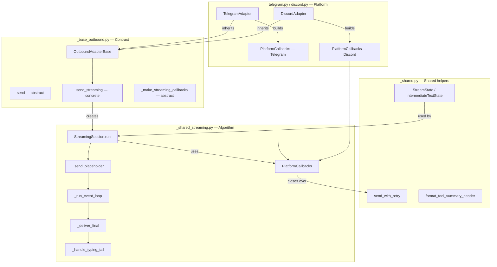
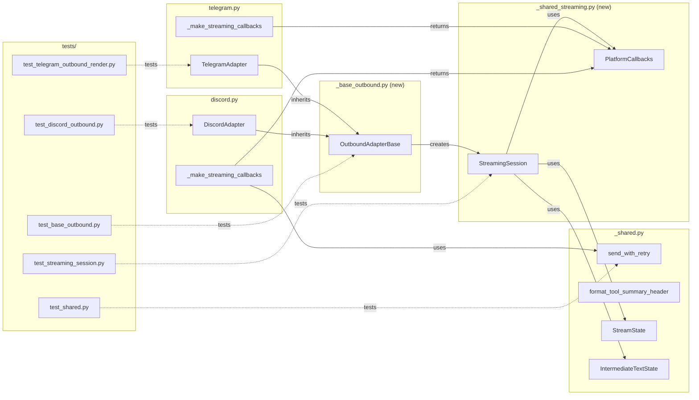

## Summary

Extract the shared streaming algorithm into `StreamingSession` + `PlatformCallbacks`, formalize the outbound adapter contract in `OutboundAdapterBase` (ABC with abstract `send()` and concrete `send_streaming()`), then migrate Discord and Telegram to inherit the base. 6 slices across 7 files (2 new), with V4 ∥ V5 after the V2 hard gate.

## Architecture

### Data Flow



### File × Function Map



## Agents

| Agent | Slices | Files |
|-------|--------|-------|
| backend-dev (V1) | V1 | `_shared.py`, `discord_outbound.py`, `telegram_outbound.py` |
| backend-dev (V2) | V2 | `_shared_streaming.py` (new) |
| backend-dev (V3) | V3 | `_base_outbound.py` (new) |
| backend-dev (V4) | V4 | `telegram.py`, `telegram_outbound.py` |
| backend-dev (V5) | V5 | `discord.py`, `discord_outbound.py` |
| tester | V1–V5 | `tests/adapters/test_shared.py`, `test_streaming_session.py` (new), `test_base_outbound.py` (new), `test_telegram_outbound_render.py`, `test_discord_outbound.py` |
| doc-writer | V6 | `src/lyra/adapters/CLAUDE.md` |

**Execution order:** V1 → V2 (hard gate) → V3 → V4 ∥ V5 → V6

## Consistency Report

- Criteria covered: 12/12
- Uncovered criteria: none
- Tasks without spec backing: 0
- Gold plating exemptions: 2 (`super().__init__()` in TelegramAdapter, `_typing_loop` dead code cleanup — both are correctness improvements discovered during review)

## Micro-Tasks

---

### Slice V1: Extract trivials to `_shared.py` — roxabi/lyra#494

#### Task 1: Write tests for `send_with_retry` and `format_tool_summary_header` → tester
- **File:** `tests/adapters/test_shared.py`
- **Snippet:** `def test_send_with_retry_succeeds_on_first_attempt(): ...` / `def test_format_tool_summary_header_complete(): assert format_tool_summary_header(event) == "🔧 Done ✅"`
- **Verify:** `grep -q 'send_with_retry\|format_tool_summary_header' tests/adapters/test_shared.py` (ready)
- **Expected:** Test functions present for both helpers
- **Time:** 3 min
- **Difficulty:** 2
- **Traces:** SC-6, SC-7
- **Phase:** RED

#### RED-GATE V1 → tester
- **Verify:** All V1 RED tasks complete
- **Phase:** RED-GATE

#### Task 2: Add `send_with_retry` to `_shared.py` [P] → backend-dev
- **File:** `src/lyra/adapters/_shared.py`
- **Snippet:** `async def send_with_retry(coro_fn: Callable[[], Any], *, label: str, max_attempts: int = 3) -> None: ...`
- **Verify:** `grep -q 'def send_with_retry' src/lyra/adapters/_shared.py` (ready)
- **Expected:** Function exists with keyword-only `label` arg (`*` in signature)
- **Time:** 3 min
- **Difficulty:** 2
- **Traces:** SC-6, S1
- **Phase:** GREEN

#### Task 3: Add `format_tool_summary_header` to `_shared.py` [P] → backend-dev
- **File:** `src/lyra/adapters/_shared.py`
- **Snippet:** `def format_tool_summary_header(event: ToolSummaryRenderEvent) -> str: return "🔧 Done ✅" if event.is_complete else "🔧 Working…"`
- **Verify:** `grep -q 'def format_tool_summary_header' src/lyra/adapters/_shared.py` (ready)
- **Expected:** Header-only function — does NOT include body/lines logic
- **Time:** 2 min
- **Difficulty:** 1
- **Traces:** SC-7, S2
- **Phase:** GREEN

#### Task 4: Update `_shared.py` `__all__` → backend-dev
- **File:** `src/lyra/adapters/_shared.py`
- **Snippet:** Add `"send_with_retry"` and `"format_tool_summary_header"` to `__all__`
- **Verify:** `grep -q 'send_with_retry' src/lyra/adapters/_shared.py` (ready)
- **Expected:** Both names in `__all__`
- **Time:** 1 min
- **Difficulty:** 1
- **Traces:** SC-6, SC-7
- **Phase:** GREEN

#### Task 5: Update `discord_outbound.py` to import from `_shared.py` → backend-dev
- **File:** `src/lyra/adapters/discord_outbound.py`
- **Snippet:** `from lyra.adapters._shared import send_with_retry, format_tool_summary_header` — remove `_discord_send_with_retry` definition
- **Verify:** `grep -c '_discord_send_with_retry' src/lyra/adapters/discord_outbound.py` (ready)
- **Expected:** `0` — no duplicate definition remains
- **Time:** 4 min
- **Difficulty:** 2
- **Traces:** SC-6
- **Phase:** REFACTOR

---

### Slice V2: Implement StreamingSession — roxabi/lyra#495

> **⚠ HARD GATE — V3, V4, V5 blocked until this slice's tests pass.**

#### Task 6: Write `StreamingSession` unit tests → tester
- **File:** `tests/adapters/test_streaming_session.py` (new)
- **Snippet:**
```python
async def test_had_tool_events_branch_updates_reply_message_id():
    outbound = OutboundMessage.from_text("")
    callbacks = make_mock_callbacks(send_message=AsyncMock(return_value=42))
    session = StreamingSession(callbacks, outbound)
    await session.run(fake_tool_events())
    assert outbound.metadata["reply_message_id"] == 42

async def test_fallback_path_updates_reply_message_id():
    ...  # send_placeholder raises, send_fallback returns 99
    assert outbound.metadata["reply_message_id"] == 99
```
- **Verify:** `grep -q 'test_had_tool_events\|test_fallback_path\|test_final_chunks\|test_stream_error' tests/adapters/test_streaming_session.py` (ready)
- **Expected:** All 3 delivery branches + fallback tested; both `outbound=None` and `outbound=OutboundMessage(...)` variants present
- **Time:** 8 min
- **Difficulty:** 4
- **Traces:** SC-9, U2, U3, U4, U5, U6
- **Phase:** RED

#### RED-GATE V2 → tester (HARD GATE)
- **Verify:** `pytest tests/adapters/test_streaming_session.py` passes
- **Phase:** RED-GATE

#### Task 7: Implement `PlatformCallbacks` dataclass → backend-dev
- **File:** `src/lyra/adapters/_shared_streaming.py` (new)
- **Snippet:**
```python
@dataclass
class PlatformCallbacks:
    send_placeholder: Callable[[], Awaitable[tuple[Any, int | None]]]
    edit_placeholder_text: Callable[[Any, str], Awaitable[None]]
    edit_placeholder_tool: Callable[[Any, ToolSummaryRenderEvent, str], Awaitable[None]]
    send_message: Callable[[str], Awaitable[int | None]]
    send_fallback: Callable[[str], Awaitable[int | None]]
    chunk_text: Callable[[str], list[str]]
    start_typing: Callable[[], None]
    cancel_typing: Callable[[], None]
```
- **Verify:** `grep -q 'class PlatformCallbacks' src/lyra/adapters/_shared_streaming.py` (ready)
- **Expected:** Dataclass with 8 fields, correct types
- **Time:** 3 min
- **Difficulty:** 2
- **Traces:** SC-1, U1
- **Phase:** GREEN

#### Task 8: Implement `StreamingSession.run()` and private methods → backend-dev
- **File:** `src/lyra/adapters/_shared_streaming.py`
- **Snippet:**
```python
class StreamingSession:
    def __init__(self, callbacks: PlatformCallbacks, outbound: OutboundMessage | None): ...
    async def run(self, events: AsyncIterator[RenderEvent]) -> None:
        placeholder_obj, reply_id = await self._send_placeholder()
        await self._run_event_loop(events, placeholder_obj)
        await self._deliver_final(placeholder_obj)
        self._handle_typing_tail()
```
- **Verify:** `pytest tests/adapters/test_streaming_session.py` (deferred)
- **Expected:** All unit tests pass
- **Time:** 10 min
- **Difficulty:** 5
- **Traces:** SC-1, U2, U3, U4, U5, U6
- **Phase:** GREEN

---

### Slice V3: Implement OutboundAdapterBase — roxabi/lyra#496

> Blocked by roxabi/lyra#495 (V2 hard gate must pass first).

#### Task 9: Write `OutboundAdapterBase` tests → tester
- **File:** `tests/adapters/test_base_outbound.py` (new)
- **Snippet:** `def test_missing_abstract_method_raises_type_error(): ...` / `async def test_send_streaming_delegates_to_session(): ...`
- **Verify:** `grep -q 'test_missing_abstract\|test_send_streaming_delegates' tests/adapters/test_base_outbound.py` (ready)
- **Expected:** ABC enforcement + delegation tests present
- **Time:** 4 min
- **Difficulty:** 3
- **Traces:** SC-2
- **Phase:** RED

#### RED-GATE V3 → tester
- **Verify:** All V3 RED tasks complete
- **Phase:** RED-GATE

#### Task 10: Implement `OutboundAdapterBase` → backend-dev
- **File:** `src/lyra/adapters/_base_outbound.py` (new)
- **Snippet:**
```python
class OutboundAdapterBase(ABC):
    # __init__ must stay empty — discord.Client breaks cooperative chain
    @abstractmethod
    async def send(self, original_msg: InboundMessage, outbound: OutboundMessage) -> None: ...
    async def send_streaming(self, original_msg, events, outbound=None) -> None:
        session = StreamingSession(self._make_streaming_callbacks(original_msg, outbound), outbound)
        await session.run(events)
    @abstractmethod
    def _make_streaming_callbacks(self, original_msg, outbound) -> PlatformCallbacks: ...
    @abstractmethod
    def _start_typing(self, scope_id: int) -> None: ...
    @abstractmethod
    def _cancel_typing(self, scope_id: int) -> None: ...
```
- **Verify:** `pytest tests/adapters/test_base_outbound.py` (deferred)
- **Expected:** All tests pass; `ChannelAdapter` in `core/hub/hub_protocol.py` unchanged
- **Time:** 5 min
- **Difficulty:** 3
- **Traces:** SC-2, SC-11
- **Phase:** GREEN

---

### Slice V4: Migrate TelegramAdapter — roxabi/lyra#497

> Blocked by roxabi/lyra#496 (V3). Parallel with V5.

#### Task 11: Write/update Telegram streaming tests → tester
- **File:** `tests/adapters/test_telegram_outbound_render.py`
- **Snippet:** `async def test_telegram_fallback_sets_reply_message_id(): ...`
- **Verify:** `grep -q 'test_telegram_fallback_sets_reply_message_id' tests/adapters/test_telegram_outbound_render.py` (ready)
- **Expected:** Fallback `reply_message_id` propagation test present
- **Time:** 4 min
- **Difficulty:** 3
- **Traces:** SC-3, SC-10
- **Phase:** RED

#### RED-GATE V4 → tester
- **Verify:** All V4 RED tasks complete
- **Phase:** RED-GATE

#### Task 12: Migrate `TelegramAdapter` to inherit `OutboundAdapterBase` → backend-dev
- **File:** `src/lyra/adapters/telegram.py`
- **Snippet:**
```python
class TelegramAdapter(OutboundAdapterBase):
    def __init__(self, ...):
        super().__init__()  # no-op today, future-proofs cooperative chain
        ...
    def _make_streaming_callbacks(self, msg, outbound) -> PlatformCallbacks:
        meta = _validate_inbound(msg, "send_streaming")
        chat_id, _, _ = meta
        async def _send_fallback(text: str) -> int | None:
            # NOT self.send() — needs MarkdownV2 escaping
            rendered = _render_text(text)
            last = None
            for chunk in rendered:
                last = await self.bot.send_message(chat_id=chat_id, text=chunk, parse_mode="MarkdownV2")
            return last.message_id if last else None
        return PlatformCallbacks(...)
```
- **Verify:** `pytest tests/adapters/test_telegram_outbound_render.py` (deferred)
- **Expected:** All tests pass; `telegram_outbound.send_streaming` removed
- **Time:** 8 min
- **Difficulty:** 4
- **Traces:** SC-3, SC-10, N2
- **Phase:** GREEN

#### Task 13: Delete `telegram_outbound.send_streaming` + dead code cleanup → backend-dev
- **File:** `src/lyra/adapters/telegram_outbound.py`
- **Snippet:** Remove `send_streaming` function; check `_typing_loop` — if only used by `send_streaming`, delete it too
- **Verify:** `grep -c 'def send_streaming' src/lyra/adapters/telegram_outbound.py` (ready)
- **Expected:** `0` — function deleted
- **Time:** 3 min
- **Difficulty:** 2
- **Traces:** SC-8
- **Phase:** REFACTOR

---

### Slice V5: Migrate DiscordAdapter — roxabi/lyra#498

> Blocked by roxabi/lyra#496 (V3). Parallel with V4.

#### Task 14: Write/update Discord streaming tests → tester
- **File:** `tests/adapters/test_discord_outbound.py`
- **Snippet:** `async def test_discord_mro_instantiation(): ...` / `async def test_discord_fallback_sets_reply_message_id(): ...`
- **Verify:** `grep -q 'test_discord_mro\|test_discord_fallback_sets_reply' tests/adapters/test_discord_outbound.py` (ready)
- **Expected:** MRO instantiation test + fallback `reply_message_id` test present
- **Time:** 5 min
- **Difficulty:** 3
- **Traces:** SC-4, SC-5, SC-10
- **Phase:** RED

#### RED-GATE V5 → tester
- **Verify:** All V5 RED tasks complete
- **Phase:** RED-GATE

#### Task 15: Migrate `DiscordAdapter` to inherit `OutboundAdapterBase` → backend-dev
- **File:** `src/lyra/adapters/discord.py`
- **Snippet:**
```python
class DiscordAdapter(discord.Client, OutboundAdapterBase):  # MRO: discord.Client FIRST
    def _make_streaming_callbacks(self, msg, outbound) -> PlatformCallbacks:
        channel_id = msg.platform_meta.get("channel_id")
        thread_id = msg.platform_meta.get("thread_id")
        send_to_id = thread_id if thread_id is not None else channel_id  # resolve here
        # messageable resolved async inside send_placeholder
        return PlatformCallbacks(
            edit_placeholder_text=lambda ph, text: send_with_retry(
                lambda d=text[-DISCORD_MAX_LENGTH:]: ph.edit(content=d, embed=None),
                label="Intermediate text edit"
            ),
            ...
        )
```
- **Verify:** `pytest tests/adapters/test_discord_outbound.py` (deferred)
- **Expected:** All tests pass; MRO instantiation succeeds
- **Time:** 10 min
- **Difficulty:** 5
- **Traces:** SC-4, SC-5, SC-10, N1
- **Phase:** GREEN

#### Task 16: Delete `discord_outbound.send_streaming` → backend-dev
- **File:** `src/lyra/adapters/discord_outbound.py`
- **Snippet:** Remove `send_streaming` function
- **Verify:** `grep -c 'def send_streaming' src/lyra/adapters/discord_outbound.py` (ready)
- **Expected:** `0`
- **Time:** 2 min
- **Difficulty:** 1
- **Traces:** SC-8
- **Phase:** REFACTOR

---

### Slice V6: Update adapters/CLAUDE.md — roxabi/lyra#499

> After V4 and V5 both complete.

#### Task 17: Update `adapters/CLAUDE.md` with `OutboundAdapterBase` contract → doc-writer
- **File:** `src/lyra/adapters/CLAUDE.md`
- **Snippet:** Add section: `## OutboundAdapterBase` with `PlatformCallbacks` field table, abstract methods table, MRO pattern, `__init__` constraint, new adapter stub
- **Verify:** `grep -q 'OutboundAdapterBase\|PlatformCallbacks\|MRO' src/lyra/adapters/CLAUDE.md` (ready)
- **Expected:** All 5 documentation items present
- **Time:** 5 min
- **Difficulty:** 2
- **Traces:** SC-12
- **Phase:** GREEN

#### Task 18: Verify full test suite passes → tester
- **File:** n/a
- **Snippet:** n/a
- **Verify:** `pytest tests/adapters/ -x` (ready)
- **Expected:** All adapter tests pass; 0 regressions
- **Time:** 3 min
- **Difficulty:** 1
- **Traces:** SC-10
- **Phase:** GREEN
