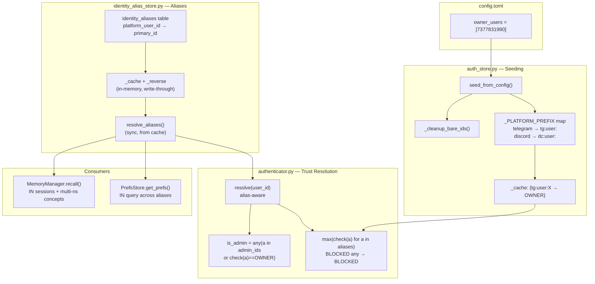
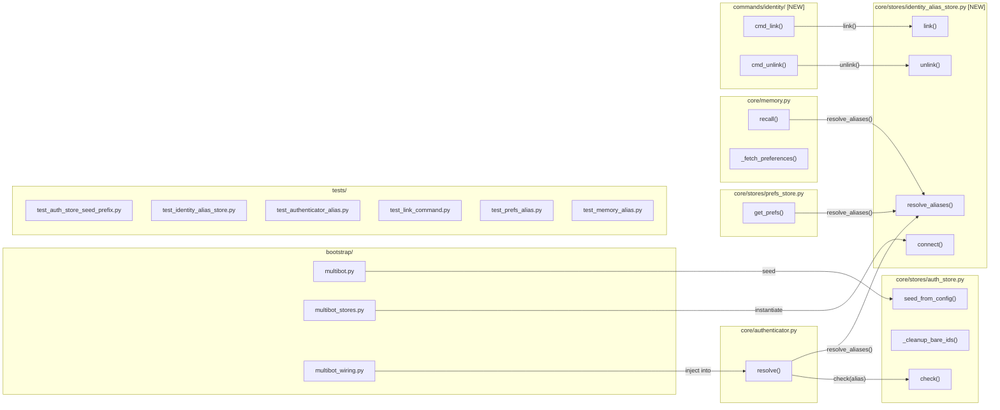

## Summary

Implement Shape 3 (prefixed keys + alias table) as a single PR: fix seed prefixing (P0), add `IdentityAliasStore` with `/link` command, make trust/prefs/memory alias-aware. 6 slices, 16 files (10 create, 6 modify), 3 parallel execution groups.

## Architecture

### Data Flow

### File x Function Map

## Bootstrap Context

From [analysis](../analyses/472-unified-identity-layer-analysis.mdx): Shape 3 selected over Shape 2 (internal UUID — too large) and Shape 1 (prefix-only — insufficient). Key architectural decisions: flat N:1 alias table (no cycles), sync `resolve_aliases()` via cache warm (matches `AuthStore.check()` contract), BLOCKED-any semantics for trust cascade.

Reference patterns:
- Store: `auth_store.py` (SqliteStore, sync cache reads, async writes)
- Command plugin: `commands/pairing/` (plugin.toml + handlers.py)
- Test fixtures: `tests/core/conftest.py` (make_auth_store, pytest.fixture async)

## Agents

| Agent | Task count | Files |
|-------|-----------|-------|
| backend-dev (auth) | 8 | auth_store.py, identity_alias_store.py, authenticator.py, multibot_stores.py, multibot.py, multibot_wiring.py, stores/__init__.py |
| backend-dev (consumers) | 4 | prefs_store.py, memory.py |
| backend-dev (commands) | 3 | commands/identity/plugin.toml, commands/identity/handlers.py |
| tester | 12 | test_auth_store_seed_prefix.py, test_identity_alias_store.py, test_authenticator_alias.py, test_link_command.py, test_prefs_alias.py, test_memory_alias.py |

## Consistency Report

- Criteria covered: 28/28
- Uncovered criteria: none
- Tasks without spec backing: none
- Gold plating exemptions applied: 2 (bootstrap wiring, __init__.py re-export)

## Micro-Tasks

### Slice V1: Seed prefix fix + cleanup

#### Task 1: Add _PLATFORM_PREFIX map and prefix IDs in seed_from_config [P] → backend-dev (auth)
- **File:** `src/lyra/core/stores/auth_store.py`
- **Snippet:** `_PLATFORM_PREFIX = {"telegram": "tg:user:", "discord": "dc:user:"}` — in `seed_from_config()`, replace `str(uid)` with `f"{_PLATFORM_PREFIX[section]}{uid}"`
- **Verify:** `grep -q '_PLATFORM_PREFIX' src/lyra/core/stores/auth_store.py` (ready)
- **Expected:** Map exists and seed uses it
- **Time:** 3 min | **Difficulty:** 1
- **Traces:** SC-1 (U1→S1) | **Phase:** GREEN

#### Task 2: Add _cleanup_bare_ids in AuthStore.connect [P] → backend-dev (auth)
- **File:** `src/lyra/core/stores/auth_store.py`
- **Snippet:** `async def _cleanup_bare_ids(self)` — `DELETE FROM grants WHERE identity_key NOT LIKE '%:%'` — called from `connect()` after `_warm_cache()`
- **Verify:** `grep -q '_cleanup_bare_ids' src/lyra/core/stores/auth_store.py` (ready)
- **Expected:** Method exists and is called from connect()
- **Time:** 3 min | **Difficulty:** 1
- **Traces:** SC-2 (U1→S1) | **Phase:** GREEN

#### Task 3: Write seed prefix + cleanup tests → tester
- **File:** `tests/core/test_auth_store_seed_prefix.py`
- **Snippet:** `class TestSeedPrefix` — test bare ID → prefixed, test cleanup removes bare rows, test re-seed is idempotent, test resolve returns OWNER after seed
- **Verify:** `python -m pytest tests/core/test_auth_store_seed_prefix.py -v` (deferred)
- **Expected:** All tests pass
- **Time:** 8 min | **Difficulty:** 2
- **Traces:** SC-1, SC-2, SC-3 | **Phase:** RED

#### RED-GATE: RED complete V1 → tester
- **Verify:** All V1 test tasks pass
- **Phase:** RED-GATE

### Slice V2: IdentityAliasStore

#### Task 4: Create IdentityAliasStore with schema + cache warm → backend-dev (auth)
- **File:** `src/lyra/core/stores/identity_alias_store.py` [NEW]
- **Snippet:** `class IdentityAliasStore(SqliteStore)` — `_CREATE_ALIASES` DDL, `connect()` warms `_cache: dict[str, str]` and `_reverse: dict[str, set[str]]`, `close()` tears down
- **Verify:** `python -c "from lyra.core.stores.identity_alias_store import IdentityAliasStore"` (ready)
- **Expected:** Import succeeds
- **Time:** 5 min | **Difficulty:** 2
- **Traces:** SC-4, SC-5, SC-7 (U2→S2) | **Phase:** GREEN

#### Task 5: Implement resolve_aliases, link, unlink → backend-dev (auth)
- **File:** `src/lyra/core/stores/identity_alias_store.py`
- **Snippet:** `def resolve_aliases(self, platform_id: str) -> frozenset[str]` — check `_cache` → check `_reverse` → singleton fallback. `async def link(primary_id, secondary_id)` — INSERT + write-through. `async def unlink(platform_id)` — DELETE + update both `_cache` and `_reverse`.
- **Verify:** `grep -q 'resolve_aliases' src/lyra/core/stores/identity_alias_store.py` (ready)
- **Expected:** All 3 methods exist
- **Time:** 8 min | **Difficulty:** 3
- **Traces:** SC-5, SC-6, SC-8, SC-9, SC-15 (U2→S2) | **Phase:** GREEN

#### Task 6: Add link_challenges table to IdentityAliasStore → backend-dev (auth)
- **File:** `src/lyra/core/stores/identity_alias_store.py`
- **Snippet:** `_CREATE_CHALLENGES` DDL — `link_challenges(code_hash, initiator_id, platform, created_at, expires_at)`. Challenge methods: `create_challenge()`, `validate_challenge()`, `cleanup_expired()`.
- **Verify:** `grep -q 'link_challenges' src/lyra/core/stores/identity_alias_store.py` (ready)
- **Expected:** Challenge table and methods exist
- **Time:** 5 min | **Difficulty:** 2
- **Traces:** SC-16, SC-19 (U4→S4) | **Phase:** GREEN

#### Task 7: Wire IdentityAliasStore into bootstrap → backend-dev (auth)
- **File:** `src/lyra/bootstrap/multibot_stores.py`, `src/lyra/bootstrap/multibot.py`, `src/lyra/bootstrap/multibot_wiring.py`, `src/lyra/core/stores/__init__.py`
- **Snippet:** Add `identity_alias: IdentityAliasStore` to `StoreBundle`. Instantiate in `open_stores()` with `vault_dir / "auth.db"`. Pass to `Authenticator.__init__()` via new `alias_store` param. Re-export from `stores/__init__.py`.
- **Verify:** `grep -q 'identity_alias' src/lyra/bootstrap/multibot_stores.py` (ready)
- **Expected:** Store wired into bootstrap lifecycle
- **Time:** 5 min | **Difficulty:** 2
- **Traces:** Exempt (bootstrap wiring) | **Phase:** GREEN

#### Task 8: Write IdentityAliasStore tests → tester
- **File:** `tests/core/test_identity_alias_store.py` [NEW]
- **Snippet:** `class TestIdentityAliasStore` — test connect/close, test link creates alias, test resolve_aliases from secondary, test resolve_aliases from primary (via _reverse), test unlink updates both caches, test resolve_aliases with no alias returns singleton, test flat N:1 (no transitive chains)
- **Verify:** `python -m pytest tests/core/test_identity_alias_store.py -v` (deferred)
- **Expected:** All tests pass
- **Time:** 10 min | **Difficulty:** 3
- **Traces:** SC-4, SC-5, SC-6, SC-7, SC-8, SC-9, SC-15 | **Phase:** RED

#### RED-GATE: RED complete V2 → tester
- **Verify:** All V2 test tasks pass
- **Phase:** RED-GATE

### Slice V3: Alias-aware trust resolution

#### Task 9: Add alias_store param to Authenticator and update resolve → backend-dev (auth)
- **File:** `src/lyra/core/authenticator.py`
- **Snippet:** Add `alias_store: IdentityAliasStore | None = None` to `__init__`. In `_resolve_trust()`: `aliases = self._alias_store.resolve_aliases(user_id) if self._alias_store else frozenset({user_id})`. Check all aliases: any BLOCKED → BLOCKED, else max. In `resolve()`: reuse `aliases` for `is_admin` check.
- **Verify:** `grep -q 'alias_store' src/lyra/core/authenticator.py` (ready)
- **Expected:** Authenticator accepts and uses alias_store
- **Time:** 8 min | **Difficulty:** 3
- **Traces:** SC-10, SC-11, SC-12, SC-14 (U3→S3) | **Phase:** GREEN

#### Task 10: Update from_bot_config and factory methods to pass alias_store → backend-dev (auth)
- **File:** `src/lyra/core/authenticator.py`, `src/lyra/bootstrap/multibot_wiring.py`
- **Snippet:** Add `alias_store` param to `from_config()`, `from_bot_config()`, `_build_from_section_cfg()`. Pass from `_build_bot_auths()` in wiring.
- **Verify:** `grep -q 'alias_store' src/lyra/bootstrap/multibot_wiring.py` (ready)
- **Expected:** alias_store flows through factory chain
- **Time:** 5 min | **Difficulty:** 2
- **Traces:** SC-10 (U3→S3) | **Phase:** GREEN

#### Task 11: Write alias-aware authenticator tests → tester
- **File:** `tests/core/test_authenticator_alias.py` [NEW]
- **Snippet:** `class TestAliasAwareResolve` — test max trust across aliases, test any-BLOCKED returns BLOCKED, test is_admin cascades across aliases, test resolve without alias_store (backward compat), test aliases resolved once (not twice)
- **Verify:** `python -m pytest tests/core/test_authenticator_alias.py -v` (deferred)
- **Expected:** All tests pass
- **Time:** 8 min | **Difficulty:** 3
- **Traces:** SC-10, SC-11, SC-12, SC-14 | **Phase:** RED

#### RED-GATE: RED complete V3 → tester
- **Verify:** All V3 test tasks pass
- **Phase:** RED-GATE

### Slice V4: /link command

#### Task 12: Create identity command plugin manifest → backend-dev (commands)
- **File:** `src/lyra/commands/identity/plugin.toml` [NEW]
- **Snippet:** `name = "identity"`, commands: `link` (handler: `cmd_link`), `unlink` (handler: `cmd_unlink`)
- **Verify:** `test -f src/lyra/commands/identity/plugin.toml && grep -q 'cmd_link' src/lyra/commands/identity/plugin.toml` (ready)
- **Expected:** Plugin manifest exists with both commands
- **Time:** 2 min | **Difficulty:** 1
- **Traces:** SC-16, SC-17, SC-18 (U4→S4) | **Phase:** GREEN

#### Task 13: Implement /link and /unlink handlers → backend-dev (commands)
- **File:** `src/lyra/commands/identity/handlers.py` [NEW]
- **Snippet:** `async def cmd_link(msg, pool, args)` — no args: `initiate()` (generate code, cleanup expired, store hash). With args: `complete()` (validate code, check not BLOCKED, create alias). `async def cmd_unlink(msg, pool, args)` — call `alias_store.unlink(msg.user_id)`.
- **Verify:** `python -c "from lyra.commands.identity.handlers import cmd_link, cmd_unlink"` (ready)
- **Expected:** Import succeeds
- **Time:** 10 min | **Difficulty:** 4
- **Traces:** SC-13, SC-16, SC-17, SC-18, SC-19 (U4→S4) | **Phase:** GREEN

#### Task 14: Create __init__.py for identity commands → backend-dev (commands)
- **File:** `src/lyra/commands/identity/__init__.py` [NEW]
- **Snippet:** Empty or minimal re-export
- **Verify:** `test -f src/lyra/commands/identity/__init__.py` (ready)
- **Expected:** Package exists
- **Time:** 1 min | **Difficulty:** 1
- **Traces:** Exempt (infra) | **Phase:** GREEN

#### Task 15: Write /link command tests → tester
- **File:** `tests/core/test_link_command.py` [NEW]
- **Snippet:** Test initiate generates code, test complete validates code + creates alias, test expired code rejected, test BLOCKED identity rejected, test /unlink removes alias, test stale challenge cleanup
- **Verify:** `python -m pytest tests/core/test_link_command.py -v` (deferred)
- **Expected:** All tests pass
- **Time:** 10 min | **Difficulty:** 4
- **Traces:** SC-13, SC-16, SC-17, SC-18, SC-19 | **Phase:** RED

#### RED-GATE: RED complete V4 → tester
- **Verify:** All V4 test tasks pass
- **Phase:** RED-GATE

### Slice V5: Alias-aware prefs

#### Task 16: Add alias_store to PrefsStore and update get_prefs [P] → backend-dev (consumers)
- **File:** `src/lyra/core/stores/prefs_store.py`
- **Snippet:** Add `_alias_store: IdentityAliasStore | None` field (set via `set_alias_store()` or `__init__`). In `get_prefs()`: resolve aliases → single `SELECT ... WHERE user_id IN (?, ...)` → merge non-default values → return `UserPrefs(user_id=requesting_id)`.
- **Verify:** `grep -q 'alias_store' src/lyra/core/stores/prefs_store.py` (ready)
- **Expected:** PrefsStore accepts and uses alias_store
- **Time:** 5 min | **Difficulty:** 2
- **Traces:** SC-20, SC-21 (U5→S5) | **Phase:** GREEN

#### Task 17: Write alias-aware prefs tests → tester
- **File:** `tests/core/test_prefs_alias.py` [NEW]
- **Snippet:** Test prefs visible across aliases (set on A, get from B after link), test set_pref writes to requesting ID only, test no alias returns own prefs, test UserPrefs.user_id is requesting ID
- **Verify:** `python -m pytest tests/core/test_prefs_alias.py -v` (deferred)
- **Expected:** All tests pass
- **Time:** 5 min | **Difficulty:** 2
- **Traces:** SC-20, SC-21 | **Phase:** RED

#### RED-GATE: RED complete V5 → tester
- **Verify:** All V5 test tasks pass
- **Phase:** RED-GATE

### Slice V6: Alias-aware memory recall

#### Task 18: Add alias_store to MemoryManager and update recall [P] → backend-dev (consumers)
- **File:** `src/lyra/core/memory.py`
- **Snippet:** Add `_alias_store` field. In `recall()`: resolve aliases → session query with `IN (?, ...)` dynamic placeholders → concept search per alias namespace merged in Python. In `_fetch_preferences()`: filter `metadata.user_id in aliases` (Python-level, no SQL change).
- **Verify:** `grep -q 'alias_store' src/lyra/core/memory.py` (ready)
- **Expected:** MemoryManager accepts and uses alias_store
- **Time:** 8 min | **Difficulty:** 3
- **Traces:** SC-22, SC-23, SC-24, SC-25 (U6→S6) | **Phase:** GREEN

#### Task 19: Wire alias_store into MemoryManager + PrefsStore in bootstrap → backend-dev (auth)
- **File:** `src/lyra/bootstrap/multibot.py`, `src/lyra/bootstrap/multibot_stores.py`
- **Snippet:** After `open_stores()`, pass `stores.identity_alias` to `MemoryManager` and `PrefsStore` via setter or constructor.
- **Verify:** `grep -q 'identity_alias' src/lyra/bootstrap/multibot.py` (ready)
- **Expected:** alias_store injected into consumers during bootstrap
- **Time:** 3 min | **Difficulty:** 2
- **Traces:** Exempt (bootstrap wiring) | **Phase:** GREEN

#### Task 20: Write alias-aware memory tests → tester
- **File:** `tests/core/test_memory_alias.py` [NEW]
- **Snippet:** Test session recall covers all aliases (write as user A, recall as linked user B), test concept recall across alias namespaces, test _fetch_preferences filters across aliases, test memory writes unchanged (snap.user_id)
- **Verify:** `python -m pytest tests/core/test_memory_alias.py -v` (deferred)
- **Expected:** All tests pass
- **Time:** 8 min | **Difficulty:** 3
- **Traces:** SC-22, SC-23, SC-24, SC-25 | **Phase:** RED

#### RED-GATE: RED complete V6 → tester
- **Verify:** All V6 test tasks pass
- **Phase:** RED-GATE

### Integration

#### Task 21: Run full test suite → tester
- **File:** N/A
- **Verify:** `python -m pytest tests/ -x -q` (ready)
- **Expected:** All existing + new tests pass, 0 failures
- **Time:** 5 min | **Difficulty:** 1
- **Traces:** SC-26, SC-27 | **Phase:** GREEN
