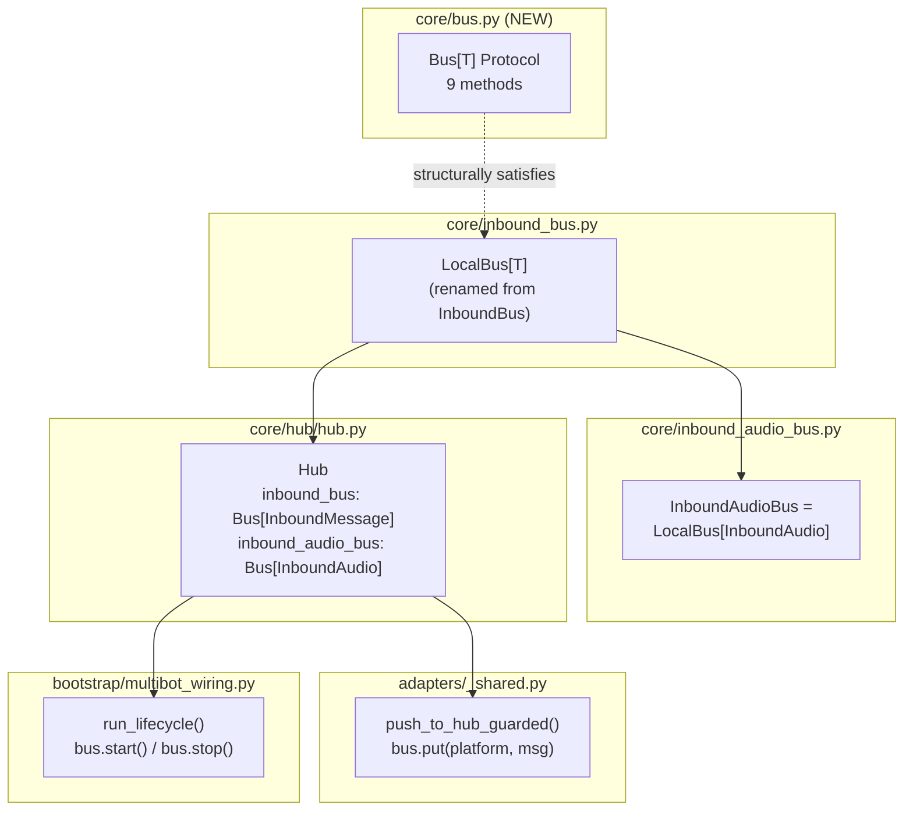
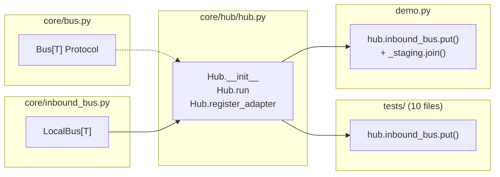

## Summary

Extract a `Bus[T]` Protocol from the concrete `InboundBus` class, rename to `LocalBus`, type Hub to the Protocol, and migrate all 21 `hub.bus` call sites to use the proper interface. Pure refactor — zero behavioral change.

## Architecture





## Bootstrap Context

**Reference pattern:** `PoolContext` in `core/pool/pool.py:30-54` — a structural Protocol decoupling Pool from Hub. Same approach: Protocol defined alongside the consumer, concrete class satisfies structurally without inheriting.

**Key difference:** `Bus[T]` is generic (first generic Protocol in the codebase). `PoolContext` is non-generic. Pyright handles `Protocol[T]` correctly for Python 3.12+.

## Agents

| Agent | Tasks | Files |
|-------|-------|-------|
| backend-dev | 13 | bus.py, inbound_bus.py, inbound_audio_bus.py, hub.py, __init__.py, multibot_wiring.py, 10 test files, demo.py |
| tester | 2 | Pyright verification, pytest suite |

## Consistency Report

| Metric | Value |
|--------|-------|
| Success criteria | 13 |
| Micro-tasks | 15 |
| Covered criteria | 13/13 |
| Uncovered | 0 |
| Untraced tasks | 0 |

## Micro-Tasks

### Slice 1: Bus Protocol + LocalBus rename

#### V1-T1: Create `Bus[T]` Protocol [RED]

- **Description:** Create `src/lyra/core/bus.py` with `Bus[T]` Protocol (9 methods). Follow `PoolContext` pattern from `pool/pool.py`.
- **File:** `src/lyra/core/bus.py` (NEW)
- **Code snippet:**
```python
from __future__ import annotations
from typing import Protocol, TypeVar
from .message import Platform

T = TypeVar("T")

class Bus(Protocol[T]):
    def register(self, platform: Platform, maxsize: int = 100) -> None: ...
    def put(self, platform: Platform, item: T) -> None: ...
    async def get(self) -> T: ...
    def task_done(self) -> None: ...
    async def start(self) -> None: ...
    async def stop(self) -> None: ...
    def qsize(self, platform: Platform) -> int: ...
    def staging_qsize(self) -> int: ...
    def registered_platforms(self) -> frozenset[Platform]: ...
```
- **Verify:** `python -c "from lyra.core.bus import Bus; print(Bus)"`
- **Expected output:** `<class 'lyra.core.bus.Bus'>`
- **Time:** 3 min
- **Agent:** backend-dev
- **Spec trace:** SC-1, SC-2
- **Difficulty:** 1

#### V1-T2: Rename InboundBus → LocalBus [RED]

- **Description:** In `src/lyra/core/inbound_bus.py`, rename class `InboundBus` → `LocalBus`. Update module docstring. Keep backward-compat alias `InboundBus = LocalBus` temporarily for import sites not yet migrated.
- **File:** `src/lyra/core/inbound_bus.py`
- **Verify:** `python -c "from lyra.core.inbound_bus import LocalBus; print(LocalBus)"`
- **Expected output:** `<class 'lyra.core.inbound_bus.LocalBus'>`
- **Time:** 3 min
- **Agent:** backend-dev
- **Spec trace:** SC-3
- **Difficulty:** 1

#### V1-T3: Update inbound_audio_bus.py import [RED]

- **Description:** Change `from .inbound_bus import InboundBus` → `from .inbound_bus import LocalBus`. Update alias: `InboundAudioBus = LocalBus[InboundAudio]`.
- **File:** `src/lyra/core/inbound_audio_bus.py`
- **Verify:** `python -c "from lyra.core.inbound_audio_bus import InboundAudioBus; print(InboundAudioBus)"`
- **Expected output:** `lyra.core.inbound_bus.LocalBus[lyra.core.message.InboundAudio]`
- **Time:** 2 min
- **Agent:** backend-dev
- **Spec trace:** SC-4
- **Difficulty:** 1

#### V1-T4: Add re-exports to `core/__init__.py` [RED]

- **Description:** Add `Bus` and `LocalBus` to `core/__init__.py` imports and `__all__`.
- **File:** `src/lyra/core/__init__.py`
- **Verify:** `python -c "from lyra.core import Bus, LocalBus"`
- **Expected output:** (no error)
- **Time:** 2 min
- **Agent:** backend-dev
- **Spec trace:** SC-5
- **Difficulty:** 1

#### V1-GATE: Pyright clean on Slice 1 [RED-GATE]

- **Verify:** `cd /home/mickael/projects/lyra && uv run pyright src/lyra/core/bus.py src/lyra/core/inbound_bus.py src/lyra/core/inbound_audio_bus.py`
- **Expected output:** 0 errors
- **Time:** 2 min
- **Agent:** tester
- **Spec trace:** SC-2, SC-5

---

### Slice 2: Hub types to Bus Protocol

#### V2-T1: Update Hub type annotations + imports [RED]

- **Description:** In `hub/hub.py`: import `Bus` from `core.bus`, import `LocalBus` from `core.inbound_bus`. Change `self.inbound_bus: InboundBus[InboundMessage]` → `self.inbound_bus: Bus[InboundMessage]` (annotation only — constructor still creates `LocalBus`). Same for `inbound_audio_bus`. Remove old `InboundBus` import if no longer needed.
- **File:** `src/lyra/core/hub/hub.py`
- **Code snippet:**
```python
from ..bus import Bus
from ..inbound_bus import LocalBus
# ...
self.inbound_bus: Bus[InboundMessage] = LocalBus(...)
self.inbound_audio_bus: Bus[InboundAudio] = LocalBus(...)
```
- **Verify:** `uv run pyright src/lyra/core/hub/hub.py`
- **Expected output:** 0 errors
- **Time:** 5 min
- **Agent:** backend-dev
- **Spec trace:** SC-6
- **Difficulty:** 2

#### V2-T2: Update multibot_wiring.py imports [RED]

- **Description:** Update `from lyra.core.inbound_bus import InboundBus` → `from lyra.core.inbound_bus import LocalBus` (if direct import exists). Check `bootstrap/health.py` for similar.
- **Files:** `src/lyra/bootstrap/multibot_wiring.py`, `src/lyra/bootstrap/health.py`
- **Verify:** `uv run pyright src/lyra/bootstrap/multibot_wiring.py src/lyra/bootstrap/health.py`
- **Expected output:** 0 errors
- **Time:** 3 min
- **Agent:** backend-dev
- **Spec trace:** SC-6
- **Difficulty:** 1

#### V2-T3: Update adapters/_shared.py import [RED]

- **Description:** Update `from lyra.core.inbound_bus import InboundBus` → `from lyra.core.bus import Bus` (type annotation) or `from lyra.core.inbound_bus import LocalBus`. Check if the import is runtime or TYPE_CHECKING.
- **File:** `src/lyra/adapters/_shared.py`
- **Verify:** `uv run pyright src/lyra/adapters/_shared.py`
- **Expected output:** 0 errors
- **Time:** 3 min
- **Agent:** backend-dev
- **Spec trace:** SC-6
- **Difficulty:** 1

#### V2-GATE: All tests still pass [RED-GATE]

- **Verify:** `cd /home/mickael/projects/lyra && uv run pytest tests/ -x -q 2>&1 | tail -5`
- **Expected output:** `X passed` with 0 failures
- **Time:** 3 min
- **Agent:** tester
- **Spec trace:** SC-12

---

### Slice 3: Remove hub.bus + migrate tests

#### V3-T1: Remove Hub.bus property [RED]

- **Description:** Delete the `bus` property from `Hub` class (lines 128-130 in hub.py). This will cause test failures — expected, fixed in subsequent tasks.
- **File:** `src/lyra/core/hub/hub.py`
- **Verify:** `grep -n "def bus" src/lyra/core/hub/hub.py` returns nothing
- **Expected output:** (no output)
- **Time:** 2 min
- **Agent:** backend-dev
- **Spec trace:** SC-7
- **Difficulty:** 1

#### V3-T2: Migrate test hub.bus.put() calls (10 files, 14 sites) [GREEN]

- **Description:** In each test file, replace `hub.bus.put(msg)` (or `await hub.bus.put(msg)`) with `hub.inbound_bus.put(Platform.TELEGRAM, msg)` (sync, no await). The platform should match the message's platform or use `Platform.TELEGRAM` as default for test fixtures. Drop `await` — `put()` is synchronous.
- **Files:** `tests/core/test_hub_routing.py` (3), `tests/core/test_hub_circuit_streaming.py` (4), `tests/core/test_hub_circuit_fast_fail.py` (2), `tests/core/test_hub_tts_dispatch.py` (1), `tests/core/test_command_router_detection.py` (2), `tests/core/test_command_router_special.py` (1), `tests/core/test_hub_streaming.py` (1), `tests/core/test_message_pipeline_guards.py` (1), `tests/test_health_endpoint_status.py` (1)
- **Verify:** `grep -rn "hub\.bus\." tests/ | grep -v "# " | wc -l` returns 0 (excluding comments)
- **Expected output:** `0`
- **Time:** 8 min
- **Agent:** backend-dev
- **Spec trace:** SC-8
- **Difficulty:** 2

#### V3-T3: Migrate hub.bus.empty() assertions (3 sites) [GREEN]

- **Description:** In `test_hub_routing.py`, replace `hub.bus.empty()` with `hub.inbound_bus.staging_qsize() == 0` at lines 121, 175, 213.
- **File:** `tests/core/test_hub_routing.py`
- **Verify:** `grep -n "hub\.bus\.empty" tests/core/test_hub_routing.py` returns nothing
- **Expected output:** (no output)
- **Time:** 3 min
- **Agent:** backend-dev
- **Spec trace:** SC-9
- **Difficulty:** 1

#### V3-T4: Remove test_hub_init.py isinstance assertion [GREEN]

- **Description:** Remove or replace `assert isinstance(hub.bus, asyncio.Queue)` at line 99. Replace with assertion that `hub.inbound_bus` satisfies the Bus Protocol (e.g., `assert hasattr(hub.inbound_bus, 'put')`), or delete the test if it only tests the removed property.
- **File:** `tests/core/test_hub_init.py`
- **Verify:** `grep -n "hub\.bus" tests/core/test_hub_init.py` returns nothing (excluding comments)
- **Expected output:** (no output)
- **Time:** 3 min
- **Agent:** backend-dev
- **Spec trace:** SC-10
- **Difficulty:** 1

#### V3-T5: Migrate demo.py [GREEN]

- **Description:** Replace `hub.bus.put(msg)` with `hub.inbound_bus.put(Platform.TELEGRAM, msg)`. Replace `hub.bus.join()` with `await hub.inbound_bus._staging.join()` (internal access acceptable in demo).
- **File:** `demo.py`
- **Verify:** `grep -n "hub\.bus\." demo.py` returns nothing
- **Expected output:** (no output)
- **Time:** 3 min
- **Agent:** backend-dev
- **Spec trace:** SC-11
- **Difficulty:** 1

#### V3-T6: Remove backward-compat alias [REFACTOR]

- **Description:** Remove `InboundBus = LocalBus` alias from `inbound_bus.py` if all import sites have been migrated. Grep to verify no remaining references.
- **File:** `src/lyra/core/inbound_bus.py`
- **Verify:** `grep -rn "InboundBus" src/lyra/ --include="*.py" | grep -v "# " | grep -v "__pycache__"` returns 0 hits (or only the backward compat comment in inbound_bus.py docstring)
- **Expected output:** 0 remaining references
- **Time:** 3 min
- **Agent:** backend-dev
- **Spec trace:** SC-3
- **Difficulty:** 1

#### V3-GATE: Full test suite + Pyright [RED-GATE]

- **Verify:** `cd /home/mickael/projects/lyra && uv run pytest tests/ -x -q 2>&1 | tail -5 && uv run pyright src/lyra/core/bus.py src/lyra/core/inbound_bus.py src/lyra/core/hub/hub.py`
- **Expected output:** All tests pass, 0 Pyright errors
- **Time:** 5 min
- **Agent:** tester
- **Spec trace:** SC-12, SC-13
