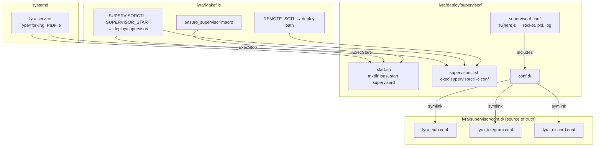
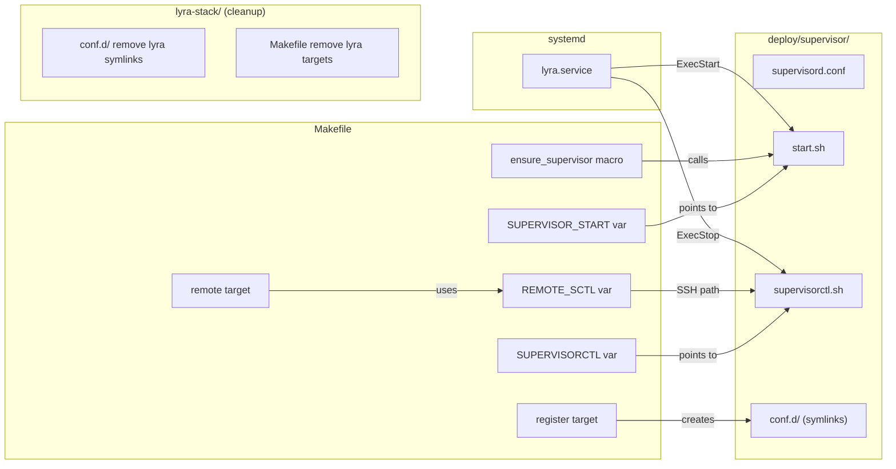

## Summary

Split the single supervisord instance into two: lyra owns its 3 programs (hub, telegram, discord) via `lyra/deploy/supervisor/`, while lyra-stack retains voicecli, forge, and idna. Migrate bootstrap files, rewire Makefile, create `lyra.service` systemd unit, and clean up lyra-stack.

## Architecture

### Data Flow

### File x Function Map

## Agents

| Agent | Task count | Files |
|-------|-----------|-------|
| devops | 10 | deploy/supervisor/*, Makefile, lyra.service, lyra-stack/conf.d, lyra-stack/Makefile |
| doc-writer | 2 | CLAUDE.md (lyra), CLAUDE.md (lyra-stack), CLAUDE.md (projects) |

## Consistency Report

- Criteria covered: 12/12
- Uncovered criteria: none
- Tasks without spec backing: none
- Gold plating exemptions applied: 0

## Micro-Tasks

### Slice V1: Bootstrap files in lyra

#### Task 1: Create supervisord.conf [P] → devops
- **File:** `deploy/supervisor/supervisord.conf`
- **Snippet:** Copy from `lyra-stack/supervisord.conf`, change logfile path from `lyra-stack` to `lyra` state dir: `logfile=%(ENV_HOME)s/.local/state/lyra/logs/supervisord.log`
- **Verify:** `test -f deploy/supervisor/supervisord.conf && grep -q 'lyra/logs/supervisord.log' deploy/supervisor/supervisord.conf` (ready)
- **Expected:** File exists with lyra log path
- **Time:** 3 min | **Difficulty:** 1
- **Traces:** SC-1, S1 | **Phase:** GREEN

#### Task 2: Create start.sh [P] → devops
- **File:** `deploy/supervisor/start.sh`
- **Snippet:** Copy from `lyra-stack/scripts/start.sh`. Change `mkdir -p` to only create `$HOME/.local/state/lyra/logs` (remove voicecli + lyra-stack dirs). Update comment from "machine-wide" to "lyra supervisord".
- **Verify:** `test -x deploy/supervisor/start.sh && grep -q '.local/state/lyra/logs' deploy/supervisor/start.sh` (ready)
- **Expected:** Executable script creating lyra log dir only
- **Time:** 3 min | **Difficulty:** 1
- **Traces:** SC-2, N2 | **Phase:** GREEN

#### Task 3: Create supervisorctl.sh [P] → devops
- **File:** `deploy/supervisor/supervisorctl.sh`
- **Snippet:** Copy from `lyra-stack/scripts/supervisorctl.sh`. No changes needed — uses `SCRIPT_DIR`/`SUPERVISOR_DIR` relative resolution which auto-adapts to new location.
- **Verify:** `test -x deploy/supervisor/supervisorctl.sh && grep -q 'SUPERVISOR_DIR' deploy/supervisor/supervisorctl.sh` (ready)
- **Expected:** Executable script with relative path resolution
- **Time:** 2 min | **Difficulty:** 1
- **Traces:** SC-3, N3 | **Phase:** GREEN

#### Task 4: Create conf.d/ with lyra symlinks → devops
- **File:** `deploy/supervisor/conf.d/`
- **Snippet:** Create directory. Add 3 symlinks: `lyra_hub.conf → ../../supervisor/conf.d/lyra_hub.conf`, same for telegram and discord. Relative symlinks (both dirs are in the lyra repo).
- **Verify:** `test -L deploy/supervisor/conf.d/lyra_hub.conf && test -L deploy/supervisor/conf.d/lyra_telegram.conf && test -L deploy/supervisor/conf.d/lyra_discord.conf` (ready)
- **Expected:** 3 symlinks pointing to supervisor/conf.d/ sources
- **Time:** 3 min | **Difficulty:** 1
- **Traces:** SC-4, N4→S2 | **Phase:** GREEN

### Slice V2: Lyra Makefile self-contained

#### Task 5: Update Makefile supervisor vars → devops
- **File:** `Makefile`
- **Snippet:** Replace lines 15-18: `SUPERVISORCTL := deploy/supervisor/supervisorctl.sh`, `SUPERVISOR_START := deploy/supervisor/start.sh`, `HUB_PID := deploy/supervisor/supervisord.pid`. Remove `LYRA_STACK_DIR` dependency from supervisor vars (keep it for any remaining refs).
- **Verify:** `grep -q 'deploy/supervisor/supervisorctl.sh' Makefile && grep -q 'deploy/supervisor/start.sh' Makefile` (ready)
- **Expected:** Makefile vars point to deploy/supervisor/
- **Time:** 5 min | **Difficulty:** 2
- **Traces:** SC-5, SC-6, N1 | **Phase:** GREEN

#### Task 6: Update ensure_supervisor macro → devops
- **File:** `Makefile`
- **Snippet:** Replace `ensure_hub` macro: remove LYRA_STACK_DIR existence check (no longer needed for supervisor). Just check PID + call start.sh. Rename to `ensure_supervisor` for clarity.
- **Verify:** `grep -q 'ensure_supervisor' Makefile` (ready)
- **Expected:** Macro checks local PID file, no lyra-stack dependency
- **Time:** 5 min | **Difficulty:** 2
- **Traces:** SC-5, N1→N2 | **Phase:** GREEN

#### Task 7: Update register target → devops
- **File:** `Makefile`
- **Snippet:** Replace `register` target: symlink lyra conf.d files into `deploy/supervisor/conf.d/` instead of `$(LYRA_STACK_DIR)/conf.d/`. Remove LYRA_STACK_DIR check. Keep monitoring timer installation.
- **Verify:** `grep -q 'deploy/supervisor/conf.d' Makefile` (ready)
- **Expected:** Register creates symlinks in local deploy/supervisor/conf.d/
- **Time:** 5 min | **Difficulty:** 2
- **Traces:** SC-4, U3→N4 | **Phase:** GREEN

#### Task 8: Update REMOTE_SCTL + remote target → devops
- **File:** `Makefile`
- **Snippet:** Change `REMOTE_SCTL := ~/projects/lyra/deploy/supervisor/supervisorctl.sh`. Remove tts/stt from remote target's service cases (those stay in lyra-stack). Default PROGS becomes lyra programs only.
- **Verify:** `grep -q 'lyra/deploy/supervisor/supervisorctl.sh' Makefile` (ready)
- **Expected:** Remote commands target lyra's supervisorctl path, lyra services only
- **Time:** 5 min | **Difficulty:** 2
- **Traces:** SC-7, N5→N3 | **Phase:** GREEN

### Slice V3: Systemd unit + cutover

#### Task 9: Create lyra.service → devops
- **File:** `deploy/lyra.service`
- **Snippet:** New systemd unit based on `lyra-stack.service`. Update: `Description=Lyra supervisord (hub, telegram, discord)`, `PIDFile=%h/projects/lyra/deploy/supervisor/supervisord.pid`, `ExecStart=%h/projects/lyra/deploy/supervisor/start.sh`, `ExecStop=%h/.local/bin/supervisorctl -c %h/projects/lyra/deploy/supervisor/supervisord.conf shutdown`.
- **Verify:** `test -f deploy/lyra.service && grep -q 'lyra/deploy/supervisor' deploy/lyra.service` (ready)
- **Expected:** Unit file with all paths pointing to lyra/deploy/supervisor/
- **Time:** 5 min | **Difficulty:** 2
- **Traces:** SC-8, S3 | **Phase:** GREEN

#### Task 10: Update register target to install lyra.service → devops
- **File:** `Makefile`
- **Snippet:** Add to `register` target: `cp deploy/lyra.service $(SYSTEMD_USER_DIR)/lyra.service` + `systemctl --user daemon-reload` + `systemctl --user enable lyra.service`.
- **Verify:** `grep -q 'lyra.service' Makefile` (ready)
- **Expected:** Register installs lyra.service alongside monitor timer
- **Time:** 3 min | **Difficulty:** 2
- **Traces:** SC-8, U5 | **Phase:** GREEN

### Slice V4: lyra-stack cleanup + docs

#### Task 11: Remove lyra symlinks from lyra-stack conf.d → devops
- **File:** `~/projects/lyra-stack/conf.d/` (runtime, not committed — symlinks are not in git)
- **Snippet:** This is a manual cutover step (part of migration procedure). Remove: `lyra_hub.conf`, `lyra_telegram.conf`, `lyra_discord.conf` symlinks. Also remove lyra-specific targets (`lyra`, `telegram`, `discord`) from lyra-stack Makefile.
- **Verify:** `test ! -L ~/projects/lyra-stack/conf.d/lyra_hub.conf` (manual)
- **Expected:** lyra-stack conf.d contains only voicecli + forge + idna
- **Time:** 8 min | **Difficulty:** 3
- **Traces:** SC-9, SC-10, SC-11 | **Phase:** GREEN

#### Task 12: Update docs for two-instance model [P] → doc-writer
- **File:** `CLAUDE.md`, `~/projects/lyra-stack/CLAUDE.md`, `~/projects/CLAUDE.md`
- **Snippet:** Replace all `lyra-stack.service` references for lyra programs with `lyra.service`. Update supervisor pattern description to reflect two-instance model. Update `systemctl` command examples. Update lyra-stack CLAUDE.md services table (remove lyra programs). Update projects/CLAUDE.md supervisor section.
- **Verify:** `grep -q 'lyra.service' CLAUDE.md` (ready)
- **Expected:** All docs reference lyra.service for lyra programs, lyra-stack.service for voicecli/forge/idna
- **Time:** 10 min | **Difficulty:** 2
- **Traces:** SC-12 | **Phase:** GREEN
