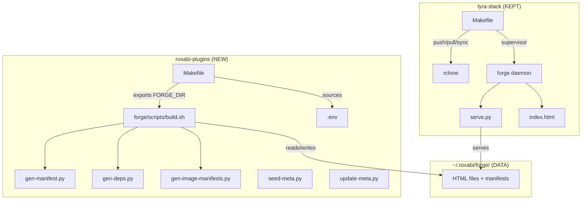

## Summary

Move 6 build/deploy scripts from `lyra-stack/forge/` to `roxabi-plugins/forge/scripts/`, create a Makefile in roxabi-plugins with forge targets, fix `__file__` fallbacks, and update lyra-stack Makefile to point users to the new location.

## Architecture

## Agents

| Agent | Tasks | Files |
|-------|-------|-------|
| devops | 5 | roxabi-plugins/forge/scripts/*, roxabi-plugins/Makefile, lyra-stack/Makefile, lyra-stack/forge/*.py |

## Micro-Tasks

### Task 1 — Copy 6 scripts to roxabi-plugins [P]
- **Files:** `roxabi-plugins/forge/scripts/{build.sh,gen-manifest.py,gen-deps.py,gen-image-manifests.py,seed-meta.py,update-meta.py}`
- **Action:** `cp lyra-stack/forge/{build.sh,gen-manifest.py,gen-deps.py,gen-image-manifests.py,seed-meta.py,update-meta.py} roxabi-plugins/forge/scripts/`
- **Verify:** `ls roxabi-plugins/forge/scripts/*.{sh,py} | wc -l` → 6
- **Agent:** devops
- **Trace:** SC-1 through SC-6

### Task 2 — Fix __file__ fallbacks [P]
- **Files:** `roxabi-plugins/forge/scripts/gen-manifest.py`, `seed-meta.py`, `update-meta.py`
- **Action:** Change `Path(__file__).parent` fallback to `Path.home() / '.roxabi' / 'forge'` (matches gen-deps.py and gen-image-manifests.py pattern)
- **Verify:** `grep -c '__file__' roxabi-plugins/forge/scripts/*.py` → 0
- **Agent:** devops
- **Trace:** SC-11, SC-12

### Task 3 — Create roxabi-plugins/Makefile
- **Files:** `roxabi-plugins/Makefile`
- **Action:** Create Makefile with `FORGE_DIR` export, `.env` sourcing, targets: `forge-build`, `forge-deploy`, `forge-deploy-prod`, `forge-du`
- **Verify:** `make -n forge-build` succeeds (dry run)
- **Deps:** Task 1
- **Agent:** devops
- **Trace:** SC-7, SC-12

### Task 4 — Update lyra-stack Makefile
- **Files:** `lyra-stack/Makefile`
- **Action:** Replace `build`/`deploy`/`deploy-prod` sub-targets with error messages: `@echo "Moved to roxabi-plugins. Run: cd ~/projects/roxabi-plugins && make forge-build"; exit 1`
- **Verify:** `cd lyra-stack && make forge build 2>&1 | grep -q "roxabi-plugins"`
- **Deps:** Task 3
- **Agent:** devops
- **Trace:** SC-9

### Task 5 — Remove moved scripts from lyra-stack
- **Files:** `lyra-stack/forge/{build.sh,gen-manifest.py,gen-deps.py,gen-image-manifests.py,seed-meta.py,update-meta.py}`
- **Action:** `rm` the 6 files. Keep: `serve.py`, `index.html`, `conf.d/`, `scripts/`, `gen-deps.md`
- **Verify:** `ls lyra-stack/forge/` shows only kept files
- **Deps:** Task 4
- **Agent:** devops
- **Trace:** SC-10

## Consistency Report

| Criterion | Task | Status |
|-----------|------|--------|
| SC-1 build.sh | T1 | covered |
| SC-2 gen-manifest.py | T1 | covered |
| SC-3 gen-deps.py | T1 | covered |
| SC-4 gen-image-manifests.py | T1 | covered |
| SC-5 seed-meta.py | T1 | covered |
| SC-6 update-meta.py | T1 | covered |
| SC-7 Makefile targets | T3 | covered |
| SC-8 .env credentials | manual | exempt (manual copy) |
| SC-9 lyra-stack migration msg | T4 | covered |
| SC-10 lyra-stack cleanup | T5 | covered |
| SC-11 SCRIPT_DIR resolution | T1+T2 | covered |
| SC-12 FORGE_DIR explicit | T2+T3 | covered |
| SC-13 Drive sync unchanged | T4 | covered (push/pull/sync untouched) |

**Coverage: 12/13 covered, 1 exempt (SC-8 manual credential copy)**
