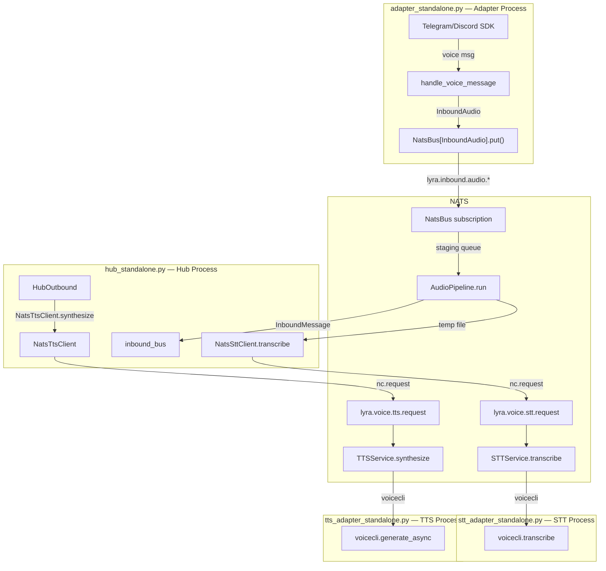
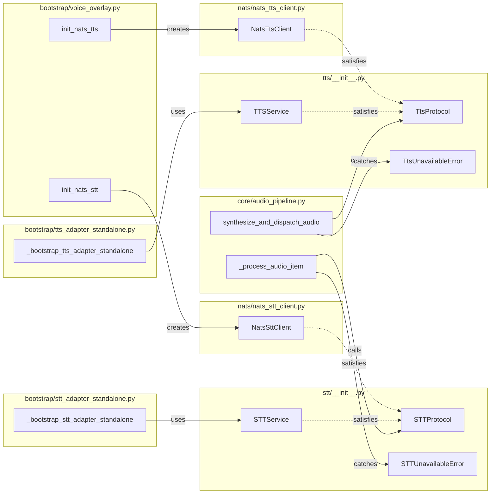

## Summary

Decouple STT/TTS voice processing from the hub into independent NATS adapter processes.
Five slices: (1) wire InboundAudio over NATS, (2) define protocol interfaces + NATS
clients, (3) build adapter processes, (4) cut over hub + graceful degradation, (5) infra.
Slices 1–3 are parallel; Slice 4 integrates them; Slice 5 adds operational tooling.

## Architecture

### Data Flow



### File x Function Map



## Bootstrap Context

From analysis: Shape 1 (NATS Request-Reply Adapters) selected. Three critical gaps identified
and resolved in spec: (1) agents hold concrete STTService refs — changed to protocol types,
(2) audio never reaches hub in 3-process mode — C5 included as Slice 1, (3) AgentTTSConfig
serialization — flatten fields in TtsRequest. Reference patterns: `adapter_standalone.py`
(bootstrap), `nats_channel_proxy.py` (NATS dispatch), `lyra_telegram.conf` (supervisor config),
`run_adapter.sh` (launch script).

## Agents

| Agent | Task count | Files |
|-------|-----------|-------|
| backend-dev | 14 | `stt/__init__.py`, `tts/__init__.py`, `nats_stt_client.py`, `nats_tts_client.py`, `stt_adapter_standalone.py`, `tts_adapter_standalone.py`, `voice_overlay.py`, `hub_standalone.py`, `agent_factory.py`, `audio_pipeline.py`, `hub.py`, `hub_outbound.py`, `cli.py`, `messages.toml` |
| backend-dev (agents) | 2 | `anthropic_agent.py`, `simple_agent.py` |
| devops | 4 | `lyra_stt.conf`, `lyra_tts.conf`, `run_stt_adapter.sh`, `run_tts_adapter.sh`, `Makefile` |
| tester | 5 | test files (RED tasks + RED-GATE sentinels) |

## Consistency Report

- Criteria covered: 16/16
- Uncovered criteria: none
- Tasks without spec backing: none
- Gold plating exemptions applied: 0

## Micro-Tasks

### Slice V1: InboundAudio over NATS (C5)

#### Task 1.1: Wire adapter audio bus as NatsBus [P] → backend-dev
- **File:** `src/lyra/bootstrap/adapter_standalone.py`
- **Snippet:** Change Telegram `LocalBus(name="inbound-audio")` (line 106) → `NatsBus(nc=nc, bot_id=bot_id, item_type=InboundAudio)` + `.register(platform_enum)` + `await .start()`. Same for Discord (line 233).
- **Verify:** `grep -q 'NatsBus.*InboundAudio' src/lyra/bootstrap/adapter_standalone.py` (ready)
- **Expected:** Both Telegram and Discord audio buses use NatsBus
- **Time:** 5 min | **Difficulty:** 2
- **Traces:** N1, N2, SC-2 | **Phase:** GREEN

#### Task 1.2: Wire hub audio bus as NatsBus [P] → backend-dev
- **File:** `src/lyra/bootstrap/hub_standalone.py`
- **Snippet:** Change `inbound_audio_bus: LocalBus[InboundAudio] = LocalBus(name="inbound-audio")` (line 163) → `NatsBus(nc=nc, bot_id="hub", item_type=InboundAudio)`. Register all platforms from tg/dc bot configs. Import `NatsBus` from `lyra.nats.nats_bus`.
- **Verify:** `grep -q 'NatsBus.*InboundAudio' src/lyra/bootstrap/hub_standalone.py` (ready)
- **Expected:** Hub audio bus is NatsBus, not LocalBus
- **Time:** 5 min | **Difficulty:** 2
- **Traces:** S1, SC-2 | **Phase:** GREEN

#### RED-GATE: V1 complete → tester
- **Verify:** Tasks 1.1, 1.2 complete. InboundAudio serialization round-trip works (NatsBus uses existing `_serialize` which handles bytes fields as b64).
- **Phase:** RED-GATE

---

### Slice V2: Protocol interfaces + NATS clients

#### Task 2.1: Add STTProtocol + STTUnavailableError → backend-dev
- **File:** `src/lyra/stt/__init__.py`
- **Snippet:**
  ```python
  from typing import Protocol, runtime_checkable
  @runtime_checkable
  class STTProtocol(Protocol):
      async def transcribe(self, path: Path | str) -> TranscriptionResult: ...
  class STTUnavailableError(Exception): ...
  ```
- **Verify:** `python -c "from lyra.stt import STTProtocol, STTUnavailableError; print('ok')"` (ready)
- **Expected:** Imports succeed
- **Time:** 3 min | **Difficulty:** 1
- **Traces:** S3, S5, SC-3 | **Phase:** GREEN

#### Task 2.2: Add TtsProtocol + TtsUnavailableError [P] → backend-dev
- **File:** `src/lyra/tts/__init__.py`
- **Snippet:**
  ```python
  @runtime_checkable
  class TtsProtocol(Protocol):
      async def synthesize(self, text: str, *, agent_tts=None, language=None, voice=None, fallback_language=None) -> SynthesisResult: ...
  class TtsUnavailableError(Exception): ...
  ```
- **Verify:** `python -c "from lyra.tts import TtsProtocol, TtsUnavailableError; print('ok')"` (ready)
- **Expected:** Imports succeed
- **Time:** 3 min | **Difficulty:** 1
- **Traces:** S4, S6, SC-4 | **Phase:** GREEN

#### Task 2.3: Implement NatsSttClient → backend-dev
- **File:** `src/lyra/nats/nats_stt_client.py` (new)
- **Snippet:**
  ```python
  class NatsSttClient:
      SUBJECT = "lyra.voice.stt.request"
      def __init__(self, nc: NATS, timeout: float = 60.0, model: str = "large-v3-turbo"): ...
      async def transcribe(self, path: Path | str) -> TranscriptionResult:
          audio_bytes = await asyncio.to_thread(Path(path).read_bytes)
          request = {"request_id": str(uuid4()), "audio_b64": b64encode(audio_bytes).decode(), ...}
          reply = await self._nc.request(self.SUBJECT, json.dumps(request).encode(), timeout=self._timeout)
          data = json.loads(reply.data)
          if not data["ok"]: raise STTUnavailableError(data.get("error", "STT request failed"))
          return TranscriptionResult(text=data["text"], language=data["language"], duration_seconds=data["duration_seconds"])
  ```
- **Verify:** `python -c "from lyra.nats.nats_stt_client import NatsSttClient; from lyra.stt import STTProtocol; assert issubclass(NatsSttClient, STTProtocol); print('ok')"` (ready)
- **Expected:** NatsSttClient satisfies STTProtocol
- **Time:** 8 min | **Difficulty:** 3
- **Traces:** S7, SC-3, SC-5 | **Phase:** GREEN

#### Task 2.4: Implement NatsTtsClient [P] → backend-dev
- **File:** `src/lyra/nats/nats_tts_client.py` (new)
- **Snippet:**
  ```python
  class NatsTtsClient:
      SUBJECT = "lyra.voice.tts.request"
      def __init__(self, nc: NATS, timeout: float = 30.0): ...
      async def synthesize(self, text: str, *, agent_tts=None, language=None, voice=None, fallback_language=None) -> SynthesisResult:
          request = {"request_id": str(uuid4()), "text": text, "language": language, "voice": voice, ...}
          # Flatten AgentTTSConfig fields into request
          if agent_tts is not None:
              for field in ("engine","accent","personality","speed","emotion","exaggeration","cfg_weight","segment_gap","crossfade","chunk_size"):
                  val = getattr(agent_tts, field, None)
                  if val is not None: request[field] = val
          reply = await self._nc.request(self.SUBJECT, json.dumps(request).encode(), timeout=self._timeout)
          ...
  ```
- **Verify:** `python -c "from lyra.nats.nats_tts_client import NatsTtsClient; from lyra.tts import TtsProtocol; assert issubclass(NatsTtsClient, TtsProtocol); print('ok')"` (ready)
- **Expected:** NatsTtsClient satisfies TtsProtocol
- **Time:** 8 min | **Difficulty:** 3
- **Traces:** S8, SC-4, SC-15 | **Phase:** GREEN

#### RED-GATE: V2 complete → tester
- **Verify:** All protocol + client tasks complete; structural type checks pass.
- **Phase:** RED-GATE

---

### Slice V3: STT/TTS adapter processes

#### Task 3.1: Implement STT adapter bootstrap → backend-dev
- **File:** `src/lyra/bootstrap/stt_adapter_standalone.py` (new)
- **Snippet:**
  ```python
  async def _bootstrap_stt_adapter_standalone(raw_config: dict, *, _stop=None):
      nc = await nats.connect(os.environ["NATS_URL"])
      stt_cfg = load_stt_config()
      stt_service = STTService(stt_cfg)
      async def handler(msg):
          data = json.loads(msg.data)
          audio_bytes = base64.b64decode(data["audio_b64"])
          # write temp file, transcribe, respond
          response = {"request_id": data["request_id"], "ok": True, "text": result.text, ...}
          await nc.publish(msg.reply, json.dumps(response).encode())
      sub = await nc.subscribe("lyra.voice.stt.request", queue="stt-workers", cb=handler)
      stop = _stop or asyncio.Event()
      # signal handlers + await stop
  ```
- **Verify:** `python -c "from lyra.bootstrap.stt_adapter_standalone import _bootstrap_stt_adapter_standalone; print('ok')"` (ready)
- **Expected:** Module imports without error
- **Time:** 10 min | **Difficulty:** 4
- **Traces:** S9, SC-11 | **Phase:** GREEN

#### Task 3.2: Implement TTS adapter bootstrap [P] → backend-dev
- **File:** `src/lyra/bootstrap/tts_adapter_standalone.py` (new)
- **Snippet:**
  ```python
  async def _bootstrap_tts_adapter_standalone(raw_config: dict, *, _stop=None):
      nc = await nats.connect(os.environ["NATS_URL"])
      tts_cfg = load_tts_config()
      tts_service = TTSService(tts_cfg)
      async def handler(msg):
          data = json.loads(msg.data)
          # call tts_service.synthesize() with flat kwargs (agent_tts=None, language=data.get("language"), ...)
          response = {"request_id": data["request_id"], "ok": True, "audio_b64": b64encode(result.audio_bytes).decode(), ...}
          await nc.publish(msg.reply, json.dumps(response).encode())
      sub = await nc.subscribe("lyra.voice.tts.request", queue="tts-workers", cb=handler)
      ...
  ```
- **Verify:** `python -c "from lyra.bootstrap.tts_adapter_standalone import _bootstrap_tts_adapter_standalone; print('ok')"` (ready)
- **Expected:** Module imports without error
- **Time:** 10 min | **Difficulty:** 4
- **Traces:** S10, SC-11, SC-15 | **Phase:** GREEN

#### Task 3.3: Add CLI entry points → backend-dev
- **File:** `src/lyra/cli.py`
- **Snippet:**
  ```python
  @adapter_app.command("stt")
  def _adapter_stt() -> None:
      """Start the standalone STT adapter connected to NATS."""
      from lyra.bootstrap.stt_adapter_standalone import _bootstrap_stt_adapter_standalone
      from lyra.bootstrap.config import _load_raw_config
      raw_config = _load_raw_config()
      asyncio.run(_bootstrap_stt_adapter_standalone(raw_config))

  @adapter_app.command("tts")
  def _adapter_tts() -> None:
      """Start the standalone TTS adapter connected to NATS."""
      from lyra.bootstrap.tts_adapter_standalone import _bootstrap_tts_adapter_standalone
      from lyra.bootstrap.config import _load_raw_config
      raw_config = _load_raw_config()
      asyncio.run(_bootstrap_tts_adapter_standalone(raw_config))
  ```
- **Verify:** `python -c "from lyra.cli import adapter_app; print([c.name for c in adapter_app.registered_commands])"` (ready)
- **Expected:** Output includes 'stt' and 'tts'
- **Time:** 3 min | **Difficulty:** 1
- **Traces:** S11, SC-11 | **Phase:** GREEN

#### RED-GATE: V3 complete → tester
- **Verify:** All adapter tasks complete; CLI commands importable.
- **Phase:** RED-GATE

---

### Slice V4: Hub cutover + graceful degradation

*Depends on V1, V2, V3.*

#### Task 4.1: Replace voice_overlay init functions → backend-dev
- **File:** `src/lyra/bootstrap/voice_overlay.py`
- **Snippet:**
  ```python
  def init_nats_stt(nc: NATS) -> NatsSttClient | None:
      if not os.environ.get("STT_MODEL_SIZE"):
          return None
      from lyra.nats.nats_stt_client import NatsSttClient
      return NatsSttClient(nc=nc, model=os.environ.get("STT_MODEL_SIZE", "large-v3-turbo"))

  def init_nats_tts(nc: NATS, stt_client) -> NatsTtsClient | None:
      if stt_client is None or os.environ.get("LYRA_VOICE_RESPONSES", "1") == "0":
          return None
      from lyra.nats.nats_tts_client import NatsTtsClient
      return NatsTtsClient(nc=nc)
  ```
  Remove imports of `STTService`, `TTSService`, `load_stt_config`, `load_tts_config` from module-level. Keep `apply_agent_stt_overlay` if used elsewhere, else remove.
- **Verify:** `grep -c 'from lyra.stt import\|from lyra.tts import' src/lyra/bootstrap/voice_overlay.py` (ready)
- **Expected:** 0 (no stt/tts concrete imports)
- **Time:** 5 min | **Difficulty:** 3
- **Traces:** S12, SC-1 | **Phase:** GREEN

#### Task 4.2: Update hub_standalone.py bootstrap wiring → backend-dev
- **File:** `src/lyra/bootstrap/hub_standalone.py`
- **Snippet:** Replace lines 37, 258-259:
  ```python
  # Remove: from lyra.bootstrap.voice_overlay import init_stt, init_tts
  from lyra.bootstrap.voice_overlay import init_nats_stt, init_nats_tts
  ...
  stt_client = init_nats_stt(nc)
  tts_client = init_nats_tts(nc, stt_client)
  ```
  Pass `stt_client`/`tts_client` to Hub and `_resolve_agents`.
- **Verify:** `grep -c 'init_stt\b\|init_tts\b' src/lyra/bootstrap/hub_standalone.py` (ready)
- **Expected:** 0 (old init functions gone)
- **Time:** 5 min | **Difficulty:** 3
- **Traces:** S13, SC-1 | **Phase:** GREEN

#### Task 4.3: Remove runtime STTService/TTSService imports from agent_factory → backend-dev
- **File:** `src/lyra/bootstrap/agent_factory.py`
- **Snippet:** Move `from lyra.stt import STTService` and `from lyra.tts import TTSService` (lines 23-24) under `if TYPE_CHECKING`. Change parameter types in `_create_agent` and `_resolve_agents` from `STTService | None` → `STTProtocol | None` and `TTSService | None` → `TtsProtocol | None`. Add `from lyra.stt import STTProtocol` and `from lyra.tts import TtsProtocol` as runtime imports.
- **Verify:** `python -c "import lyra.bootstrap.agent_factory; import sys; assert 'voicecli' not in sys.modules; print('ok')"` (ready)
- **Expected:** agent_factory imports without loading voicecli
- **Time:** 5 min | **Difficulty:** 3
- **Traces:** S14, SC-1, SC-16 | **Phase:** GREEN

#### Task 4.4: Update agent type annotations [P] → backend-dev (agents)
- **File:** `src/lyra/agents/anthropic_agent.py`, `src/lyra/agents/simple_agent.py`
- **Snippet:** Change `TYPE_CHECKING` imports from `from lyra.stt import STTService` → `from lyra.stt import STTProtocol`. Update `__init__` parameter type `stt: STTService | None` → `stt: STTProtocol | None`. Same for TTS.
- **Verify:** `grep -c 'STTProtocol' src/lyra/agents/anthropic_agent.py src/lyra/agents/simple_agent.py` (ready)
- **Expected:** At least 1 match per file
- **Time:** 3 min | **Difficulty:** 1
- **Traces:** S14, SC-1 | **Phase:** GREEN

#### Task 4.5: Update Hub type annotations [P] → backend-dev
- **File:** `src/lyra/core/hub/hub.py`, `src/lyra/core/hub/hub_outbound.py`
- **Snippet:** Change `from ...stt import STTService` → `from ...stt import STTProtocol` and `from ...tts import TTSService` → `from ...tts import TtsProtocol` (both under TYPE_CHECKING). Update `_stt: STTService | None` → `_stt: STTProtocol | None`, `_tts: TTSService | None` → `_tts: TtsProtocol | None`.
- **Verify:** `grep -c 'STTProtocol\|TtsProtocol' src/lyra/core/hub/hub.py src/lyra/core/hub/hub_outbound.py` (ready)
- **Expected:** At least 1 match per file
- **Time:** 3 min | **Difficulty:** 1
- **Traces:** S15, SC-1 | **Phase:** GREEN

#### Task 4.6: Add STT degradation handling → backend-dev
- **File:** `src/lyra/core/audio_pipeline.py`
- **Snippet:** In `_process_audio_item()`, wrap the `result = await self._hub._stt.transcribe(tmp)` call (line 201) in try/except:
  ```python
  from lyra.stt import STTUnavailableError
  try:
      result = await self._hub._stt.transcribe(tmp)
  except STTUnavailableError:
      _content = self._hub._msg_manager.get("stt_unavailable") if self._hub._msg_manager else "Voice messages are temporarily unavailable."
      await self._dispatch_audio_reply(audio, _content)
      log.warning("STT adapter unavailable — audio %s dropped", audio.id)
      return
  ```
- **Verify:** `grep -q 'STTUnavailableError' src/lyra/core/audio_pipeline.py` (ready)
- **Expected:** Error handler present
- **Time:** 5 min | **Difficulty:** 2
- **Traces:** S16, SC-8 | **Phase:** GREEN

#### Task 4.7: Add TTS degradation with text fallback → backend-dev
- **File:** `src/lyra/core/audio_pipeline.py`
- **Snippet:** In `synthesize_and_dispatch_audio()`, add specific catch before the generic `except Exception`:
  ```python
  from lyra.tts import TtsUnavailableError
  try:
      result = await self._hub._tts.synthesize(text, ...)
      ...
  except TtsUnavailableError:
      log.warning("TTS unavailable — sending text fallback for msg id=%s", msg.id)
      from lyra.core.message import Response
      await self._hub.dispatch_response(msg, Response(content=text))
  except Exception:
      log.exception("TTS synthesis failed...")
  ```
- **Verify:** `grep -q 'TtsUnavailableError' src/lyra/core/audio_pipeline.py` (ready)
- **Expected:** TTS fallback handler present
- **Time:** 5 min | **Difficulty:** 2
- **Traces:** S17, SC-9 | **Phase:** GREEN

#### Task 4.8: Add distinct stt_unavailable messages → backend-dev
- **File:** `src/lyra/config/messages.toml`
- **Snippet:**
  ```toml
  stt_unavailable   = "Voice messages are temporarily unavailable. Please try again later or send a text message."
  # fr section:
  stt_unavailable   = "Les messages vocaux sont temporairement indisponibles. Réessaie plus tard ou envoie un message texte."
  ```
- **Verify:** `grep -q 'stt_unavailable' src/lyra/config/messages.toml` (ready)
- **Expected:** Key present in both en and fr sections
- **Time:** 2 min | **Difficulty:** 1
- **Traces:** S18, SC-10 | **Phase:** GREEN

#### RED-GATE: V4 complete → tester
- **Verify:** All V4 tasks complete. Hub entry points have no transitive voicecli imports. Degradation handlers present.
- **Phase:** RED-GATE

---

### Slice V5: Supervisor + Makefile

*Depends on V3.*

#### Task 5.1: Create lyra_stt.conf [P] → devops
- **File:** `deploy/supervisor/conf.d/lyra_stt.conf` (new)
- **Snippet:** Copy `lyra_telegram.conf` pattern:
  ```ini
  [program:lyra_stt]
  command=%(ENV_HOME)s/projects/lyra/supervisor/scripts/run_adapter.sh stt
  directory=%(ENV_HOME)s/projects/lyra
  environment=HOME="%(ENV_HOME)s",PATH="%(ENV_HOME)s/.local/bin:%(ENV_HOME)s/projects/lyra/.venv/bin:%(ENV_PATH)s"
  autostart=false
  autorestart=true
  startsecs=5
  startretries=3
  stopwaitsecs=75
  stopasgroup=true
  killasgroup=true
  stdout_logfile=%(ENV_HOME)s/.local/state/lyra/logs/lyra_stt.log
  stdout_logfile_maxbytes=10MB
  stdout_logfile_backups=3
  stderr_logfile=%(ENV_HOME)s/.local/state/lyra/logs/lyra_stt_error.log
  stderr_logfile_maxbytes=5MB
  stderr_logfile_backups=3
  ```
  Note: reuses `run_adapter.sh stt` (existing script accepts `$@`).
- **Verify:** `test -f deploy/supervisor/conf.d/lyra_stt.conf && grep -q 'lyra_stt' deploy/supervisor/conf.d/lyra_stt.conf` (ready)
- **Expected:** File exists with correct program name
- **Time:** 2 min | **Difficulty:** 1
- **Traces:** S19, SC-12 | **Phase:** GREEN

#### Task 5.2: Create lyra_tts.conf [P] → devops
- **File:** `deploy/supervisor/conf.d/lyra_tts.conf` (new)
- **Snippet:** Same as 5.1 but `lyra_tts`, `run_adapter.sh tts`, log paths `lyra_tts*.log`.
- **Verify:** `test -f deploy/supervisor/conf.d/lyra_tts.conf && grep -q 'lyra_tts' deploy/supervisor/conf.d/lyra_tts.conf` (ready)
- **Expected:** File exists with correct program name
- **Time:** 2 min | **Difficulty:** 1
- **Traces:** S19, SC-12 | **Phase:** GREEN

#### Task 5.3: Update Makefile register target + add lyra-stt/lyra-tts targets → devops
- **File:** `Makefile`
- **Snippet:** Add to `register:` target:
  ```makefile
  $(call hub-link-conf,lyra_stt,supervisor/conf.d/lyra_stt.conf)
  $(call hub-link-conf,lyra_tts,supervisor/conf.d/lyra_tts.conf)
  ```
  Add new targets using the same `svc.sh` pattern as other services (or direct `hub-svc` calls):
  ```makefile
  lyra-stt lyra-tts: ...
  ```
- **Verify:** `grep -q 'lyra_stt' Makefile && grep -q 'lyra-stt' Makefile` (ready)
- **Expected:** Both register and target entries present
- **Time:** 5 min | **Difficulty:** 2
- **Traces:** S21, SC-13 | **Phase:** GREEN

#### Task 5.4: Update conf.d README → devops
- **File:** `deploy/supervisor/conf.d/README.md`
- **Snippet:** Add `lyra_stt` and `lyra_tts` to the documented programs list. Note: requires voicecli daemons on the same machine (RTX 3080 VRAM).
- **Verify:** `grep -q 'lyra_stt' deploy/supervisor/conf.d/README.md` (ready)
- **Expected:** New programs documented
- **Time:** 2 min | **Difficulty:** 1
- **Traces:** S19 (infra) | **Phase:** GREEN

#### RED-GATE: V5 complete → tester
- **Verify:** All V5 tasks complete. Configs and Makefile targets in place.
- **Phase:** RED-GATE
