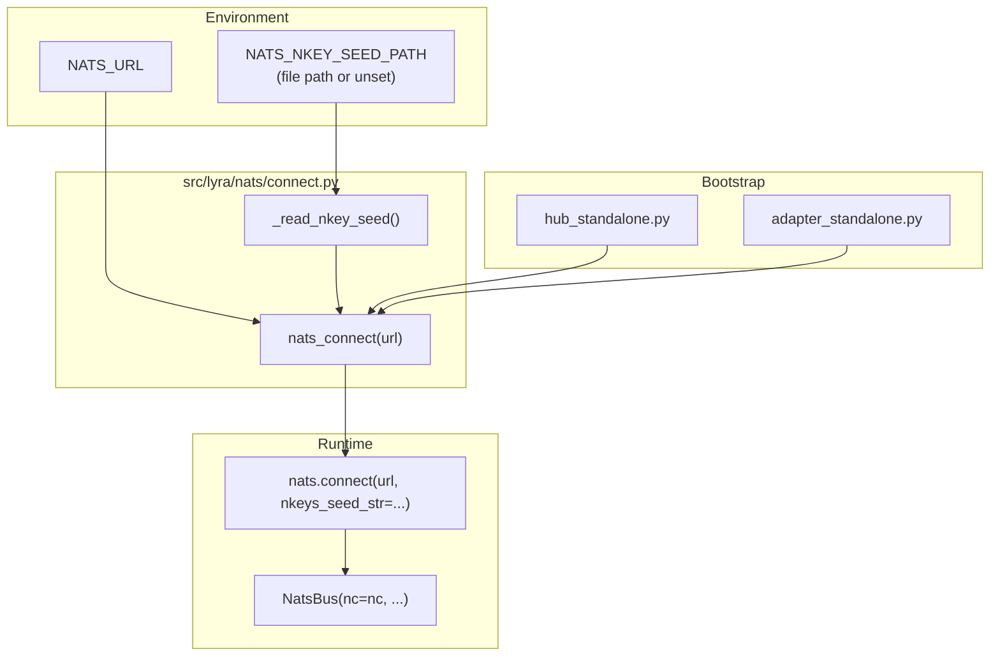
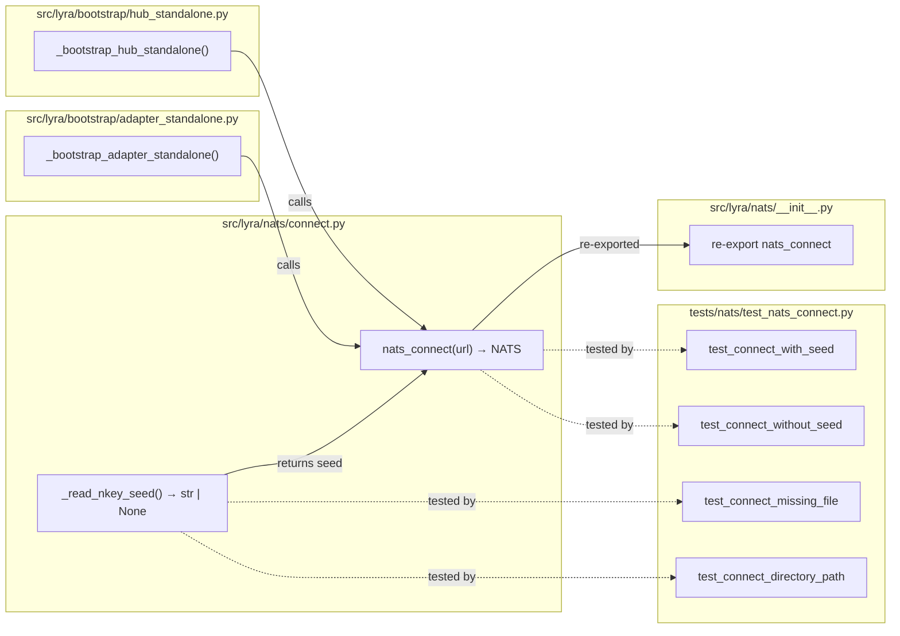

## Summary

Create a shared `nats_connect()` helper that optionally reads an nkey seed file from `NATS_NKEY_SEED_PATH` and passes it to `nats.connect(nkeys_seed_str=...)`. Wire it into both bootstrap entry points, add env var to `.env.example` and deploy docs, and cover all paths with unit tests.

## Architecture

### Data Flow



### File x Function Map



## Agents

| Agent | Task count | Files |
|-------|-----------|-------|
| backend-dev | 4 | `connect.py`, `__init__.py`, `hub_standalone.py`, `adapter_standalone.py` |
| tester | 2 | `test_nats_connect.py`, existing test suite |
| doc-writer | 2 | `.env.example`, `docs/DEPLOYMENT.md` |

## Consistency Report

- Criteria covered: 9/9
- Uncovered criteria: none
- Tasks without spec backing: none
- Gold plating exemptions applied: 0

## Micro-Tasks

### Slice V1: Shared connect helper

#### Task 1: Write `_read_nkey_seed()` helper [P] → backend-dev
- **File:** `src/lyra/nats/connect.py` (new)
- **Snippet:**
  ```python
  def _read_nkey_seed() -> str | None:
      path_str = os.environ.get("NATS_NKEY_SEED_PATH")
      if not path_str:
          return None
      path = Path(path_str)
      if not path.is_file():
          sys.exit(f"NATS_NKEY_SEED_PATH={path_str!r} is not a file")
      seed = path.read_text().strip()
      if not seed:
          sys.exit(f"NATS_NKEY_SEED_PATH={path_str!r} is empty")
      return seed
  ```
- **Verify:** `grep -q '_read_nkey_seed' src/lyra/nats/connect.py` (ready)
- **Expected:** match found
- **Time:** 3 min | **Difficulty:** 2
- **Traces:** SC-2, SC-3, SC-4 (N2→N3)
- **Phase:** GREEN

#### Task 2: Write `nats_connect()` async helper → backend-dev
- **File:** `src/lyra/nats/connect.py`
- **Snippet:**
  ```python
  async def nats_connect(url: str) -> nats.NATS:
      kwargs: dict[str, Any] = {}
      seed = _read_nkey_seed()
      if seed:
          kwargs["nkeys_seed_str"] = seed
      return await nats.connect(url, **kwargs)
  ```
- **Verify:** `grep -q 'async def nats_connect' src/lyra/nats/connect.py` (ready)
- **Expected:** match found
- **Time:** 3 min | **Difficulty:** 2
- **Traces:** SC-1, SC-2, SC-3 (N1)
- **Phase:** GREEN

#### Task 3: Re-export from `__init__.py` → backend-dev
- **File:** `src/lyra/nats/__init__.py`
- **Snippet:** Add `from .connect import nats_connect` and update `__all__`
- **Verify:** `uv run python3 -c "from lyra.nats import nats_connect; print('ok')"` (ready)
- **Expected:** `ok`
- **Time:** 2 min | **Difficulty:** 1
- **Traces:** SC-1 (N1a)
- **Phase:** GREEN

#### Task 4: Write unit tests for nats_connect → tester
- **File:** `tests/nats/test_nats_connect.py` (new)
- **Snippet:**
  ```python
  # 4 tests:
  # test_connect_with_seed — NATS_NKEY_SEED_PATH set, valid file → nkeys_seed_str passed
  # test_connect_without_seed — env unset → plain connect (no nkeys_seed_str)
  # test_connect_missing_file — env set, path missing → SystemExit
  # test_connect_directory_path — env set to dir → SystemExit
  ```
- **Verify:** `uv run pytest tests/nats/test_nats_connect.py -v` (ready)
- **Expected:** 4 passed
- **Time:** 8 min | **Difficulty:** 3
- **Traces:** SC-8 (N1, N2, N3)
- **Phase:** RED

#### RED-GATE: RED complete V1 → tester
- **Verify:** All test tasks for V1 marked complete
- **Phase:** RED-GATE

### Slice V2: Wire into bootstrap

#### Task 5: Replace `nats.connect()` in hub_standalone → backend-dev
- **File:** `src/lyra/bootstrap/hub_standalone.py`
- **Snippet:** Replace `nc = await nats.connect(nats_url)` with `nc = await nats_connect(nats_url)` + update imports
- **Verify:** `grep -q 'nats_connect' src/lyra/bootstrap/hub_standalone.py && ! grep -q 'nats\.connect' src/lyra/bootstrap/hub_standalone.py` (ready)
- **Expected:** match found (nats_connect used, raw nats.connect removed)
- **Time:** 3 min | **Difficulty:** 1
- **Traces:** SC-5 (N4)
- **Phase:** GREEN

#### Task 6: Replace `nats.connect()` in adapter_standalone → backend-dev
- **File:** `src/lyra/bootstrap/adapter_standalone.py`
- **Snippet:** Replace `nc = await nats.connect(nats_url)` with `nc = await nats_connect(nats_url)` + update imports
- **Verify:** `grep -q 'nats_connect' src/lyra/bootstrap/adapter_standalone.py && ! grep -q 'nats\.connect' src/lyra/bootstrap/adapter_standalone.py` (ready)
- **Expected:** match found
- **Time:** 3 min | **Difficulty:** 1
- **Traces:** SC-6 (N5)
- **Phase:** GREEN

#### Task 7: Verify existing NATS tests still pass → tester
- **File:** `tests/nats/`
- **Verify:** `uv run pytest tests/nats/ -v` (ready)
- **Expected:** all pass (no auth in test mode)
- **Time:** 3 min | **Difficulty:** 1
- **Traces:** SC-9
- **Phase:** GREEN

#### RED-GATE: RED complete V2 → tester
- **Verify:** All test tasks for V2 marked complete
- **Phase:** RED-GATE

### Slice V3: Deploy config + docs

#### Task 8: Add `NATS_NKEY_SEED_PATH` to `.env.example` → doc-writer
- **File:** `.env.example`
- **Snippet:** Add a NATS section after the Paths section:
  ```bash
  # --- NATS authentication (production only) ---
  # NATS_NKEY_SEED_PATH=/etc/nats/nkeys/hub.seed   # path to nkey seed file (unset = no auth)
  ```
- **Verify:** `grep -q 'NATS_NKEY_SEED_PATH' .env.example` (ready)
- **Expected:** match found
- **Time:** 2 min | **Difficulty:** 1
- **Traces:** SC-7 (N6)
- **Phase:** GREEN

#### Task 9: Update DEPLOYMENT.md with nkey setup → doc-writer
- **File:** `docs/DEPLOYMENT.md`
- **Snippet:** Add `NATS_NKEY_SEED_PATH` to the NATS env var section with explanation of seed file permissions
- **Verify:** `grep -q 'NATS_NKEY_SEED_PATH' docs/DEPLOYMENT.md` (ready)
- **Expected:** match found
- **Time:** 3 min | **Difficulty:** 1
- **Traces:** SC-7 (N7)
- **Phase:** GREEN
