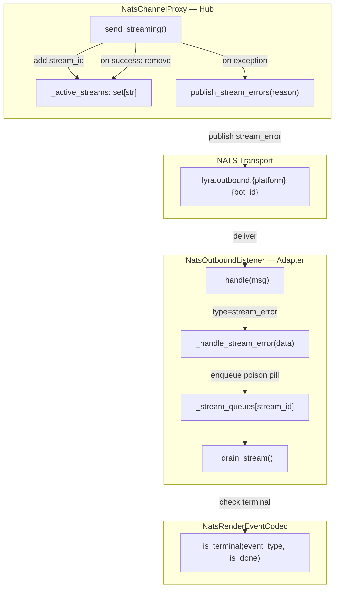
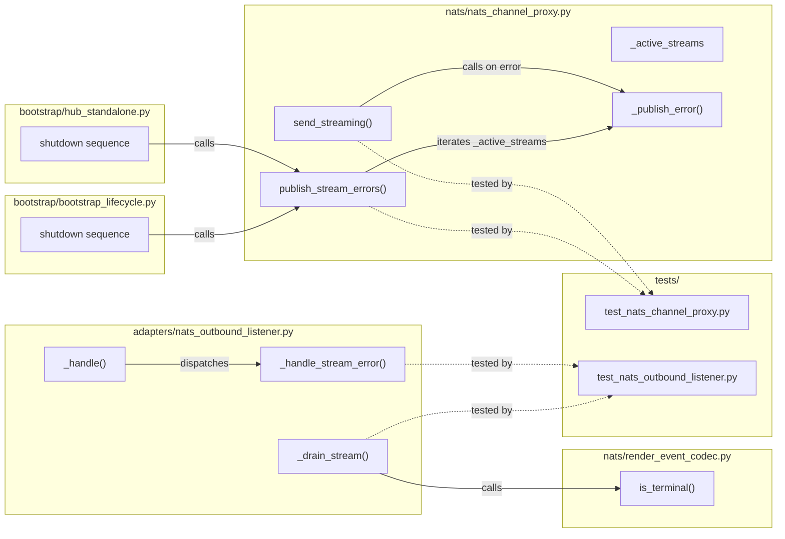

## Summary

Add a `stream_error` NATS envelope type so adapters can immediately terminate stuck streams on hub crash or exception, with active-stream tracking on the proxy and a shutdown hook to publish errors for all in-flight streams before NATS close.

## Architecture

### Data Flow



### File x Function Map



## Agents

| Agent | Task count | Files |
|-------|-----------|-------|
| backend-dev | 5 | `nats_channel_proxy.py`, `nats_outbound_listener.py`, `render_event_codec.py`, `hub_standalone.py`, `bootstrap_lifecycle.py` |
| tester | 6 | `test_nats_channel_proxy.py`, `test_nats_outbound_listener.py` |

## Consistency Report

- Criteria covered: 11/11
- Uncovered criteria: none
- Tasks without spec backing: none
- Gold plating exemptions applied: 0

## Reference Patterns

- **Test style:** `tests/nats/test_nats_channel_proxy.py` — uses `AsyncMock` for NATS client, `_make_nc()` + `_make_inbound()` helpers, `_async_iter()` for event streams.
- **Listener test style:** `tests/adapters/test_nats_outbound_listener.py` — uses `_make_tg_msg()`, `_make_nats_msg()`, direct `NatsOutboundListener` instantiation with mock adapter.
- **Existing codec pattern:** `render_event_codec.py:is_terminal()` — switch on `event_type` string, `stream_end` always terminal.
- **Shutdown pattern:** `hub_standalone.py:470-487` — cancel tasks → teardown → drain pool → notify → close NATS. Insert proxy errors after teardown_dispatchers, before pool drain.

## Micro-Tasks

### Slice V1: Envelope + codec + listener

#### Task 1: Test is_terminal returns True for stream_error [P] → tester
- **File:** `tests/nats/test_nats_channel_proxy.py`
- **Snippet:**
  ```python
  def test_is_terminal_stream_error():
      from lyra.nats.render_event_codec import NatsRenderEventCodec
      assert NatsRenderEventCodec.is_terminal("stream_error", True) is True
      assert NatsRenderEventCodec.is_terminal("stream_error", False) is True
  ```
- **Verify:** `grep -q 'test_is_terminal_stream_error' tests/nats/test_nats_channel_proxy.py` (ready)
- **Expected:** Test function exists
- **Time:** 2 min | **Difficulty:** 1
- **Traces:** SC-6, U4→N7
- **Phase:** RED

#### Task 2: Test _handle_stream_error enqueues poison pill and terminates drain [P] → tester
- **File:** `tests/adapters/test_nats_outbound_listener.py`
- **Snippet:**
  ```python
  @pytest.mark.asyncio
  async def test_stream_error_enqueues_poison_pill():
      # cache_inbound + stream_start + one chunk + stream_error
      # → _drain_stream terminates, adapter.send_streaming called with partial events
  ```
- **Verify:** `grep -q 'test_stream_error_enqueues_poison_pill' tests/adapters/test_nats_outbound_listener.py` (ready)
- **Expected:** Test function exists
- **Time:** 5 min | **Difficulty:** 3
- **Traces:** SC-4→N5, SC-5→N6, U3
- **Phase:** RED

#### Task 3: Test _handle_stream_error cleans cache when no queue exists [P] → tester
- **File:** `tests/adapters/test_nats_outbound_listener.py`
- **Snippet:**
  ```python
  @pytest.mark.asyncio
  async def test_stream_error_no_queue_cleans_cache():
      # cache_inbound + stream_error (no chunks sent) → cache entry removed
  ```
- **Verify:** `grep -q 'test_stream_error_no_queue_cleans_cache' tests/adapters/test_nats_outbound_listener.py` (ready)
- **Expected:** Test function exists
- **Time:** 3 min | **Difficulty:** 2
- **Traces:** SC-7→N6b
- **Phase:** RED

#### RED-GATE: RED complete V1 → tester
- **Verify:** All test tasks for V1 marked complete
- **Phase:** RED-GATE

#### Task 4: Update NatsRenderEventCodec.is_terminal for stream_error → backend-dev
- **File:** `src/lyra/nats/render_event_codec.py`
- **Snippet:**
  ```python
  if event_type in ("stream_end", "stream_error"):
      return True
  ```
- **Verify:** `python -m pytest tests/nats/test_nats_channel_proxy.py::test_is_terminal_stream_error -x` (deferred)
- **Expected:** Test passes
- **Time:** 2 min | **Difficulty:** 1
- **Traces:** SC-6, U4→N7
- **Phase:** GREEN

#### Task 5: Add _handle_stream_error + route in NatsOutboundListener._handle → backend-dev
- **File:** `src/lyra/adapters/nats_outbound_listener.py`
- **Snippet:**
  ```python
  # In _handle():
  elif msg_type == "stream_error":
      self._handle_stream_error(data)

  # New method:
  def _handle_stream_error(self, data: dict) -> None:
      stream_id = data.get("stream_id")
      if stream_id is None:
          return
      q = self._stream_queues.get(stream_id)
      if q is not None:
          q.put_nowait({"event_type": "stream_error", "done": True})
      else:
          # Race: error before first chunk or after stream_end
          self._cache.pop(stream_id, None)
          self._cache_ts.pop(stream_id, None)
          self._stream_outbound.pop(stream_id, None)
          log.warning("NatsOutboundListener: stream_error for unknown/finished stream_id=%r", stream_id)
  ```
- **Verify:** `python -m pytest tests/adapters/test_nats_outbound_listener.py::test_stream_error_enqueues_poison_pill tests/adapters/test_nats_outbound_listener.py::test_stream_error_no_queue_cleans_cache -x` (deferred)
- **Expected:** Both tests pass
- **Time:** 5 min | **Difficulty:** 2
- **Traces:** SC-4→N5, SC-5→N6, SC-7→N6b, U3
- **Phase:** GREEN

#### Task 6: Publish stream_error in NatsChannelProxy.send_streaming except block → backend-dev
- **File:** `src/lyra/nats/nats_channel_proxy.py`
- **Snippet:**
  ```python
  # In send_streaming() except block, before draining:
  except Exception:
      log.exception("NatsChannelProxy: ...")
      error_envelope = {
          "type": "stream_error",
          "stream_id": original_msg.id,
          "reason": "streaming_exception",
      }
      try:
          await self._nc.publish(subject, json.dumps(error_envelope, ensure_ascii=False).encode("utf-8"))
      except Exception:
          log.warning("NatsChannelProxy: failed to publish stream_error for stream_id=%r", original_msg.id)
      async for _ in events:
          pass
  ```
- **Verify:** `python -m pytest tests/nats/test_nats_channel_proxy.py -x -k stream_error` (deferred)
- **Expected:** Tests pass
- **Time:** 4 min | **Difficulty:** 2
- **Traces:** SC-1→N3
- **Phase:** GREEN

### Slice V2: Active stream tracking + shutdown hook

#### Task 7: Test _active_streams tracking and publish_stream_errors → tester
- **File:** `tests/nats/test_nats_channel_proxy.py`
- **Snippet:**
  ```python
  @pytest.mark.asyncio
  async def test_active_streams_tracked_during_streaming():
      # send_streaming with normal events → _active_streams empty after
  
  @pytest.mark.asyncio
  async def test_publish_stream_errors_publishes_for_active():
      # manually add to _active_streams, call publish_stream_errors → verify envelope
  ```
- **Verify:** `grep -q 'test_active_streams_tracked' tests/nats/test_nats_channel_proxy.py` (ready)
- **Expected:** Test functions exist
- **Time:** 5 min | **Difficulty:** 3
- **Traces:** SC-2→U1→N1→N2, U2
- **Phase:** RED

#### Task 8: Test publish_stream_errors swallows failures [P] → tester
- **File:** `tests/nats/test_nats_channel_proxy.py`
- **Snippet:**
  ```python
  @pytest.mark.asyncio
  async def test_publish_stream_errors_swallows_nats_failure():
      # nc.publish raises → no exception propagated, warning logged
  ```
- **Verify:** `grep -q 'test_publish_stream_errors_swallows' tests/nats/test_nats_channel_proxy.py` (ready)
- **Expected:** Test function exists
- **Time:** 3 min | **Difficulty:** 2
- **Traces:** SC-8
- **Phase:** RED

#### RED-GATE: RED complete V2 → tester
- **Verify:** All test tasks for V2 marked complete
- **Phase:** RED-GATE

#### Task 9: Add _active_streams + publish_stream_errors to NatsChannelProxy → backend-dev
- **File:** `src/lyra/nats/nats_channel_proxy.py`
- **Snippet:**
  ```python
  # In __init__:
  self._active_streams: set[str] = set()

  # In send_streaming, before streaming loop:
  self._active_streams.add(original_msg.id)

  # After stream_end publish:
  self._active_streams.discard(original_msg.id)

  # In except block (after publishing stream_error):
  self._active_streams.discard(original_msg.id)

  # New method:
  async def publish_stream_errors(self, reason: str = "hub_shutdown") -> None:
      subject = f"lyra.outbound.{self._platform.value}.{self._bot_id}"
      for stream_id in list(self._active_streams):
          envelope = {"type": "stream_error", "stream_id": stream_id, "reason": reason}
          try:
              await self._nc.publish(subject, json.dumps(envelope, ensure_ascii=False).encode("utf-8"))
          except Exception:
              log.warning("NatsChannelProxy: failed to publish stream_error for stream_id=%r", stream_id)
      self._active_streams.clear()
  ```
- **Verify:** `python -m pytest tests/nats/test_nats_channel_proxy.py -x -k 'active_streams or publish_stream_errors'` (deferred)
- **Expected:** All tests pass
- **Time:** 5 min | **Difficulty:** 3
- **Traces:** SC-1→N3, SC-2→U1→N1→N2, SC-8→U2
- **Phase:** GREEN

#### Task 10: Wire shutdown hook in hub_standalone.py → backend-dev
- **File:** `src/lyra/bootstrap/hub_standalone.py`
- **Snippet:**
  ```python
  # Build proxies list alongside dispatchers (near line 332):
  proxies: list[NatsChannelProxy] = []
  # In each bot wiring loop, after proxy = NatsChannelProxy(...):
  proxies.append(proxy)

  # In shutdown sequence (after teardown_dispatchers, before pool drain):
  for proxy in proxies:
      await proxy.publish_stream_errors("hub_shutdown")
  ```
- **Verify:** `grep -q 'publish_stream_errors' src/lyra/bootstrap/hub_standalone.py` (ready)
- **Expected:** Shutdown hook wired
- **Time:** 4 min | **Difficulty:** 2
- **Traces:** SC-3→N4, SC-9
- **Phase:** GREEN

#### Task 11: Wire shutdown hook in bootstrap_lifecycle.py → backend-dev
- **File:** `src/lyra/bootstrap/bootstrap_lifecycle.py`
- **Snippet:**
  ```python
  # Same pattern: collect proxies, call publish_stream_errors before pool drain
  ```
- **Verify:** `grep -q 'publish_stream_errors' src/lyra/bootstrap/bootstrap_lifecycle.py` (ready)
- **Expected:** Shutdown hook wired
- **Time:** 3 min | **Difficulty:** 2
- **Traces:** SC-3→N4, SC-9, SC-10→SC-11
- **Phase:** GREEN
