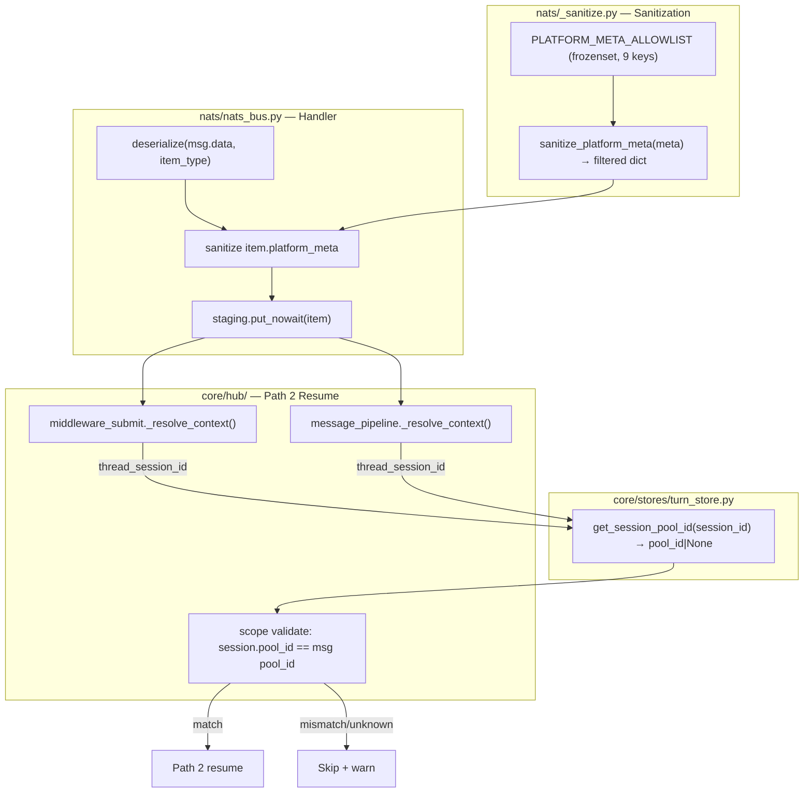
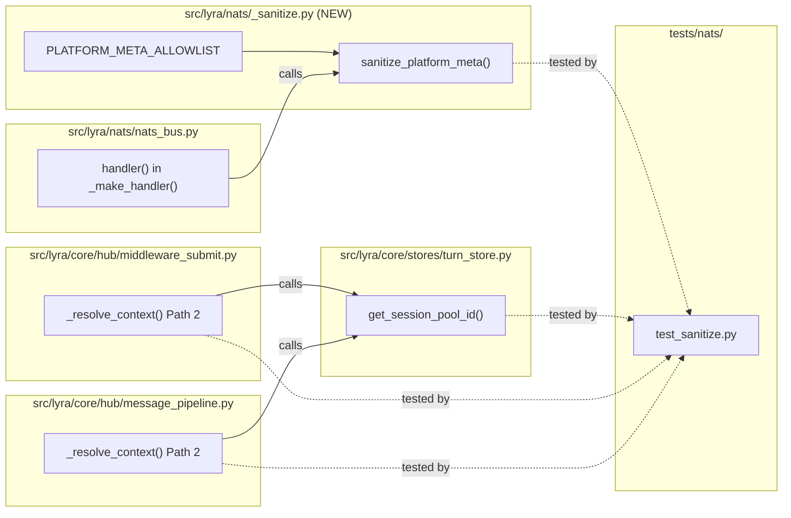

## Summary

Add allowlist-based sanitization of `platform_meta` at the NATS deserialization boundary
(`nats_bus.py` handler) and scope-validate `thread_session_id` before Path 2 session resume
in both `middleware_submit.py` and `message_pipeline.py`. Prevents session hijacking via
crafted NATS messages.

## Architecture

### Data Flow



### File x Function Map



## Agents

| Agent | Task count | Files |
|-------|-----------|-------|
| backend-dev | 6 | `_sanitize.py`, `nats_bus.py`, `turn_store.py`, `middleware_submit.py`, `message_pipeline.py` |
| tester | 4 | `tests/nats/test_sanitize.py` |

## Consistency Report

- Criteria covered: 12/12
- Uncovered criteria: none
- Tasks without spec backing: none
- Gold plating exemptions applied: 0

## Micro-Tasks

### Slice V1: Allowlist sanitization at NATS boundary

#### Task 1: Create `_sanitize.py` with allowlist constant [P] → backend-dev
- **File:** `src/lyra/nats/_sanitize.py`
- **Snippet:**
```python
PLATFORM_META_ALLOWLIST: frozenset[str] = frozenset({
    "guild_id", "channel_id", "message_id", "thread_id", "channel_type",
    "chat_id", "topic_id", "is_group", "thread_session_id",
})

def sanitize_platform_meta(meta: dict[str, Any]) -> dict[str, Any]:
    stripped = [k for k in meta if k not in PLATFORM_META_ALLOWLIST or k.startswith("_")]
    if stripped:
        log.debug("platform_meta: stripped keys %s", stripped)
    return {k: v for k, v in meta.items() if k in PLATFORM_META_ALLOWLIST and not k.startswith("_")}
```
- **Verify:** `python -c "from lyra.nats._sanitize import sanitize_platform_meta, PLATFORM_META_ALLOWLIST; assert len(PLATFORM_META_ALLOWLIST) == 9"` (ready)
- **Expected:** no error, 9-key allowlist
- **Time:** 3 min | **Difficulty:** 1
- **Traces:** SC-1, SC-2, SC-3, SC-4, SC-5, SC-6 | **Phase:** GREEN

#### Task 2: Integrate sanitization into `nats_bus.py` handler → backend-dev
- **File:** `src/lyra/nats/nats_bus.py`
- **Snippet:**
```python
# In handler(), between deserialize() and put_nowait():
item = deserialize(msg.data, self._item_type)
if hasattr(item, "platform_meta"):
    import dataclasses
    item = dataclasses.replace(item, platform_meta=sanitize_platform_meta(item.platform_meta))
self._staging.put_nowait(item)
```
- **Verify:** `grep -q 'sanitize_platform_meta' src/lyra/nats/nats_bus.py` (ready)
- **Expected:** match found
- **Time:** 3 min | **Difficulty:** 2
- **Traces:** SC-1, SC-2 | **Phase:** GREEN

#### Task 3: Write RED tests for sanitization [P] → tester
- **File:** `tests/nats/test_sanitize.py`
- **Snippet:**
```python
def test_unknown_keys_stripped():
    meta = {"chat_id": 1, "evil_key": "x"}
    result = sanitize_platform_meta(meta)
    assert "evil_key" not in result
    assert result["chat_id"] == 1

def test_underscore_keys_stripped():
    meta = {"chat_id": 1, "_internal": "x"}
    result = sanitize_platform_meta(meta)
    assert "_internal" not in result

def test_all_9_allowlisted_keys_preserved():
    meta = {k: i for i, k in enumerate(PLATFORM_META_ALLOWLIST)}
    result = sanitize_platform_meta(meta)
    assert set(result.keys()) == PLATFORM_META_ALLOWLIST

def test_nats_bus_sanitizes_inbound_message():
    # round-trip: serialize msg with extra keys → deserialize + sanitize → extra gone

def test_nats_bus_sanitizes_inbound_audio():
    # same as above for InboundAudio
```
- **Verify:** `python -m pytest tests/nats/test_sanitize.py -x -q` (deferred)
- **Expected:** all tests pass
- **Time:** 8 min | **Difficulty:** 3
- **Traces:** SC-1, SC-2, SC-3, SC-4, SC-5, SC-6, SC-10, SC-12 | **Phase:** RED

#### RED-GATE: RED complete V1 → tester
- **Verify:** All test tasks for V1 marked complete
- **Phase:** RED-GATE

### Slice V2: Scope-validate `thread_session_id`

#### Task 4: Add `get_session_pool_id()` to TurnStore → backend-dev
- **File:** `src/lyra/core/stores/turn_store.py`
- **Snippet:**
```python
async def get_session_pool_id(self, session_id: str) -> str | None:
    """Return the pool_id for a session, or None if not found."""
    db = self._db_or_raise()
    try:
        async with db.execute(
            "SELECT pool_id FROM pool_sessions WHERE session_id = ?",
            (session_id,),
        ) as cur:
            row = await cur.fetchone()
            return row[0] if row else None
    except Exception:
        log.exception("TurnStore.get_session_pool_id failed (session=%s)", session_id)
        return None
```
- **Verify:** `grep -q 'get_session_pool_id' src/lyra/core/stores/turn_store.py` (ready)
- **Expected:** match found
- **Time:** 3 min | **Difficulty:** 1
- **Traces:** SC-7, SC-8, SC-9 (S4 affordance) | **Phase:** GREEN

#### Task 5: Add scope validation to `middleware_submit.py` Path 2 → backend-dev
- **File:** `src/lyra/core/hub/middleware_submit.py`
- **Snippet:**
```python
# After line 164 (thread_session_id = msg.platform_meta.get(...)):
if thread_session_id is not None:
    # Scope-validate: session must belong to this pool
    if hub._turn_store is not None:
        session_pool = await hub._turn_store.get_session_pool_id(thread_session_id)
        if session_pool is None or session_pool != pool_id:
            log.warning(
                "thread-session-resume: scope mismatch for %r — "
                "expected pool %r, got %r — skipping",
                thread_session_id, pool_id, session_pool,
            )
            return ResumeStatus.SKIPPED
    else:
        log.debug("thread-session-resume: no TurnStore — skipping scope validation")
        return ResumeStatus.SKIPPED
    # ... existing resume logic ...
```
- **Verify:** `grep -q 'scope mismatch' src/lyra/core/hub/middleware_submit.py` (ready)
- **Expected:** match found
- **Time:** 5 min | **Difficulty:** 3
- **Traces:** SC-7, SC-8, SC-9, SC-11 | **Phase:** GREEN

#### Task 6: Add scope validation to `message_pipeline.py` Path 2 → backend-dev
- **File:** `src/lyra/core/hub/message_pipeline.py`
- **Snippet:** Same scope validation pattern as Task 5, adapted for `self._hub._turn_store` reference style.
- **Verify:** `grep -q 'scope mismatch' src/lyra/core/hub/message_pipeline.py` (ready)
- **Expected:** match found
- **Time:** 5 min | **Difficulty:** 3
- **Traces:** SC-7, SC-8, SC-9, SC-11 | **Phase:** GREEN

#### Task 7: Write RED tests for scope validation → tester
- **File:** `tests/nats/test_sanitize.py`
- **Snippet:**
```python
@pytest.mark.asyncio
async def test_cross_scope_thread_session_id_rejected():
    # Setup: TurnStore with session in pool_A, message targeting pool_B
    # Assert: Path 2 skipped, warning logged

@pytest.mark.asyncio
async def test_same_scope_thread_session_id_accepted():
    # Setup: TurnStore with session in pool_A, message also in pool_A
    # Assert: Path 2 resume attempted

@pytest.mark.asyncio
async def test_unknown_session_id_rejected():
    # Setup: TurnStore with no matching session
    # Assert: Path 2 skipped

@pytest.mark.asyncio
async def test_no_turn_store_skips_path2():
    # Setup: hub._turn_store = None
    # Assert: Path 2 skipped
```
- **Verify:** `python -m pytest tests/nats/test_sanitize.py -x -q` (deferred)
- **Expected:** all tests pass
- **Time:** 10 min | **Difficulty:** 4
- **Traces:** SC-7, SC-8, SC-9, SC-11 | **Phase:** RED

#### Task 8: Verify existing round-trip tests still pass → tester
- **File:** `tests/nats/test_nats_bus.py`
- **Verify:** `python -m pytest tests/nats/test_nats_bus.py -x -q` (ready)
- **Expected:** all existing tests pass unchanged
- **Time:** 2 min | **Difficulty:** 1
- **Traces:** SC-12 | **Phase:** GREEN

#### RED-GATE: RED complete V2 → tester
- **Verify:** All test tasks for V2 marked complete
- **Phase:** RED-GATE

#### Task 9: Run full test suite → tester
- **File:** n/a
- **Verify:** `python -m pytest tests/nats/ -x -q` (ready)
- **Expected:** all tests pass
- **Time:** 2 min | **Difficulty:** 1
- **Traces:** SC-12 | **Phase:** GREEN

#### Task 10: Verify DEBUG logging for stripped keys → tester
- **File:** `tests/nats/test_sanitize.py`
- **Snippet:**
```python
def test_stripped_keys_logged_at_debug(caplog):
    with caplog.at_level(logging.DEBUG):
        sanitize_platform_meta({"chat_id": 1, "evil": "x"})
    assert "stripped keys" in caplog.text
    assert "evil" in caplog.text
```
- **Verify:** `python -m pytest tests/nats/test_sanitize.py::test_stripped_keys_logged_at_debug -x -q` (deferred)
- **Expected:** test passes
- **Time:** 3 min | **Difficulty:** 1
- **Traces:** SC-10 | **Phase:** RED
