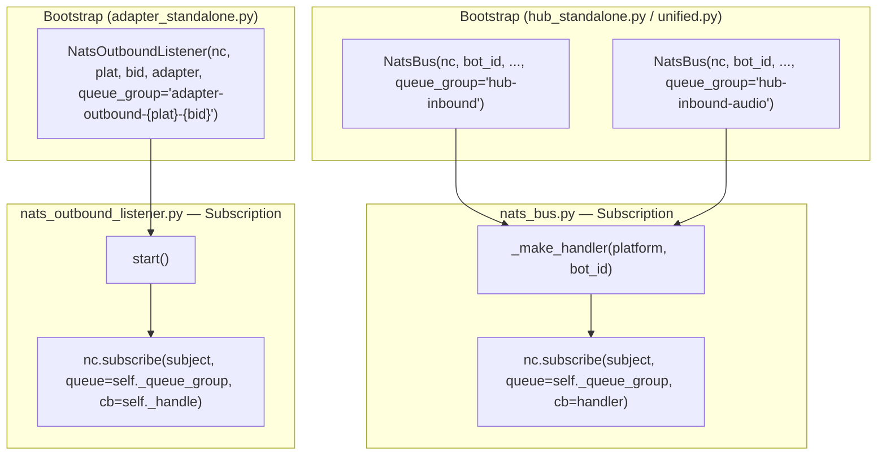
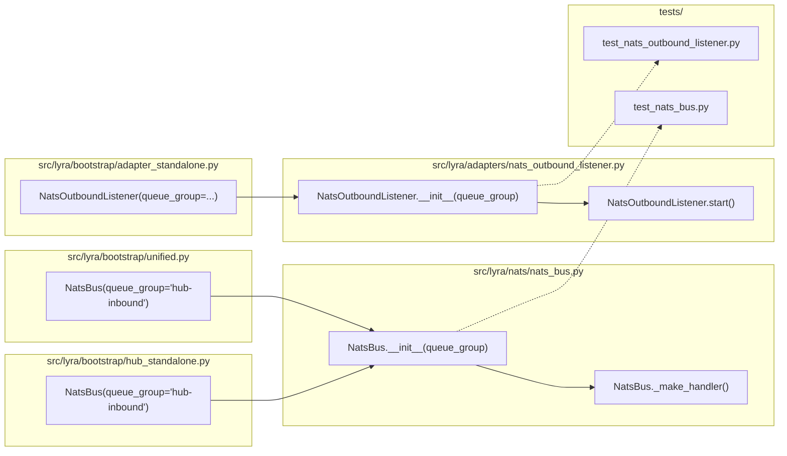

## Summary

Add NATS `queue=` parameter to `NatsBus._make_handler` and `NatsOutboundListener.start` subscriptions, wired through bootstrap files. This prevents duplicate message delivery during rolling deploys by ensuring only one subscriber per queue group receives each message.

## Architecture

### Data Flow



### File x Function Map



## Agents

| Agent | Task count | Files |
|-------|-----------|-------|
| backend-dev | 5 | `nats_bus.py`, `nats_outbound_listener.py`, `hub_standalone.py`, `unified.py`, `adapter_standalone.py` |
| tester | 4 | `test_nats_bus.py`, `test_nats_outbound_listener.py` |

## Consistency Report

- Criteria covered: 8/8
- Uncovered criteria: none
- Tasks without spec backing: none
- Gold plating exemptions applied: 0

## Micro-Tasks

### Slice V1: NatsBus queue group support

#### Task 1: Add `queue_group` param to `NatsBus.__init__` [P] → backend-dev
- **File:** `src/lyra/nats/nats_bus.py`
- **Snippet:**
```python
def __init__(
    self,
    nc: NATS,
    bot_id: str,
    item_type: type[T],
    subject_prefix: str = "lyra.inbound",
    *,
    staging_maxsize: int = 500,
    queue_group: str = "",
) -> None:
    ...
    self._queue_group = queue_group
```
- **Verify:** `grep -q 'queue_group' src/lyra/nats/nats_bus.py` (ready)
- **Expected:** match found
- **Time:** 3 min | **Difficulty:** 1
- **Traces:** SC-1, SC-3 (N1) | **Phase:** GREEN

#### Task 2: Pass `queue=` in `NatsBus._make_handler` [P] → backend-dev
- **File:** `src/lyra/nats/nats_bus.py`
- **Snippet:**
```python
sub = await self._nc.subscribe(subject, queue=self._queue_group, cb=handler)
```
- **Verify:** `grep -q 'queue=self._queue_group' src/lyra/nats/nats_bus.py` (ready)
- **Expected:** match found
- **Time:** 2 min | **Difficulty:** 1
- **Traces:** SC-1, SC-3 (N2) | **Phase:** GREEN

#### Task 3: Wire `queue_group="hub-inbound"` in hub_standalone.py → backend-dev
- **File:** `src/lyra/bootstrap/hub_standalone.py`
- **Snippet:**
```python
inbound_bus: NatsBus[InboundMessage] = NatsBus(
    nc=nc, bot_id="hub", item_type=InboundMessage,
    staging_maxsize=inbound_bus_cfg.staging_maxsize,
    queue_group="hub-inbound",
)
inbound_audio_bus: NatsBus[InboundAudio] = NatsBus(
    nc=nc, bot_id="hub", item_type=InboundAudio,
    subject_prefix="lyra.inbound.audio",
    queue_group="hub-inbound-audio",
)
```
- **Verify:** `grep -q 'queue_group="hub-inbound"' src/lyra/bootstrap/hub_standalone.py` (ready)
- **Expected:** match found
- **Time:** 3 min | **Difficulty:** 1
- **Traces:** SC-5 (N5, N6) | **Phase:** GREEN

#### Task 4: Wire `queue_group` in unified.py → backend-dev
- **File:** `src/lyra/bootstrap/unified.py`
- **Snippet:**
```python
inbound_bus: NatsBus[InboundMessage] = NatsBus(
    nc=nc, bot_id="hub", item_type=InboundMessage,
    staging_maxsize=inbound_bus_cfg.staging_maxsize,
    queue_group="hub-inbound",
)
inbound_audio_bus: NatsBus[InboundAudio] = NatsBus(
    nc=nc, bot_id="hub", item_type=InboundAudio,
    subject_prefix="lyra.inbound.audio",
    queue_group="hub-inbound-audio",
)
```
- **Verify:** `grep -q 'queue_group="hub-inbound"' src/lyra/bootstrap/unified.py` (ready)
- **Expected:** match found
- **Time:** 3 min | **Difficulty:** 1
- **Traces:** SC-5 (N5, N6) | **Phase:** GREEN

#### RED-GATE: RED complete V1 → tester
- **Verify:** All test tasks for V1 marked complete
- **Phase:** RED-GATE

### Slice V2: NatsOutboundListener queue group support

#### Task 5: Add `queue_group` param to `NatsOutboundListener.__init__` [P] → backend-dev
- **File:** `src/lyra/adapters/nats_outbound_listener.py`
- **Snippet:**
```python
def __init__(
    self,
    nc: NATS,
    platform: Platform,
    bot_id: str,
    adapter: "ChannelAdapter",
    *,
    queue_group: str = "",
) -> None:
    ...
    self._queue_group = queue_group
```
- **Verify:** `grep -q 'queue_group' src/lyra/adapters/nats_outbound_listener.py` (ready)
- **Expected:** match found
- **Time:** 3 min | **Difficulty:** 1
- **Traces:** SC-2, SC-3 (N3) | **Phase:** GREEN

#### Task 6: Pass `queue=` in `NatsOutboundListener.start` → backend-dev
- **File:** `src/lyra/adapters/nats_outbound_listener.py`
- **Snippet:**
```python
self._sub = await self._nc.subscribe(subject, queue=self._queue_group, cb=self._handle)
```
- **Verify:** `grep -q 'queue=self._queue_group' src/lyra/adapters/nats_outbound_listener.py` (ready)
- **Expected:** match found
- **Time:** 2 min | **Difficulty:** 1
- **Traces:** SC-2, SC-3 (N4) | **Phase:** GREEN

#### Task 7: Wire queue group in adapter_standalone.py (Telegram + Discord) → backend-dev
- **File:** `src/lyra/bootstrap/adapter_standalone.py`
- **Snippet:**
```python
# Telegram (line ~119)
listener = NatsOutboundListener(
    nc, platform_enum, bot_id, adapter,
    queue_group=f"adapter-outbound-{platform_enum.value}-{bot_id}",
)
# Discord (line ~254)
listener_dc = NatsOutboundListener(
    nc, platform_enum, bot_id, adapter_dc,
    queue_group=f"adapter-outbound-{platform_enum.value}-{bot_id}",
)
```
- **Verify:** `grep -q 'queue_group=f"adapter-outbound' src/lyra/bootstrap/adapter_standalone.py` (ready)
- **Expected:** match found
- **Time:** 3 min | **Difficulty:** 1
- **Traces:** SC-6 (N7) | **Phase:** GREEN

#### RED-GATE: RED complete V2 → tester
- **Verify:** All test tasks for V2 marked complete
- **Phase:** RED-GATE

### Slice V3: Tests

#### Task 8: Add queue group test for NatsBus → tester
- **File:** `tests/nats/test_nats_bus.py`
- **Snippet:**
```python
@requires_nats_server
class TestNatsBusQueueGroup:
    async def test_subscribe_uses_queue_group(self, nc: NATS) -> None:
        """NatsBus passes queue_group to nc.subscribe()."""
        bus = NatsBus(nc=nc, bot_id="main", item_type=InboundMessage, queue_group="test-group")
        bus.register(Platform.TELEGRAM)
        await bus.start()
        try:
            sub = list(bus._subscriptions.values())[0]
            assert sub._queue == "test-group"  # nats-py Subscription._queue
        finally:
            await bus.stop()

    async def test_empty_queue_group_default(self, nc: NATS) -> None:
        """Default queue_group is empty string (no group)."""
        bus = NatsBus(nc=nc, bot_id="main", item_type=InboundMessage)
        assert bus._queue_group == ""
```
- **Verify:** `cd /home/mickael/projects/lyra && python -m pytest tests/nats/test_nats_bus.py -x -q` (deferred)
- **Expected:** all tests pass
- **Time:** 5 min | **Difficulty:** 2
- **Traces:** SC-1, SC-4, SC-7, SC-8 | **Phase:** GREEN

#### Task 9: Add queue group test for NatsOutboundListener → tester
- **File:** `tests/adapters/test_nats_outbound_listener.py`
- **Snippet:**
```python
@pytest.mark.asyncio
async def test_start_subscribes_with_queue_group() -> None:
    """NatsOutboundListener.start() passes queue_group to nc.subscribe()."""
    nc = AsyncMock()
    adapter = AsyncMock()
    listener = NatsOutboundListener(
        nc, Platform.TELEGRAM, "main", adapter,
        queue_group="adapter-outbound-telegram-main",
    )
    await listener.start()
    nc.subscribe.assert_called_once()
    call_kwargs = nc.subscribe.call_args
    assert call_kwargs.kwargs.get("queue") == "adapter-outbound-telegram-main" or \
        call_kwargs[1].get("queue") == "adapter-outbound-telegram-main"
```
- **Verify:** `cd /home/mickael/projects/lyra && python -m pytest tests/adapters/test_nats_outbound_listener.py -x -q` (deferred)
- **Expected:** all tests pass
- **Time:** 5 min | **Difficulty:** 2
- **Traces:** SC-2, SC-4, SC-7, SC-8 | **Phase:** GREEN
