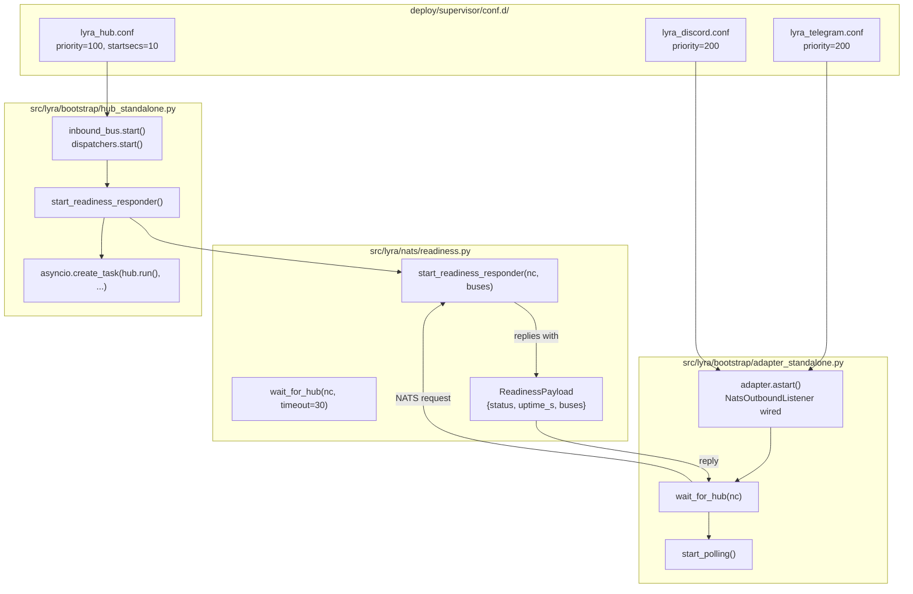
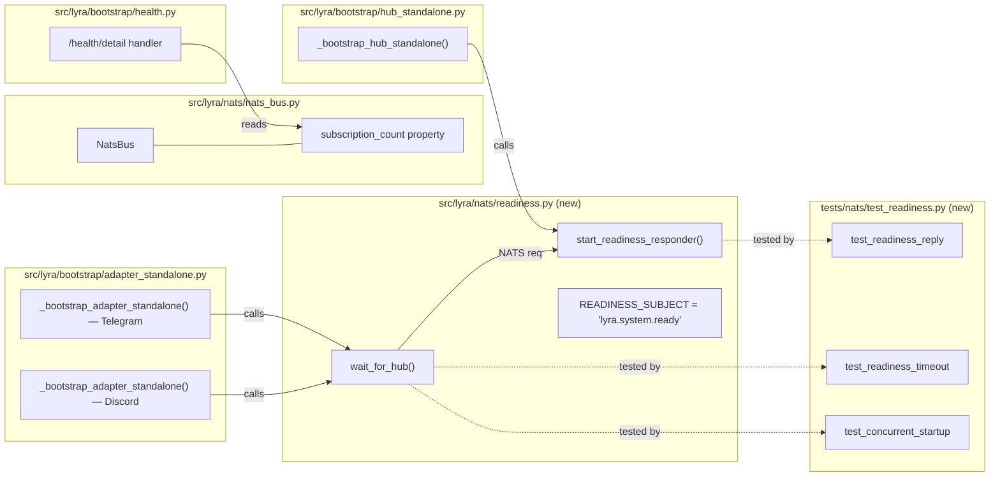

## Summary

Add supervisor priority ordering (belt) and a NATS request/reply readiness probe (suspenders) so adapters wait for hub readiness before polling, eliminating silent message drops during concurrent startup.

## Architecture

### Data Flow



### File x Function Map



## Agents

| Agent | Task count | Files |
|-------|-----------|-------|
| devops | 3 | `deploy/supervisor/conf.d/lyra_hub.conf`, `lyra_telegram.conf`, `lyra_discord.conf` |
| tester | 1 | `tests/nats/test_readiness.py` |
| backend-dev | 5 | `src/lyra/nats/readiness.py`, `nats_bus.py`, `hub_standalone.py`, `adapter_standalone.py`, `health.py` |

## Consistency Report

- Criteria covered: 12/13
- Uncovered criteria: SC-9 (readiness responder teardown deferred — documentation-only known limitation, no code change)
- Tasks without spec backing: none
- Gold plating exemptions applied: 1 (SC-9)

## Micro-Tasks

### Slice V1: Supervisor priority ordering

#### Task 1: Add priority=100 and startsecs=10 to hub supervisor config [P] → devops
- **File:** `deploy/supervisor/conf.d/lyra_hub.conf`
- **Snippet:** `priority=100` + change `startsecs=5` → `startsecs=10`
- **Verify:** `grep -q 'priority=100' deploy/supervisor/conf.d/lyra_hub.conf && grep -q 'startsecs=10' deploy/supervisor/conf.d/lyra_hub.conf` (ready)
- **Expected:** Both patterns found
- **Time:** 2 min | **Difficulty:** 1
- **Traces:** SC-1, U1
- **Phase:** GREEN

#### Task 2: Add priority=200 to telegram supervisor config [P] → devops
- **File:** `deploy/supervisor/conf.d/lyra_telegram.conf`
- **Snippet:** `priority=200`
- **Verify:** `grep -q 'priority=200' deploy/supervisor/conf.d/lyra_telegram.conf` (ready)
- **Expected:** Pattern found
- **Time:** 2 min | **Difficulty:** 1
- **Traces:** SC-1, U1
- **Phase:** GREEN

#### Task 3: Add priority=200 to discord supervisor config [P] → devops
- **File:** `deploy/supervisor/conf.d/lyra_discord.conf`
- **Snippet:** `priority=200`
- **Verify:** `grep -q 'priority=200' deploy/supervisor/conf.d/lyra_discord.conf` (ready)
- **Expected:** Pattern found
- **Time:** 2 min | **Difficulty:** 1
- **Traces:** SC-1, U1
- **Phase:** GREEN

### Slice V2: NATS readiness probe

#### Task 4: Write readiness module tests (reply, timeout, concurrent) → tester
- **File:** `tests/nats/test_readiness.py`
- **Snippet:**
  ```python
  async def test_readiness_reply():
      """Hub replies → adapter proceeds."""

  async def test_readiness_timeout():
      """No hub → adapter proceeds after timeout with WARNING."""

  async def test_concurrent_startup():
      """Hub + adapter start concurrently → adapter waits then proceeds."""
  ```
- **Verify:** `grep -q 'test_readiness_reply' tests/nats/test_readiness.py && grep -q 'test_readiness_timeout' tests/nats/test_readiness.py && grep -q 'test_concurrent_startup' tests/nats/test_readiness.py` (ready)
- **Expected:** All three test functions exist
- **Time:** 8 min | **Difficulty:** 3
- **Traces:** SC-11, SC-12, SC-13, N1, N2
- **Phase:** RED

#### RED-GATE: RED complete V2 → tester
- **Verify:** All test tasks for V2 marked complete
- **Phase:** RED-GATE

#### Task 5: Create readiness module with responder and probe [P] → backend-dev
- **File:** `src/lyra/nats/readiness.py`
- **Snippet:**
  ```python
  READINESS_SUBJECT = "lyra.system.ready"
  PROBE_INTERVAL_S = 0.5
  PROBE_TIMEOUT_S = 30.0

  async def start_readiness_responder(nc: NATS, buses: list) -> Subscription:
      """Subscribe to lyra.system.ready, reply with ReadinessPayload."""

  async def wait_for_hub(nc: NATS, *, timeout: float = PROBE_TIMEOUT_S) -> bool:
      """Send NATS requests every PROBE_INTERVAL_S until reply or timeout."""
  ```
- **Verify:** `python -c "from lyra.nats.readiness import start_readiness_responder, wait_for_hub; print('ok')"` (deferred)
- **Expected:** `ok`
- **Time:** 8 min | **Difficulty:** 3
- **Traces:** SC-2, SC-3, SC-4, SC-5, SC-8, N1, N2
- **Phase:** GREEN

#### Task 6: Add subscription_count property to NatsBus [P] → backend-dev
- **File:** `src/lyra/nats/nats_bus.py`
- **Snippet:**
  ```python
  @property
  def subscription_count(self) -> int:
      return len(self._subscriptions)
  ```
- **Verify:** `grep -q 'def subscription_count' src/lyra/nats/nats_bus.py` (ready)
- **Expected:** Property exists
- **Time:** 2 min | **Difficulty:** 1
- **Traces:** SC-6, N3
- **Phase:** GREEN

#### Task 7: Wire readiness responder into hub bootstrap → backend-dev
- **File:** `src/lyra/bootstrap/hub_standalone.py`
- **Snippet:** Insert after line 424 (dispatchers started), before `import uvicorn`:
  ```python
  from lyra.nats.readiness import start_readiness_responder
  readiness_sub = await start_readiness_responder(nc, [hub.inbound_bus, hub.inbound_audio_bus])
  ```
- **Verify:** `grep -q 'start_readiness_responder' src/lyra/bootstrap/hub_standalone.py` (ready)
- **Expected:** Import and call present
- **Time:** 3 min | **Difficulty:** 2
- **Traces:** SC-2, S1
- **Phase:** GREEN

#### Task 8: Wire readiness probe into adapter bootstrap (Telegram + Discord) → backend-dev
- **File:** `src/lyra/bootstrap/adapter_standalone.py`
- **Snippet:** Insert after all adapters wired (after the wired loop), before poll_tasks construction:
  ```python
  from lyra.nats.readiness import wait_for_hub
  await wait_for_hub(nc)
  ```
  Two insertion points: Telegram section (after line ~127, before line ~138) and Discord section (after line ~264, before line ~276).
- **Verify:** `grep -c 'wait_for_hub' src/lyra/bootstrap/adapter_standalone.py` (ready)
- **Expected:** `2` (one per platform section)
- **Time:** 5 min | **Difficulty:** 2
- **Traces:** SC-3, SC-4, SC-5, S2
- **Phase:** GREEN

#### Task 9: Add buses field to /health/detail endpoint → backend-dev
- **File:** `src/lyra/bootstrap/health.py`
- **Snippet:** Add to the detail dict:
  ```python
  "buses": hub.inbound_bus.subscription_count + hub.inbound_audio_bus.subscription_count,
  ```
- **Verify:** `grep -q 'subscription_count' src/lyra/bootstrap/health.py` (ready)
- **Expected:** Property used in health endpoint
- **Time:** 2 min | **Difficulty:** 1
- **Traces:** SC-7, S3, N3
- **Phase:** GREEN

## Reference Patterns

- **NatsBus property pattern:** Follow `staging_qsize()` at `nats_bus.py:204` — single-line return, public, no side effects.
- **NATS test conventions:** See `tests/nats/test_nats_bus.py` for mock NATS connection patterns and async test setup.
- **Health endpoint pattern:** See `health.py` `/health/detail` handler for dict construction pattern.
