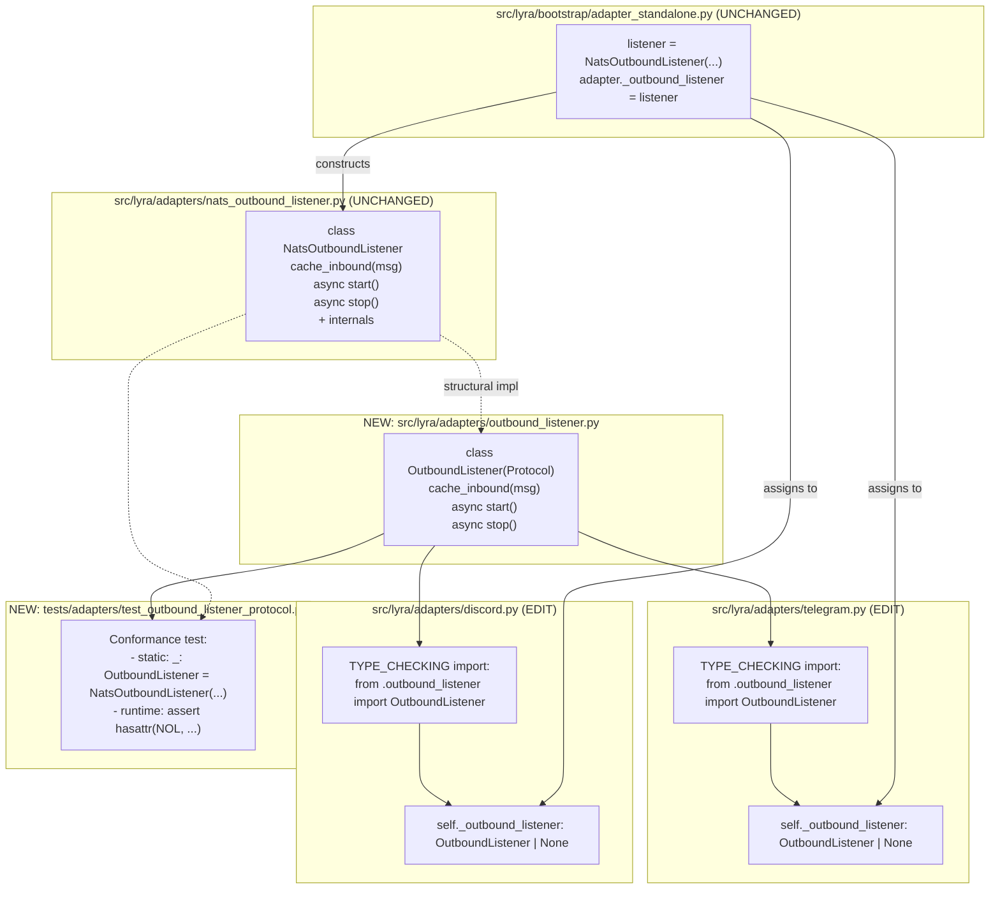
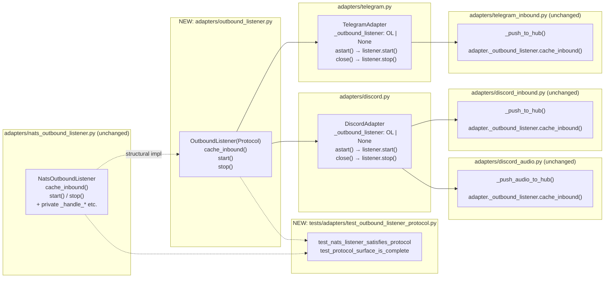

## Summary

Introduce a narrow structural `OutboundListener` protocol in
`src/lyra/adapters/outbound_listener.py`, rewire `TelegramAdapter` and
`DiscordAdapter` type hints to reference the protocol instead of
`NatsOutboundListener`, and add a conformance test. No runtime behaviour or
wiring changes — `NatsOutboundListener`, bootstrap, and inbound helpers stay
byte-identical.

## Architecture

### Data Flow



### File × Function Map



## Agents

| Agent | Task count | Files |
|-------|-----------|-------|
| backend-dev | 3 | `src/lyra/adapters/outbound_listener.py` (new), `src/lyra/adapters/telegram.py`, `src/lyra/adapters/discord.py` |
| tester | 1 | `tests/adapters/test_outbound_listener_protocol.py` (new) |

## Consistency Report

- Criteria covered: 16/16
- Uncovered criteria: none
- Tasks without spec backing: none
- Gold plating exemptions applied: 0

**Trace map (abbreviated):**
- SC-1 (protocol file exists) → T1
- SC-2 (exact 3-method surface) → T1 + T4
- SC-3 (not @runtime_checkable) → T1
- SC-4,5 (no NatsOutboundListener import in telegram.py/discord.py) → T2, T3
- SC-6,7 (attribute annotations) → T2, T3
- SC-8,9,10 (byte-identical guards for NOL/bootstrap/inbound helpers) → RED-GATE V3
- SC-11 (conformance test file exists) → T4
- SC-12,13,14,15 (pytest/ruff/mypy) → RED-GATE V3
- SC-16 (cache_inbound signature match) → T1 + T4

## Reference Patterns

Store these during implementation — agents receive them as context:

- **Protocol style:** `src/lyra/core/hub/hub_protocol.py` (`ChannelAdapter` class at line 24) — pattern for `typing.Protocol` usage in Lyra. Not `@runtime_checkable`, structural typing only.
- **Adapter test style:** `tests/adapters/test_nats_outbound_listener.py` (helpers `_make_tg_msg`, `_make_nats_msg`, direct instantiation with `AsyncMock()` adapter).
- **`cache_inbound` signature:** `src/lyra/adapters/nats_outbound_listener.py:71` — exact parameter type is `InboundMessage | InboundAudio`.
- **Concrete listener 3-method surface:** lines 71, 84, 92 of `nats_outbound_listener.py`.

## Micro-Tasks

### Slice V1: Define protocol

#### Task 1: Create `OutboundListener` protocol → backend-dev
- **File:** `src/lyra/adapters/outbound_listener.py` (NEW)
- **Snippet:**
```python
"""Structural protocol for adapter-side outbound listeners.

Defines the minimum surface TelegramAdapter / DiscordAdapter call on their
cached listener. NatsOutboundListener satisfies this protocol structurally
(no inheritance required). Keeps adapter code transport-agnostic at the
type level.
"""
from __future__ import annotations

from typing import TYPE_CHECKING, Protocol

if TYPE_CHECKING:
    from lyra.core.message import InboundAudio, InboundMessage


class OutboundListener(Protocol):
    """Surface that adapter code requires from its outbound listener.

    Matches the shape of NatsOutboundListener. Not @runtime_checkable —
    this mirrors the ChannelAdapter protocol convention in
    core/hub/hub_protocol.py.
    """

    def cache_inbound(self, msg: "InboundMessage | InboundAudio") -> None:
        """Store msg so outbound correlation can retrieve it by stream_id."""
        ...

    async def start(self) -> None:
        """Start consuming outbound events from the transport."""
        ...

    async def stop(self) -> None:
        """Stop consuming and release transport resources."""
        ...
```
- **Verify:** `python -c "from lyra.adapters.outbound_listener import OutboundListener; print(sorted(m for m in dir(OutboundListener) if not m.startswith('_')))"`
- **Expected:** `['cache_inbound', 'start', 'stop']`
- **Time:** 4 min | **Difficulty:** 1
- **Traces:** SC-1, SC-2, SC-3, SC-16 | **Phase:** GREEN

#### RED-GATE V1 → tester
- **Verify:** `python -c "from lyra.adapters.outbound_listener import OutboundListener" && ruff check src/lyra/adapters/outbound_listener.py`
- **Expected:** no import error, ruff clean
- **Phase:** RED-GATE

### Slice V2: Rewire adapter type hints

#### Task 2: Rewire `TelegramAdapter._outbound_listener` [P] → backend-dev
- **File:** `src/lyra/adapters/telegram.py`
- **Target lines:** 19 (TYPE_CHECKING import), 157 (attribute annotation)
- **Snippet:**
```python
# line 17-21 (TYPE_CHECKING block)
if TYPE_CHECKING:
    from lyra.adapters._shared_streaming import PlatformCallbacks
    from lyra.adapters.outbound_listener import OutboundListener
    from lyra.core.bus import Bus

# line 157 (inside __init__)
self._outbound_listener: "OutboundListener | None" = None
```
- **Verify:**
```bash
grep -q 'from lyra.adapters.outbound_listener import OutboundListener' src/lyra/adapters/telegram.py \
  && ! grep -q 'NatsOutboundListener' src/lyra/adapters/telegram.py \
  && grep -q '"OutboundListener | None"' src/lyra/adapters/telegram.py
```
- **Expected:** exit 0
- **Time:** 3 min | **Difficulty:** 1
- **Traces:** SC-4, SC-6 | **Phase:** REFACTOR

#### Task 3: Rewire `DiscordAdapter._outbound_listener` [P] → backend-dev
- **File:** `src/lyra/adapters/discord.py`
- **Target lines:** 14 (TYPE_CHECKING import), 124 (attribute annotation)
- **Snippet:**
```python
# line 12-16 (TYPE_CHECKING block)
if TYPE_CHECKING:
    from lyra.adapters._shared_streaming import PlatformCallbacks
    from lyra.adapters.outbound_listener import OutboundListener
    from lyra.core.bus import Bus

# line 124 (inside __init__)
self._outbound_listener: "OutboundListener | None" = None
```
- **Verify:**
```bash
grep -q 'from lyra.adapters.outbound_listener import OutboundListener' src/lyra/adapters/discord.py \
  && ! grep -q 'NatsOutboundListener' src/lyra/adapters/discord.py \
  && grep -q '"OutboundListener | None"' src/lyra/adapters/discord.py
```
- **Expected:** exit 0
- **Time:** 3 min | **Difficulty:** 1
- **Traces:** SC-5, SC-7 | **Phase:** REFACTOR

#### RED-GATE V2 → tester
- **Verify:**
```bash
python -c "from lyra.adapters.telegram import TelegramAdapter" \
  && python -c "from lyra.adapters.discord import DiscordAdapter" \
  && ruff check src/lyra/adapters/telegram.py src/lyra/adapters/discord.py
```
- **Expected:** both imports succeed (no runtime errors from the TYPE_CHECKING-only rewire), ruff clean
- **Phase:** RED-GATE

### Slice V3: Conformance test

#### Task 4: Add conformance test → tester
- **File:** `tests/adapters/test_outbound_listener_protocol.py` (NEW)
- **Snippet:**
```python
"""Conformance test: NatsOutboundListener satisfies OutboundListener.

Runs at two levels:
1. Static (TYPE_CHECKING assignment) — mypy/pyright flags a shape
   mismatch at type-check time.
2. Runtime — asserts the 3 required public methods exist and are
   callable on a real NatsOutboundListener instance, guarding against
   accidental rename/removal.
"""
from __future__ import annotations

import inspect
from typing import TYPE_CHECKING
from unittest.mock import AsyncMock, MagicMock

from lyra.adapters.nats_outbound_listener import NatsOutboundListener
from lyra.adapters.outbound_listener import OutboundListener
from lyra.core.message import Platform

if TYPE_CHECKING:
    # Static structural check: if NatsOutboundListener drifts from the
    # protocol, mypy/pyright flags this line.
    _check: OutboundListener = NatsOutboundListener(
        MagicMock(), Platform.TELEGRAM, "main", MagicMock()
    )


def test_nats_listener_has_protocol_surface() -> None:
    """NatsOutboundListener exposes cache_inbound, start, stop."""
    listener = NatsOutboundListener(
        AsyncMock(), Platform.TELEGRAM, "main", AsyncMock()
    )
    assert hasattr(listener, "cache_inbound")
    assert callable(listener.cache_inbound)
    assert hasattr(listener, "start")
    assert inspect.iscoroutinefunction(listener.start)
    assert hasattr(listener, "stop")
    assert inspect.iscoroutinefunction(listener.stop)


def test_protocol_public_surface_is_exactly_three_methods() -> None:
    """OutboundListener exposes exactly cache_inbound, start, stop — no more."""
    public = {
        name for name in dir(OutboundListener)
        if not name.startswith("_")
    }
    assert public == {"cache_inbound", "start", "stop"}, (
        f"Protocol surface drifted: got {sorted(public)}"
    )
```
- **Verify:** `cd /home/mickael/projects/lyra && python -m pytest tests/adapters/test_outbound_listener_protocol.py -xvs`
- **Expected:** 2 passed
- **Time:** 5 min | **Difficulty:** 2
- **Traces:** SC-2, SC-11, SC-16 | **Phase:** GREEN

#### RED-GATE V3 (final) → tester
- **Verify:** Run all scope guards + tooling checks:
```bash
cd /home/mickael/projects/lyra

# 1. Scope guards (byte-identical checks)
git diff staging -- src/lyra/adapters/nats_outbound_listener.py | grep -q . && echo "FAIL: nats_outbound_listener.py modified" && exit 1
git diff staging -- src/lyra/bootstrap/adapter_standalone.py | grep -q . && echo "FAIL: adapter_standalone.py modified" && exit 1
git diff staging -- src/lyra/adapters/telegram_inbound.py | grep -q . && echo "FAIL: telegram_inbound.py modified" && exit 1
git diff staging -- src/lyra/adapters/discord_inbound.py | grep -q . && echo "FAIL: discord_inbound.py modified" && exit 1
git diff staging -- src/lyra/adapters/discord_audio.py | grep -q . && echo "FAIL: discord_audio.py modified" && exit 1
git diff staging -- tests/bootstrap/test_bootstrap_wiring.py | grep -q . && echo "FAIL: test_bootstrap_wiring.py modified" && exit 1

# 2. Adapter + bootstrap tests
python -m pytest tests/adapters/ tests/bootstrap/ -q

# 3. Full suite
python -m pytest -q

# 4. Lint
ruff check src/lyra/adapters/

# 5. Type check (if mypy configured for these files)
python -m mypy src/lyra/adapters/telegram.py src/lyra/adapters/discord.py src/lyra/adapters/outbound_listener.py 2>&1 | grep -E "error:" && exit 1 || true
```
- **Expected:** every scope-guard `git diff` returns empty (no failure printout); all pytest runs pass; ruff clean; mypy has no new errors on the three touched files
- **Traces:** SC-8, SC-9, SC-10, SC-12, SC-13, SC-14, SC-15
- **Phase:** RED-GATE
