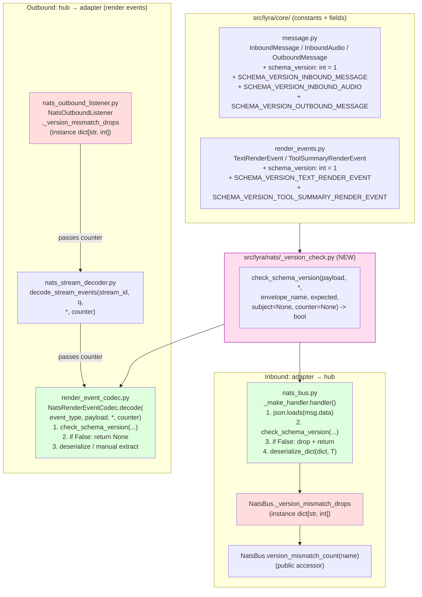
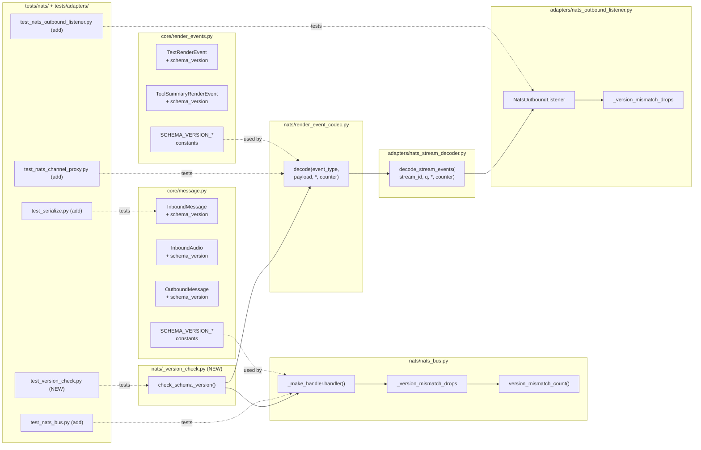

## Summary

Add a `schema_version: int = 1` field to all 5 hub↔adapter envelope dataclasses, implement a caller-owned `check_schema_version` helper, and wire it into `NatsBus` (inbound) and `NatsRenderEventCodec` via `decode_stream_events` (outbound) so a receiver reading a payload with a higher version than it was compiled against **drops the message with a loud ERROR log + in-process counter increment** instead of silently misinterpreting fields.

## Architecture

### Data flow



### File × function map



## Agents

| Agent | Files owned | Task count |
|---|---|---|
| `backend-dev` | `src/lyra/core/message.py`, `src/lyra/core/render_events.py`, `src/lyra/nats/_version_check.py`, `src/lyra/nats/nats_bus.py`, `src/lyra/nats/render_event_codec.py`, `src/lyra/adapters/nats_stream_decoder.py`, `src/lyra/adapters/nats_outbound_listener.py` | 10 |
| `tester` | `tests/nats/test_version_check.py`, `tests/nats/test_serialize.py` (or nearest existing), `tests/nats/test_nats_bus.py`, `tests/nats/test_nats_channel_proxy.py`, `tests/adapters/test_nats_outbound_listener.py` | 8 |
| `doc-writer` | `docs/ARCHITECTURE.md` | 2 |

Single agent per domain (F-lite default). No intra-domain parallelism.

## Reference Patterns

| Topic | Reference |
|---|---|
| Dataclass field + module constant | `src/lyra/core/message.py` existing `GENERIC_ERROR_REPLY`, `Platform` enum — shows top-of-module constant placement |
| Helper module in `nats/` with tests | `src/lyra/nats/_sanitize.py` ↔ `tests/nats/test_sanitize.py` — lean module + focused unit tests |
| Pre-parse JSON before deserialize | `src/lyra/nats/render_event_codec.py:47` — already does `json.loads(serialize(...).decode(...))` round-trip pattern |
| Handler drop-and-log in nats_bus | `src/lyra/nats/nats_bus.py:225-247` — existing `handler()` with `try/except Exception` + `log.exception` |
| Caller-owned counter propagation | `src/lyra/adapters/nats_stream_decoder.py:28` — already takes `q: asyncio.Queue` as parameter, easy to add `counter` kwarg |
| Round-trip serialization test | `tests/nats/test_serialize_outbound.py` — round-trip pattern for OutboundMessage |
| NATS publish/subscribe test | `tests/nats/test_nats_bus.py` — integration test setup with nats-server fixture |

## Consistency Report

| Spec trace | Plan coverage |
|---|---|
| SC-1: 5 envelopes get `schema_version: int = 1` | MT-1, MT-2 |
| SC-2: Module-level `SCHEMA_VERSION_*` constants | MT-1, MT-2 |
| SC-3: `_version_check.py` exports `check_schema_version(...)` | MT-3 |
| SC-4: Legacy payload round-trips cleanly | MT-6 |
| SC-5: `NatsBus` handler drops v2 against v1 | MT-8, MT-12 |
| SC-6: `NatsBus` handler accepts matching version | MT-8, MT-12 |
| SC-7: `NatsBus` handler accepts legacy (no field) | MT-8, MT-12 |
| SC-8: `RenderEventCodec.decode()` drops v2 text branch | MT-9, MT-13 |
| SC-9: `RenderEventCodec.decode()` drops v2 tool_summary branch | MT-9, MT-13 |
| SC-10: Version-mismatch drop does not raise/stall | MT-12 (mixed-batch test) |
| SC-11: `NatsBus.version_mismatch_count(name)` public method | MT-8, MT-12 |
| SC-11b: Codec counter is caller-owned (no static state) | MT-9, MT-13, MT-14 |
| SC-12: ARCHITECTURE.md schema-versioning subsection | MT-15 |
| SC-13: ARCHITECTURE.md numbered bump procedure | MT-15 |

**Coverage:** 13/13 success criteria · **Untraced tasks:** 0 · **Exemptions:** 0

## Micro-Tasks

### Slice 1 — Version field + helper (foundation, no call sites)

**MT-1 · Add `schema_version` field + constants to `core/message.py`** [backend-dev] [SC-1, SC-2] [V1] [GREEN] [diff: 2]
- File: `src/lyra/core/message.py`
- Add at top (after existing `GENERIC_ERROR_REPLY`):
  ```python
  SCHEMA_VERSION_INBOUND_MESSAGE = 1
  SCHEMA_VERSION_INBOUND_AUDIO = 1
  SCHEMA_VERSION_OUTBOUND_MESSAGE = 1
  ```
- Add `schema_version: int = 1` as the **first** field of each dataclass (after docstring, before existing fields) on: `InboundMessage`, `InboundAudio`, `OutboundMessage`.
- Verify: `python -c "from lyra.core.message import InboundMessage, SCHEMA_VERSION_INBOUND_MESSAGE; m = InboundMessage(id='x', platform='telegram', bot_id='main', scope_id='s', user_id='u', user_name='n', is_mention=False, text='', text_raw='', trust_level=__import__('lyra.core.trust', fromlist=['TrustLevel']).TrustLevel.PUBLIC); assert m.schema_version == 1 == SCHEMA_VERSION_INBOUND_MESSAGE"`
- Est: 5 min

**MT-2 · Add `schema_version` field + constants to `core/render_events.py`** [backend-dev] [SC-1, SC-2] [V1] [GREEN] [diff: 2]
- File: `src/lyra/core/render_events.py`
- Add at top:
  ```python
  SCHEMA_VERSION_TEXT_RENDER_EVENT = 1
  SCHEMA_VERSION_TOOL_SUMMARY_RENDER_EVENT = 1
  ```
- Add `schema_version: int = 1` as the **first** field on `TextRenderEvent` and `ToolSummaryRenderEvent` (both frozen dataclasses — field must come before defaults with factories; since `schema_version` itself has a default, all current fields already have defaults or can stay where they are — verify field ordering).
- Extend `__all__` to include both new constants.
- Verify: `python -c "from lyra.core.render_events import TextRenderEvent, SCHEMA_VERSION_TEXT_RENDER_EVENT; e = TextRenderEvent(text='hi', is_final=True); assert e.schema_version == 1"`
- Est: 5 min

**MT-3 · Create `src/lyra/nats/_version_check.py`** [backend-dev] [SC-3] [V1] [GREEN] [diff: 3]
- File: `src/lyra/nats/_version_check.py` (NEW)
- Exports a single function:
  ```python
  def check_schema_version(
      payload: dict,
      *,
      envelope_name: str,
      expected: int,
      subject: str | None = None,
      counter: dict[str, int] | None = None,
  ) -> bool:
      """Return True if payload is acceptable for this receiver; drop + log + count otherwise.

      Rules:
      - Missing field → treated as version 1 (legacy backwards compat).
      - Non-int value (string, null, float) → dropped.
      - Integer <= 0 → dropped.
      - Integer > expected → dropped (forward-compat violation).
      - Integer in [1, expected] → accepted.
      """
  ```
- Log line format on drop:
  ```
  log.error(
      "NATS schema version mismatch — dropping message: envelope=%s "
      "payload_version=%r expected=%d subject=%s",
      envelope_name, raw_version, expected, subject or "<unknown>",
  )
  ```
- On drop, if `counter is not None`: `counter[envelope_name] = counter.get(envelope_name, 0) + 1`.
- Verify: `python -c "from lyra.nats._version_check import check_schema_version; c={}; assert check_schema_version({'schema_version': 1}, envelope_name='X', expected=1, counter=c) is True; assert c == {}; assert check_schema_version({'schema_version': 2}, envelope_name='X', expected=1, counter=c) is False; assert c == {'X': 1}"`
- Est: 10 min

**MT-4 · Unit tests for `check_schema_version` helper** [tester] [SC-3] [V1] [RED] [diff: 2] [P]
- File: `tests/nats/test_version_check.py` (NEW)
- Test cases (8 total):
  1. `check({}, envelope_name="A", expected=1)` → True (legacy absent → v1)
  2. `check({"schema_version": 1}, ..., expected=1)` → True (exact match)
  3. `check({"schema_version": 1}, ..., expected=2)` → True (receiver newer)
  4. `check({"schema_version": 2}, ..., expected=1)` → False (receiver older)
  5. `check({"schema_version": "1"}, ..., expected=1)` → False (string → malformed)
  6. `check({"schema_version": None}, ..., expected=1)` → False (null → malformed)
  7. `check({"schema_version": 0}, ..., expected=1)` → False (invalid range)
  8. Counter isolation: two separate dicts passed to two calls each get exactly their own counts.
- Verify log emission with `caplog` on drop cases (assert `log.error` fired once with expected substring).
- Verify: `uv run pytest tests/nats/test_version_check.py -xvs`
- Est: 10 min
- `[P]` with MT-5, MT-6 after MT-3 lands.

**MT-5 · Legacy round-trip serialization test** [tester] [SC-4] [V1] [RED] [diff: 1] [P]
- File: `tests/nats/test_serialize.py` if present, otherwise `tests/nats/test_serialize_outbound.py`. Pick whichever test file already exercises `serialize` / `deserialize` round-trips for an envelope type.
- Test: construct an `InboundMessage` **without** setting `schema_version` (rely on default), `serialize()` it, `deserialize()` it back → assert reconstructed `.schema_version == 1`. Repeat for `OutboundMessage`, `TextRenderEvent`, `ToolSummaryRenderEvent`, `InboundAudio`.
- Parametrize over all 5 envelope types.
- Verify: `uv run pytest tests/nats/test_serialize*.py -k schema_version -xvs`
- Est: 5 min
- `[P]` with MT-4, MT-6.

**MT-6 · RED-GATE 1 — All Slice 1 tests green** [backend-dev] [V1] [RED-GATE] [diff: 1]
- Verify: `uv run pytest tests/nats/test_version_check.py tests/nats/test_serialize*.py -x 2>&1 | tail -20`
- Expected: all tests pass. No call sites touched yet — `NatsBus` and `NatsRenderEventCodec` still behave identically to before. In-flight NATS messages are still decoded cleanly.
- Blocks: Slice 2, Slice 3, Slice 4.

### Slice 2 — NatsBus handler wiring

**MT-7 · Wire version check into `nats_bus.py`** [backend-dev] [SC-5, SC-6, SC-7, SC-11] [V2] [GREEN] [diff: 3]
- File: `src/lyra/nats/nats_bus.py`
- Changes:
  1. Import helper + constants at top: `from lyra.nats._version_check import check_schema_version`, `from lyra.nats._serialize import deserialize_dict` (replacing bare `deserialize`), and the 2 inbound constants from `lyra.core.message`.
  2. In `NatsBus.__init__`, add: `self._version_mismatch_drops: dict[str, int] = {}`.
  3. Add a mapping (module-level or `_item_type_version` helper) from `item_type` → `(envelope_name, expected_version)`:
     ```python
     _VERSIONS = {
         InboundMessage: ("InboundMessage", SCHEMA_VERSION_INBOUND_MESSAGE),
         InboundAudio:   ("InboundAudio",   SCHEMA_VERSION_INBOUND_AUDIO),
     }
     ```
     (`OutboundMessage` is never consumed by `NatsBus` — it's outbound; but include it if `NatsBus` is ever parameterized for it in tests. Verify by reading `bootstrap/` for `NatsBus` instantiations first.)
  4. Rewrite `_make_handler.handler()`:
     ```python
     async def handler(msg: Msg) -> None:
         try:
             payload = json.loads(msg.data.decode("utf-8"))
         except Exception:
             log.exception("NatsBus: failed to parse JSON on ...")
             return
         name, expected = _VERSIONS[self._item_type]
         if not check_schema_version(
             payload,
             envelope_name=name,
             expected=expected,
             subject=subject,
             counter=self._version_mismatch_drops,
         ):
             return
         try:
             item = deserialize_dict(payload, self._item_type)
             ... (rest unchanged: sanitize + staging.put_nowait)
         except asyncio.QueueFull:
             ...
         except Exception:
             log.exception(...)
     ```
  5. Add public accessor:
     ```python
     def version_mismatch_count(self, envelope_name: str) -> int:
         """Return cumulative count of dropped messages for the given envelope type."""
         return self._version_mismatch_drops.get(envelope_name, 0)
     ```
- Verify: `uv run ruff check src/lyra/nats/nats_bus.py && uv run mypy src/lyra/nats/nats_bus.py`
- Est: 15 min

**MT-8 · Integration tests for `NatsBus` version mismatch** [tester] [SC-5, SC-6, SC-7, SC-10, SC-11] [V2] [RED] [diff: 3] [P]
- File: `tests/nats/test_nats_bus.py` (add new test class or block)
- Test cases:
  1. `test_version_match_accepts`: publish a v1 `InboundMessage` → assert it reaches staging, counter unchanged.
  2. `test_legacy_payload_accepts`: publish a dict without `schema_version` (manually crafted JSON, not a dataclass) → assert it reaches staging, counter unchanged.
  3. `test_version_mismatch_drops`: publish a dict with `schema_version=2` → assert staging queue receives nothing, `bus.version_mismatch_count("InboundMessage") == 1`, `log.error` fired once (use `caplog`).
  4. `test_mixed_batch_survives`: publish `[v1, v2_bad, v1]` in sequence → assert staging receives exactly 2 messages (both v1s), counter is `{"InboundMessage": 1}`, subscription still alive for a subsequent v1 publish.
  5. `test_subscription_does_not_close`: after mismatch drop, publish another v1 and assert it still arrives (no leaked `await sub.unsubscribe()`).
- Reuse existing nats-server fixture from `tests/nats/conftest.py`.
- Verify: `uv run pytest tests/nats/test_nats_bus.py -k "version or mismatch" -xvs`
- Est: 20 min
- `[P]` with MT-7 on a separate branch; merge-order: MT-7 before MT-8 runs green.

**MT-9 · RED-GATE 2 — Slice 2 green + Slice 1 still green** [backend-dev] [V2] [RED-GATE] [diff: 1]
- Verify: `uv run pytest tests/nats/test_nats_bus.py tests/nats/test_version_check.py tests/nats/test_serialize*.py -x 2>&1 | tail -20`
- Expected: all pass, all pre-existing `test_nats_bus.py` tests still green (no regression).
- Blocks: Slice 3.

### Slice 3 — RenderEventCodec + stream decoder + listener wiring

**MT-10 · Add counter kwarg + version check to `render_event_codec.py`** [backend-dev] [SC-8, SC-9, SC-11b] [V3] [GREEN] [diff: 3]
- File: `src/lyra/nats/render_event_codec.py`
- Changes:
  1. Import `check_schema_version` + both render-event constants.
  2. Change signature: `def decode(event_type: str, payload: dict, *, counter: dict[str, int] | None = None) -> RenderEvent | None:`
  3. In the `text` branch: before `return deserialize(...)`, call `check_schema_version(payload, envelope_name="TextRenderEvent", expected=SCHEMA_VERSION_TEXT_RENDER_EVENT, counter=counter)`. Return `None` on False.
  4. In the `tool_summary` branch: same check (using `SCHEMA_VERSION_TOOL_SUMMARY_RENDER_EVENT`) **before** the manual `files_raw = payload.get("files", {})` line. Return `None` on False.
  5. `encode()` and `is_terminal()` are unchanged.
- Verify: `uv run ruff check src/lyra/nats/render_event_codec.py && uv run mypy src/lyra/nats/render_event_codec.py`
- Est: 8 min

**MT-11 · Add counter kwarg to `decode_stream_events`** [backend-dev] [SC-8, SC-9, SC-11b] [V3] [GREEN] [diff: 2]
- File: `src/lyra/adapters/nats_stream_decoder.py`
- Change signature: `async def decode_stream_events(stream_id: str, q: asyncio.Queue[dict], *, counter: dict[str, int] | None = None) -> AsyncIterator["RenderEvent"]:`
- Pass through on line 75: `event = NatsRenderEventCodec.decode(event_type, payload, counter=counter)`
- Verify: `uv run ruff check src/lyra/adapters/nats_stream_decoder.py`
- Est: 3 min

**MT-12 · Wire counter into `NatsOutboundListener`** [backend-dev] [SC-11b] [V3] [GREEN] [diff: 3]
- File: `src/lyra/adapters/nats_outbound_listener.py`
- Changes:
  1. In `__init__`, add: `self._version_mismatch_drops: dict[str, int] = {}`.
  2. Find the call site of `decode_stream_events(stream_id, q)` (around line 262) → change to `decode_stream_events(stream_id, q, counter=self._version_mismatch_drops)`.
  3. Add a public accessor `version_mismatch_count(envelope_name: str) -> int` mirroring `NatsBus`.
- Verify: `uv run ruff check src/lyra/adapters/nats_outbound_listener.py && uv run pytest tests/adapters/test_nats_outbound_listener.py -x 2>&1 | tail -10`
- Est: 10 min

**MT-13 · Codec-level version mismatch tests (text + tool_summary)** [tester] [SC-8, SC-9, SC-11b] [V3] [RED] [diff: 3] [P]
- File: `tests/nats/test_nats_channel_proxy.py` (add new test class) OR if cleaner, a new `tests/nats/test_render_event_codec.py`.
- Test cases (6 total):
  1. `test_text_match_decodes`: `decode("text", {"schema_version": 1, "text": "hi", "is_final": True}, counter={})` → returns `TextRenderEvent(...)`.
  2. `test_text_legacy_decodes`: `decode("text", {"text": "hi", "is_final": True}, counter={})` → returns `TextRenderEvent` (no schema_version → v1).
  3. `test_text_mismatch_drops`: `decode("text", {"schema_version": 2, ...}, counter=c)` → returns `None`, `c == {"TextRenderEvent": 1}`, `log.error` fired.
  4. `test_tool_summary_match_decodes`: v1 tool_summary → returns `ToolSummaryRenderEvent`.
  5. `test_tool_summary_mismatch_drops`: v2 tool_summary → returns `None`, counter incremented, **manual `payload.get("files", ...)` block is NOT executed** (verify by passing a malformed `files` value that would otherwise raise — a passing test proves the check short-circuits before extraction).
  6. `test_counter_isolation`: two separate counter dicts → no cross-talk.
- Verify: `uv run pytest tests/nats/test_nats_channel_proxy.py -k "version or mismatch or schema" -xvs`
- Est: 15 min
- `[P]` with MT-14.

**MT-14 · Listener-level counter integration test** [tester] [SC-11b] [V3] [RED] [diff: 2] [P]
- File: `tests/adapters/test_nats_outbound_listener.py` (add test)
- Test case: build a `NatsOutboundListener` with a stubbed hub. Feed it a stream where one chunk carries a v2 `text` payload. Assert `listener._version_mismatch_drops == {"TextRenderEvent": 1}` after the drain loop completes, and that subsequent v1 chunks still decode normally.
- Reuse existing listener fixtures.
- Verify: `uv run pytest tests/adapters/test_nats_outbound_listener.py -k version -xvs`
- Est: 10 min
- `[P]` with MT-13.

**MT-15 · RED-GATE 3 — Full test suite green** [backend-dev] [V3] [RED-GATE] [diff: 1]
- Verify: `uv run pytest tests/nats tests/adapters -x 2>&1 | tail -30`
- Expected: all pass, no regressions anywhere in `tests/nats/` or `tests/adapters/`.
- Blocks: Slice 4 (docs can also parallelize with Slice 2/3; here it's sequenced after to avoid doc drift).

### Slice 4 — Documentation

**MT-16 · Add schema versioning section to `docs/ARCHITECTURE.md`** [doc-writer] [SC-12, SC-13] [V4] [GREEN] [diff: 2]
- File: `docs/ARCHITECTURE.md`
- Locate the existing NATS wire format section (or closest equivalent — verify first). Add a new `### Schema versioning` subsection containing:
  1. **What it is:** "Every hub↔adapter envelope (`InboundMessage`, `InboundAudio`, `OutboundMessage`, `TextRenderEvent`, `ToolSummaryRenderEvent`) carries a `schema_version: int = 1` field. Current version for each envelope lives in a `SCHEMA_VERSION_*` module-level constant in `core/message.py` and `core/render_events.py`."
  2. **Forward-compat rule:** "A receiver accepts any `payload.schema_version <= expected`. Strictly-greater versions are dropped with an ERROR log and an in-process counter increment via `check_schema_version` in `nats/_version_check.py`. Legacy payloads (no field) default to version 1."
  3. **Why (design intent):** "Versioning does not enable rolling deploys across breaking changes — coordinated deploy of all 3 processes is still required. It exists to make failures **loud** instead of silent."
  4. **Numbered bump procedure:**
     ```
     1. Bump the SCHEMA_VERSION_<ENVELOPE> constant in core/message.py or core/render_events.py by 1.
     2. Update the dataclass field default on the corresponding envelope to match.
     3. Coordinate a simultaneous deploy of lyra_hub + lyra_telegram + lyra_discord. Rolling deploys across a version bump will produce loud ERROR logs on the still-v1 receivers until they are upgraded.
     4. Verify the bump with: `grep SCHEMA_VERSION_ src/lyra/core/*.py`.
     ```
- Verify: `grep -c "schema_version" docs/ARCHITECTURE.md` should return ≥4; `grep -A2 "^1\. Bump" docs/ARCHITECTURE.md` should show the numbered procedure.
- Est: 15 min

**MT-17 · RED-GATE 4 — Final verification** [backend-dev] [V4] [RED-GATE] [diff: 1]
- Verify:
  1. `uv run pytest tests/nats tests/adapters -x`
  2. `uv run ruff check src/lyra tests`
  3. `uv run mypy src/lyra/nats src/lyra/core/message.py src/lyra/core/render_events.py src/lyra/adapters/nats_outbound_listener.py src/lyra/adapters/nats_stream_decoder.py`
  4. `grep -n "schema_version" docs/ARCHITECTURE.md`
- Expected: all lint/type checks pass, all 13 SC covered, docs contains the section.

## Parallelization Hints

- **Within Slice 1:** MT-4 [P], MT-5 [P], MT-6 [P] — all read-only tests runnable in parallel once MT-3 lands.
- **Slice 2 and Slice 3** both depend only on Slice 1. After MT-6 passes, they could theoretically run on parallel branches and merge separately. For this F-lite we ship them in a single PR sequentially to minimize review overhead.
- **Slice 4 (docs)** is fully parallel with Slice 2 and Slice 3 after Slice 1 — no code dependency.

## Risks + Mitigations

| Risk | Mitigation |
|---|---|
| `NatsBus` uses `deserialize(raw_bytes, T)` today; switching to `deserialize_dict(dict, T)` after `json.loads` changes the error surface (e.g. bytes decode errors bubble differently) | Wrap `json.loads` in its own `try/except` (see MT-7 code); existing `log.exception` still catches downstream failures. Covered by MT-8 regression case. |
| `_item_type` → `(name, expected)` mapping forgets an envelope used by `NatsBus` | MT-7 step 3 requires reading `bootstrap/` to enumerate every `NatsBus(... item_type=X)` call before writing the mapping. Make the mapping a `dict` not a tuple so missing keys raise `KeyError` loudly in tests. |
| `frozen=True` dataclass field ordering — adding `schema_version` as first field breaks positional constructors in existing test code | Use keyword-only construction everywhere new; existing call sites use kwargs (verified in `tests/nats/conftest.py` — no positional construction). Add `schema_version` AFTER all non-default fields if positional use is found. |
| `ToolSummaryRenderEvent` manual-decode path silently misses the check | Explicit check-before-extraction in MT-10 step 4; MT-13 test case 5 proves short-circuit works (malformed `files` raises iff check skipped). |
| Counter dicts accumulate across long-running process lifetimes → memory leak | Keyed by envelope name (bounded set of ~5 keys). Not a leak. |
| JSON null / non-int `schema_version` sneaks through | MT-3 helper treats non-int as drop; MT-4 tests 5, 6, 7 cover null, string, negative. |

## Definition of Done

All checkboxes from the spec's Success Criteria section green:
- [ ] SC-1 through SC-13 from spec verified by tests or presence check (see Consistency Report above).
- [ ] All RED-GATEs passed (MT-6, MT-9, MT-15, MT-17).
- [ ] `uv run pytest tests/nats tests/adapters` green.
- [ ] `uv run ruff check src/lyra tests` clean.
- [ ] `uv run mypy` on touched modules clean.
- [ ] PR opened, linked to #530, CI green, code review complete.
