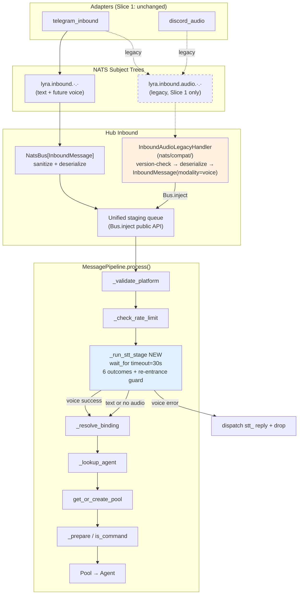
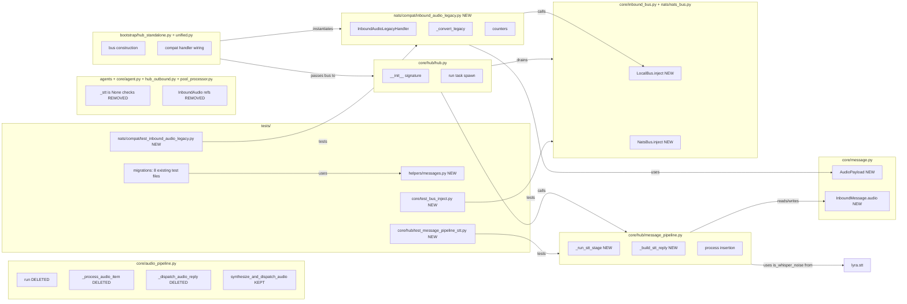

## Summary

Slice 1 of the #534 refactor: unify hub-side inbound processing by folding `InboundAudio` fields into `InboundMessage(modality="voice", audio=AudioPayload)`, inserting an STT stage into `MessagePipeline`, deleting the bespoke `AudioPipeline.run()` consumer loop, and adding an `InboundAudioLegacyHandler` compat shim so adapters on stale code continue to work during deployment. Slice 2 (adapter migration + legacy removal) is deferred until Deploy Gate 2 conditions are met in production.

## Architecture

### Data flow (post-Slice-1)



### File × Function map (Slice 1 touchpoints)



## Bootstrap Context

- **Analysis:** `artifacts/analyses/534-unify-inbound-audio-analysis.mdx` — Shape B recommended; 10 open unknowns resolved.
- **Spec:** `artifacts/specs/534-unify-inbound-audio-spec.mdx` — approved 2026-04-05; 27 Slice 1 success criteria + deploy gates.
- **Expert validations (spec phase):**
  - Architect: stage insertion is a 2-line insert after `message_pipeline.py:137`. `dispatch_response` from pipeline is safe (established pattern — `hub_outbound.py:140-158`). NATS subject trees `lyra.inbound.*` and `lyra.inbound.audio.*` are disjoint (literal subjects, no wildcard overlap). Frozen dataclass field ordering safe (append after existing defaulted fields).
  - `_staging` is private on both `NatsBus` and `LocalBus` → Slice 1 MUST add a public `Bus.inject()` method (captured in micro-tasks).
- **Reference patterns:**
  - STT stage pattern: `core/hub/message_pipeline.py:134-137` (`_check_rate_limit`) — return `PipelineResult | None`, `None` = continue.
  - Synthetic reply construction: current `core/audio_pipeline.py:283-314` (`_dispatch_audio_reply`) — preserve bit-for-bit before deleting.
  - STT call semantics: current `core/audio_pipeline.py:193-281` (`_process_audio_item`) — preserve all 5 failure modes + transcript echo.
  - NATS raw subscription pattern: `nats_bus.py:246` (subject construction) and `nats_bus.py:260-268` (version check wiring).
- **Existing `InboundAudio(` test constructors (8 total):** `tests/adapters/test_outbound_listener_protocol.py:37`, `tests/core/test_inbound_audio_bus.py:17`, `tests/core/conftest.py:764`, `tests/core/test_hub_audio_loop.py:30`, `tests/core/test_routing_context_basics.py:93,109`, `tests/nats/test_sanitize.py:171`, `tests/nats/test_serialize_outbound.py:253`.

## Agents

| Agent | Task count | Files |
|---|---|---|
| backend-dev | 17 | `core/message.py`, `core/inbound_bus.py`, `nats/nats_bus.py`, `nats/compat/**` (new), `core/hub/message_pipeline.py`, `core/hub/hub.py`, `core/audio_pipeline.py`, `bootstrap/hub_standalone.py`, `bootstrap/unified.py`, `agents/anthropic_agent.py`, `agents/simple_agent.py`, `core/agent.py`, `core/hub/hub_outbound.py`, `core/pool/pool_processor.py` |
| architect | 1 (review-only) | `nats/compat/inbound_audio_legacy.py` spot-review after backend-dev completes the module |
| tester | 11 | `tests/helpers/messages.py` (new), `tests/core/hub/test_message_pipeline_stt.py` (new), `tests/nats/compat/test_inbound_audio_legacy.py` (new), `tests/core/test_bus_inject.py` (new), `tests/integration/test_voice_end_to_end.py`, migration of 8 existing test files |

## Consistency Report

| Metric | Value |
|---|---|
| Spec Slice 1 success criteria (SC) | 27 |
| SC covered by ≥1 micro-task | 27 |
| SC uncovered | 0 |
| Micro-tasks with spec_trace | 28 / 28 |
| Untraced micro-tasks | 0 |
| Exemptions | Slice 2 SC (17) — explicitly deferred per Deploy Gate 2 |

## Micro-Tasks

Legend: `[P]` = parallel-safe within its phase. Difficulty 1 (trivial) → 5 (hard). Phases: RED (failing tests first), GREEN (implementation), REFACTOR (cleanup), RED-GATE (sentinel — all tests must pass).

---

### Phase RED-1 — Test scaffolding (TDD RED)

#### T1 — Create test helpers module
- **Files:** `tests/helpers/__init__.py` (new, empty), `tests/helpers/messages.py` (new)
- **Snippet:**
  ```python
  def make_text_message(**overrides) -> InboundMessage: ...
  def make_voice_message(*, audio_bytes: bytes = b"fake", **overrides) -> InboundMessage: ...
  ```
- **Verify:** `python -c "from tests.helpers.messages import make_voice_message, make_text_message; print('ok')"`
- **Expected:** `ok`
- **Time:** 5 min · **Difficulty:** 2 · **Agent:** tester · **Spec trace:** SC-Slice1-"tests/helpers/messages.py exports" · **[P]**

#### T2 — Write failing STT stage unit tests
- **Files:** `tests/core/hub/test_message_pipeline_stt.py` (new)
- **Tests:** `test_stt_stage_skips_if_modality_not_voice`, `test_stt_stage_skips_if_text_already_populated`, `test_stt_stage_unsupported_when_stt_none`, `test_stt_stage_unavailable_when_STTUnavailableError`, `test_stt_stage_noise_when_is_whisper_noise`, `test_stt_stage_invalid_when_slash_prefix`, `test_stt_stage_invalid_when_over_length`, `test_stt_stage_failed_on_unexpected_exception`, `test_stt_stage_timeout_dispatches_stt_failed`, `test_stt_stage_success_populates_text_strips_audio_echoes_transcript`
- **Verify:** `uv run pytest tests/core/hub/test_message_pipeline_stt.py -x 2>&1 | tail -5`
- **Expected:** tests collected, fail with `AttributeError: ..._run_stt_stage` or `ImportError: AudioPayload`
- **Time:** 10 min · **Difficulty:** 3 · **Agent:** tester · **Spec trace:** SC-"Unit tests cover all 6 STT stage outcomes" + SC-"STT stage wraps hub._stt.transcribe in asyncio.wait_for" · **[P]**

#### T3 — Write failing compat shim unit tests
- **Files:** `tests/nats/compat/__init__.py` (new, empty), `tests/nats/compat/test_inbound_audio_legacy.py` (new)
- **Tests:** `test_legacy_handler_decodes_and_injects`, `test_legacy_handler_version_mismatch_drops_and_counts`, `test_legacy_handler_decode_error_counts`, `test_legacy_handler_converts_InboundAudio_to_InboundMessage_voice`, `test_legacy_handler_injects_via_public_Bus_inject`
- **Verify:** `uv run pytest tests/nats/compat/test_inbound_audio_legacy.py -x 2>&1 | tail -5`
- **Expected:** tests collected, fail with `ModuleNotFoundError: lyra.nats.compat`
- **Time:** 10 min · **Difficulty:** 3 · **Agent:** tester · **Spec trace:** SC-"src/lyra/nats/compat/inbound_audio_legacy.py exists" + SC-"Legacy handler calls check_schema_version" · **[P]**

#### T4 — Write failing bus inject API unit tests
- **Files:** `tests/core/test_bus_inject.py` (new)
- **Tests:** `test_local_bus_inject_enqueues_item`, `test_nats_bus_inject_enqueues_item_bypassing_nats`, `test_inject_preserves_order_with_nats_ingestion`
- **Verify:** `uv run pytest tests/core/test_bus_inject.py -x 2>&1 | tail -5`
- **Expected:** tests fail with `AttributeError: 'LocalBus' object has no attribute 'inject'`
- **Time:** 8 min · **Difficulty:** 2 · **Agent:** tester · **Spec trace:** SC-"LocalBus.inject(item) and NatsBus.inject(item) public methods exist" · **[P]**

---

### Phase GREEN-1a — Types

#### T5 — Add `AudioPayload` frozen dataclass
- **File:** `src/lyra/core/message.py`
- **Snippet (insert after `InboundAudio` class or before it):**
  ```python
  @dataclass(frozen=True)
  class AudioPayload:
      audio_bytes: bytes
      mime_type: str
      duration_ms: int | None = None
      file_id: str | None = None
      waveform_b64: str | None = None
  ```
- **Verify:** `python -c "from lyra.core.message import AudioPayload; p = AudioPayload(audio_bytes=b'x', mime_type='audio/ogg'); print(p)"`
- **Expected:** `AudioPayload(audio_bytes=b'x', mime_type='audio/ogg', duration_ms=None, file_id=None, waveform_b64=None)`
- **Time:** 4 min · **Difficulty:** 1 · **Agent:** backend-dev · **Spec trace:** SC-"AudioPayload frozen dataclass exists" · Blocked by: T2

#### T6 — Add `audio: AudioPayload | None` field to `InboundMessage`
- **File:** `src/lyra/core/message.py`
- **Snippet (append after `processor_enriched: bool = False` at line 105):**
  ```python
      audio: "AudioPayload | None" = None
  ```
- **Verify:** `python -c "from lyra.core.message import InboundMessage, AudioPayload; m = InboundMessage(id='1', platform='telegram', bot_id='b', scope_id='s', user_id='u', user_name='U', is_mention=False, text='', text_raw='', trust_level=__import__('lyra.core.trust', fromlist=['TrustLevel']).TrustLevel.PUBLIC, modality='voice', audio=AudioPayload(audio_bytes=b'x', mime_type='audio/ogg')); print(m.audio.mime_type)"`
- **Expected:** `audio/ogg`
- **Time:** 3 min · **Difficulty:** 1 · **Agent:** backend-dev · **Spec trace:** SC-"InboundMessage.audio: AudioPayload | None field exists" · Blocked by: T5

---

### Phase GREEN-1b — Bus injection API

#### T7 — Add `LocalBus.inject(item)` public method
- **File:** `src/lyra/core/inbound_bus.py`
- **Snippet:**
  ```python
  def inject(self, item: T) -> None:
      """Public injection API for compat shims.

      Bypasses normal put() semantics (trace, metrics) and feeds directly into
      the staging queue. Used by InboundAudioLegacyHandler during Slice 1.
      """
      self._staging.put_nowait(item)
  ```
- **Verify:** `uv run pytest tests/core/test_bus_inject.py::test_local_bus_inject_enqueues_item -x`
- **Expected:** PASSED
- **Time:** 4 min · **Difficulty:** 1 · **Agent:** backend-dev · **Spec trace:** SC-"LocalBus.inject(item: T) -> None exists" · Blocked by: T4 · **[P]**

#### T8 — Add `NatsBus.inject(item)` public method
- **File:** `src/lyra/nats/nats_bus.py`
- **Snippet:**
  ```python
  def inject(self, item: T) -> None:
      """Public injection API for compat shims (see LocalBus.inject)."""
      self._staging.put_nowait(item)
  ```
- **Verify:** `uv run pytest tests/core/test_bus_inject.py::test_nats_bus_inject_enqueues_item_bypassing_nats -x`
- **Expected:** PASSED
- **Time:** 4 min · **Difficulty:** 1 · **Agent:** backend-dev · **Spec trace:** SC-"NatsBus.inject(item: T) -> None exists" · Blocked by: T4 · **[P]**

---

### Phase GREEN-1c — Compat shim (new module)

#### T9 — Create `nats/compat/` package
- **Files:** `src/lyra/nats/compat/__init__.py` (new, with re-export)
- **Snippet:**
  ```python
  from .inbound_audio_legacy import InboundAudioLegacyHandler

  __all__ = ["InboundAudioLegacyHandler"]
  ```
- **Verify:** `python -c "from lyra.nats.compat import InboundAudioLegacyHandler" 2>&1 || echo "expected fail until T10"`
- **Expected:** fail until T10 then pass
- **Time:** 2 min · **Difficulty:** 1 · **Agent:** backend-dev · **Spec trace:** SC-"src/lyra/nats/compat/inbound_audio_legacy.py exists" · Blocked by: T6, T8

#### T10 — Implement `InboundAudioLegacyHandler`
- **File:** `src/lyra/nats/compat/inbound_audio_legacy.py` (new, ~120 LOC)
- **Snippet:**
  ```python
  class InboundAudioLegacyHandler:
      def __init__(self, inbound_bus: NatsBus[InboundMessage], nats_client: Client): ...
      async def start(self) -> None:
          # client.subscribe(subject="lyra.inbound.audio.>", queue="HUB_INBOUND", cb=self._on_message)
          ...
      async def _on_message(self, nats_msg) -> None:
          # 1) parse JSON
          # 2) check_schema_version(payload, "InboundAudio", SCHEMA_VERSION_INBOUND_AUDIO)
          #    mismatch -> inbound_audio_legacy_decode_errors_total += 1; return
          # 3) deserialize_dict(payload, InboundAudio)
          # 4) converted = self._convert_legacy(legacy)
          # 5) self._inbound_bus.inject(converted)
          # 6) inbound_audio_legacy_converted_total += 1
          ...
      @staticmethod
      def _convert_legacy(legacy: InboundAudio) -> InboundMessage:
          return InboundMessage(
              ...,
              modality="voice",
              audio=AudioPayload(audio_bytes=legacy.audio_bytes, mime_type=legacy.mime_type, ...),
          )
  ```
- **Verify:** `uv run pytest tests/nats/compat/test_inbound_audio_legacy.py -x`
- **Expected:** all 5 tests PASSED
- **Time:** 12 min · **Difficulty:** 4 · **Agent:** backend-dev · **Spec trace:** SC-"Legacy handler calls check_schema_version" + SC-"Legacy handler deserializes ... injects via public Bus.inject" + SC-"Legacy handler increments ... counters" · Blocked by: T9

#### T11 — Architect review of compat shim
- **Files:** `src/lyra/nats/compat/inbound_audio_legacy.py`
- **Action:** spot-review for subject wildcard semantics, queue group correctness, NATS client lifecycle (start/stop ordering), JSON parse error handling
- **Verify:** architect agent returns `good` verdict
- **Time:** 5 min · **Difficulty:** 2 · **Agent:** architect (review-only) · **Spec trace:** cross-cutting spec safety · Blocked by: T10

---

### Phase GREEN-1d — STT pipeline stage

#### T12 — Add `_build_stt_reply` helper to `MessagePipeline`
- **File:** `src/lyra/core/hub/message_pipeline.py`
- **Snippet (mirrors current `audio_pipeline.py:_dispatch_audio_reply`):**
  ```python
  def _build_stt_reply(self, msg: InboundMessage, template_key: str, *, reply: bool = True) -> InboundMessage:
      """Construct synthetic InboundMessage to carry stt_* reply back through OutboundDispatcher."""
      meta = dict(msg.platform_meta)
      if not reply:
          meta.pop("message_id", None)
      return dataclasses.replace(msg, text="", text_raw="", audio=None, platform_meta=meta)
  ```
- **Verify:** `uv run pytest tests/core/hub/test_message_pipeline_stt.py::test_stt_stage_unsupported_when_stt_none -x`
- **Expected:** still fail until T13
- **Time:** 5 min · **Difficulty:** 2 · **Agent:** backend-dev · **Spec trace:** SC-"Synthetic reply builder for STT errors" · Blocked by: T6

#### T13 — Implement `_run_stt_stage` method
- **File:** `src/lyra/core/hub/message_pipeline.py`
- **Snippet:**
  ```python
  async def _run_stt_stage(self, msg: InboundMessage) -> PipelineResult | None:
      if msg.modality != "voice":
          return None
      if msg.text:  # re-entrance guard
          return None

      if self._hub._stt is None:
          await self._hub.dispatch_response(self._build_stt_reply(msg, "stt_unsupported", reply=False), Response(content=self._hub._msg_manager.get("stt_unsupported")))
          return _DROP

      timeout_s = getattr(self._hub._stt, "timeout_ms", 30000) / 1000.0
      try:
          # write audio bytes to temp file, then:
          async with _write_temp_audio(msg.audio) as tmp_path:
              result = await asyncio.wait_for(self._hub._stt.transcribe(tmp_path), timeout=timeout_s)
      except asyncio.TimeoutError:
          await self._dispatch_stt_error(msg, "stt_failed")
          return _DROP
      except STTUnavailableError:
          await self._dispatch_stt_error(msg, "stt_unavailable")
          return _DROP
      except Exception:
          log.exception("STT stage unexpected failure for audio %s", msg.id)
          await self._dispatch_stt_error(msg, "stt_failed")
          return _DROP

      transcript = result.text.strip()
      if is_whisper_noise(transcript):
          await self._dispatch_stt_error(msg, "stt_noise")
          return _DROP
      if transcript.startswith("/") or len(transcript) > MAX_TRANSCRIPT_LEN:
          await self._dispatch_stt_error(msg, "stt_invalid")
          return _DROP

      # Echo transcript (informational, reply=False)
      await self._hub.dispatch_response(self._build_stt_reply(msg, "stt_echo", reply=False), Response(content=f"🎤 [voice]: {transcript}"))

      # Rewrite msg with populated text + stripped audio for pipeline continuation
      # NOTE: pipeline must re-assign the caller's local — handled at call site
      msg_updated = dataclasses.replace(msg, text=transcript, text_raw=f"🎤 [voice]: {transcript}", language=result.language, audio=None)
      self._hub._pipeline_msg_rewrite = msg_updated  # call-site reads this (see T14)
      return None
  ```
  Note: the rewrite-via-return mechanism has an API wrinkle — the stage can return `None` to continue, but it also needs to propagate the modified `msg`. Options: (a) pass `msg` by mutable reference (not possible — frozen), (b) the stage returns `msg | PipelineResult` instead of `None | PipelineResult` (breaks stage signature), (c) the call site re-reads the updated msg from a well-known location. Recommendation: change `_run_stt_stage` to return `tuple[InboundMessage, PipelineResult | None]` and handle the tuple at the call site (T14).
- **Verify:** `uv run pytest tests/core/hub/test_message_pipeline_stt.py -x`
- **Expected:** 9 of 10 tests PASSED (success path might still fail until T14 wiring)
- **Time:** 15 min · **Difficulty:** 5 · **Agent:** backend-dev · **Spec trace:** SC-"MessagePipeline.process() invokes _run_stt_stage" + SC-"STT stage wraps ... in asyncio.wait_for" + SC-"STT stage returns a terminal PipelineResult" + SC-"STT stage success path populates ..." · Blocked by: T12

#### T14 — Wire STT stage into `MessagePipeline.process()` call chain
- **File:** `src/lyra/core/hub/message_pipeline.py`
- **Snippet (insert between lines 137 and 139):**
  ```python
  msg, result = await self._run_stt_stage(msg)
  if result is not None:
      self._trace("inbound", "stt", action=result.action.value)
      return result
  ```
- **Verify:** `uv run pytest tests/core/hub/test_message_pipeline_stt.py -x`
- **Expected:** 10 of 10 tests PASSED
- **Time:** 5 min · **Difficulty:** 2 · **Agent:** backend-dev · **Spec trace:** SC-"MessagePipeline.process() invokes _run_stt_stage after _check_rate_limit and before _resolve_binding" · Blocked by: T13

#### T15 — Add STT stage metric counters
- **File:** `src/lyra/core/hub/message_pipeline.py`
- **Snippet:** instrument `_run_stt_stage` with `stt_stage_outcomes_total.inc(labels={"outcome": "success|unsupported|unavailable|noise|invalid|failed"})` and `stt_stage_duration_seconds.observe(elapsed)` (or the project's equivalent counter API — grep `Counter(` / `Histogram(` / observability module for pattern)
- **Verify:** `uv run pytest tests/core/hub/test_message_pipeline_stt.py -x && grep -q "stt_stage_outcomes_total" src/lyra/core/hub/message_pipeline.py && echo ok`
- **Expected:** tests pass + grep finds the counter
- **Time:** 6 min · **Difficulty:** 3 · **Agent:** backend-dev · **Spec trace:** SC-"stt_stage_outcomes_total counter exists" + SC-"stt_stage_duration_seconds histogram exists" · Blocked by: T14

---

### Phase GREEN-1e — AudioPipeline consumer-loop removal

#### T16 — Delete `run()`, `_process_audio_item()`, `_dispatch_audio_reply()`
- **File:** `src/lyra/core/audio_pipeline.py`
- **Action:** delete the three methods and the `class AudioPipeline` docstring reference to the drain loop. Keep `synthesize_and_dispatch_audio()` and any imports it still needs. Update module docstring to note "temporarily contains TTS helper; will be relocated to tts_dispatch.py in Slice 2".
- **Verify:** `grep -q "def run\|def _process_audio_item\|def _dispatch_audio_reply" src/lyra/core/audio_pipeline.py && echo "FAIL" || echo "ok"; grep -q "def synthesize_and_dispatch_audio" src/lyra/core/audio_pipeline.py && echo "ok"`
- **Expected:** `ok` twice
- **Time:** 6 min · **Difficulty:** 2 · **Agent:** backend-dev · **Spec trace:** SC-"AudioPipeline.run(), _process_audio_item(), _dispatch_audio_reply() are deleted" + SC-"synthesize_and_dispatch_audio() is retained" · Blocked by: T15

---

### Phase GREEN-1f — Hub wiring

#### T17 — Drop `inbound_audio_bus` from `Hub.__init__` + remove audio task spawn
- **Files:** `src/lyra/core/hub/hub.py`
- **Action:** narrow constructor signature; delete `self._audio_pipeline = AudioPipeline(...)` and the `_audio_pipeline.run()` task creation in `Hub.run()`. Update internal callsites. Remove `InboundAudio` imports no longer needed.
- **Verify:** `uv run pytest tests/core/test_hub_*.py tests/core/hub/ -x -q 2>&1 | tail -10`
- **Expected:** all hub tests pass (or fail only on AudioPipeline-related tests which will be migrated in T23)
- **Time:** 8 min · **Difficulty:** 3 · **Agent:** backend-dev · **Spec trace:** SC-"Hub.__init__ signature no longer accepts inbound_audio_bus" + SC-"Hub.run() no longer spawns an AudioPipeline consumer task" · Blocked by: T16

---

### Phase GREEN-1g — Bootstrap wiring

#### T18 — Update `hub_standalone.py` — remove audio bus, wire compat handler
- **File:** `src/lyra/bootstrap/hub_standalone.py`
- **Action:** (1) delete `inbound_audio_bus: NatsBus[InboundAudio]` construction at lines 168-174; (2) drop the second argument from the `Hub(...)` call; (3) after `inbound_bus` is connected, instantiate `InboundAudioLegacyHandler(inbound_bus, nats_client)` and call `await handler.start()`; (4) wire graceful shutdown in the lifecycle `stop()` path.
- **Verify:** `uv run pytest tests/bootstrap/test_hub_standalone.py -x 2>&1 | tail -5`
- **Expected:** PASSED (or xfail with a TODO for T19 if tests cross-file)
- **Time:** 8 min · **Difficulty:** 3 · **Agent:** backend-dev · **Spec trace:** SC-"bootstrap/hub_standalone.py no longer constructs inbound_audio_bus" + SC-"bootstrap/hub_standalone.py instantiates InboundAudioLegacyHandler" · Blocked by: T11, T17 · **[P]** (with T19)

#### T19 — Update `unified.py` — same changes as T18
- **File:** `src/lyra/bootstrap/unified.py`
- **Action:** mirror T18 changes in the unified single-process bootstrap.
- **Verify:** `uv run pytest tests/bootstrap/test_unified.py -x 2>&1 | tail -5` (if exists) or import-check
- **Expected:** PASSED
- **Time:** 6 min · **Difficulty:** 2 · **Agent:** backend-dev · **Spec trace:** SC-"bootstrap/unified.py no longer constructs inbound_audio_bus" + SC-"bootstrap/unified.py instantiates InboundAudioLegacyHandler" · Blocked by: T11, T17 · **[P]** (with T18)

---

### Phase GREEN-1h — Agent dead-code + consumer type updates

#### T20 — Remove `_stt is None` checks from agents + update InboundAudio refs
- **Files:** `src/lyra/agents/anthropic_agent.py` (line 169), `src/lyra/agents/simple_agent.py` (lines 208-212), `src/lyra/core/agent.py`
- **Action:** delete the dead `_audio is not None and self._stt is None` branches; remove now-unused `InboundAudio` imports where present. Do NOT remove `InboundAudio` class itself (that's Slice 2).
- **Verify:** `grep -n "_stt is None" src/lyra/agents/anthropic_agent.py src/lyra/agents/simple_agent.py | grep -v "^.*#" | wc -l`
- **Expected:** `0`
- **Time:** 5 min · **Difficulty:** 2 · **Agent:** backend-dev · **Spec trace:** SC-"_stt is None checks removed from agents/anthropic_agent.py:169, agents/simple_agent.py:208-212, and core/agent.py" · Blocked by: T14 · **[P]** (with T21)

#### T21 — Update `InboundAudio` type references in hub/pool consumer modules
- **Files:** `src/lyra/core/hub/hub_outbound.py`, `src/lyra/core/pool/pool_processor.py`
- **Action:** change type hints / isinstance checks that referenced `InboundAudio` to `InboundMessage` with a modality check where needed. Keep `InboundAudio` import only if it's still used for the compat shim round-trip.
- **Verify:** `uv run mypy src/lyra/core/hub/hub_outbound.py src/lyra/core/pool/pool_processor.py 2>&1 | tail -5`
- **Expected:** `Success: no issues found`
- **Time:** 6 min · **Difficulty:** 3 · **Agent:** backend-dev · **Spec trace:** cross-cutting spec: 19 consumer modules migration · Blocked by: T6, T14 · **[P]** (with T20)

---

### Phase GREEN-1i — Test migration (existing `InboundAudio` constructors → `make_voice_message`)

#### T22 — Migrate `tests/core/conftest.py:764`
- **File:** `tests/core/conftest.py`
- **Action:** replace `InboundAudio(...)` at line 764 with `make_voice_message(...)` using appropriate overrides. Update import.
- **Verify:** `uv run pytest tests/core/ -x --collect-only 2>&1 | tail -5`
- **Expected:** collection succeeds
- **Time:** 4 min · **Difficulty:** 2 · **Agent:** tester · **Spec trace:** SC-"All existing tests that construct InboundAudio(...) are migrated" · Blocked by: T1, T6 · **[P]**

#### T23 — Migrate `tests/core/test_hub_audio_loop.py`
- **File:** `tests/core/test_hub_audio_loop.py`
- **Action:** this file tests the deleted `AudioPipeline.run()` loop. Decide per-test: (a) migrate to STT stage test (move to `test_message_pipeline_stt.py`), or (b) delete if redundant with T2. Most likely **delete** after confirming T2 coverage is equivalent.
- **Verify:** `uv run pytest tests/core/hub/test_message_pipeline_stt.py tests/core/test_hub_audio_loop.py -x 2>&1 | tail -5` (or single-file if deleted)
- **Expected:** PASSED
- **Time:** 8 min · **Difficulty:** 3 · **Agent:** tester · **Spec trace:** SC-"AudioPipeline.run() ... deleted" + migration coverage · Blocked by: T16 · **[P]**

#### T24 — Migrate `tests/core/test_inbound_audio_bus.py`
- **File:** `tests/core/test_inbound_audio_bus.py`
- **Action:** this file tests `InboundAudioBus`. In Slice 1, `InboundAudioBus` still exists (Slice 2 deletes it) but the hub no longer uses it. Options: (a) leave file as-is (still valid — bus still exists), (b) migrate to test the compat shim instead. Recommendation: (a) leave + add a skip marker `@pytest.mark.deprecated` with comment pointing to #534 Slice 2.
- **Verify:** `uv run pytest tests/core/test_inbound_audio_bus.py -x 2>&1 | tail -5`
- **Expected:** PASSED (or SKIPPED with deprecation marker)
- **Time:** 4 min · **Difficulty:** 2 · **Agent:** tester · **Spec trace:** SC migration · Blocked by: T1 · **[P]**

#### T25 — Migrate remaining 5 `InboundAudio` test sites
- **Files:** `tests/adapters/test_outbound_listener_protocol.py:37`, `tests/core/test_routing_context_basics.py:93,109`, `tests/nats/test_sanitize.py:171`, `tests/nats/test_serialize_outbound.py:253`
- **Action:** for each, assess whether the test should (a) migrate to `make_voice_message()`, (b) keep as `InboundAudio` because it's testing the legacy envelope path (Slice 2 will remove), or (c) add compat shim round-trip coverage. For `test_sanitize.py` and `test_serialize_outbound.py`, likely keep as legacy (tests cover Slice 2 code still in use). For the others, migrate.
- **Verify:** `uv run pytest tests/adapters/test_outbound_listener_protocol.py tests/core/test_routing_context_basics.py tests/nats/test_sanitize.py tests/nats/test_serialize_outbound.py -x 2>&1 | tail -5`
- **Expected:** PASSED
- **Time:** 10 min · **Difficulty:** 3 · **Agent:** tester · **Spec trace:** SC migration · Blocked by: T1, T6 · **[P]**

#### T26 — End-to-end integration test: legacy subject → compat shim → STT stage → agent reply
- **File:** `tests/integration/test_voice_end_to_end.py` (new or extend existing)
- **Action:** test that publishes a legacy `InboundAudio` JSON to `lyra.inbound.audio.telegram.testbot` via the NATS client, asserts the compat shim converts it, asserts the STT stage transcribes it, asserts the agent receives `InboundMessage` with populated `text` and `audio=None`, asserts transcript echo was sent via outbound dispatcher. Uses fake STT mock.
- **Verify:** `uv run pytest tests/integration/test_voice_end_to_end.py -x 2>&1 | tail -10`
- **Expected:** PASSED
- **Time:** 15 min · **Difficulty:** 5 · **Agent:** tester · **Spec trace:** SC-"End-to-end integration test: Telegram voice note (published to legacy subject) arrives through compat shim → STT stage → agent reply" · Blocked by: T18, T19, T21

---

### Phase REFACTOR-1 — Cleanup

#### T27 — Cross-cutting sanitization assertion test
- **File:** `tests/nats/test_sanitize_single_entry.py` (new) or extend `test_sanitize.py`
- **Action:** add a test that asserts there is exactly one call to `_sanitize_platform_meta` in the inbound hub path regardless of modality. Either unit test with mock + call count, or static grep-based test that scans `src/lyra/nats/` and `src/lyra/core/hub/` for sanitization call sites.
- **Verify:** `uv run pytest tests/nats/test_sanitize_single_entry.py -x`
- **Expected:** PASSED
- **Time:** 8 min · **Difficulty:** 3 · **Agent:** tester · **Spec trace:** cross-cutting SC-"#525 sanitization concern verified eliminated" · Blocked by: T18, T19

---

### Phase RED-GATE-1 — Slice 1 sentinel

#### T28 — Slice 1 sentinel: full quality gate
- **Files:** N/A (cross-cutting)
- **Action:** Run full suite. All Slice 1 success criteria must pass.
- **Verify:**
  ```bash
  uv run ruff check src/ tests/ && \
  uv run mypy src/ && \
  uv run pytest tests/ -x -q && \
  echo "SLICE 1 GREEN"
  ```
- **Expected:** `SLICE 1 GREEN`
- **Time:** 5 min · **Difficulty:** 2 · **Agent:** tester · **Spec trace:** SC-"ruff check + mypy pass on all touched files" + SC-"Full test suite passes" · Blocked by: T22, T23, T24, T25, T26, T27

---

## Slice 2 — Deferred

Slice 2 (adapter migration + legacy removal) is **not** included in this plan. Per spec Deploy Gate 2, Slice 2 cannot be planned until:

- Slice 1 has been live in production for ≥48 hours
- `inbound_audio_legacy_converted_total` is non-zero and incrementing
- `stt_stage_outcomes_total{outcome=success}` rate matches pre-Slice-1 baseline within ±10%
- Zero production alerts from hub related to NATS or STT stage errors

After these conditions are met, re-run `/plan --issue 534` to generate the Slice 2 plan.

## Task IDs

<!-- Generated by /plan. Used by /implement to resume tasks on session restart. -->
- T1: 13 — Create test helpers module (make_voice_message, make_text_message)
- T2: 14 — Write failing STT stage unit tests (10 test cases)
- T3: 15 — Write failing compat shim unit tests
- T4: 16 — Write failing bus inject API unit tests
- T5: 17 — Add AudioPayload frozen dataclass
- T6: 18 — Add audio field to InboundMessage
- T7: 19 — Add LocalBus.inject(item) public method
- T8: 20 — Add NatsBus.inject(item) public method
- T9: 21 — Create nats/compat package __init__
- T10: 22 — Implement InboundAudioLegacyHandler
- T11: 23 — Architect review of compat shim
- T12: 24 — Add _build_stt_reply helper to MessagePipeline
- T13: 25 — Implement _run_stt_stage method
- T14: 26 — Wire STT stage into MessagePipeline.process()
- T15: 27 — Add STT stage metric counters
- T16: 28 — Delete AudioPipeline consumer loop (keep TTS helper)
- T17: 29 — Drop inbound_audio_bus from Hub.__init__ + remove task spawn
- T18: 30 — Update hub_standalone.py — remove audio bus, wire compat handler
- T19: 31 — Update unified.py — mirror T18 changes
- T20: 32 — Remove _stt is None dead-code from agents
- T21: 33 — Update InboundAudio type refs in hub/pool consumer modules
- T22: 34 — Migrate tests/core/conftest.py:764 InboundAudio → make_voice_message
- T23: 35 — Migrate tests/core/test_hub_audio_loop.py
- T24: 36 — Handle tests/core/test_inbound_audio_bus.py
- T25: 37 — Migrate remaining 5 InboundAudio test sites
- T26: 38 — End-to-end integration test — legacy subject → compat shim → STT → agent reply
- T27: 39 — Cross-cutting sanitization single-entry-point assertion test
- T28: 40 — Slice 1 sentinel — full quality gate
