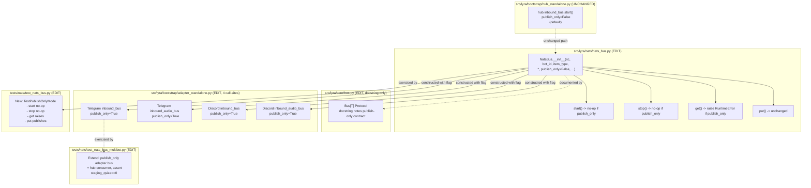
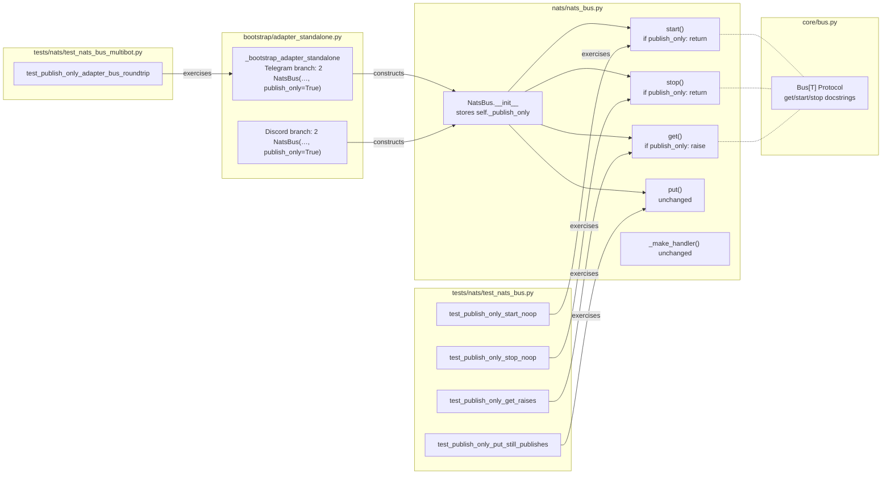

## Summary

Add a `publish_only: bool = False` kwarg to `NatsBus.__init__`. When true,
`start()` / `stop()` become no-ops, `get()` raises `RuntimeError`, and the
staging queue is never touched. Thread the flag through the four adapter
construction sites in `adapter_standalone.py` so Telegram and Discord
adapter processes stop opening useless NATS subscriptions. Hub-side buses
keep default `publish_only=False` — no behavior change there.

## Architecture

### Data Flow



### File × Function Map



## Agents

| Agent | Task count | Files |
|---|---|---|
| backend-dev | 3 (T3, T4, T6) | `src/lyra/nats/nats_bus.py`, `src/lyra/core/bus.py`, `src/lyra/bootstrap/adapter_standalone.py` |
| tester | 4 (T1, T2, T5, R1, R2) | `tests/nats/test_nats_bus.py`, `tests/nats/test_nats_bus_multibot.py` |

## Consistency Report

| Metric | Value |
|---|---|
| Success criteria | 10 |
| Covered by tasks | 10 |
| Uncovered | 0 |
| Untraced tasks | 0 |
| Exemptions | 0 |

| SC # | Criterion | Covered by |
|---|---|---|
| SC-1 | `publish_only` kwarg accepted | T3 |
| SC-2 | `start()` no-op when publish_only | T1, T3 |
| SC-3 | `stop()` no-op when publish_only | T2, T3 |
| SC-4 | `get()` raises `RuntimeError` | T2, T3 |
| SC-5 | `put()` still publishes | T2, T3 |
| SC-6 | 4 adapter call-sites updated | T6, T5 |
| SC-7 | Existing hub-side tests green | R1, R2 |
| SC-8 | New unit tests cover publish-only branches | T1, T2, R1 |
| SC-9 | Integration: staging_qsize stays 0 | T5, R2 |
| SC-10 | Docstring updates | T3, T4 |

## Reference patterns

| Purpose | File | Note |
|---|---|---|
| Existing NatsBus structure | `src/lyra/nats/nats_bus.py` | Keep style consistent — early return in `start()` / `stop()`, raise with clear message in `get()` |
| Bus protocol conventions | `src/lyra/core/bus.py` | Docstring pattern already documents per-impl behavior differences |
| Unit test style | `tests/nats/test_nats_bus.py` | `requires_nats_server` pytest marker, `nc` fixture pattern |
| Multibot integration style | `tests/nats/test_nats_bus_multibot.py` | Helper `_make_msg`, separate consumer bus pattern |
| Adapter bootstrap call-sites | `src/lyra/bootstrap/adapter_standalone.py` | 4 `NatsBus(nc=nc, ...)` constructions at lines 95, 101, 229, 235 (pre-edit) |

## Micro-Tasks

### V1 — Publish-only kwarg + branch logic

#### T1 [RED] [P] — Unit test: `start()` no-op on publish-only bus

- **File:** `tests/nats/test_nats_bus.py`
- **Agent:** tester
- **Spec trace:** SC-2, SC-8
- **Phase:** RED
- **Difficulty:** 2
- **Depends on:** —
- **Code skeleton:**
  ```python
  class TestPublishOnlyMode:
      @requires_nats_server
      async def test_publish_only_start_noop(self, nc: NATS) -> None:
          bus = NatsBus(
              nc=nc, bot_id="main", item_type=InboundMessage,
              publish_only=True,
          )
          bus.register(Platform.TELEGRAM)
          await bus.start()
          assert bus.subscription_count == 0
  ```
- **Verify:** `uv run pytest tests/nats/test_nats_bus.py::TestPublishOnlyMode::test_publish_only_start_noop -xvs`
- **Expected:** RED (publish_only kwarg does not exist yet) → fail with TypeError

#### T2 [RED] [P] — Unit test: `stop` no-op, `get` raises, `put` still publishes

- **File:** `tests/nats/test_nats_bus.py`
- **Agent:** tester
- **Spec trace:** SC-3, SC-4, SC-5, SC-8
- **Phase:** RED
- **Difficulty:** 3
- **Depends on:** —
- **Code skeleton:**
  ```python
  @requires_nats_server
  async def test_publish_only_stop_noop(self, nc: NATS) -> None:
      bus = NatsBus(nc=nc, bot_id="main", item_type=InboundMessage, publish_only=True)
      bus.register(Platform.TELEGRAM)
      await bus.start()
      await bus.stop()  # must not raise

  @requires_nats_server
  async def test_publish_only_get_raises(self, nc: NATS) -> None:
      bus = NatsBus(nc=nc, bot_id="main", item_type=InboundMessage, publish_only=True)
      bus.register(Platform.TELEGRAM)
      with pytest.raises(RuntimeError, match="publish-only"):
          await bus.get()

  @requires_nats_server
  async def test_publish_only_put_still_publishes(self, nc: NATS) -> None:
      # Separate consumer bus receives what publish-only bus puts.
      producer = NatsBus(nc=nc, bot_id="main", item_type=InboundMessage, publish_only=True)
      producer.register(Platform.TELEGRAM)
      await producer.start()  # no-op
      consumer = NatsBus(nc=nc, bot_id="main", item_type=InboundMessage)
      consumer.register(Platform.TELEGRAM)
      await consumer.start()
      try:
          msg = _make_msg()
          await producer.put(Platform.TELEGRAM, msg)
          received = await asyncio.wait_for(consumer.get(), timeout=2.0)
          assert received.id == msg.id
      finally:
          await consumer.stop()
  ```
- **Verify:** `uv run pytest tests/nats/test_nats_bus.py::TestPublishOnlyMode -xvs`
- **Expected:** RED — all 3 tests fail with TypeError on `publish_only=True`

#### T3 [GREEN] — Add `publish_only` kwarg + branch logic in `NatsBus`

- **File:** `src/lyra/nats/nats_bus.py`
- **Agent:** backend-dev
- **Spec trace:** SC-1, SC-2, SC-3, SC-4, SC-5, SC-10
- **Phase:** GREEN
- **Difficulty:** 3
- **Depends on:** T1, T2 (must be RED first)
- **Code skeleton:**
  ```python
  def __init__(
      self,
      nc: NATS,
      bot_id: str,
      item_type: type[T],
      subject_prefix: str = "lyra.inbound",
      *,
      staging_maxsize: int = 500,
      queue_group: str = "",
      publish_only: bool = False,
  ) -> None:
      ...
      self._publish_only = publish_only

  async def start(self) -> None:
      if self._publish_only:
          return
      # existing body unchanged

  async def stop(self) -> None:
      if self._publish_only:
          return
      # existing body unchanged

  async def get(self) -> T:
      if self._publish_only:
          raise RuntimeError(
              "NatsBus.get() called on a publish-only bus — "
              "publish-only buses never consume inbound messages."
          )
      return await self._staging.get()
  ```
  Update the class docstring to document the new mode: `publish_only=True`
  makes `start`/`stop` no-ops, `get` raise, and is intended for adapter-side
  buses that only call `put`. `register()` guard is intentionally left
  unchanged — it checks `self._subscriptions`, which stays empty in
  publish-only mode, so `register` remains callable.
- **Verify:** `uv run pytest tests/nats/test_nats_bus.py::TestPublishOnlyMode -xvs`
- **Expected:** GREEN — all 4 publish-only tests pass

#### T4 [GREEN] [P] — Update `Bus[T]` Protocol docstring

- **File:** `src/lyra/core/bus.py`
- **Agent:** backend-dev
- **Spec trace:** SC-10
- **Phase:** GREEN
- **Difficulty:** 1
- **Depends on:** T3
- **Code skeleton:** Append to the `get()` docstring a note that
  `NatsBus` raises `RuntimeError` on publish-only instances, and append
  to `start()`/`stop()` docstrings that these may be no-ops on
  publish-only network-backed impls.
- **Verify:** `uv run ruff check src/lyra/core/bus.py && uv run python -c "from lyra.core.bus import Bus"`
- **Expected:** no lint errors, import succeeds

#### R1 [RED-GATE] — V1 gate: all publish-only unit tests green

- **Agent:** tester
- **Depends on:** T1, T2, T3, T4
- **Verify:** `uv run pytest tests/nats/test_nats_bus.py -xvs`
- **Expected:** entire file green, including the new `TestPublishOnlyMode` class and the existing tests (regression check for hub-side path)

### V2 — Adapter wiring

#### T5 [RED] [P] — Integration test: adapter publish-only bus, hub still receives

- **File:** `tests/nats/test_nats_bus_multibot.py`
- **Agent:** tester
- **Spec trace:** SC-6, SC-9
- **Phase:** RED
- **Difficulty:** 3
- **Depends on:** T3 (publish_only must exist)
- **Code skeleton:**
  ```python
  @requires_nats_server
  async def test_publish_only_adapter_bus_roundtrip(nc: NATS) -> None:
      # Adapter-side: publish-only bus — mirrors what adapter_standalone.py does.
      adapter_bus = NatsBus(
          nc=nc, bot_id="bot-a", item_type=InboundMessage, publish_only=True,
      )
      adapter_bus.register(Platform.TELEGRAM)
      await adapter_bus.start()
      assert adapter_bus.subscription_count == 0

      # Hub-side: normal consumer bus.
      hub_bus = NatsBus(nc=nc, bot_id="bot-a", item_type=InboundMessage)
      hub_bus.register(Platform.TELEGRAM)
      await hub_bus.start()
      try:
          msg = _make_msg(bot_id="bot-a")
          await adapter_bus.put(Platform.TELEGRAM, msg)
          received = await asyncio.wait_for(hub_bus.get(), timeout=2.0)
          assert received.id == msg.id
          # Adapter bus must not have accumulated anything.
          assert adapter_bus.staging_qsize() == 0
      finally:
          await hub_bus.stop()
          await adapter_bus.stop()
  ```
- **Verify:** `uv run pytest tests/nats/test_nats_bus_multibot.py::test_publish_only_adapter_bus_roundtrip -xvs`
- **Expected:** RED until T6 flips the adapter sites (the test itself doesn't depend on `adapter_standalone.py`, but the assertions about `subscription_count == 0` will fail until T3 lands, which is its real dependency)

#### T6 [GREEN] — Pass `publish_only=True` at 4 adapter call-sites

- **File:** `src/lyra/bootstrap/adapter_standalone.py`
- **Agent:** backend-dev
- **Spec trace:** SC-6
- **Phase:** GREEN
- **Difficulty:** 2
- **Depends on:** T3, T5
- **Code skeleton:** For each of the four `NatsBus(nc=nc, …)` constructions
  (Telegram `inbound_bus` + `inbound_audio_bus` ~line 95 / 101, Discord
  `inbound_bus_dc` + `inbound_audio_bus_dc` ~line 229 / 235), add
  `publish_only=True,` to the kwargs. No other change at the call sites —
  `register()`, `start()`, `stop()` calls are kept in place; they become
  no-ops for these instances.
- **Verify:** `uv run ruff check src/lyra/bootstrap/adapter_standalone.py && uv run python -c "from lyra.bootstrap.adapter_standalone import _bootstrap_adapter_standalone"`
- **Expected:** no lint errors, import succeeds, 4 `publish_only=True` present in the file

#### R2 [RED-GATE] — V2 gate: full NATS test suite green

- **Agent:** tester
- **Depends on:** T5, T6
- **Verify:** `uv run pytest tests/nats/ -x`
- **Expected:** all NATS tests green — no regression on hub-side path, new publish-only coverage passes

## Task IDs

<!-- Generated by /plan. Used by /implement to resume tasks on session restart. -->

- T1: 11 — Unit test: start() no-op on publish-only bus
- T2: 12 — Unit tests: stop noop, get raises, put publishes
- T3: 14 — Add publish_only kwarg + branch logic in NatsBus
- T4: 16 — Update Bus[T] Protocol docstring
- R1: 15 — V1 gate: publish-only unit tests green
- T5: 13 — Integration test: adapter publish-only bus roundtrip
- T6: 17 — Pass publish_only=True at 4 adapter call-sites
- R2: 18 — V2 gate: full tests/nats/ suite green
