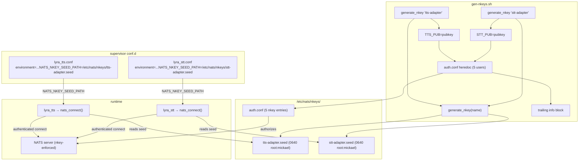
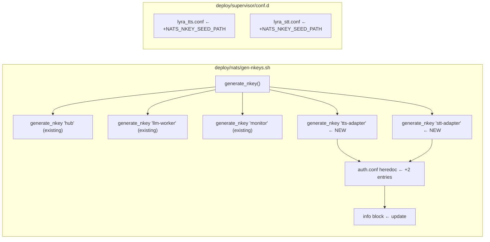

## Summary

Wire nkey authentication for `lyra_tts` and `lyra_stt` supervisor processes by adding
`tts-adapter` and `stt-adapter` nkey seed generation to `gen-nkeys.sh` and setting
`NATS_NKEY_SEED_PATH` in their supervisor configs. Purely additive — mirrors the
existing `hub`/`llm-worker`/`monitor` pattern exactly.

## Architecture

### Data Flow



### File × Function Map



## Agents

| Agent | Task count | Files |
|-------|-----------|-------|
| devops | 7 | `deploy/nats/gen-nkeys.sh`, `deploy/supervisor/conf.d/lyra_tts.conf`, `deploy/supervisor/conf.d/lyra_stt.conf` |

## Consistency Report

- Criteria covered: 9/9
- Uncovered criteria: none
- Tasks without spec backing: none
- Gold plating exemptions applied: 0

## Micro-Tasks

### V1 — gen-nkeys.sh: add tts + stt seeds

---

**T1** — Add `generate_nkey "tts-adapter"` and `generate_nkey "stt-adapter"` calls with pubkey vars

- **File:** `deploy/nats/gen-nkeys.sh`
- **Code snippet:**
  ```bash
  TTS_PUB=$(generate_nkey "tts-adapter")
  STT_PUB=$(generate_nkey "stt-adapter")
  ```
  Insert after `MONITOR_PUB=$(generate_nkey "monitor")` line.
- **Verify:** `grep -q 'generate_nkey "tts-adapter"' deploy/nats/gen-nkeys.sh && grep -q 'generate_nkey "stt-adapter"' deploy/nats/gen-nkeys.sh`
- **Expected:** exit 0
- **Time:** 3 min
- **Parallel-safe:** N
- **Agent:** devops
- **Spec trace:** SC-1, N1, N2, N3
- **Slice:** V1
- **Phase:** GREEN
- **Difficulty:** 1

---

**T2** — Update `auth.conf` heredoc to include tts-adapter and stt-adapter entries

- **File:** `deploy/nats/gen-nkeys.sh`
- **Code snippet:**
  ```bash
    { nkey: "${TTS_PUB}", name: "tts-adapter" }
    { nkey: "${STT_PUB}", name: "stt-adapter" }
  ```
  Append inside the `authorization { users: [ ... ] }` heredoc, after the monitor entry.
- **Verify:** `grep -q 'tts-adapter' deploy/nats/gen-nkeys.sh && grep -q 'stt-adapter' deploy/nats/gen-nkeys.sh`
- **Expected:** exit 0
- **Time:** 3 min
- **Parallel-safe:** N (same file as T1, depends T1)
- **Agent:** devops
- **Spec trace:** SC-2, N4
- **Slice:** V1
- **Phase:** GREEN
- **Difficulty:** 1

---

**T3** — Update trailing `info` block to list all 5 seeds with `NATS_NKEY_SEED_PATH`

- **File:** `deploy/nats/gen-nkeys.sh`
- **Code snippet:**
  Replace the existing `info` lines (which reference only hub/llm-worker/monitor and use legacy `NATS_*_NKEY_SEED` naming) with:
  ```bash
  info "nkeys generated at ${NKEYS_DIR}/"
  info "  hub.seed          — Lyra hub process         NATS_NKEY_SEED_PATH=/etc/nats/nkeys/hub.seed"
  info "  llm-worker.seed   — Machine 2 LLM worker     NATS_NKEY_SEED_PATH=/etc/nats/nkeys/llm-worker.seed"
  info "  monitor.seed      — lyra-monitor health check NATS_NKEY_SEED_PATH=/etc/nats/nkeys/monitor.seed"
  info "  tts-adapter.seed  — lyra_tts adapter process  NATS_NKEY_SEED_PATH=/etc/nats/nkeys/tts-adapter.seed"
  info "  stt-adapter.seed  — lyra_stt adapter process  NATS_NKEY_SEED_PATH=/etc/nats/nkeys/stt-adapter.seed"
  warn "Set NATS_NKEY_SEED_PATH in each service's supervisor conf.d to the seed path above."
  ```
- **Verify:** `grep -q 'tts-adapter.seed' deploy/nats/gen-nkeys.sh && grep -q 'NATS_NKEY_SEED_PATH' deploy/nats/gen-nkeys.sh`
- **Expected:** exit 0
- **Time:** 3 min
- **Parallel-safe:** N (same file, depends T2)
- **Agent:** devops
- **Spec trace:** SC-9, N4
- **Slice:** V1
- **Phase:** GREEN
- **Difficulty:** 1

---

**T4** — Manual verification: fresh script run produces 5 seeds + correct auth.conf

- **File:** `deploy/nats/gen-nkeys.sh`
- **Verify:** `[manual]` — on Machine 1: `sudo rm -rf /etc/nats/nkeys/ && sudo ./deploy/nats/gen-nkeys.sh && ls -la /etc/nats/nkeys/ && cat /etc/nats/nkeys/auth.conf`
- **Expected:** 5 seed files present; `auth.conf` has 5 `nkey:` entries; `tts-adapter.seed` and `stt-adapter.seed` are `0640 root:mickael`
- **Time:** 5 min
- **Parallel-safe:** N (depends T3)
- **Agent:** devops
- **Spec trace:** SC-1, SC-2, SC-8
- **Slice:** V1
- **Phase:** GREEN
- **Difficulty:** 1

---
> 🔴 RED-GATE V1 — Verify gen-nkeys.sh changes before wiring supervisor confs
---

### V2 — supervisor conf.d: wire NATS_NKEY_SEED_PATH

---

**T5** — Append `NATS_NKEY_SEED_PATH` to `lyra_tts.conf` environment line

- **File:** `deploy/supervisor/conf.d/lyra_tts.conf`
- **Code snippet:**
  ```ini
  environment=HOME="%(ENV_HOME)s",PATH="%(ENV_HOME)s/.local/bin:%(ENV_HOME)s/projects/lyra/.venv/bin:%(ENV_PATH)s",NATS_NKEY_SEED_PATH="/etc/nats/nkeys/tts-adapter.seed"
  ```
- **Verify:** `grep -q 'NATS_NKEY_SEED_PATH=/etc/nats/nkeys/tts-adapter.seed' deploy/supervisor/conf.d/lyra_tts.conf`
- **Expected:** exit 0
- **Time:** 2 min
- **Parallel-safe:** Y (different file from T6)
- **Agent:** devops
- **Spec trace:** SC-3, SC-5, E1
- **Slice:** V2
- **Phase:** GREEN
- **Difficulty:** 1

---

**T6** — Append `NATS_NKEY_SEED_PATH` to `lyra_stt.conf` environment line

- **File:** `deploy/supervisor/conf.d/lyra_stt.conf`
- **Code snippet:**
  ```ini
  environment=HOME="%(ENV_HOME)s",PATH="%(ENV_HOME)s/.local/bin:%(ENV_HOME)s/projects/lyra/.venv/bin:%(ENV_PATH)s",NATS_NKEY_SEED_PATH="/etc/nats/nkeys/stt-adapter.seed"
  ```
- **Verify:** `grep -q 'NATS_NKEY_SEED_PATH=/etc/nats/nkeys/stt-adapter.seed' deploy/supervisor/conf.d/lyra_stt.conf`
- **Expected:** exit 0
- **Time:** 2 min
- **Parallel-safe:** Y (different file from T5)
- **Agent:** devops
- **Spec trace:** SC-4, SC-6, E2
- **Slice:** V2
- **Phase:** GREEN
- **Difficulty:** 1

---

**T7** — Manual verification: lyra_tts + lyra_stt connect authenticated

- **Verify:** `[manual]` — on Machine 1 after NATS reload: `supervisorctl restart lyra_tts lyra_stt && supervisorctl tail lyra_tts` — check for no NATS auth errors, and `nats_connect: auth keys enabled` log line
- **Expected:** both processes start cleanly; NATS server logs show authenticated connections from `tts-adapter` and `stt-adapter`
- **Time:** 5 min
- **Parallel-safe:** N (depends T5, T6)
- **Agent:** devops
- **Spec trace:** SC-5, SC-6, SC-7
- **Slice:** V2
- **Phase:** GREEN
- **Difficulty:** 1

---

## Task IDs

<!-- Generated by /plan. Used by /implement to resume tasks on session restart. -->
- T1: 8 — Add generate_nkey calls for tts-adapter and stt-adapter in gen-nkeys.sh
- T2: 9 — Update auth.conf heredoc with tts-adapter and stt-adapter nkey entries
- T3: 10 — Update gen-nkeys.sh trailing info block to list all 5 seeds with NATS_NKEY_SEED_PATH
- T4: 11 — Manual verify: fresh gen-nkeys.sh run produces 5 seeds + correct auth.conf
- T5: 12 — Append NATS_NKEY_SEED_PATH to lyra_tts.conf environment line
- T6: 13 — Append NATS_NKEY_SEED_PATH to lyra_stt.conf environment line
- T7: 14 — Manual verify: lyra_tts + lyra_stt connect authenticated to nkey-enforced NATS
