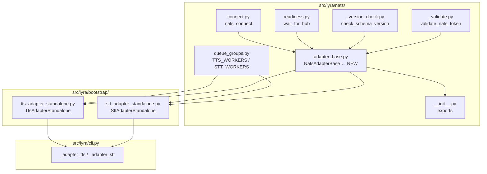
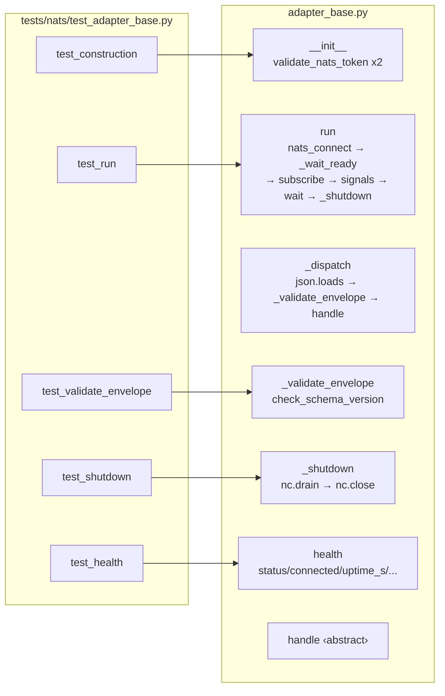

## Summary

Introduce `NatsAdapterBase` (ABC, lifecycle host) in `src/lyra/nats/adapter_base.py`, add `TTS_WORKERS`/`STT_WORKERS` constants to `queue_groups.py`, and migrate both standalone adapters to inherit the base — eliminating the bare `nats.connect()` calls and establishing the pattern for all future NATS request-reply adapters (#451 LLM worker, epic #581).

## Architecture





## Reference Patterns

- **nats_connect + wait_for_hub:** `src/lyra/bootstrap/adapter_standalone.py:14-40` — exact pattern the base wraps
- **check_schema_version usage:** `src/lyra/nats/nats_bus.py` — counter dict, envelope_name, rate-limit semantics
- **Test style for NATS modules:** `tests/nats/test_version_check.py`, `tests/nats/test_readiness.py`
- **Bootstrap test pattern (mock nc):** `tests/bootstrap/test_adapter_standalone.py:40-80`

## Agents

| Agent | Tasks | Files |
|---|---|---|
| `backend-dev` | T1, T7, T8, T10, T12 | `queue_groups.py`, `adapter_base.py`, `nats/__init__.py`, `tts_adapter_standalone.py`, `stt_adapter_standalone.py` |
| `tester` | T2, T3, T4, T5, T6, T9, T11, T13 | `tests/nats/test_adapter_base.py`, `tests/bootstrap/test_tts_adapter_standalone.py`, `tests/bootstrap/test_stt_adapter_standalone.py` |

## Consistency Report

| | |
|---|---|
| Spec criteria covered | 8/8 (100%) |
| Micro-tasks total | 13 + 3 RED-GATEs |
| Uncovered criteria | none |
| Untraced tasks | none |

SC-1 → T2,T6,T7 · SC-2 → T1,T9,T11 · SC-3 → T9,T10 · SC-4 → T11,T12 · SC-5 → T2,T7 · SC-6 → T3,T7 · SC-7 → T4,T7 · SC-8 → T5,T7

## Micro-Tasks

### V1 — Base class + constants

| T | Phase | P | Description | File | Agent | Spec | Time |
|---|---|---|---|---|---|---|---|
| T1 | RED | ✓ | Add `TTS_WORKERS = "tts-workers"` and `STT_WORKERS = "stt-workers"` to `queue_groups.py` | `src/lyra/nats/queue_groups.py` | backend-dev | SC-2 | 2 min |
| T2 | RED | ✓ | Write tests: `NatsAdapterBase` construction — valid args pass, bad subject raises `ValueError`, bad queue_group raises `ValueError`, `envelope_name` required | `tests/nats/test_adapter_base.py` | tester | SC-1,SC-5 | 5 min |
| T3 | RED | ✓ | Write tests: `_validate_envelope` — v1 accepted, v>expected dropped, missing field=v1, drop counted in `_drop_count`, `envelope_name` used as rate-limit key | `tests/nats/test_adapter_base.py` | tester | SC-6 | 5 min |
| T4 | RED | ✓ | Write tests: `_shutdown` — `nc.drain()` called before `nc.close()`, `sub.unsubscribe()` NOT called | `tests/nats/test_adapter_base.py` | tester | SC-7 | 5 min |
| T5 | RED | ✓ | Write tests: `health()` — returns dict with `status`, `connected`, `uptime_s`, `subject`, `queue_group`, `schema_version`; `uptime_s` increases; `connected` reflects `nc.is_connected` | `tests/nats/test_adapter_base.py` | tester | SC-8 | 5 min |
| T6 | RED | ✓ | Write tests: `run()` — SIGTERM/SIGINT registered when `stop=None`, NOT registered when stop injected; `_wait_ready()` called; graceful timeout continues (no crash) | `tests/nats/test_adapter_base.py` | tester | SC-1 | 5 min |

**RED-GATE V1** — all T2–T6 tests collected, fail with `ImportError` or `AttributeError` (implementation not written yet)
```bash
pytest tests/nats/test_adapter_base.py --collect-only 2>&1 | grep "test session\|ERROR"
```

| T | Phase | P | Description | File | Agent | Spec | Time |
|---|---|---|---|---|---|---|---|
| T7 | GREEN | | Implement `NatsAdapterBase` — all methods per spec; `handle()` abstract; `_dispatch()` calls `_validate_envelope()`; `run()` owns full lifecycle; `_shutdown()` drain→close only | `src/lyra/nats/adapter_base.py` | backend-dev | SC-1..8 | 15 min |
| T8 | REFACTOR | | Export `NatsAdapterBase` from `src/lyra/nats/__init__.py`; add to `__all__` | `src/lyra/nats/__init__.py` | backend-dev | SC-1 | 2 min |

**Expected skeleton for T7:**
```python
from abc import ABC, abstractmethod
import asyncio, json, logging, signal, time
from nats.aio.client import Client as NATS
from lyra.nats.connect import nats_connect
from lyra.nats.readiness import wait_for_hub
from lyra.nats._version_check import check_schema_version
from lyra.nats._validate import validate_nats_token

class NatsAdapterBase(ABC):
    def __init__(self, subject, queue_group, envelope_name, schema_version,
                 timeout=30.0, drain_timeout=30.0):
        validate_nats_token(subject, kind="subject")
        validate_nats_token(queue_group, kind="queue_group")
        self.subject = subject; self.queue_group = queue_group
        self.envelope_name = envelope_name; self.schema_version = schema_version
        self.timeout = timeout; self.drain_timeout = drain_timeout
        self._nc: NATS | None = None
        self._drop_count: dict[str, int] = {}
        self._started_at: float | None = None

    async def run(self, nats_url: str, stop: asyncio.Event | None = None) -> None:
        self._nc = await nats_connect(nats_url)
        await self._wait_ready()
        await self._nc.subscribe(self.subject, queue=self.queue_group, cb=self._dispatch)
        if stop is None:
            stop = asyncio.Event()
            loop = asyncio.get_running_loop()
            for sig in (signal.SIGTERM, signal.SIGINT):
                loop.add_signal_handler(sig, stop.set)
        self._started_at = time.monotonic()
        await stop.wait()
        await self._shutdown()

    @abstractmethod
    async def handle(self, msg) -> None: ...

    async def _dispatch(self, msg) -> None:
        try:
            payload = json.loads(msg.data)
        except Exception:
            log.error("adapter_base: malformed JSON on %s", self.subject)
            return
        if self._validate_envelope(payload):
            await self.handle(msg)

    def _validate_envelope(self, payload: dict) -> bool:
        return check_schema_version(payload, envelope_name=self.envelope_name,
            expected=self.schema_version, subject=self.subject, counter=self._drop_count)

    async def _shutdown(self) -> None:
        if self._nc:
            await self._nc.drain()   # subsumes unsubscribe
            await self._nc.close()

    async def _wait_ready(self) -> None:
        ok = await wait_for_hub(self._nc, timeout=self.timeout)
        if not ok:
            log.warning("adapter_base: hub readiness timed out — starting anyway")

    def health(self) -> dict:
        uptime = time.monotonic() - self._started_at if self._started_at else 0.0
        return {"status": "ok", "subject": self.subject, "queue_group": self.queue_group,
                "schema_version": self.schema_version,
                "connected": self._nc.is_connected if self._nc else False,
                "uptime_s": round(uptime, 3)}
```

**Verify T7:**
```bash
pytest tests/nats/test_adapter_base.py -x
```

---

### V2 — TTS adapter migration

| T | Phase | P | Description | File | Agent | Spec | Time |
|---|---|---|---|---|---|---|---|
| T9 | RED | ✓ | Write tests: TTS adapter — no bare `import nats`/`nats.connect()` in source; `TTS_WORKERS` used; `_bootstrap_tts_adapter_standalone` signature unchanged | `tests/bootstrap/test_tts_adapter_standalone.py` | tester | SC-2,SC-3 | 8 min |

**RED-GATE V2** — T9 tests fail (TTS still uses `nats.connect()`)
```bash
grep -c "nats\.connect" src/lyra/bootstrap/tts_adapter_standalone.py
# expect: 1 (still bare — pre-migration)
```

| T | Phase | P | Description | File | Agent | Spec | Time |
|---|---|---|---|---|---|---|---|
| T10 | GREEN | | Refactor `tts_adapter_standalone.py`: extract `TtsAdapterStandalone(NatsAdapterBase)`, move handler logic to `handle()`, keep `_bootstrap_tts_adapter_standalone` as thin wrapper calling `run()` | `src/lyra/bootstrap/tts_adapter_standalone.py` | backend-dev | SC-3 | 10 min |

**Expected shape for T10:**
```python
class TtsAdapterStandalone(NatsAdapterBase):
    def __init__(self, raw_config: dict) -> None:
        super().__init__("lyra.voice.tts.request", TTS_WORKERS, "TtsRequest", 1)
        self._tts_service = TTSService(load_tts_config())

    async def handle(self, msg) -> None:
        data = json.loads(msg.data)  # already validated by base
        # ... existing synthesis logic ...
        if msg.reply:
            await self._nc.publish(msg.reply, json.dumps(response).encode())

async def _bootstrap_tts_adapter_standalone(raw_config, *, _stop=None):
    nats_url = os.environ.get("NATS_URL") or sys.exit("NATS_URL required...")
    await TtsAdapterStandalone(raw_config).run(nats_url, _stop)
```

**Verify T10:**
```bash
pytest tests/bootstrap/test_tts_adapter_standalone.py -x
grep -c "nats\.connect\|import nats$" src/lyra/bootstrap/tts_adapter_standalone.py
# expect: 0
```

---

### V3 — STT adapter migration

| T | Phase | P | Description | File | Agent | Spec | Time |
|---|---|---|---|---|---|---|---|
| T11 | RED | ✓ | Write tests: STT adapter — no bare `import nats`/`nats.connect()` in source; `STT_WORKERS` used; `_bootstrap_stt_adapter_standalone` signature unchanged; `_mime_to_ext` still accessible | `tests/bootstrap/test_stt_adapter_standalone.py` | tester | SC-2,SC-4 | 8 min |

**RED-GATE V3** — T11 tests fail (STT still uses `nats.connect()`)
```bash
grep -c "nats\.connect" src/lyra/bootstrap/stt_adapter_standalone.py
# expect: 1 (still bare — pre-migration)
```

| T | Phase | P | Description | File | Agent | Spec | Time |
|---|---|---|---|---|---|---|---|
| T12 | GREEN | | Refactor `stt_adapter_standalone.py`: extract `SttAdapterStandalone(NatsAdapterBase)`, move handler logic to `handle()`, keep `_bootstrap_stt_adapter_standalone` as thin wrapper; keep `_mime_to_ext` as module-level helper | `src/lyra/bootstrap/stt_adapter_standalone.py` | backend-dev | SC-4 | 10 min |
| T13 | REFACTOR | | Full suite — all 3 test files + mypy on all 5 implementation files | all | tester | all SC | 5 min |

**Verify T12:**
```bash
pytest tests/bootstrap/test_stt_adapter_standalone.py -x
grep -c "nats\.connect\|import nats$" src/lyra/bootstrap/stt_adapter_standalone.py
# expect: 0
```

**Verify T13:**
```bash
uv run pytest tests/nats/test_adapter_base.py tests/bootstrap/test_tts_adapter_standalone.py tests/bootstrap/test_stt_adapter_standalone.py -x
uv run mypy src/lyra/nats/adapter_base.py src/lyra/bootstrap/tts_adapter_standalone.py src/lyra/bootstrap/stt_adapter_standalone.py --ignore-missing-imports
```

## Task IDs

<!-- Generated by /plan. Used by /implement to resume tasks on session restart. -->
- T1: 9 — Add TTS_WORKERS/STT_WORKERS to queue_groups.py
- T2: 10 — Test NatsAdapterBase construction + ValueError
- T3: 11 — Test _validate_envelope — accept/drop/missing/count
- T4: 12 — Test _shutdown — drain before close, no unsubscribe
- T5: 13 — Test health() — connected, uptime_s, all fields
- T6: 14 — Test run() — signal registration, _wait_ready called
- T7: 15 — Implement NatsAdapterBase in adapter_base.py
- T8: 16 — Export NatsAdapterBase from nats/__init__.py
- T9: 17 — Test TTS adapter — no bare nats.connect(), TTS_WORKERS used
- T10: 18 — Refactor tts_adapter_standalone.py → TtsAdapterStandalone
- T11: 19 — Test STT adapter — no bare nats.connect(), STT_WORKERS used
- T12: 20 — Refactor stt_adapter_standalone.py → SttAdapterStandalone
- T13: 21 — Full suite — pytest + mypy all 5 files
