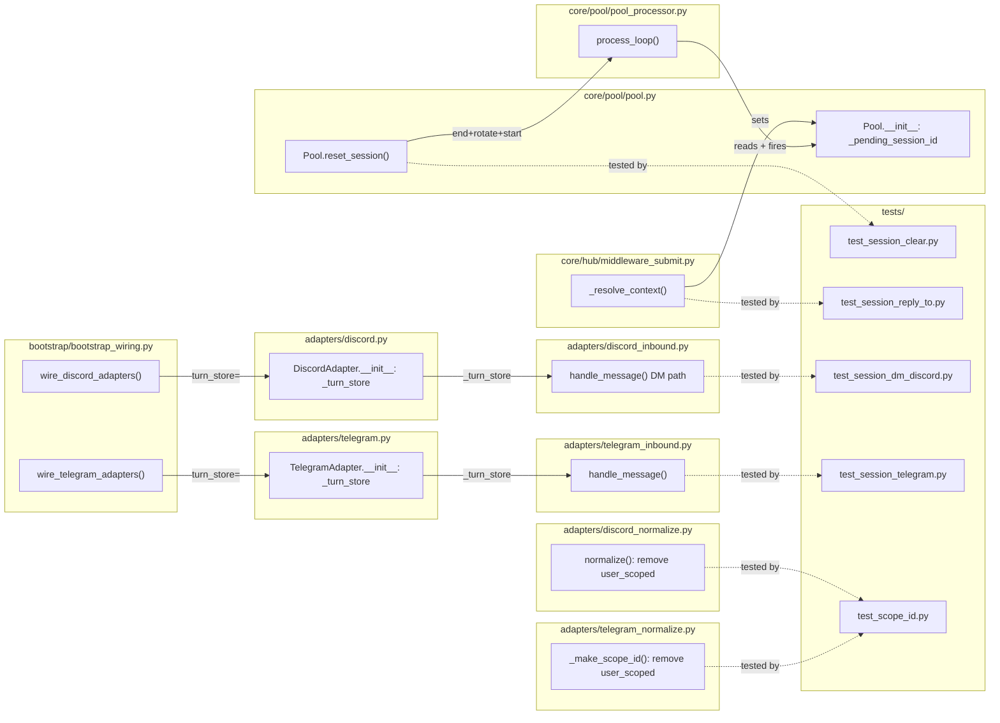

## Summary

Five targeted fixes across the pool, middleware, adapter, and normalizer layers: UUID
rotation on `/clear`, reply-to resume queuing for busy pools, Discord DM and Telegram
session-persistence wiring (with `_turn_store` injected at bootstrap), and removal of
per-user `user_scoped()` from guild channels and Telegram groups so those contexts share
one pool per channel/group.

## Architecture

### Data Flow

```mermaid
flowchart TD
    subgraph "S1 — /clear UUID rotation (pool.py)"
        A1["cmd_clear()"] -->|clears history| A2["pool.reset_session()"]
        A2 -->|end_session_async(old_sid)| A3["TurnStore: ended_at set"]
        A2 -->|new UUID| A4["pool.session_id"]
        A2 -->|start_session(new_sid)| A5["TurnStore: new pool_sessions row"]
    end

    subgraph "S2 — Reply-to busy queue (middleware_submit + pool_processor)"
        B1["_resolve_context Path 1"] -->|pool busy| B2["pool._pending_session_id = sid"]
        B3["process_loop: after collect()"] -->|_pending_session_id set| B4["pool.resume_session(pending_sid)"]
        B4 --> B5["_pending_session_id = None"]
    end

    subgraph "S3/S4 — Adapter session wiring (discord/telegram)"
        C1["DiscordAdapter._turn_store"] -->|get_last_session| C2["platform_meta.thread_session_id"]
        C3["TelegramAdapter._turn_store"] -->|get_last_session| C2
        C2 -->|consumed by| C4["middleware_submit: Path 2 resume"]
        C2 -->|_session_update_fn| C5["pool._observer: persist after turn"]
    end

    subgraph "S5 — Scope normalizers (discord/telegram)"
        D1["discord_normalize: guild channel"] -->|scope_id = channel:{id}| D2["RoutingKey → shared pool"]
        D3["telegram_normalize: group"] -->|scope_id = chat:{id}| D2
    end
```

### File × Function Map



## Agents

| Agent | Task count | Files |
|-------|-----------|-------|
| `backend-dev` | 12 | pool.py, pool_processor.py, middleware_submit.py, discord.py, discord_inbound.py, telegram.py, telegram_inbound.py, discord_normalize.py, telegram_normalize.py, bootstrap_wiring.py, adapter_standalone.py |
| `tester` | 5 | tests/integration/test_session_clear.py, test_session_reply_to.py, test_session_dm_discord.py, test_session_telegram.py, tests/unit/test_scope_id.py |

## Consistency Report

- Criteria covered: 11/11
- Uncovered criteria: none
- Tasks without spec backing: none
- Gold plating exemptions applied: 0

## Micro-Tasks

### Slice V1: UUID rotation on /clear

#### Task T1: Write integration test — /clear produces two distinct TurnStore session_ids [P] → tester
- **File:** `tests/integration/test_session_clear.py`
- **Snippet:** `assert before_sid != after_sid; assert turn_store.get_last_session(pool_id) == after_sid`
- **Verify:** `uv run pytest tests/integration/test_session_clear.py -x` (deferred)
- **Expected:** Test fails (red) — UUID rotation not yet implemented
- **Time:** 5 min
- **Difficulty:** 2
- **Traces:** SC-4
- **Phase:** RED

#### Task T2: Pool.reset_session() — save old_sid, end_session_async, rotate UUID, start_session → backend-dev
- **File:** `src/lyra/core/pool/pool.py`
- **Snippet:**
  ```python
  async def reset_session(self) -> None:
      old_sid = self.session_id
      await self._observer.end_session_async(old_sid)
      self.session_id = str(uuid.uuid4())
      if self._observer._turn_store is not None:
          await self._observer._turn_store.start_session(self.session_id, self.pool_id)
      self._observer.reset_session_persisted()
      if self._session_reset_fn is not None:
          await self._session_reset_fn()
  ```
- **Verify:** `uv run pytest tests/integration/test_session_clear.py -x` (deferred)
- **Expected:** Test passes (green)
- **Time:** 5 min
- **Difficulty:** 2
- **Traces:** SC-4, U1→N1→N2→S1
- **Phase:** GREEN

#### RED-GATE V1 → tester
- **Verify:** T1 completed before T2 starts
- **Phase:** RED-GATE

---

### Slice V2: Reply-to busy-pool queue

#### Task T3: Write integration test — reply-to while pool busy → session queued + fires after drain [P] → tester
- **File:** `tests/integration/test_session_reply_to.py`
- **Snippet:** `# send msg A to pool; while busy, send reply-to msg B; assert B handled in session S_OLD after A drains`
- **Verify:** `uv run pytest tests/integration/test_session_reply_to.py -x` (deferred)
- **Expected:** Test fails (red)
- **Time:** 8 min
- **Difficulty:** 4
- **Traces:** SC-5, SC-6
- **Phase:** RED

#### Task T4: Add _pending_session_id field to Pool → backend-dev
- **File:** `src/lyra/core/pool/pool.py`
- **Snippet:** `self._pending_session_id: str | None = None  # set by pipeline when pool busy on reply-to`
- **Verify:** `grep -n "_pending_session_id" src/lyra/core/pool/pool.py` (ready)
- **Expected:** Field present
- **Time:** 2 min
- **Difficulty:** 1
- **Traces:** SC-6, U4→N7→S2
- **Phase:** GREEN
- **Dependencies:** T2

#### Task T5: middleware_submit._resolve_context — set _pending_session_id when pool busy → backend-dev
- **File:** `src/lyra/core/hub/middleware_submit.py`
- **Snippet:**
  ```python
  if not pool.is_idle:
      pool._pending_session_id = session_id  # was: log + skip
      log.info("reply-to-resume: pool %r busy — queued session %r", pool_id, session_id)
  else:
      ...
  ```
- **Verify:** `grep -n "_pending_session_id" src/lyra/core/hub/middleware_submit.py` (ready)
- **Expected:** Assignment present, silent-drop log removed
- **Time:** 5 min
- **Difficulty:** 2
- **Traces:** SC-5, SC-6, U4→N7→S2
- **Phase:** GREEN
- **Dependencies:** T4

#### Task T6: process_loop — fire _pending_session_id before processing message → backend-dev
- **File:** `src/lyra/core/pool/pool_processor.py`
- **Snippet:**
  ```python
  buffer = await pool._debouncer.collect(pool._inbox)
  # Fire any pending reply-to session resume before processing
  if pool._pending_session_id is not None:
      pending = pool._pending_session_id
      pool._pending_session_id = None
      await pool.resume_session(pending)
  msg = pool._debouncer.merge(buffer)
  ```
- **Verify:** `uv run pytest tests/integration/test_session_reply_to.py -x` (deferred)
- **Expected:** Test passes (green)
- **Time:** 5 min
- **Difficulty:** 3
- **Traces:** SC-6, U4→N7→N8→S2
- **Phase:** GREEN
- **Dependencies:** T4, T5

#### RED-GATE V2 → tester
- **Verify:** T3 completed before T4/T5/T6 start
- **Phase:** RED-GATE

---

### Slice V3: Discord DM session wiring

#### Task T7: Write integration test — Discord DM restart resumes prior session [P] → tester
- **File:** `tests/integration/test_session_dm_discord.py`
- **Snippet:** `# simulate restart (new Pool), send DM, assert pool.resume_session called with prior CLI session_id`
- **Verify:** `uv run pytest tests/integration/test_session_dm_discord.py -x` (deferred)
- **Expected:** Test fails (red)
- **Time:** 8 min
- **Difficulty:** 4
- **Traces:** SC-1, SC-7
- **Phase:** RED

#### Task T8: DiscordAdapter — add turn_store constructor param → backend-dev
- **File:** `src/lyra/adapters/discord.py`
- **Snippet:**
  ```python
  from lyra.core.stores.turn_store import TurnStore
  # in __init__:
  turn_store: TurnStore | None = None,
  # in body:
  self._turn_store: TurnStore | None = turn_store
  ```
- **Verify:** `grep -n "_turn_store" src/lyra/adapters/discord.py` (ready)
- **Expected:** Attribute present
- **Time:** 3 min
- **Difficulty:** 1
- **Traces:** SC-1, SC-7, U2→N3→S3
- **Phase:** GREEN

#### Task T9: discord_inbound DM path — inject thread_session_id + _session_update_fn → backend-dev
- **File:** `src/lyra/adapters/discord_inbound.py`
- **Snippet:**
  ```python
  # After existing thread-session block, before normalize():
  _dm_session_id: str | None = None
  if _is_dm and adapter._turn_store is not None:
      _pool_id = RoutingKey(Platform.DISCORD, adapter._bot_id,
                            f"channel:{message.channel.id}").to_pool_id()
      _dm_session_id = await adapter._turn_store.get_last_session(_pool_id)

  # In _meta_updates block:
  if _dm_session_id is not None:
      _meta_updates["thread_session_id"] = _dm_session_id
  if _is_dm and adapter._turn_store is not None:
      _ts = adapter._turn_store
      async def _dm_session_update_fn(msg, session_id, pool_id):
          await _ts.start_session(session_id, pool_id)
      _meta_updates["_session_update_fn"] = _dm_session_update_fn
  ```
- **Verify:** `uv run pytest tests/integration/test_session_dm_discord.py -x` (deferred)
- **Expected:** Test passes (green)
- **Time:** 8 min
- **Difficulty:** 3
- **Traces:** SC-1, SC-7, U2→N3→N4→S3
- **Phase:** GREEN
- **Dependencies:** T8

#### Task T10: bootstrap_wiring + adapter_standalone — pass turn_store to DiscordAdapter → backend-dev
- **File:** `src/lyra/bootstrap/bootstrap_wiring.py`, `src/lyra/bootstrap/adapter_standalone.py`
- **Snippet:**
  ```python
  adapter = DiscordAdapter(
      ...
      thread_store=thread_store,
      turn_store=hub._turn_store,  # ← add
  )
  ```
- **Verify:** `grep -n "turn_store" src/lyra/bootstrap/bootstrap_wiring.py` (ready)
- **Expected:** `turn_store=` kwarg present in both files
- **Time:** 5 min
- **Difficulty:** 2
- **Traces:** SC-1, SC-7, U2→N3→S3
- **Phase:** GREEN
- **Dependencies:** T8

#### RED-GATE V3 → tester
- **Verify:** T7 completed before T8/T9/T10 start
- **Phase:** RED-GATE

---

### Slice V4: Telegram session wiring

#### Task T11: Write integration test — Telegram restart resumes prior session [P] → tester
- **File:** `tests/integration/test_session_telegram.py`
- **Snippet:** `# simulate restart (new Pool), send Telegram message, assert resume_session called with prior session_id`
- **Verify:** `uv run pytest tests/integration/test_session_telegram.py -x` (deferred)
- **Expected:** Test fails (red)
- **Time:** 8 min
- **Difficulty:** 4
- **Traces:** SC-2, SC-7
- **Phase:** RED

#### Task T12: TelegramAdapter — add turn_store constructor param → backend-dev
- **File:** `src/lyra/adapters/telegram.py`
- **Snippet:**
  ```python
  from lyra.core.stores.turn_store import TurnStore
  # in __init__:
  turn_store: TurnStore | None = None,
  # in body:
  self._turn_store: TurnStore | None = turn_store
  ```
- **Verify:** `grep -n "_turn_store" src/lyra/adapters/telegram.py` (ready)
- **Expected:** Attribute present
- **Time:** 3 min
- **Difficulty:** 1
- **Traces:** SC-2, SC-7, U3→N5→S4
- **Phase:** GREEN

#### Task T13: telegram_inbound — inject thread_session_id + _session_update_fn → backend-dev
- **File:** `src/lyra/adapters/telegram_inbound.py`
- **Snippet:**
  ```python
  # In handle_message(), after hub_msg = adapter.normalize():
  _meta_updates: dict = {}
  if adapter._turn_store is not None:
      _pool_id = RoutingKey(Platform.TELEGRAM, adapter._bot_id,
                            hub_msg.scope_id).to_pool_id()
      _last_sid = await adapter._turn_store.get_last_session(_pool_id)
      if _last_sid is not None:
          _meta_updates["thread_session_id"] = _last_sid
      _ts = adapter._turn_store
      async def _tg_session_update_fn(msg, session_id, pool_id):
          await _ts.start_session(session_id, pool_id)
      _meta_updates["_session_update_fn"] = _tg_session_update_fn
  if _meta_updates:
      hub_msg = dataclasses.replace(hub_msg, platform_meta={**hub_msg.platform_meta, **_meta_updates})
  ```
- **Verify:** `uv run pytest tests/integration/test_session_telegram.py -x` (deferred)
- **Expected:** Test passes (green)
- **Time:** 8 min
- **Difficulty:** 3
- **Traces:** SC-2, SC-7, U3→N5→N6→S4
- **Phase:** GREEN
- **Dependencies:** T12

#### Task T14: bootstrap_wiring + adapter_standalone — pass turn_store to TelegramAdapter → backend-dev
- **File:** `src/lyra/bootstrap/bootstrap_wiring.py`, `src/lyra/bootstrap/adapter_standalone.py`
- **Snippet:**
  ```python
  adapter = TelegramAdapter(
      ...
      turn_store=hub._turn_store,  # ← add
  )
  ```
- **Verify:** `grep -n "turn_store" src/lyra/bootstrap/bootstrap_wiring.py | grep -i telegram` (ready)
- **Expected:** `turn_store=` kwarg present
- **Time:** 3 min
- **Difficulty:** 1
- **Traces:** SC-2, SC-7, U3→N5→S4
- **Phase:** GREEN
- **Dependencies:** T12

#### RED-GATE V4 → tester
- **Verify:** T11 completed before T12/T13/T14 start
- **Phase:** RED-GATE

---

### Slice V5: Remove per-user pool scoping

#### Task T15: Write unit test — two users in same guild channel / Telegram group → same pool_id [P] → tester
- **File:** `tests/unit/test_scope_id.py`
- **Snippet:**
  ```python
  # user A and user B normalize a message in same channel/group
  # assert msg_a.scope_id == msg_b.scope_id
  ```
- **Verify:** `uv run pytest tests/unit/test_scope_id.py -x` (deferred)
- **Expected:** Test fails (red)
- **Time:** 5 min
- **Difficulty:** 2
- **Traces:** SC-9, SC-10
- **Phase:** RED

#### Task T16: discord_normalize — remove is_guild_channel + user_scoped call → backend-dev [P]
- **File:** `src/lyra/adapters/discord_normalize.py`
- **Snippet:**
  ```python
  # Remove lines 65-67:
  # is_guild_channel = raw.guild is not None and not resolved_thread_id
  # if is_guild_channel:
  #     scope_id = user_scoped(scope_id, user_id)
  ```
- **Verify:** `grep -n "user_scoped\|is_guild_channel" src/lyra/adapters/discord_normalize.py` (ready)
- **Expected:** No matches
- **Time:** 2 min
- **Difficulty:** 1
- **Traces:** SC-9, U5→S5
- **Phase:** GREEN

#### Task T17: telegram_normalize — _make_scope_id returns base unconditionally → backend-dev [P]
- **File:** `src/lyra/adapters/telegram_normalize.py`
- **Snippet:**
  ```python
  def _make_scope_id(chat_id, topic_id, *, user_id, is_group) -> str:
      if topic_id is not None:
          return f"chat:{chat_id}:topic:{topic_id}"
      return f"chat:{chat_id}"
      # Remove: return user_scoped(base, user_id) if is_group else base
  ```
- **Verify:** `grep -n "user_scoped" src/lyra/adapters/telegram_normalize.py` (ready)
- **Expected:** No matches
- **Time:** 2 min
- **Difficulty:** 1
- **Traces:** SC-10, U6→S5
- **Phase:** GREEN

#### RED-GATE V5 → tester
- **Verify:** T15 completed before T16/T17 start
- **Phase:** RED-GATE

---

## Task IDs

<!-- Generated by /plan. Used by /implement to resume tasks on session restart. -->
- T1: 8 — T1: Write integration test — /clear produces two distinct TurnStore session_ids
- T2: 13 — T2: Pool.reset_session() — UUID rotation + end_session_async + start_session
- T3: 9 — T3: Write integration test — reply-to while pool busy queued + fires after drain
- T4: 14 — T4: Pool.__init__ — add _pending_session_id field
- T5: 15 — T5: middleware_submit._resolve_context — set _pending_session_id when pool busy
- T6: 16 — T6: process_loop — fire _pending_session_id after collect() before processing
- T7: 10 — T7: Write integration test — Discord DM restart resumes prior session
- T8: 17 — T8: DiscordAdapter — add turn_store constructor param + _turn_store attribute
- T9: 18 — T9: discord_inbound DM path — inject thread_session_id + _session_update_fn
- T10: 19 — T10: bootstrap_wiring + adapter_standalone — pass turn_store to DiscordAdapter
- T11: 11 — T11: Write integration test — Telegram restart resumes prior session
- T12: 20 — T12: TelegramAdapter — add turn_store constructor param + _turn_store attribute
- T13: 21 — T13: telegram_inbound — inject thread_session_id + _session_update_fn
- T14: 22 — T14: bootstrap_wiring + adapter_standalone — pass turn_store to TelegramAdapter
- T15: 12 — T15: Write unit test — two users in same guild channel / Telegram group share pool_id
- T16: 23 — T16: discord_normalize — remove is_guild_channel + user_scoped call
- T17: 24 — T17: telegram_normalize — _make_scope_id returns base unconditionally
