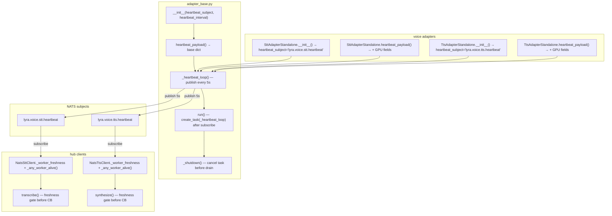

## Summary

Lift the proven heartbeat pattern from Docker stubs into `NatsAdapterBase` (opt-in via `heartbeat_subject` kwarg), wire voice adapters to opt in with GPU-specific payload overrides, and add freshness-gating to hub-side NATS clients so dead workers are detected proactively — before the next request times out.

## Architecture



```mermaid
flowchart LR
  subgraph adapter_base.py
    AB_INIT["__init__"]
    AB_PAY["heartbeat_payload()"]
    AB_LOOP["_heartbeat_loop()"]
    AB_RUN["run()"]
    AB_SHUT["_shutdown()"]
  end
  subgraph stt_adapter_standalone.py
    SA_INIT["__init__"]
    SA_PAY["heartbeat_payload()"]
  end
  subgraph tts_adapter_standalone.py
    TA_INIT["__init__"]
    TA_PAY["heartbeat_payload()"]
  end
  subgraph nats_stt_client.py
    SC_INIT["__init__"]
    SC_HB["_on_heartbeat()"]
    SC_ALV["_any_worker_alive()"]
    SC_TR["transcribe()"]
  end
  subgraph nats_tts_client.py
    TC_INIT["__init__"]
    TC_HB["_on_heartbeat()"]
    TC_ALV["_any_worker_alive()"]
    TC_SY["synthesize()"]
  end
  subgraph test_adapter_base.py
    TAB["TestHeartbeat*"]
  end
  subgraph test_stt_adapter_standalone.py
    TSAS["TestSttHeartbeat*"]
  end
  subgraph test_tts_adapter_standalone.py
    TTAS["TestTtsHeartbeat*"]
  end
  subgraph test_nats_stt_client.py
    TNSC["TestFreshness*"]
  end
  subgraph test_nats_tts_client.py
    TNTC["TestFreshness*"]
  end
  SA_INIT -->|super().__init__| AB_INIT
  TA_INIT -->|super().__init__| AB_INIT
  SA_PAY -->|super()| AB_PAY
  TA_PAY -->|super()| AB_PAY
  AB_RUN --> AB_LOOP
  AB_SHUT -->|cancel| AB_LOOP
  TAB --> AB_INIT
  TAB --> AB_LOOP
  TAB --> AB_SHUT
  TSAS --> SA_PAY
  TTAS --> TA_PAY
  TNSC --> SC_ALV
  TNSC --> SC_TR
  TNTC --> TC_ALV
  TNTC --> TC_SY
```

## Agents

| Agent | Task count | Files |
|---|---|---|
| `backend-dev` | T1–T16 | `adapter_base.py`, `stt_adapter_standalone.py`, `tts_adapter_standalone.py`, `nats_stt_client.py`, `nats_tts_client.py`, 5 test files |

## Reference Patterns

- `docker/stubs/stt_stub.py` — `heartbeat_loop()` pattern (publish loop, stop event, payload shape)
- `tests/nats/test_adapter_base.py` — test style: class-per-group, `_make_adapter()` factory, `AsyncMock` for `_nc`
- `tests/nats/test_nats_stt_client.py` — client test style: `mock_nc` fixture, `monkeypatch` for env

## Consistency Report

- Coverage: 19/19 spec criteria covered
- Uncovered: none
- Untraced tasks: none
- Exemptions: 3 RED-GATE sentinels (infra only)

## Micro-Tasks

### S1 — SDK: heartbeat in NatsAdapterBase

---

#### T1 — Write RED tests: heartbeat constructor params + `_worker_id` + no-op when None

- **File:** `tests/nats/test_adapter_base.py`
- **Code snippet:**
  ```python
  class TestHeartbeatConstruction:
      def test_heartbeat_subject_stored(self): ...
      def test_heartbeat_interval_default_5s(self): ...
      def test_worker_id_format(self): ...  # "{queue_group}-{hostname}-{pid}"
      def test_no_heartbeat_subject_no_task_attr(self): ...
      def test_existing_callers_unaffected(self): ...
  ```
- **Verify:** `uv run pytest tests/nats/test_adapter_base.py::TestHeartbeatConstruction -x 2>&1 | grep -q FAILED`
- **Expected:** Tests collected and FAIL (RED)
- **Time:** 5 min
- **Parallel-safe:** N (same file as T2–T4)
- **Agent:** backend-dev
- **Spec trace:** S1-SC-1,2,3,9
- **Slice:** S1
- **Phase:** RED
- **Difficulty:** 2

---

#### T2 — Write RED tests: `_heartbeat_loop` publishes at interval, logs on publish error

- **File:** `tests/nats/test_adapter_base.py`
- **Code snippet:**
  ```python
  class TestHeartbeatLoop:
      async def test_publishes_payload_at_interval(self): ...
      async def test_publish_error_logs_warning_and_continues(self): ...
      async def test_loop_exits_when_nc_none(self): ...
      async def test_loop_exits_when_nc_disconnected(self): ...
  ```
- **Verify:** `uv run pytest tests/nats/test_adapter_base.py::TestHeartbeatLoop -x 2>&1 | grep -q FAILED`
- **Expected:** Tests FAIL (RED)
- **Time:** 5 min
- **Parallel-safe:** N
- **Agent:** backend-dev
- **Spec trace:** S1-SC-5,6,7
- **Slice:** S1
- **Phase:** RED
- **Difficulty:** 3

---

#### T3 — Write RED tests: heartbeat task cancelled before drain on shutdown

- **File:** `tests/nats/test_adapter_base.py`
- **Code snippet:**
  ```python
  class TestHeartbeatShutdown:
      async def test_heartbeat_task_cancelled_before_drain(self): ...
      async def test_no_task_when_no_heartbeat_subject(self): ...
  ```
- **Verify:** `uv run pytest tests/nats/test_adapter_base.py::TestHeartbeatShutdown -x 2>&1 | grep -q FAILED`
- **Expected:** Tests FAIL (RED)
- **Time:** 4 min
- **Parallel-safe:** N
- **Agent:** backend-dev
- **Spec trace:** S1-SC-8
- **Slice:** S1
- **Phase:** RED
- **Difficulty:** 2

---

#### T4 — Write RED tests: `run()` creates heartbeat task only when subject set

- **File:** `tests/nats/test_adapter_base.py`
- **Code snippet:**
  ```python
  class TestHeartbeatRun:
      async def test_heartbeat_task_created_when_subject_set(self): ...
      async def test_no_heartbeat_task_when_subject_none(self): ...
  ```
- **Verify:** `uv run pytest tests/nats/test_adapter_base.py::TestHeartbeatRun -x 2>&1 | grep -q FAILED`
- **Expected:** Tests FAIL (RED)
- **Time:** 4 min
- **Parallel-safe:** N
- **Agent:** backend-dev
- **Spec trace:** S1-SC-4
- **Slice:** S1
- **Phase:** RED
- **Difficulty:** 2

---

#### T5 — GREEN: add `heartbeat_subject`, `heartbeat_interval`, `_worker_id` to `NatsAdapterBase.__init__`

- **File:** `src/lyra/nats/adapter_base.py`
- **Code snippet:**
  ```python
  import os, socket
  class NatsAdapterBase(ABC):
      def __init__(
          self, subject, queue_group, envelope_name, schema_version,
          timeout=30.0, drain_timeout=30.0,
          *, heartbeat_subject: str | None = None,
          heartbeat_interval: float = 5.0,
      ):
          ...
          self._heartbeat_subject = heartbeat_subject
          self._heartbeat_interval = heartbeat_interval
          self._worker_id = f"{queue_group}-{socket.gethostname()}-{os.getpid()}"
          self._heartbeat_task: asyncio.Task | None = None
  ```
- **Verify:** `uv run pytest tests/nats/test_adapter_base.py::TestHeartbeatConstruction`
- **Expected:** All TestHeartbeatConstruction tests pass
- **Time:** 5 min
- **Parallel-safe:** N (same file as T6–T8)
- **Agent:** backend-dev
- **Spec trace:** S1-SC-1,2,3,9
- **Slice:** S1
- **Phase:** GREEN
- **Difficulty:** 2

---

#### T6 — GREEN: add `heartbeat_payload()` method

- **File:** `src/lyra/nats/adapter_base.py`
- **Code snippet:**
  ```python
  def heartbeat_payload(self) -> dict:
      return {
          "worker_id": self._worker_id,
          "service": self.queue_group,
          "host": socket.gethostname(),
          "subject": self.subject,
          "queue_group": self.queue_group,
          "connected": self._nc.is_connected if self._nc else False,
          "uptime_s": time.monotonic() - self._started_at if self._started_at else 0.0,
          "ts": time.time(),
      }
  ```
- **Verify:** `grep -q "def heartbeat_payload" src/lyra/nats/adapter_base.py`
- **Expected:** Method present
- **Time:** 3 min
- **Parallel-safe:** N
- **Agent:** backend-dev
- **Spec trace:** S1-SC-3 (heartbeat_payload keys)
- **Slice:** S1
- **Phase:** GREEN
- **Difficulty:** 1

---

#### T7 — GREEN: add `_heartbeat_loop()` async method

- **File:** `src/lyra/nats/adapter_base.py`
- **Code snippet:**
  ```python
  async def _heartbeat_loop(self) -> None:
      while self._nc and self._nc.is_connected:
          try:
              payload = self.heartbeat_payload()
              await self._nc.publish(
                  self._heartbeat_subject,
                  json.dumps(payload).encode(),
              )
          except Exception:
              log.warning("adapter_base: heartbeat publish failed", exc_info=True)
          await asyncio.sleep(self._heartbeat_interval)
  ```
- **Verify:** `uv run pytest tests/nats/test_adapter_base.py::TestHeartbeatLoop`
- **Expected:** TestHeartbeatLoop tests pass
- **Time:** 5 min
- **Parallel-safe:** N
- **Agent:** backend-dev
- **Spec trace:** S1-SC-5,6,7
- **Slice:** S1
- **Phase:** GREEN
- **Difficulty:** 3

---

#### T8 — GREEN: wire heartbeat task in `run()` + cancel in `_shutdown()`

- **File:** `src/lyra/nats/adapter_base.py`
- **Code snippet:**
  ```python
  # in run(), after nc.subscribe():
  if self._heartbeat_subject:
      self._heartbeat_task = asyncio.create_task(self._heartbeat_loop())

  # in _shutdown(), before nc.drain():
  if self._heartbeat_task:
      self._heartbeat_task.cancel()
      with contextlib.suppress(asyncio.CancelledError):
          await self._heartbeat_task
  ```
- **Verify:** `uv run pytest tests/nats/test_adapter_base.py -k heartbeat`
- **Expected:** All heartbeat tests pass
- **Time:** 5 min
- **Parallel-safe:** N
- **Agent:** backend-dev
- **Spec trace:** S1-SC-4,8
- **Slice:** S1
- **Phase:** GREEN
- **Difficulty:** 3

---

#### RED-GATE S1

- **Verify:** `uv run pytest tests/nats/test_adapter_base.py -k heartbeat -v`
- **Expected:** All S1 heartbeat tests green, 0 failures

---

### S2 — Voice adapter opt-in

---

#### T9 — Write RED tests: STT heartbeat_payload shape

- **File:** `tests/bootstrap/test_stt_adapter_standalone.py`
- **Code snippet:**
  ```python
  class TestSttHeartbeatPayload:
      def test_heartbeat_subject_passed_to_base(self): ...
      def test_heartbeat_payload_includes_gpu_fields(self): ...
      # fields: model_loaded, vram_used_mb, vram_total_mb, active_requests
  ```
- **Verify:** `uv run pytest tests/bootstrap/test_stt_adapter_standalone.py::TestSttHeartbeatPayload -x 2>&1 | grep -q FAILED`
- **Expected:** FAIL (RED)
- **Time:** 4 min
- **Parallel-safe:** Y (different file from T10)
- **Agent:** backend-dev
- **Spec trace:** S2-SC-1,3,4
- **Slice:** S2
- **Phase:** RED
- **Difficulty:** 2

---

#### T10 — Write RED tests: TTS heartbeat_payload shape

- **File:** `tests/bootstrap/test_tts_adapter_standalone.py`
- **Code snippet:**
  ```python
  class TestTtsHeartbeatPayload:
      def test_heartbeat_subject_passed_to_base(self): ...
      def test_heartbeat_payload_includes_gpu_fields(self): ...
  ```
- **Verify:** `uv run pytest tests/bootstrap/test_tts_adapter_standalone.py::TestTtsHeartbeatPayload -x 2>&1 | grep -q FAILED`
- **Expected:** FAIL (RED)
- **Time:** 4 min
- **Parallel-safe:** Y
- **Agent:** backend-dev
- **Spec trace:** S2-SC-2,3,5
- **Slice:** S2
- **Phase:** RED
- **Difficulty:** 2

---

#### T11 — GREEN: STT adapter opt-in + `heartbeat_payload()` override

- **File:** `src/lyra/bootstrap/stt_adapter_standalone.py`
- **Code snippet:**
  ```python
  class SttAdapterStandalone(NatsAdapterBase):
      def __init__(self, raw_config: dict) -> None:
          super().__init__(
              SUBJECT, STT_WORKERS, "SttRequest", 1,
              heartbeat_subject="lyra.voice.stt.heartbeat",
              heartbeat_interval=5.0,
          )
          ...

      def heartbeat_payload(self) -> dict:
          base = super().heartbeat_payload()
          base.update({
              "model_loaded": self._stt_service.model_name,
              "vram_used_mb": self._get_vram_used(),
              "vram_total_mb": self._get_vram_total(),
              "active_requests": self._active_count,
          })
          return base
  ```
- **Verify:** `uv run pytest tests/bootstrap/test_stt_adapter_standalone.py::TestSttHeartbeatPayload`
- **Expected:** Tests pass
- **Time:** 6 min
- **Parallel-safe:** Y (different file from T12)
- **Agent:** backend-dev
- **Spec trace:** S2-SC-1,3,4
- **Slice:** S2
- **Phase:** GREEN
- **Difficulty:** 3

---

#### T12 — GREEN: TTS adapter opt-in + `heartbeat_payload()` override

- **File:** `src/lyra/bootstrap/tts_adapter_standalone.py`
- **Code snippet:**
  ```python
  class TtsAdapterStandalone(NatsAdapterBase):
      def __init__(self, raw_config: dict) -> None:
          super().__init__(
              SUBJECT, TTS_WORKERS, "TtsRequest", 1,
              heartbeat_subject="lyra.voice.tts.heartbeat",
              heartbeat_interval=5.0,
          )
          ...

      def heartbeat_payload(self) -> dict:
          base = super().heartbeat_payload()
          base.update({
              "model_loaded": self._tts_service.engine_name,
              "vram_used_mb": self._get_vram_used(),
              "vram_total_mb": self._get_vram_total(),
              "active_requests": self._active_count,
          })
          return base
  ```
- **Verify:** `uv run pytest tests/bootstrap/test_tts_adapter_standalone.py::TestTtsHeartbeatPayload`
- **Expected:** Tests pass
- **Time:** 6 min
- **Parallel-safe:** Y
- **Agent:** backend-dev
- **Spec trace:** S2-SC-2,3,5
- **Slice:** S2
- **Phase:** GREEN
- **Difficulty:** 3

---

#### RED-GATE S2

- **Verify:** `uv run pytest tests/bootstrap/test_stt_adapter_standalone.py tests/bootstrap/test_tts_adapter_standalone.py -k heartbeat -v`
- **Expected:** All S2 heartbeat tests green

---

### S3 — Hub client freshness tracking

---

#### T13 — Write RED tests: NatsSttClient freshness gate

- **File:** `tests/nats/test_nats_stt_client.py`
- **Code snippet:**
  ```python
  class TestSttClientFreshness:
      async def test_stale_worker_raises_unavailable_without_network_call(self): ...
      async def test_no_workers_ever_raises_unavailable(self): ...
      async def test_fresh_worker_proceeds_to_request(self): ...
      async def test_heartbeat_resumes_reenables_worker(self): ...
      async def test_freshness_checked_before_circuit_breaker(self): ...
  ```
- **Verify:** `uv run pytest tests/nats/test_nats_stt_client.py::TestSttClientFreshness -x 2>&1 | grep -q FAILED`
- **Expected:** FAIL (RED)
- **Time:** 6 min
- **Parallel-safe:** Y (different file from T14)
- **Agent:** backend-dev
- **Spec trace:** S3-SC-1,3,5,6,7,8
- **Slice:** S3
- **Phase:** RED
- **Difficulty:** 3

---

#### T14 — Write RED tests: NatsTtsClient freshness gate

- **File:** `tests/nats/test_nats_tts_client.py`
- **Code snippet:**
  ```python
  class TestTtsClientFreshness:
      async def test_stale_worker_raises_unavailable_without_network_call(self): ...
      async def test_no_workers_ever_raises_unavailable(self): ...
      async def test_fresh_worker_proceeds_to_request(self): ...
      async def test_heartbeat_resumes_reenables_worker(self): ...
      async def test_freshness_checked_before_circuit_breaker(self): ...
  ```
- **Verify:** `uv run pytest tests/nats/test_nats_tts_client.py::TestTtsClientFreshness -x 2>&1 | grep -q FAILED`
- **Expected:** FAIL (RED)
- **Time:** 6 min
- **Parallel-safe:** Y
- **Agent:** backend-dev
- **Spec trace:** S3-SC-2,4,5,6,7,8
- **Slice:** S3
- **Phase:** RED
- **Difficulty:** 3

---

#### T15 — GREEN: add freshness tracking to NatsSttClient

- **File:** `src/lyra/nats/nats_stt_client.py`
- **Code snippet:**
  ```python
  import time
  _HB_TTL = 15.0
  _HB_SUBJECT = "lyra.voice.stt.heartbeat"

  class NatsSttClient:
      def __init__(self, nc, ...):
          ...
          self._worker_freshness: dict[str, float] = {}
          self._hb_sub = None
          # subscribe to heartbeats (fire-and-forget in __init__ — caller owns nc lifetime)

      def _on_heartbeat(self, msg) -> None:
          data = json.loads(msg.data)
          self._worker_freshness[data["worker_id"]] = time.monotonic()

      def _any_worker_alive(self) -> bool:
          now = time.monotonic()
          return any(now - ts <= _HB_TTL for ts in self._worker_freshness.values())

      async def transcribe(self, path):
          if not self._any_worker_alive():
              raise STTUnavailableError("STT: no live worker (heartbeat stale >15s)")
          if self._cb.is_open():
              ...
  ```
- **Verify:** `uv run pytest tests/nats/test_nats_stt_client.py::TestSttClientFreshness`
- **Expected:** All freshness tests pass
- **Time:** 8 min
- **Parallel-safe:** Y (different file from T16)
- **Agent:** backend-dev
- **Spec trace:** S3-SC-1,3,5,6,7,8
- **Slice:** S3
- **Phase:** GREEN
- **Difficulty:** 4

---

#### T16 — GREEN: add freshness tracking to NatsTtsClient

- **File:** `src/lyra/nats/nats_tts_client.py`
- **Code snippet:** Mirror of T15 with `TtsUnavailableError`, `"lyra.voice.tts.heartbeat"`, gate in `synthesize()`
- **Verify:** `uv run pytest tests/nats/test_nats_tts_client.py::TestTtsClientFreshness`
- **Expected:** All freshness tests pass
- **Time:** 8 min
- **Parallel-safe:** Y
- **Agent:** backend-dev
- **Spec trace:** S3-SC-2,4,5,6,7,8
- **Slice:** S3
- **Phase:** GREEN
- **Difficulty:** 4

---

#### RED-GATE S3

- **Verify:** `uv run pytest tests/nats/test_nats_stt_client.py tests/nats/test_nats_tts_client.py -k freshness -v`
- **Expected:** All S3 freshness tests green

---

## Task IDs

<!-- Generated by /plan. Used by /implement to resume tasks on session restart. -->
- T1: 10 — T1 RED: Write tests for heartbeat constructor params + _worker_id + no-op when None
- T2: 11 — T2 RED: Write tests for _heartbeat_loop publishes at interval, logs on error
- T3: 12 — T3 RED: Write tests for heartbeat task cancelled before drain on shutdown
- T4: 13 — T4 RED: Write tests for run() creates heartbeat task only when subject set
- T5: 14 — T5 GREEN: Add heartbeat_subject, heartbeat_interval, _worker_id to NatsAdapterBase.__init__
- T6: 15 — T6 GREEN: Add heartbeat_payload() method to NatsAdapterBase
- T7: 16 — T7 GREEN: Add _heartbeat_loop() async method to NatsAdapterBase
- T8: 17 — T8 GREEN: Wire heartbeat task in run() + cancel in _shutdown()
- RED-GATE-S1: 18 — RED-GATE S1: All S1 heartbeat tests must pass
- T9: 19 — T9 RED: Write tests for STT heartbeat_payload shape
- T10: 20 — T10 RED: Write tests for TTS heartbeat_payload shape
- T11: 21 — T11 GREEN: STT adapter opt-in + heartbeat_payload() override
- T12: 22 — T12 GREEN: TTS adapter opt-in + heartbeat_payload() override
- RED-GATE-S2: 23 — RED-GATE S2: All S2 heartbeat tests must pass
- T13: 24 — T13 RED: Write tests for NatsSttClient freshness gate
- T14: 25 — T14 RED: Write tests for NatsTtsClient freshness gate
- T15: 26 — T15 GREEN: Add freshness tracking to NatsSttClient
- T16: 27 — T16 GREEN: Add freshness tracking to NatsTtsClient
- RED-GATE-S3: 28 — RED-GATE S3: All S3 freshness tests must pass
