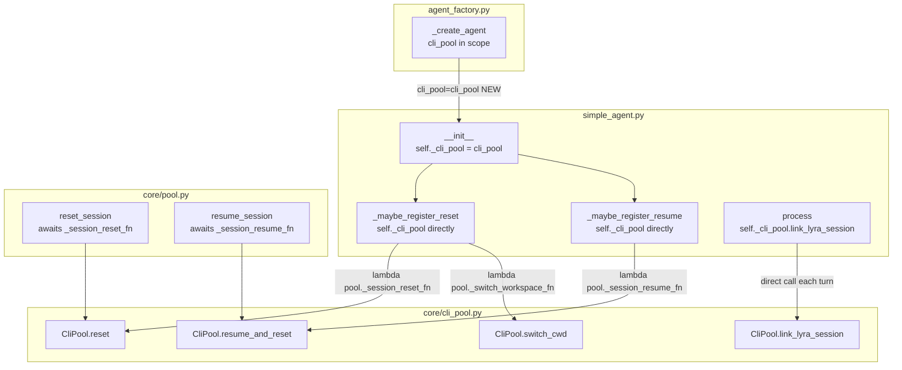
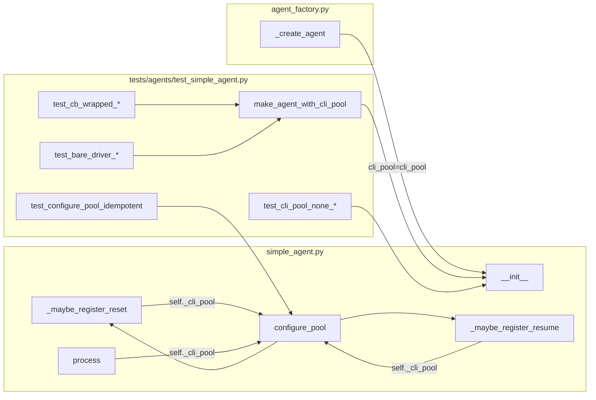

# Plan: CLI Lifecycle / Decorator Gap (#620)

## Summary

Add `cli_pool: CliPool | None = None` to `SimpleAgent.__init__` and route all four
CLI lifecycle calls (`reset`, `switch_cwd`, `resume_and_reset`, `link_lyra_session`)
through `self._cli_pool` directly, bypassing the decorator chain. Wire the factory
to pass `cli_pool` through. No protocol or decorator changes.

## Architecture

### Data flow



### File × Function map



## Agents

| Agent | Tasks | Files |
|---|---|---|
| backend-dev | T1–T6 | `src/lyra/agents/simple_agent.py`, `src/lyra/bootstrap/agent_factory.py` |
| tester | T7–T13 | `tests/agents/test_simple_agent.py` |

## Reference Patterns

- `tests/agents/test_simple_agent.py` — `make_agent()`, `make_pool()` helpers; `MagicMock` / `AsyncMock` provider pattern
- `src/lyra/agents/simple_agent.py:150-177` — existing `_maybe_register_reset/resume` to be replaced
- `src/lyra/bootstrap/agent_factory.py:197-205` — `SimpleAgent(...)` call site

## Consistency Report

- Covered: 12/12 success criteria
- Slices: V1 (T1–T5), V2 (T6), V3 (T7–T13)
- All affordances N1–N5 traced to tasks
- Uncovered: none
- Exemptions: none

---

## Micro-Tasks

### V1 — Constructor + pool-callback rewrites

---

**T1** `[RED]` Import `CliPool` in `simple_agent.py`
- File: `src/lyra/agents/simple_agent.py`
- Add `from lyra.core.cli_pool import CliPool` under `TYPE_CHECKING` guard (import only used in type hints; avoids circular at runtime)
- Verify: `python -c "from lyra.agents.simple_agent import SimpleAgent"`
- Expected: no ImportError
- Time: 2 min | Difficulty: 1 | Agent: backend-dev
- Spec trace: N1 | Parallel-safe: N (T2 depends)

---

**T2** `[RED]` Add `cli_pool` param to `SimpleAgent.__init__`
- File: `src/lyra/agents/simple_agent.py`
- Skeleton:
  ```python
  def __init__(
      self,
      config: Agent,
      provider: LlmProvider,
      cli_pool: "CliPool | None" = None,   # ← new
      circuit_registry: CircuitRegistry | None = None,
      ...
  ) -> None:
      ...
      self._cli_pool = cli_pool
  ```
- Verify: `python -c "from lyra.agents.simple_agent import SimpleAgent; print('ok')"`
- Expected: `ok`
- Time: 3 min | Difficulty: 1 | Agent: backend-dev
- Spec trace: N1 | Parallel-safe: N | Depends: T1

---

**T3** `[RED]` Rewrite `_maybe_register_reset` — replace `getattr` with `self._cli_pool`
- File: `src/lyra/agents/simple_agent.py`
- Replace lines 155-164 with:
  ```python
  def _maybe_register_reset(self, pool: Pool) -> None:
      if self._cli_pool is not None:
          if pool._session_reset_fn is None:
              _pool_id = pool.pool_id
              pool._session_reset_fn = lambda: self._cli_pool.reset(_pool_id)
          if pool._switch_workspace_fn is None:
              _pool_id = pool.pool_id
              pool._switch_workspace_fn = lambda cwd: self._cli_pool.switch_cwd(_pool_id, cwd)
  ```
- Verify: `python -m pytest tests/agents/test_simple_agent.py -x -q 2>&1 | tail -5`
- Expected: existing tests pass (no regression)
- Time: 5 min | Difficulty: 2 | Agent: backend-dev
- Spec trace: N2, SC-1, SC-2 | Parallel-safe: N | Depends: T2

---

**T4** `[RED]` Rewrite `_maybe_register_resume` — replace `getattr` with `self._cli_pool`
- File: `src/lyra/agents/simple_agent.py`
- Replace lines 173-177 with:
  ```python
  def _maybe_register_resume(self, pool: Pool) -> None:
      if self._cli_pool is not None and pool._session_resume_fn is None:
          _pool_id = pool.pool_id
          pool._session_resume_fn = lambda sid: self._cli_pool.resume_and_reset(_pool_id, sid)
  ```
- Verify: `python -m pytest tests/agents/test_simple_agent.py -x -q 2>&1 | tail -5`
- Expected: existing tests pass
- Time: 3 min | Difficulty: 1 | Agent: backend-dev
- Spec trace: N3, SC-3 | Parallel-safe: N | Depends: T2

---

**T5** `[GREEN]` Pass `cli_pool=cli_pool` in `agent_factory._create_agent`
- File: `src/lyra/bootstrap/agent_factory.py`
- Update `SimpleAgent(...)` call at line 197-205:
  ```python
  return SimpleAgent(
      config,
      provider,
      cli_pool=cli_pool,           # ← add
      circuit_registry=circuit_registry,
      msg_manager=msg_manager,
      stt=stt,
      tts=tts,
      agent_store=agent_store,
  )
  ```
- Verify: `python -m pytest tests/ -x -q 2>&1 | tail -5`
- Expected: full suite passes
- Time: 2 min | Difficulty: 1 | Agent: backend-dev
- Spec trace: N5 | Parallel-safe: N | Depends: T3, T4

---

🔴 **RED-GATE V1** — Pool callbacks wired. `/clear` kills subprocess with CB-wrapped driver.
Verify: `python -m pytest tests/agents/ -x -q`

---

### V2 — link_lyra_session inline fix

---

**T6** `[RED]` Fix `link_lyra_session` in `process()`
- File: `src/lyra/agents/simple_agent.py`
- Replace lines 247-249:
  ```python
  # DELETE:
  _link = getattr(self._provider, "link_lyra_session", None)
  if _link is not None:
      _link(pool.pool_id, pool.session_id)

  # REPLACE WITH:
  if self._cli_pool is not None:
      self._cli_pool.link_lyra_session(pool.pool_id, pool.session_id)
  ```
- Verify: `python -m pytest tests/agents/ -x -q 2>&1 | tail -5`
- Expected: existing tests pass
- Time: 3 min | Difficulty: 1 | Agent: backend-dev
- Spec trace: N4, SC-4 | Parallel-safe: N | Depends: T5

---

🔴 **RED-GATE V2** — Session linking works through CB decorator on every turn.
Verify: `python -m pytest tests/agents/ -x -q`

---

### V3 — Regression tests

---

**T7** `[GREEN]` Add `make_agent_with_cli_pool` helper
- File: `tests/agents/test_simple_agent.py`
- Add below `make_agent`:
  ```python
  def make_agent_with_cli_pool(
      provider: object,
      cli_pool: object,
  ) -> SimpleAgent:
      config = Agent(
          name="lyra",
          system_prompt="You are Lyra.",
          memory_namespace="lyra",
          llm_config=ModelConfig(),
      )
      return SimpleAgent(config, cast("LlmProvider", provider), cli_pool=cli_pool)
  ```
- Verify: `python -m pytest tests/agents/test_simple_agent.py -x -q 2>&1 | tail -3`
- Expected: passes
- Time: 3 min | Difficulty: 1 | Agent: tester
- Spec trace: SC-1 | Parallel-safe: N (T8–T13 depend)

---

**T8** `[GREEN]` Test: CB-wrapped provider + `/clear` → `CliPool.reset` called
- File: `tests/agents/test_simple_agent.py`
- Skeleton:
  ```python
  async def test_reset_called_through_cb_decorator(self) -> None:
      cli_pool = MagicMock()
      cli_pool.reset = AsyncMock()
      cb_provider = MagicMock(spec=["complete", "stream", "is_alive"])  # no reset
      agent = make_agent_with_cli_pool(cb_provider, cli_pool)
      pool = make_pool()
      agent.configure_pool(pool)
      await pool.reset_session()
      cli_pool.reset.assert_called_once_with(pool.pool_id)
  ```
- Verify: `python -m pytest tests/agents/test_simple_agent.py::TestSimpleAgentProcess::test_reset_called_through_cb_decorator -v`
- Expected: PASSED
- Time: 5 min | Difficulty: 2 | Agent: tester
- Spec trace: SC-1, SC-7 | Parallel-safe: Y | Depends: T7

---

**T9** `[GREEN]` Test: CB-wrapped + `switch_cwd` and `resume_and_reset`
- File: `tests/agents/test_simple_agent.py`
- Two tests:
  - `test_switch_cwd_called_through_cb_decorator` — pool._switch_workspace_fn wired → `cli_pool.switch_cwd.assert_called_once_with(pool_id, "/some/cwd")`
  - `test_resume_called_through_cb_decorator` — pool._session_resume_fn wired → `cli_pool.resume_and_reset.assert_called_once_with(pool_id, "sess-1")`
- Verify: `python -m pytest tests/agents/test_simple_agent.py -k "switch_cwd or resume" -v`
- Expected: 2 PASSED
- Time: 5 min | Difficulty: 2 | Agent: tester
- Spec trace: SC-2, SC-3, SC-8 | Parallel-safe: Y | Depends: T7

---

**T10** `[GREEN]` Test: CB-wrapped + `link_lyra_session` per turn
- File: `tests/agents/test_simple_agent.py`
- Skeleton:
  ```python
  async def test_link_lyra_session_called_through_cb_decorator(self) -> None:
      cli_pool = MagicMock()
      cb_provider = MagicMock(spec=["complete", "stream", "is_alive"])
      cb_provider.complete = AsyncMock(return_value=LlmResult(result="hi", session_id="s1"))
      agent = make_agent_with_cli_pool(cb_provider, cli_pool)
      pool = make_pool()
      agent.configure_pool(pool)
      await agent.process(make_inbound_message("hi"), pool)
      cli_pool.link_lyra_session.assert_called_once_with(pool.pool_id, pool.session_id)
  ```
- Verify: `python -m pytest tests/agents/test_simple_agent.py -k "link_lyra" -v`
- Expected: PASSED
- Time: 5 min | Difficulty: 2 | Agent: tester
- Spec trace: SC-4, SC-8 | Parallel-safe: Y | Depends: T7

---

**T11** `[GREEN]` Test: bare `ClaudeCliDriver` path — all four ops still fire
- File: `tests/agents/test_simple_agent.py`
- Provider mock has `reset`, `switch_cwd`, `resume_and_reset`, `link_lyra_session` (bare driver, no CB).
  Assert all four are called via the same `make_agent_with_cli_pool` path.
- Verify: `python -m pytest tests/agents/test_simple_agent.py -k "bare_driver" -v`
- Expected: PASSED
- Time: 5 min | Difficulty: 2 | Agent: tester
- Spec trace: SC-6, SC-9 | Parallel-safe: Y | Depends: T7

---

**T12** `[GREEN]` Test: `configure_pool` idempotency
- File: `tests/agents/test_simple_agent.py`
- Call `agent.configure_pool(pool)` twice, assert callbacks are set exactly once (not overwritten).
- Verify: `python -m pytest tests/agents/test_simple_agent.py -k "idempotent" -v`
- Expected: PASSED
- Time: 3 min | Difficulty: 1 | Agent: tester
- Spec trace: SC-10 | Parallel-safe: Y | Depends: T7

---

**T13** `[GREEN]` Test: `cli_pool=None` — no errors, no AttributeError
- File: `tests/agents/test_simple_agent.py`
- Construct `SimpleAgent` with `cli_pool=None` (SDK backend path). Call `configure_pool` + `process`. Assert no exception raised, `pool._session_reset_fn` is None.
- Verify: `python -m pytest tests/agents/test_simple_agent.py -k "cli_pool_none" -v`
- Expected: PASSED
- Time: 3 min | Difficulty: 1 | Agent: tester
- Spec trace: SC-5 | Parallel-safe: Y | Depends: T7

---

## Task IDs

<!-- Generated by /plan. Used by /implement to resume tasks on session restart. -->
- T1: 5 — Import CliPool in simple_agent.py
- T2: 6 — Add cli_pool param to SimpleAgent.__init__
- T3: 7 — Rewrite _maybe_register_reset using self._cli_pool
- T4: 8 — Rewrite _maybe_register_resume using self._cli_pool
- T5: 9 — Pass cli_pool=cli_pool in agent_factory._create_agent
- T6: 10 — RED-GATE V1: verify pool callbacks wired end-to-end
- T7: 11 — Fix link_lyra_session inline call in process()
- T8: 12 — RED-GATE V2: verify session linking works through CB decorator
- T9: 13 — Add make_agent_with_cli_pool helper to test fixture
- T10: 14 — Test: CB-wrapped provider + /clear → CliPool.reset called
- T11: 15 — Test: CB-wrapped + switch_cwd and resume_and_reset
- T12: 16 — Test: CB-wrapped + link_lyra_session per turn
- T13: 17 — Test: bare ClaudeCliDriver — all four ops still fire
- T14: 18 — Test: configure_pool idempotency
- T15: 19 — Test: cli_pool=None — no errors, no AttributeError
