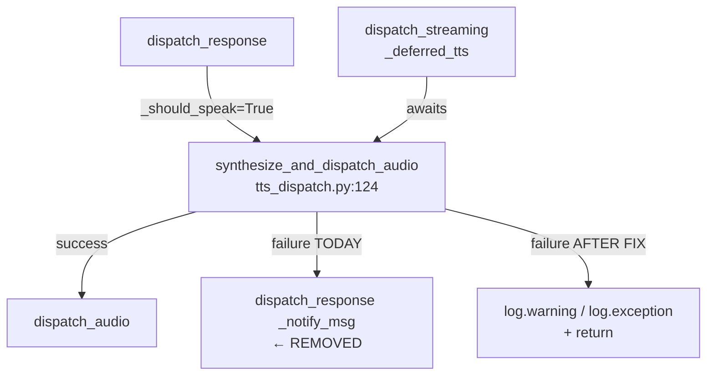
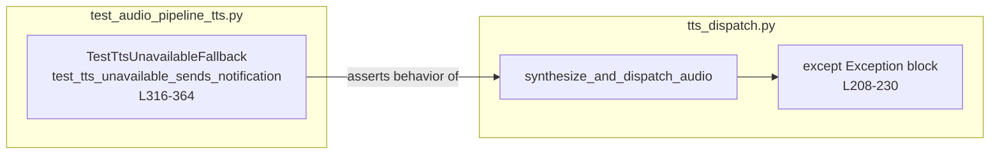

## Summary

Remove the `dispatch_response` call from `synthesize_and_dispatch_audio`'s error handler.
Text response is already delivered before TTS runs; the notification is redundant and
creates a reentrancy path. Fix is a deletion in one file + flipping one test assertion.

## Architecture





## Agents

| Agent | Tasks | Files |
|---|---|---|
| tester | T1 (RED) | `tests/core/test_audio_pipeline_tts.py` |
| backend-dev | T2 (GREEN) | `src/lyra/core/tts_dispatch.py` |

## Consistency Report

| Spec criterion | Covered by |
|---|---|
| `dispatch_response` not called on TTS failure | T1 (RED assert) + T2 (GREEN impl) |
| log.warning/log.exception still fires | T2 (impl preserves log calls) |
| Normal TTS happy path untouched | Existing tests (no change) |
| dispatch_audio called on success | Existing `test_audio_pipeline_tts.py` (no change) |

Covered: 4/4 · Uncovered: 0 · Exemptions: 0

## Micro-Tasks

### V1 — Break TTS retry loop

---

#### T1 — Update TestTtsUnavailableFallback to assert no dispatch_response [RED]

- **File:** `tests/core/test_audio_pipeline_tts.py`
- **Phase:** RED
- **Agent:** tester
- **Parallel:** N
- **Difficulty:** 1
- **Spec trace:** SC-1, SC-7
- **Time:** 3 min

Update `test_tts_unavailable_sends_notification` (L316-364): flip
`hub.dispatch_response.assert_awaited_once()` → `hub.dispatch_response.assert_not_awaited()`.
Remove assertions on `dispatched_msg` and `dispatched_response` (no longer dispatched).
Rename test to `test_tts_unavailable_no_dispatch_response` to reflect new intent.
Update docstring to reflect that text was already sent — notification not needed.

Also add `test_tts_generic_exception_no_dispatch_response` to cover non-`TtsUnavailableError`.

**Verify:** `uv run pytest tests/core/test_audio_pipeline_tts.py::TestTtsUnavailableFallback -x -q`
**Expected (RED):** test fails — production code still calls dispatch_response

---

#### T2 — Remove dispatch_response from TTS error handler [GREEN]

- **File:** `src/lyra/core/tts_dispatch.py`
- **Phase:** GREEN
- **Agent:** backend-dev
- **Parallel:** N (blocked by T1)
- **Difficulty:** 1
- **Spec trace:** SC-1, SC-2, SC-3, SC-4
- **Time:** 3 min

In `synthesize_and_dispatch_audio` (L208-230):
- Delete `_notify_msg = dataclasses.replace(msg, modality="text")` (L219)
- Delete `await self._hub.dispatch_response(_notify_msg, Response(content=_notif))` (L230)
- Delete `_notif = ...` assignment (L215-218) — no longer needed
- Keep all `log.warning` / `log.exception` calls
- Remove `dataclasses` import if it becomes unused (check other usages first)

Expected shape after fix:
```python
except Exception as _tts_exc:
    from ..tts import TtsUnavailableError
    if isinstance(_tts_exc, TtsUnavailableError):
        log.warning("TTS adapter unavailable for msg id=%s", msg.id)
    else:
        log.exception("TTS synthesis failed (msg id=%s)", msg.id)
```

**Verify:** `uv run pytest tests/core/test_audio_pipeline_tts.py -x -q`
**Expected (GREEN):** all tests pass

---

**RED-GATE V1:** `uv run pytest tests/core/test_audio_pipeline_tts.py tests/core/test_hub_dispatch_response.py -q`

## Task IDs

<!-- Generated by /plan. Used by /implement to resume tasks on session restart. -->
- T1: 11 — Update TestTtsUnavailableFallback — assert dispatch_response NOT called on TTS failure
- T2: 12 — Remove dispatch_response + _notify_msg from TTS error handler in tts_dispatch.py
