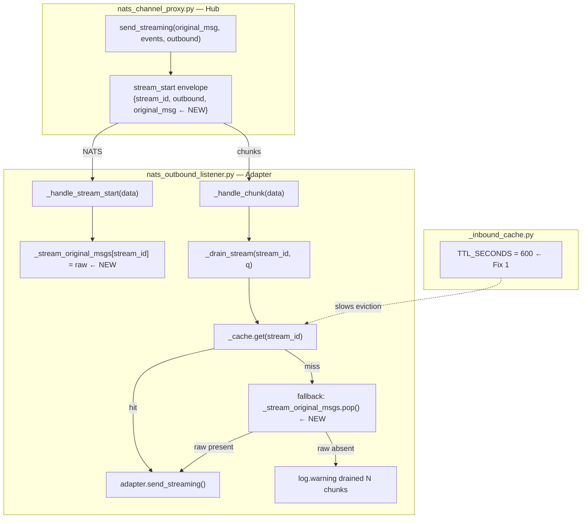
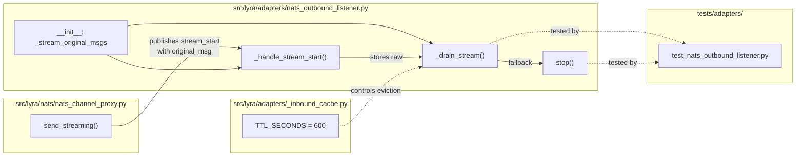

## Summary

Fix silent streaming response drops by raising the InboundCache TTL (Fix 1) and embedding `original_msg` in the `stream_start` envelope with a fallback reconstruction path in `_drain_stream` (Fix 2), mirroring the already-proven `send`-type resilience pattern.

## Architecture

### Data Flow



### File × Function Map



## Agents

| Agent | Task count | Files |
|---|---|---|
| backend-dev | 6 (T1–T6) | `src/lyra/adapters/_inbound_cache.py`, `src/lyra/nats/nats_channel_proxy.py`, `src/lyra/adapters/nats_outbound_listener.py` |
| tester | 4 (T7–T10) | `tests/adapters/test_nats_outbound_listener.py` |

## Consistency Report

- Criteria covered: 11/11
- Uncovered criteria: none
- Tasks without spec backing: none
- Gold plating exemptions applied: 0

## Micro-Tasks

### Slice V1: TTL bump

#### Task 1: Bump TTL_SECONDS from 120 to 600 → backend-dev
- **File:** `src/lyra/adapters/_inbound_cache.py`
- **Snippet:** `TTL_SECONDS = 600`
- **Verify:** `grep "TTL_SECONDS = 600" src/lyra/adapters/_inbound_cache.py` (ready)
- **Expected:** Matching line printed
- **Time:** 2 min
- **Difficulty:** 1
- **Traces:** SC-1
- **Phase:** RED

### Slice V2: stream_start fallback

#### Task 2: Embed original_msg in stream_start envelope [P] → backend-dev
- **File:** `src/lyra/nats/nats_channel_proxy.py`
- **Snippet:**
  ```python
  # In send_streaming(), inside `if outbound is not None:` block
  header = {
      "type": "stream_start",
      "stream_id": original_msg.id,
      "outbound": json.loads(serialize(outbound).decode("utf-8")),
      "original_msg": json.loads(serialize(original_msg).decode("utf-8")),  # NEW
  }
  ```
- **Verify:** `grep '"original_msg"' src/lyra/nats/nats_channel_proxy.py` (ready)
- **Expected:** Matching line in send_streaming
- **Time:** 3 min
- **Difficulty:** 2
- **Traces:** SC-2
- **Phase:** RED

#### Task 3: Add _stream_original_msgs dict to __init__ [P] → backend-dev
- **File:** `src/lyra/adapters/nats_outbound_listener.py`
- **Snippet:**
  ```python
  # In __init__, alongside _stream_outbound
  self._stream_original_msgs: dict[str, dict] = {}
  ```
- **Verify:** `grep "_stream_original_msgs" src/lyra/adapters/nats_outbound_listener.py` (ready)
- **Expected:** Multiple matching lines (init, _handle_stream_start, _drain_stream, stop)
- **Time:** 2 min
- **Difficulty:** 1
- **Traces:** SC-3
- **Phase:** RED

#### Task 4: Store original_msg in _handle_stream_start → backend-dev
- **File:** `src/lyra/adapters/nats_outbound_listener.py`
- **Snippet:**
  ```python
  # In _handle_stream_start(), after storing _stream_outbound[stream_id]
  raw_orig = data.get("original_msg")
  if raw_orig is not None:
      self._stream_original_msgs[stream_id] = raw_orig
  ```
- **Verify:** `grep "raw_orig" src/lyra/adapters/nats_outbound_listener.py` (ready)
- **Expected:** raw_orig lines present
- **Time:** 3 min
- **Difficulty:** 2
- **Traces:** SC-4
- **Phase:** RED
- **Depends on:** T3

#### Task 5: Add fallback in _drain_stream + finally cleanup → backend-dev
- **File:** `src/lyra/adapters/nats_outbound_listener.py`
- **Snippet:**
  ```python
  # In _drain_stream(), replace the cache-miss drain block:
  original_msg = self._cache.get(stream_id)
  if original_msg is None:
      raw = self._stream_original_msgs.pop(stream_id, None)
      if raw is not None:
          try:
              original_msg = _deserialize_dict(raw, InboundMessage)
          except Exception:
              log.warning(
                  "NatsOutboundListener: bad embedded original_msg"
                  " for stream_id=%r", stream_id,
              )
  if original_msg is None:
      drained = 0
      while not q.empty():
          await q.get()
          drained += 1
      log.warning(
          "NatsOutboundListener: drained %d chunk(s) for unknown stream_id=%r",
          drained, stream_id,
      )
      self._stream_tasks.pop(stream_id, None)
      self._stream_queues.pop(stream_id, None)
      return

  # In the finally block, add:
  self._stream_original_msgs.pop(stream_id, None)
  ```
- **Verify:** `python -c "from lyra.adapters.nats_outbound_listener import NatsOutboundListener"` (ready)
- **Expected:** No import errors
- **Time:** 5 min
- **Difficulty:** 3
- **Traces:** SC-5, SC-6
- **Phase:** RED
- **Depends on:** T3, T4

#### Task 6: Update stop() to clear _stream_original_msgs and _stream_outbound [P with T4] → backend-dev
- **File:** `src/lyra/adapters/nats_outbound_listener.py`
- **Snippet:**
  ```python
  # In stop(), after clearing _stream_tasks and _stream_queues:
  self._stream_original_msgs.clear()
  self._stream_outbound.clear()  # also clear this pre-existing dict
  ```
- **Verify:** `grep "stream_original_msgs.clear\|stream_outbound.clear" src/lyra/adapters/nats_outbound_listener.py` (ready)
- **Expected:** Both clear() lines present in stop()
- **Time:** 2 min
- **Difficulty:** 1
- **Traces:** SC-10
- **Phase:** RED
- **Depends on:** T3

#### RED-GATE: RED complete V2 → tester
- **Verify:** T2, T3, T4, T5, T6 all marked complete
- **Phase:** RED-GATE

### Slice V3: Tests

#### Task 7: Unit test — cache miss + embedded original_msg → send_streaming called [P] → tester
- **File:** `tests/adapters/test_nats_outbound_listener.py`
- **Snippet:**
  ```python
  @pytest.mark.asyncio
  async def test_stream_cache_miss_with_embedded_original_msg_delivers() -> None:
      """Cache miss + original_msg in stream_start → send_streaming called, not drain-warn."""
      from lyra.nats._serialize import serialize
      ...
      # 1. Do NOT call cache_inbound (simulate cache miss)
      # 2. Dispatch stream_start with embedded original_msg
      # 3. Dispatch a done chunk
      # 4. Await drain task
      # 5. Assert adapter.send_streaming called once
      # 6. Assert no warning logged for "drained"
  ```
- **Verify:** `uv run pytest tests/adapters/test_nats_outbound_listener.py -k "cache_miss_with_embedded" -v` (ready)
- **Expected:** 1 passed
- **Time:** 8 min
- **Difficulty:** 3
- **Traces:** SC-7
- **Phase:** GREEN
- **Depends on:** RED-GATE V2

#### Task 8: Unit test — cache hit path unchanged [P] → tester
- **File:** `tests/adapters/test_nats_outbound_listener.py`
- **Snippet:**
  ```python
  @pytest.mark.asyncio
  async def test_stream_cache_hit_does_not_use_stream_original_msgs() -> None:
      """Cache hit → send_streaming called via cache, _stream_original_msgs not consulted."""
      # 1. cache_inbound(msg)
      # 2. Dispatch stream_start with original_msg
      # 3. Dispatch done chunk, await task
      # 4. Assert send_streaming called; _stream_original_msgs empty after completion
  ```
- **Verify:** `uv run pytest tests/adapters/test_nats_outbound_listener.py -k "cache_hit_does_not_use" -v` (ready)
- **Expected:** 1 passed
- **Time:** 5 min
- **Difficulty:** 2
- **Traces:** SC-8
- **Phase:** GREEN
- **Depends on:** RED-GATE V2

#### Task 9: Unit test — both cache and _stream_original_msgs missing → warn + drain [P] → tester
- **File:** `tests/adapters/test_nats_outbound_listener.py`
- **Snippet:**
  ```python
  @pytest.mark.asyncio
  async def test_stream_both_missing_warns_and_drains() -> None:
      """No cache entry, no embedded original_msg → drained warning, send_streaming not called."""
      # 1. No cache_inbound, no stream_start
      # 2. Send chunk directly
      # 3. Await task
      # 4. Assert send_streaming NOT called
      # 5. Assert warning "drained" logged
  ```
- **Verify:** `uv run pytest tests/adapters/test_nats_outbound_listener.py -k "both_missing_warns" -v` (ready)
- **Expected:** 1 passed
- **Time:** 5 min
- **Difficulty:** 2
- **Traces:** SC-9
- **Phase:** GREEN
- **Depends on:** RED-GATE V2

#### Task 10: Unit test — stop() clears _stream_original_msgs [P] → tester
- **File:** `tests/adapters/test_nats_outbound_listener.py`
- **Snippet:**
  ```python
  @pytest.mark.asyncio
  async def test_stop_clears_stream_original_msgs() -> None:
      """stop() leaves _stream_original_msgs empty."""
      # 1. Manually populate _stream_original_msgs
      # 2. Call stop() (with mocked nc.subscribe + sub)
      # 3. Assert _stream_original_msgs == {}
  ```
- **Verify:** `uv run pytest tests/adapters/test_nats_outbound_listener.py -k "stop_clears_stream_original" -v` (ready)
- **Expected:** 1 passed
- **Time:** 3 min
- **Difficulty:** 1
- **Traces:** SC-11
- **Phase:** GREEN
- **Depends on:** RED-GATE V2

## Task IDs

<!-- Generated by /plan. Used by /implement to resume tasks on session restart. -->
- T1: 10 — T1: Bump TTL_SECONDS from 120 to 600
- T2: 11 — T2: Embed original_msg in stream_start envelope
- T3: 12 — T3: Add _stream_original_msgs dict to NatsOutboundListener.__init__
- T4: 13 — T4: Store original_msg in _handle_stream_start
- T5: 14 — T5: Add fallback in _drain_stream + finally cleanup
- T6: 15 — T6: Update stop() to clear _stream_original_msgs and _stream_outbound
- RED-GATE: 16 — RED-GATE: V2 implementation complete
- T7: 17 — T7: Unit test — cache miss + embedded original_msg → send_streaming called
- T8: 18 — T8: Unit test — cache hit path unchanged
- T9: 19 — T9: Unit test — both cache and _stream_original_msgs missing → warn + drain
- T10: 20 — T10: Unit test — stop() clears _stream_original_msgs
