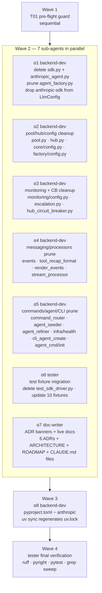
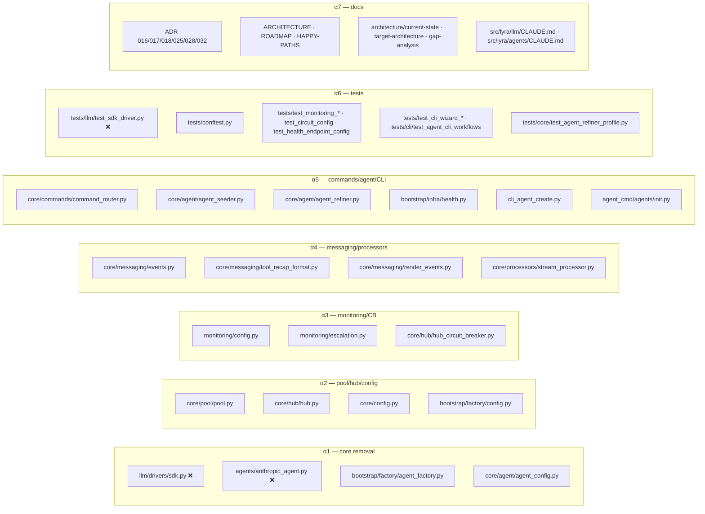

## Summary

Remove the `anthropic-sdk` backend end-to-end via parallel sub-agents
working on disjoint file groups. One pre-flight guard → one massively
parallel wave of 7 sub-agents → deps wave → final verification. The
work is mostly pure deletion/prune; parallelism buys wall-clock time,
not added complexity.

## Architecture





## Bootstrap Context

- **Disjoint file groups:** every wave-2 sub-agent owns a file set that does not overlap with any other sub-agent. Parallel-safe by construction — no merge conflicts possible.
- **Convergence point:** wave-2 runs while the `anthropic-sdk` backend is already rejected by the validator (α1 lands that change) and while tests are already migrated to `claude-cli` fixtures (α6). Both edits are in α1/α6's respective files, not contested.
- **Risk:** `pyproject.toml` removal of `anthropic` (α8) happens *after* α1 deletes every file that imports `anthropic`. Wave 3 depends on Wave 2 completing.
- **Reference pattern:** `NatsLlmDriver` wiring in `agent_factory.py` shows the shape of a backend-branch prune; mirror its "no-op when missing" style.

## Agents

| Agent | Role | Files |
|-------|------|-------|
| α1 backend-dev | Core removal | sdk.py · anthropic_agent.py · agent_factory.py · agent_config.py |
| α2 backend-dev | Pool/hub/config | pool.py · hub.py · core/config.py · factory/config.py |
| α3 backend-dev | Monitoring + CB | monitoring/config.py · monitoring/escalation.py · hub_circuit_breaker.py |
| α4 backend-dev | Messaging/processors | 3× messaging · stream_processor.py |
| α5 backend-dev | Commands/agent/CLI | command_router · agent_seeder · agent_refiner · infra/health · cli_agent_create · agent_cmd/init |
| α6 tester | Test fixtures | delete test_sdk_driver.py + update 10 test files |
| α7 doc-writer | Docs | 6 ADRs + 3 architecture docs + ARCHITECTURE + ROADMAP + HAPPY-PATHS + 2 CLAUDE.md |
| α8 backend-dev | Deps | pyproject.toml + uv.lock |
| tester | Final gate | ruff + pyright + pytest + grep sweep |

## Consistency Report

- **Criteria covered:** 14 / 14 (SC-01…SC-14 all traced to ≥1 task)
- **Breadboard IDs covered:** PRE, V1, D1, D2, D3, F1, F2, F3, P1, P2, C1, C2, X1, T1, M1, M2, DOC1, DOC2 — 18 / 18
- **Uncovered:** none
- **Untraced tasks:** none

## Micro-Tasks

### Wave 1 — Pre-flight (sequential)

**T01 [RED-GATE]** `[P:N]` `backend-dev` · diff 2 · 3 min · Spec: PRE, SC-14
- Grep workspace + `~/.lyra/auth.db` for live `backend = "anthropic-sdk"` seeds.
- Commands:
  ```bash
  grep -rn 'backend\s*=\s*"anthropic-sdk"' src/ tests/ docs/ agents/ ~/.lyra/agents/ 2>/dev/null || true
  sqlite3 ~/.lyra/auth.db "SELECT id, backend FROM agents WHERE backend='anthropic-sdk';" 2>/dev/null || true
  ```
- **Expected:** zero live agent seeds (fixture hits OK, pruned in α6). Any live hit → abort, migrate first.

---

### Wave 2 — 7 sub-agents in parallel

Launch all 7 in a single batch. Each works in the same worktree but on
disjoint files → no conflicts. Each agent returns a one-line summary.

**T02 [GREEN]** `[P:Y]` `α1 backend-dev` · diff 3 · 8 min · Spec: D1, D2, F1, F2, F3, V1, SC-01, SC-02, SC-04, SC-05, SC-06
Delegate to a `backend-dev` sub-agent with the brief:
> Drop the `anthropic-sdk` backend code path. Work in the current
> worktree. Steps: (1) `git rm src/lyra/llm/drivers/sdk.py`; (2)
> `git rm src/lyra/agents/anthropic_agent.py`; (3) prune every
> `anthropic-sdk` / `AnthropicSdkDriver` / `AnthropicAgent` reference
> in `src/lyra/bootstrap/factory/agent_factory.py` — including the
> shared-provider branch (≈ L75–89), the `backend == "anthropic-sdk"`
> branch in `build_agent` (≈ L171–183), the smart-routing gate on the
> sdk backend (≈ L123), the `circuit_registry.get("anthropic")` lookup,
> and any docstring mentions; (4) remove `"anthropic-sdk"` from the
> allowed backends set in `src/lyra/core/agent/agent_config.py` (≈ L12)
> and update the error message to list only the surviving backends.
> Use `sed` or the Edit tool — no mocks, no shims. Verify:
> `grep -n 'anthropic-sdk\|AnthropicSdk\|AnthropicAgent' src/lyra/bootstrap/factory/agent_factory.py src/lyra/core/agent/agent_config.py` empty.
> Stage your files only (¬git add -A). Report: files changed + grep-clean confirmation.

**T03 [GREEN]** `[P:Y]` `α2 backend-dev` · diff 3 · 6 min · Spec: P1, P2, C1, C2, SC-07, SC-08
Delegate to a `backend-dev` sub-agent:
> Drop all SDK-history and max-sdk-history state. Files:
> `src/lyra/core/pool/pool.py` — remove the `sdk_history` deque, the
> `max_sdk_history` attribute + ctor kwarg, `extend_sdk_history`,
> `sdk_history.clear()`, and the `source_turns=len(self.sdk_history)`
> metric (drop the field if no other code reads it; replace with `0`
> otherwise and grep to confirm). `src/lyra/core/config.py` +
> `src/lyra/bootstrap/factory/config.py` — remove `max_sdk_history`
> fields. `src/lyra/core/hub/hub.py` — remove `MAX_SDK_HISTORY`
> constant and every `max_sdk_history` kwarg threading. Verify:
> `grep -rn 'sdk_history\|MAX_SDK_HISTORY\|max_sdk_history' src/lyra` empty.
> Stage your files only. Report: files + grep confirmation.

**T04 [GREEN]** `[P:Y]` `α3 backend-dev` · diff 2 · 4 min · Spec: M1, SC-04
Delegate to a `backend-dev` sub-agent:
> Drop the `anthropic` circuit-breaker + health entry. Files:
> `src/lyra/monitoring/config.py`, `src/lyra/monitoring/escalation.py`,
> `src/lyra/core/hub/hub_circuit_breaker.py`. Remove every reference
> to the `anthropic` circuit / backend. Verify:
> `grep -n '"anthropic"\|anthropic-sdk' src/lyra/monitoring src/lyra/core/hub/hub_circuit_breaker.py` empty.
> Stage your files only.

**T05 [GREEN]** `[P:Y]` `α4 backend-dev` · diff 3 · 6 min · Spec: M2, SC-04
Delegate to a `backend-dev` sub-agent:
> Prune `anthropic-sdk`-specific branches in messaging + processors.
> Files: `src/lyra/core/messaging/events.py`,
> `src/lyra/core/messaging/tool_recap_format.py`,
> `src/lyra/core/messaging/render_events.py`,
> `src/lyra/core/processors/stream_processor.py`. Leave CLI-only paths
> intact. Verify: `grep -n 'anthropic-sdk\|AnthropicSdk' {files}` empty.
> Stage your files only.

**T06 [GREEN]** `[P:Y]` `α5 backend-dev` · diff 3 · 8 min · Spec: M2, SC-04
Delegate to a `backend-dev` sub-agent:
> Prune `anthropic-sdk`-specific branches in commands/agent/CLI.
> Files: `src/lyra/core/commands/command_router.py`,
> `src/lyra/core/agent/agent_seeder.py`,
> `src/lyra/core/agent/agent_refiner.py`,
> `src/lyra/bootstrap/infra/health.py`,
> `src/lyra/cli_agent_create.py`,
> `src/lyra/agent_cmd/agents/init.py`. Leave CLI paths intact. Verify:
> `grep -n 'anthropic-sdk\|AnthropicSdk' {files}` empty.
> Stage your files only.

**T07 [GREEN]** `[P:Y]` `α6 tester` · diff 3 · 10 min · Spec: D3, T1, SC-03, SC-11
Delegate to a `tester` sub-agent:
> Migrate tests off the `anthropic-sdk` backend. Steps:
> (1) `git rm tests/llm/test_sdk_driver.py`.
> (2) In each of these test files, replace `backend="anthropic-sdk"`
> fixtures with `backend="claude-cli"` when the test is backend-
> agnostic, or delete the test when it asserts SDK-specific behavior:
> `tests/conftest.py`, `tests/test_monitoring_config.py`,
> `tests/test_monitoring_escalation.py`,
> `tests/test_monitoring_checks_http_idle_reaper.py`,
> `tests/test_circuit_config.py`,
> `tests/test_health_endpoint_config.py`,
> `tests/test_cli_wizard_create.py`,
> `tests/test_cli_wizard_validate.py`,
> `tests/cli/test_agent_cli_workflows.py`,
> `tests/core/test_agent_refiner_profile.py`.
> Verify: `grep -rn 'anthropic-sdk' tests/` returns zero.
> Do NOT run pytest yet (other α's are editing src in parallel).
> Stage your files only.

**T08 [GREEN]** `[P:Y]` `α7 doc-writer` · diff 3 · 10 min · Spec: DOC1, DOC2, SC-12, SC-13
Delegate to a `doc-writer` sub-agent:
> Superseded banners on historical ADRs; live-doc updates for the
> rest. (1) Prepend this banner as the first line after frontmatter in
> each of `docs/architecture/adr/016-*.mdx`, `017-*.mdx`, `018-*.mdx`,
> `025-*.mdx`, `028-*.mdx`, `032-*.mdx`:
> `> **Superseded by #666.** AnthropicSdkDriver and the anthropic-sdk backend have been removed. Historical content below preserved for context.`
> (2) Update these live docs so they no longer present
> `anthropic-sdk` as a supported backend (rewrite sentences, don't
> just strike through): `docs/ARCHITECTURE.md`, `docs/ROADMAP.md`,
> `docs/HAPPY-PATHS.md`,
> `docs/architecture/current-state.md`,
> `docs/architecture/target-architecture.md`,
> `docs/architecture/gap-analysis.md`,
> `src/lyra/llm/CLAUDE.md`, `src/lyra/agents/CLAUDE.md`.
> Verify: `grep -rn 'anthropic-sdk' docs/ src/lyra/llm/CLAUDE.md src/lyra/agents/CLAUDE.md`
> returns only matches inside ADR files that now carry the banner.
> Stage your files only.

**T09 [RED-GATE]** `[P:N]` `tester` · diff 2 · 3 min · Spec: SC-11
After all 7 wave-2 agents return, run an interim check from the
coordinator (main context):
```bash
grep -rn 'AnthropicSdkDriver\|AnthropicAgent' src/ tests/
grep -rn 'anthropic-sdk' src/ tests/
```
Both empty → proceed to Wave 3. Any hits → spawn a `fixer` sub-agent
with the remaining matches as input.

---

### Wave 3 — Dependencies

**T10 [GREEN]** `[P:N]` `α8 backend-dev` · diff 2 · 4 min · Spec: X1, SC-09, SC-10
Delegate to a `backend-dev` sub-agent:
> Drop the `anthropic` runtime dependency. Edit `pyproject.toml`:
> remove the `anthropic` entry from `[project].dependencies`. Run
> `uv sync` to regenerate `uv.lock`. Verify: `grep -n '^name = "anthropic"' uv.lock`
> returns zero; `uv run lyra --help` exits 0. Stage `pyproject.toml`
> and `uv.lock` only.

---

### Wave 4 — Final verification

**T11 [RED-GATE]** `[P:N]` `tester` · diff 1 · 4 min · Spec: all
Delegate to a `tester` sub-agent:
> Run the full quality gate:
> ```bash
> uv run ruff check . && uv run ruff format --check .
> uv run pyright
> uv run pytest
> grep -rn 'AnthropicSdkDriver\|AnthropicAgent' src/ tests/
> grep -rn 'anthropic-sdk' src/ tests/
> grep -i '^name = "anthropic"' uv.lock | head -5
> ```
> Expected: all commands exit 0; grep hits zero in src/tests; uv.lock
> has no `anthropic` package. Report pass/fail + any findings.

---

## Parallelization

- **Wave 1:** 1 sequential task (3 min).
- **Wave 2:** 7 parallel sub-agents, disjoint file groups. Wall clock ≈ slowest agent (~10 min).
- **Wave 3:** 1 task (4 min), depends on Wave 2.
- **Wave 4:** 1 task (4 min), final gate.

Estimated wall clock: ~21 min vs. ~70 min sequential.

## Launch pattern (for /implement)

```
// Wave 1
Agent(α0_guard)  // T01 — must pass before proceeding

// Wave 2: single message with 7 Agent tool calls in parallel
Agent(α1_core)       // T02
Agent(α2_pool)       // T03
Agent(α3_monitoring) // T04
Agent(α4_messaging)  // T05
Agent(α5_commands)   // T06
Agent(α6_tests)      // T07
Agent(α7_docs)       // T08

// Coordinator runs T09 greps in-line
// Wave 3
Agent(α8_deps)       // T10

// Wave 4
Agent(α_final_gate)  // T11
```
