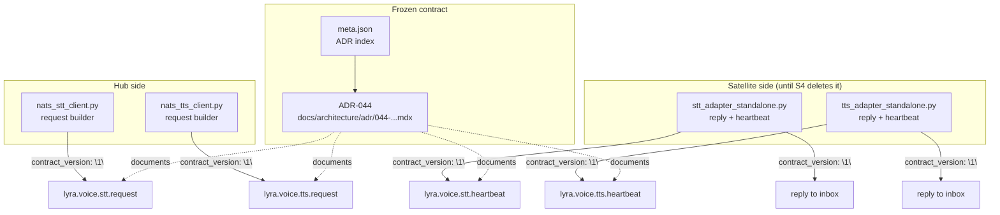
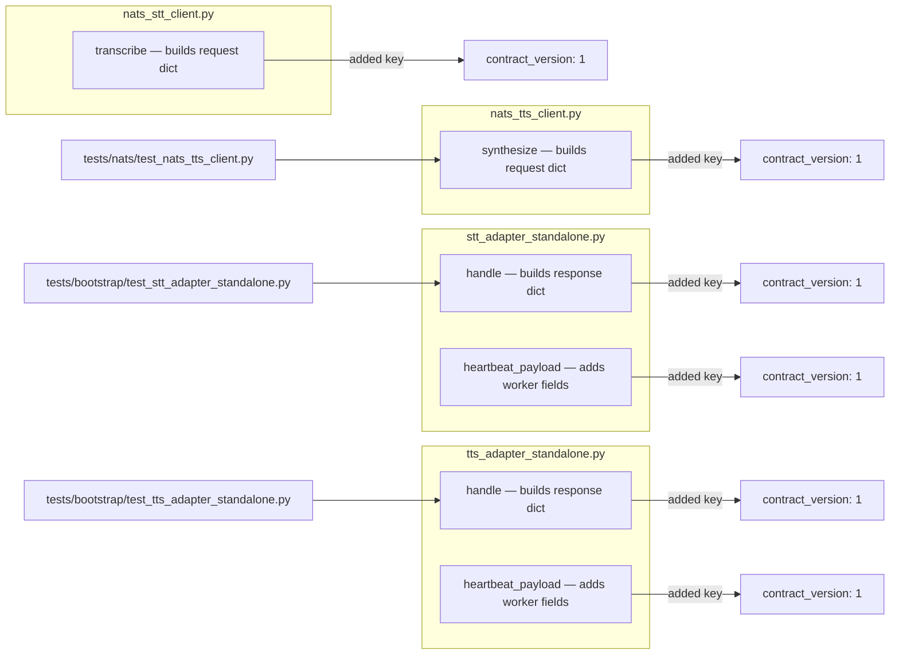

## Summary

Freeze the lyra↔voicecli NATS voice contract as ADR-044 and add a `contract_version: "1"` field to all outgoing payloads (requests, replies, heartbeats). Read path is defensive — consumers ignore unknown values. Fully forward-compatible; no behavior change.

## Architecture

### Data flow — where `contract_version` lands

### File × function map

## Agents

| Agent | Task count | Files |
|---|---|---|
| `doc-writer` | 2 | `docs/architecture/adr/044-lyra-voicecli-nats-contract.mdx` (new), `docs/architecture/adr/meta.json` |
| `backend-dev` | 4 | `src/lyra/nats/nats_{stt,tts}_client.py`, `src/lyra/bootstrap/{stt,tts}_adapter_standalone.py` |
| `tester` | 1 | test updates for the 4 files above |

## Scope boundaries

**In:** ADR-044 creation, `contract_version` plumbing in 4 Python files, related test updates.

**Out:** any deletion of `STTService`/`TTSService` (that's S4 / #690), any pyproject change (that's S5 / #691), any supervisor conf change (that's S3 / #689), voicecli-side NATS subscriber (that's voiceCLI#42).

## Micro-tasks

### T1 — Write ADR-044

- **Agent:** doc-writer
- **File:** `docs/architecture/adr/044-lyra-voicecli-nats-contract.mdx` (new)
- **Content:** Status=Accepted; Context (current two-path state → NATS-only decision); the locked contract with exact JSON schemas for:
  - Requests: `lyra.voice.stt.request`, `lyra.voice.tts.request`
  - Success/error reply schemas
  - Heartbeat subjects + required (`worker_id`) + optional (`model_loaded`, `vram_used_mb`, `vram_total_mb`, `active_requests`) fields + interval ≤ 5s, hub TTL 15s
  - `contract_version: "1"` additive field — producers MUST emit, consumers MUST ignore unknown values
  - Example payloads (copy-paste-able JSON)
  - Rationale + consequences + relation to #658
- **Reference pattern:** `docs/architecture/adr/043-roxabi-autodeploy-per-project-manifests.mdx`
- **Verify:** file exists; `mdx` frontmatter has `title` + `description`
- **Spec trace:** SC-7 (ADR-044 exists), S1 slice description
- **Difficulty:** 3
- **Est:** 15–25 min

### T2 — Register ADR-044 in meta.json

- **Agent:** doc-writer
- **File:** `docs/architecture/adr/meta.json`
- **Change:** append `"044-lyra-voicecli-nats-contract"` to the `pages` array (keep sort order)
- **Verify:** `jq '.pages[-3:]' docs/architecture/adr/meta.json` shows 043, 044
- **Depends on:** T1
- **Difficulty:** 1
- **Est:** 2 min

### T3 — Add contract_version to `nats_stt_client.transcribe` request

- **Agent:** backend-dev
- **File:** `src/lyra/nats/nats_stt_client.py`
- **Change:** in the `request = {...}` dict (around line 124), add `"contract_version": "1"`. Nothing else changes — reply parsing already uses `data.get(...)` so any `contract_version` on the way back is silently tolerated.
- **Verify:** `rg 'contract_version' src/lyra/nats/nats_stt_client.py`
- **Spec trace:** SC-2 (contract_version in outgoing payloads)
- **Depends on:** T1 (schema is frozen by the ADR)
- **Parallel-safe with:** T4, T5, T6 (different files)
- **Difficulty:** 1
- **Est:** 3 min

### T4 — Add contract_version to `nats_tts_client.synthesize` request

- **Agent:** backend-dev
- **File:** `src/lyra/nats/nats_tts_client.py`
- **Change:** in the `request: dict = {...}` dict (around line 104), add `"contract_version": "1"`.
- **Verify:** `rg 'contract_version' src/lyra/nats/nats_tts_client.py`
- **Spec trace:** SC-2
- **Depends on:** T1
- **Parallel-safe with:** T3, T5, T6
- **Difficulty:** 1
- **Est:** 3 min

### T5 — Add contract_version to STT satellite reply + heartbeat

- **Agent:** backend-dev
- **File:** `src/lyra/bootstrap/stt_adapter_standalone.py`
- **Change:**
  - In `handle()` — both the success response (around line 94) and the error response (around line 109): add `"contract_version": "1"`
  - In `heartbeat_payload()` (around line 52): add `"contract_version": "1"` into the dict returned
- **Verify:** `rg 'contract_version' src/lyra/bootstrap/stt_adapter_standalone.py` returns ≥3 matches
- **Spec trace:** SC-2
- **Depends on:** T1
- **Parallel-safe with:** T3, T4, T6
- **Difficulty:** 2
- **Est:** 5 min

### T6 — Add contract_version to TTS satellite reply + heartbeat

- **Agent:** backend-dev
- **File:** `src/lyra/bootstrap/tts_adapter_standalone.py`
- **Change:** same pattern as T5 — success response (~line 116), error response (~line 130), heartbeat_payload (~line 76). Each gets `"contract_version": "1"`.
- **Verify:** `rg 'contract_version' src/lyra/bootstrap/tts_adapter_standalone.py` returns ≥3 matches
- **Spec trace:** SC-2
- **Depends on:** T1
- **Parallel-safe with:** T3, T4, T5
- **Difficulty:** 2
- **Est:** 5 min

### T7 — Update existing tests + add defensive-read test

- **Agent:** tester
- **Files:**
  - `tests/nats/test_nats_tts_client.py` — existing tests parse request JSON; update fixtures/assertions to include `contract_version: "1"` if they match on full payload (or assert `.get("contract_version") == "1"`)
  - `tests/bootstrap/test_stt_adapter_standalone.py` — assert reply + heartbeat include `contract_version`
  - `tests/bootstrap/test_tts_adapter_standalone.py` — same
  - (new) unit test: hub ignores unknown `contract_version` on reply (simulate reply with `contract_version: "999"` and confirm `transcribe` returns a valid `TranscriptionResult`)
- **Verify:** `uv run pytest tests/nats/test_nats_tts_client.py tests/bootstrap/` green
- **Spec trace:** SC-3 (hub reads contract_version defensively, verified by unit test), SC-4 (existing voice tests pass)
- **Depends on:** T3, T4, T5, T6
- **Difficulty:** 3
- **Est:** 15–20 min

### T8 — Full validate pass

- **Agent:** n/a (implementer runs)
- **Command:** `uv run ruff format . && uv run ruff check . && uv run pyright && uv run pytest`
- **Verify:** all green
- **Spec trace:** SC-4, SC-5 (no behavior change)
- **Depends on:** T1–T7
- **Difficulty:** 1
- **Est:** 5 min

## Consistency check (σ ↔ π)

| Spec acceptance (#688) | Covered by tasks |
|---|---|
| ADR-044 exists + linked in meta.json | T1, T2 |
| 4 files emit `contract_version: "1"` | T3, T4, T5, T6 |
| Hub reads `contract_version` defensively | T7 (new unit test) |
| All existing voice tests still pass | T7, T8 |
| No behavior change | T8 (full suite) |

Coverage: 5/5 acceptance criteria ↔ 8 tasks. Every task traces to ≥1 criterion.

## Resume pointer (for fresh session)

User intends to start this in a new session. Two options:

1. **Recommended:** new session → `/dev #688` → the dev skill reads this plan artifact (present at `artifacts/plans/688-voicecli-contract-adr-plan.mdx`), re-seeds tasks from the task list in this file, creates worktree, runs `/implement`.
2. Direct: new session → `/implement --issue 688` → implement skill reads this plan directly.

In either case, this plan is the single source of truth. Task IDs below were seeded in the original `/dev #658` session and will NOT exist in a new session — the new session will re-create them from this plan's task list.

## Task IDs

<!-- Populated at plan-approval time. These IDs belong to the original session; a new session will re-seed. -->
