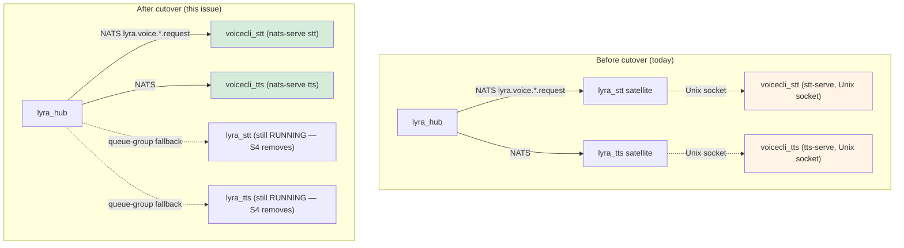
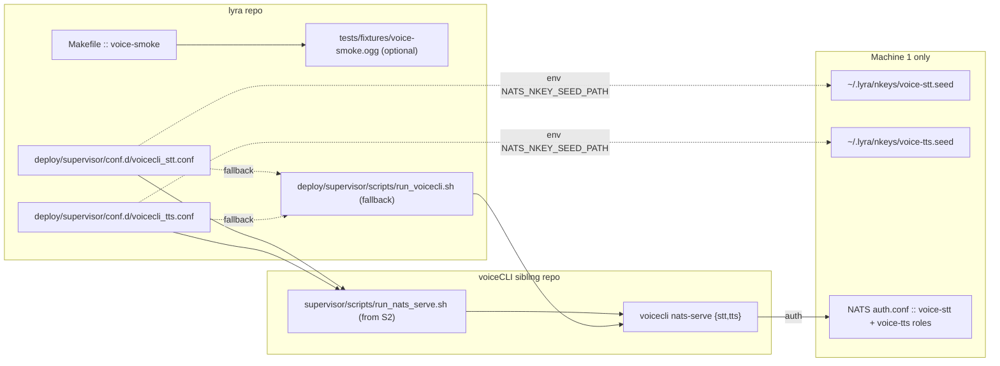

## Summary

Execute Slice S3 of #658: swap Machine-1 `voicecli_{stt,tts}` supervisor programs from Unix-socket mode to `nats-serve` mode, provision fresh nkey credentials (Option B), add `make voice-smoke` round-trip, and land a reversible cutover with verbatim PR-body runbook + rollback. Three slices (scaffolding → nkey/auth → cutover). Single primary domain: devops. Coexistence invariant: `lyra_stt` / `lyra_tts` stay RUNNING throughout S3 and are removed by later issue (#658 S4).

## Architecture

### Cutover data flow (before → after)

### File × function map

## Bootstrap Context

- Stack: Python 3.12 / uv / typer (backend), no frontend, docs=md, formatter=ruff.
- Existing supervisor pattern: `voicecli_{stt,tts}.conf` already points `command=` at `$HOME/projects/voiceCLI/supervisor/scripts/run_{stt,tts}.sh`. After voicecli's S2 lands, that sibling repo ships a new wrapper (name TBD — likely `run_nats_serve.sh` or updated `run_{stt,tts}.sh`). **Plan-time decision:** prefer pointing `command=` at sibling-repo wrapper (cleaner separation). Fallback: ship `deploy/supervisor/scripts/run_voicecli.sh` in lyra if sibling script is not yet merged at implementation time.
- #714 merged — provides per-role nkey + ACL pattern in `deploy/nats/nats-container.conf` auth.conf. Use it as the template for `voice-{stt,tts}` roles.
- Ops context: cutover runs on `roxabituwer` (192.168.1.16), RTX 3080. Lyra repo is deployed under `~/projects/lyra`; voiceCLI under `~/projects/voiceCLI`. Supervisor is owned by lyra (`~/projects/lyra/deploy/supervisor/`).

## Agents

| Agent | Tasks | Files |
|---|---|---|
| `dev-core:devops` | T1–T8, T11 | supervisor confs, Makefile, wrapper script, NATS auth.conf, nkey provisioning |
| `dev-core:tester` | T9, T10 | `make voice-smoke` implementation + fixture (if chosen) or `lyra voice-smoke` CLI |
| `dev-core:doc-writer` | T12 | PR body runbook + rollback text (delivered via `/pr` skill, not a committed artifact) |

No architect needed — no new modules, all patterns established. No security-auditor — auth.conf pattern reuses #714 approach already audited. Product-lead not needed — acceptance criteria are ops-verifiable.

**Manual ops tasks** (T13–T18, executed by Mickael on Machine 1): not agent-assigned; tracked in task list with `agent: "ops"` so `/implement` skips them and the runbook-execution tickbox lives with the PR.

## Consistency Report

| Spec item | Plan task | Status |
|---|---|---|
| SC-1: `voicecli_stt.conf` `command=` runs `voicecli nats-serve stt` | T2 | covered |
| SC-2: `voicecli_tts.conf` `command=` runs `voicecli nats-serve tts` | T3 | covered |
| SC-3: Confs set NATS_URL, NATS_NKEY_SEED_PATH, engine env | T2, T3 | covered |
| SC-4: `startsecs` value documented with measured first-ready-time | T15, T17 | covered |
| SC-5: `run_voicecli.sh` execs voiceCLI venv (if fallback) | T1 | covered |
| SC-6: `make voice-smoke` exists + passes on Machine 1 | T4, T5, T15 | covered |
| SC-7: Nkey seed files exist with `0400` perms + correct owner | T6, T7 | covered |
| SC-8: NATS auth.conf has voice-stt / voice-tts ACLs | T8 | covered |
| SC-9: Cutover executed; voicecli worker_id heartbeats observed | T13, T14 | covered |
| SC-10: `lyra_stt`/`lyra_tts` still RUNNING post-cutover | T17 | covered |
| SC-11: `make voice-smoke` exits 0 end-to-end | T15 | covered |
| SC-12: Rollback documented in PR body + dry-run tested | T12, T16 | covered |

Coverage: 12/12 criteria covered. No untraced tasks. No exemptions.

## Micro-Tasks

### Slice V1 — Scaffolding (agent: devops, tester)

| # | Task | File | Agent | Phase | Diff | `[P]` | Spec trace |
|---|---|---|---|---|---|---|---|
| T1 | Check voicecli sibling (`~/projects/voiceCLI` @ `staging`): does `supervisor/scripts/run_nats_serve.sh` or equivalent exist? If yes, use its absolute path as `command=`. If no, create `deploy/supervisor/scripts/run_voicecli.sh` with shebang + `.env` sourcing + `exec $HOME/projects/voiceCLI/.venv/bin/voicecli nats-serve "$1"`; `chmod +x`. Record the chosen path; used by T2/T3. | `deploy/supervisor/scripts/run_voicecli.sh` (conditional) | devops | GREEN | 2 | N | SC-5 |
| T2 | Update `voicecli_stt.conf` — `command=` → chosen wrapper + arg `stt`; set `environment=HOME="...",PATH="...voiceCLI/.venv/bin:...",NATS_URL="nats://127.0.0.1:4222",NATS_NKEY_SEED_PATH="%(ENV_HOME)s/.lyra/nkeys/voice-stt.seed",LYRA_STT_ENGINE="whisper"` (preserve existing engine selection); keep `startsecs=15`, `autostart=false`, `autorestart=true`. | `deploy/supervisor/conf.d/voicecli_stt.conf` | devops | GREEN | 2 | Y | SC-1, SC-3 |
| T3 | Update `voicecli_tts.conf` — mirror T2 with arg `tts`, `NATS_NKEY_SEED_PATH=.../voice-tts.seed`, `LYRA_TTS_ENGINE="chatterbox"` (confirm current engine in env or `~/projects/CLAUDE.md`); keep `startsecs=10`. | `deploy/supervisor/conf.d/voicecli_tts.conf` | devops | GREEN | 2 | Y | SC-2, SC-3 |
| T4 | Implement `make voice-smoke`. Choose one path: (a) **Telegram Bot API**: shell-based — `curl -F chat_id=$SMOKE_CHAT_ID -F voice=@tests/fixtures/voice-smoke.ogg https://api.telegram.org/bot$TG_BOT_TOKEN/sendVoice`; poll `getUpdates` for a reply of type audio/voice within 30 s; exit 0/1. Env via `.env`. Requires fixture (T4b). (b) **`lyra voice-smoke` CLI**: new typer subcommand under `src/lyra/cli.py` that publishes a synthetic `lyra.voice.stt.request` with a base64-encoded short audio fixture, awaits reply on `_INBOX.*`, asserts transcript non-empty. Pick (a) if fixture + chat ID exist; else (b). Document choice at top of Makefile target comment. | `Makefile`, optionally `src/lyra/cli.py` | tester | GREEN | 3 | Y | SC-6 |
| T4b | (If T4 = path a) add fixture `tests/fixtures/voice-smoke.ogg` (≤200KB short sample, human-audible so TTS reply can be verified by ear if needed) — commit as binary via git-lfs if repo already uses it, else plain binary blob acceptable at this size. | `tests/fixtures/voice-smoke.ogg` | tester | GREEN | 1 | Y | SC-6 |
| T5 [RED-GATE] | **Local parse gate** — on a machine with supervisor installed, run `supervisord -c deploy/supervisor/supervisord.conf -n -t 2>&1 \| grep -iE 'error\|warn'` → empty output. Alternative: `supervisorctl reread` against a local dev supervisor with the new confs dropped in; must report `voicecli_stt: changed / voicecli_tts: changed` without errors. Blocks V2 start. | — | devops | RED-GATE | 1 | N | gate for V1 |

### Slice V2 — Nkey + auth.conf (agent: devops)

| # | Task | File | Agent | Phase | Diff | `[P]` | Spec trace |
|---|---|---|---|---|---|---|---|
| T6 | Generate nkey pair for `voice-stt` on Machine 1: `nk -gen user -pubout > ~/.lyra/nkeys/voice-stt.seed && chmod 0400 ~/.lyra/nkeys/voice-stt.seed && chown $SUPERVISOR_USER ~/.lyra/nkeys/voice-stt.seed`. Record public key. | Machine 1: `~/.lyra/nkeys/voice-stt.seed` | devops | GREEN | 1 | Y | SC-7 |
| T7 | Same as T6 for `voice-tts` → `~/.lyra/nkeys/voice-tts.seed`. | Machine 1: `~/.lyra/nkeys/voice-tts.seed` | devops | GREEN | 1 | Y | SC-7 |
| T8 | Add two user entries to `deploy/nats/nats-container.conf` auth.conf under `authorization.users`: `{ nkey: <voice-stt-pubkey>, permissions: { subscribe: ["lyra.voice.stt.request"], publish: ["lyra.voice.stt.heartbeat", "_INBOX.>", "$SYS.REQ.USER.INFO"] } }` and mirror for `voice-tts`. Keep pattern identical to #714's existing adapter/hub user entries. | `deploy/nats/nats-container.conf` (or wherever auth.conf lives per #714) | devops | GREEN | 3 | N | SC-8 |
| T9 | Reload NATS on Machine 1: `sudo systemctl reload nats-server` (or the Quadlet-managed equivalent — confirm). Verify: `journalctl -u nats-server.service --since '1 minute ago' \| grep -E 'reload\|error'` shows reload line, no errors. | Machine 1 runtime only | devops | GREEN | 2 | N | SC-8 |
| T10 [RED-GATE] | **ACL smoke** — from Machine 1: `nats --server nats://127.0.0.1:4222 --nkey ~/.lyra/nkeys/voice-stt.seed sub 'lyra.voice.stt.request' --count=0` connects without "authorization violation". Same for `voice-tts.seed`. Publish a dummy heartbeat: `nats --nkey .../voice-stt.seed pub lyra.voice.stt.heartbeat '{"worker_id":"smoke"}'` succeeds. Blocks V3 start. | — | devops | RED-GATE | 1 | N | gate for V2 |

### Slice V3 — Cutover + verify + rollback doc (agent: devops, ops, doc-writer)

| # | Task | File | Agent | Phase | Diff | `[P]` | Spec trace |
|---|---|---|---|---|---|---|---|
| T11 | Deploy updated confs to Machine 1: `ssh roxabituwer 'cd ~/projects/lyra && git pull origin <PR-branch>'`. Verify diff with `git log --oneline -5` on Machine 1. Do NOT run `supervisorctl` yet — pre-staged change. | Machine 1 git state | devops | GREEN | 1 | N | — |
| T12 | Author the PR-body runbook + rollback section. Copy verbatim from spec S3.3 (6 numbered steps + rollback command). Delivered via `/pr` skill in the `pr` step of /dev; include explicit `hostname == roxabituwer` preflight, both hard gates (step 2 and step 4 worker_id=voicecli-* observation), and the full rollback command chain including the `git checkout -- deploy/supervisor/conf.d/voicecli_*.conf` step. | PR body (no file commit) | doc-writer | GREEN | 2 | Y | SC-12 |
| T13 | **OPS — cutover step 0–2:** `ssh roxabituwer; hostname` → `roxabituwer`. Run `supervisorctl reread && supervisorctl update voicecli_stt`. Immediately: `make lyra logs \| grep -E 'worker_id=voicecli-stt'` within 15 s. PASS → T14. FAIL → execute T18 (rollback) and reopen from failure root cause. | Machine 1 ops | ops | GREEN | 3 | N | SC-9 |
| T14 | **OPS — cutover step 3–4:** `supervisorctl update voicecli_tts`. `make lyra logs \| grep -E 'worker_id=voicecli-tts'` within 15 s. PASS → T15. FAIL → T18. | Machine 1 ops | ops | GREEN | 3 | N | SC-9 |
| T15 | **OPS — smoke step 5:** `make voice-smoke` on Machine 1 or from local against prod bot. Must exit 0. Record wall-clock time of first heartbeat (for SC-4). | Machine 1 ops | ops | GREEN | 3 | N | SC-6, SC-11, SC-4 |
| T16 | **OPS — rollback dry-run:** execute rollback command chain against `voicecli_stt` ONLY (leave `voicecli_tts` live to reduce risk): `supervisorctl stop voicecli_stt && git checkout -- deploy/supervisor/conf.d/voicecli_stt.conf && supervisorctl reread && supervisorctl update`. Verify `supervisorctl status voicecli_stt` shows the old unix-socket command RUNNING and hub resumes STT via `lyra_stt` within 15 s. Re-apply cutover (T13) after verification. | Machine 1 ops | ops | GREEN | 3 | N | SC-12 |
| T17 | **OPS — coexistence verify:** `supervisorctl status lyra_stt lyra_tts voicecli_stt voicecli_tts` shows all four RUNNING. If `lyra_stt` / `lyra_tts` not RUNNING, start them — they are invariant during S3. | Machine 1 ops | ops | GREEN | 1 | N | SC-10 |
| T18 | **OPS — rollback on failure (dormant unless T13/T14 fail):** full rollback command chain from spec; abort cutover; reopen ticket with root-cause. Not expected to fire. | Machine 1 ops | ops | REFACTOR | 2 | N | SC-12 (contingency) |
| T19 [RED-GATE] | **Final acceptance** — walk the 12 success criteria in the spec, tick each. `supervisorctl status` confirms all 4 processes RUNNING + `make voice-smoke` green + PR body has runbook + rollback verified (T16). Any unchecked → reopen. | — | ops | RED-GATE | 1 | N | gate for V3 |

### Parallelization notes

- V1: T2 + T3 parallel-safe (different files, no dep on each other). T4 + T4b parallel with T2/T3.
- V2: T6 + T7 parallel-safe. T8 depends on T6/T7 public keys. T9 depends on T8.
- V3: fully sequential — cutover is an ordered ops sequence.

## Task IDs

<!-- Generated by /plan. Used by /implement to resume tasks on session restart. -->

- T1: 12 — Wrapper path decision — sibling-repo script vs lyra-owned run_voicecli.sh
- T2: 13 — Update voicecli_stt.conf — command + env for nats-serve
- T3: 14 — Update voicecli_tts.conf — command + env for nats-serve
- T4: 15 — Implement make voice-smoke target (Telegram API or lyra CLI)
- T4b: 16 — Add tests/fixtures/voice-smoke.ogg (only if T4=a)
- T5: 17 — [RED-GATE] V1 parse gate — supervisorctl reread clean
- T6: 18 — Generate voice-stt nkey seed on Machine 1
- T7: 19 — Generate voice-tts nkey seed on Machine 1
- T8: 20 — Add voice-stt / voice-tts roles to NATS auth.conf
- T9: 21 — Reload NATS on Machine 1 + verify
- T10: 22 — [RED-GATE] V2 ACL smoke — nats sub + pub with new seeds
- T11: 23 — Deploy updated confs to Machine 1 (git pull)
- T12: 24 — Author PR body runbook + rollback (verbatim from spec S3.3)
- T13: 25 — OPS cutover step 0-2 (stt update + worker_id gate)
- T14: 26 — OPS cutover step 3-4 (tts update + worker_id gate)
- T15: 27 — OPS make voice-smoke passes on Machine 1
- T16: 28 — OPS rollback dry-run on voicecli_stt only
- T17: 29 — OPS coexistence check (all 4 voice programs RUNNING)
- T18: 30 — OPS failure rollback (dormant unless T13/T14 fail)
- T19: 31 — [RED-GATE] V3 final acceptance — walk 12 success criteria
