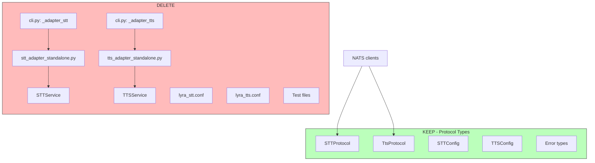
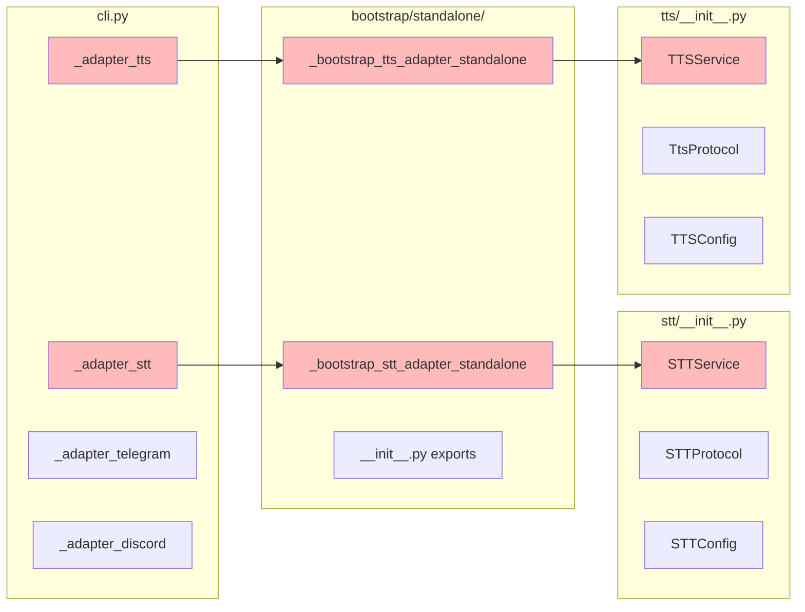

## Summary

Remove dead voice satellite code from Lyra after NATS migration: delete bootstrap files, strip voicecli imports, clean CLI/tests/docs. 6 slices, ~20 files, single-domain refactor.

## Architecture

### Data Flow

### File × Function Map

## Agents

| Agent | Task Count | Files |
|-------|------------|-------|
| backend-dev | 10 | cli.py, standalone/__init__.py, stt/__init__.py, tts/__init__.py, run_adapter.sh, agents.yml |
| tester | 6 | test files |
| doc-writer | 4 | docs/ARCHITECTURE.md, docs/CONFIGURATION.md, CLAUDE.md, bootstrap/CLAUDE.md |
| devops | 2 | supervisor configs |

## Consistency Report

- **Covered breadboard items:** 23/23 (100%)
- **Uncovered:** 0
- **Untraced tasks:** 0
- **Exemptions:** None

## Micro-Tasks

### V1: Clean CLI (RED)

| # | Description | File | Verify | Expected | Agent | Spec |
|---|-------------|------|--------|----------|-------|------|
| 1 | Remove `_adapter_stt` function (lines 121-128) | `src/lyra/cli.py` | `rg "def _adapter_stt" src/lyra/cli.py` | 0 matches | backend-dev | N1 |
| 2 | Remove `_adapter_tts` function (lines 131-138) | `src/lyra/cli.py` | `rg "def _adapter_tts" src/lyra/cli.py` | 0 matches | backend-dev | N2 |
| 3 | Remove stt/tts exports from `__init__.py` | `src/lyra/bootstrap/standalone/__init__.py` | `rg "stt_adapter\|tts_adapter" src/lyra/bootstrap/standalone/__init__.py` | 0 matches | backend-dev | N8 |

### V1: Clean CLI (GREEN)

| # | Description | File | Verify | Expected | Agent | Spec |
|---|-------------|------|--------|----------|-------|------|
| 4 | Verify CLI shows only telegram/discord | `src/lyra/cli.py` | `uv run lyra adapter --help` | Only telegram, discord listed | backend-dev | SC-5 |

### V2: Delete Bootstrap Files (RED)

| # | Description | File | Verify | Expected | Agent | Spec |
|---|-------------|------|--------|----------|-------|------|
| 5 | Delete `stt_adapter_standalone.py` | `src/lyra/bootstrap/standalone/stt_adapter_standalone.py` | `ls src/lyra/bootstrap/standalone/stt_adapter_standalone.py 2>/dev/null` | No such file | backend-dev | N3 |
| 6 | Delete `tts_adapter_standalone.py` | `src/lyra/bootstrap/standalone/tts_adapter_standalone.py` | `ls src/lyra/bootstrap/standalone/tts_adapter_standalone.py 2>/dev/null` | No such file | backend-dev | N4 |
| 7 | Delete `lyra_stt.conf` | `deploy/supervisor/conf.d/lyra_stt.conf` | `ls deploy/supervisor/conf.d/lyra_stt.conf 2>/dev/null` | No such file | devops | N6 |
| 8 | Delete `lyra_tts.conf` | `deploy/supervisor/conf.d/lyra_tts.conf` | `ls deploy/supervisor/conf.d/lyra_tts.conf 2>/dev/null` | No such file | devops | N7 |
| 9 | Remove stt/tts cases from `run_adapter.sh` | `deploy/supervisor/scripts/run_adapter.sh` | `rg '"stt"|"tts"' deploy/supervisor/scripts/run_adapter.sh` | 0 matches | devops | N5 |
| 10 | Remove stt/tts entries from `agents.yml` | `deploy/agents.yml` | `grep -E "^  (stt|tts):" deploy/agents.yml` | 0 matches | devops | N9 |

### V2: Delete Bootstrap Files (GREEN)

| # | Description | File | Verify | Expected | Agent | Spec |
|---|-------------|------|--------|----------|-------|------|
| 11 | Verify no satellite refs in deploy/ | — | `rg "lyra_(stt\|tts)" deploy/` | 0 matches | devops | SC-9 |

### V3: Strip STT (RED)

| # | Description | File | Verify | Expected | Agent | Spec |
|---|-------------|------|--------|----------|-------|------|
| 12 | Delete `STTService` class (lines 64-165) | `src/lyra/stt/__init__.py` | `rg "class STTService" src/lyra/stt/__init__.py` | 0 matches | backend-dev | U1 |
| 13 | Add `__all__` with keep-list exports | `src/lyra/stt/__init__.py` | `rg "__all__" src/lyra/stt/__init__.py` | 1 match | backend-dev | SC-7 |

### V3: Strip STT (GREEN)

| # | Description | File | Verify | Expected | Agent | Spec |
|---|-------------|------|--------|----------|-------|------|
| 14 | Verify no voicecli imports in stt/ | — | `rg "from voicecli" src/lyra/stt/` | 0 matches | backend-dev | SC-1 |

### V4: Strip TTS (RED)

| # | Description | File | Verify | Expected | Agent | Spec |
|---|-------------|------|--------|----------|-------|------|
| 15 | Delete `TTSService` class + `_merge_wav_chunks` + `_wav_*` helpers | `src/lyra/tts/__init__.py` | `rg "class TTSService\|def _merge_wav\|def _wav" src/lyra/tts/__init__.py` | 0 matches | backend-dev | U2 |
| 16 | Remove TTSService from `__all__` | `src/lyra/tts/__init__.py` | `rg "TTSService" src/lyra/tts/__init__.py` | 0 matches | backend-dev | SC-8 |

### V4: Strip TTS (GREEN)

| # | Description | File | Verify | Expected | Agent | Spec |
|---|-------------|------|--------|----------|-------|------|
| 17 | Verify no voicecli imports in tts/ | — | `rg "from voicecli" src/lyra/tts/` | 0 matches | backend-dev | SC-1 |

### V5: Delete/Rewrite Tests (RED)

| # | Description | File | Verify | Expected | Agent | Spec |
|---|-------------|------|--------|----------|-------|------|
| 18 | Delete `test_stt_service.py` | `tests/stt/test_stt_service.py` | `ls tests/stt/test_stt_service.py 2>/dev/null` | No such file | tester | S1 |
| 19 | Delete `test_stt_adapter_standalone.py` | `tests/bootstrap/test_stt_adapter_standalone.py` | `ls tests/bootstrap/test_stt_adapter_standalone.py 2>/dev/null` | No such file | tester | S2 |
| 20 | Delete `test_tts_adapter_standalone.py` | `tests/bootstrap/test_tts_adapter_standalone.py` | `ls tests/bootstrap/test_tts_adapter_standalone.py 2>/dev/null` | No such file | tester | S3 |
| 21 | Delete `test_tts_synthesize.py` | `tests/tts/test_tts_synthesize.py` | `ls tests/tts/test_tts_synthesize.py 2>/dev/null` | No such file | tester | S4 |
| 22 | Delete `test_tts_agent_override.py` | `tests/tts/test_tts_agent_override.py` | `ls tests/tts/test_tts_agent_override.py 2>/dev/null` | No such file | tester | S5 |
| 23 | Rewrite: `STTService` → `STTProtocol` in conftest.py | `tests/agents/conftest.py` | `rg "STTService" tests/agents/conftest.py` | 0 matches | tester | S6 |
| 24 | Rewrite: `STTService` → `STTProtocol` in test_anthropic_agent_stt.py | `tests/agents/test_anthropic_agent_stt.py` | `rg "STTService" tests/agents/test_anthropic_agent_stt.py` | 0 matches | tester | S7 |
| 25 | Rewrite: `STTService` → `STTProtocol` in test_audio_pipeline_tts.py | `tests/core/test_audio_pipeline_tts.py` | `rg "STTService" tests/core/test_audio_pipeline_tts.py` | 0 matches | tester | S8 |
| 26 | Rewrite: `TTSService` → `TtsProtocol` in test_hub_streaming.py | `tests/core/test_hub_streaming.py` | `rg "TTSService" tests/core/test_hub_streaming.py` | 0 matches | tester | S9 |
| 27 | Rewrite: `TTSService` → `TtsProtocol` in test_voice_command.py | `tests/tts/test_voice_command.py` | `rg "TTSService" tests/tts/test_voice_command.py` | 0 matches | tester | S10 |

### V5: Delete/Rewrite Tests (GREEN)

| # | Description | File | Verify | Expected | Agent | Spec |
|---|-------------|------|--------|----------|-------|------|
| 28 | Run pytest suite | — | `uv run pytest` | All tests pass | tester | SC-4 |

### V6: Doc Sync (RED)

| # | Description | File | Verify | Expected | Agent | Spec |
|---|-------------|------|--------|----------|-------|------|
| 29 | Remove satellite refs from ARCHITECTURE.md, link ADR-044 | `docs/ARCHITECTURE.md` | `rg "lyra_stt\|lyra_tts" docs/ARCHITECTURE.md` | 0 matches | doc-writer | D1 |
| 30 | Remove satellite refs from CONFIGURATION.md | `docs/CONFIGURATION.md` | `rg "lyra_stt\|lyra_tts" docs/CONFIGURATION.md` | 0 matches | doc-writer | D2 |
| 31 | Remove stt/tts file entries from bootstrap/CLAUDE.md | `src/lyra/bootstrap/CLAUDE.md` | `rg "stt_adapter\|tts_adapter" src/lyra/bootstrap/CLAUDE.md` | 0 matches | doc-writer | S11 |
| 32 | Scan and remove satellite refs from root CLAUDE.md | `CLAUDE.md` | `rg "lyra_stt\|lyra_tts" CLAUDE.md` | 0 matches | doc-writer | D3 |

### V6: Doc Sync (GREEN)

| # | Description | File | Verify | Expected | Agent | Spec |
|---|-------------|------|--------|----------|-------|------|
| 33 | Verify no satellite refs in docs/ | — | `rg "lyra_(stt\|tts)" docs/ CLAUDE.md src/lyra/bootstrap/CLAUDE.md` | 0 matches | doc-writer | SC-2 |

### Final Validation (RED-GATE)

| # | Description | File | Verify | Expected | Agent | Spec |
|---|-------------|------|--------|----------|-------|------|
| 34 | Run pyright typecheck | — | `uv run pyright` | 0 errors | backend-dev | SC-3 |
| 35 | Final grep: no voicecli imports | — | `rg "from voicecli" src/lyra` | 0 matches | backend-dev | SC-1 |

## Task IDs

<!-- Generated by /plan. Used by /implement to resume tasks on session restart. -->
- T1: 9 — Remove _adapter_stt function from cli.py
- T2: 10 — Remove _adapter_tts function from cli.py
- T3: 11 — Remove stt/tts exports from standalone/__init__.py
- T4: 12 — Verify CLI shows only telegram/discord
- T5: 13 — Delete stt_adapter_standalone.py
- T6: 14 — Delete tts_adapter_standalone.py
- T7: 15 — Delete lyra_stt.conf
- T8: 16 — Delete lyra_tts.conf
- T9: 17 — Remove stt/tts cases from run_adapter.sh
- T10: 18 — Remove stt/tts entries from agents.yml
- T11: 19 — Verify no satellite refs in deploy/
- T12: 20 — Delete STTService class from stt/__init__.py
- T13: 21 — Add __all__ with keep-list exports to stt/__init__.py
- T14: 22 — Verify no voicecli imports in stt/
- T15: 23 — Delete TTSService class and helpers from tts/__init__.py
- T16: 24 — Remove TTSService from __all__ in tts/__init__.py
- T17: 25 — Verify no voicecli imports in tts/
- T18: 26 — Delete test_stt_service.py
- T19: 27 — Delete test_stt_adapter_standalone.py
- T20: 28 — Delete test_tts_adapter_standalone.py
- T21: 29 — Delete test_tts_synthesize.py
- T22: 30 — Delete test_tts_agent_override.py
- T23: 31 — Rewrite: STTService → STTProtocol in conftest.py
- T24: 32 — Rewrite: STTService → STTProtocol in test_anthropic_agent_stt.py
- T25: 33 — Rewrite: STTService → STTProtocol in test_audio_pipeline_tts.py
- T26: 34 — Rewrite: TTSService → TtsProtocol in test_hub_streaming.py
- T27: 35 — Rewrite: TTSService → TtsProtocol in test_voice_command.py
- T28: 36 — Run pytest suite
- T29: 37 — Remove satellite refs from ARCHITECTURE.md, link ADR-044
- T30: 38 — Remove satellite refs from CONFIGURATION.md
- T31: 39 — Remove stt/tts file entries from bootstrap/CLAUDE.md
- T32: 40 — Scan and remove satellite refs from root CLAUDE.md
- T33: 41 — Verify no satellite refs in docs/
- T34: 42 — Run pyright typecheck
- T35: 43 — Final grep: no voicecli imports
