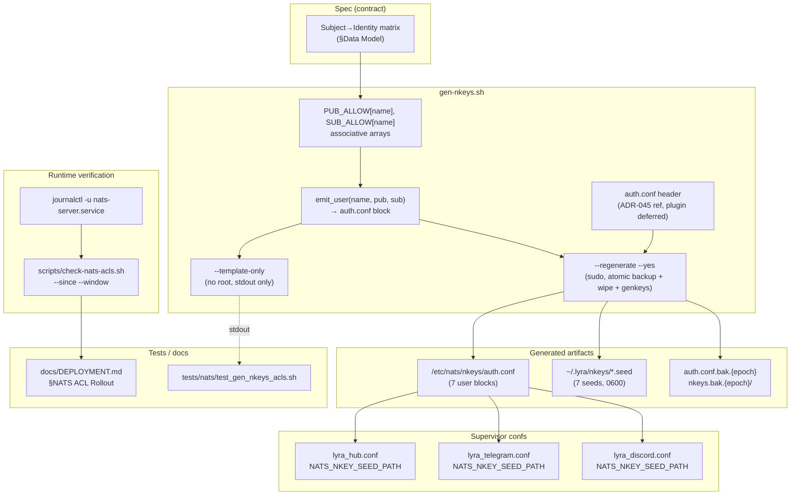
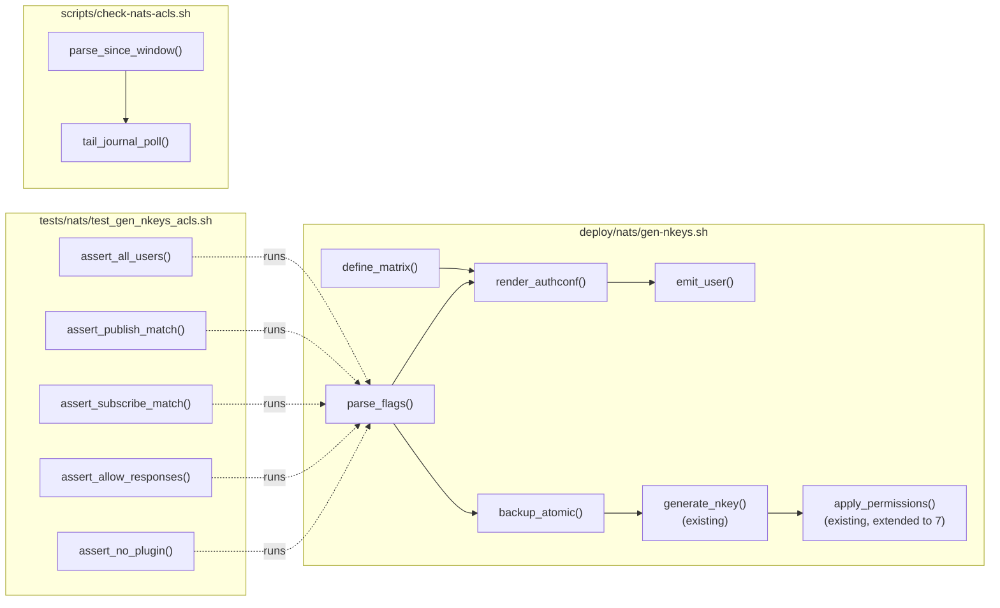

## Summary

Extend `deploy/nats/gen-nkeys.sh` with a matrix-driven `auth.conf` generator (7 identities, per-user publish/subscribe allow-lists, `allow_responses: true`), wire three supervisor confs, add a sudo-less shell test + a post-reload violation detector, and document the reload runbook.

## Architecture

### Data flow



### File × function map



## Bootstrap Context

Key prior-art files agents should open before touching anything:

1. `deploy/nats/gen-nkeys.sh` — existing 5-seed generator with `--show`, `--fix-perms`. Patterns to keep: root check, `nk` auto-download, `SEEDS_DIR`/`AUTH_DIR` overrides, `install -m 0600`.
2. `artifacts/specs/706-per-role-nkeys-acls-spec.mdx` — authoritative subject→identity matrix (§Data Model lines ~70–124). Contract for auth.conf content.
3. `deploy/supervisor/conf.d/lyra_tts.conf` / `lyra_stt.conf` — reference for how `NATS_NKEY_SEED_PATH` is set in the `environment=` line (already wired in #563).
4. `deploy/nats/nats.service` — systemd unit (`Type=simple`, `ExecReload=/bin/kill -HUP $MAINPID`, no PIDFile). Confirms why the runbook uses `systemctl reload` not `nats-server --signal`.
5. `src/lyra/llm/drivers/nats_driver.py:200` — manual inbox subscription; drives the `_INBOX.>` hub subscribe allow-list.
6. `tests/nats/conftest.py` — not reused (new shell test is standalone), but confirms Python-test convention elsewhere in repo.

## Agents

| Agent | Tasks | Files |
|---|---|---|
| devops | 13 | `deploy/nats/gen-nkeys.sh`, `deploy/supervisor/conf.d/lyra_hub.conf`, `lyra_telegram.conf`, `lyra_discord.conf`, `scripts/check-nats-acls.sh` |
| tester | 2 | `tests/nats/test_gen_nkeys_acls.sh` |
| doc-writer | 1 | `docs/DEPLOYMENT.md` |

(security-auditor spawns during `/code-review`, not here.)

## Consistency Report

| Spec element | Covered by |
|---|---|
| SC §Script (8 criteria) | T1.1–T1.9 |
| SC §Supervisor wiring | T2.1–T2.4 |
| SC §Test harness (3) | T3.1, T3.2, T3.3 |
| SC §Runbook + evidence | T4.1, T4.2 |
| SC §No regressions | T5.1 (existing suites) |
| N1 (gen-nkeys extensions) | T1.1–T1.7 |
| N2 (emit_user) | T1.3 |
| N3 (matrix arrays) | T1.2 |
| N4 (3 supervisor confs) | T2.1–T2.3 |
| N5 (DEPLOYMENT.md section) | T4.1 |
| N6 (check-nats-acls.sh) | T3.4, T3.5 |
| N7 (auth.conf header) | T1.6 |
| N8 (test harness) | T3.1–T3.3 |

Covered: 16 / 16 spec criteria & affordances.
Uncovered: 0.
Untraced tasks: 0.
Exemptions: rollout-evidence.txt (AC) is operator-produced on Machine 1 after /validate — captured during the rollout task, not a plan micro-task.

## Micro-Tasks

### V1 — gen-nkeys.sh matrix-driven auth.conf (devops)

**T1.1 [RED]** Stub test harness (just the runner + `--template-only` invocation)
- **File:** `tests/nats/test_gen_nkeys_acls.sh` (new)
- **Shape:**
  ```bash
  #!/usr/bin/env bash
  set -euo pipefail
  OUT=$(mktemp)
  trap 'rm -f "$OUT"' EXIT
  ./deploy/nats/gen-nkeys.sh --template-only > "$OUT"
  echo "PASS: template-only produced output ($(wc -l < "$OUT") lines)"
  ```
- **Verify:** `bash tests/nats/test_gen_nkeys_acls.sh`
- **Expected:** exits non-zero because `--template-only` flag does not yet exist (RED phase — flag unknown).
- **Agent:** tester · **Spec trace:** SC §Test harness · **Slice:** V1 · **Difficulty:** 1 · **Time:** 3 min · **[P]:** N

**T1.2 [GREEN]** Define ACL matrix arrays in `gen-nkeys.sh`
- **File:** `deploy/nats/gen-nkeys.sh`
- **Shape:**
  ```bash
  declare -A PUB_ALLOW SUB_ALLOW
  PUB_ALLOW[hub]='"lyra.outbound.telegram.>","lyra.outbound.discord.>","lyra.voice.tts.request","lyra.voice.stt.request","lyra.llm.request"'
  SUB_ALLOW[hub]='"lyra.inbound.telegram.>","lyra.inbound.discord.>","lyra.voice.tts.heartbeat","lyra.voice.stt.heartbeat","lyra.llm.health.*","lyra.system.ready","_INBOX.>"'
  PUB_ALLOW[telegram-adapter]='"lyra.inbound.telegram.>","lyra.system.ready"'
  SUB_ALLOW[telegram-adapter]='"lyra.outbound.telegram.>"'
  PUB_ALLOW[discord-adapter]='"lyra.inbound.discord.>","lyra.system.ready"'
  SUB_ALLOW[discord-adapter]='"lyra.outbound.discord.>"'
  PUB_ALLOW[tts-adapter]='"lyra.voice.tts.heartbeat"'
  SUB_ALLOW[tts-adapter]='"lyra.voice.tts.request"'
  PUB_ALLOW[stt-adapter]='"lyra.voice.stt.heartbeat"'
  SUB_ALLOW[stt-adapter]='"lyra.voice.stt.request"'
  PUB_ALLOW[llm-worker]='"lyra.llm.health.*"'
  SUB_ALLOW[llm-worker]='"lyra.llm.request"'
  PUB_ALLOW[monitor]='"lyra.monitor.>"'
  SUB_ALLOW[monitor]='"lyra.monitor.>"'
  IDENTITIES=(hub telegram-adapter discord-adapter tts-adapter stt-adapter llm-worker monitor)
  ```
- **Verify:** `bash -n deploy/nats/gen-nkeys.sh`
- **Expected:** parses cleanly, exit 0.
- **Agent:** devops · **Spec trace:** N3, matrix in §Data Model · **Slice:** V1 · **Difficulty:** 2 · **Time:** 5 min · **[P]:** N

**T1.3 [GREEN]** Add `emit_user(name, pubkey)` bash function
- **File:** `deploy/nats/gen-nkeys.sh`
- **Shape:**
  ```bash
  emit_user() {
    local name="$1" pubkey="$2"
    cat <<USER
    {
      nkey: "${pubkey}"
      # ${name}
      permissions: {
        publish:   { allow: [${PUB_ALLOW[$name]:-}] }
        subscribe: { allow: [${SUB_ALLOW[$name]:-}] }
        allow_responses: true
      }
    }
  USER
  }
  ```
- **Verify:** `bash -c 'source deploy/nats/gen-nkeys.sh 2>/dev/null; declare -f emit_user >/dev/null && echo OK'` — skip (script `set -e` exits on source; real check is next task).
- **Expected:** function definition parses.
- **Agent:** devops · **Spec trace:** N2 · **Slice:** V1 · **Difficulty:** 2 · **Time:** 4 min · **[P]:** N · **Depends on:** T1.2

**T1.4 [GREEN]** Add `--template-only` flag parsing + handler
- **File:** `deploy/nats/gen-nkeys.sh`
- **Shape:** In the flag-parse loop, add `--template-only) TEMPLATE_ONLY=true; shift ;;`. Add a handler early in the script (before root check) that, when `TEMPLATE_ONLY=true`, iterates `IDENTITIES[@]`, calls `emit_user "$name" "UDUMMYPUBKEY${name^^}"` for each, wraps the output in `authorization { users: [ ... ] }` + header comment, writes to stdout, and `exit 0`. Must NOT require root, MUST NOT touch filesystem.
- **Verify:** `./deploy/nats/gen-nkeys.sh --template-only | head -30`
- **Expected:** first line is a comment (the header), block starts with `authorization {`, each of the 7 identities appears by name in a comment, no errors about root.
- **Agent:** devops · **Spec trace:** SC §Script (--template-only) · **Slice:** V1 · **Difficulty:** 3 · **Time:** 8 min · **[P]:** N · **Depends on:** T1.2, T1.3

**T1.5 [GREEN]** Extend generation + permissions loop to 7 seeds (add telegram-adapter, discord-adapter)
- **File:** `deploy/nats/gen-nkeys.sh`
- **Shape:** Update `apply_permissions()` loop from `hub llm-worker monitor tts-adapter stt-adapter` to include `telegram-adapter discord-adapter`. In the main generation section, add `TELEGRAM_PUB=$(generate_nkey "telegram-adapter")` and `DISCORD_PUB=$(generate_nkey "discord-adapter")`. Update the trailing `info` messages listing seed paths.
- **Verify:** `grep -c 'generate_nkey ' deploy/nats/gen-nkeys.sh`
- **Expected:** `7`.
- **Agent:** devops · **Spec trace:** SC §Script (7 seeds) · **Slice:** V1 · **Difficulty:** 2 · **Time:** 4 min · **[P]:** N · **Depends on:** T1.4

**T1.6 [GREEN]** Rewrite the `auth.conf` heredoc to call `emit_user` per identity + add ADR-045/plugin-deferred header
- **File:** `deploy/nats/gen-nkeys.sh`
- **Shape:** Replace the existing `cat > "${AUTH_CONF}" <<EOF ... EOF` block with:
  ```bash
  {
    echo "# NATS nkey authorization — generated by gen-nkeys.sh"
    echo "# Spec: artifacts/specs/706-per-role-nkeys-acls-spec.mdx"
    echo "# Plugin ACL intentionally omitted — deferred until ADR-045 (roxabi-nats SDK) lands."
    echo "# DO NOT edit manually — regenerate with: sudo ./deploy/nats/gen-nkeys.sh --regenerate"
    echo "authorization {"
    echo "  users: ["
    declare -A PUBKEYS=([hub]=$HUB_PUB [telegram-adapter]=$TELEGRAM_PUB [discord-adapter]=$DISCORD_PUB [tts-adapter]=$TTS_PUB [stt-adapter]=$STT_PUB [llm-worker]=$WORKER_PUB [monitor]=$MONITOR_PUB)
    for name in "${IDENTITIES[@]}"; do
      emit_user "$name" "${PUBKEYS[$name]}"
    done
    echo "  ]"
    echo "}"
  } > "${AUTH_CONF}"
  ```
- **Verify:** `bash -n deploy/nats/gen-nkeys.sh`
- **Expected:** parses cleanly.
- **Agent:** devops · **Spec trace:** N7, SC §Script (auth.conf shape) · **Slice:** V1 · **Difficulty:** 3 · **Time:** 6 min · **[P]:** N · **Depends on:** T1.5

**T1.7 [GREEN]** Add `--regenerate` + `--yes` flags with atomic backup of auth.conf + seeds dir
- **File:** `deploy/nats/gen-nkeys.sh`
- **Shape:** In flag-parse: `--regenerate) REGENERATE=true; shift ;;` and `--yes) AUTO_YES=true; shift ;;`. Replace the existing idempotency guard (line ~84–89) with: if `REGENERATE=true`, perform atomic backup (compute `epoch=$(date +%s)`; if `auth.conf` exists, `cp -a ${AUTH_CONF} ${AUTH_CONF}.bak.${epoch}` — fail on error; if `SEEDS_DIR` exists, `cp -a ${SEEDS_DIR} ${SEEDS_DIR}.bak.${epoch}` — fail on error; only after both succeed, `rm -f ${AUTH_CONF}` and `rm -rf ${SEEDS_DIR}`). If `AUTO_YES=false` and stdin is a tty, prompt `read -p "This will wipe ~/.lyra/nkeys/ and /etc/nats/nkeys/auth.conf (backups will be created). Continue? [y/N] " reply`; require `y`/`Y`. Keep the existing default behavior (skip when auth.conf exists) when neither `--regenerate` nor `--fix-perms` is passed.
- **Verify:** `./deploy/nats/gen-nkeys.sh --template-only | grep -c 'nkey:'`
- **Expected:** `7` (regression check — template-only still works after the regenerate logic is added).
- **Agent:** devops · **Spec trace:** SC §Script (--regenerate, atomic backup) · **Slice:** V1 · **Difficulty:** 4 · **Time:** 10 min · **[P]:** N · **Depends on:** T1.6

**T1.8 [REFACTOR]** Flesh out `test_gen_nkeys_acls.sh` with the 5 assertions (a–e)
- **File:** `tests/nats/test_gen_nkeys_acls.sh`
- **Shape:**
  ```bash
  #!/usr/bin/env bash
  set -euo pipefail
  cd "$(dirname "$0")/../.."
  OUT=$(mktemp); trap 'rm -f "$OUT"' EXIT
  ./deploy/nats/gen-nkeys.sh --template-only > "$OUT"

  # (a) all 7 user blocks exist
  [ "$(grep -c '# hub$\|# telegram-adapter$\|# discord-adapter$\|# tts-adapter$\|# stt-adapter$\|# llm-worker$\|# monitor$' "$OUT")" -eq 7 ] \
    || { echo "FAIL (a): expected 7 identity blocks"; exit 1; }

  # (b) hub publish allow list has 5 entries and they are the expected set
  hub_pub=$(awk '/# hub$/,/allow_responses/' "$OUT" | grep -oP 'publish:\s*\{\s*allow:\s*\[\K[^\]]+')
  for subj in 'lyra.outbound.telegram.>' 'lyra.outbound.discord.>' 'lyra.voice.tts.request' 'lyra.voice.stt.request' 'lyra.llm.request'; do
    echo "$hub_pub" | grep -q "\"$subj\"" || { echo "FAIL (b): hub publish missing $subj"; exit 1; }
  done

  # (c) hub subscribe includes _INBOX.>
  awk '/# hub$/,/allow_responses/' "$OUT" | grep -q '"_INBOX\.>"' \
    || { echo "FAIL (c): hub subscribe missing _INBOX.>"; exit 1; }

  # (d) allow_responses: true present on every user
  [ "$(grep -c 'allow_responses: true' "$OUT")" -eq 7 ] \
    || { echo "FAIL (d): expected 7 allow_responses entries"; exit 1; }

  # (e) plugin must NOT appear
  ! grep -qi 'plugin' "$OUT" \
    || { echo "FAIL (e): unexpected 'plugin' reference"; exit 1; }

  echo "PASS: all 5 assertions"
  ```
  Extend per-identity publish/subscribe match loops similarly; keep the above as the scaffold.
- **Verify:** `bash tests/nats/test_gen_nkeys_acls.sh`
- **Expected:** `PASS: all 5 assertions`, exit 0.
- **Agent:** tester · **Spec trace:** SC §Test harness · **Slice:** V1 · **Difficulty:** 3 · **Time:** 10 min · **[P]:** N · **Depends on:** T1.7

**T1.9 [RED-GATE]** V1 gate: template-only + test harness green
- **Verify:** `./deploy/nats/gen-nkeys.sh --template-only >/dev/null && bash tests/nats/test_gen_nkeys_acls.sh`
- **Expected:** both exit 0; test prints `PASS: all 5 assertions`.
- **Agent:** devops · **Spec trace:** V1 slice completion · **Slice:** V1 · **Difficulty:** 1 · **Time:** 2 min · **[P]:** N · **Depends on:** T1.2, T1.3, T1.4, T1.5, T1.6, T1.7, T1.8

### V2 — Supervisor confs (devops, parallel)

**T2.1 [GREEN] [P]** Add `NATS_NKEY_SEED_PATH` to `lyra_hub.conf`
- **File:** `deploy/supervisor/conf.d/lyra_hub.conf`
- **Shape:** In the `environment=` line (currently ending `...LYRA_HEALTH_PORT="8443"`), append `,NATS_NKEY_SEED_PATH="%(ENV_HOME)s/.lyra/nkeys/hub.seed"`.
- **Verify:** `grep -q 'NATS_NKEY_SEED_PATH=.*/hub.seed' deploy/supervisor/conf.d/lyra_hub.conf && echo OK`
- **Expected:** `OK`.
- **Agent:** devops · **Spec trace:** N4, SC §Supervisor wiring · **Slice:** V2 · **Difficulty:** 1 · **Time:** 2 min

**T2.2 [GREEN] [P]** Add `NATS_NKEY_SEED_PATH` to `lyra_telegram.conf`
- **File:** `deploy/supervisor/conf.d/lyra_telegram.conf`
- **Shape:** Append `,NATS_NKEY_SEED_PATH="%(ENV_HOME)s/.lyra/nkeys/telegram-adapter.seed"` to the `environment=` line.
- **Verify:** `grep -q 'NATS_NKEY_SEED_PATH=.*/telegram-adapter.seed' deploy/supervisor/conf.d/lyra_telegram.conf && echo OK`
- **Expected:** `OK`.
- **Agent:** devops · **Spec trace:** N4, SC §Supervisor wiring · **Slice:** V2 · **Difficulty:** 1 · **Time:** 2 min

**T2.3 [GREEN] [P]** Add `NATS_NKEY_SEED_PATH` to `lyra_discord.conf`
- **File:** `deploy/supervisor/conf.d/lyra_discord.conf`
- **Shape:** Append `,NATS_NKEY_SEED_PATH="%(ENV_HOME)s/.lyra/nkeys/discord-adapter.seed"` to the `environment=` line.
- **Verify:** `grep -q 'NATS_NKEY_SEED_PATH=.*/discord-adapter.seed' deploy/supervisor/conf.d/lyra_discord.conf && echo OK`
- **Expected:** `OK`.
- **Agent:** devops · **Spec trace:** N4, SC §Supervisor wiring · **Slice:** V2 · **Difficulty:** 1 · **Time:** 2 min

**T2.4 [RED-GATE]** V2 gate: all three supervisor confs wired
- **Verify:** `grep -l NATS_NKEY_SEED_PATH deploy/supervisor/conf.d/lyra_{hub,telegram,discord}.conf | wc -l`
- **Expected:** `3`.
- **Agent:** devops · **Slice:** V2 · **Difficulty:** 1 · **Time:** 1 min · **Depends on:** T2.1, T2.2, T2.3

### V3 — check-nats-acls.sh violation detector (devops)

**T3.1 [GREEN]** Implement `scripts/check-nats-acls.sh`
- **File:** `scripts/check-nats-acls.sh` (new, chmod 0755)
- **Shape:**
  ```bash
  #!/usr/bin/env bash
  # Poll journalctl for NATS permission violations after an ACL reload.
  #
  # Usage: scripts/check-nats-acls.sh [--since <timestamp>] [--window <seconds>]
  # Env:   NATS_UNIT=nats-server.service   (override systemd unit name)
  set -euo pipefail
  SINCE=""
  WINDOW="${WINDOW:-90}"
  NATS_UNIT="${NATS_UNIT:-nats-server.service}"
  while [[ $# -gt 0 ]]; do
    case "$1" in
      --since)  SINCE="$2"; shift 2 ;;
      --window) WINDOW="$2"; shift 2 ;;
      *) echo "Unknown arg: $1" >&2; exit 2 ;;
    esac
  done
  [ -n "$SINCE" ] || SINCE=$(date -u -d '-10 seconds' +'%Y-%m-%d %H:%M:%S')
  DEADLINE=$(( $(date +%s) + WINDOW ))
  while [ "$(date +%s)" -lt "$DEADLINE" ]; do
    if journalctl -u "$NATS_UNIT" --since "$SINCE" --no-pager 2>/dev/null \
         | grep -q 'Permissions Violation'; then
      echo "FAIL: Permissions Violation detected in $NATS_UNIT since $SINCE" >&2
      journalctl -u "$NATS_UNIT" --since "$SINCE" --no-pager | grep 'Permissions Violation' | tail -20
      exit 1
    fi
    sleep 2
  done
  echo "OK: no Permissions Violation in $NATS_UNIT over ${WINDOW}s window"
  exit 0
  ```
- **Verify:** `bash -n scripts/check-nats-acls.sh && NATS_UNIT=nonexistent.service scripts/check-nats-acls.sh --window 3`
- **Expected:** parses; when unit doesn't exist, journalctl returns no matches → exits 0 with `OK: no Permissions Violation in nonexistent.service over 3s window` after 3s.
- **Agent:** devops · **Spec trace:** N6 · **Slice:** V3 · **Difficulty:** 3 · **Time:** 8 min · **[P]:** N

**T3.2 [GREEN]** Verify positive case (synthetic violation triggers exit 1)
- **File:** no new file — ad-hoc test via `systemd-cat` or a throwaway unit with a log line containing `Permissions Violation`.
- **Shape:** `logger -t test-nats-acls "Permissions Violation for Publication to X by user Y" && sleep 1 && NATS_UNIT=test-nats-acls scripts/check-nats-acls.sh --window 5` — should exit 1 because journalctl shows the violation under the fake unit `test-nats-acls`. Note: journalctl `-u` filters by SYSTEMD_UNIT which `logger -t` won't set. Fallback: use `systemd-cat --identifier=test-nats-acls` which does set SYSLOG_IDENTIFIER, then `NATS_UNIT=test-nats-acls` will be close enough for a smoke check. If this proves flaky on dev host, skip — the spec's AC only requires a deterministic exit-on-match, which T3.1 already provides via the grep.
- **Verify:** See shape; acceptable outcome is either exit 1 (strict) or a documented "skipped due to test-harness limitation" note in the PR body.
- **Expected:** exit 1 with `FAIL: Permissions Violation detected`, OR clearly-documented skip.
- **Agent:** devops · **Spec trace:** SC §Test harness (exits 1 on synthetic violation) · **Slice:** V3 · **Difficulty:** 2 · **Time:** 5 min · **[P]:** N · **Depends on:** T3.1

**T3.3 [RED-GATE]** V3 gate: script present, negative case green
- **Verify:** `test -x scripts/check-nats-acls.sh && NATS_UNIT=nonexistent.service scripts/check-nats-acls.sh --window 2 | grep -q '^OK:'`
- **Expected:** exit 0; stdout line starts with `OK:`.
- **Agent:** devops · **Slice:** V3 · **Difficulty:** 1 · **Time:** 1 min · **Depends on:** T3.1, T3.2

### V4 — DEPLOYMENT.md runbook (doc-writer)

**T4.1 [GREEN]** Add `## 10. NATS ACL Rollout` section to `docs/DEPLOYMENT.md`
- **File:** `docs/DEPLOYMENT.md`
- **Shape:** Insert between `## 9. systemd auto-start` and `## Troubleshooting`. Content:
  1. Intro sentence: "When the subject→identity ACL matrix changes (spec #706), regenerate + reload NATS without dropping client connections."
  2. **Regenerate** code block: `sudo ./deploy/nats/gen-nkeys.sh --regenerate --yes`.
  3. **Reload** code block: `sudo systemctl reload nats.service` (with a sidebar note that the unit uses `Type=simple` + `ExecReload=kill -HUP`, so there is no PID file).
  4. **Reconnect order** code block: `make telegram reload && make discord reload && make tts reload && make stt reload && make lyra reload` (hub last).
  5. **Verify** code block: `scripts/check-nats-acls.sh --since "$(date -Iseconds)" --window 90 | tee rollout-evidence.txt` — attach `rollout-evidence.txt` to the PR.
  6. **Rollback** code block: identify `{epoch}` from `/etc/nats/nkeys/auth.conf.bak.{epoch}` and `~/.lyra/nkeys.bak.{epoch}/`, restore atomically (`sudo cp -a ...` both), `sudo systemctl reload nats.service`, then reconnect in the same order.
  7. **Plugin sidebar** (one paragraph): the plugin ACL is deferred until ADR-045 lands; when a plugin nkey is introduced, rerun this section.
- **Verify:** `grep -q '^## 10\. NATS ACL Rollout' docs/DEPLOYMENT.md && grep -q 'systemctl reload nats.service' docs/DEPLOYMENT.md && grep -q 'rollout-evidence.txt' docs/DEPLOYMENT.md`
- **Expected:** all three grep matches found.
- **Agent:** doc-writer · **Spec trace:** N5, SC §Runbook · **Slice:** V4 · **Difficulty:** 2 · **Time:** 10 min · **[P]:** N

**T4.2 [RED-GATE]** V4 gate: runbook content present
- **Verify:** `awk '/^## 10\. NATS ACL Rollout/,/^## Troubleshooting/' docs/DEPLOYMENT.md | grep -cE 'systemctl reload|check-nats-acls|Rollback|bak\.\{epoch\}'`
- **Expected:** `≥4` (reload + check + rollback + backup refs).
- **Agent:** doc-writer · **Slice:** V4 · **Difficulty:** 1 · **Time:** 1 min · **Depends on:** T4.1

### V5 — No-regressions check (devops)

**T5.1 [RED-GATE]** Existing lyra pytest suite still passes
- **Verify:** `uv run pytest tests/ -q`
- **Expected:** exits 0 (all tests pass; no client-side changes touched).
- **Agent:** devops · **Spec trace:** SC §No regressions · **Slice:** V5 · **Difficulty:** 1 · **Time:** 3 min

## Task IDs

<!-- Generated by /plan. Used by /implement to resume tasks on session restart. -->
- T1.1: 12 — Stub test_gen_nkeys_acls.sh runner
- T1.2: 13 — Define ACL matrix arrays in gen-nkeys.sh
- T1.3: 14 — Add emit_user() function
- T1.4: 15 — Add --template-only flag + handler
- T1.5: 16 — Extend to 7 seeds (telegram + discord)
- T1.6: 17 — Rewrite auth.conf heredoc to call emit_user
- T1.7: 18 — Add --regenerate + --yes with atomic backup
- T1.8: 19 — Flesh out test harness with 5 assertions
- T1.9: 20 — [RED-GATE] V1 — template-only + tests green
- T2.1: 21 — Wire NATS_NKEY_SEED_PATH in lyra_hub.conf
- T2.2: 22 — Wire NATS_NKEY_SEED_PATH in lyra_telegram.conf
- T2.3: 23 — Wire NATS_NKEY_SEED_PATH in lyra_discord.conf
- T2.4: 24 — [RED-GATE] V2 — all three supervisor confs wired
- T3.1: 25 — Implement scripts/check-nats-acls.sh
- T3.2: 26 — Synthetic-violation positive case
- T3.3: 27 — [RED-GATE] V3 — check-nats-acls.sh ok path green
- T4.1: 28 — Add §10. NATS ACL Rollout to DEPLOYMENT.md
- T4.2: 29 — [RED-GATE] V4 — runbook content present
- T5.1: 30 — [RED-GATE] V5 — no-regressions pytest
