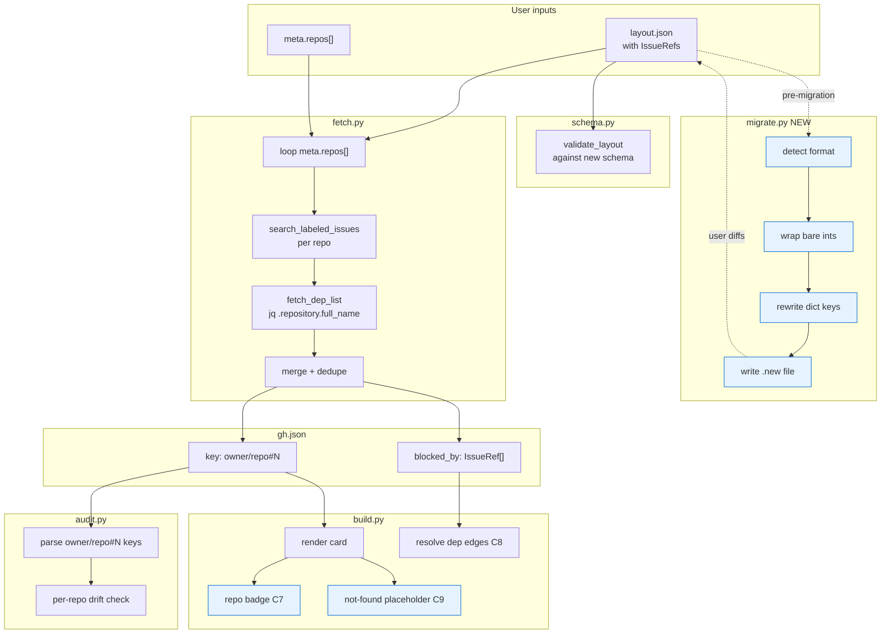
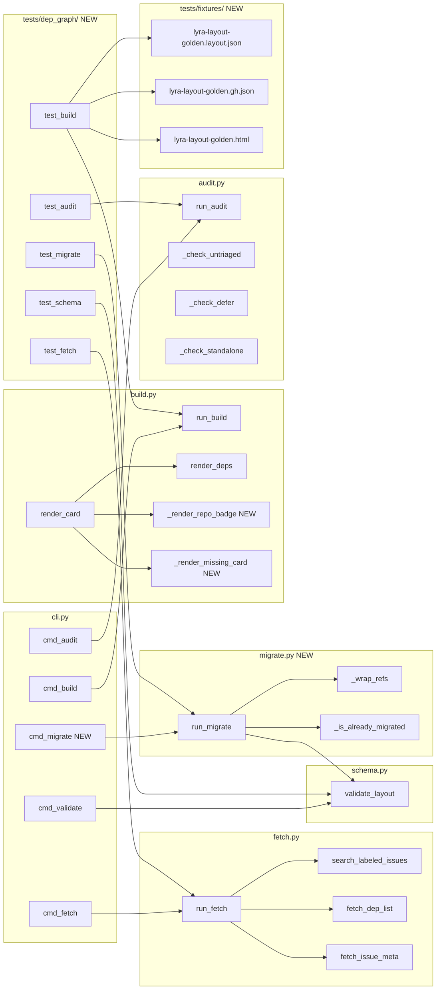

## Summary

Refactor `scripts/dep-graph/` (schema, fetch, build, audit) from single-repo to multi-repo via uniform `{repo, issue}` refs. Ship new `migrate.py` subcommand, new test suite under `tests/dep_graph/` with golden-fixture infrastructure, and updated README. Test-driven across 4 slices matching spec S1–S4.

## Architecture

### Data flow (config → loader → runtime → output)



### File × function map



## Bootstrap Context

Files to read before first task:
- `artifacts/specs/709-multi-repo-dep-graph-spec.mdx` — full spec (affordances C1–C9, slices, ACs).
- `scripts/dep-graph/layout.schema.json` — current schema (baseline for breaking change).
- `scripts/dep-graph/dep_graph/fetch.py` — current jq filter `[.[].number]` at line ~156 (must change).
- `scripts/dep-graph/dep_graph/audit.py` — current `int(n_str)` key parsing (must change).
- `scripts/dep-graph/dep_graph/build.py` — current `lane_of: dict[int, str]` + integer-keyed lookups.
- `~/.roxabi/forge/lyra/visuals/lyra-v2-dependency-graph.layout.json` — live single-repo layout (will be migrated).

Reference patterns:
- `tests/conftest.py` — pytest fixtures setup convention.
- Existing test modules under `tests/core/` for pytest style (e.g., class-based test organization).

## Agents

| Agent | Tasks | Files |
|---|---|---|
| backend-dev | T2, T3, T5, T6, T8, T9, T12, T13, T14, T15, T16, T17 | all `dep_graph/*.py` + layout files |
| tester | T1, T4, T7, T10, T11 | all `tests/dep_graph/test_*.py` + fixtures |
| doc-writer | T18 | `scripts/dep-graph/README.md` |
| — (user) | T19 | manual demo verification |

F-lite scale — no intra-domain parallelization. Serial per slice with RED→GREEN→refactor cadence.

## Consistency Report

- Acceptance criteria covered: 9/9
- Affordances covered: 9/9 (C1–C9 all mapped)
- Untraced micro-tasks: 0
- Exemptions: hygiene gates (ruff/pyright) are DoD notes — covered implicitly by every GREEN task's verify step.

## Micro-tasks

### Slice 1 — Schema + migration

#### T1 [RED] — Schema test scaffolding [P with T4]
**File:** `tests/dep_graph/test_schema.py` (new)
**Agent:** tester
**Spec trace:** SC-1, SC-2
**Difficulty:** 2
**Shape:**
```python
def test_rejects_meta_repo_singular(): ...
def test_rejects_bare_int_issue_ref(): ...
def test_rejects_issue_ref_repo_not_in_meta_repos(): ...
def test_rejects_both_meta_repo_and_meta_repos(): ...
def test_accepts_valid_multi_repo_layout(): ...
```
**Verify:** `uv run pytest tests/dep_graph/test_schema.py -q`
**Expected:** 5 tests, all fail (ValueError: validate_layout currently accepts old format).

#### T2 [GREEN] — Update layout.schema.json
**File:** `scripts/dep-graph/layout.schema.json`
**Agent:** backend-dev
**Spec trace:** SC-1, SC-2, C1
**Difficulty:** 3
**Shape:** Replace `meta.repo: string` with `meta.repos: string[], minItems: 1`. Add `$defs.IssueRef = {repo, issue}` with `repo` constrained via string pattern `^[^/]+/[^/]+$`. Change `lanes[].order`, `standalone.order`, `par_groups[*]`, `meta.issue` to `$ref: IssueRef`. Convert `overrides` + `extra_deps.*` keys to `patternProperties` matching `^[^/]+/[^/]+#\\d+$`. Add `oneOf` or `not` to reject `meta.repo` (old singular).
**Verify:** `cd /home/mickael/projects/lyra && uv run pytest tests/dep_graph/test_schema.py -q`
**Expected:** T1 tests pass. Old layout fails `validate`, new layout passes.

#### T3 [GREEN] — Update schema.py messages
**File:** `scripts/dep-graph/dep_graph/schema.py`
**Agent:** backend-dev
**Spec trace:** C2
**Difficulty:** 2
**Shape:** Enrich `jsonschema.ValidationError` handling to surface violating field path ("`lanes[2].order[3]`") in the printed error. Add explicit message when `IssueRef.repo` not in `meta.repos[]` (cross-reference validator). Keep the existing public signature `validate_layout(path: Path) -> None`.
**Verify:** `cd /home/mickael/projects/lyra && uv run pytest tests/dep_graph/test_schema.py -q -v`
**Expected:** Error messages assertions in T1 pass.

#### T4 [RED] — Migrate test scaffolding [P with T1]
**File:** `tests/dep_graph/test_migrate.py` (new)
**Agent:** tester
**Spec trace:** SC-4, SC-5
**Difficulty:** 2
**Shape:**
```python
def test_migrates_bare_ints_to_issue_refs(tmp_path): ...
def test_migrates_override_keys_to_owner_repo_hash(tmp_path): ...
def test_idempotent_on_already_migrated(tmp_path): ...
def test_completes_partial_migration(tmp_path): ...
def test_never_mutates_original(tmp_path): ...  # writes to .new
```
**Verify:** `uv run pytest tests/dep_graph/test_migrate.py -q`
**Expected:** 5 tests, all fail (migrate.py does not exist yet).

#### T5 [GREEN] — Implement migrate.py + wire CLI
**File:** `scripts/dep-graph/dep_graph/migrate.py` (new), `scripts/dep-graph/dep_graph/cli.py` (modify)
**Agent:** backend-dev
**Spec trace:** C6, SC-4
**Difficulty:** 3
**Shape:**
```python
# migrate.py
def run_migrate(layout_path: Path, *, verbose: bool = False) -> int:
    data = json.loads(layout_path.read_text())
    if _is_already_migrated(data):
        print("Already migrated.")
        return 0
    _wrap_refs(data)
    out = layout_path.with_suffix(layout_path.suffix + ".new")
    out.write_text(json.dumps(data, indent=2))
    print(f"Wrote {out}. Review and rename to {layout_path} to commit.")
    return 0

def _is_already_migrated(data) -> bool:
    # Full schema validation — not just "meta.repos" presence
    try:
        validate_layout_dict(data)
        return True
    except ValidationError:
        return False

def _wrap_refs(data) -> None:
    # Walk lanes[].order, standalone.order, par_groups, meta.issue.
    # Rewrite overrides keys: "641" → "Roxabi/lyra#641".
    # Rewrite extra_deps keys + inner arrays same way.
```
Register `migrate` as a cli subcommand parallel to `fetch`/`build`/`audit`/`validate`.
**Verify:** `cd /home/mickael/projects/lyra && uv run pytest tests/dep_graph/test_migrate.py -q && uv run python -m dep_graph.cli migrate --help`
**Expected:** T4 tests pass. CLI help lists `migrate` subcommand.

#### T6 [GREEN] — Migrate the real Lyra layout
**File:** `~/.roxabi/forge/lyra/visuals/lyra-v2-dependency-graph.layout.json` (migrate in place)
**Agent:** backend-dev
**Spec trace:** C6, SC-3
**Difficulty:** 1
**Shape:** Run `python -m dep_graph.cli migrate <path>` → diff `.new` vs original → replace → run `make dep-graph validate` → commit. Keep backup at `lyra-v2-dependency-graph.layout.json.pre-709`.
**Verify:** `cd /home/mickael/projects/lyra && make dep-graph validate`
**Expected:** Exit 0 on migrated layout.

#### T-S1-GATE [RED-GATE S1]
Run all S1 RED tests in isolation → confirm they all pass.
**Verify:** `uv run pytest tests/dep_graph/test_schema.py tests/dep_graph/test_migrate.py -q`
**Expected:** 10/10 pass.

---

### Slice 2 — Fetcher multi-repo

#### T7 [RED] — Fetcher test with mocked gh
**File:** `tests/dep_graph/test_fetch.py` (new)
**Agent:** tester
**Spec trace:** SC-5
**Difficulty:** 3
**Shape:** Monkeypatch `subprocess.run` to return canned `gh api` responses (issue list, issue meta, dep list with `.repository.full_name`). Tests:
```python
def test_iterates_meta_repos(mock_gh): ...
def test_dedupes_same_issue_from_two_repos(mock_gh): ...
def test_extracts_issue_ref_from_dep_response(mock_gh): ...
def test_cross_repo_blocked_by_preserved(mock_gh): ...
def test_writes_gh_json_with_owner_repo_hash_keys(mock_gh, tmp_path): ...
```
**Verify:** `uv run pytest tests/dep_graph/test_fetch.py -q`
**Expected:** 5 tests fail (current fetcher is single-repo, old jq filter).

#### T8 [GREEN] — Rewrite search_labeled_issues + fetch_dep_list
**File:** `scripts/dep-graph/dep_graph/fetch.py`
**Agent:** backend-dev
**Spec trace:** C3, SC-5
**Difficulty:** 3
**Shape:**
- `search_labeled_issues(repo, label_prefix, lane_codes) -> set[tuple[str, int]]` — return `(repo, issue_num)` tuples.
- `fetch_dep_list(repo, issue_num, direction) -> tuple[tuple[str,int], str, list[IssueRef]]` — jq filter becomes `[.[] | {repo: .repository.full_name, issue: .number}]`.
- Add shape-assertion: first dep response payload is validated for expected keys (`.repository.full_name`, `.number`); on mismatch, raise with observed payload for debugging (gh API preview-stability risk).
**Verify:** Partial T7 tests pass (dep extraction).
**Expected:** `test_extracts_issue_ref_from_dep_response` + `test_cross_repo_blocked_by_preserved` green.

#### T9 [GREEN] — run_fetch multi-repo loop + new gh.json shape
**File:** `scripts/dep-graph/dep_graph/fetch.py`
**Agent:** backend-dev
**Spec trace:** C3, SC-5
**Difficulty:** 3
**Shape:** In `run_fetch`: `for repo in meta.repos: nums |= search_labeled_issues(repo, ...)`. Also collect explicit `IssueRef`s from `lanes[].order`. Dedupe by `(repo, issue)`. Output dict keyed `f"{repo}#{issue}"`, with `blocked_by`/`blocking` arrays containing `IssueRef` dicts.
**Verify:** `uv run pytest tests/dep_graph/test_fetch.py -q`
**Expected:** All 5 T7 tests pass.

#### T-S2-GATE [RED-GATE S2]
**Verify:** `uv run pytest tests/dep_graph/test_schema.py tests/dep_graph/test_migrate.py tests/dep_graph/test_fetch.py -q`
**Expected:** 15/15 pass.

---

### Slice 3 — Builder + audit multi-repo

#### T10 [RED] — Build golden test [P with T11]
**File:** `tests/dep_graph/test_build.py` (new)
**Agent:** tester
**Spec trace:** SC-6
**Difficulty:** 3
**Shape:**
```python
def test_golden_html_byte_identical(tmp_path):
    out = tmp_path / "out.html"
    run_build(BuildPaths(
        layout_path=FIXTURES/"lyra-layout-golden.layout.json",
        cache_path=FIXTURES/"lyra-layout-golden.gh.json",
        out_path=out,
        bak_path=None,
    ))
    assert out.read_bytes() == (FIXTURES/"lyra-layout-golden.html").read_bytes()

def test_repo_badge_on_foreign_card(tmp_path): ...
def test_not_found_placeholder(tmp_path): ...
def test_cross_repo_dep_arrow_rendered(tmp_path): ...
```
**Verify:** `uv run pytest tests/dep_graph/test_build.py -q`
**Expected:** 4 tests fail (no fixtures yet + old key handling).

#### T11 [RED] — Audit test [P with T10]
**File:** `tests/dep_graph/test_audit.py` (new)
**Agent:** tester
**Spec trace:** SC-8
**Difficulty:** 2
**Shape:**
```python
def test_audit_clean_on_migrated_layout(tmp_path): ...
def test_audit_drift_when_label_removed_per_repo(tmp_path): ...
def test_audit_parses_owner_repo_hash_keys(tmp_path): ...
```
**Verify:** `uv run pytest tests/dep_graph/test_audit.py -q`
**Expected:** 3 tests fail.

#### T12 [GREEN] — Rewrite audit.py key handling
**File:** `scripts/dep-graph/dep_graph/audit.py`
**Agent:** backend-dev
**Spec trace:** C5, SC-8
**Difficulty:** 3
**Shape:** Replace `int(n_str)` parsing with `parse_key(k) -> tuple[str, int]` regex. Change set-comparison types from `set[int]` to `set[tuple[str, int]]`. Per-repo drift check: `labeled = {(repo, n) for repo in meta.repos for n in search_labeled_issues(repo, ...)}`. Reports include `"owner/repo#N"` keys in stdout.
**Verify:** `uv run pytest tests/dep_graph/test_audit.py -q`
**Expected:** 3/3 pass.

#### T13 [GREEN] — Build lane_of + gh_issues key rewrite
**File:** `scripts/dep-graph/dep_graph/build.py`
**Agent:** backend-dev
**Spec trace:** C4, C8
**Difficulty:** 3
**Shape:** `lane_of: dict[tuple[str,int], str]` (was `dict[int, str]`). All `gh_issues` lookups use `f"{repo}#{issue}"` keys. `render_deps` resolves each `IssueRef` in `blocked_by`/`blocking` to its lane via the new tuple key. Update `CardContext` to carry `ref: IssueRef` (was `issue_num: int`).
**Verify:** `uv run pytest tests/dep_graph/test_build.py -q -k "not golden"`
**Expected:** Non-golden tests (repo badge + not-found + cross-repo arrow) pass; golden still fails (no fixture yet).

#### T14 [GREEN] — Repo badge rendering
**File:** `scripts/dep-graph/dep_graph/build.py`
**Agent:** backend-dev
**Spec trace:** C7, SC-7
**Difficulty:** 2
**Shape:** `_render_repo_badge(ref: IssueRef, primary_repo: str) -> str` — returns empty string if `ref.repo == primary_repo`; returns a small `<span class="repo-badge">owner/name</span>` otherwise. Primary repo = `meta.repos[0]`. Inject into card HTML at top-right.
Add CSS `.repo-badge { … }` (small pill, muted color) to the layout template's inline `<style>` block.
**Verify:** `uv run pytest tests/dep_graph/test_build.py::test_repo_badge_on_foreign_card -q`
**Expected:** Pass.

#### T15 [GREEN] — Not-found placeholder C9
**File:** `scripts/dep-graph/dep_graph/build.py`
**Agent:** backend-dev
**Spec trace:** C9
**Difficulty:** 2
**Shape:** `_render_missing_card(ref: IssueRef) -> str` — red-border placeholder with text "#{issue} (not in gh.json)". In `render_card`, check `gh_entry is None`; if so, log `print(f"WARN: missing {ref.repo}#{ref.issue} in gh.json", file=sys.stderr)` and return the placeholder.
**Verify:** `uv run pytest tests/dep_graph/test_build.py::test_not_found_placeholder -q`
**Expected:** Pass.

#### T16 [GREEN] — Capture golden fixtures
**File:** `tests/fixtures/lyra-layout-golden.layout.json` (new), `tests/fixtures/lyra-layout-golden.gh.json` (new), `tests/fixtures/lyra-layout-golden.html` (new)
**Agent:** backend-dev
**Spec trace:** SC-6
**Difficulty:** 2
**Shape:**
1. Copy migrated real layout → `lyra-layout-golden.layout.json` (single-repo only, strip multi-repo additions if any).
2. Copy current `gh.json` → `lyra-layout-golden.gh.json`; strip/normalize `fetched_at` to a fixed ISO date.
3. Run `run_build(...)` against these two → `lyra-layout-golden.html`.
4. Manually verify the HTML looks right, then commit as the frozen baseline.
**Verify:** `uv run pytest tests/dep_graph/test_build.py::test_golden_html_byte_identical -q`
**Expected:** Pass.

#### T-S3-GATE [RED-GATE S3]
**Verify:** `uv run pytest tests/dep_graph -q && uv run ruff check scripts/dep-graph/ && uv run pyright scripts/dep-graph/`
**Expected:** All tests pass, ruff clean, pyright clean.

---

### Slice 4 — Integration + docs

#### T17 [GREEN] — Add #704 cross-repo children to Lyra layout
**File:** `~/.roxabi/forge/lyra/visuals/lyra-v2-dependency-graph.layout.json`
**Agent:** backend-dev
**Spec trace:** SC-7
**Difficulty:** 2
**Shape:**
- Add `"Roxabi/roxabi-vault"` and `"Roxabi/roxabi-intel"` to `meta.repos[]`.
- Add `{"repo": "Roxabi/roxabi-vault", "issue": 24}` and `{"repo": "Roxabi/roxabi-intel", "issue": 12}` to Lane I's `order[]`.
- Run `make dep-graph fetch && make dep-graph build` to regenerate the live HTML.
- Inspect output: foreign cards have badge, cross-repo arrow from `Roxabi/lyra#703` to `Roxabi/roxabi-vault#24` is rendered.
**Verify:** `make dep-graph build && make dep-graph open`
**Expected:** Visual confirmation — foreign cards visible with badge, dep arrow from 703 → vault#24.

#### T18 [GREEN] — README update
**File:** `scripts/dep-graph/README.md`
**Agent:** doc-writer
**Spec trace:** SC-9
**Difficulty:** 1
**Shape:** Add sections:
- `## Multi-repo support` — full worked example with `meta.repos[]` + `IssueRef` layout.
- `## Migration` — instructions for `python -m dep_graph.cli migrate`, idempotency note, rollback via `.new` file.
- `## Risks & caveats` — note that `gh api` issue-dependencies endpoint is in public preview; fetcher asserts payload shape.
- Update existing "File layout" section to include `migrate.py`.
**Verify:** `grep -E "Multi-repo|Migration|Risks" scripts/dep-graph/README.md`
**Expected:** Three section headings present.

#### T19 [VERIFY] — Manual e2e demo
**Agent:** user (Mickael)
**Spec trace:** SC-7
**Difficulty:** 1
**Shape:** Open the generated HTML in browser. Confirm:
- `roxabi-vault#24` renders as a card in Lane I with repo badge.
- `roxabi-intel#12` renders likewise.
- Arrow from `Roxabi/lyra#703` to `roxabi-vault#24` visible.
- Single-repo rendering unchanged vs. memory.
**Verify:** Visual.
**Expected:** All four confirmed.

#### T-S4-GATE [RED-GATE S4 / final]
**Verify:** `uv run pytest tests/dep_graph -q && uv run ruff check scripts/dep-graph/ && uv run pyright scripts/dep-graph/ && make dep-graph audit`
**Expected:** All tests pass, lint/type clean, audit exit 0.

---

## Parallelism map

| Parallel set | Tasks | Reason |
|---|---|---|
| RED-1 | T1, T4 | Different test files, different targets (schema vs migrate) |
| RED-3 | T10, T11 | Different test files, different targets (build vs audit) |

No multi-agent intra-domain fan-out (single-dev F-lite scale).

## Risks & mitigations

| Risk | Mitigation |
|---|---|
| `gh api` dep endpoint payload shape changes | T8 adds shape assertion + verbose error with observed payload |
| Golden test flakes on render non-determinism | T16 freezes `fetched_at` in fixture; strict byte diff exposes any drift immediately |
| `audit.py` refactor misses a key-parsing site | T11 covers per-repo drift + owner/repo#N key parsing explicitly |
| Migration corrupts live layout | Writes to `.new` only; original never mutated. T4 explicit test for this |
| Schema oneOf rejecting legacy-valid edge case | T1's `test_accepts_valid_multi_repo_layout` catches false rejection; iterate schema until green |

## Task IDs

<!-- Generated by /plan. Used by /implement to resume tasks on session restart. -->
- T1 (#12): [RED] schema tests — rejection of old format
- T2 (#13): [GREEN] update layout.schema.json for multi-repo
- T3 (#14): [GREEN] enrich schema.py error messages
- T4 (#15): [RED] migrate tests — idempotency + partial migration
- T5 (#16): [GREEN] implement migrate.py + wire CLI
- T6 (#17): [GREEN] migrate real Lyra layout in place
- T-S1-GATE (#18): all slice-1 RED green
- T7 (#19): [RED] fetcher test — mocked gh + cross-repo dep extraction
- T8 (#20): [GREEN] rewrite search_labeled_issues + fetch_dep_list jq
- T9 (#21): [GREEN] run_fetch multi-repo loop + new gh.json shape
- T-S2-GATE (#22): slice 2 green
- T10 (#23): [RED] build golden test + repo badge + not-found
- T11 (#24): [RED] audit test — per-repo drift + new key format
- T12 (#25): [GREEN] rewrite audit.py key handling for owner/repo#N
- T13 (#26): [GREEN] build.py lane_of + gh_issues key rewrite
- T14 (#27): [GREEN] repo-badge rendering on foreign cards
- T15 (#28): [GREEN] not-found placeholder (C9)
- T16 (#29): [GREEN] capture golden fixtures
- T-S3-GATE (#30): slice 3 green + lint/type clean
- T17 (#31): [GREEN] add #704 cross-repo children to live Lyra layout
- T18 (#32): [GREEN] README multi-repo example + migration + risks
- T19 (#33): [VERIFY] manual e2e demo (user)
- T-S4-GATE (#34): final — full suite + audit clean
