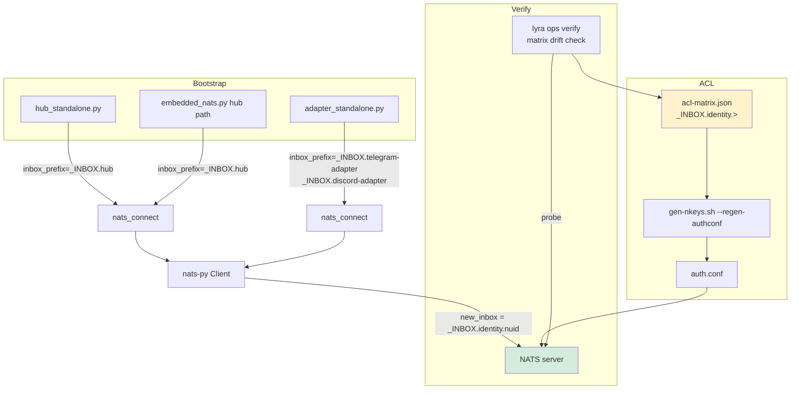
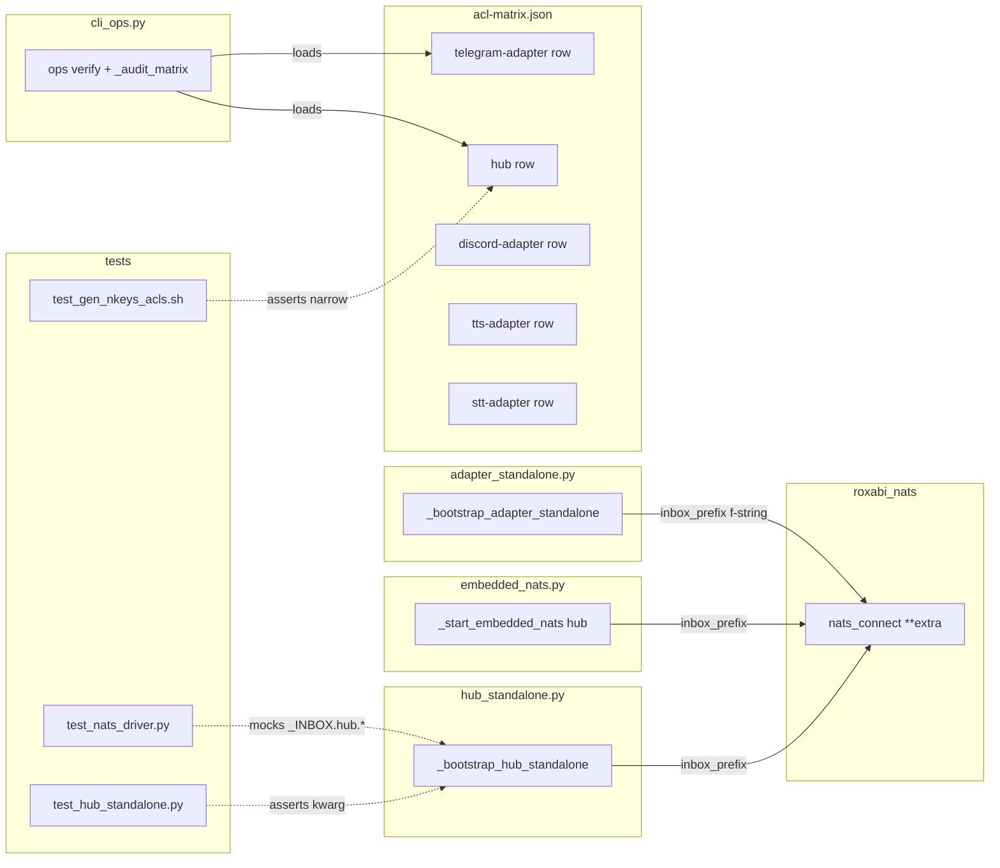

## Summary

Pass `inbox_prefix="_INBOX.<identity>"` at every lyra-owned `nats_connect` call site (hub standalone, embedded-NATS hub path, adapter standalone). Narrow `acl-matrix.json` subscribe grants for `hub`, `telegram-adapter`, `discord-adapter`, `tts-adapter`, `stt-adapter` from `_INBOX.>` to `_INBOX.<identity>.>` (plus lowercase variant where present). Update spec #706 + tests. Add matrix-level drift detection to `lyra ops verify`. Ship evidence of the server-side deny on M1.

## Architecture

### Data flow

### File × Function map

## Agents

| Agent | Tasks | Files |
|---|---|---|
| backend-dev | T1–T5, T8 | `src/lyra/bootstrap/standalone/hub_standalone.py`, `src/lyra/bootstrap/standalone/adapter_standalone.py`, `src/lyra/bootstrap/infra/embedded_nats.py`, `src/lyra/cli_ops.py` |
| devops | T6, T9, T12 | `deploy/nats/acl-matrix.json`, `tests/nats/test_gen_nkeys_acls.sh`, M1 rollout + `rollout-evidence.txt` |
| tester | T7, T10, T11 | `tests/llm/drivers/test_nats_driver.py`, `tests/nats/test_hub_standalone.py`, test for matrix drift |
| doc-writer | T13 | `artifacts/specs/706-per-role-nkeys-acls-spec.mdx` |

Satellite rows (voice-tts/voice-stt/image-worker) + SDK README update are out of scope per spec.

## Consistency Report

- Spec success criteria: 12 | Covered by tasks: 12 | Uncovered: 0.
- Affordance trace: U1→T1, U2→T3, U3→T2, N1→T6, N2→T13, N3→T9, N4→T7, N5→T12, S1→T8/T11.
- RED tasks precede GREEN within each slice.
- No criteria untraced. No exemptions.

## Slices

| Slice | Goal | Tasks |
|---|---|---|
| V1 | Hub + embedded connect sites + unit mocks | T1, T2, T4 (RED), T7 (RED), T5 (GREEN), T10 (GREEN), T-GATE-V1 |
| V2 | Adapter connect site | T3 (GREEN after V1 types land), T10b (test) |
| V3 | ACL narrow + regen tests + spec 706 | T6 (GREEN), T9 (RED→GREEN), T13 (GREEN), T-GATE-V3 |
| V4 | Drift detection + M1 rollout evidence | T8 (GREEN), T11 (RED→GREEN), T12 (MANUAL on M1), T-GATE-V4 |

Ordering: V1 ∥ V2 → V3 → V4.

## Micro-Tasks

### Slice V1 — Hub + embedded connect sites

**T4** [RED] [P] · tester · difficulty 2 · 3 min
- File: `tests/nats/test_hub_standalone.py`
- Description: Add test asserting `nats_connect` is called with `inbox_prefix="_INBOX.hub"` during `_bootstrap_hub_standalone`. Use existing mock pattern.
- Verify: `uv run pytest tests/nats/test_hub_standalone.py -k inbox_prefix -x`
- Expected: test fails (red) because call site does not yet pass kwarg.
- Spec trace: SC-1, U1

**T7** [RED] [P] · tester · difficulty 2 · 4 min
- File: `tests/llm/drivers/test_nats_driver.py`
- Description: Update mocks so `new_inbox()` returns `_INBOX.hub.<uuid>` and assert driver stream path subscribes under hub prefix. Existing tests return plain `_INBOX.<uuid>` — flip to hub-prefixed form.
- Verify: `uv run pytest tests/llm/drivers/test_nats_driver.py -x`
- Expected: Tests update; initially red against prod code if asserting prefix not yet wired, else green after mock flip only.
- Spec trace: SC-7

**T1** [GREEN] · backend-dev · difficulty 1 · 2 min
- File: `src/lyra/bootstrap/standalone/hub_standalone.py`
- Description: Pass `inbox_prefix="_INBOX.hub"` to `nats_connect(nats_url, ...)` in `_bootstrap_hub_standalone`.
- Verify: `grep -n 'inbox_prefix="_INBOX.hub"' src/lyra/bootstrap/standalone/hub_standalone.py`
- Expected: exactly 1 match.
- Spec trace: SC-1, U1

**T2** [GREEN] [P] · backend-dev · difficulty 1 · 3 min
- File: `src/lyra/bootstrap/infra/embedded_nats.py`
- Description: Pass `inbox_prefix="_INBOX.hub"` to the hub-path `nats_connect` call (line ~179). Leave any non-hub connects — if any — untouched.
- Verify: `grep -n 'inbox_prefix="_INBOX.hub"' src/lyra/bootstrap/infra/embedded_nats.py`
- Expected: exactly 1 match.
- Spec trace: SC-2, U3

**T5** [GREEN] · backend-dev · difficulty 1 · 2 min
- Verification task (chain): after T1+T2+T4+T7, run `uv run pytest tests/nats/test_hub_standalone.py tests/llm/drivers/test_nats_driver.py -x` → all green.
- Expected: tests pass.
- Spec trace: SC-1/2/7

**T-GATE-V1** [RED-GATE] · backend-dev · difficulty 1 · 1 min
- Verify: `uv run pytest tests/nats/ tests/llm/drivers/ -x && uv run pyright && uv run ruff check .`
- Expected: pass.

### Slice V2 — Adapter connect site

**T10b** [RED] · tester · difficulty 2 · 3 min
- File: `tests/nats/test_hub_standalone.py` (or a sibling adapter test file if present)
- Description: Add/extend test verifying `adapter_standalone._bootstrap_adapter_standalone(platform="telegram")` calls `nats_connect` with `inbox_prefix="_INBOX.telegram-adapter"` and similarly for `"discord"`.
- Verify: `uv run pytest tests/nats/ -k adapter_inbox_prefix -x`
- Expected: red before T3.
- Spec trace: SC-3, U2

**T3** [GREEN] · backend-dev · difficulty 1 · 3 min
- File: `src/lyra/bootstrap/standalone/adapter_standalone.py`
- Description: At the `nats_connect(nats_url)` call in `_bootstrap_adapter_standalone`, pass `inbox_prefix=f"_INBOX.{platform}-adapter"`. `platform` is already bound to `"telegram"` or `"discord"` at call time.
- Verify: `grep -nE 'inbox_prefix=f"_INBOX\\.\\{platform\\}-adapter"' src/lyra/bootstrap/standalone/adapter_standalone.py`
- Expected: 1 match.
- Spec trace: SC-3, U2

**T-GATE-V2** [RED-GATE] · tester · 1 min
- Verify: `uv run pytest tests/nats/ -x`
- Expected: pass.

### Slice V3 — ACL narrow + regen tests + spec 706

**T9** [RED→GREEN] · devops · difficulty 2 · 5 min
- File: `tests/nats/test_gen_nkeys_acls.sh`
- Description: Update the test to assert that for identities `hub`, `telegram-adapter`, `discord-adapter`, `tts-adapter`, `stt-adapter` the generated `auth.conf` contains `_INBOX.<identity>.>` (and the lowercase `_inbox.<identity>.>` where lowercase currently exists) and does NOT contain bare `_INBOX.>` for these. Satellite rows must still match `_INBOX.>` (untouched in this PR).
- Verify: `bash tests/nats/test_gen_nkeys_acls.sh`
- Expected: fails before T6 (red), passes after (green).
- Spec trace: SC-6, N3

**T6** [GREEN] · devops · difficulty 2 · 6 min
- File: `deploy/nats/acl-matrix.json`
- Description: For rows `hub`, `telegram-adapter`, `discord-adapter`, `tts-adapter`, `stt-adapter` replace every `_INBOX.>` with `_INBOX.<identity>.>`. For rows that include the lowercase `_inbox.>` variant (tts-adapter, stt-adapter) mirror the narrowing to `_inbox.<identity>.>`. Update row `description` fields to reference ADR-051 instead of the legacy "tighten in #715" / "tighten to per-identity inbox prefix tracked in #717" notes. Satellite rows (`voice-tts`, `voice-stt`, `image-worker`) unchanged; add a one-line description note that their narrowing is sequenced behind per-satellite connect-site PRs.
- Verify: `jq '.identities[] | select(.name=="hub") | .subscribe_allow' deploy/nats/acl-matrix.json` and same for each lyra-owned identity; `jq '.identities[] | select(.name=="voice-tts") | .publish_allow' deploy/nats/acl-matrix.json`.
- Expected: lyra-owned rows show `_INBOX.<identity>.>`; satellite rows unchanged.
- Spec trace: SC-4, SC-5, N1

**T13** [GREEN] [P] · doc-writer · difficulty 2 · 6 min
- File: `artifacts/specs/706-per-role-nkeys-acls-spec.mdx`
- Description: Update the §Data Model matrix so that for each lyra-owned identity the inbox grant is shown as `_INBOX.<identity>.>`; update the footnote `[^inbox-fix]` to reference ADR-051 and the `inbox_prefix` mechanism instead of the legacy wildcard rationale. Note that satellite row narrowing is tracked per-satellite PR.
- Verify: `grep -nE '_INBOX\\.hub\\.>' artifacts/specs/706-per-role-nkeys-acls-spec.mdx`
- Expected: matches present; no bare `_INBOX.>` remains for lyra-owned rows.
- Spec trace: SC-5, N2

**T-GATE-V3** [RED-GATE] · devops · 2 min
- Verify: `bash tests/nats/test_gen_nkeys_acls.sh && uv run pytest -x && uv run ruff check .`
- Expected: pass.

### Slice V4 — Drift detection + M1 rollout evidence

**T11** [RED] · tester · difficulty 2 · 4 min
- File: new test `tests/nats/test_ops_verify_matrix_drift.py` (or extend an existing cli_ops test file if present)
- Description: Write a unit test that loads a fixture matrix containing a residual `_INBOX.>` for a lyra-owned identity and asserts the new drift audit function returns a non-zero finding; and a clean fixture returns zero findings. Build fixtures inline.
- Verify: `uv run pytest tests/nats/test_ops_verify_matrix_drift.py -x`
- Expected: red before T8.
- Spec trace: SC-11, S1

**T8** [GREEN] · backend-dev · difficulty 3 · 12 min
- File: `src/lyra/cli_ops.py`
- Description: Add a small `_audit_matrix_inbox_drift(identities)` helper that iterates loaded matrix entries, flags any lyra-owned identity (hub, telegram-adapter, discord-adapter, tts-adapter, stt-adapter) that retains bare `_INBOX.>` or `_inbox.>` in any allow-list, and returns a list of `(identity, grant, direction)` findings. Call it at the start of `verify()`, print drift findings to stderr, and bump the exit code to non-zero if any finding is present (keep existing probe exit-code logic combined with this). Identity allow-list of lyra-owned identities is a module constant; satellite identities are explicitly excluded from the drift list.
- Verify: `uv run pytest tests/nats/test_ops_verify_matrix_drift.py -x && uv run pyright src/lyra/cli_ops.py`
- Expected: tests green; typecheck clean.
- Spec trace: SC-11, S1

**T12** [GREEN] [MANUAL-on-M1] · devops · difficulty 3 · 15 min
- Steps: On M1 after PR branch checked out: `sudo ./deploy/nats/gen-nkeys.sh --regen-authconf` → `sudo systemctl reload nats` → attempt a deliberate hub subscribe to `_INBOX.>` (via `nats sub` with hub seed) and capture `Subscription Violation` from `journalctl -u nats -S -1min`. Save command sequence + reload timestamp + captured log line to `rollout-evidence.txt` at repo root on the PR branch, then `uv run lyra ops verify` to confirm zero drift findings for lyra-owned identities (satellite rows may still be flagged; that is expected and documented).
- Verify: `cat rollout-evidence.txt | grep -i "Subscription Violation"`
- Expected: at least one line matching. File committed on the PR branch.
- Spec trace: SC-9, SC-10, SC-11, N5

**T-GATE-V4** [RED-GATE] · backend-dev · 2 min
- Verify: `uv run pytest -x && uv run ruff check . && uv run pyright && test -f rollout-evidence.txt`
- Expected: pass.

## Parallelization

- T4, T7, T10b, T11, T13 are `[P]` — independent test writes.
- T1, T2, T3 touch disjoint files and can be done concurrently by a single backend-dev (minor).
- T6 and T13 touch disjoint files (acl-matrix vs spec 706) → `[P]`.
- T12 requires M1 access → sequential and manual.

## Worktree

F-lite → worktree mandatory. Path: `.claude/worktrees/715-per-identity-nats-inbox-prefix`. Branch: `feat/715-per-identity-nats-inbox-prefix`.

## Task IDs

<!-- Generated by /plan. Used by /implement to resume tasks on session restart. -->
- T4: 11 — RED: test hub inbox_prefix kwarg
- T7: 12 — RED: flip driver inbox mocks to _INBOX.hub.*
- T1: 13 — GREEN: hub_standalone inbox_prefix=_INBOX.hub
- T2: 14 — GREEN: embedded_nats hub path inbox_prefix
- T5: 15 — GREEN: V1 unit test verification
- T-GATE-V1: 16 — pytest+pyright+ruff green
- T10b: 17 — RED: test adapter inbox_prefix per platform
- T3: 18 — GREEN: adapter_standalone inbox_prefix f-string
- T-GATE-V2: 19 — adapter unit tests green
- T9: 20 — RED→GREEN: gen-nkeys test asserts narrowed subjects
- T6: 21 — GREEN: narrow acl-matrix.json for lyra-owned identities
- T13: 22 — GREEN: update spec 706 data model + footnote
- T-GATE-V3: 23 — acl regen + pytest + ruff green
- T11: 24 — RED: test lyra ops verify drift detection
- T8: 25 — GREEN: add _audit_matrix_inbox_drift to cli_ops.verify
- T12: 26 — MANUAL: M1 rollout evidence (gen-nkeys + reload + deny capture)
- T-GATE-V4: 27 — full pytest+ruff+pyright + evidence file present
