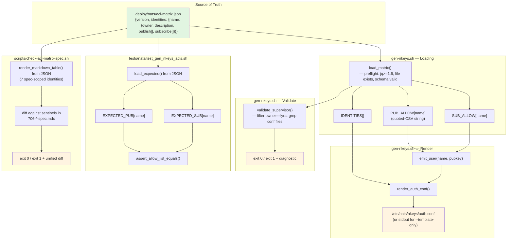
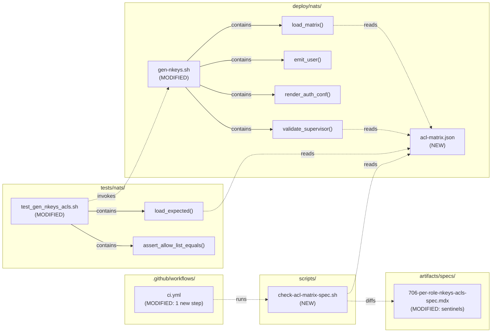

## Summary

Extract the NATS subject→identity ACL matrix from three duplicate copies (`gen-nkeys.sh` bash arrays · `test_gen_nkeys_acls.sh` expected arrays · #706 spec prose) into a single `deploy/nats/acl-matrix.json` consumed by all three, add a `--validate-supervisor` subcommand to `gen-nkeys.sh`, and add a CI drift-check that guards the #706 spec matrix against drift.

## Architecture

### Data Flow



### File × Function Map



## Bootstrap Context

No analysis artifact (F-lite). Spec contains full design. Key locked decisions from frame:
- **Spec sync strategy:** CI drift-check (not live-render) — preserves footnotes and narrative in #706 spec.
- **`--validate-supervisor` scope:** per-identity `owner` field drives check; covers both supervisor confs and quadlet containers (migration in progress).

## Agents

| Agent | Task count | Files |
|-------|-----------|-------|
| devops | 9 | `deploy/nats/acl-matrix.json`, `deploy/nats/gen-nkeys.sh`, `scripts/check-acl-matrix-spec.sh`, `.github/workflows/ci.yml` |
| tester | 3 | `tests/nats/test_gen_nkeys_acls.sh` |
| doc-writer | 1 | `artifacts/specs/706-per-role-nkeys-acls-spec.mdx` |

## Consistency Report

- Criteria covered: 23/23
- Uncovered criteria: none
- Tasks without spec backing: none
- Gold-plating exemptions applied: 0

## Slice Map

| Slice | Goal | Tasks | Dependencies |
|-------|------|-------|--------------|
| V1 | JSON + gen-nkeys.sh refactor (foundation) | T1–T4 | — |
| V2 | Test harness reads from JSON | T5–T6 | V1 |
| V3 | `--validate-supervisor` subcommand | T7–T8 | V1 |
| V4 | Spec drift-check + sentinels + CI wiring | T9–T12 | V1 |
| — | Final integration gate | T13 | V1, V2, V3, V4 |

V2, V3, V4 can run in parallel after V1 lands (they touch disjoint files: V2→test file, V3→gen-nkeys.sh additions, V4→new script + spec + ci.yml).

## Micro-Tasks

### Slice V1 — JSON + gen-nkeys.sh refactor (foundation)

**T1 [GREEN]** — Capture pre-refactor baseline auth.conf for byte-identical diff
- **Agent:** devops
- **File:** none (commit-time evidence)
- **Action:** `git show staging:deploy/nats/gen-nkeys.sh > /tmp/old-gen.sh && chmod +x /tmp/old-gen.sh && /tmp/old-gen.sh --template-only > /tmp/baseline.conf && wc -l /tmp/baseline.conf`
- **Verify:** `test -s /tmp/baseline.conf && grep -c '^    # [a-z-]\+$' /tmp/baseline.conf | grep -q '^10$'`
- **Expected:** 10 identity comment lines present in baseline
- **Time:** 2 min
- **Spec trace:** Slice 1 demo prerequisite
- **Difficulty:** 1
- **[P]** No (prerequisite for T4)

**T2 [GREEN]** — Create `deploy/nats/acl-matrix.json` with all 10 identities
- **Agent:** devops
- **File:** `deploy/nats/acl-matrix.json` (NEW)
- **Code skeleton:**
  ```json
  {
    "version": "1",
    "identities": {
      "hub": {
        "owner": "lyra",
        "description": "Central message router",
        "publish": ["lyra.outbound.telegram.>", "lyra.outbound.discord.>", "lyra.voice.tts.request.>", "lyra.voice.stt.request.>", "lyra.llm.request", "lyra.image.generate.request"],
        "subscribe": ["lyra.inbound.telegram.>", "lyra.inbound.discord.>", "lyra.voice.tts.heartbeat", "lyra.voice.stt.heartbeat", "lyra.llm.health.*", "lyra.system.ready", "_INBOX.>", "lyra.image.heartbeat"]
      },
      "telegram-adapter": { "owner": "lyra", "description": "...", "publish": [...], "subscribe": [...] },
      ...
      "monitor": { "owner": "reserved", "description": "Namespace placeholder (no process yet)", "publish": ["lyra.monitor.>"], "subscribe": ["lyra.monitor.>"] }
    }
  }
  ```
- **Owners:** `hub`, `telegram-adapter`, `discord-adapter`, `tts-adapter`, `stt-adapter` → `"lyra"`; `voice-tts`, `voice-stt` → `"voicecli"`; `image-worker` → `"imagecli"`; `llm-worker`, `monitor` → `"reserved"`.
- **Verify:** `jq '.version, (.identities | keys | length), (.identities | to_entries | all(.value | has("owner") and has("description") and has("publish") and has("subscribe")))' deploy/nats/acl-matrix.json`
- **Expected:** `"1"\n10\ntrue`
- **Time:** 8 min (transcribe 10 identities from current bash arrays verbatim)
- **Spec trace:** N1, SC "json exists with 10 identities"
- **Difficulty:** 2
- **[P]** No (T3, T5, T10 all depend on this)

**T3 [GREEN]** — Refactor `gen-nkeys.sh`: replace inline arrays with `load_matrix()` + preflight
- **Agent:** devops
- **File:** `deploy/nats/gen-nkeys.sh` (MODIFIED)
- **Action:**
  - Delete lines 36–94 (all `PUB_ALLOW[...]=`, `SUB_ALLOW[...]=`, `IDENTITIES=(...)` literals + explanatory comments; move the `[^inbox-fix]`-style comments to `description` fields in JSON if they name specific rationale).
  - Add `MATRIX_JSON="${SEEDS_DIR%/*}/../../projects/lyra/deploy/nats/acl-matrix.json"` resolution or a `REPO_ROOT`-relative path; pick the robust form that works from both `./deploy/nats/gen-nkeys.sh` and sudo-invocation.
  - Add `load_matrix()` that:
    1. Asserts `jq` exists and `jq --version` reports ≥ 1.6 (parse `jq-1.6` or `jq-1.7.1` style output).
    2. Asserts `MATRIX_JSON` exists.
    3. Asserts `.version == "1"`.
    4. Iterates identities; for each, populates `PUB_ALLOW[$name]=` and `SUB_ALLOW[$name]=` with pre-quoted CSV via: `jq -r '.identities["<name>"].publish | map("\"" + . + "\"") | join(",")'` — note plain `jq`, not `jq -S`.
    5. Populates `IDENTITIES=()` preserving JSON key order (use `jq -r '.identities | keys_unsorted[]'`).
    6. Validates each identity has `owner`, `description`, `publish`, `subscribe`, and `owner` ∈ enum.
    7. Aborts via `error()` with specific message on any failure.
  - Call `load_matrix` after flag parsing, before any code that reads `PUB_ALLOW` / `SUB_ALLOW` / `IDENTITIES`.
- **Verify:** `./deploy/nats/gen-nkeys.sh --template-only > /tmp/new.conf && diff /tmp/baseline.conf /tmp/new.conf`
- **Expected:** diff empty, exit 0
- **Time:** 10 min
- **Spec trace:** N2, N3, SC "zero inline data lines", SC "byte-identical template-only"
- **Difficulty:** 4
- **[P]** No (blocks T4, T5, T7, T8)

**T4 [RED-GATE]** — V1 gate: byte-identical + preflight failure modes
- **Agent:** devops
- **File:** none (verification only)
- **Action:** Run all four preflight failure modes:
  1. `diff /tmp/baseline.conf <(./deploy/nats/gen-nkeys.sh --template-only)` → empty
  2. `./deploy/nats/gen-nkeys.sh --template-only` with `MATRIX_JSON` temporarily renamed → exit 1, stderr names the missing file
  3. `PATH=/usr/bin:/bin ./deploy/nats/gen-nkeys.sh --template-only` with a shim `jq` in front that prints `jq-1.5` → exit 1, stderr names "jq >= 1.6"
  4. Temporarily edit JSON to set `.version = "2"` → exit 1, stderr names the unsupported version
  5. Temporarily remove `.identities.hub.owner` → exit 1, stderr names `hub` and `owner`
- **Verify:** all 5 sub-checks produce the expected outcomes
- **Expected:** all pass
- **Time:** 5 min
- **Spec trace:** SC "byte-identical", SC "exits 1 naming missing file / jq / version / identity"
- **Difficulty:** 2
- **[P]** No

### Slice V2 — Test harness reads from JSON (depends on V1)

**T5 [GREEN]** — Refactor `tests/nats/test_gen_nkeys_acls.sh` — load expected arrays from JSON
- **Agent:** tester
- **File:** `tests/nats/test_gen_nkeys_acls.sh` (MODIFIED)
- **Action:**
  - Delete lines 33–57 (`EXPECTED_PUB[...]=`, `EXPECTED_SUB[...]=`, `IDENTITIES=(...)` literals + the "if spec changes update both" comment).
  - Add a small loader early in the script (after `cd "$(dirname …)"` and existence check):
    ```bash
    declare -A EXPECTED_PUB EXPECTED_SUB
    IDENTITIES=()
    while IFS= read -r name; do
      IDENTITIES+=("$name")
      EXPECTED_PUB[$name]=$(jq -r --arg n "$name" '.identities[$n].publish | join(" ")' deploy/nats/acl-matrix.json)
      EXPECTED_SUB[$name]=$(jq -r --arg n "$name" '.identities[$n].subscribe | join(" ")' deploy/nats/acl-matrix.json)
    done < <(jq -r '.identities | keys_unsorted[]' deploy/nats/acl-matrix.json)
    ```
  - Keep everything else (extract_block, assert_allow_list_equals, the #754 block, assertions a–g) unchanged.
- **Verify:** `bash tests/nats/test_gen_nkeys_acls.sh` exits 0 and prints "PASS: all 7 assertions (a–g)" + "PASS (#754)"
- **Expected:** test passes; note: the previously stale `EXPECTED_SUB[telegram-adapter]` drift is implicitly resolved (script and test now read the same bytes — the `_INBOX.>` that the script already produces is matched because JSON has it).
- **Time:** 8 min
- **Spec trace:** N5, SC "test passes, EXPECTED_* loaded from JSON"
- **Difficulty:** 3
- **[P]** Yes (with T7, T9, T10, T11)

**T6 [RED-GATE]** — V2 gate: test + drift-demonstration
- **Agent:** tester
- **File:** none
- **Action:**
  1. `bash tests/nats/test_gen_nkeys_acls.sh` → exit 0
  2. Temporarily add `"lyra.unexpected"` to `acl-matrix.json`'s `hub.subscribe` array → re-run test → expect FAIL at assertion (c), naming `hub` and the unexpected subject
  3. Revert the JSON edit
- **Verify:** both runs produce expected outcomes
- **Expected:** pass/fail/pass cycle
- **Time:** 3 min
- **Spec trace:** SC "test passes without modification to assertion logic"
- **Difficulty:** 1
- **[P]** No

### Slice V3 — `--validate-supervisor` subcommand (depends on V1, parallel with V2/V4)

**T7 [GREEN]** — Add `--validate-supervisor` flag parsing + implementation
- **Agent:** devops
- **File:** `deploy/nats/gen-nkeys.sh` (MODIFIED)
- **Action:**
  - Add `VALIDATE_SUPERVISOR=false` to flag section.
  - Add `--validate-supervisor) VALIDATE_SUPERVISOR=true; shift ;;` to the case block.
  - Update the script header usage comment with the new flag + behavior.
  - Add a `validate_supervisor()` function that:
    1. Iterates `IDENTITIES[]`; filters to those where owner == `"lyra"` (re-reads via `jq -r '.identities["<name>"].owner'` or caches an `OWNER[]` map in `load_matrix`).
    2. For each lyra-owned identity, greps `deploy/supervisor/conf.d/*.conf` AND `deploy/quadlet/*.container` for `NATS_NKEY_SEED_PATH=.*<name>\.seed` OR `NATS_NKEY_SEED_PATH="[^"]*<name>\.seed"`.
    3. If any lyra-owned identity has zero matches, append to `missing` list.
    4. On `len(missing) > 0`: print each with its identity name, exit 1.
    5. On success: print `validated <N> lyra-owned identities across supervisor + quadlet`, exit 0.
  - Dispatch: if `$VALIDATE_SUPERVISOR` → call `validate_supervisor` (after `load_matrix`) and `exit`.
- **Verify:** `./deploy/nats/gen-nkeys.sh --validate-supervisor` → exit 0, stdout "validated 5 lyra-owned identities across supervisor + quadlet"
- **Expected:** exit 0, message as stated
- **Time:** 10 min
- **Spec trace:** N4, SC "validate-supervisor exit 0 on clean checkout"
- **Difficulty:** 3
- **[P]** Yes (with T5, T9, T10, T11) — but must not be concurrent with other `gen-nkeys.sh` edits; parallel-safe w.r.t. files outside this script.

**T8 [RED-GATE]** — V3 gate: validate-supervisor positive + negative cases
- **Agent:** devops
- **File:** none
- **Action:**
  1. `./deploy/nats/gen-nkeys.sh --validate-supervisor` → exit 0, "validated 5 lyra-owned identities"
  2. Temporarily edit `deploy/supervisor/conf.d/lyra_hub.conf`: remove `NATS_NKEY_SEED_PATH=...` from the `environment=` line; `git diff` for reference; re-run → exit 1, names `hub`
  3. Revert the edit (`git checkout -- deploy/supervisor/conf.d/lyra_hub.conf`)
  4. `./deploy/nats/gen-nkeys.sh --validate-supervisor` runs without root (current shell, no sudo) and performs no filesystem writes (verify via `inotifywatch` optional; at minimum, check exit 0 in a user shell)
- **Verify:** all 4 sub-checks pass
- **Expected:** positive/negative/revert/no-root all pass
- **Time:** 5 min
- **Spec trace:** SC "removing seed path makes it exit 1", SC "no root, no writes"
- **Difficulty:** 2
- **[P]** No

### Slice V4 — Spec drift-check + sentinels + CI wiring (depends on V1, parallel with V2/V3)

**T9 [GREEN]** — Add sentinel markers around the ACL matrix table in #706 spec
- **Agent:** doc-writer
- **File:** `artifacts/specs/706-per-role-nkeys-acls-spec.mdx` (MODIFIED)
- **Action:**
  - Insert `<!-- acl-matrix:begin -->` immediately **before** the line `| Subject | hub | telegram-adapter | … |` (currently line 83).
  - Insert `<!-- acl-matrix:end -->` immediately **after** the last data row `| \`lyra.monitor.>\` (reserved) [^monitor] | … |` (currently line 97).
  - Do NOT move or edit the footnotes (`[^ready]` through `[^inbox-fix]`, lines 99–104) — they stay outside the sentinels.
  - Do NOT modify the mermaid `flowchart LR` that follows.
- **Verify:** `grep -c 'acl-matrix:begin\|acl-matrix:end' artifacts/specs/706-per-role-nkeys-acls-spec.mdx`
- **Expected:** `2`
- **Time:** 2 min
- **Spec trace:** N7, SC "sentinels bracket only the matrix table"
- **Difficulty:** 1
- **[P]** Yes (with T5, T7, T10, T11)

**T10 [GREEN]** — Create `scripts/check-acl-matrix-spec.sh`
- **Agent:** devops
- **File:** `scripts/check-acl-matrix-spec.sh` (NEW)
- **Code skeleton:**
  ```bash
  #!/usr/bin/env bash
  # Drift-check: renders the #706 spec's matrix table from acl-matrix.json
  # and diffs it against the sentinel-bracketed block in the spec.
  # Exits 0 on match, 1 on drift (with unified diff).
  set -euo pipefail

  JSON="deploy/nats/acl-matrix.json"
  SPEC="artifacts/specs/706-per-role-nkeys-acls-spec.mdx"
  SCOPED=(hub telegram-adapter discord-adapter tts-adapter stt-adapter llm-worker monitor)

  render_table() {
    # Emit header row + separator + one row per subject appearing in any scoped identity
    # Columns: Subject | hub | telegram-adapter | … | monitor
    # Cell values: PUB | SUB | PUB+SUB | —
    jq -r --argjson scoped "$(printf '%s\n' "${SCOPED[@]}" | jq -R . | jq -s .)" '...' "$JSON"
    # Implementation: gather the union of (scoped_identity.publish + .subscribe) subjects,
    # for each subject and each scoped identity emit PUB/SUB/PUB+SUB/—
  }

  extract_sentinel_block() {
    awk '/<!-- acl-matrix:begin -->/,/<!-- acl-matrix:end -->/' "$SPEC" \
      | grep -v 'acl-matrix:begin\|acl-matrix:end'
  }

  rendered=$(render_table)
  actual=$(extract_sentinel_block)
  diff -u <(echo "$actual") <(echo "$rendered") || exit 1
  ```
- **Constraints:**
  - Scope to the 7 identities listed in the #706 spec (`SCOPED`), not all 10 in the JSON.
  - Row order: subjects sorted in the same order as they appear in the current spec (hard-code via explicit subject list in the script, matching lines 85–97 of `706-*-spec.mdx`). This is necessary because JSON iteration cannot produce the spec's human-chosen row order.
  - Cell value rule: if subject in identity.publish → `PUB`; if in identity.subscribe → `SUB`; if both → `PUB+SUB`; else `—`. Footnote anchors (`[^ready]` etc.) are hardcoded in the subject column of the output.
- **Verify:** `bash scripts/check-acl-matrix-spec.sh; echo $?`
- **Expected:** `0`
- **Time:** 10 min (the rendering logic is the tricky part; subject + footnote ordering is hardcoded)
- **Spec trace:** N6, SC "exits 0 on clean checkout"
- **Difficulty:** 4
- **[P]** Yes (with T5, T7, T9, T11)

**T11 [GREEN]** — Add CI step for the drift-check
- **Agent:** devops
- **File:** `.github/workflows/ci.yml` (MODIFIED)
- **Action:** Insert between current lines 62 (end of `Check supervisor conf drift`) and 64 (`- name: Enforce import layers`):
  ```yaml
        - name: Check ACL matrix spec drift
          run: bash scripts/check-acl-matrix-spec.sh
  ```
- **Verify:** `grep -n 'Check ACL matrix spec drift' .github/workflows/ci.yml` → exactly 1 match; run the step locally via `act` or re-read the workflow YAML to confirm positioning.
- **Expected:** the step is positioned after supervisor-drift and before import-layers; `yaml-lint` or `actionlint` (if available) passes.
- **Time:** 2 min
- **Spec trace:** N8, SC "ci.yml has named step between supervisor-drift and import-layers"
- **Difficulty:** 1
- **[P]** Yes (with T5, T7, T9, T10)

**T12 [RED-GATE]** — V4 gate: drift-check positive + negative
- **Agent:** devops
- **File:** none
- **Action:**
  1. `bash scripts/check-acl-matrix-spec.sh` on clean checkout → exit 0
  2. Temporarily edit `artifacts/specs/706-per-role-nkeys-acls-spec.mdx`: change one cell inside the sentinel block from `SUB` to `PUB`; re-run → exit 1, unified diff printed
  3. Revert via `git checkout -- artifacts/specs/706-per-role-nkeys-acls-spec.mdx`
  4. Inverse: temporarily edit `deploy/nats/acl-matrix.json` to add one subject to `hub.publish`; re-run → exit 1, unified diff
  5. Revert
- **Verify:** 4 sub-checks pass in sequence
- **Expected:** pass/fail/pass/fail/pass
- **Time:** 4 min
- **Spec trace:** SC "mutating a cell inside sentinels makes it exit 1 with unified diff"
- **Difficulty:** 1
- **[P]** No

### Final integration gate

**T13 [GREEN]** — Full-suite regression gate
- **Agent:** tester
- **File:** none
- **Action:**
  1. `bash tests/nats/test_gen_nkeys_acls.sh` → exit 0
  2. `bash scripts/check-acl-matrix-spec.sh` → exit 0
  3. `./deploy/nats/gen-nkeys.sh --validate-supervisor` → exit 0
  4. `./deploy/nats/gen-nkeys.sh --template-only | diff /tmp/baseline.conf -` → empty
  5. `./deploy/nats/gen-nkeys.sh --show` → no error (requires existing `~/.lyra/nkeys/`; skip this sub-check locally if unavailable, note in PR)
  6. `uv run pytest -q` → passes (guard: no Python code was touched)
  7. `uv run ruff check .` → passes
- **Verify:** all 7 steps succeed
- **Expected:** clean green across the board
- **Time:** 5 min
- **Spec trace:** SC "no regressions — pytest passes", SC "--show / --fix-perms still work"
- **Difficulty:** 1
- **[P]** No (final gate)

## Task IDs

<!-- Generated by /plan. Used by /implement to resume tasks on session restart. -->
- T1: 12 — Capture pre-refactor baseline auth.conf
- T2: 13 — Create deploy/nats/acl-matrix.json with 10 identities
- T3: 14 — Refactor gen-nkeys.sh — load_matrix() + preflight
- T4: 15 — V1 gate — byte-identical + preflight failure modes
- T5: 16 — Refactor test_gen_nkeys_acls.sh — load EXPECTED arrays from JSON
- T6: 17 — V2 gate — test + drift-demonstration
- T7: 18 — Add --validate-supervisor subcommand
- T8: 19 — V3 gate — validate-supervisor positive + negative
- T9: 20 — Add sentinel markers around ACL matrix in #706 spec
- T10: 21 — Create scripts/check-acl-matrix-spec.sh
- T11: 22 — Add CI step "Check ACL matrix spec drift"
- T12: 23 — V4 gate — drift-check positive + negative
- T13: 24 — Final integration gate — full suite regression
